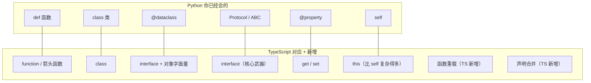

## 前置知识：你已经知道的，和将要学的

Python 和 TypeScript 的函数/类概念高度相似——参数、返回值、继承、多态都有。**真正需要学的新东西只有几处**：箭头函数、`this` 绑定、函数重载、interface、声明合并。



> [!important] 本篇核心认知
> • 函数定义方式 80% 相似，差异在于**箭头函数**和 **this 绑定**
> • interface 是 TypeScript 最核心的概念，Python 用 Protocol 实现了类似功能
> • class 语法几乎一致，但 TS 的 class 没有多重继承
> • **this 是 Python 开发者最容易踩的坑**——它和 Python 的 `self` 行为不同

---

## 1. 函数：从 def 到 function / 箭头函数

### 1.1 函数定义对比

```python
# Python
def add(a: int, b: int) -> int:
    return a + b

# 带默认值
def greet(name: str = "World") -> str:
    return f"Hello, {name}"

# 可变参数
def sum_nums(*nums: int) -> int:
    return sum(nums)
```

```typescript
// TypeScript 等价写法

// 方式一：function 声明（等价 def）
function add(a: number, b: number): number {
  return a + b;
}

// 方式二：箭头函数（等价 lambda，但更强大）
const add2 = (a: number, b: number): number => a + b;

// 带默认值
function greet(name: string = "World"): string {
  return `Hello, ${name}`;
}

// 可变参数（rest 参数）
function sumNums(...nums: number[]): number {
  return nums.reduce((acc, n) => acc + n, 0);
}
```

| 特性 | Python | TypeScript | 差异 |
|------|--------|-----------|------|
| 函数声明 | `def` | `function` / `=>` | TS 更多样 |
| 参数类型 | `a: int` | `a: number` | 语法一致 |
| 返回值类型 | `-> int` | `: number` | 位置不同 |
| 默认参数 | `x: int = 10` | `x: number = 10` | 一致 |
| 可选参数 | `Optional[str] = None` | `x?: string` | TS 用 `?` 更简洁 |
| 可变参数 | `*args: str` | `...args: string[]` | 语法不同 |
| 关键字参数 | `**kwargs` | 无直接等价 | 见下文 |
| 函数重载 | `@overload`（仅类型提示） | 语言级支持 | TS 更强大 |

### 1.2 箭头函数（Python lambda 的增强版）

```typescript
// 普通函数
function add1(a: number, b: number): number {
  return a + b;
}

// 箭头函数（函数表达式）
const add2 = (a: number, b: number): number => a + b;

// 多行需用 {} 和 return
const add3 = (a: number, b: number): number => {
  const result = a + b;
  return result;
};

// 箭头函数作为回调（非常常见）
const nums = [1, 2, 3];
const doubled = nums.map(n => n * 2);  // [2, 4, 6]
// Python: doubled = [n * 2 for n in nums]
```

> [!important] 箭头函数 vs 普通函数
> 1. **this 绑定不同**：箭头函数没有自己的 `this`，继承外层 `this`
> 2. **不能作为构造函数**：箭头函数不能用 `new`
> 3. **语法更简洁**：适合回调和函数式编程
> 4. Python 的 lambda 只能写表达式，TS 的箭头函数可以写完整函数体

### 1.3 Python 的 **kwargs 在 TS 中如何实现

```python
# Python 的 **kwargs
from typing import Any
def log(level: str, **kwargs: Any) -> None:
    print(f"[{level}] {kwargs}")

log("info", user="alice", action="login")
```

```typescript
// TypeScript：用结构化的对象参数替代 **kwargs
interface LogOptions {
  user: string;
  action: string;
  timestamp?: number;
}

function log(level: string, options: LogOptions): void {
  console.log(`[${level}]`, options);
}

log("info", { user: "alice", action: "login" });
```

> [!tip] 迁移提示
> Python 的 `**kwargs` 灵活性来自动态类型，TS 推荐用**结构化的对象参数**替代，类型更安全。

### 1.4 函数类型与高阶函数

```python
# Python 高阶函数
from typing import Callable
def make_multiplier(factor: int) -> Callable[[int], int]:
    def multiply(x: int) -> int:
        return x * factor
    return multiply
double = make_multiplier(2)
```

```typescript
// TypeScript 高阶函数
function makeMultiplier(factor: number): (x: number) => number {
  return x => x * factor;
}
const double = makeMultiplier(2);
console.log(double(5));  // 10

// 类型别名
type BinaryOp = (a: number, b: number) => number;
const add: BinaryOp = (a, b) => a + b;
```

### 1.5 函数重载（TS 独有）

Python 不支持真正的函数重载（`@overload` 仅做类型提示，运行时无效），TS 支持编译时重载：

```typescript
// ★ 重载签名（只有声明，没有实现）
function format(value: string): string;
function format(value: number, decimals?: number): string;
function format(value: boolean): string;

// 实现签名（必须兼容所有重载签名）
function format(value: string | number | boolean, decimals?: number): string {
  if (typeof value === "string") return value.toUpperCase();
  if (typeof value === "number") return value.toFixed(decimals ?? 2);
  return value ? "yes" : "no";
}

// 调用时 TS 根据参数类型自动匹配签名
format("hello");      // → "HELLO"（返回 string）
format(3.14159, 2);   // → "3.14"（返回 string）
format(true);         // → "yes"（返回 string）
// format(true, 2);   // ❌ 报错：boolean 重载不接受第二个参数
```

> [!tip] Python 开发者记忆法
> Python 靠 `@overload` 装饰器做类型提示（仅 mypy 检查，运行时无效）。TypeScript 的函数重载是**编译时特性**，运行时只有一份实现代码。**实现签名不对外可见**——外部只能看到重载签名。

---

## 2. this 绑定：Python 开发者最大痛点

Python 的 `self` 是显式的、永远不会丢失的。TS（JS）的 `this` 是**隐式的、由调用方式决定的**。

```python
# Python：self 永远指向实例，绑定确定
class Counter:
    def __init__(self):
        self.count = 0
    def increment(self):  # self 自动绑定
        self.count += 1
    def get_callback(self):
        return self.increment  # 即使传出去，self 仍绑定
```

```typescript
// TypeScript：this 绑定由调用方式决定！
class Counter {
  count = 0;

  // 方式一：普通方法（this 可能丢失）
  increment() {
    this.count++;
  }

  // 方式二：箭头函数属性（this 永远绑定实例，推荐）
  incrementArrow = () => {
    this.count++;
  };

  getCallback() {
    return this.increment;       // ❌ 提取后 this 会丢失！
    // return this.incrementArrow;  // ✅ this 保持绑定
  }
}

const c = new Counter();
const cb = c.getCallback();
cb();  // ❌ this 是 undefined，报错！

// ===== 解决方案 1：箭头函数属性（推荐） =====
class Counter2 {
  count = 0;
  increment = () => { this.count++; };
}
const c2 = new Counter2();
const cb2 = c2.increment;
cb2();  // ✅ this 绑定在定义时确定

// ===== 解决方案 2：bind =====
const bound = c.increment.bind(c);
bound();  // ✅
```

| 场景 | Python `self` | TypeScript `this` |
|------|--------------|-------------------|
| 方法内直接调用 | ✅ 自动绑定 | ✅ 绑定当前对象 |
| 作为回调传递 | ✅ 仍绑定实例 | ❌ this 丢失！ |
| 赋值给变量 | ✅ 仍绑定实例 | ❌ this 丢失！ |
| 箭头函数属性 | 不适用 | ✅ 永远绑定定义时的 this |

> [!warning] this 是 Python 开发者最容易踩的坑
> Python 的 `self` 是通过参数传递的，永远不会"丢失"。但 JS/TS 的 `this` 由调用方式决定，作为回调传入时容易丢失。
>
> **经验法则：凡是要作为回调传递的方法，都用箭头函数属性** `handleClick = () => { ... }`。

### 2.1 this 参数类型标注（TS 独有）

```typescript
// 在 TS 中可以给函数声明 this 参数类型（伪参数，编译后不产生代码）
function sayHello(this: { name: string }) {
  console.log(`Hello, ${this.name}`);
}

const user = { name: "Alice" };
sayHello.call(user);  // ✅
// sayHello();        // ❌ 编译报错：this 类型不匹配
```

---

## 3. Interface：TypeScript 最核心的概念

### 3.1 Interface vs Python Protocol

Python 3.8+ 有 `Protocol`，TS 有 `interface`：

```python
# Python Protocol
from typing import Protocol

class UserLike(Protocol):
    name: str
    age: int
    def greet(self) -> str: ...

class RealUser:
    name = "Alice"
    age = 25
    def greet(self) -> str:
        return f"Hi, I'm {self.name}"

# 鸭子类型：RealUser 隐式满足 UserLike（无需显式声明）
```

```typescript
// TypeScript interface
interface UserLike {
  name: string;
  age: number;
  greet(): string;
}

// 鸭子类型：只要对象结构匹配就 OK，无需 implements 声明
const alice = { name: "Alice", age: 25, greet: () => "Hi, I'm Alice" };
const user: UserLike = alice;  // ✅ 结构匹配
```

> [!important] interface vs Protocol
> • 两者都是**隐式实现**——不需要显式声明 implements
> • TS 的 interface 是**编译时**概念，不产生任何运行时代码
> • Python 的 Protocol 是**运行时**概念，可用于 `isinstance` 检查
> • TS 的 interface 支持**声明合并**（同名自动合并），Python 不支持

### 3.2 Interface 进阶特性

```typescript
// ===== 可选属性与只读属性 =====
interface Config {
  port: number;                // 必填
  host?: string;               // 可选（等价 Python Optional）
  readonly apiKey: string;     // 只读（创建后不可修改）
}

// ===== 索引签名（类似 Python dict） =====
interface StringMap {
  [key: string]: string;  // 等价 Python: dict[str, str]
}

// ===== 调用签名（函数也可以有属性） =====
interface Comparator {
  (a: number, b: number): number;  // 调用签名
  description: string;              // 属性
}

// ===== 声明合并（TS 独有！） =====
interface Window {
  title: string;
}
interface Window {
  ts: string;  // 自动合并！不会覆盖
}
// 最终 Window 同时有 title 和 ts
```

> [!tip] 声明合并：扩展第三方库类型的利器
> 同名 interface 会自动合并。这在**扩展第三方库类型**时非常有用——你可以在自己的代码中追加类型声明，而不需要修改库源码。

### 3.3 Interface vs Type

```typescript
// ===== 两者大部分情况等价 =====
interface User { name: string; age: number; }
type User2 = { name: string; age: number; };

// ===== type 可以做（interface 不行）=====
type Status = "active" | "inactive";    // 联合类型
type Admin = User & { role: string };  // 交叉类型
type ID = string | number;              // 基本类型别名
type Point = [number, number];          // 元组类型

// ===== interface 可以做（type 不行）=====
interface User { name: string; }
interface User { age: number; }  // 声明合并！User 同时有 name 和 age
interface Admin2 extends User { permissions: string[]; }  // extends 继承
```

| 特性 | `interface` | `type` |
|------|-----------|--------|
| 声明合并 | ✅ 支持 | ❌ 不支持 |
| 联合/交叉类型 | ❌ 不支持 | ✅ 支持 |
| 基本类型别名 | ❌ 不支持 | ✅ 支持 |
| extends 继承 | ✅ 支持 | 用 `&` 交叉 |
| 扩展第三方库 | ✅ 推荐 | ❌ 不推荐 |
| 官方推荐 | 对象类型 | 其他类型 |

> [!tip] 选用原则
> • 描述**对象形状**和**API 契约** → 优先 `interface`（可声明合并，扩展性好）
> • 需要**联合/交叉/条件类型** → 用 `type`
> • 不确定时用 `interface`

---

## 4. Class：从 Python 类到 TypeScript 类

### 4.1 基本类定义对比

```python
# Python
class Animal:
    def __init__(self, name: str, age: int = 0):
        self.name = name
        self.age = age
    def speak(self) -> str:
        return f"{self.name} makes a sound"

class Dog(Animal):
    def __init__(self, name: str, breed: str, age: int = 0):
        super().__init__(name, age)
        self.breed = breed
    def speak(self) -> str:
        return f"{self.name} barks"
```

```typescript
// TypeScript 等价
class Animal {
  constructor(
    public name: string,   // ★ 参数属性：自动声明并赋值 this.name
    public age: number = 0
  ) {}

  speak(): string {
    return `${this.name} makes a sound`;
  }
}

class Dog extends Animal {
  constructor(
    name: string,
    public breed: string,  // ★ 参数属性
    age: number = 0
  ) {
    super(name, age);  // ★ 必须先调用 super()！
  }

  speak(): string {
    return `${this.name} barks`;
  }
}
```

### 4.2 参数属性（TS 独有简洁语法）

```typescript
// ★ TypeScript 独有：构造函数参数前加修饰符，自动成为类属性
class User {
  constructor(
    public name: string,        // 自动 this.name = name
    private password: string,   // 自动 this.password = password（私有）
    readonly createdAt: Date = new Date()  // 只读
  ) {}
}

// 等价 Python：
// class User:
//     def __init__(self, name: str, password: str):
//         self.name = name
//         self._password = password
```

### 4.3 访问修饰符对比

```typescript
class Example {
  public a: string;        // 公开（默认，等价 Python 普通属性）
  private b: string;       // 私有（编译时检查）
  protected c: string;     // 受保护（子类可访问）
  readonly d: string;      // 只读
  static e: string;        // 静态（类似 Python 类变量）
  #f: string;              // ★ JS 原生 # 私有（运行时强制）
}
```

| Python | TypeScript | 差异 |
|--------|-----------|------|
| `_attr`（约定） | `private` | Python 是约定，TS 编译时强制 |
| `__attr`（名称修饰） | `#attr` | 两者都更接近真正私有 |
| `@property` | `get` / `set` | 语法不同 |
| `@staticmethod` | `static` | 一致 |
| `@classmethod` | 无直接等价 | TS 核心差异 |
| `@dataclass` | `interface` + 对象字面量 | 无自动生成 |
| 多重继承 | 不支持 | 接口 + 组合替代 |

> [!warning] private 不是真正的私有
> TS 的 `private` 只在编译时生效，编译后的 JS 代码中仍然可以访问。如需真正的运行时私有，用 JS 的 `#` 私有字段（`#name`）。

### 4.4 getter / setter

```python
# Python
class Person:
    def __init__(self, name: str):
        self._name = name
    @property
    def name(self) -> str:
        return self._name
    @name.setter
    def name(self, value: str):
        if not value: raise ValueError("Name cannot be empty")
        self._name = value
```

```typescript
// TypeScript
class Person {
  private _name: string;
  constructor(name: string) { this._name = name; }

  get name(): string {
    return this._name;
  }
  set name(value: string) {
    if (!value) throw new Error("Name cannot be empty");
    this._name = value;
  }
}
```

### 4.5 抽象类

```typescript
// TS 有 abstract 关键字（Python 用 ABC + @abstractmethod）
abstract class Shape {
  abstract getArea(): number;  // 抽象方法，子类必须实现
  describe(): string {
    return `面积: ${this.getArea()}`;
  }
}

class Circle extends Shape {
  constructor(private radius: number) { super(); }
  getArea(): number {
    return Math.PI * this.radius ** 2;
  }
}
```

### 4.6 多重继承：Python 有，TS 没有

```python
# Python: 多重继承
class Flyable:
    def fly(self) -> str: return "I can fly"
class Swimmable:
    def swim(self) -> str: return "I can swim"
class Duck(Flyable, Swimmable):  # 多重继承
    pass
```

```typescript
// ❌ TypeScript 不支持多重继承
// class Duck extends Flyable, Swimmable {}  // 编译错误

// ✅ 解决方案：接口 + 组合
interface Flyable { fly(): string; }
interface Swimmable { swim(): string; }

class Duck implements Flyable, Swimmable {  // 可实现多个接口
  fly(): string { return "I can fly"; }
  swim(): string { return "I can swim"; }
}
```

### 4.7 用 Interface 替代 @dataclass

```python
# Python: @dataclass 自动生成 __init__、__repr__、__eq__
from dataclasses import dataclass
@dataclass
class User:
    name: str
    age: int
    email: str | None = None
```

```typescript
// TypeScript 没有 @dataclass，但有多种等价方案

// 方案一：interface + 对象字面量（最常用，编译时擦除，无运行时开销）
interface User {
  name: string;
  age: number;
  email?: string;
}
const user: User = { name: "Alice", age: 25 };

// 方案二：class + 参数属性（需要方法时）
class UserClass {
  constructor(
    public name: string,
    public age: number,
    public email?: string
  ) {}
}
```

| 特性 | Python `@dataclass` | TS interface + 对象 | TS class |
|------|---------------------|---------------------|----------|
| 自动 `__init__` | ✅ | 不适用（直接字面量） | 手动/参数属性 |
| 自动 `__repr__` | ✅ | 不适用 | 手动 |
| 自动 `__eq__` | ✅ | 不适用 | 手动 |
| 运行时开销 | 有 | 无（编译擦除） | 有 |

---

## 5. Python 有但 TS 没有的 OOP 特性

| Python 特性 | TS 现状 | 替代方案 |
|-----------|--------|---------|
| 多重继承 | ❌ 不支持 | 接口 + 组合 / Mixin 模式 |
| 元类（metaclass） | ❌ 不支持 | 装饰器（有限） |
| `@classmethod` | ❌ 无 | 静态方法 + 手动传类 |
| 猴子补丁 | ❌ 不支持 | 设计模式重构 |
| `__slots__` | ❌ 不需要 | JS 引擎自动优化 |
| 上下文管理器（`with`） | ⚠️ TS 5.2+ 有 `using` | `try/finally` 或 `using` |
| `__getattr__` | ❌ 无 | Proxy |
| 描述符（descriptor） | ❌ 无 | getter/setter |
| 无限制装饰器 | ⚠️ TS 装饰器有限 | Stage 3 TC39 装饰器 |

---

## 常见易错点

> [!warning] **坑 1：箭头函数不能当构造函数**
> ```typescript
> const Person = (name: string) => { this.name = name; };
> // const p = new Person("Alice");  // ❌ TypeError: Person is not a constructor
> ```
> **为什么错**：箭头函数没有 `prototype`，不能用 `new`
> **解决方案**：需要构造函数的用 `class` 或普通 `function`

> [!warning] **坑 2：this 在回调中丢失**
> ```typescript
> class Counter {
>   count = 0;
>   increment() { this.count++; }
> }
> const c = new Counter();
> setTimeout(c.increment, 100);  // ❌ this 指向 globalThis
> // 修复：
> setTimeout(() => c.increment(), 100);  // ✅
> ```
> **为什么错**：函数作为参数传入时，`this` 不再指向原对象
> **解决方案**：用箭头函数回调，或在类中用箭头函数属性定义方法

> [!warning] **坑 3：可选参数和默认值混用**
> ```typescript
> function greet(name: string, greeting?: string = "Hello") {  // ❌ 错误！
>   // ...
> }
> // ✅ 正确写法：要么给默认值，要么标可选，不要同时用
> function greet(name: string, greeting: string = "Hello") {}
> ```
> **为什么错**：`?` 和默认值不能同时用
> **解决方案**：给默认值就不需要 `?`

> [!warning] **坑 4：函数重载的实现签名不对外可见**
> ```typescript
> function fn(x: string): string;
> function fn(x: number): number;
> function fn(x: string | number): string | number { return x; }  // 实现签名
> fn("hi");  // ✅ 类型是 string
> fn(42);    // ✅ 类型是 number
> // fn(true);  // ❌ 报错，尽管实现签名接受 string|number
> ```
> **为什么错**：实现签名不对外可见，外部只能看到重载签名
> **解决方案**：确保重载签名覆盖所有合法调用

> [!warning] **坑 5：`super()` 之前不能访问 `this`**
> ```typescript
> class Child extends Parent {
>   constructor() {
>     console.log("before super");  // ✅ 合法：普通语句不碰 this（tsc 实测通过）
>     // console.log(this);         // ❌ 报错：'this' 不能在 super() 之前访问
>     super();
>   }
> }
> ```
> **为什么错**：`super()` 完成前子类实例还没构建出来，此时访问 `this` 无意义，TS/ES 都禁止
> **解决方案**：`super()` 尽早调用；至少要保证它之前的代码不碰 `this`（并非必须写在第一行）

> [!warning] **坑 6：extends 和 implements 搞混**
> ```typescript
> // extends：继承类（获得实现）
> class Dog extends Animal {}
> // implements：实现接口（只承诺有这些方法）
> class MyLogger implements Logger {}
> // ❌ 常见错误：用 extends 继承 interface
> // class A extends MyInterface {}  // 编译错误
> ```
> **为什么错**：class 只能 extends class，implements interface
> **解决方案**：class → extends class，class → implements interface

> [!warning] **坑 7：参数属性 vs 普通参数**
> ```typescript
> class User {
>   constructor(
>     public name: string,   // ✅ 参数属性：自动成为 this.name
>     tempId: string          // ❌ 普通参数：只在构造函数内可用
>   ) {
>     // tempId 在这里可用，但 this.tempId 不存在！
>   }
> }
> ```
> **为什么错**：只有加了 `public/private/protected/readonly` 前缀的参数才自动成为类属性
> **解决方案**：需要持久化的属性都加访问修饰符前缀

---

## 🎯 本文学完自检

| 层次 | 检查项 |
|------|--------|
| 🟢 基础 | 能把 Python 函数改写成 TS 函数，包括可选参数、默认值、rest 参数 |
| 🟢 基础 | 能用 `interface` 描述对象形状，理解结构子类型（鸭子类型） |
| 🟡 进阶 | 能解释 `this` 在普通方法和箭头函数中的绑定差异，给出三种解决方案 |
| 🟡 进阶 | 能区分 `interface` vs `type`，说出各自适用场景 |
| 🔴 挑战 | 能对比 Python 类和 TS 类，列出 5 个以上差异，包括多重继承和 @dataclass |

---

## 相关笔记

- ⬅️ 前置：[[01-环境搭建与基础类型对比]]
- ➡️ 后续：[[03-类型系统进阶-TS独有武器]] — 泛型、条件类型、映射类型
- 🔗 关联：[[06-Python有TS无与TS有Python无]] — 多重继承、装饰器差异详解

---

*最后更新：2026-07-22*