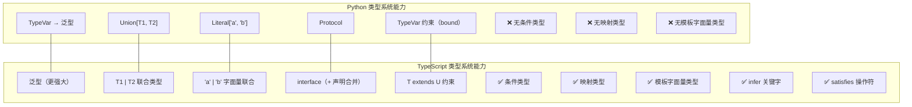
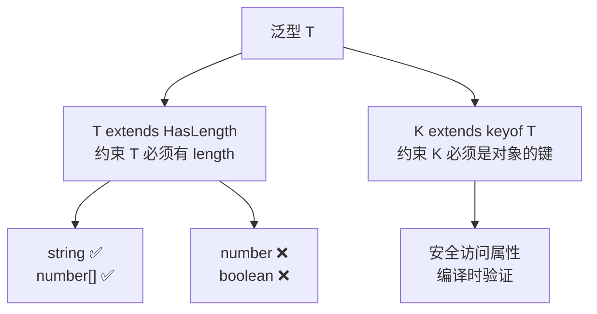
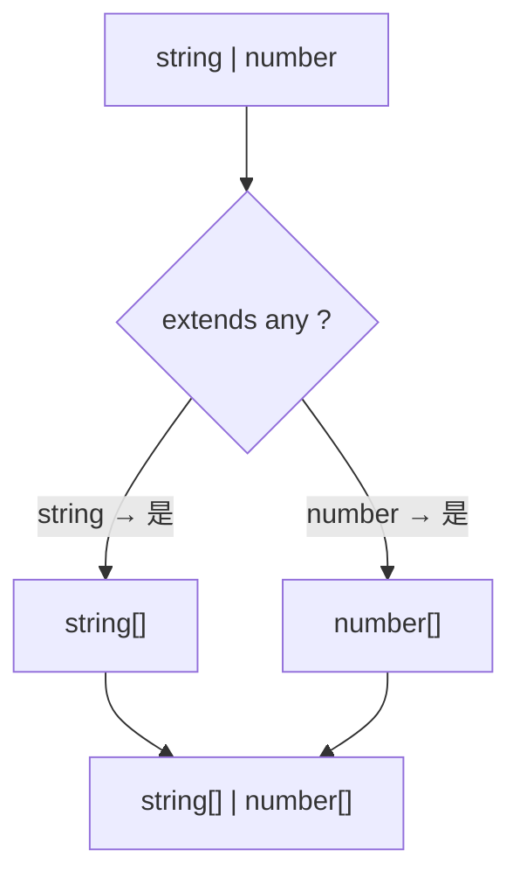
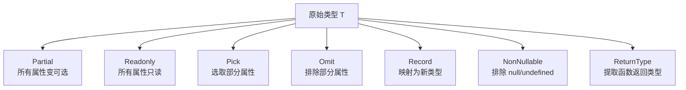

## 前置知识：Python 类型注解只是 TS 的"基础款"

Python 的 `typing` 模块已经很强：`TypeVar`、`Generic`、`Protocol`、`Union`、`Literal`。TypeScript 把这些概念全部囊括，并在此基础上发展出了**图灵完备的类型系统**——你可以用类型表达任意复杂的约束，这就是"类型体操"的由来。



> [!important] 本篇核心认知
> • Python 类型系统的 80% 能力，TypeScript 都有对应的更强版本
> • TypeScript 独有的条件类型、映射类型、模板字面量类型是 **Python 完全没有的能力**
> • 这些 TS 独有特性让类型系统变成了**编译时编程语言**
> • 学会这些，你就能写出 Python 里做梦都做不到的类型安全代码

---

## 1. 泛型：从 Python TypeVar 到 TS 泛型

### 1.1 基本泛型对比

```python
# Python TypeVar
from typing import TypeVar, Generic, Sequence
T = TypeVar("T")

def first(items: Sequence[T]) -> T:
    return items[0]

class Box(Generic[T]):
    def __init__(self, value: T):
        self.value = value
    def get(self) -> T:
        return self.value
```

```typescript
// TypeScript 泛型（语法更简洁）
function first<T>(items: T[]): T {
  return items[0];
}

class Box<T> {
  constructor(public value: T) {}
  get(): T { return this.value; }
}

const box = new Box<number>(42);
const inferredBox = new Box(42);  // ✅ 自动推断为 Box<number>
```

| 特性 | Python | TypeScript | 差异 |
|------|--------|-----------|------|
| 泛型声明 | `T = TypeVar("T")` | `<T>` 内联声明 | TS 更简洁 |
| 泛型函数 | `def f(items: Sequence[T]) -> T` | `function f<T>(items: T[]): T` | TS 参数位置不同 |
| 泛型类 | `class Box(Generic[T])` | `class Box<T>` | TS 更简洁 |
| 类型推断 | 弱（mypy 有时推断不出） | 强（几乎不需要手动指定） | TS 远胜 |
| 多个泛型 | `T, U = TypeVar("T"), TypeVar("U")` | `<T, U>` | TS 内联 |
| 泛型默认值 | ❌ 不支持 | ✅ `<T = string>` | TS 独有 |

### 1.2 泛型约束（extends vs bound）

```python
# Python: TypeVar 约束
T = TypeVar("T", bound="Animal")
def make_sound(animal: T) -> str:
    return animal.speak()
```

```typescript
// TypeScript: extends 约束
function makeSound<T extends { speak(): string }>(animal: T): string {
  return animal.speak();
}

// 约束为具有 length 属性的类型
function logLength<T extends { length: number }>(value: T): void {
  console.log(value.length);
}

logLength("hello");     // ✅ string 有 length
logLength([1, 2, 3]);   // ✅ array 有 length
// logLength(42);       // ❌ number 没有 length
```

### 1.3 泛型默认值（TS 独有）

```typescript
// TypeScript 独有：泛型可以有默认值！Python 的 TypeVar 不支持
function createBox<T = string>(value: T): { value: T } {
  return { value };
}

const stringBox = createBox("hello");  // 类型: { value: string }
const numberBox = createBox(42);       // 类型: { value: number }
const customBox = createBox<bigint>(1n); // 显式指定: { value: bigint }
```

### 1.4 keyof 和 typeof 运算符

```typescript
// keyof：获取对象类型的所有键
interface User {
  name: string;
  age: number;
  email: string;
}
type UserKey = keyof User;  // "name" | "age" | "email"

// 结合 typeof 获取运行时值的类型
const config = {
  host: "localhost",
  port: 8080,
  debug: true,
};
type Config = typeof config;  // { host: string; port: number; debug: boolean }
type ConfigKey = keyof Config;  // "host" | "port" | "debug"

// 组合使用：安全的属性访问
function getProperty<T, K extends keyof T>(obj: T, key: K): T[K] {
  return obj[key];
}

const user: User = { name: "Alice", age: 25, email: "a@b.com" };
const name = getProperty(user, "name");  // 类型: string ✅
// getProperty(user, "email");  // ❌ 编译报错
```



---

## 2. 联合类型与交叉类型

### 2.1 联合类型（Union）

```typescript
// 联合类型：值可以是多种类型之一
type ID = string | number;

function getUserId(id: ID): string {
  if (typeof id === "string") {
    return id.toUpperCase();  // 这里 id 被收窄为 string
  }
  return id.toString();  // 这里 id 被收窄为 number
}

// 可辨识联合（Discriminated Union）—— ★ TS 独有强大特性！
type Shape =
  | { kind: "circle"; radius: number }
  | { kind: "square"; side: number }
  | { kind: "rectangle"; width: number; height: number };

function area(shape: Shape): number {
  switch (shape.kind) {
    case "circle":    return Math.PI * shape.radius ** 2;
    case "square":    return shape.side ** 2;
    case "rectangle": return shape.width * shape.height;
    // 如果漏了某个 case，穷尽性检查会报错！
  }
}
```

> [!important] 可辨识联合：Python 完全没有的能力
> Python 的 `Union` 在运行时只是类型注解，TS 的可辨识联合让编译器**自动收窄类型**。配合 `switch` 或 `if`，TypeScript 知道每个分支中 `shape` 的具体类型，还帮你做穷尽性检查。

### 2.2 交叉类型（Intersection）

```typescript
// 交叉类型：合并多个类型的属性（Python 无此概念！）
type Named = { name: string };
type Aged = { age: number };
type Person = Named & Aged;  // { name: string; age: number }

const p: Person = { name: "Alice", age: 25 };

// 常用于组合多个接口
type User = { id: number; email: string };
type Admin = User & { permissions: string[]; role: "admin" };
```

| 概念 | 含义 | Python 对应 |
|------|------|------------|
| 联合 `T1 \| T2` | 值是 T1 **或** T2 | `Union[T1, T2]` |
| 交叉 `T1 & T2` | 值**同时是** T1 和 T2 | ❌ 无直接等价 |
| 字面量联合 `"a" \| "b"` | 值只能是 "a" 或 "b" | `Literal["a", "b"]` |

### 2.3 穷尽性检查（TS 独有）

```typescript
type Color = "red" | "green" | "blue";

function handleColor(c: Color): string {
  switch (c) {
    case "red":   return "红色";
    case "green": return "绿色";
    // ❌ 如果漏了 "blue"，下面这行会报错！
    default:
      const _exhaustive: never = c;  // never 检查
      return _exhaustive;
  }
}
// 未来如果 Color 新增了 "yellow"，而 handleColor 没更新，编译器立刻报错！
```

> [!important] 穷尽性检查：类型系统的安全网
> 这是 TS 最有价值的安全特性之一——**编译器帮你检查是否处理了所有情况**。Python 的 `match/case`（3.10+）没有类似的编译时检查。

---

## 3. 条件类型：编译时 if/else（Python 无）

```typescript
// ★ 条件类型：类型级别的 if-else（Python 完全没有！）
// 语法：T extends U ? X : Y

type IsString<T> = T extends string ? true : false;

type A = IsString<"hello">;  // true
type B = IsString<42>;       // false

// 实际应用：提取数组元素类型
type ElementType<T> = T extends (infer U)[] ? U : never;

type E1 = ElementType<string[]>;   // string
type E2 = ElementType<number[]>;   // number
type E3 = ElementType<string>;     // never（不是数组）
```

### 3.1 条件类型分发

```typescript
// 联合类型传入条件类型时，会自动分发
type ToArray<T> = T extends any ? T[] : never;

type Result = ToArray<string | number>;
// 结果：string[] | number[]（分发！不是 (string | number)[]）

// 阻止分发：用方括号包裹
type NonDistArray<T> = [T] extends [any] ? T[] : never;
type Mixed = NonDistArray<string | number>;
// 结果：(string | number)[]
```



### 3.2 infer 关键字（Python 无）

```typescript
// ★ infer：在条件类型中提取类型信息（Python 完全没有！）

// 提取函数返回类型
type ReturnType<T> = T extends (...args: any[]) => infer R ? R : never;
type Fn = (x: number) => string;
type Ret = ReturnType<Fn>;  // string

// 提取 Promise 的值类型
type Awaited<T> = T extends Promise<infer U> ? U : T;
type V1 = Awaited<Promise<string>>;  // string
type V2 = Awaited<number>;           // number

// 提取数组元素类型
type ArrayElement<T> = T extends (infer U)[] ? U : never;
type Elem = ArrayElement<{ name: string }[]>;  // { name: string }

// 提取函数第一个参数类型
type FirstParam<T> = T extends (first: infer P, ...rest: any[]) => any ? P : never;
type F = FirstParam<(name: string, age: number) => void>;  // string
```

> [!important] infer 是类型体操的核心武器
> `infer` 让你从复合类型中**提取**子类型。Python 的类型系统没有这种能力——`typing` 只能做声明，不能做"类型计算"。

---

## 4. 映射类型：批量变换类型（Python 无）

```typescript
// ★ 映射类型：遍历对象类型的键，批量生成新类型（Python 完全没有！）
// 语法：[K in keyof T]: NewType

interface User {
  name: string;
  age: number;
  email: string;
}

// 所有属性变为可选
type Partial<T> = { [K in keyof T]?: T[K]; };
type PartialUser = Partial<User>;
// { name?: string; age?: number; email?: string; }

// 所有属性变为只读
type Readonly<T> = { readonly [K in keyof T]: T[K]; };

// 所有属性变为必填（移除可选修饰符）
type Required<T> = { [K in keyof T]-?: T[K]; };

// 移除所有只读
type Mutable<T> = { -readonly [K in keyof T]: T[K]; };

// 键名映射（TS 4.1+ as 语法）
type Getters<T> = {
  [K in keyof T as `get${Capitalize<string & K>}`]: () => T[K];
};
type UserGetters = Getters<User>;
// { getName: () => string; getAge: () => number; getEmail: () => string; }
```

### 4.1 内置工具类型速查



| 工具类型 | 作用 | Python 最接近 |
|---------|------|-------------|
| `Partial<T>` | 所有属性变可选 | 无（需手动写 Optional） |
| `Readonly<T>` | 所有属性只读 | `Final`（有限） |
| `Required<T>` | 所有属性必填 | 无 |
| `Pick<T, K>` | 选取部分属性 | TypedDict（手动） |
| `Omit<T, K>` | 排除部分属性 | TypedDict（手动） |
| `Record<K, V>` | 键值对类型 | `dict[K, V]` |
| `Exclude<T, U>` | 从联合类型中排除 | 无 |
| `Extract<T, U>` | 从联合类型中提取 | 无 |
| `NonNullable<T>` | 排除 null/undefined | 无 |
| `ReturnType<T>` | 函数返回类型 | `get_type_hints`（运行时） |
| `Parameters<T>` | 函数参数元组 | 无 |
| `Awaited<T>` | 提取 Promise 类型 | 无 |

```typescript
// 实用示例
interface User {
  id: number;
  name: string;
  email: string;
  password: string;
}

type UserPublic = Pick<User, "id" | "name">;          // { id: number; name: string }
type UserSafe = Omit<User, "password">;                // 排除 password
type Status = "active" | "inactive" | "pending" | "deleted";
type ActiveStatus = Exclude<Status, "deleted">;        // "active" | "inactive" | "pending"
```

### 4.2 Python vs TS 类型操作能力

| 能力 | Python | TypeScript |
|------|--------|-----------|
| 所有属性变可选 | 手动写 | `Partial<T>` |
| 所有属性变只读 | 手动写 | `Readonly<T>` |
| 选择部分属性 | 手动写 | `Pick<T, K>` |
| 排除部分属性 | 手动写 | `Omit<T, K>` |
| 修改属性类型 | 手动写 | 映射类型 |
| 键名转 camelCase | 不可行 | `CamelCase<T>` |

---

## 5. 模板字面量类型（TS 独有）

```typescript
// ★ 模板字面量类型：用类型拼接字符串（Python 完全没有！）
type EventName = `on${string}`;
const onClick: EventName = "onClick";    // ✅
// const handler: EventName = "handle"; // ❌

// 组合多个字面量
type CSSProperty = "margin" | "padding";
type Direction = "Top" | "Right" | "Bottom" | "Left";
type CSSRule = `${CSSProperty}${Direction}`;
// "marginTop" | "marginRight" | "marginBottom" | "marginLeft"
// | "paddingTop" | "paddingRight" | "paddingBottom" | "paddingLeft"

// 事件处理器生成
type Events = "click" | "hover" | "submit";
type Handlers = `on${Capitalize<Events>}`;
// "onClick" | "onHover" | "onSubmit"

// 路径拼接
type Route = `/api/${"users" | "posts"}/${number}`;
const r1: Route = "/api/users/123";   // ✅
// const r2: Route = "/api/users/abc"; // ❌
```

> [!important] Python 的字符串是运行时概念，TS 的模板字面量类型是**类型系统概念**
> Python 的 `f"on_{event}"` 在运行时生成字符串。TS 的模板字面量类型在**编译时**约束字符串字面量的类型，给 IDE 提供精确的自动补全。

---

## 6. satisfies 操作符（TS 4.9+）

```typescript
// ★ satisfies：验证类型但不收窄（TS 4.9+ 独有！）

// 不用 satisfies：类型被收窄为 Record，失去字面量推断
const config1: Record<string, string | number> = {
  host: "localhost",
  port: 3000,
};
// config1.host 类型: string | number（丢失了精确类型！）

// 用 satisfies：验证满足 Record，但保留精确推断
const config2 = {
  host: "localhost",
  port: 3000,
} satisfies Record<string, string | number>;
// config2.host 类型: "localhost"（保留了精确类型！）
// config2.port 类型: 3000
```

> [!tip] satisfies vs as
> • `as` 是断言："我说它是这个类型"（不检查）
> • `satisfies` 是验证："请确认它满足这个类型"（检查 + 保留精确类型）
> • **能用 satisfies 就不用 as**

---

## 7. 类型守卫与类型收窄

### 7.1 typeof / instanceof / in

```typescript
// Python: isinstance(x, int)
// TypeScript: typeof / instanceof / in

function process(value: string | number) {
  if (typeof value === "string") {
    return value.toUpperCase();  // ✅ 自动收窄为 string
  }
  return value.toFixed(2);  // ✅ 自动收窄为 number
}

// in（检查属性存在）
type Fish = { swim: () => void };
type Bird = { fly: () => void };

function move(animal: Fish | Bird) {
  if ("swim" in animal) {
    animal.swim();  // ✅ animal 是 Fish
  } else {
    animal.fly();   // ✅ animal 是 Bird
  }
}
```

### 7.2 自定义类型守卫（Python 无）

```typescript
// ★ is 关键字：自定义类型守卫（Python 的 TypeGuard 类似但更弱）
function isString(value: unknown): value is string {
  return typeof value === "string";
}

const x: unknown = "hello";
if (isString(x)) {
  console.log(x.toUpperCase());  // ✅ x 被收窄为 string
}
```

### 7.3 索引访问类型

```typescript
interface User {
  name: string;
  address: {
    city: string;
    zip: number;
  };
}

type UserName = User["name"];              // string
type City = User["address"]["city"];       // string
type AddressType = User["address"];        // { city: string; zip: number }
```

---

## 8. 类型体操实战

### 8.1 递归类型

```typescript
// 递归类型：类型定义引用自身（Python 无）
type JSONValue =
  | string
  | number
  | boolean
  | null
  | JSONValue[]
  | { [key: string]: JSONValue };
// 这个类型可以描述任意 JSON 结构

// 递归实现 DeepReadonly
type DeepReadonly<T> = {
  readonly [K in keyof T]: T[K] extends object
    ? DeepReadonly<T[K]>
    : T[K];
};
```

### 8.2 类型安全的 EventEmitter

```typescript
type EventMap = {
  userLogin: { userId: string; timestamp: number };
  userLogout: { userId: string };
  error: { code: number; message: string };
};

class TypedEventEmitter<T extends Record<string, unknown>> {
  private listeners = new Map<string, Set<Function>>();

  on<K extends keyof T>(event: K, handler: (data: T[K]) => void): void {
    if (!this.listeners.has(event as string)) {
      this.listeners.set(event as string, new Set());
    }
    this.listeners.get(event as string)!.add(handler);
  }

  emit<K extends keyof T>(event: K, data: T[K]): void {
    this.listeners.get(event as string)?.forEach(h => h(data));
  }
}

const emitter = new TypedEventEmitter<EventMap>();
emitter.on("userLogin", data => {
  // data 自动推断为 { userId: string; timestamp: number }
  console.log(`User ${data.userId} logged in`);
});
// emitter.on("userLogin", (data: string) => {});  // ❌ 类型错误
```

---

## 常见易错点

> [!warning] **坑 1：泛型默认推断太宽泛**
> ```typescript
> function identity<T>(x: T): T { return x; }
> const x = identity([1, 2, 3]);  // T 推断为 number[]，不是元组
> // 如需元组：
> const y = identity([1, 2, 3] as const);  // readonly [1, 2, 3]
> ```
> **为什么错**：TS 默认推断数组为数组类型，不是元组
> **解决方案**：用 `as const` 锁定字面量类型

> [!warning] **坑 2：条件类型对联合类型会自动分发**
> ```typescript
> type ToArray<T> = T extends any ? T[] : never;
> type Result = ToArray<string | number>;  // string[] | number[]（分发！）
> // 不是 (string | number)[]!
> ```
> **为什么错**：条件类型对联合类型**自动分发**，逐个检查
> **解决方案**：用 `[T] extends [any]` 包裹来阻止分发

> [!warning] **坑 3：infer 只能在条件类型中使用**
> ```typescript
> type Bad<T> = infer U;  // ❌ 报错
> type Good<T> = T extends Promise<infer U> ? U : never;  // ✅
> ```
> **为什么错**：`infer` 只能在条件类型的 `extends` 子句中使用
> **解决方案**：只在条件类型中使用 infer

> [!warning] **坑 4：交叉类型中的属性冲突**
> ```typescript
> type A = { value: string };
> type B = { value: number };
> type AB = A & B;  // value 的类型是 string & number = never！
> ```
> **为什么错**：同一属性的不同类型交叉变成 `never`
> **解决方案**：确保交叉的类型属性不冲突，或用 `Omit` 排除冲突属性

> [!warning] **坑 5：Partial 只影响一层属性**
> ```typescript
> interface User { name: string; address: { city: string } }
> type P = Partial<User>;
> // address 本身变可选了，但 address.city 仍然必填且可变
> ```
> **为什么错**：`Partial` 只把第一层属性变可选，嵌套对象不受影响
> **解决方案**：需要深层可选时用自定义 `DeepPartial<T>` 递归定义

> [!warning] **坑 6：联合类型只能访问共有属性**
> ```typescript
> type A = { name: string; age: number };
> type B = { name: string; email: string };
> type AB = A | B;
> const x: AB = { name: "Alice", age: 25 };
> // x.age;  // ❌ age 只存在于 A
> x.name;    // ✅ name 两者都有
> ```
> **为什么错**：联合类型只能访问**两个类型都有的属性**
> **解决方案**：用 `in` 或可辨识联合收窄类型后再访问

> [!warning] **坑 7：类型体操不是越多越好**
> ```typescript
> // ❌ 过度设计
> type DeepPick<T, K extends string> = K extends `${infer F}.${infer Rest}`
>   ? { [P in F]: DeepPick<T[F], Rest> }
>   : Pick<T, K>;
> // ✅ 实际项目中，先用简单的 Pick/Omit 解决大部分问题
> ```
> **为什么错**：过度类型体操增加心智负担，影响可维护性
> **解决方案**：先写简单类型，必要时再抽象

---

## 🎯 本文学完自检

| 层次 | 检查项 |
|------|--------|
| 🟢 基础 | 能用 `<T>` 声明泛型函数和泛型类，解释 extends 约束 |
| 🟢 基础 | 能使用 `Partial`、`Pick`、`Omit`、`Record` 等内置工具类型 |
| 🟡 进阶 | 能解释条件类型 `T extends U ? X : Y` 的工作原理，写出 `NonNullable<T>` |
| 🟡 进阶 | 能用 `infer` 提取数组元素类型和函数返回类型 |
| 🔴 挑战 | 能实现一个 `DeepReadonly<T>` 递归只读类型，并解释每一步 |
| 🔴 挑战 | 能说出 5 个 Python 类型系统完全不具备的 TS 特性 |

---

## 相关笔记

- ⬅️ 前置：[[01-环境搭建与基础类型对比]] — 基础类型 any/unknown/never
- ⬅️ 前置：[[02-函数与面向对象对比]] — interface、type 基础
- ➡️ 后续：[[04-异步编程与并发模型对比]] — 泛型在 Promise 中的应用
- ➡️ 后续：[[06-Python有TS无与TS有Python无]] — 类型系统深度差异

---

*最后更新：2026-07-22*