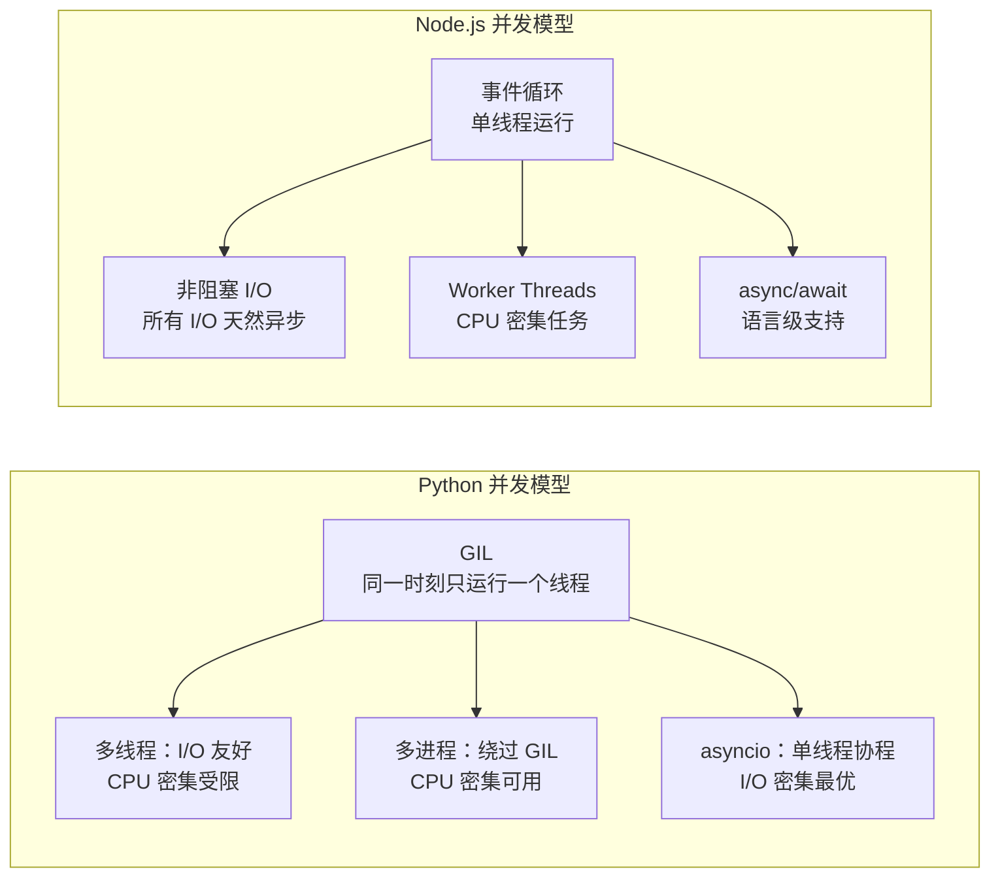
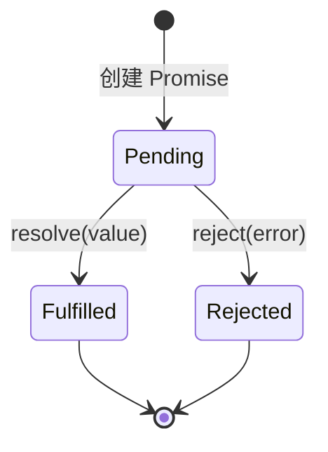
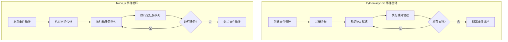

## 前置知识：语法相似但模型不同

好消息：`async`/`await` 语法几乎完全一致。坏消息：底层运行时模型完全不同——Python 用 GIL + asyncio 事件循环，Node.js 用单线程事件循环 + libuv。



> [!important] 核心差异
> • Python 的 async/await 是你**选择的**编程范式；Node.js 的 async/await 是**必须的**（I/O 操作天然异步）
> • Python 的**协程**是 Python 运行时管理的；Node.js 的异步是 **V8 事件循环**驱动的
> • Python 的 `await` 后面是协程对象（**冷求值**）；TS 的 `await` 后面是 `Promise`（**热求值**）
> • Python 3.11+ 有 `TaskGroup`；TS 有 `Promise.all`/`allSettled`/`race`/`any`

---

## 1. Promise 对比 asyncio 协程

### 1.1 基本异步函数对比

```python
# Python asyncio
import asyncio

async def fetch_data(url: str) -> str:
    await asyncio.sleep(1)  # 模拟网络请求
    return f"Data from {url}"

async def main():
    result = await fetch_data("https://api.example.com")
    print(result)

asyncio.run(main())  # 需要事件循环入口
```

```typescript
// TypeScript Promise
async function fetchData(url: string): Promise<string> {
  await new Promise(resolve => setTimeout(resolve, 1000));  // 模拟网络请求
  return `Data from ${url}`;
}

async function main(): Promise<void> {
  const result = await fetchData("https://api.example.com");
  console.log(result);
}

main();  // 不需要 asyncio.run()，直接调用即可
```

| 概念 | Python asyncio | TypeScript Promise | 差异 |
|------|---------------|-------------------|------|
| 异步函数 | `async def` | `async function` | 一致 |
| 返回类型 | `Coroutine[T]` | `Promise<T>` | TS 用 Promise 包装 |
| 等待 | `await` | `await` | 语法一致 |
| 执行时机 | **冷**（需 await 才执行） | **热**（调用即开始执行） | ★ 核心差异 |
| 运行入口 | `asyncio.run()` | 直接调用 | TS 无需特殊入口 |
| 异步延迟 | `await asyncio.sleep(1)` | `await delay(1000)` | TS 非内置 |
| 顶层 await | ❌ 不支持 | ✅ ESM 模块中支持 | TS 更灵活 |

### 1.2 冷求值 vs 热求值（Python 开发者必读）

```python
# Python：coroutine 是冷的
async def work() -> str: ...
coro = work()   # ← 此时不执行！只是创建了 coroutine 对象
await coro       # ← 此时才开始执行
```

```typescript
// TypeScript：Promise 是热的
async function work(): Promise<string> { ... }
const promise = work();  // ★ 此刻已经开始执行！
await promise;            // 只是等待结果
```

> [!important] 冷 vs 热是 Python 开发者最容易踩的坑
> Python 的协程是**惰性的**——创建时不执行，必须 `await` 才运行。TypeScript 的 Promise 是**即时的**——调用 async 函数的那一刻就开始执行，`await` 只是等待结果。如果你需要惰性执行，用 `() => new Promise()` 包装。

### 1.3 Promise 状态机



```typescript
// 创建 Promise
const promise = new Promise<string>((resolve, reject) => {
  setTimeout(() => {
    if (Math.random() > 0.5) {
      resolve("Success!");     // 进入 fulfilled 态
    } else {
      reject(new Error("Failed!"));  // 进入 rejected 态
    }
  }, 1000);
});

// 消费 Promise（then/catch/finally 链式调用，Python 无）
promise
  .then(result => console.log(result))      // 成功回调
  .catch(error => console.error(error.message))  // 失败回调
  .finally(() => console.log("done"));       // 无论成败都执行
```

### 1.4 Promise 链 vs asyncio 链

```python
# Python：串行执行
async def chain():
    result1 = await fetch("step1")
    result2 = await process(result1)
    return result2
```

```typescript
// TypeScript 串行（与 Python 风格一致）
async function chain(): Promise<string> {
  const result1 = await fetch("step1");
  const result2 = await process(result1);
  return result2;
}

// TypeScript Promise 链（Python 无直接等价）
function chainPromise(): Promise<string> {
  return fetch("step1")
    .then(result1 => process(result1))
    .then(result2 => result2.toUpperCase())
    .catch(err => handleError(err));
}
```

> [!tip] 何时用 Promise 链 vs async/await
> • 简单的一步转换 → Promise 链（如 `fetch().then(r => r.json())`）
> • 复杂的多步流程 → async/await（更接近同步代码风格，Python 开发者更熟悉）

---

## 2. 并发模式对比

### 2.1 并行执行多个任务

```python
# Python asyncio.gather
async def gather_demo():
    results = await asyncio.gather(
        fetch("url1"),
        fetch("url2"),
        fetch("url3"),
    )
    return results

# Python 3.11+ TaskGroup
async def taskgroup_demo():
    async with asyncio.TaskGroup() as tg:
        t1 = tg.create_task(fetch("url1"))
        t2 = tg.create_task(fetch("url2"))
    return t1.result(), t2.result()
```

```typescript
// TypeScript Promise.all
async function parallelDemo(): Promise<string[]> {
  const results = await Promise.all([
    fetch("url1"),
    fetch("url2"),
    fetch("url3"),
  ]);
  return results;
}

// Promise.allSettled：等待所有完成，不因失败而中止
async function allSettledDemo(): Promise<PromiseSettledResult<string>[]> {
  const results = await Promise.allSettled([
    fetch("safe"),
    fetch("might-fail"),
  ]);
  return results;
}

// Promise.race：取第一个完成的（不管成功失败）
async function raceDemo(): Promise<string> {
  return Promise.race([fetch("fast"), fetch("slow")]);
}

// Promise.any：取第一个成功的
async function anyDemo(): Promise<string> {
  return Promise.any([fetch("unstable-1"), fetch("unstable-2")]);
}
```

| 方法 | 行为 | Python 对应 |
|------|------|------------|
| `Promise.all` | 全部成功才成功，一个失败就失败 | `asyncio.gather` |
| `Promise.allSettled` | 等全部完成，不管成功失败 | `asyncio.gather(return_exceptions=True)` |
| `Promise.race` | 第一个完成的（不管成功失败） | `asyncio.wait(FIRST_COMPLETED)` |
| `Promise.any` | 第一个成功的 | `asyncio.wait(FIRST_COMPLETED)` + 过滤 |

> [!tip] 迁移提示
> Python 的 `asyncio.gather` 默认 `return_exceptions=False`，和 `Promise.all` 一样是 **fail-fast**：任一任务抛异常，异常直接向外抛出（其余任务继续跑，但调用方拿到的第一个结果就是异常）。想要"等全部完成、收集各自成败"的宽松模式，需显式 `asyncio.gather(..., return_exceptions=True)`，对应 `Promise.allSettled`。

### 2.2 并发控制（Python 独有 Semaphore）

```python
# Python 有 Semaphore，可精确控制并发数
async def controlled_concurrency():
    sem = asyncio.Semaphore(5)  # 最多 5 个并发
    async def fetch_with_limit(url):
        async with sem:
            return await fetch(url)
    tasks = [fetch_with_limit(url) for url in urls]
    return await asyncio.gather(*tasks)
```

```typescript
// TypeScript 没有内置 Semaphore，需自实现或使用库
// 方案一：使用 p-limit 库
import pLimit from "p-limit";
const limit = pLimit(5);  // 最多 5 个并发
const results = await Promise.all(
  urls.map(url => limit(() => fetch(url)))
);

// 方案二：手动分批
async function batchConcurrent<T>(
  items: T[],
  fn: (item: T) => Promise<void>,
  concurrency: number
): Promise<void> {
  const queue = [...items];
  const workers = Array(concurrency).fill(null).map(async () => {
    while (queue.length > 0) {
      const item = queue.shift()!;
      await fn(item);
    }
  });
  await Promise.all(workers);
}
```

---

## 3. 错误处理对比

### 3.1 try/catch

```python
# Python
async def safe_fetch():
    try:
        result = await fetch("url")
        return result
    except Exception as e:
        log.error(f"Failed: {e}")
        return None
```

```typescript
// TypeScript（几乎相同，但 catch 类型不同！）
async function safeFetch(): Promise<string | null> {
  try {
    const result = await fetch("url");
    return result;
  } catch (e) {
    // ★ 注意：TS 4.0+ 的 catch 变量类型是 unknown，不是 Error！
    if (e instanceof Error) {
      console.error("Failed:", e.message);
    } else {
      console.error("Unknown error:", e);
    }
    return null;
  }
}

// Promise 链的错误处理
function safeFetch2(): Promise<string | null> {
  return fetch("url").catch(e => {
    console.error("Failed:", e);
    return null;
  });
}
```

> [!warning] catch 子句的 unknown 类型
> TS 4.0+ 开始，`catch (e)` 中 `e` 的类型是 `unknown`，不是 `Error` 或 `any`。你必须先做类型检查（`instanceof Error`）才能安全使用它。这和 Python 的 `except Exception as e` 不同——Python 的 `e` 类型是确定的。

### 3.2 未处理的 Promise 拒绝

```typescript
// ⚠️ Node.js 中未处理的 Promise 拒绝会触发 unhandledRejection
process.on("unhandledRejection", (reason, promise) => {
  console.error("Unhandled Rejection:", reason);
  process.exit(1);
});

// 永远不要忘记 catch！
async function dangerous() {
  throw new Error("Oops!");  // 如果调用者不 await 或 catch，触发 unhandledRejection
}
dangerous();  // ❌ 未处理！
dangerous().catch(console.error);  // ✅
```

> [!warning] Node.js 的 unhandledRejection 可能被杀进程
> 从 Node.js 15+ 开始，未处理的 Promise 拒绝**默认会终止进程**。这和 Python 的 `asyncio` 不同——Python 的协程异常如果不 await 会静默丢失。

---

## 4. 取消机制

### 4.1 AbortController

```typescript
// TypeScript 的取消机制：AbortController
const controller = new AbortController();
const signal = controller.signal;

async function fetchWithTimeout(url: string, ms: number): Promise<string> {
  const timeoutId = setTimeout(() => controller.abort(), ms);
  try {
    const response = await fetch(url, { signal });
    clearTimeout(timeoutId);
    return response.text();
  } catch (e) {
    if (e instanceof DOMException && e.name === "AbortError") {
      throw new Error(`Request timed out after ${ms}ms`);
    }
    throw e;
  }
}
```

```python
# Python 对比：asyncio.wait_for + cancel
async def fetch_with_timeout(url: str, timeout: float):
    try:
        return await asyncio.wait_for(fetch(url), timeout=timeout)
    except asyncio.TimeoutError:
        raise TimeoutError(f"Request timed out after {timeout}s")
```

| 特性 | Python asyncio | TypeScript/Node.js |
|------|---------------|-------------------|
| 取消机制 | `task.cancel()` + `CancelledError` | `AbortController` + `signal` |
| 超时 | `asyncio.wait_for(coro, timeout)` | `AbortController` + `setTimeout` |
| 捕获取消 | `try/except CancelledError` | `signal.aborted` + `AbortError` |
| 传播 | 自动传播到子协程 | 需手动传 signal |

---

## 5. 事件循环与运行时模型



### 5.1 微任务 vs 宏任务

```typescript
// 微任务优先级高于宏任务
console.log("1: 同步");

Promise.resolve().then(() => console.log("2: 微任务"));  // Promise.then

setTimeout(() => console.log("3: 宏任务"), 0);           // setTimeout

Promise.resolve().then(() => console.log("4: 微任务"));

console.log("5: 同步");

// 输出顺序：
// 1: 同步
// 5: 同步
// 2: 微任务
// 4: 微任务
// 3: 宏任务
```

| 任务类型 | 示例 | 顺序 |
|---------|------|------|
| 同步代码 | `console.log` | 最先执行 |
| 微任务 | `Promise.then`、`queueMicrotask` | 同步代码后立即执行 |
| 宏任务 | `setTimeout`、`setInterval`、I/O | 微任务全部执行完后执行 |

> [!important] 事件循环执行顺序
> 1. 执行当前同步代码
> 2. 清空所有微任务（Promise.then、await 等）
> 3. 执行一个宏任务（setTimeout、setInterval、I/O 回调）
> 4. 重复 2-3

### 5.2 GIL vs 单线程事件循环

| 维度 | Python | Node.js / TypeScript |
|------|--------|----------------------|
| 线程模型 | 多线程 + GIL | 单线程（主线程） |
| I/O 模型 | asyncio（非阻塞 I/O） | libuv（非阻塞 I/O） |
| CPU 密集任务 | 多进程（multiprocessing） | Worker Threads |
| 并发单元 | 协程（Coroutine） | Promise + 回调 |
| 事件循环 | asyncio（需手动启动） | libuv（自动运行） |
| 真并行 | 多进程可实现 | Worker 可实现 |
| 异步生态 | 3rd-party（asyncio） | 原生（语言级） |

---

## 6. Worker Threads：绕过单线程限制

```typescript
// 主线程
import { Worker } from "node:worker_threads";

const worker = new Worker("./worker.ts");
worker.on("message", (result) => {
  console.log("Worker result:", result);
});
worker.postMessage({ data: largeArray });
```

```typescript
// worker.ts
import { parentPort, workerData } from "node:worker_threads";
parentPort?.on("message", (msg) => {
  const result = heavyComputation(msg.data);
  parentPort?.postMessage(result);
});
```

```python
# Python 对比：多进程
from multiprocessing import Process, Queue
def worker(q):
    result = heavy_computation(data)
    q.put(result)
```

| 特性 | Python 多进程 | TS Worker Threads |
|------|--------------|-------------------|
| 内存隔离 | 进程级隔离 | 线程级隔离 |
| 数据传输 | pickle 序列化 | 结构化克隆 / SharedArrayBuffer |
| 实现模型 | 绕过 GIL | 绕过单线程限制 |
| 适用场景 | CPU 密集型 | CPU 密集型 |

---

## 7. Node.js 独有概念：Stream 与 Async Iterator

### 7.1 Stream（流式处理）

```typescript
import { pipeline } from "stream/promises";
import { createReadStream, createWriteStream } from "fs";

// 管道：读取文件 → 转换 → 写入文件
await pipeline(
  createReadStream("input.txt"),
  async function* (source) {  // async generator 作为 Transform
    for await (const chunk of source) {
      yield chunk.toString().toUpperCase();
    }
  },
  createWriteStream("output.txt")
);
```

> [!tip] Stream 是 Node.js 处理大数据的核心
> Python 有 `for line in file` 逐行读取，Node.js 有 Stream API。对于大文件或网络流，Stream 比 `readFile` 更高效（内存占用低）。

### 7.2 Async Iterator（异步迭代器）

```typescript
// ★ async iterator：异步迭代器（TS 独有 for await...of）
async function* fetchPages(url: string) {
  let page = 1;
  while (true) {
    const response = await fetch(`${url}?page=${page}`);
    const data = await response.json();
    if (data.length === 0) break;
    yield data;
    page++;
  }
}

// 使用 for await...of
for await (const page of fetchPages("https://api.example.com/items")) {
  console.log(`Got ${page.length} items`);
}
```

```python
# Python 等价（async generator + async for）
async def fetch_pages(url: str):
    page = 1
    while True:
        response = await fetch(f"{url}?page={page}")
        data = await response.json()
        if not data:
            break
        yield data
        page += 1

async for page in fetch_pages("https://api.example.com/items"):
    print(f"Got {len(page)} items")
```

---

## 常见易错点

> [!warning] **坑 1：忘记 await Promise**
> ```typescript
> async function bug() {
>   const result = fetchData();  // ❌ 忘记 await！result 是 Promise
>   console.log(result);           // 打印 Promise 对象，不是数据
> }
> // ✅ 修复：const result = await fetchData();
> ```
> **为什么错**：异步函数返回 Promise，不 await 得到的是 Promise 对象
> **解决方案**：ESLint 规则 `@typescript-eslint/no-floating-promises`

> [!warning] **坑 2：Promise.all 一个失败全部失败**
> ```typescript
> const results = await Promise.all([
>   fetch("safe"),
>   fetch("will-fail"),  // 这个失败
>   fetch("also-safe"),
> ]);
> // 整个 Promise.all 失败，其他结果也丢失了
> // ✅ 用 Promise.allSettled 避免连锁失败
> ```
> **为什么错**：`Promise.all` 是 fail-fast 的
> **解决方案**：需要全结果用 `Promise.allSettled`

> [!warning] **坑 3：forEach 中不能用 await**
> ```typescript
> // ❌ forEach 不会等待 async 回调
> ["a", "b", "c"].forEach(async (item) => {
>   await process(item);  // 不会按顺序执行！
> });
>
> // ✅ 用 for...of（串行）或 Promise.all + map（并发）
> for (const item of ["a", "b", "c"]) {
>   await process(item);  // 按顺序执行
> }
> // 或并发：
> await Promise.all(["a", "b", "c"].map(item => process(item)));
> ```
> **为什么错**：`forEach` 的 callback 是同步的，不会等待 async 函数
> **解决方案**：用 `for...of` 或 `Promise.all` + `Array.map`

> [!warning] **坑 4：catch 的 error 类型是 unknown**
> ```typescript
> try { await risky(); }
> catch (e) {
>   // e.message;  // ❌ e 是 unknown，不能直接访问属性
>   if (e instanceof Error) {
>     console.log(e.message);  // ✅ 先检查再使用
>   }
> }
> ```
> **为什么错**：TS 4.0+ 把 catch 的变量类型改为 `unknown`
> **解决方案**：用 `instanceof` 检查后再访问属性

> [!warning] **坑 5：忘记 Promise 是热的**
> ```typescript
> // Python 开发者常犯：以为创建 Promise 不会执行
> const p = new Promise<void>(resolve => {  // ⚠️ 必须写 <void>，否则无参 resolve() 报 TS2794
>   console.log("executed immediately!");  // ★ 立即执行！
>   resolve();
> });
> // 即使不 await p，也会打印 "executed immediately!"
> ```
> **为什么错**：Promise 构造函数内的代码立即执行（热求值）
> **解决方案**：用 `() => new Promise()` 包装成惰性执行

> [!warning] **坑 6：事件循环被 CPU 密集任务阻塞**
> ```typescript
> // ❌ CPU 密集任务阻塞事件循环
> function heavyCompute() {
>   let sum = 0;
>   for (let i = 0; i < 10_000_000_000; i++) sum += i;  // 阻塞数秒
>   return sum;
> }
> // 在此期间，所有 I/O 回调都被阻塞！
> ```
> **为什么错**：Node.js 单线程，CPU 密集任务阻塞事件循环
> **解决方案**：用 Worker Threads 或拆分任务（`setImmediate`）

> [!warning] **坑 7：async/await 在顶层需要 ESM**
> ```typescript
> // ❌ 在 CommonJS 模块顶层不能直接 await
> const result = await fetch("url");  // 报错
>
> // ✅ 方案一：用 ESM（package.json 设置 "type": "module"）
> const result = await fetch("url");  // 在 .mjs 或 type=module 下可用
>
> // ✅ 方案二：用 IIFE 包裹
> (async () => {
>   const result = await fetch("url");
> })();
> ```
> **为什么错**：CommonJS 不支持顶层 await
> **解决方案**：用 ESM 模块或 IIFE 包裹

---

## 🎯 本文学完自检

| 层次 | 检查项 |
|------|--------|
| 🟢 基础 | 能把 Python asyncio 协程改写成 TS async/await 函数 |
| 🟢 基础 | 能解释 `Promise.all` / `allSettled` / `race` / `any` 的区别 |
| 🟡 进阶 | 能解释 Python Coroutine（冷求值）和 TS Promise（热求值）的区别 |
| 🟡 进阶 | 能解释 Node.js 事件循环中微任务和宏任务的执行顺序 |
| 🔴 挑战 | 能对比 Python GIL 和 Node.js 单线程事件循环的并发模型，画出架构图 |
| 🔴 挑战 | 能实现一个限流并发函数（最多 N 个并发），对比 Python Semaphore |

---

## 相关笔记

- ⬅️ 前置：[[03-类型系统进阶-TS独有武器]] — 泛型在 Promise<T> 中的应用
- ➡️ 后续：[[05-模块系统与工程化]] — npm 包管理和项目工程化
- 🔗 关联：[[06-Python有TS无与TS有Python无]] — 并发模型深度差异

---

*最后更新：2026-07-22*