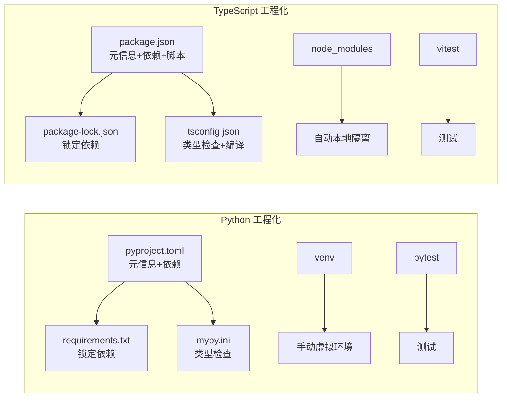
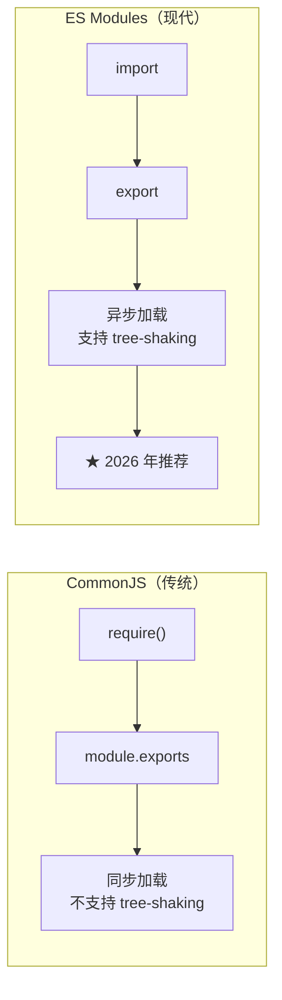

## 前置知识：两套生态的哲学差异

Python 的包管理从 pip 到 poetry 到 uv，碎片化严重。TypeScript/Node.js 生态更统一——npm 是默认标准，pnpm 是增强版。Python 的 `import` 基于文件系统路径，TS 的 `import` 基于包名（`node_modules` 查找）。



> [!important] 核心差异
> • Python 包管理工具多（pip/poetry/uv），TS 生态更统一（npm/pnpm）
> • Python 的 `pyproject.toml` 一统天下，TS 需要两个文件：`package.json` + `tsconfig.json`
> • TS 的 `tsc --noEmit` 等价于 `mypy`——只检查类型，不编译
> • TS 的 `node_modules` 等同 Python 的 venv，但**自动管理**，无需手动激活

---

## 1. 模块系统：import / export

### 1.1 基本导入导出对比

```python
# Python: 模块即文件，包即目录（有 __init__.py）
# mypackage/utils.py
def greet(name: str) -> str:
    return f"Hello, {name}"

PI = 3.14159

# 使用
from mypackage.utils import greet, PI
import mypackage.utils as utils
```

```typescript
// TypeScript: ES Modules（推荐）
// mypackage/utils.ts

// 命名导出（推荐）
export function greet(name: string): string {
  return `Hello, ${name}`;
}
export const PI = 3.14159;

// 默认导出（每文件最多一个）
export default function main(): void { /* ... */ }

// 使用
import { greet, PI } from "./utils";
import * as utils from "./utils";
import main from "./utils";  // 默认导入（无括号）
```

| 特性 | Python import | TypeScript ESM | 差异 |
|------|--------------|----------------|------|
| 模块单元 | `.py` 文件 | `.ts` 文件 | 一致 |
| 包单元 | 目录 + `__init__.py` | 目录 + `package.json` | TS 无需 `__init__` |
| 导入语法 | `from pkg.mod import name` | `import { name } from "pkg/mod"` | 语法不同 |
| 导出 | 无（文件内全部可见） | `export` 关键字 | ★ TS 需显式导出 |
| 默认导出 | 无 | `export default` | TS 独有 |
| 重命名 | `import mod as alias` | `import { name as alias }` | 语法不同 |
| 类型导入 | 无需特殊语法 | `import type { T }` | ★ TS 独有 |
| 动态导入 | `importlib.import_module()` | `await import("...")` | TS 是表达式 |

### 1.2 类型导入（TS 独有）

```typescript
// ★ import type：只导入类型，编译时擦除（Python 无此概念）
import type { User, Config } from "./types";
// 这些类型在编译后完全消失，不产生运行时代码

// 混合导入：值 + 类型
import { greet, type User } from "./utils";
// greet 是运行时值，User 是编译时类型
```

> [!tip] 类型导入的好处
> 1. **明确意图**：标记哪些导入是类型，哪些是运行时值
> 2. **帮助 tree-shaking**：打包工具知道类型导入可以安全移除
> 3. **减少运行时开销**：类型导入不产生任何运行时代码

### 1.3 ESM vs CommonJS



```typescript
// ===== ESM（推荐新项目） =====
// package.json 中设置 "type": "module"
import { readFile } from "node:fs/promises";
export function add(a: number, b: number): number { return a + b; }

// ===== CommonJS（传统，不推荐新项目） =====
const { readFile } = require("fs");
module.exports = { add: (a, b) => a + b };
```

| 特性 | CommonJS | ES Modules |
|------|----------|------------|
| 加载方式 | 同步 | 异步 |
| 语法 | `require` / `module.exports` | `import` / `export` |
| 顶层 await | ❌ 不支持 | ✅ 支持 |
| tree-shaking | ❌ 不支持 | ✅ 支持 |
| 浏览器兼容 | ❌ 不支持 | ✅ 原生支持 |
| 2026 年推荐 | ⚠️ 仅维护遗留 | ✅ 新项目默认 |

> [!tip] 迁移提示
> 新项目统一用 ESM（`"type": "module"` 在 package.json 中设置）。Python 的 `import` 和 ESM 的 `import` 语法几乎一致。

### 1.4 路径别名（类似 Python 的 sys.path）

```jsonc
// tsconfig.json
{
  "compilerOptions": {
    "baseUrl": ".",
    "paths": {
      "@/*": ["./src/*"],           // @/utils/foo → src/utils/foo
      "@components/*": ["./src/components/*"]
    }
  }
}
```

```typescript
// 使用路径别名
import { helper } from "@/utils/helper";  // 不再需要 ../../../utils/helper
```

> [!warning] tsconfig paths 不影响运行时
> `tsconfig.json` 中的 `paths` 只在编译时生效，运行时需要额外工具（tsx、esbuild、vite）处理路径别名。`tsc` 编译后不会替换路径别名。

---

## 2. 包管理：从 pip 到 npm / pnpm

### 2.1 工具链对比

| 操作 | Python (pip) | Python (poetry) | Node.js (npm) | Node.js (pnpm) |
|------|-------------|-----------------|---------------|----------------|
| 安装包 | `pip install pkg` | `poetry add pkg` | `npm install pkg` | `pnpm add pkg` |
| 安装开发依赖 | `pip install -D pkg` | `poetry add -D pkg` | `npm install -D pkg` | `pnpm add -D pkg` |
| 全局安装 | `pip install pkg` | `poetry add pkg` | `npm install -g pkg` | `pnpm add -g pkg` |
| 卸载 | `pip uninstall pkg` | `poetry remove pkg` | `npm uninstall pkg` | `pnpm remove pkg` |
| 依赖锁定 | `requirements.txt` | `poetry.lock` | `package-lock.json` | `pnpm-lock.yaml` |
| 运行脚本 | — | `poetry run script` | `npm run build` | `pnpm build` |
| 虚拟环境 | `venv`（手动） | 自动管理 | `node_modules`（自动） | `node_modules`（符号链接） |

```bash
# ===== Python =====
pip install fastapi uvicorn
pip install -D pytest mypy ruff

# ===== pnpm（推荐，替代 npm） =====
pnpm add fastify          # 生产依赖
pnpm add -D typescript vitest @types/node  # 开发依赖
```

### 2.2 package.json 核心字段

```jsonc
{
  "name": "my-ts-project",
  "version": "1.0.0",
  "type": "module",              // ★ "module" = ESM, "commonjs" = CJS
  "main": "./dist/index.js",     // CJS 入口
  "module": "./dist/index.js",   // ESM 入口
  "types": "./dist/index.d.ts",  // ★ 类型声明入口（TS 独有）
  "scripts": {                   // ★ 等价 Python 的 tox/poetry run
    "dev": "tsx watch src/index.ts",
    "build": "tsc",
    "start": "node dist/index.js",
    "test": "vitest",
    "lint": "eslint src/",
    "format": "prettier --write .",
    "typecheck": "tsc --noEmit"  // ★ 纯类型检查（等价 mypy）
  },
  "dependencies": {              // 运行时依赖
    "fastify": "^5.0.0"
  },
  "devDependencies": {           // ★ 开发依赖（Python 无此区分）
    "typescript": "^5.5.0",
    "vitest": "^2.0.0"
  },
  "peerDependencies": {          // ★ 同版本依赖（Python 无此概念）
    "react": "^18.0.0"
  },
  "engines": {                   // 引擎版本约束
    "node": ">=20"
  }
}
```

| 字段 | Python 对应 | 差异说明 |
|------|------------|---------|
| `dependencies` | `dependencies` (pyproject.toml) | 运行时依赖 |
| `devDependencies` | `dev-dependencies` (poetry) | ★ TS 独有区分 |
| `peerDependencies` | 无直接对应 | ★ TS 独有：要求宿主提供 |
| `scripts` | 无直接对应 | ★ TS 的任务运行器 |
| `engines` | `requires-python` | 引擎版本约束 |

> [!important] devDependencies 是 TS 独有概念
> Python 的 `poetry` 有 `dev-dependencies`，但 pip 没有。npm 的 `devDependencies` 明确区分**运行时依赖**和**开发时依赖**——生产部署时 `npm install --production` 只装 `dependencies`，减小体积。

### 2.3 pnpm vs npm vs yarn

| 特性 | npm | yarn | pnpm（推荐） |
|------|-----|------|-------------|
| 安装速度 | 慢 | 中 | 快（2-3x） |
| 磁盘占用 | 大 | 中 | 小（全局缓存 + 硬链接） |
| node_modules 结构 | 扁平（可能幽灵依赖） | 扁平 | 嵌套（严格隔离） |
| 幽灵依赖问题 | 有 | 有 | 无 |
| workspace 支持 | ✅ | ✅ | ✅ |

> [!warning] 幽灵依赖问题
> npm 的扁平化 `node_modules` 允许代码 `import` 一个**没有显式在 package.json 中声明的依赖**。pnpm 严格隔离，杜绝了这个问题。

---

## 3. tsconfig.json 深度配置

### 3.1 三级严格度配置

```jsonc
// ===== 级别 1：快速原型（宽松） =====
{
  "compilerOptions": {
    "target": "ES2022",
    "module": "ESNext",
    "strict": false,
    "skipLibCheck": true
  }
}

// ===== 级别 2：标准项目（推荐） =====
{
  "compilerOptions": {
    "target": "ES2022",
    "module": "ESNext",
    "moduleResolution": "bundler",
    "strict": true,
    "esModuleInterop": true,
    "skipLibCheck": true,
    "outDir": "./dist",
    "rootDir": "./src",
    "declaration": true,
    "noUnusedLocals": true,
    "noUnusedParameters": true,
    "noFallthroughCasesInSwitch": true
  },
  "include": ["src/**/*"]
}

// ===== 级别 3：库/Library（最严格） =====
{
  "compilerOptions": {
    // 继承级别 2，再加：
    "noUncheckedIndexedAccess": true,
    "exactOptionalPropertyTypes": true,
    "isolatedModules": true,
    "verbatimModuleSyntax": true
  }
}
```

### 3.2 strict 模式开启的 8 项检查

| 检查项 | 作用 | Python 对应 |
|--------|------|------------|
| `strictNullChecks` | null/undefined 不能赋给其他类型 | `Optional[T]` 显式 |
| `noImplicitAny` | 不允许隐式 any | `disallow_untyped_defs` |
| `noImplicitThis` | 不允许隐式 this 类型 | 无 |
| `strictFunctionTypes` | 函数类型逆变检查 | 无 |
| `strictBindCallApply` | bind/call/apply 类型检查 | 无 |
| `strictPropertyInitialization` | 类属性必须初始化 | 无 |
| `alwaysStrict` | 输出 "use strict" | 无 |
| `useUnknownInCatchVariables` | catch 变量是 unknown | 无 |

> [!important] strict: true 从第一天开始
> 类似 `mypy --strict`，开启所有严格检查。越早适应，后期越省事。**不要用 `any` 绕过类型错误**。

---

## 4. 类型声明文件（.d.ts）

### 4.1 什么是 .d.ts

```typescript
// ===== .d.ts 文件：类型声明文件（类似 Python 的 .pyi stub） =====

// 等价 Python PEP 561 的 typing stub
// 文件：types.d.ts
declare module "my-lib" {
  export function greet(name: string): string;
  export interface Config {
    port: number;
    host: string;
  }
}

// 使用——类型检查通过
import { greet, Config } from "my-lib";
const msg: string = greet("Alice");
// ⚠️ 心智模型：declare module 只补"类型"，不产生任何运行时代码。
// 上面这段编译能过，但运行时必须真有可导入的 "my-lib" 实现（npm 包/真实 JS），
// 否则一执行就崩。只想要类型、不产生运行时导入时用 `import type { Config } from "my-lib"`。
```

```python
# Python 对比：.pyi stub 文件
# types.pyi
# def greet(name: str) -> str: ...
# class Config:
#     port: int
#     host: str
```

> [!important] 类型声明 vs Python stubs
> TypeScript 的 `@types/*` 生态比 Python 的 `types-*` 生态**成熟得多**。几乎所有主流 npm 包都有对应的 `@types/` 声明，而 Python 的 stub 包覆盖率仍较低。

### 4.2 全局类型扩展

```typescript
// 扩展全局类型（类似 Python 的 monkey-patching 但类型安全）
declare global {
  interface Window {
    __APP_CONFIG__: {
      apiUrl: string;
      version: string;
    };
  }
}

// 现在可以使用
window.__APP_CONFIG__.apiUrl;  // ✅ 类型安全
```

### 4.3 安装第三方库的类型声明

```bash
# 安装类型声明（类似 pip install types-requests）
pnpm add -D @types/node      # Node.js 内置模块的类型
pnpm add -D @types/lodash    # lodash 的类型
pnpm add -D @types/react     # React 的类型
```

---

## 5. 测试框架：从 pytest 到 vitest

### 5.1 工具对比

| Python | TypeScript | 差异 |
|--------|-----------|------|
| `pytest` | `vitest` / `jest` | vitest 原生 ESM + TS |
| `unittest` | `node:test` | Node 内置测试 |
| `pytest-xdist` | `vitest --parallel` | 并行测试 |
| `pytest-cov` | `vitest --coverage` | 覆盖率 |
| `pytest-mock` | `vi.mock()` / `vi.fn()` | mock |
| `pytest.fixture` | `beforeEach` / `afterEach` | fixture |
| `@pytest.mark.parametrize` | `it.each` | 参数化 |
| `@pytest.mark.skip` | `.skip()` | 跳过 |
| `pytest.raises` | `expect(fn).toThrow()` | 异常断言 |
| `assert x == y` | `expect(x).toBe(y)` | 断言风格 |

### 5.2 测试代码对比

```python
# Python: pytest
import pytest
from mymodule import add

def test_add():
    assert add(2, 3) == 5

@pytest.mark.parametrize("a,b,expected", [
    (1, 2, 3),
    (-1, 1, 0),
    (0, 0, 0),
])
def test_add_param(a, b, expected):
    assert add(a, b) == expected

@pytest.fixture
def sample_user():
    return {"name": "Alice", "age": 25}
```

```typescript
// TypeScript: vitest
import { describe, it, expect, beforeEach, vi } from "vitest";
import { add, fetchUser } from "./mymodule";

describe("add", () => {
  it("应该正确相加两个数", () => {
    expect(add(2, 3)).toBe(5);
  });

  // 参数化测试（等价 pytest.mark.parametrize）
  it.each([
    [1, 2, 3],
    [-1, 1, 0],
    [0, 0, 0],
  ])("add(%i, %i) 应该返回 %i", (a, b, expected) => {
    expect(add(a, b)).toBe(expected);
  });
});

// fixture（等价 pytest.fixture）
let sampleUser: { name: string; age: number };
beforeEach(() => {
  sampleUser = { name: "Alice", age: 25 };
});

// mock（等价 unittest.mock.patch）
describe("fetchUser", () => {
  beforeEach(() => {
    global.fetch = vi.fn();
  });

  it("fetches user by id", async () => {
    vi.mocked(global.fetch).mockResolvedValueOnce({
      json: () => Promise.resolve({ name: "Alice" }),
    } as any);
    const user = await fetchUser(1);
    expect(user.name).toBe("Alice");
  });
});
```

### 5.3 类型测试（TS 独有）

```typescript
// ★ 类型测试：用 vitest 的 expectTypeOf 验证类型本身
import { expectTypeOf, test } from "vitest";
import { add, identity } from "./mymodule";

test("add 返回类型应该是 number", () => {
  const result = add(1, 2);
  expectTypeOf(result).toEqualTypeOf<number>();
});

test("泛型函数的类型推断", () => {
  const result = identity("hello");
  expectTypeOf(result).toEqualTypeOf<string>();
});
```

> [!tip] 类型测试是 TS 独有的测试维度
> Python 的 pytest 只能测试运行时行为。TS 的 vitest + `expectTypeOf` 可以测试**类型本身**——验证泛型推断、条件类型、工具类型是否按预期工作。

---

## 6. 构建工具与 CI/CD

### 6.1 构建工具对比

| 工具 | 类型 | 主要作用 | Python 对应 |
|------|------|---------|------------|
| tsc | 编译器 | 类型检查 + 编译 TS 到 JS | 类型检查器 |
| esbuild | 打包器 | 超快打包（Go 写的） | pyinstaller（不完全） |
| vite | 构建工具 | 前端开发 + 生产构建 | Flask + build system |
| tsup | 打包器 | 基于 esbuild，适合库 | flit / poetry build |
| swc | 编译器 | Rust 写的 TS/JS 编译器 | mypyc（不完全） |

### 6.2 CI/CD 对比

```yaml
# Python CI（GitHub Actions）
- name: Install
  run: |
    pip install poetry
    poetry install
- name: Lint
  run: poetry run ruff check .
- name: Type check
  run: poetry run mypy src/
- name: Test
  run: poetry run pytest --cov
```

```yaml
# TypeScript CI（GitHub Actions）
- name: Install
  run: pnpm install --frozen-lockfile
- name: Lint
  run: pnpm lint
- name: Type check
  run: pnpm typecheck      # ★ tsc --noEmit，等价 mypy
- name: Test
  run: pnpm test:coverage
- name: Build
  run: pnpm build          # ★ TS 需编译，Python 不需要
```

| 步骤 | Python | TypeScript | 差异 |
|------|--------|-----------|------|
| 安装 | `poetry install` | `pnpm install --frozen-lockfile` | 类似 |
| Lint | `ruff check .` | `eslint .` | 类似 |
| 类型检查 | `mypy src/` | `tsc --noEmit` | ★ TS 用编译器检查 |
| 测试 | `pytest` | `vitest` | 类似 |
| 构建 | 无（解释执行） | `tsc` / `tsup` / `vite build` | ★ TS 需编译 |

---

## 常见易错点

> [!warning] **坑 1：ESM 中必须写 .js 扩展名**
> ```typescript
> // ❌ ESM 中不带扩展名可能报错
> import { helper } from "./utils/helper";
> // ✅ 正确（TS 允许写 .js 指向 .ts 文件）
> import { helper } from "./utils/helper.js";
> ```
> **为什么错**：Node.js 的 ESM 严格按 URL 解析，不会自动补 `.js`
> **解决方案**：配置 `moduleResolution: "bundler"` 或用构建工具处理

> [!warning] **坑 2：import type 忘记加 type**
> ```typescript
> import { User, createUser } from "./models";
> // User 是类型，createUser 是函数
> // 编译后 User 被丢弃，但如果 createUser 不存在，运行时报错
> // ✅ 推荐：显式标注类型导入
> import { type User, createUser } from "./models";
> ```
> **为什么错**：混合导入时，类型和值可能混淆
> **解决方案**：用 `import type` 或内联 `type` 关键字

> [!warning] **坑 3：node_modules 不要提交到 Git**
> ```bash
> # .gitignore
> node_modules/    # 绝对不要提交
> dist/            # 编译产物也不提交
> *.tsbuildinfo    # 编译缓存
> ```
> **为什么错**：`node_modules` 体积巨大，可通过 `pnpm install` 重新生成
> **解决方案**：`.gitignore` 中忽略 `node_modules` 和 `dist`

> [!warning] **坑 4：devDependencies 装到生产环境**
> ```bash
> npm install              # ❌ 装了 devDependencies
> npm install --production # ✅ 只装 dependencies
> ```
> **为什么错**：生产环境不需要 devDependencies（typescript、vitest 等）
> **解决方案**：Docker 镜像中用 `npm ci --production` 或多阶段构建

> [!warning] **坑 5：tsconfig paths 不影响运行时**
> ```jsonc
> // tsconfig 中的 paths 只在编译时生效，运行时需要额外工具
> // 方案一：tsx 原生支持（自动解析 paths）
> // 方案二：tsconfig-paths 注册
> // 方案三：打包工具（tsup, vite）处理
> ```
> **为什么错**：`tsc` 编译后不会替换路径别名
> **解决方案**：用 `tsx` 运行或打包工具处理

> [!warning] **坑 6：循环 import**
> ```typescript
> // a.ts
> import { b } from "./b";
> export const a = 1;
> // b.ts
> import { a } from "./a";  // 循环引用！
> ```
> **为什么错**：循环引用导致 `a` 在被 `b` 引用时可能还未初始化
> **解决方案**：重构拆分公共部分到第三方文件

> [!warning] **坑 7：tsc --noEmit 和 tsc 的区别**
> ```bash
> tsc            # 编译并输出 .js 文件
> tsc --noEmit   # ★ 只做类型检查，不输出文件（类似 mypy）
> ```
> **为什么错**：开发时只想做类型检查，但 `tsc` 会生成文件
> **解决方案**：CI 中用 `tsc --noEmit` 做纯类型检查

---

## 🎯 本文学完自检

| 层次 | 检查项 |
|------|--------|
| 🟢 基础 | 能用 `pnpm` 初始化项目，配置 `strict: true` 的 tsconfig.json |
| 🟢 基础 | 能用 ES Modules 的 `import`/`export` 组织代码，区分 named 和 default |
| 🟡 进阶 | 能解释 `dependencies` vs `devDependencies` vs `peerDependencies` 的区别 |
| 🟡 进阶 | 能写出对标 pytest 的 vitest 测试用例，包括参数化测试和 mock |
| 🔴 挑战 | 能搭建一个 pnpm workspace Monorepo，配置 `extends` 继承 tsconfig |

---

## 相关笔记

- ⬅️ 前置：[[04-异步编程与并发模型对比]]
- ➡️ 后续：[[06-Python有TS无与TS有Python无]] — 工程化体系深度差异
- ➡️ 后续：[[01-学习/TypeScriptLearningByPython/07-业务场景实战合集|07-业务场景实战合集]] — 实战项目搭建

---

*最后更新：2026-07-22*