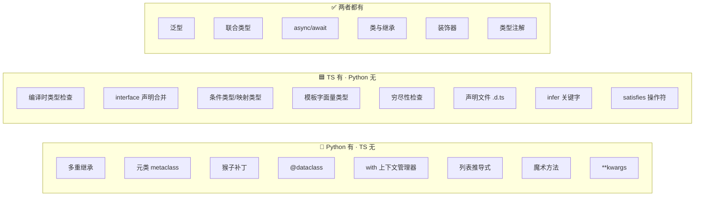

## 前置知识：差异是设计哲学的取舍

Python 强调**运行时灵活性**，TypeScript 强调**编译时安全性**。本篇帮助有 Python 背景的开发者：
1. 快速识别哪些 Python 习惯**不能直接迁移**
2. 理解哪些 TS 特性是**全新的武器**
3. 避免在 TS 里寻找"Python 等价物"而不得的挫败感



> [!important] 迁移心态
> - **不要抱怨 TS 缺少 Python 特性** — 这是设计哲学不同
> - **学习 TS 独有的编译时类型系统** — 这是 Python 永远做不到的
> - **掌握双向对比** — 面试高频考点

---

## 第一板块：Python 有、TypeScript 没有的 12 个核心特性

### 1. 多重继承（Multiple Inheritance）

```python
# Python: 多重继承，通过 MRO 解决方法冲突
class Flyable:
    def fly(self) -> str: return "I can fly"
class Swimmable:
    def swim(self) -> str: return "I can swim"
class Duck(Flyable, Swimmable):  # ✅ 多重继承
    pass
duck = Duck()
duck.fly()   # ✅
duck.swim()  # ✅
```

```typescript
// ❌ TS 不支持类多重继承
// class Duck extends Flyable, Swimmable {}  // 编译错误

// ✅ 替代方案 1：接口 + 组合（推荐）
interface Flyable { fly(): string; }
interface Swimmable { swim(): string; }
class Duck implements Flyable, Swimmable {
  fly(): string { return "I can fly"; }
  swim(): string { return "I can swim"; }
}

// ✅ 替代方案 2：Mixin 模式
type Constructor<T = {}> = new (...args: any[]) => T;
function Flyable<TBase extends Constructor>(Base: TBase) {
  return class extends Base { fly(): string { return "I can fly"; } };
}
function Swimmable<TBase extends Constructor>(Base: TBase) {
  return class extends Base { swim(): string { return "I can swim"; } };
}
class Animal { constructor(public name: string) {} }
class Duck2 extends Swimmable(Flyable(Animal)) {}
```

| 维度 | Python 多重继承 | TS Mixin |
|------|----------------|----------|
| 语法 | `class C(A, B)` | 函数嵌套 |
| MRO | C3 线性化 | 无 MRO |
| 钻石继承 | 有（需解决） | 无（显式组合） |
| 类型安全 | 弱 | 强 |

> [!tip] 迁移建议
> TypeScript 的 Mixin 模式比 Python 多重继承更安全，避免了钻石继承问题。**优先用接口 + 组合**，Mixin 作为补充。

### 2. 元类（Metaclass）

```python
# Python: 元类在类创建时修改类本身
class SingletonMeta(type):
    _instances = {}
    def __call__(cls, *args, **kwargs):
        if cls not in cls._instances:
            cls._instances[cls] = super().__call__(*args, **kwargs)
        return cls._instances[cls]
class Database(metaclass=SingletonMeta):
    def __init__(self, url: str): self.url = url
db1 = Database("postgres://...")
db2 = Database("postgres://...")
assert db1 is db2  # 同一个实例
```

```typescript
// ❌ TS 没有元类
// ✅ 替代方案 1：单例模式
class Database {
  private static instance: Database;
  private constructor(public url: string) {}
  static getInstance(url: string): Database {
    if (!Database.instance) Database.instance = new Database(url);
    return Database.instance;
  }
}
// ✅ 替代方案 2：模块级单例（最简单）
export const db = new Database("postgres://...");
// ✅ 替代方案 3：装饰器（有限能力）
function Singleton<T extends new (...args: any[]) => any>(target: T) {
  let instance: InstanceType<T>;
  return class extends target {
    constructor(...args: any[]) {
      if (instance) return instance;
      super(...args);
      instance = this as InstanceType<T>;
    }
  } as T;
}
```

> [!important] 元类是 Python 独有的运行时元编程能力
> Python 元类在**运行时**修改类本身。TS 的类型系统是**编译时**的，类型擦除后运行时无法改变类行为。装饰器（TS 5.0+）提供了有限的元编程能力，但远不及 Python 元类强大。

### 3. 类方法（@classmethod）

```python
class User:
    _count = 0
    def __init__(self, name: str):
        self.name = name
        User._count += 1
    @classmethod
    def get_count(cls) -> int: return cls._count
    @staticmethod
    def help() -> str: return "User class"
```

```typescript
// TS 只有 static，没有 classmethod
class User {
  private static _count = 0;
  constructor(public name: string) { User._count++; }
  static getCount(): number { return User._count; }
  static help(): string { return "User class"; }
}
```

> **关键差异**：Python 的 `@classmethod` 第一个参数是 `cls`（当前类），子类继承后 `cls` 指向子类。TS 的 `static` 方法中 `this` 指向类本身，但行为不完全等价。

### 4. 描述符（Descriptor）

```python
class ValidatedString:
    def __set_name__(self, owner, name): self.name = name
    def __get__(self, obj, owner): return obj.__dict__.get(self.name)
    def __set__(self, obj, value):
        if not isinstance(value, str) or len(value) < 3:
            raise ValueError("String too short")
        obj.__dict__[self.name] = value
class User:
    name = ValidatedString()
user = User()
user.name = "Alice"  # 自动调用 __set__
```

```typescript
// ❌ TS 没有描述符协议
// ✅ 最接近的：getter / setter
class User {
  private _name: string = "";
  get name(): string { return this._name; }
  set name(value: string) {
    if (value.length < 3) throw new Error("String too short");
    this._name = value;
  }
}
```

### 5. 上下文管理器（with 语句）

```python
# Python with 语句：自动管理资源
with open("file.txt", "r") as f:
    data = f.read()
# 自动关闭文件，即使发生异常

from contextlib import contextmanager
@contextmanager
def timer(name: str):
    start = time.time()
    yield
    print(f"{name}: {time.time() - start:.2f}s")
```

```typescript
// 传统方案：try/finally
const f = await openFile("file.txt");
try { const data = await f.read(); }
finally { await f.close(); }

// ✅ TS 5.2+ using 声明（接近 Python with）
class FileHandle implements Disposable {
  constructor(private path: string) {}
  read(): string { return "file content"; }
  [Symbol.dispose](): void { console.log(`Closing ${this.path}`); }
}
{
  using file = new FileHandle("data.txt");
  console.log(file.read());
}  // 离开作用域自动调用 [Symbol.dispose]()

// ✅ 高阶函数方案（最接近 with 语义）
async function withFile<T>(path: string, fn: (f: File) => Promise<T>): Promise<T> {
  const f = await openFile(path);
  try { return await fn(f); }
  finally { await f.close(); }
}
```

| 特性 | Python | TypeScript |
|------|--------|-----------|
| 资源管理语法 | `with` 语句 | `using` 声明（TS 5.2+） |
| 自定义上下文 | `__enter__/__exit__` 或 `@contextmanager` | `Symbol.dispose` / `Symbol.asyncDispose` |
| 生态成熟度 | 非常成熟 | 较新，第三方库支持有限 |

### 6. 魔术方法与运算符重载

```python
class Point:
    def __init__(self, x, y): self.x, self.y = x, y
    def __add__(self, other): return Point(self.x + other.x, self.y + other.y)
    def __eq__(self, other): return self.x == other.x and self.y == other.y
    def __str__(self): return f"Point({self.x}, {self.y})"
    def __len__(self): return 2
p1, p2 = Point(1, 2), Point(3, 4)
p3 = p1 + p2  # ✅ 运算符重载
```

```typescript
// ❌ TS 不支持运算符重载
class Point {
  constructor(public x: number, public y: number) {}
  add(other: Point): Point { return new Point(this.x + other.x, this.y + other.y); }
  equals(other: Point): boolean { return this.x === other.x && this.y === other.y; }
  toString(): string { return `Point(${this.x}, ${this.y})`; }
  get length(): number { return 2; }
}
const p1 = new Point(1, 2);
const p2 = new Point(3, 4);
const p3 = p1.add(p2);  // ✅ 显式方法
```

| Python 魔术方法 | TS 替代 |
|----------------|---------|
| `__init__` | `constructor` |
| `__str__` / `__repr__` | `toString()` |
| `__eq__` | 无法重写 `==`，用 `equals()` |
| `__add__` / `__mul__` | 无运算符重载 |
| `__iter__` / `__next__` | `[Symbol.iterator]()` |
| `__len__` | `length` 属性 |
| `__getitem__` | 无直接等价 |

### 7. `**kwargs` 关键字参数

```python
def log(level: str, **kwargs: Any) -> None:
    print(f"[{level}] {kwargs}")
log("info", user="alice", action="login")
```

```typescript
// ❌ TS 不支持 **kwargs
// ✅ 结构化对象参数
interface LogOptions { user: string; action: string; timestamp?: string; }
function log(level: string, options: LogOptions): void {
  console.log(`[${level}]`, options);
}
log("info", { user: "alice", action: "login" });
```

### 8. 列表/字典/集合推导式

```python
squares = [x ** 2 for x in range(10)]
evens = [x for x in range(20) if x % 2 == 0]
word_len = {w: len(w) for w in ["hello", "world"]}
unique = {x for x in [1, 2, 2, 3, 3, 3]}
```

```typescript
const squares = Array.from({ length: 10 }, (_, i) => i ** 2);
const evens = Array.from({ length: 20 }, (_, i) => i).filter(x => x % 2 === 0);
const wordLen = Object.fromEntries(["hello", "world"].map(w => [w, w.length]));
const unique = [...new Set([1, 2, 2, 3, 3, 3])];
```

| 维度 | Python 推导式 | TS 数组方法 |
|------|-------------|------------|
| 语法 | `[expr for x in iter if cond]` | `iter.filter().map()` |
| 可读性 | 简洁 | 链式 |
| 多数据结构 | 列表/字典/集合 | 主要数组 |

### 9. 猴子补丁（Monkey Patching）

```python
# Python: 运行时替换方法
original_get = requests.get
def patched_get(*args, **kwargs):
    print(f"Patched GET: {args[0]}")
    return original_get(*args, **kwargs)
requests.get = patched_get  # 运行时替换！
```

```typescript
// ❌ TS 无法安全地运行时替换
// ✅ 替代方案 1：扩展接口（类型安全）
declare global {
  interface Array<T> { customSort(): T[]; }
}
Array.prototype.customSort = function () { return this.sort().reverse(); };
// ✅ 替代方案 2：Proxy 代理模式
const handler: ProxyHandler<object> = {
  get(target, prop) {
    console.log(`Accessing ${String(prop)}`);
    return Reflect.get(target, prop);
  }
};
```

> [!warning] 猴子补丁在 TS 中不推荐
> 运行时修改内置对象会导致类型安全和性能问题。推荐用独立的工具函数。

### 10. 可变默认参数（⚠️ Python 陷阱，非优势）

> [!note] 为什么列在"Python 有 TS 无"？
> 严格来说这是 Python 的**设计缺陷/常见陷阱**，而非 Python 的优势特性。放在此处是为了警示 Python 开发者：你习惯的这个陷阱在 TS 中**不存在**，可以直接用 `[]` 作为默认值而无需担心。如果你在 Python 代码中习惯了用 `None` 作为默认值来绕过这个陷阱，在 TS 中完全不需要。

```python
# Python 经典陷阱：默认参数只在函数定义时求值一次
def append_one(items=[]):  # ← 这个 [] 在整个函数生命周期中共用同一个对象
    items.append(1)
    return items
print(append_one())  # [1]
print(append_one())  # [1, 1]  ← 默认参数只初始化一次！

# Python 标准写法（被迫用 None 做哨兵）
def append_one_safe(items=None):
    if items is None:
        items = []
    items.append(1)
    return items
```

```typescript
// TS 没有这个问题！
function appendOne(items: number[] = []): number[] {
  items.push(1);
  return items;
}
console.log(appendOne());  // [1]
console.log(appendOne());  // [1]  ✅ 每次调用都创建新数组
// 无需写 items === undefined 的防御代码
```

> [!tip] 这是 TS 比 Python 更安全的点
> TS 的默认参数每次调用都重新求值，没有 Python 的可变默认参数陷阱。可以直接写 `items: number[] = []`，无需像 Python 那样用 `None` 绕过。

### 11. 运行时反射

```python
class User:
    def __init__(self, name): self.name = name
u = User("Alice")
print(u.__dict__)           # {'name': 'Alice'}
print(u.__class__.__name__) # User
setattr(u, "age", 25)       # 运行时添加属性
getattr(u, "name")          # Alice
```

```typescript
// ❌ TS 编译后类型信息全部擦除
class User { constructor(public name: string) {} }
const u = new User("Alice");
console.log(Object.keys(u));     // ["name"]
console.log(u.constructor.name); // "User"
// 类型信息在运行时完全不存在！

// ✅ 需要运行时类型信息时，用 Zod 等运行时校验库
import { z } from "zod";
const UserSchema = z.object({ name: z.string(), age: z.number() });
const user = UserSchema.parse(data);  // 运行时验证 + 类型安全
```

### 12. 内置标准库的广度

| Python 标准库 | TS/Node 对应 | 差异 |
|--------------|--------------|------|
| `itertools` | 无原生 | 需 lodash / 手写 |
| `functools` | 部分有 | `partial`、`reduce` 需引入 |
| `collections` | 无 | Map/Set + 手写 |
| `dataclasses` | 无 | interface + class |
| `pathlib` | `node:path` | 功能类似 |
| `decimal` | 无 | JS 浮点精度问题 |
| `datetime` | `Date` | TS 的 Date 较弱 |
| `re` | `RegExp` | 一致 |
| `json` | `JSON` | 一致 |

---

## 第二板块：TypeScript 有、Python 没有的 15 个核心特性

> 这些特性是 TypeScript 的"杀手锏"，也是 Python 开发者迁移后最该掌握的新能力。

### 1. 编译时类型检查（核心差异）

```typescript
// TS: 编译时发现类型错误
function add(a: number, b: number): number { return a + b; }
// add("hello", "world");  // ❌ 编译报错！
```

```python
# Python: 运行时才发现（除非用 mypy）
def add(a: int, b: int) -> int: return a + b
# add("hello", "world")  # 运行时才 TypeError
```

| 维度 | Python | TypeScript |
|------|--------|-----------|
| 检查时机 | 运行时（mypy 可选外挂） | 编译时（内置强制） |
| 类型擦除 | 不擦除（运行时保留） | 擦除（编译为纯 JS） |
| IDE 补全 | 中等 | 极强（类型驱动） |

### 2. 结构子类型（Structural Subtyping）

```typescript
// TS 的结构子类型：只看形状，不看名字
interface Point { x: number; y: number; }
interface Vector { x: number; y: number; }
const p: Point = { x: 1, y: 2 };
const v: Vector = p;  // ✅ 结构相同即可赋值
```

```python
# Python 是名义类型（nominal typing）
from dataclasses import dataclass
@dataclass
class Point: x: int; y: int
@dataclass
class Vector: x: int; y: int
p = Point(1, 2)
# v: Vector = p  # ❌ mypy 报错
```

### 3. 条件类型与 infer

```typescript
// ★ 类型级别的 if-else（Python 完全没有！）
type IsString<T> = T extends string ? true : false;
type A = IsString<"hello">;  // true
type B = IsString<42>;        // false

// 提取 Promise 内部类型
type Unwrap<T> = T extends Promise<infer U> ? U : T;
type V = Unwrap<Promise<number>>;  // number

// 提取函数返回值类型
type ReturnOf<T> = T extends (...args: any[]) => infer R ? R : never;
type F = ReturnOf<() => string>;  // string
```

> **Python 对比**：Python 的类型系统是**声明式**的，不支持类型级别的条件判断和递归。最接近的是 `@overload` 多版本声明，但完全没有类型计算能力。

### 4. 映射类型与键名转换

```typescript
// ★ 批量变换对象类型（Python 完全没有！）
interface User { name: string; age: number; email: string; }

type PartialUser = { [K in keyof User]?: User[K]; };        // 全部可选
type ReadonlyUser = { readonly [K in keyof User]: User[K]; }; // 全部只读
type Getters<T> = { [K in keyof T as `get${Capitalize<string & K>}`]: () => T[K]; };
type UserGetters = Getters<User>;
// { getName: () => string; getAge: () => number; getEmail: () => string; }

// 属性过滤
type StringProps<T> = {
  [K in keyof T as T[K] extends string ? K : never]: T[K];
};
```

### 5. 模板字面量类型

```typescript
// ★ 类型级别的字符串拼接
type EventName = `on${Capitalize<string>}`;
const click: EventName = "onClick";  // ✅
// const bad: EventName = "click";   // ❌

type CSSRule = `${"margin" | "padding"}${"Top" | "Right" | "Bottom" | "Left"}`;
// 自动生成 8 种组合！

type Route = `/api/${"users" | "posts"}/${number}`;
const r1: Route = "/api/users/123";  // ✅
```

### 6. 可辨识联合与穷尽性检查

```typescript
// ★ 穷尽性检查（Python 完全没有！）
type Shape =
  | { kind: "circle"; radius: number }
  | { kind: "square"; side: number };

function area(shape: Shape): number {
  switch (shape.kind) {
    case "circle": return Math.PI * shape.radius ** 2;
    case "square": return shape.side ** 2;
    default:
      const _exhaustive: never = shape;  // 如果漏了分支，编译器报错！
      return _exhaustive;
  }
}
```

> **Python 对比**：Python 3.10+ 的 `match/case` 可以做类似的分支，但**没有编译时穷尽性检查**。漏了分支只有运行时才发现。

### 7. 声明合并（Declaration Merging）

```typescript
// ★ 同名 interface 自动合并
interface Window { title: string; }
interface Window { ts: string; }  // 自动合并！
// Window 现在同时有 title 和 ts

// 扩展第三方库类型
declare module "express" {
  interface Request { user?: { id: string; role: string }; }
}
```

### 8. satisfies 操作符（TS 4.9+）

```typescript
// ★ 验证类型但不改变推断类型
const config = {
  host: "localhost",
  port: 3000,
} satisfies Record<string, string | number>;
// config.port 是 number（保留了推断类型，而非退化成 string | number）。
// ⚠️ 但它不是字面量 3000——对象属性默认拓宽；想保留 3000 要 `as const satisfies ...`
```

> **Python 对比**：Python 的 `cast()` 只做类型提示，不做验证。TS 的 `satisfies` 会**实际检查**值是否满足类型，同时保留精确推断。

### 9. 工具类型（Utility Types）

```typescript
interface User { id: number; name: string; email: string; password: string; }
type UserPublic = Pick<User, "id" | "name">;      // 选择属性
type UserSafe = Omit<User, "password">;           // 排除属性
type UserPartial = Partial<User>;                  // 全部可选
type UserReadonly = Readonly<User>;               // 全部只读
type UserRecord = Record<string, User>;           // 键值对映射
type NonNull = NonNullable<string | null>;        // 排除 null
```

### 10. 函数重载（语言级）

```typescript
function format(value: string): string;
function format(value: number, decimals?: number): string;
function format(value: string | number, decimals?: number): string {
  if (typeof value === "string") return value.toUpperCase();
  return value.toFixed(decimals ?? 2);
}
format("hello");      // 返回 string
format(3.14, 2);      // 返回 string
```

> **Python 对比**：Python 的 `@overload` 仅做类型提示（mypy 检查），运行时无效。TS 的重载是**编译时特性**。

### 11. `as const` 锁定字面量类型

```typescript
const Direction = {
  Up: "UP", Down: "DOWN", Left: "LEFT", Right: "RIGHT",
} as const;
type DirectionValue = typeof Direction[keyof typeof Direction];
// "UP" | "DOWN" | "LEFT" | "RIGHT"
```

### 12. 类型守卫 `is` 关键字

```typescript
function isString(value: unknown): value is string {
  return typeof value === "string";
}
const x: unknown = "hello";
if (isString(x)) {
  console.log(x.toUpperCase());  // ✅ x 被收窄为 string
}
```

### 13. 索引访问类型

```typescript
interface User { name: string; address: { city: string; zip: number }; }
type UserName = User["name"];              // string
type City = User["address"]["city"];      // string
```

### 14. 声明文件 `.d.ts` 生态

```typescript
// 几乎每个 npm 包都有 @types/ 声明
import type { User } from "./types.d.ts";
// 为没有类型的 JS 库添加类型
declare module "legacy-lib" {
  export function doSomething(input: string): number;
}
```

> **Python 对比**：TS 的 `@types/*` 生态比 Python 的 `types-*` 生态成熟得多。

### 15. 可选链 `?.` 与空值合并 `??`

```typescript
const city = user?.address?.city;        // 可选链
const name = user.name ?? "Anonymous";   // 空值合并（只对 null/undefined）
```

---

## 第三板块：迁移策略矩阵

| Python 习惯 | TS 对应方案 | 难度 |
|------------|------------|------|
| 多重继承 | 接口 + 组合 / Mixin | ⭐⭐ |
| 元类 | 装饰器 / 工厂函数 | ⭐⭐⭐ |
| @classmethod | static 方法 | ⭐⭐ |
| 描述符 | getter/setter | ⭐⭐ |
| with 上下文管理器 | try/finally / using (TS 5.2+) | ⭐⭐ |
| 魔术方法 | 显式方法 / Symbol | ⭐⭐ |
| **kwargs | 结构化对象参数 | ⭐ |
| 列表推导式 | map/filter/reduce 链式 | ⭐ |
| @dataclass | interface + 对象字面量 | ⭐⭐ |
| 运行时反射 | 有限反射 + Zod | ⭐⭐⭐ |
| 同步 I/O | async/await | ⭐⭐ |
| isinstance(x, int) | typeof + 类型守卫 | ⭐ |
| `or` 默认值 | `??`（语义不同！） | ⭐ |

---

## 第四板块：你会特别想 Python 的地方

| 场景 | Python 方案 | TypeScript 生态现状 |
|------|------------|-------------------|
| 数据处理 | `pandas` 一行搞定 | 需自定义函数或 lodash |
| 数值计算 | `numpy` 矩阵运算 | 无原生，需 WASM 或调用 Python |
| 机器学习 | `pytorch` / `scikit-learn` | 无原生，需调用 Python API |
| 脚本自动化 | 直接 `python script.py` | 需 `tsx` 替代 |
| 快速原型 | 动态类型快速试错 | 类型标注有额外开销 |
| 科学计算 | `scipy` / `matplotlib` | 无原生 |
| 字符串处理 | 内置方法丰富 | 较简单，需 lodash |
| 文件处理 | `pathlib` 优雅 | `node:path` 较繁琐 |
| 正则表达式 | 原生支持好 | 语法一致但 API 不同 |
| 调试 | `pdb` / `breakpoint()` | `node --inspect` + Chrome DevTools |
| zip / enumerate | 内置函数 | 需手写或 lodash |
| decimal 精确小数 | `decimal` 模块 | 无原生，需第三方库 |

---

## 常见易错点

> [!warning] **坑 1：Python 的 `or` ≠ TS 的 `||`**
> ```python
> # 0 or "default" → "default"（0 是 falsy）
> ```
> ```typescript
> // 0 || "default" → "default"（0 也是 falsy）
> // ✅ 用 ?? 替代：0 ?? "default" → 0（保留 0！）
> ```

> [!warning] **坑 2：Python 的 `==` ≠ TS 的 `==`**
> ```typescript
> // TS: 0 == "" → true（隐式转换！）
> // null == undefined → true
> // ✅ 永远用 ===
> ```

> [!warning] **坑 3：Python 的 `for...in` ≠ TS 的 `for...in`**
> ```python
> # for item in [1,2,3]  → 遍历值
> ```
> ```typescript
> // for (let key in obj)  → 遍历键（不是值！）
> // for (let item of arr)  → 遍历值
> ```

> [!warning] **坑 4：Python `sort()` vs TS `Array.sort()`**
> ```typescript
> // [10, 2, 1].sort();  // [1, 10, 2]（按字符串排序！）
> // ✅ [10, 2, 1].sort((a, b) => a - b);  // [1, 2, 10]
> ```

> [!warning] **坑 5：运行时假设类型信息存在**
> ```typescript
> // ❌ if (typeof user === "User") { ... }  // 永远不满足！
> // ✅ 用 Zod 等运行时校验库
> ```

> [!warning] **坑 6：装饰器用错了地方**
> ```typescript
> // ❌ TS 装饰器不能装饰独立函数
> @logCalls
> function greet() {}  // 编译错误
> // ✅ 装饰器只能用于 class 的方法/属性/字段
> ```

---

## 🎯 本文学完自检

| 层次 | 检查项 |
|------|--------|
| 🟢 基础 | 能列出 5 个 Python 有但 TS 没有的特性，给出 TS 替代方案 |
| 🟢 基础 | 能列出 5 个 TS 有但 Python 没有的特性 |
| 🟡 进阶 | 能解释 Python 多重继承在 TS 中的三种替代方案 |
| 🟡 进阶 | 能对比 Python `or` vs TS `||` vs TS `??` 的行为差异 |
| 🔴 挑战 | 能完整画出 Python→TS 迁移心智模型对比图 |

---

## 相关笔记

- ⬅️ 前置：[[01-环境搭建与基础类型对比]] — 基础类型差异
- ⬅️ 前置：[[02-函数与面向对象对比]] — 函数与 OOP 差异
- ⬅️ 前置：[[03-类型系统进阶-TS独有武器]] — TS 独有类型特性
- ⬅️ 前置：[[04-异步编程与并发模型对比]] — 并发模型差异
- ⬅️ 前置：[[05-模块系统与工程化]] — 工程化差异
- ➡️ 后续：[[01-学习/TypeScriptLearningByPython/07-业务场景实战合集|07-业务场景实战合集]] — 实战中应用双向对比
- ➡️ 后续：[[01-学习/TypeScriptLearningByPython/08-面试高频20问-Python背景版|08-面试高频20问-Python背景版]] — 高频对比题

---

*最后更新：2026-07-22*