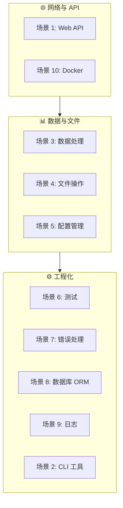

## 前置知识：实战是迁移的检验

前 6 篇笔记建立了 Python→TS 的概念映射，本篇用 **10 个真实业务场景** 把概念串起来。每个场景遵循 **Python 做法 → TS 做法 → 差异分析** 的三段式结构。



> [!important] 学习建议
> - 选和自己工作最相关的 3-5 个场景深入，不要一次性看完
> - 每个场景都要**动手写一遍**，不要只读
> - 重点体会"Python 思维方式"到"TS 思维方式"的转变

---

## 场景 1：Web API 开发（FastAPI → Express + Zod）

### Python 做法（FastAPI + Pydantic）

```python
from fastapi import FastAPI, HTTPException
from pydantic import BaseModel, Field
from typing import Optional

app = FastAPI(title="Todo API")

class TodoCreate(BaseModel):
    title: str = Field(..., min_length=1, max_length=200)
    completed: bool = False
    priority: Optional[int] = Field(None, ge=1, le=5)

class TodoResponse(BaseModel):
    id: int
    title: str
    completed: bool
    priority: Optional[int] = None

todos: list[TodoResponse] = []
next_id = 1

@app.post("/todos", response_model=TodoResponse, status_code=201)
async def create_todo(todo: TodoCreate):
    global next_id
    item = TodoResponse(id=next_id, **todo.model_dump())
    todos.append(item)
    next_id += 1
    return item

@app.get("/todos", response_model=list[TodoResponse])
async def list_todos(completed: Optional[bool] = None):
    result = todos
    if completed is not None:
        result = [t for t in result if t.completed == completed]
    return result
```

### TypeScript 做法（Express + Zod）

```typescript
import express, { Request, Response, NextFunction } from "express";
import { z } from "zod";

const app = express();
app.use(express.json());

// ✅ Zod 替代 Pydantic
const TodoCreateSchema = z.object({
  title: z.string().min(1).max(200),
  completed: z.boolean().default(false),
  priority: z.number().int().min(1).max(5).optional(),
});

type TodoCreate = z.infer<typeof TodoCreateSchema>;

interface TodoResponse {
  id: number;
  title: string;
  completed: boolean;
  priority?: number;
}

const todos: TodoResponse[] = [];
let nextId = 1;

// ✅ 验证中间件（替代 FastAPI 自动验证）
function validateBody<T>(schema: z.ZodSchema<T>) {
  return (req: Request, res: Response, next: NextFunction) => {
    const result = schema.safeParse(req.body);
    if (!result.success) {
      return res.status(422).json({ errors: result.error.issues });
    }
    req.body = result.data;
    next();
  };
}

app.post("/todos", validateBody(TodoCreateSchema), (req: Request, res: Response) => {
  const todo: TodoCreate = req.body;
  const item: TodoResponse = { id: nextId++, ...todo };
  todos.push(item);
  res.status(201).json(item);
});

app.get("/todos", (req: Request, res: Response) => {
  const { completed } = req.query;
  let result = todos;
  if (completed !== undefined) {
    const isCompleted = completed === "true";
    result = result.filter(t => t.completed === isCompleted);
  }
  res.json(result);
});

app.listen(3000, () => console.log("Server on :3000"));
```

| 维度 | Python FastAPI | TypeScript Express |
|------|---------------|-------------------|
| 数据验证 | Pydantic（内置自动） | Zod（手动中间件） |
| 依赖注入 | `Depends()` | 中间件链 |
| 自动文档 | Swagger 自动生成 | 需 `@fastify/swagger` |
| 请求体解析 | 自动 | 需 `express.json()` |
| 类型安全 | 运行时 Pydantic | 编译时 TS + 运行时 Zod |

> [!tip] 推荐用 Fastify 替代 Express
> Fastify 的插件系统更接近 FastAPI 的依赖注入风格，性能也更好。`@fastify/swagger` 可自动生成 API 文档，弥补 Express 无自动文档的短板。

---

## 场景 2：CLI 工具开发（click → commander）

### Python 做法（click）

```python
import click

@click.group()
def cli():
    """项目管理工具"""
    pass

@cli.command()
@click.option("--name", required=True, help="项目名称")
@click.option("--template", default="default", help="模板类型")
def create(name: str, template: str):
    """创建新项目"""
    click.echo(f"创建项目 {name}，使用模板 {template}")

@cli.command()
@click.argument("project_id")
def deploy(project_id: str):
    """部署项目"""
    click.echo(f"正在部署项目 {project_id}...")

if __name__ == "__main__":
    cli()
```

### TypeScript 做法（commander）

```typescript
#!/usr/bin/env node
import { Command } from "commander";

const program = new Command();

program
  .name("my-cli")
  .description("项目管理工具")
  .version("1.0.0");

program
  .command("create")
  .description("创建新项目")
  .requiredOption("--name <name>", "项目名称")
  .option("--template <type>", "模板类型", "default")
  .action((options) => {
    console.log(`创建项目 ${options.name}，使用模板 ${options.template}`);
  });

program
  .command("deploy <project-id>")
  .description("部署项目")
  .action((projectId: string) => {
    console.log(`正在部署项目 ${projectId}...`);
  });

program.parse(process.argv);
```

| 维度 | Python click | TypeScript commander |
|------|-------------|---------------------|
| 定义方式 | 装饰器 `@cli.command()` | 方法链 `program.command()` |
| 参数类型推断 | 自动 | 需手动声明 |
| 子命令 | `@click.group()` | `program.command()` 嵌套 |
| shebang | 不需要 | 需要 `#!/usr/bin/env node` |
| 打包分发 | `pip install` | `npm install -g` + `bin` 字段 |

---

## 场景 3：数据处理与转换（pandas → 原生 + lodash）

### Python 做法（pandas + 列表推导）

```python
import pandas as pd
from collections import defaultdict

users = [
    {"name": "Alice", "age": 30, "city": "NYC"},
    {"name": "Bob", "age": 25, "city": "SF"},
    {"name": "Charlie", "age": 35, "city": "NYC"},
]

# 过滤 + 分组 + 聚合
df = pd.DataFrame(users)
adults = df[df["age"] >= 30]
city_groups = adults.groupby("city")["name"].apply(list).to_dict()

# 排序
sorted_users = sorted(users, key=lambda u: u["age"], reverse=True)

# 分组统计
age_counts = {}
for u in users:
    decade = u["age"] // 10 * 10
    age_counts[decade] = age_counts.get(decade, 0) + 1
```

### TypeScript 做法（原生方法 + lodash）

```typescript
interface User { name: string; age: number; city: string; }

const users: User[] = [
  { name: "Alice", age: 30, city: "NYC" },
  { name: "Bob", age: 25, city: "SF" },
  { name: "Charlie", age: 35, city: "NYC" },
];

// 过滤 + 分组（ES2024 Object.groupBy）
const adults = users.filter(u => u.age >= 30);
const cityGroups = Object.groupBy(adults, u => u.city);
// 或用 reduce（兼容旧版本）
const cityGroups2 = adults.reduce((acc, u) => {
  (acc[u.city] ??= []).push(u.name);
  return acc;
}, {} as Record<string, string[]>);

// 排序（★ 注意：必须传比较函数！）
const sorted = [...users].sort((a, b) => b.age - a.age);

// 分组统计
const ageCounts = users.reduce((acc, u) => {
  const decade = Math.floor(u.age / 10) * 10;
  acc[decade] = (acc[decade] ?? 0) + 1;
  return acc;
}, {} as Record<number, number>);
```

| 操作 | Python | TypeScript |
|------|--------|-----------|
| 过滤 | `[x for x in arr if cond]` | `arr.filter(x => cond)` |
| 映射 | `[f(x) for x in arr]` | `arr.map(x => f(x))` |
| 排序 | `sorted(arr, key=lambda x: x.age)` | `[...arr].sort((a,b) => a.age - b.age)` |
| 分组 | `defaultdict` / `itertools.groupby` | `Object.groupBy` / `reduce` |
| 去重 | `set(arr)` | `[...new Set(arr)]` |
| 扁平化 | `[x for sub in arr for x in sub]` | `arr.flat()` |

> [!warning] ★ 坑：TS 的 `Array.sort()` 默认按字符串排序
> ```typescript
> [10, 2, 1].sort();  // [1, 10, 2] ← 按字符串排序！
> [10, 2, 1].sort((a, b) => a - b);  // [1, 2, 10] ✅
> ```
> Python 的 `sort()` 不会有这个问题。

> [!tip] 数据处理推荐用 lodash
> TS 中推荐使用 **lodash**（`groupBy`、`sortBy`、`chunk` 等）弥补原生数组方法的不足。但大规模数据分析（pandas 场景）TS 无等价工具，建议用 Python。

---

## 场景 4：文件系统操作（pathlib → node:fs/promises）

### Python 做法（pathlib）

```python
from pathlib import Path
import json

# 递归遍历
for file in Path("./src").rglob("*.ts"):
    print(file.name)

# 批量读取 JSON
data = {}
for file in Path("config/").glob("*.json"):
    data[file.stem] = json.loads(file.read_text())

# 创建目录 + 写文件
Path("output/data").mkdir(parents=True, exist_ok=True)
Path("output/report.json").write_text(json.dumps(data, indent=2))
```

### TypeScript 做法（node:fs/promises + glob）

```typescript
import { readFile, writeFile, mkdir } from "node:fs/promises";
import { join, basename } from "node:path";
import { glob } from "glob";  // npm install glob

// 递归遍历
const files = await glob("src/**/*.ts");
for (const file of files) {
  console.log(basename(file));
}

// 批量读取 JSON
const configFiles = await glob("config/*.json");
const data: Record<string, unknown> = {};
for (const file of configFiles) {
  const key = basename(file, ".json");
  const content = await readFile(file, "utf-8");
  data[key] = JSON.parse(content);
}

// 创建目录 + 写文件
await mkdir("output/data", { recursive: true });
await writeFile("output/report.json", JSON.stringify(data, null, 2));
```

| 操作 | Python | TypeScript |
|------|--------|-----------|
| 路径拼接 | `Path("dir") / "file"` | `join("dir", "file")` |
| 递归遍历 | `rglob("*.ts")` | `glob("**/*.ts")`（需 npm 包） |
| 读取文本 | `Path.read_text()` | `readFile(path, "utf-8")` |
| 创建目录 | `mkdir(parents=True)` | `mkdir({ recursive: true })` |
| 提取文件名 | `file.stem` | `basename(file, ext)` |
| 同步/异步 | 默认同步 | 默认异步（Promise） |

> [!warning] Node 原生 fs 没有 glob
> `node:fs` 没有通配符匹配功能，需要 `npm install glob` 或使用 `fs.readdir` 后手动过滤。

---

## 场景 5：配置管理（pydantic-settings → dotenv + Zod）

### Python 做法（pydantic-settings）

```python
from pydantic_settings import BaseSettings

class Settings(BaseSettings):
    app_name: str = "My App"
    database_url: str
    redis_url: str = "redis://localhost:6379"
    debug: bool = False
    port: int = 3000

    model_config = {"env_file": ".env", "env_prefix": "APP_"}

settings = Settings()
print(settings.database_url)
```

### TypeScript 做法（dotenv + Zod）

```typescript
import { z } from "zod";
import "dotenv/config";  // 自动加载 .env

const EnvSchema = z.object({
  APP_NAME: z.string().default("My App"),
  DATABASE_URL: z.string().url(),
  REDIS_URL: z.string().url().default("redis://localhost:6379"),
  DEBUG: z.enum(["true", "false"]).transform(v => v === "true").default("false"),
  PORT: z.coerce.number().int().positive().default(3000),
});

const env = EnvSchema.parse(process.env);  // 启动时验证

export const config = {
  appName: env.APP_NAME,
  databaseUrl: env.DATABASE_URL,
  redisUrl: env.REDIS_URL,
  debug: env.DEBUG,
  port: env.PORT,
} as const;
```

| 维度 | Python pydantic-settings | TypeScript dotenv + Zod |
|------|--------------------------|------------------------|
| 环境变量加载 | 内置 `.env` | 需 `dotenv` 包 |
| 类型转换 | 自动 | `z.coerce` 显式转换 |
| 验证 | 启动时自动 | 启动时显式 `.parse()` |
| 前缀支持 | `env_prefix` | 手动处理 |

> [!warning] 类型陷阱
> `process.env` 的所有值都是 `string | undefined`，**没有自动类型转换**。布尔值必须手动比较字符串或用 `z.coerce`。

---

## 场景 6：测试（pytest → vitest）

### Python 做法（pytest）

```python
import pytest

@pytest.fixture
def client():
    app = create_app()
    return app.test_client()

def test_create_todo(client):
    resp = client.post("/todos", json={"title": "Buy milk"})
    assert resp.status_code == 201
    data = resp.get_json()
    assert data["id"] == 1
    assert data["completed"] == False

@pytest.mark.parametrize("title,status", [
    ("", 422),
    ("a" * 201, 422),
    ("Valid", 201),
])
def test_validation(client, title, status):
    resp = client.post("/todos", json={"title": title})
    assert resp.status_code == status
```

### TypeScript 做法（vitest）

```typescript
import { describe, it, expect, beforeAll, afterAll } from "vitest";
import request from "supertest";
import { app } from "../src/app";

describe("POST /todos", () => {
  it("should create a todo", async () => {
    const res = await request(app)
      .post("/todos")
      .send({ title: "Buy milk" });

    expect(res.status).toBe(201);
    expect(res.body.id).toBe(1);
    expect(res.body.completed).toBe(false);
  });

  it.each([
    ["", 422],
    ["a".repeat(201), 422],
    ["Valid", 201],
  ])("should handle title=%s → status=%i", async (title, expectedStatus) => {
    const res = await request(app)
      .post("/todos")
      .send({ title });
    expect(res.status).toBe(expectedStatus);
  });
});
```

| 维度 | Python pytest | TypeScript vitest |
|------|-------------|------------------|
| fixture | `@pytest.fixture` | `beforeAll` / `beforeEach` |
| 参数化 | `@pytest.mark.parametrize` | `it.each()` |
| 异步测试 | 原生 async | 原生 async |
| 覆盖率 | `pytest-cov` | v8（内置） |
| 快照测试 | `pytest-snapshot` | `expect().toMatchSnapshot()` |
| 并行执行 | `pytest -n auto` | vitest 默认并行 |

---

## 场景 7：错误处理（自定义异常 → 自定义 Error 子类）

### Python 做法

```python
class AppError(Exception):
    def __init__(self, message: str, code: int = 500):
        self.message = message
        self.code = code

class NotFoundError(AppError):
    def __init__(self, resource: str):
        super().__init__(f"{resource} not found", 404)

class ValidationError(AppError):
    def __init__(self, errors: list[str]):
        super().__init__("Validation failed", 422)
        self.errors = errors

try:
    user = find_user(user_id)
    if not user:
        raise NotFoundError("User")
except AppError as e:
    print(f"[{e.code}] {e.message}")
except Exception as e:
    raise  # 未预期的错误继续抛出
```

### TypeScript 做法

```typescript
class AppError extends Error {
  constructor(
    message: string,
    public readonly code: number = 500
  ) {
    super(message);
    this.name = "AppError";
  }
}

class NotFoundError extends AppError {
  constructor(resource: string) {
    super(`${resource} not found`, 404);
    this.name = "NotFoundError";
  }
}

class ValidationError extends AppError {
  public readonly errors: string[];
  constructor(errors: string[]) {
    super("Validation failed", 422);
    this.name = "ValidationError";
    this.errors = errors;
  }
}

try {
  const user = await findUser(userId);
  if (!user) throw new NotFoundError("User");
} catch (e) {
  if (e instanceof AppError) {
    console.log(`[${e.code}] ${e.message}`);
  } else {
    throw e;  // 未预期的错误继续抛出
  }
}
```

| Python 特性 | TypeScript 对应 |
|------------|----------------|
| `raise AppError(...)` | `throw new AppError(...)` |
| `except AppError as e:` | `if (e instanceof AppError)` |
| `except (A, B) as e:` | `if (e instanceof A \|\| e instanceof B)` |
| `finally` | `finally`（一致） |
| `with suppress(Error)` | `try { ... } catch { /* ignore */ }` |
| 异常链 `raise ... from e` | `new Error("msg", { cause: e })` |

> [!tip] Error 子类必须设置 `this.name`
> TS 中 `Error.name` 默认是 `"Error"`，子类需手动设置，否则 `instanceof` 虽然生效但日志/调试时会混淆。

---

## 场景 8：数据库 ORM（SQLAlchemy → Drizzle/Prisma）

### Python 做法（SQLAlchemy）

```python
from sqlalchemy.orm import DeclarativeBase, Mapped, mapped_column, Session

class Base(DeclarativeBase): pass

class User(Base):
    __tablename__ = "users"
    id: Mapped[int] = mapped_column(primary_key=True)
    name: Mapped[str]
    email: Mapped[str] = mapped_column(unique=True)

engine = create_engine("sqlite:///app.db")

def create_user(name: str, email: str) -> User:
    with Session(engine) as session:
        user = User(name=name, email=email)
        session.add(user)
        session.commit()
        return user

def get_user(user_id: int) -> User | None:
    with Session(engine) as session:
        return session.get(User, user_id)
```

### TypeScript 做法（Drizzle ORM）

```typescript
import { drizzle } from "drizzle-orm/better-sqlite3";
import { sqliteTable, integer, text } from "drizzle-orm/sqlite-core";
import { eq } from "drizzle-orm";
import Database from "better-sqlite3";

const users = sqliteTable("users", {
  id: integer("id").primaryKey({ autoIncrement: true }),
  name: text("name").notNull(),
  email: text("email").notNull().unique(),
});

const sqlite = new Database("app.db");
const db = drizzle(sqlite, { schema: { users } });

async function createUser(name: string, email: string) {
  const [user] = await db.insert(users).values({ name, email }).returning();
  return user;
}

async function getUser(userId: number) {
  return db.query.users.findFirst({
    where: (u, { eq }) => eq(u.id, userId),
  });
}
```

| 维度 | Python SQLAlchemy | TypeScript Drizzle |
|------|------------------|-------------------|
| 模型定义 | `class User(Base)` | 表定义函数 `sqliteTable()` |
| 类型安全 | 运行时 + mypy | 编译时 + 自动推导 |
| 查询构建 | `select()` 函数 | `db.select()` 链式 |
| 迁移工具 | Alembic | `drizzle-kit` |
| 学习曲线 | 中高 | 中 |

> [!tip] 其他 TS ORM 选择
> - **Prisma**：声明式 schema.prisma 文件，自动生成类型，最流行
> - **Drizzle**：更接近 SQL，零运行时开销（推荐）
> - **TypeORM**：类似 Java Hibernate，装饰器风格

---

## 场景 9：日志（logging/structlog → pino）

### Python 做法（structlog）

```python
import structlog

structlog.configure(
    processors=[
        structlog.stdlib.add_log_level,
        structlog.dev.ConsoleRenderer(),
    ]
)
logger = structlog.get_logger()

logger.info("user_created", user_id=123, email="alice@example.com")
logger.error("payment_failed", order_id=456, reason="insufficient_funds")
```

### TypeScript 做法（pino）

```typescript
import pino from "pino";

const logger = pino({
  level: process.env.LOG_LEVEL ?? "info",
  transport: {
    target: "pino-pretty",
    options: { colorize: true },
  },
});

logger.info({ userId: 123, email: "alice@example.com" }, "user_created");
logger.error({ orderId: 456, reason: "insufficient_funds" }, "payment_failed");

// 子 logger（类似 Python 的 logger.bind）
const childLogger = logger.child({ module: "payment" });
childLogger.info("processing payment");
```

| 维度 | Python structlog | TypeScript pino |
|------|-----------------|----------------|
| 结构化日志 | ✅ | ✅ |
| 性能 | 中等 | 极快（Node 最速） |
| 子 logger | `logger.bind()` | `logger.child()` |
| 上下文传递 | `contextvars` | `AsyncLocalStorage` |
| 格式化 | ConsoleRenderer | pino-pretty |

---

## 场景 10：Docker 容器化

### Python 项目 Dockerfile

```dockerfile
FROM python:3.12-slim
WORKDIR /app
COPY pyproject.toml ./
RUN pip install --no-cache-dir .
COPY . .
CMD ["uvicorn", "app.main:app", "--host", "0.0.0.0", "--port", "8000"]
```

### TypeScript 项目 Dockerfile（多阶段构建）

```dockerfile
# 构建阶段
FROM node:22-alpine AS builder
WORKDIR /app
COPY package.json pnpm-lock.yaml ./
RUN npm install -g pnpm && pnpm install --frozen-lockfile
COPY . .
RUN pnpm build

# 运行阶段（更小镜像）
FROM node:22-alpine
WORKDIR /app
COPY --from=builder /app/dist ./dist
COPY --from=builder /app/node_modules ./node_modules
COPY --from=builder /app/package.json ./
EXPOSE 3000
CMD ["node", "dist/index.js"]
```

| 维度 | Python | TypeScript/Node |
|------|--------|----------------|
| 基础镜像 | `python:3.12-slim` | `node:22-alpine` |
| 包管理器 | pip/poetry | npm/pnpm |
| 多阶段构建 | 较少需要 | 强烈推荐（编译阶段） |
| 镜像大小 | ~150MB | ~100MB（alpine） |
| 启动命令 | `uvicorn` / `gunicorn` | `node` / `pm2` |

> [!tip] TS 的多阶段构建是标配
> TypeScript 需要编译阶段（安装 devDependencies → `tsc`），运行阶段只需 `dist/` + 生产依赖。这是 Python 项目不需要的步骤。

---

## 🎯 本文学完自检

| 层次 | 检查项 |
|------|--------|
| 🟢 基础 | 能独立写出 FastAPI→Express 的 Web API 迁移代码 |
| 🟢 基础 | 能写出 click→commander 的 CLI 迁移代码 |
| 🟡 进阶 | 能完成数据处理（pandas 风格→原生 + lodash 风格） |
| 🟡 进阶 | 能在 TS 项目中配置 Zod 验证 + dotenv 配置管理 |
| 🔴 挑战 | 能完整搭建 Express + Zod + Drizzle + Vitest + Pino 的 TS 项目骨架 |

---

## 相关笔记

- ⬅️ 前置：[[06-Python有TS无与TS有Python无]] — 双向特性对比
- ⬅️ 前置：[[05-模块系统与工程化]] — 工程化体系
- ➡️ 后续：[[01-学习/TypeScriptLearningByPython/08-面试高频20问-Python背景版|08-面试高频20问-Python背景版]] — 面试题实战

---

*最后更新：2026-07-22*