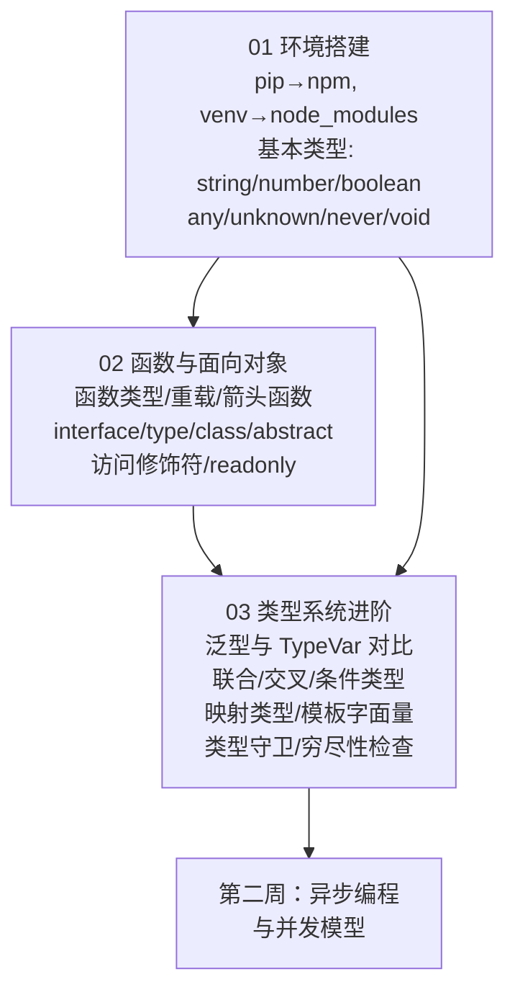

## ⬅️ 前置知识
- 需要：[[01-环境搭建与基础类型对比]] — 基础类型、环境搭建
- 需要：[[02-函数与面向对象对比]] — 函数、接口、类
- 需要：[[03-类型系统进阶-TS独有武器]] — 泛型、条件类型、映射类型

## ➡️ 后续笔记
- [[04-异步编程与并发模型对比]] — 进入第二周

## 🔗 关联笔记
- [[00-TypeScript 总览索引（Python 迁移版）]] — 返回总索引

---

## 📋 第一周知识图谱



---

## ✅ 综合练习

### 练习 1：将 Python dataclass 迁移为 TS 接口 + 类

以下 Python 代码使用 `@dataclass` 和类型注解，请将其迁移为 TypeScript，要求通过 `tsc --strict` 编译：

```python
from dataclasses import dataclass
from typing import Optional
from enum import Enum

class Priority(Enum):
    LOW = "low"
    MEDIUM = "medium"
    HIGH = "high"

@dataclass
class Task:
    id: int
    title: str
    completed: bool = False
    priority: Priority = Priority.MEDIUM
    description: Optional[str] = None

@dataclass
class User:
    name: str
    email: str
    tasks: list[Task] = None  # ← Python 陷阱

    def __post_init__(self):
        if self.tasks is None:
            self.tasks = []

    def add_task(self, title: str, priority: Priority = Priority.MEDIUM) -> Task:
        task = Task(id=len(self.tasks) + 1, title=title, priority=priority)
        self.tasks.append(task)
        return task

    def get_pending(self) -> list[Task]:
        return [t for t in self.tasks if not t.completed]
```

**验收标准**：
- 用 `as const` + 联合类型替代 Python Enum
- 用 `interface` 定义 Task 和 User 的形状
- 用 `class` 实现方法
- 所有参数和返回值标注类型
- 通过 `tsc --strict` 编译零错误

<details><summary>📖 参考答案</summary>

```typescript
// 用 as const 替代 Enum（TS 推荐做法）
const Priority = {
  LOW: "low",
  MEDIUM: "medium",
  HIGH: "high",
} as const;
type Priority = (typeof Priority)[keyof typeof Priority]; // "low" | "medium" | "high"

// 用 interface 定义形状
interface Task {
  id: number;
  title: string;
  completed: boolean;
  priority: Priority;
  description?: string | null; // Optional[str] → string | null | undefined
}

interface User {
  name: string;
  email: string;
  tasks: Task[];
}

// 用 class 实现方法
class UserImpl implements User {
  name: string;
  email: string;
  tasks: Task[] = [];  // ✅ TS 没有可变默认参数陷阱，直接用 []

  constructor(name: string, email: string) {
    this.name = name;
    this.email = email;
  }

  addTask(title: string, priority: Priority = Priority.MEDIUM): Task {
    const task: Task = {
      id: this.tasks.length + 1,
      title,
      completed: false,
      priority,
      description: null,
    };
    this.tasks.push(task);
    return task;
  }

  getPending(): Task[] {
    return this.tasks.filter(t => !t.completed); // 列表推导式 → filter
  }
}
```

</details>

### 练习 2：编写类型守卫函数

```typescript
// 给定以下联合类型，编写函数并使用穷尽性检查

type Result =
  | { status: "success"; data: string }
  | { status: "error"; message: string }
  | { status: "loading"; progress: number };

// 要求：
// 1. 编写函数 handleResult(result: Result): string
// 2. 对每个分支返回不同字符串
// 3. 使用穷尽性检查（never），确保未来新增状态时编译器报错
```

<details><summary>📖 参考答案</summary>

```typescript
function handleResult(result: Result): string {
  switch (result.status) {
    case "success":
      return `✅ ${result.data}`;
    case "error":
      return `❌ ${result.message}`;
    case "loading":
      return `⏳ ${result.progress}%`;
    default: {
      const _exhaustive: never = result; // 穷尽性检查
      return _exhaustive;
    }
  }
}

// 如果未来新增 | { status: "timeout" }，default 分支会编译报错！
```

</details>

### 练习 3：自测选择题

**1. 以下哪些是 TypeScript 有但 Python 没有的？**（多选）
- A) 条件类型 `T extends U ? X : Y`
- B) 泛型
- C) 映射类型 `{ [K in keyof T]: ... }`
- D) 联合类型 `A | B`
- E) 模板字面量类型 `` `on${Capitalize<string>}` ``

<details><summary>📖 答案</summary> **A、C、E**。泛型（B）和联合类型（D）两者都有。</details>

**2. Python 的 `Optional[T]` 在 TS 中最准确的等价是什么？**
- A) `T | null`
- B) `T | undefined`
- C) `T | null | undefined`
- D) `T?`

<details><summary>📖 答案</summary> **C**。Python 的 `Optional[T]` 等价于 `T | None`。TS 中 `null` 和 `undefined` 是不同的空值，最准确的等价是 `T | null | undefined`。如果 tsconfig 中 `strictNullChecks: true` 且 `exactOptionalPropertyTypes: false`（默认），`T?` 等价于 `T | undefined`。</details>

**3. 以下 TS 代码的输出是什么？**

```typescript
const config = {
  host: "localhost",
  port: 3000,
} satisfies Record<string, string | number>;

console.log(typeof config.port);
```

- A) `"string | number"`
- B) `"number"`
- C) 编译错误
- D) `"any"`

<details><summary>📖 答案</summary> **B**。`satisfies` 只校验不改类型，`config.port` 保留推断类型 `number`（注意：不是字面量 `3000`——对象属性默认拓宽），`typeof` 在运行时返回 `"number"`。</details>

---

## 🎯 第一周毕业自检

| 层次 | 检查项 |
|------|--------|
| 🟢 基础 | 能将 Python 的 `list/dict/tuple/Optional/Union` 准确映射到 TS 类型 |
| 🟢 基础 | 能搭建 TS 开发环境并编译运行 TS 程序 |
| 🟢 基础 | 能用 `interface` 和 `type` 定义对象形状，解释何时用哪个 |
| 🟡 进阶 | 能编写泛型函数并用 `extends` 约束泛型参数 |
| 🟡 进阶 | 能编写条件类型和映射类型，解决实际类型变换需求 |
| 🟡 进阶 | 能使用可辨识联合 + 穷尽性检查，确保类型安全分支 |
| 🔴 挑战 | 能独立完成练习 1（dataclass 迁移），通过 `tsc --strict` 零错误 |
| 🔴 挑战 | 能解释 Python `@dataclass` 与 TS `interface` 的三个本质区别 |

---

## 📊 通过标准

- 🟢 全部通过 → 可进入第二周
- 🟡 有未通过项 → 回顾对应笔记后重试
- 🔴 未通过 → 回到 [[01-环境搭建与基础类型对比]] 巩固基础

### 🧭 下一步行动

| 自检结果 | 行动 |
|---------|------|
| 🟢 全部通过 | 进入 [[04-异步编程与并发模型对比]] |
| 🟡 练习 1 未通过 | 回顾 [[02-函数与面向对象对比]] 的 interface/class 部分 |
| 🟡 练习 2 未通过 | 回顾 [[03-类型系统进阶-TS独有武器]] 的穷尽性检查部分 |
| 🟡 练习 3 有错 | 回顾 [[03-类型系统进阶-TS独有武器]] 的条件类型/satisfies 部分 |
| 🔴 多项未通过 | 回到 [[01-环境搭建与基础类型对比]] 从头巩固 |

---

*最后更新：2026-07-22*
