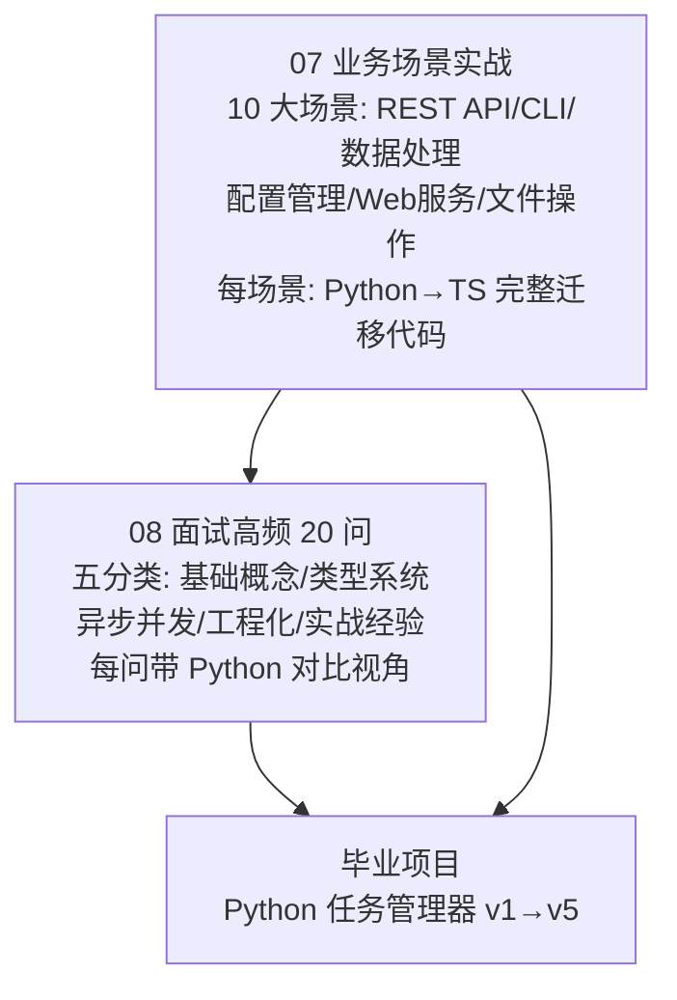

## ⬅️ 前置知识
- 需要：[[01-学习/TypeScriptLearningByPython/07-业务场景实战合集|07-业务场景实战合集]] — 10 大场景 Python→TS 迁移
- 需要：[[01-学习/TypeScriptLearningByPython/08-面试高频20问-Python背景版|08-面试高频20问-Python背景版]] — 面试高频问题

## ➡️ 后续笔记
- [[毕业项目-Python任务管理器/v1-类型标注版]] — 进入毕业项目

## 🔗 关联笔记
- [[00-TypeScript 总览索引（Python 迁移版）]] — 返回总索引
- [[01-学习/TypeScriptLearningByPython/99-第一周复习检查点|99-第一周复习检查点]] — 第一周复习
- [[01-学习/TypeScriptLearningByPython/99-第二周复习检查点|99-第二周复习检查点]] — 第二周复习

---

## 📋 第三周知识图谱



---

## ✅ 综合练习

### 练习 1：将 Python Flask REST API 迁移为 TS Express

以下 Python Flask 代码实现了一个简单的任务管理 API，请将其迁移为 TypeScript Express：

```python
from flask import Flask, jsonify, request
from dataclasses import dataclass
from typing import Optional

app = Flask(__name__)

@dataclass
class Task:
    id: int
    title: str
    completed: bool = False

tasks: list[Task] = []
next_id = 1

@app.route("/tasks", methods=["GET"])
def list_tasks():
    filter_status = request.args.get("filter", "all")
    if filter_status == "completed":
        result = [t for t in tasks if t.completed]
    elif filter_status == "pending":
        result = [t for t in tasks if not t.completed]
    else:
        result = tasks
    return jsonify([t.__dict__ for t in result])

@app.route("/tasks", methods=["POST"])
def create_task():
    global next_id
    data = request.get_json()
    if "title" not in data or not data["title"]:
        return jsonify({"error": "title is required"}), 400
    task = Task(id=next_id, title=data["title"])
    next_id += 1
    tasks.append(task)
    return jsonify(task.__dict__), 201

@app.route("/tasks/<int:task_id>", methods=["\"DELETE\""])
def delete_task(task_id: int):
    global tasks
    tasks = [t for t in tasks if t.id != task_id]
    return "", 204

if __name__ == "__main__":
    app.run(debug=True, port=5000)
```

**验收标准**：
- 用 Express 替代 Flask
- 用 TypeScript `interface` 定义 Task 形状
- 用 `zod` 做请求验证（Python 运行时反射 → TS 运行时校验库）
- 所有路由函数标注类型
- 添加 vitest 测试

<details><summary>📖 参考答案</summary>

```typescript
// src/app.ts
import express, { Request, Response, NextFunction } from "express";
import { z } from "zod";

interface Task {
  id: number;
  title: string;
  completed: boolean;
}

const app = express();
app.use(express.json());

let tasks: Task[] = [];
let nextId = 1;

// 用 zod 做请求验证（Python 运行时反射 → TS 运行时校验库）
const CreateTaskSchema = z.object({
  title: z.string().min(1, "title is required"),
});

// GET /tasks?filter=completed|pending|all
app.get("/tasks", (req: Request, res: Response) => {
  const filter = req.query.filter as string | undefined;
  let result = tasks;
  if (filter === "completed") {
    result = tasks.filter(t => t.completed);
  } else if (filter === "pending") {
    result = tasks.filter(t => !t.completed);
  }
  res.json(result);
});

// POST /tasks
app.post("/tasks", (req: Request, res: Response, next: NextFunction) => {
  try {
    const { title } = CreateTaskSchema.parse(req.body);
    const task: Task = { id: nextId++, title, completed: false };
    tasks.push(task);
    res.status(201).json(task);
  } catch (error) {
    if (error instanceof z.ZodError) {
      res.status(400).json({ error: error.errors[0].message });
    } else {
      next(error);
    }
  }
});

// DELETE /tasks/:taskId
app.delete("/tasks/:taskId", (req: Request, res: Response) => {
  const taskId = parseInt(req.params.taskId, 10);
  tasks = tasks.filter(t => t.id !== taskId);
  res.status(204).send();
});

app.listen(5000, () => console.log("Server running on port 5000"));

export default app;
```

```typescript
// tests/app.test.ts
import { describe, it, expect, beforeEach } from "vitest";
import request from "supertest";
import app from "../src/app";

describe("Task API", () => {
  beforeEach(() => {
    // 重置状态（实际项目应用依赖注入或数据库）
  });

  it("POST /tasks should create a task", async () => {
    const res = await request(app)
      .post("/tasks")
      .send({ title: "Learn TypeScript" });
    expect(res.status).toBe(201);
    expect(res.body.title).toBe("Learn TypeScript");
    expect(res.body.completed).toBe(false);
  });

  it("POST /tasks should reject empty title", async () => {
    const res = await request(app)
      .post("/tasks")
      .send({ title: "" });
    expect(res.status).toBe(400);
    expect(res.body.error).toContain("title is required");
  });
});
```

</details>

### 练习 2：模拟面试——回答 5 个高频问题

请用"先说结论→再展开→再补生产经验"的面试黄金三段式，口头回答以下 5 题（每题限时 2 分钟）：

**Q1：TypeScript 的 `any` 和 Python 的 `Any` 有什么区别？**

<details><summary>📖 参考答案</summary>

**结论**：TS 的 `any` 会**完全关闭类型检查**，Python 的 `Any` 只是**跳过类型检查但仍允许操作**。

**展开**：
- TS `any`：编译器不检查任何操作，`anyVar.foo()` 不会报错，即使运行时 `foo` 不存在
- Python `Any`：mypy 不检查，但运行时仍会抛 `AttributeError`
- TS 有 `unknown` 作为更安全的替代：必须先收窄类型才能操作

**生产经验**：永远不要用 `any`，用 `unknown` + 类型守卫。外部数据用 Zod 校验后获得类型。

</details>

**Q2：Python 的 `asyncio.gather` 和 TypeScript 的 `Promise.all` 有什么区别？**

<details><summary>📖 参考答案</summary>

**结论**：功能基本相同，都是并发执行多个异步任务。但运行时模型不同。

**展开**：
- Python `asyncio.gather`：受 GIL 限制，CPU 密集任务需 `ProcessPoolExecutor`
- TS `Promise.all`：单线程事件循环，I/O 密集任务适合，CPU 密集任务需 Worker Threads
- 错误处理：Python 默认一个失败全部失败（可用 `return_exceptions=True` 改变），TS 相同（可用 `Promise.allSettled` 改变）

**生产经验**：I/O 密集任务两者都适合。CPU 密集任务 Python 用多进程，TS 用 Worker Threads。

</details>

**Q3：TypeScript 的 `interface` 和 Python 的 `@dataclass` 有什么区别？**

<details><summary>📖 参考答案</summary>

**结论**：`interface` 是**纯类型定义**，编译后擦除；`@dataclass` 是**运行时类**，保留数据和行为。

**展开**：
- TS `interface`：纯类型，无运行时存在，不能包含方法实现
- Python `@dataclass`：运行时类，自动生成 `__init__`/`__repr__`/`__eq__`，可以包含方法
- TS 的等价物：`interface` + `class`，或者直接用对象字面量

**生产经验**：TS 中用 `interface` 定义形状，用 `class` 实现行为。简单数据用对象字面量，复杂逻辑用 `class`。

</details>

**Q4：Python 的 `**kwargs` 在 TypeScript 中怎么实现？**

<details><summary>📖 参考答案</summary>

**结论**：TS 不支持 `**kwargs`，用**结构化对象参数**替代。

**展开**：
- Python `**kwargs`：灵活的关键字参数，类型不安全
- TS 替代：用对象参数 + `interface` 定义，类型安全
- 可选参数用 `?:`，默认值用 `= defaultValue`

**生产经验**：TS 的对象参数比 Python `**kwargs` 更安全，IDE 可以自动补全，编译器可以检查。

</details>

**Q5：TypeScript 的条件类型 `T extends U ? X : Y` 在 Python 中有等价物吗？**

<details><summary>📖 参考答案</summary>

**结论**：Python 的类型系统没有等价物，这是 TypeScript 独有的**类型级别 if-else**。

**展开**：
- TS 条件类型：在编译时根据类型条件选择不同的类型，支持递归和 `infer`
- Python：类型系统只能声明，不能计算。最接近的是 `@overload` 多版本声明
- 例子：`type IsString<T> = T extends string ? true : false` 在 Python 中无法实现

**生产经验**：条件类型是 TypeScript 类型体操的核心，用于实现 `Awaited`、`ReturnType` 等工具类型。

</details>

### 练习 3：完整项目实战——从零搭建一个 TS 项目

**要求**：搭建一个完整的 TypeScript 项目，包含以下要素：

1. **项目结构**：`src/`、`tests/`、`dist/` 分离
2. **tsconfig.json**：开启 `strict: true`，配置路径别名 `@/` → `src/`
3. **package.json**：配置 `scripts`（dev、build、test、lint）
4. **ESLint + Prettier**：配置并修复代码
5. **Vitest**：编写至少 2 个测试
6. **模块系统**：使用 ESM（`"type": "module"`）
7. **依赖**：`express`、`zod`、`tsx`（开发依赖）

**验收标准**：
- `pnpm install` 成功
- `pnpm dev` 启动开发服务器
- `pnpm build` 编译成功
- `pnpm test` 全部通过
- `pnpm lint` 无错误

<details><summary>📖 参考答案要点</summary>

```bash
# 1. 初始化项目
mkdir my-ts-project && cd my-ts-project
pnpm init

# 2. 安装依赖
pnpm add express zod
pnpm add -D typescript tsx @types/node @types/express vitest eslint prettier

# 3. 初始化配置
pnpm exec tsc --init
# 修改 tsconfig.json：
# "target": "ES2022", "module": "ESNext", "moduleResolution": "bundler"
# "strict": true, "outDir": "./dist", "rootDir": "./src"
# "paths": { "@/*": ["./src/*"] }

# 4. 配置 package.json scripts
# "scripts": {
#   "dev": "tsx watch src/index.ts",
#   "build": "tsc",
#   "test": "vitest",
#   "lint": "eslint src --ext .ts"
# }
```

</details>

---

## 🎯 第三周毕业自检

| 层次 | 检查项 |
|------|--------|
| 🟢 基础 | 能将 Python Flask/FastAPI 代码准确迁移为 TS Express/Hono |
| 🟢 基础 | 能回答面试 Q1-Q5，每个问题给出结论→展开→生产经验 |
| 🟡 进阶 | 能使用 `zod` 做运行时类型验证，替代 Python 的运行时反射 |
| 🟡 进阶 | 能搭建完整的 TS 项目（tsconfig + eslint + prettier + vitest + ESM） |
| 🔴 挑战 | 能独立完成练习 1（Flask→Express），通过 `tsc --strict` 零错误 |
| 🔴 挑战 | 能独立完成练习 3（完整项目），所有命令正常运行 |

---

## 📊 通过标准

- 🟢 全部通过 → 可进入毕业项目
- 🟡 有未通过项 → 回顾对应笔记后重试
- 🔴 未通过 → 回到 [[01-学习/TypeScriptLearningByPython/07-业务场景实战合集|07-业务场景实战合集]] 巩固基础

### 🧭 下一步行动

| 自检结果 | 行动 |
|---------|------|
| 🟢 全部通过 | 进入 [[毕业项目-Python任务管理器/v1-类型标注版]] |
| 🟡 练习 1 未通过 | 回顾 [[01-学习/TypeScriptLearningByPython/07-业务场景实战合集|07-业务场景实战合集]] 的 REST API 场景 |
| 🟡 练习 2 未通过 | 回顾 [[01-学习/TypeScriptLearningByPython/08-面试高频20问-Python背景版|08-面试高频20问-Python背景版]] 的对应问题 |
| 🟡 练习 3 未通过 | 回顾 [[05-模块系统与工程化]] 的工程化体系 |
| 🔴 多项未通过 | 回到 [[01-学习/TypeScriptLearningByPython/07-业务场景实战合集|07-业务场景实战合集]] 从头巩固 |

---

## 🎓 学习路径完成总结

恭喜你完成了 TypeScript（Python 迁移版）学习路径的全部 8 篇核心笔记！

**你已掌握的能力**：
1. ✅ Python→TS 概念映射（类型系统、函数、面向对象、异步、工程化）
2. ✅ TypeScript 独有特性（条件类型、映射类型、模板字面量、穷尽性检查）
3. ✅ 双向对比（Python 有 TS 无 / TS 有 Python 无）
4. ✅ 10 大业务场景迁移（REST API、CLI、数据处理、配置管理等）
5. ✅ 面试高频问题回答（20 问，每问带 Python 对比视角）

**下一步建议**：
- 完成毕业项目 v1→v5，从零搭建完整 TS 项目
- 尝试用 TS 重写一个你熟悉的 Python 项目
- 阅读 TypeScript 官方文档的高级类型章节
- 关注 TypeScript 版本更新（每年 2-3 个主版本）

---

*最后更新：2026-07-22*
