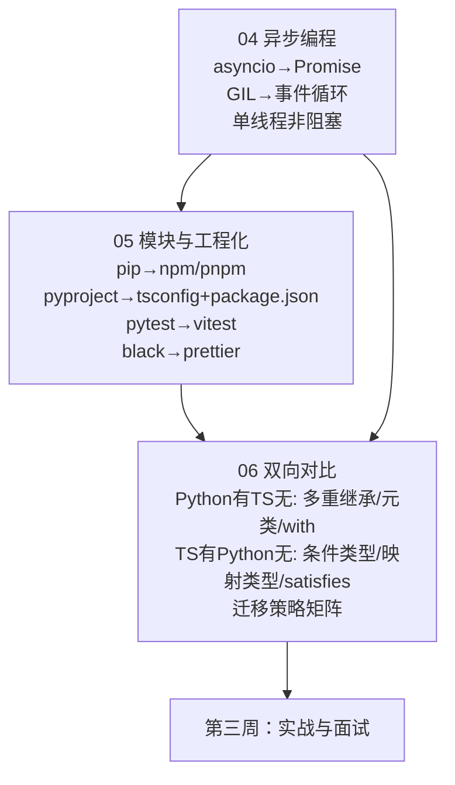

## ⬅️ 前置知识
- 需要：[[04-异步编程与并发模型对比]] — async/await、Promise、事件循环
- 需要：[[05-模块系统与工程化]] — 模块系统、npm、tsconfig、测试
- 需要：[[06-Python有TS无与TS有Python无]] — 双向特性对比

## ➡️ 后续笔记
- [[01-学习/TypeScriptLearningByPython/07-业务场景实战合集|07-业务场景实战合集]] — 进入第三周

## 🔗 关联笔记
- [[00-TypeScript 总览索引（Python 迁移版）]] — 返回总索引
- [[01-学习/TypeScriptLearningByPython/99-第一周复习检查点|99-第一周复习检查点]] — 第一周复习

---

## 📋 第二周知识图谱



---

## ✅ 综合练习

### 练习 1：将 Python asyncio 代码迁移为 TS async/await

以下 Python 代码使用 `asyncio` 并发请求多个 URL，请将其迁移为 TypeScript：

```python
import asyncio
import aiohttp
from typing import Any

async def fetch_url(url: str) -> dict[str, Any]:
    async with aiohttp.ClientSession() as session:
        async with session.get(url) as response:
            return {"url": url, "status": response.status, "ok": response.ok}

async def fetch_all(urls: list[str]) -> list[dict[str, Any]]:
    tasks = [fetch_url(url) for url in urls]
    return await asyncio.gather(*tasks)

async def fetch_with_timeout(url: str, timeout: float = 5.0) -> dict[str, Any]:
    try:
        return await asyncio.wait_for(fetch_url(url), timeout=timeout)
    except asyncio.TimeoutError:
        return {"url": url, "status": 0, "ok": False, "error": "timeout"}
```

**验收标准**：
- 用 `Promise.all` 替代 `asyncio.gather`
- 用 `AbortController` + `setTimeout` 实现超时控制
- 所有返回类型标注完整
- 通过 `tsc --strict` 编译零错误

<details><summary>📖 参考答案</summary>

```typescript
interface FetchResult {
  url: string;
  status: number;
  ok: boolean;
  error?: string;
}

async function fetchUrl(url: string): Promise<FetchResult> {
  const response = await fetch(url);
  return { url, status: response.status, ok: response.ok };
}

async function fetchAll(urls: string[]): Promise<FetchResult[]> {
  // asyncio.gather → Promise.all
  return Promise.all(urls.map(fetchUrl));
}

async function fetchWithTimeout(url: string, timeoutMs = 5000): Promise<FetchResult> {
  const controller = new AbortController();
  const timeoutId = setTimeout(() => controller.abort(), timeoutMs);

  try {
    const response = await fetch(url, { signal: controller.signal });
    return { url, status: response.status, ok: response.ok };
  } catch (error) {
    if (error instanceof DOMException && error.name === "AbortError") {
      return { url, status: 0, ok: false, error: "timeout" };
    }
    throw error;
  } finally {
    clearTimeout(timeoutId);
  }
}
```

</details>

### 练习 2：编写模块化的错误处理系统

使用 TypeScript 独有特性（自定义错误类型 + 类型守卫 + 可辨识联合），实现一个类型安全的错误处理系统：

```typescript
// 要求：
// 1. 定义 3 种自定义错误类型：NotFoundError、ValidationError、NetworkError
// 2. 编写类型守卫函数 isNotFoundError(error: unknown): error is NotFoundError
// 3. 编写函数 handleError(error: unknown): string，使用 instanceof 区分错误类型
// 4. 使用可辨识联合（discriminated union）替代 try/catch
```

<details><summary>📖 参考答案</summary>

```typescript
// 1. 自定义错误类型
class NotFoundError extends Error {
  constructor(public resourceId: string) {
    super(`Resource not found: ${resourceId}`);
    this.name = "NotFoundError";
  }
}

class ValidationError extends Error {
  constructor(public field: string, public constraint: string) {
    super(`Validation failed for ${field}: ${constraint}`);
    this.name = "ValidationError";
  }
}

class NetworkError extends Error {
  constructor(public statusCode: number) {
    super(`Network error: ${statusCode}`);
    this.name = "NetworkError";
  }
}

// 2. 类型守卫函数
function isNotFoundError(error: unknown): error is NotFoundError {
  return error instanceof NotFoundError;
}

// 3. 使用 instanceof 区分错误类型
function handleError(error: unknown): string {
  if (isNotFoundError(error)) {
    return `❌ Not found: ${error.resourceId}`;
  }
  if (error instanceof ValidationError) {
    return `⚠️ Validation: ${error.field} - ${error.constraint}`;
  }
  if (error instanceof NetworkError) {
    return `🌐 Network: ${error.statusCode}`;
  }
  if (error instanceof Error) {
    return `❓ Unknown: ${error.message}`;
  }
  return `❓ Unknown error`;
}

// 4. 可辨识联合替代 try/catch（Python 完全没有的 TS 独有模式）
type Result<T> =
  | { ok: true; value: T }
  | { ok: false; error: NotFoundError | ValidationError | NetworkError };

function handleResult<T>(result: Result<T>): string {
  if (result.ok) {
    return `✅ Success: ${JSON.stringify(result.value)}`;
  }
  return handleError(result.error);  // error 被自动收窄
}
```

> **Python 对比**：Python 用 `try/except` 处理错误，无法在编译时保证所有分支都被处理。TS 的可辨识联合 + 穷尽性检查可以在编译时确保所有错误类型都被覆盖。

</details>

### 练习 3：自测选择题

**1. 以下哪些是 Python 有但 TypeScript 没有的？**（多选）
- A) 多重继承
- B) 元类（metaclass）
- C) 泛型
- D) `with` 上下文管理器
- E) 列表推导式 `[x for x in range(10)]`

<details><summary>📖 答案</summary> **A、B、D、E**。泛型（C）两者都有，但 TS 的泛型更强大（支持条件类型、映射类型）。</details>

**2. Python 的 `or` 和 TypeScript 的 `||` 在以下代码中的行为是否相同？**

```python
# Python
result = 0 or "default"  # ?
```
```typescript
// TypeScript
const result = 0 || "default";  // ?
```

- A) 相同，都返回 `"default"`
- B) 不同，Python 返回 `"default"`，TS 返回 `0`
- C) 不同，Python 返回 `0`，TS 返回 `"default"`
- D) 相同，都返回 `0`

<details><summary>📖 答案</summary> **A**。Python 和 TS 的 `||` 行为相同，都对 falsy 值（0、""、false、null、undefined）返回右侧值。TS 推荐用 `??`（nullish coalescing），只对 `null`/`undefined` 生效：`0 ?? "default"` 返回 `0`。</details>

**3. 以下哪些是 TypeScript 独有而 Python 没有的？**（多选）
- A) `interface` 声明合并
- B) 条件类型 `T extends U ? X : Y`
- C) `satisfies` 操作符
- D) 装饰器
- E) 模板字面量类型 `` `on${Capitalize<string>}` ``

<details><summary>📖 答案</summary> **A、B、C、E**。装饰器（D）两者都有，但 Python 的装饰器更灵活（可以装饰函数），TS 装饰器只能用于类的成员/类本身。</details>

---

## 🎯 第二周毕业自检

| 层次 | 检查项 |
|------|--------|
| 🟢 基础 | 能将 Python `asyncio` 代码准确迁移为 TS `Promise` + `async/await` |
| 🟢 基础 | 能搭建 TS 项目的完整工程化体系（tsconfig + eslint + prettier + vitest） |
| 🟢 基础 | 能列出 5 个 Python 有但 TS 没有的特性，给出 TS 替代方案 |
| 🟡 进阶 | 能解释 Python `or` vs TS `||` vs TS `??` 的行为差异 |
| 🟡 进阶 | 能编写自定义错误类型 + 类型守卫，实现类型安全的错误处理 |
| 🟡 进阶 | 能列出 5 个 TS 有但 Python 没有的特性，说明其价值 |
| 🔴 挑战 | 能独立完成练习 1（asyncio 迁移），通过 `tsc --strict` 零错误 |
| 🔴 挑战 | 能完整画出 Python→TS 的迁移心智模型对比图，覆盖类型系统、并发、工程化三个维度 |

---

## 📊 通过标准

- 🟢 全部通过 → 可进入第三周
- 🟡 有未通过项 → 回顾对应笔记后重试
- 🔴 未通过 → 回到 [[04-异步编程与并发模型对比]] 巩固基础

### 🧭 下一步行动

| 自检结果 | 行动 |
|---------|------|
| 🟢 全部通过 | 进入 [[01-学习/TypeScriptLearningByPython/07-业务场景实战合集|07-业务场景实战合集]] |
| 🟡 练习 1 未通过 | 回顾 [[04-异步编程与并发模型对比]] 的 Promise/async 部分 |
| 🟡 练习 2 未通过 | 回顾 [[04-异步编程与并发模型对比]] 的错误处理和类型守卫部分 |
| 🟡 练习 3 有错 | 回顾 [[06-Python有TS无与TS有Python无]] 的易错点部分 |
| 🔴 多项未通过 | 回到 [[04-异步编程与并发模型对比]] 从头巩固 |

---

*最后更新：2026-07-22*
