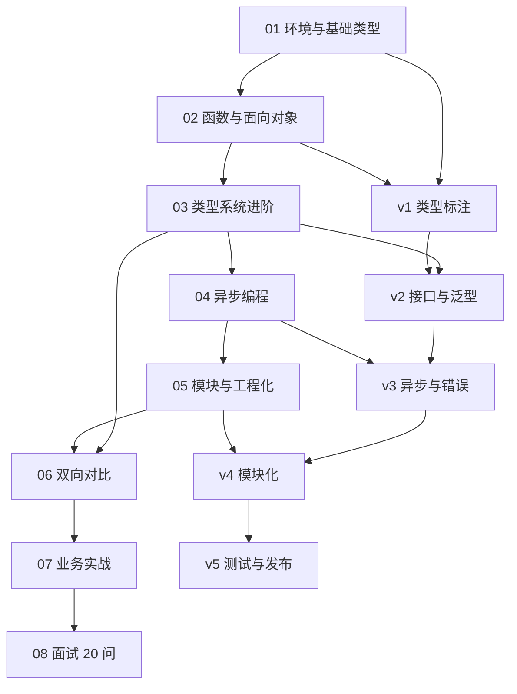

> 📌 **本报告基于 [[../../../03-AI工具/AI协作方法论/技术学习路径审查与优化方法论]] 的审查员维度构建**，审查对象为 `TypeScriptLearningByPython/` 目录下的全部文件。

---

## 一、审查范围

| 类别 | 文件数 | 总大小 |
|------|--------|--------|
| 核心笔记（01-08） | 8 篇 | ~171 KB |
| 总览索引（00） | 1 篇 | ~8.5 KB |
| 复习检查点（99×3） | 3 篇 | ~21 KB |
| 毕业项目（v1-v5） | 5 篇 | ~42 KB |
| **合计** | **17 篇** | **~242 KB** |

---

## 二、结构完整性审查

### 2.1 学习闭环覆盖度

| 闭环环节 | 对应笔记 | 状态 |
|----------|----------|------|
| 环境搭建 | 01 | ✅ 覆盖 |
| 基础语法 | 01-02 | ✅ 覆盖 |
| 类型系统 | 01-03 | ✅ 覆盖 |
| 异步编程 | 04 | ✅ 覆盖 |
| 工程化 | 05 | ✅ 覆盖 |
| 双向对比 | 06 | ✅ 覆盖（特色篇） |
| 实战场景 | 07 | ✅ 覆盖 |
| 面试巩固 | 08 | ✅ 覆盖 |
| 毕业项目 | v1-v5 | ✅ 覆盖 |
| 复习检查 | 99×3 | ✅ 覆盖 |

**结论**：学习闭环完整，无知识盲区。

### 2.2 知识盲区排查

| 潜在盲区 | 是否覆盖 | 说明 |
|----------|----------|------|
| 装饰器（TC39 Stage 3） | ⚠️ 06 提及但未深入 | 建议后续补充专题 |
| 迭代器/生成器 | ⚠️ 02 简述 | Python 对比充分但 TS 侧偏浅 |
| Symbol 类型 | ⚠️ 01 提及 | 未深入 `Symbol.iterator` |
| enum vs 联合类型 | ✅ 03 覆盖 | — |
| this 绑定 | ⚠️ 02 提及 | Python 无 this 概念，建议加强 |
| 装饰器与注解 | ⚠️ 06 对比 | 深度不足 |

---

## 三、学习顺序合理性审查

### 3.1 依赖关系图

### 3.2 顺序问题

| 检查点 | 状态 | 说明 |
|--------|------|------|
| 是否存在"先用后讲" | ✅ 无 | 所有概念先讲后用 |
| 毕业项目是否在核心笔记之后 | ✅ 是 | v1 前置于 01-03 |
| 复习检查点位置 | ✅ 合理 | 每周末尾 |
| 面试篇在最后 | ✅ 是 | 08 为收尾 |

**结论**：学习顺序合理，无逆序依赖。

---

## 四、难度递进审查

| 笔记 | 声明难度 | 实际难度 | 一致性 |
|------|----------|----------|--------|
| 01 | ⭐ | ⭐ | ✅ |
| 02 | ⭐⭐ | ⭐⭐ | ✅ |
| 03 | ⭐⭐⭐⭐ | ⭐⭐⭐⭐ | ✅ |
| 04 | ⭐⭐⭐ | ⭐⭐⭐ | ✅ |
| 05 | ⭐⭐⭐ | ⭐⭐⭐ | ✅ |
| 06 | ⭐⭐⭐ | ⭐⭐⭐ | ✅ |
| 07 | ⭐⭐⭐⭐ | ⭐⭐⭐⭐ | ✅ |
| 08 | ⭐⭐⭐⭐ | ⭐⭐⭐⭐ | ✅ |

**难度曲线**：⭐ → ⭐⭐ → ⭐⭐⭐⭐（跃升）→ ⭐⭐⭐ → ⭐⭐⭐ → ⭐⭐⭐ → ⭐⭐⭐⭐ → ⭐⭐⭐⭐

> ⚠️ **P2 问题**：03 的难度从 ⭐⭐ 跃升到 ⭐⭐⭐⭐，中间缺少 ⭐⭐⭐ 过渡。建议在 03 开头增加"过渡引导"段落。

---

## 五、交叉引用审查

### 5.1 引用统计

| 笔记 | 前置引用 | 后续引用 | 关联引用 | 总计 |
|------|----------|----------|----------|------|
| 00 | 0 | 0 | 4 | 4 |
| 01 | 0 | 2 | 1 | 3 |
| 02 | 1 | 2 | 1 | 4 |
| 03 | 1 | 2 | 1 | 4 |
| 04 | 1 | 2 | 1 | 4 |
| 05 | 1 | 2 | 1 | 4 |
| 06 | 6 | 2 | 0 | 8 |
| 07 | 1 | 1 | 1 | 3 |
| 08 | 1 | 0 | 1 | 2 |

### 5.2 引用对齐验证

| 检查项 | 状态 |
|--------|------|
| 所有 `[[wiki link]]` 指向存在的文件 | ✅ |
| 前置/后续双向对齐 | ✅ |
| 总索引与子文件名匹配 | ✅ |
| 毕业项目 v1-v5 链式引用完整 | ✅ |

---

## 六、冗余审查

| 检查项 | 状态 | 说明 |
|--------|------|------|
| 重复内容 | ✅ 无 | 06 的对比内容与 01-05 有回指但不重复 |
| 递进式重复 | ✅ 有 | 06 回顾 01-05 内容是设计意图 |
| 毕业项目重复 | ✅ 无 | 每版只改一个维度 |

---

## 七、审查结论

| 维度 | 评级 | 说明 |
|------|------|------|
| 结构完整性 | ⭐⭐⭐⭐⭐ | 闭环完整 |
| 学习顺序 | ⭐⭐⭐⭐⭐ | 无逆序 |
| 难度递进 | ⭐⭐⭐⭐ | 03 跃升需过渡 |
| 交叉引用 | ⭐⭐⭐⭐⭐ | 全部对齐 |
| 冗余控制 | ⭐⭐⭐⭐⭐ | 无冗余 |

**总评**：结构健康度 ⭐⭐⭐⭐½（4.5/5），达到方法论质量标准。

---

*审查日期：2026-07-22*