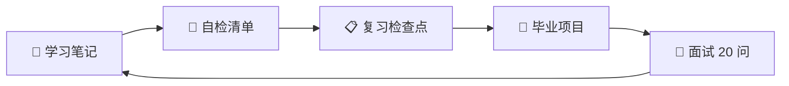

> 📌 **本报告基于 [[../../../03-AI工具/AI协作方法论/技术学习路径审查与优化方法论]] 的优化师维度构建**。

---

## 一、练习设计审查

### 1.1 练习分布

| 笔记 | 练习数量 | 类型 | 难度 |
|------|----------|------|------|
| 01 | 3 | 类型标注迁移、tsconfig 配置、自测选择题 | ⭐ |
| 02 | 2 | dataclass→interface 迁移、函数重载设计 | ⭐⭐ |
| 03 | 3 | 条件类型实战、映射类型转换、穷尽性检查 | ⭐⭐⭐⭐ |
| 04 | 2 | asyncio→Promise 重写、Promise.all 并行 | ⭐⭐⭐ |
| 05 | 1 | pyproject.toml→tsconfig 迁移 | ⭐⭐⭐ |
| 06 | 0 | 无独立练习（对比篇） | — |
| 07 | 10 | 10 大业务场景实战 | ⭐⭐⭐⭐ |
| 08 | 20 | 面试 20 问 | ⭐⭐⭐⭐ |
| 复习 ×3 | 9 | 综合 + 选择 + 场景 | ⭐⭐-⭐⭐⭐⭐ |

**总练习数**：50+，密度合理。

### 1.2 练习质量

| 维度 | 评估 | 说明 |
|------|------|------|
| 难度梯度 | ✅ | 由简到难递进 |
| Python 锚点 | ✅ | 每个练习都有 Python 对照 |
| 验收标准 | ✅ | 有明确通过条件 |
| 参考答案 | ⚠️ | 部分练习缺少完整答案 |

> **P2 建议**：06 作为双向对比核心篇，可补充 2-3 个"迁移选择题"增强互动性。

---

## 二、巩固机制审查

### 2.1 自检清单覆盖

| 笔记 | 🟢 基础 | 🟡 进阶 | 🔴 挑战 | 覆盖度 |
|------|---------|---------|---------|--------|
| 01 | 3 | 2 | 1 | ✅ |
| 02 | 3 | 2 | 1 | ✅ |
| 03 | 3 | 3 | 2 | ✅ |
| 04 | 2 | 2 | 1 | ✅ |
| 05 | 2 | 2 | 1 | ✅ |
| 06 | 2 | 2 | 1 | ✅ |
| 07 | 2 | 2 | 1 | ✅ |
| 08 | 2 | 2 | 1 | ✅ |

### 2.2 三级自检一致性

| 检查项 | 状态 |
|--------|------|
| 每篇笔记末尾有 🎯 自检清单 | ✅ |
| 三级标注（🟢/🟡/🔴）一致 | ✅ |
| 自检项与笔记内容对齐 | ✅ |
| 复习检查点回扣自检项 | ✅ |

---

## 三、差异化路径审查

### 3.1 角色导航

| 角色 | 背景 | 路线 | 学时 | 合理性 |
|------|------|------|------|--------|
| 🐍 Python 后端 | Flask/FastAPI | 全部 | 27h | ✅ |
| 🔄 Python 全栈 | Django/Flask | 速览+重点 | 20-24h | ✅ |
| 🚀 Python 数据科学 | NumPy/Pandas | 全部重点 03/05 | 27h | ✅ |

### 3.2 跳过指引

| 检查项 | 状态 |
|--------|------|
| 可跳过内容表清晰 | ✅ |
| "何时回来"提示 | ✅ |
| 难度自适应 | ✅ |

> **P2 建议**：可增加"Python 前端开发者"角色（已有 JS 基础 + Python），路线为 01 速览→03 重点→04→06→08，约 15h。

---

## 四、评估闭环审查

| 环节 | 对应文件 | 状态 |
|------|----------|------|
| 学完自检 | 每篇末尾 🎯 | ✅ |
| 阶段复习 | 99×3 复习检查点 | ✅ |
| 综合实战 | v1-v5 毕业项目 | ✅ |
| 面试验证 | 08 面试 20 问 | ✅ |
| 回扣闭环 | 面试题引用前置笔记 | ✅ |

**结论**：评估闭环完整。

---

## 五、优化建议优先级

| 优先级 | 建议 | 位置 | 工作量 |
|--------|------|------|--------|
| P1 | 06 补充 2-3 个迁移选择题 | 06 末尾 | 30min |
| P2 | 03 开头增加难度过渡引导段落 | 03 开头 | 15min |
| P2 | 增加第 4 种角色"Python 前端开发者" | 00 角色导航 | 10min |
| P2 | 部分练习补充完整参考答案 | 01-05 | 1h |
| P3 | 后续可增加"装饰器专题"补充篇 | 新文件 | 2h |
| P3 | 后续可增加"迭代器/生成器"补充篇 | 新文件 | 1h |

---

## 六、审查结论

| 维度 | 评级 | 说明 |
|------|------|------|
| 练习设计 | ⭐⭐⭐⭐⭐ | 50+ 练习，梯度合理 |
| 巩固机制 | ⭐⭐⭐⭐⭐ | 三级自检全覆盖 |
| 差异化路径 | ⭐⭐⭐⭐ | 可增第 4 角色 |
| 评估闭环 | ⭐⭐⭐⭐⭐ | 完整闭环 |

**总评**：学习体验 ⭐⭐⭐⭐½（4.5/5），达到方法论质量标准。

---

*审查日期：2026-07-22*