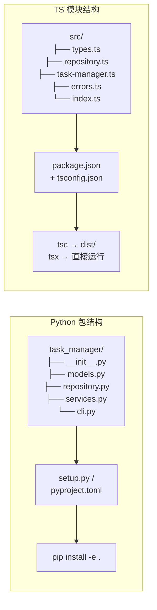

## ⬅️ 前置知识
- 需要：[[v3-异步与错误处理版]] — 异步 Repository + 错误类型
- 需要：[[../05-模块系统与工程化]] — ESM/CJS、tsconfig、npm

## ➡️ 后续版本
- [[v5-测试与发布版]] — 测试、CI、npm 发布

## 🔗 关联笔记
- [[../00-TypeScript 总览索引（Python 迁移版）]] — 返回总索引
- [[../99-第二周复习检查点]] — 第二周复习

---

## 🎯 v4 目标

把 v3 的单文件拆分为多模块项目，配置生产级 `tsconfig.json`，建立 **开发用 tsx + 构建用 tsc** 的双流程。这是从"能跑"到"工程化"的跨越——对应 Python 的 `setup.py` + `pyproject.toml` + 包目录结构。

---

## 📁 Python 包结构 vs TS 模块结构



| 维度 | Python | TypeScript |
|------|--------|-----------|
| 包入口标记 | `__init__.py` | `package.json` 的 `main` / `exports` |
| 模块发现 | 基于 `sys.path` + `__init__.py` | 基于 `node_modules` + `exports` 字段 |
| 包配置 | `pyproject.toml` | `package.json` |
| 类型检查配置 | `[tool.mypy]` | `tsconfig.json` |
| 开发安装 | `pip install -e .` | `npm link` / 本地直接引用 |
| 构建产物 | `.pyc`（自动） | `dist/*.js`（需手动 `tsc`） |

---

## ✏️ 第一步：目录结构

```
task-manager/
├── package.json
├── tsconfig.json
├── src/
│   ├── types.ts          # 类型定义（对应 Python models.py）
│   ├── errors.ts         # 错误类型
│   ├── repository.ts     # 数据访问层
│   ├── task-manager.ts   # 业务逻辑
│   └── index.ts          # 统一导出（对应 Python __init__.py）
├── dist/                 # 构建产物（tsc 输出）
└── tests/                # v5 补充
```

> [!tip] Python 对比
> Python 的 `__init__.py` 控制 `from package import *` 的行为。TS 的 `index.ts` 做同样的事——它是模块的公共入口。

---

## ✏️ 第二步：拆分模块

### src/types.ts（对应 Python models.py）

```typescript
// src/types.ts —— 纯类型定义，零运行时代码

export type Priority = "low" | "normal" | "high";

export interface Task {
  id: number;
  title: string;
  completed: boolean;
  priority: Priority;
  createdAt: Date;
}

export type Filter = "all" | "completed" | "pending";

export interface Stats {
  total: number;
  completed: number;
  pending: number;
}
```

> [!important] Python 类型注解 vs TS 类型定义
> Python 的 `models.py` 通常包含 `@dataclass` **运行时类**。TS 的 `types.ts` 可以只放类型定义，编译后完全擦除，不占用产物体积。

### src/errors.ts（从 v3 迁移）

```typescript
// src/errors.ts —— 从 v3 直接迁移，只改导入导出
export class TaskError extends Error {
  constructor(
    public code: "NOT_FOUND" | "VALIDATION" | "DUPLICATE",
    message: string
  ) {
    super(message);
    this.name = "TaskError";
  }
}

export const isTaskError = (e: unknown): e is TaskError =>
  e instanceof TaskError;
```

### src/repository.ts（从 v3 迁移）

```typescript
// src/repository.ts —— 从 v3 迁移，改为 ESM import
import type { Task, Priority } from "./types.js";
import { TaskError } from "./errors.js";

export interface TaskRepository {
  findAll(filter?: "all" | "completed" | "pending"): Promise<Task[]>;
  findById(id: number): Promise<Task | undefined>;
  create(title: string, priority: Priority): Promise<Task>;
  update(id: number, patch: Partial<Pick<Task, "completed" | "title">>): Promise<Task>;
  delete(id: number): Promise<boolean>;
}

export class InMemoryRepository implements TaskRepository {
  private tasks: Task[] = [];
  private nextId = 1;

  async findAll(filter: "all" | "completed" | "pending" = "all"): Promise<Task[]> {
    switch (filter) {
      case "completed": return this.tasks.filter(t => t.completed);
      case "pending":   return this.tasks.filter(t => !t.completed);
      default:          return [...this.tasks];
    }
  }

  async findById(id: number): Promise<Task | undefined> {
    return this.tasks.find(t => t.id === id);
  }

  async create(title: string, priority: Priority): Promise<Task> {
    if (!title.trim()) throw new TaskError("VALIDATION", "Title is required");
    const task: Task = {
      id: this.nextId++,
      title: title.trim(),
      completed: false,
      priority,
      createdAt: new Date(),
    };
    this.tasks.push(task);
    return task;
  }

  async update(id: number, patch: Partial<Pick<Task, "completed" | "title">>): Promise<Task> {
    const task = this.tasks.find(t => t.id === id);
    if (!task) throw new TaskError("NOT_FOUND", `Task #${id} not found`);
    Object.assign(task, patch);
    return task;
  }

  async delete(id: number): Promise<boolean> {
    const idx = this.tasks.findIndex(t => t.id === id);
    if (idx === -1) return false;
    this.tasks.splice(idx, 1);
    return true;
  }
}
```

> [!warning] 注意 `.js` 扩展名
> ESM 模式下导入路径**必须写 `.js`**（即使源文件是 `.ts`）。这和 Python 的 `from .models import Task` 不同——Python 不需要写扩展名。这是 TS 的一个历史包袱。

### src/task-manager.ts（业务逻辑层）

```typescript
// src/task-manager.ts —— 业务逻辑，依赖 Repository 接口
import type { Task, Filter, Stats, Priority } from "./types.js";
import type { TaskRepository } from "./repository.js";

export class TaskManager {
  constructor(private repo: TaskRepository) {}

  async add(title: string, priority: Priority = "normal"): Promise<Task> {
    return this.repo.create(title, priority);
  }

  async complete(id: number): Promise<Task> {
    return this.repo.update(id, { completed: true });
  }

  async remove(id: number): Promise<boolean> {
    return this.repo.delete(id);
  }

  async list(filter: Filter = "all"): Promise<Task[]> {
    return this.repo.findAll(filter);
  }

  async getStats(): Promise<Stats> {
    const [all, completed] = await Promise.all([
      this.repo.findAll("all"),
      this.repo.findAll("completed"),
    ]);
    return {
      total: all.length,
      completed: completed.length,
      pending: all.length - completed.length,
    };
  }
}
```

### src/index.ts（统一导出，对应 `__init__.py`）

```typescript
// src/index.ts —— 公共入口，只导出需要暴露的 API
export type { Task, Priority, Filter, Stats } from "./types.js";
export { TaskError, isTaskError } from "./errors.js";
export { TaskRepository, InMemoryRepository } from "./repository.js";
export { TaskManager } from "./task-manager.js";
```

> [!tip] 对应 Python `__init__.py` 的 `__all__`
> ```python
> # Python __init__.py
> from .models import Task, Priority
> from .repository import TaskRepository
> from .services import TaskManager
> __all__ = ["Task", "Priority", "TaskRepository", "TaskManager"]
> ```
> TS 的 `index.ts` 作用完全一致——控制对外暴露的 API。

---

## ✏️ 第三步：配置 tsconfig.json

```jsonc
// tsconfig.json —— 生产级配置
{
  "compilerOptions": {
    // ===== 语言/目标 =====
    "target": "ES2022",           // 编译目标 JS 版本
    "module": "NodeNext",         // Node 原生 ESM
    "moduleResolution": "NodeNext", // 配合 NodeNext 模块解析

    // ===== 严格性 =====
    "strict": true,               // 总开关
    "noUnusedLocals": true,       // 未使用的局部变量报错
    "noUnusedParameters": true,   // 未使用的函数参数报错
    "noImplicitReturns": true,    // 函数路径必须都返回
    "exactOptionalPropertyTypes": true, // 可选属性精确化

    // ===== 模块解析 =====
    "esModuleInterop": true,
    "resolveJsonModule": true,    // 允许 import json
    "isolatedModules": true,     // 每个文件独立编译（配合 tsx）

    // ===== 产物 =====
    "outDir": "./dist",           // 编译输出目录
    "rootDir": "./src",           // 源码根目录
    "declaration": true,          // 生成 .d.ts 声明文件
    "declarationMap": true,       // 生成 .d.ts.map
    "sourceMap": true,            // 生成 .js.map

    // ===== 其他 =====
    "skipLibCheck": true,         // 跳过 @types 检查加速
    "forceConsistentCasingInFileNames": true
  },
  "include": ["src/**/*"],
  "exclude": ["node_modules", "dist", "tests"]
}
```

> [!important] 为什么 `declaration: true`
> 如果你要发布 npm 包，`.d.ts` 声明文件让使用者能获得类型提示。Python 的类型 stub 文件 `.pyi` 是可选的，但 TS 的 `.d.ts` 对 npm 包几乎是必需的。

---

## ✏️ 第四步：package.json

```jsonc
// package.json
{
  "name": "@your-scope/task-manager",
  "version": "0.4.0",
  "description": "A type-safe task manager built with TypeScript",
  "type": "module",               // ESM 模式（对应 Python 3 的绝对导入）
  "main": "./dist/index.js",      // CJS fallback
  "exports": {
    ".": {
      "import": "./dist/index.js",     // ESM 入口
      "types": "./dist/index.d.ts"     // 类型声明入口
    }
  },
  "scripts": {
    "dev": "tsx src/index.ts",           // 开发：直接运行 TS
    "build": "tsc",                      // 构建：编译为 JS
    "start": "node dist/index.js",       // 生产：运行编译产物
    "typecheck": "tsc --noEmit",         // 只检查不输出
    "clean": "rm -rf dist"
  },
  "devDependencies": {
    "typescript": "^5.5.0",
    "tsx": "^4.0.0"
  }
}
```

| npm script | Python 等价 | 用途 |
|------------|-------------|------|
| `npm run dev` | `python -m task_manager` | 开发时直接运行源码 |
| `npm run build` | 无（Python 不需要编译） | 编译 TS → JS |
| `npm run typecheck` | `mypy src/` | 只做类型检查 |
| `npm start` | 安装后 `task-manager` 命令 | 运行编译产物 |

---

## ✅ 验收标准

| 检查项 | 方式 |
|--------|------|
| 模块拆分为 5 个文件 | `ls src/` |
| ESM 导入用 `.js` 扩展名 | `grep "from \"./" src/*.ts` |
| `tsc --noEmit` 零错误 | `npm run typecheck` |
| `tsc` 生成 `dist/` + `.d.ts` | `npm run build && ls dist/` |
| `tsx` 能直接运行 | `npm run dev` |
| `dist/` 产物可运行 | `node dist/index.js` |

---

## 💡 参考实现：入口演示

<details>
<summary>点击展开完整 index.ts（含演示代码）</summary>

```typescript
// src/index.ts
export type { Task, Priority, Filter, Stats } from "./types.js";
export { TaskError, isTaskError } from "./errors.js";
export { TaskRepository, InMemoryRepository } from "./repository.js";
export { TaskManager } from "./task-manager.js";

// ===== 演示代码（开发时运行） =====
if (import.meta.url === `file://${process.argv[1]}`) {
  const repo = new InMemoryRepository();
  const manager = new TaskManager(repo);

  await manager.add("学习 TypeScript 模块系统", "high");
  await manager.add("写毕业项目 v4", "high");
  await manager.complete(1);
  console.log(await manager.list("all"));
  console.log(await manager.getStats());
}
```

> [!tip] `import.meta.url` 入口检测
> Python 用 `if __name__ == "__main__":` 检测直接运行。ESM 模块的等价方式是 `import.meta.url === \`file://${process.argv[1]}\``。

</details>

---

## 🎯 本版本学完自检

| 层次 | 检查项 |
|------|--------|
| 🟢 基础 | 能解释 Python `__init__.py` 与 TS `index.ts` 的对应关系 |
| 🟢 基础 | 能说明为什么 ESM 导入路径要写 `.js` 扩展名 |
| 🟡 进阶 | 能为 tsconfig 选择正确的 `module` 和 `moduleResolution` 组合 |
| 🟡 进阶 | 能解释 `declaration: true` 对 npm 包发布的意义 |
| 🔴 挑战 | 能对比 Python `pyproject.toml` 和 TS `package.json + tsconfig.json` 的职责分工 |

---

*最后更新：2026-07-22*