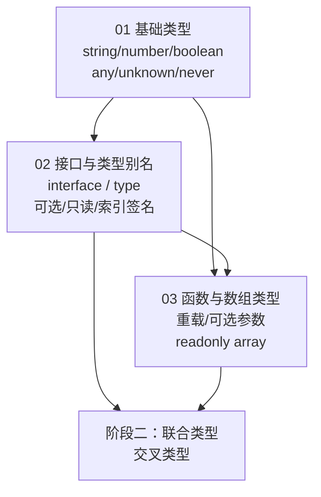

## ⬅️ 前置知识
- 需要：[[01-环境搭建与基本类型]] — 基础类型
- 需要：[[02-接口与类型别名]] — interface / type
- 需要：[[03-函数与数组类型]] — 函数重载、数组类型

## ➡️ 后续笔记
- [[../阶段二-进阶类型与类型体操/01-联合类型与交叉类型]] — 进入阶段二

## 🔗 关联笔记
- [[../00-TypeScript学习路径总索引]] — 返回总索引

---

## 📋 阶段一知识图谱



---

## ✅ 综合练习

### 练习 1：类型化一个购物车模块

为以下 JS 代码添加完整类型，要求通过 `tsc --strict` 编译：

```typescript
// 待类型化的代码
function createCart() {
  return { items: [], total: 0 };
}

function addToCart(cart, product, quantity) {
  cart.items.push({ ...product, quantity });
  cart.total += product.price * quantity;
}

function removeFromCart(cart, productId) {
  const idx = cart.items.findIndex(i => i.id === productId);
  if (idx !== -1) {
    const [removed] = cart.items.splice(idx, 1);
    cart.total -= removed.price * removed.quantity;
  }
}

function checkout(cart, discount = 0) {
  const final = cart.total * (1 - discount);
  return { items: cart.items, total: final };
}
```

**验收标准**：
- 定义 `Product`、`CartItem`、`Cart`、`CheckoutResult` 四个类型
- 函数参数和返回值全部标注
- 修改 `let total = 0` 时不会有隐式 any 警告

### 练习 2：编写一个带重载的格式化函数

```typescript
// 要求：
// format(n: number) → "数字: 42.00"
// format(d: Date)   → "日期: 2026-07-17"
// format(s: string) → "文本: xxx"
// 提示：需要 3 个重载签名 + 1 个实现签名
```

### 练习 3：自测选择题

1. 以下哪个说法正确？
   - A) `interface` 可以表示联合类型
   - B) `type` 支持声明合并
   - C) `interface` 支持声明合并
   - D) `type` 和 `interface` 完全等价

2. `unknown` 和 `any` 的关键区别是什么？
   - A) 没有区别
   - B) `unknown` 不能直接调用方法，需要先收窄
   - C) `any` 是类型安全的
   - D) `unknown` 会关闭所有类型检查

3. 函数重载的实现签名（implementation signature）是否对外暴露？
   - A) 是
   - B) 否

   <details><summary>📖 答案</summary>

   1. **C** — `interface` 支持声明合并（同名 interface 自动合并），`type` 不支持。
   2. **B** — `unknown` 必须先收窄（typeof、instanceof 等）才能使用，`any` 会关闭所有类型检查。
   3. **B** — 实现签名对外不可见，外部只能匹配重载签名列表中的签名。

   </details>

---

## 🎯 阶段一毕业自检

| 层次 | 检查项 |
|------|--------|
| 🟢 基础 | 能独立搭建 TS 开发环境并编译运行 |
| 🟢 基础 | 能为任意 JS 代码添加基础类型标注 |
| 🟡 进阶 | 能在 interface 和 type 之间做出合理选择并解释理由 |
| 🟡 进阶 | 能正确编写函数重载，不泄漏实现签名 |
| 🔴 挑战 | 能独立完成练习 1（购物车模块），通过 `tsc --strict` 零错误 |

---

## 📊 通过标准

- 🟢 全部通过 → 可进入阶段二
- 🟡 有未通过项 → 回顾对应笔记后重试
- 🔴 未通过 → 回到 [[01-环境搭建与基本类型]] 巩固基础

### 🧭 下一步行动

| 自检结果 | 行动 |
|---------|------|
| 🟢 全部通过 | 进入 [[../阶段二-进阶类型与类型体操/01-联合类型与交叉类型]] |
| 🟡 练习 1 未通过 | 回顾 [[02-接口与类型别名]] 的 interface/type 定义 |
| 🟡 练习 2 未通过 | 回顾 [[03-函数与数组类型]] 的函数重载部分 |
| 🟡 练习 3 有错 | 回顾 [[01-环境搭建与基本类型]] 的 any/unknown/void 对比 |
| 🔴 多项未通过 | 回到 [[01-环境搭建与基本类型]] 从头巩固 |

---

*最后更新：2026-07-19*