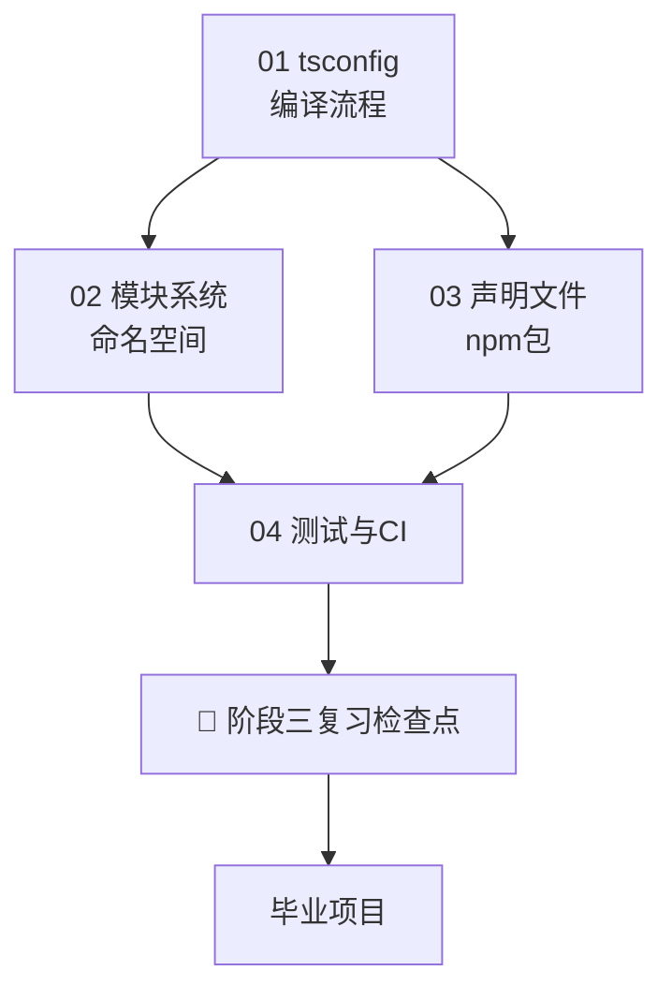

## ⬅️ 前置知识
- 需要：[[01-tsconfig与编译流程]] — tsconfig 配置
- 需要：[[02-模块系统与命名空间]] — ESM/CJS/Namespace
- 需要：[[03-类型声明文件与npm包]] — .d.ts 声明文件
- 需要：[[04-测试与CI]] — 测试与 CI/CD

## ➡️ 后续笔记
- [[../毕业项目-TS任务管理器/v1-纯类型标注版]] — 开始毕业项目

## 🔗 关联笔记
- [[../00-TypeScript学习路径总索引]] — 返回总索引
- [[../阶段二-进阶类型与类型体操/99-阶段二复习检查点]] — 回顾类型体操

---

## 📋 阶段三知识图谱

---

## ✅ 综合练习

### 练习 1：搭建完整工程化项目（P0 必须完成）

从零搭建一个 TypeScript 工具库项目，要求：

1. **tsconfig**：继承 `tsconfig.base.json`，开启 declaration、sourceMap
2. **模块**：ESM 优先，同时兼容 CJS（双模块发布）
3. **声明文件**：自动生成 `.d.ts`，配置 `types` 字段
4. **测试**：Vitest + 覆盖率 ≥ 80%
5. **Lint**：ESLint + Prettier + husky
6. **CI**：GitHub Actions，多 Node 版本矩阵

**验收标准**：`npm run build` → `npm test` → `npm run lint` 全部通过

### 练习 2：模块化重构（P1）

将一个单文件 TS 项目拆分为：
- `types.ts` — 公共类型
- `utils/` — 工具函数模块
- `index.ts` — 入口导出

要求使用 `import type` 和路径别名。

### 练习 3：发布实践（P2）

1. 用 `tsup` 构建一个 TS 包，输出 CJS + ESM + .d.ts
2. 配置 `package.json` 的 `exports` 字段
3. 用 `npm pack` 验证包内容
4. 用 `npm link` 在另一个项目中测试

---

## 📊 阶段三自测选择题

1. 以下哪个 `moduleResolution` 适合 Vite 项目？
- A) `node`
- B) `bundler`
- C) `classic`
- D) `nodenext`

2. `verbatimModuleSyntax: true` 开启后，以下哪种写法会报错？
- A) `import type { User } from "./types"`
- B) `import { type User, createUser } from "./user"`
- C) `import { User, createUser } from "./user"`（User 是纯类型）
- D) `export type { User }`

3. npm 包的类型声明查找优先级是？
- A) @types → 包自带 → 手动声明
- B) 包自带 → @types → 手动声明
- C) 手动声明 → @types → 包自带
- D) 没有优先级，随机选择

4. CI 中类型检查应该用什么命令？
- A) `tsc`
- B) `tsc --noEmit`
- C) `tsc --watch`
- D) `npm run build`

---

## 🎯 阶段三毕业自检

| 层次 | 检查项 |
|------|--------|
| 🟢 基础 | 能配置完整的 tsconfig.json，理解 strict 模式的 7 项检查 |
| 🟢 基础 | 能用 `tsc --noEmit` 做纯类型检查，区分类型检查和编译输出 |
| 🟡 进阶 | 能设计多 tsconfig 继承体系（base → build/dev/test） |
| 🟡 进阶 | 能编写 GitHub Actions CI 工作流，包含 typecheck、lint、test 三步 |
| 🔴 挑战 | 能搭建完整的 TS 工具库项目（tsconfig + 双模块 + .d.ts + 测试 + CI） |

---

## 📊 通过标准

- 🟢 全部通过 → 可进入毕业项目
- 🟡 有未通过项 → 回顾对应笔记后重试
- 🔴 未通过 → 回到 [[01-tsconfig与编译流程]] 巩固工程化基础

### 🧭 下一步行动

| 自检结果 | 行动 |
|---------|------|
| 🟢 全部通过 | 进入 [[../毕业项目-TS任务管理器/v1-纯类型标注版]] 开始毕业项目 |
| 🟡 练习 1 未通过 | 回顾 [[01-tsconfig与编译流程]] 的 strict 模式和继承体系 |
| 🟡 练习 2 未通过 | 回顾 [[02-模块系统与命名空间]] 的 ESM 和 import type |
| 🟡 练习 3 未通过 | 回顾 [[03-类型声明文件与npm包]] 的 .d.ts 和 exports 字段 |
| 🔴 多项未通过 | 回到 [[01-tsconfig与编译流程]] 从工程化基础重新巩固 |

---

*最后更新：2026-07-19*