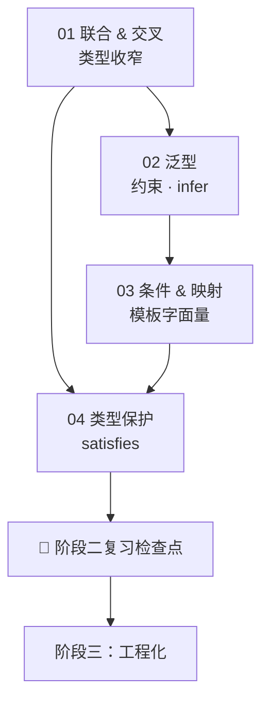

## ⬅️ 前置知识
- 需要：[[01-联合类型与交叉类型]] — 联合/交叉/可辨识联合
- 需要：[[02-泛型与类型推断]] — 泛型、约束、工具类型
- 需要：[[03-条件类型与映射类型]] — 条件类型、映射类型、模板字面量
- 需要：[[04-类型保护与类型断言]] — 类型守卫、断言、satisfies

## ➡️ 后续笔记
- [[../阶段三-工程化与实战集成/01-tsconfig与编译流程]] — 进入阶段三

## 🔗 关联笔记
- [[../00-TypeScript学习路径总索引]] — 返回总索引
- [[../阶段一-类型系统基础/99-阶段一复习检查点]] — 回顾基础

---

## 📋 阶段二知识图谱



---

## ✅ 综合练习

### 练习 1：手写工具类型（P0 必须独立完成）

不借助 TS 内置，手写以下 5 个工具类型：

```typescript
// 1. 排除 U 中的类型
type MyExclude<T, U> = ?;

// 2. 选取 U 中的类型
type MyExtract<T, U> = ?;

// 3. 非 null/undefined
type MyNonNullable<T> = ?;

// 4. 将联合类型转为交叉类型（提示：用分布式条件类型 + 函数类型）
type UnionToIntersection<U> = ?;
// 示例：UnionToIntersection<{a: 1} | {b: 2}> → {a: 1} & {b: 2}

// 5. 元组转联合
type TupleToUnion<T> = ?;
// 示例：TupleToUnion<[string, number, boolean]> → string | number | boolean
```

### 练习 2：类型体操挑战（P1 强烈建议）

```typescript
// 实现 DeepReadonly —— 递归将所有属性变为 readonly
type DeepReadonly<T> = ?;

interface Nested {
  user: {
    profile: {
      name: string;
      settings: { theme: string };
    };
  };
}

type Test = DeepReadonly<Nested>;
// Test.user.profile.settings.theme 应该是 readonly
```

### 练习 3：类型安全的 EventEmitter（P1）

```typescript
// 要求实现一个类型安全的 EventEmitter
// on<K extends keyof Events>(event: K, cb: (...args: Events[K]) => void): void
// emit<K extends keyof Events>(event: K, ...args: Events[K]): void
// off<K extends keyof Events>(event: K, cb: (...args: Events[K]) => void): void

interface Events {
  log: [message: string, level: "info" | "warn" | "error"];
  user: [user: { id: number; name: string }];
}
```

### 练习 4：状态机实战（P2 锦上添花）

设计一个订单状态机的完整类型系统：

```typescript
// 状态：pending → paid → shipped → delivered
//       任意状态 → cancelled
// 要求：
// 1. 用可辨识联合定义每个状态
// 2. 实现一个类型安全的 transition 函数，非法转换在编译时报错
```

---

## 📊 阶段二自测选择题

1. 以下代码的 `Result` 类型是什么？
```typescript
type Result = "a" | "b" extends "a" | "b" | "c" ? true : false;
```
- A) `true`
- B) `false`
- C) `boolean`
- D) 报错

2. 以下代码的输出类型是什么？
```typescript
type T = [string, number] extends [infer A, infer B] ? [B, A] : never;
```
- A) `[string, number]`
- B) `[number, string]`
- C) `never`
- D) `unknown`

3. `satisfies` 和 `as` 的关键区别？
- A) `satisfies` 运行时检查，`as` 不检查
- B) `satisfies` 保留精确类型，`as` 丢失
- C) 没有区别
- D) `satisfies` 只能用于对象

4. 条件类型 `T extends U ? X : Y` 中，什么时候会发生"分布"？
- A) T 是联合类型时
- B) T 是裸类型参数且传入联合类型时
- C) 总是发生
- D) 从不发生

---

## 🎯 阶段二毕业自检

| 层次 | 检查项 |
|------|--------|
| 🟢 基础 | 能手写 `Exclude`、`Extract`、`NonNullable` |
| 🟢 基础 | 能用 `infer` 提取函数返回类型、数组元素类型 |
| 🟡 进阶 | 能手写 `DeepReadonly`、`DeepPartial` 等递归工具类型 |
| 🟡 进阶 | 能设计可辨识联合 + 穷尽检查实现状态机 |
| 🔴 挑战 | 能实现 `UnionToIntersection` 并解释分布机制 |

---

## 📊 通过标准

- 🟢 全部通过 → 可进入阶段三
- 🟡 有未通过项 → 回顾 [[03-条件类型与映射类型]] 后重试
- 🔴 未通过 → 回到 [[02-泛型与类型推断]] 巩固泛型基础

### 🧭 下一步行动

| 自检结果 | 行动 |
|---------|------|
| 🟢 全部通过 | 进入 [[../阶段三-工程化与实战集成/01-tsconfig与编译流程]] |
| 🟡 练习 1 未通过 | 回顾 [[03-条件类型与映射类型]] 的条件类型和分布式条件类型 |
| 🟡 练习 2 未通过 | 回顾 [[03-条件类型与映射类型]] 的映射类型和递归类型 |
| 🟡 练习 3 未通过 | 回顾 [[02-泛型与类型推断]] 的泛型约束和 keyof |
| 🔴 多项未通过 | 回到 [[02-泛型与类型推断]] 从泛型基础重新巩固 |

---

*最后更新：2026-07-19*