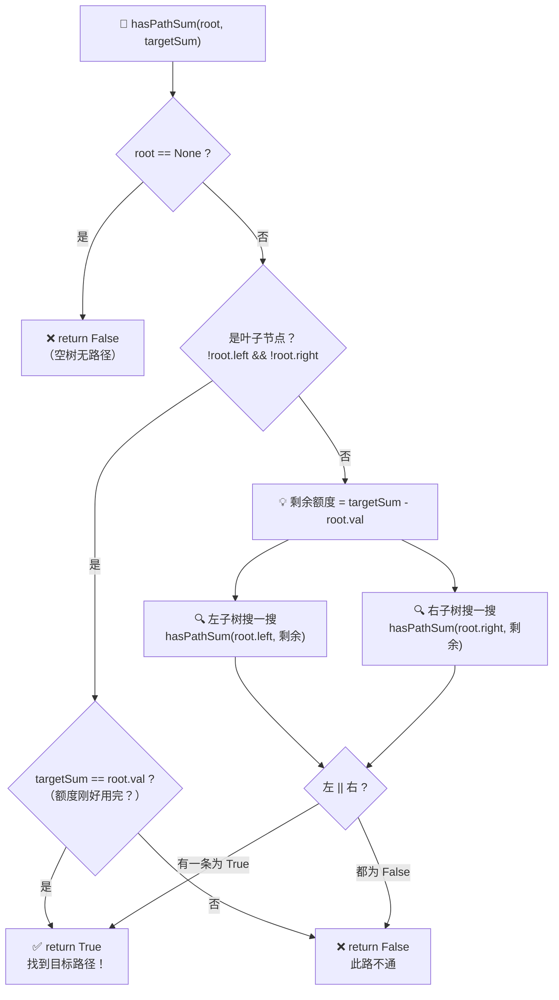
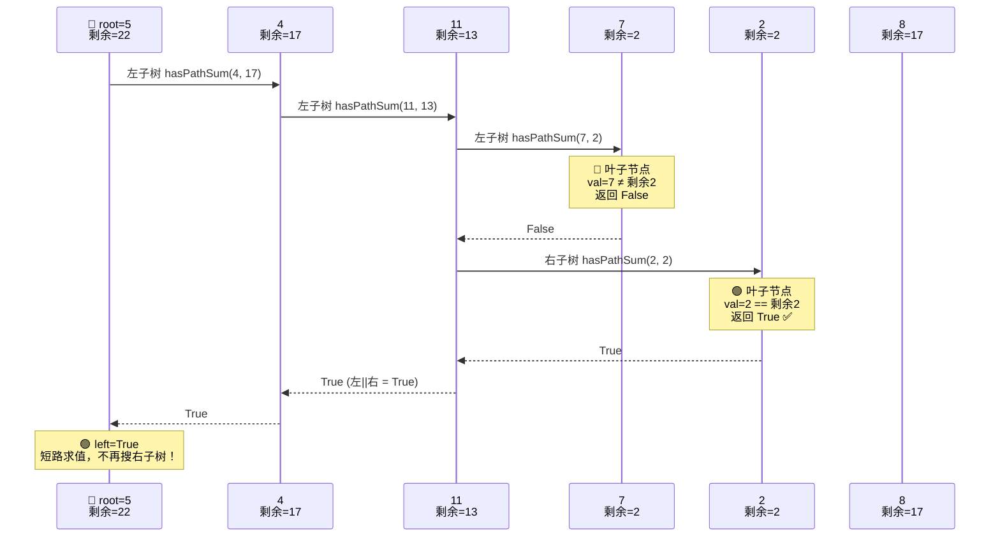

## 112. 路径总和

**难度**：`简单` | **通过率**：56.0% | **相关标签**：`树` `DFS` `BFS` `二叉树`

### 题目描述

给你二叉树的根节点 `root` 和一个表示目标和的整数 `targetSum` 。判断该树中是否存在 **根节点到叶子节点** 的路径，这条路径上所有节点值相加等于目标和 `targetSum` 。如果存在，返回 `true` ；否则，返回 `false` 。

**叶子节点** 是指没有子节点的节点。

### 示例

> [!example] 示例 1
> 
> ```
> 输入：root = [5,4,8,11,null,13,4,7,2,null,null,null,1], targetSum = 22
> 输出：true
> ```
> 路径 `5 → 4 → 11 → 2` 之和为 22。

> [!example] 示例 2
> 
> ```
> 输入：root = [1,2,3], targetSum = 5
> 输出：false
> ```
> 两条路径 `1→2`（和=3）和 `1→3`（和=4），都不等于 5。

> [!example] 示例 3
> ```
> 输入：root = [], targetSum = 0
> 输出：false
> ```
> 空树不存在任何路径。

### 提示

- 树中节点的数目在范围 `[0, 5000]` 内
- `-1000 <= Node.val <= 1000`
- `-1000 <= targetSum <= 1000`

> [!tip] 📖 前置基础
> 如果你还不清楚二叉树怎么从数组构建、`TreeNode` 是什么、或者想了解二叉树的通用解题模板（两大思维 + 三大模板），先看这篇：[[二叉树基础与通用解题框架]]

---

## 🧠 思路详解（动画演示）

### 一、核心思想：自顶向下"消耗"目标值

把 `targetSum` 想象成一个"额度"。每经过一个节点，就从额度中**减去**该节点的值。到达叶子节点时，如果额度恰好归零 → 找到了！



> [!tip] 一句话总结
> **每走一步减掉当前值，到叶子时看是否刚好减到 0。任意一条子树路径成功，整棵树就成功。**

---

### 二、以示例 1 逐步追踪 🎬

示例 1 的树结构：

```
            [5]
           /   \
        [4]     [8]
        /       /  \
     [11]    [13]  [4]
     /   \      \
   [7]   [2]    [1]
```

`targetSum = 22`，要找一条和为 22 的路径。

---

> [!info] **📦 递归展开全景图**（用 Mermaid 序列图展示调用链）



---

#### 🐾 逐步分解

> [!warning] **步骤 ①** — 进入根节点 `5`，剩余额度 `22`
> ```
>    [5] ← 当前节点    剩余 = 22
>   /  \              22 - 5 = 17（传给子树）
> ...  ...
> ```
> • ❌ 不是叶子 → 递归子树，剩余改为 `17`
> • 🔜 先搜左子树 →

> [!warning] **步骤 ②** — 进入节点 `4`，剩余额度 `17`
> ```
>    [5]
>   /  \
> [4] ← 当前节点       剩余 = 17
> /                    17 - 4 = 13（传给子树）
> ...
> ```
> • ❌ 不是叶子 → 递归子树，剩余改为 `13`
> • 🔜 继续搜左子树 →

> [!warning] **步骤 ③** — 进入节点 `11`，剩余额度 `13`
> ```
>    [5]
>   /  \
> [4]  ...
> /
> [11] ← 当前节点      剩余 = 13
> /  \                 13 - 11 = 2（传给子树）
> ... ...
> ```
> • ❌ 不是叶子 → 递归子树，剩余改为 `2`
> • 🔜 先搜左子树 →

> [!danger] **步骤 ④** — 进入节点 `7`，剩余额度 `2`
> ```
>         [5]
>        /   \
>      [4]   ...
>      /
>    [11]
>    /
>  [7] ← 当前节点       剩余 = 2
>                        2 ≠ 7 → 此路不通！
> ```
> • ✅ 是叶子！但 `7 ≠ 2` → **返回 `False`** ❌
> • ⬅️ 回溯到节点 `11`，尝试右子树 →

> [!success] **步骤 ⑤** — 进入节点 `2`，剩余额度 `2`
> ```
>         [5]
>        /   \
>      [4]   ...
>      /
>    [11]
>    /  \
>  [7]  [2] ← 当前节点   剩余 = 2
>                         2 == 2 → 🎉 找到了！
> ```
> • ✅ 是叶子！且 `2 == 2` → **返回 `True`** 🎉
> • ⬆️ 逐层向上返回 `True`，利用 `||` 短路，右侧子树 `8` 不再搜索！

---

### 三、时间复杂度与空间复杂度

| 维度 | 递归 DFS | 迭代 DFS |
|------|----------|----------|
| **时间** | O(n) — 最坏访问所有节点 | O(n) |
| **空间** | O(h) — 递归栈深度，h 为树高 | O(h) — 显式栈 |
| 最坏空间 | O(n) — 退化成链表 | O(n) |
| 最好空间 | O(log n) — 平衡二叉树 | O(log n) |

---

## 🐍 Python 题解

### 准备工作：定义树节点

```python
from typing import Optional
from collections import deque

class TreeNode:
    def __init__(self, val=0, left=None, right=None):
        self.val = val
        self.left = left
        self.right = right
```

---

### 方法一：递归 DFS（最优雅 ⭐）

```python
class Solution:
    def hasPathSum(self, root: Optional[TreeNode], targetSum: int) -> bool:
        # 空节点：无路径
        if not root:
            return False

        # 叶子节点：检查剩余值是否刚好等于当前节点值
        if not root.left and not root.right:
            return targetSum == root.val

        # 非叶子：减去当前值，递归搜索左右子树
        # || 的短路效应：左边找到就不再搜右边
        return (self.hasPathSum(root.left, targetSum - root.val) or
                self.hasPathSum(root.right, targetSum - root.val))
```

> [!tip] 理解关键
> `targetSum - root.val` 是**减而治之**：不是累加路径和再比较，而是把目标一路减到 0。两种思路等价，但减法更简洁。

---

### 方法二：迭代 DFS（显式栈）

```python
class Solution:
    def hasPathSum(self, root: Optional[TreeNode], targetSum: int) -> bool:
        if not root:
            return False

        # 栈中存 (节点, 当前路径和)
        stack = [(root, root.val)]

        while stack:
            node, path_sum = stack.pop()

            # 叶子节点：检查路径和
            if not node.left and not node.right:
                if path_sum == targetSum:
                    return True

            # 先压右再压左 → 先处理左子树（栈是 LIFO）
            if node.right:
                stack.append((node.right, path_sum + node.right.val))
            if node.left:
                stack.append((node.left, path_sum + node.left.val))

        return False
```

> [!info] 迭代 vs 递归
> 迭代版用显式栈模拟递归调用栈，避免递归深度过大时栈溢出。逻辑完全一致，只是手动管理"调用栈"。

---

### 方法三：BFS（队列 / 层序遍历）

```python
class Solution:
    def hasPathSum(self, root: Optional[TreeNode], targetSum: int) -> bool:
        if not root:
            return False

        # 队列中存 (节点, 当前路径和)
        queue = deque([(root, root.val)])

        while queue:
            node, path_sum = queue.popleft()  # FIFO

            if not node.left and not node.right:
                if path_sum == targetSum:
                    return True

            if node.left:
                queue.append((node.left, path_sum + node.left.val))
            if node.right:
                queue.append((node.right, path_sum + node.right.val))

        return False
```

> [!info] DFS vs BFS
> • **DFS**：一条路走到黑，找到就停——适合**深而窄**的树
> • **BFS**：一层层展开，逐层检查——适合答案在**浅层**的情况

---

### 方法四：带回溯的 DFS（显式回溯，便于理解）

```python
class Solution:
    def hasPathSum(self, root: Optional[TreeNode], targetSum: int) -> bool:
        if not root:
            return False
        return self._dfs(root, targetSum - root.val)

    def _dfs(self, node: TreeNode, remaining: int) -> bool:
        # 叶子节点：判断剩余是否为 0
        if not node.left and not node.right:
            return remaining == 0

        # 尝试左子树
        if node.left:
            remaining -= node.left.val      # 做选择
            if self._dfs(node.left, remaining):
                return True
            remaining += node.left.val      # 撤销选择（回溯）

        # 尝试右子树
        if node.right:
            remaining -= node.right.val     # 做选择
            if self._dfs(node.right, remaining):
                return True
            remaining += node.right.val     # 撤销选择（回溯）

        return False
```

> [!tip] 回溯三要素
>  ① 
>  ② 
>  ③ 
>
> 方法一之所以不需要显式回溯，是因为 `targetSum - root.val` 创建了新值，不修改原变量。

---

### 🔍 带追踪的调试版本

把下面这段代码跑一遍，就能看到每一步的决策过程：

```python
def hasPathSum_trace(root: Optional[TreeNode], targetSum: int,
                      depth: int = 0, side: str = "") -> bool:
    indent = "│  " * depth
    prefix = f"{indent}├─[{side}]" if side else f"{indent}[root]"
    node_val = root.val if root else "None"
    print(f"{prefix} 进入节点={node_val}, 剩余目标={targetSum}")

    if not root:
        print(f"{prefix} ❌ 空节点 → False")
        return False

    # 叶子节点
    if not root.left and not root.right:
        ok = (targetSum == root.val)
        print(f"{prefix} {'✅ 叶子!' if ok else '❌ 叶子'} val={root.val} "
              f"{'==' if ok else '≠'} 剩余{targetSum} → {ok}")
        return ok

    # 非叶子：递归子树
    new_target = targetSum - root.val
    print(f"{prefix} → 非叶子, 减{root.val}后剩余={new_target}, 搜子树...")

    left = hasPathSum_trace(root.left, new_target, depth + 1, "L")
    if left:
        print(f"{prefix} ✅ 左子树找到，短路返回 True")
        return True

    right = hasPathSum_trace(root.right, new_target, depth + 1, "R")
    print(f"{prefix} {'✅' if right else '❌'} 右子树结果={right}")
    return right


# ===== 测试运行 =====
if __name__ == "__main__":
    # 构建示例 1 的树
    root = TreeNode(5,
        TreeNode(4,
            TreeNode(11, TreeNode(7), TreeNode(2))
        ),
        TreeNode(8,
            TreeNode(13, None, TreeNode(1)),
            TreeNode(4)
        )
    )

    print("=" * 50)
    print("示例 1: targetSum = 22")
    print("=" * 50)
    result = hasPathSum_trace(root, 22)
    print(f"\n🎯 最终结果: {result}")
```

**运行输出预览：**

```
==================================================
示例 1: targetSum = 22
==================================================
[root] 进入节点=5, 剩余目标=22
[root] → 非叶子, 减5后剩余=17, 搜子树...
│  ├─[L] 进入节点=4, 剩余目标=17
│  ├─[L] → 非叶子, 减4后剩余=13, 搜子树...
│  │  ├─[L] 进入节点=11, 剩余目标=13
│  │  ├─[L] → 非叶子, 减11后剩余=2, 搜子树...
│  │  │  ├─[L] 进入节点=7, 剩余目标=2
│  │  │  ├─[L] ❌ 叶子 val=7 ≠ 剩余2 → False
│  │  │  ├─[R] 进入节点=2, 剩余目标=2
│  │  │  ├─[R] ✅ 叶子! val=2 == 剩余2 → True
│  │  ├─[L] ✅ 左子树找到，短路返回 True
│  ├─[L] ✅ 左子树找到，短路返回 True
[root] ✅ 左子树找到，短路返回 True

🎯 最终结果: True
```

---

### 完整测试代码

```python
from typing import Optional, List
from collections import deque


class TreeNode:
    def __init__(self, val=0, left=None, right=None):
        self.val = val
        self.left = left
        self.right = right


class Solution:
    """递归 DFS — 推荐写法"""
    def hasPathSum(self, root: Optional[TreeNode], targetSum: int) -> bool:
        if not root:
            return False
        if not root.left and not root.right:
            return targetSum == root.val
        return (self.hasPathSum(root.left, targetSum - root.val) or
                self.hasPathSum(root.right, targetSum - root.val))


class SolutionIterative:
    """迭代 DFS（栈）"""
    def hasPathSum(self, root: Optional[TreeNode], targetSum: int) -> bool:
        if not root:
            return False
        stack = [(root, root.val)]
        while stack:
            node, s = stack.pop()
            if not node.left and not node.right and s == targetSum:
                return True
            if node.right:
                stack.append((node.right, s + node.right.val))
            if node.left:
                stack.append((node.left, s + node.left.val))
        return False


class SolutionBFS:
    """BFS（队列）"""
    def hasPathSum(self, root: Optional[TreeNode], targetSum: int) -> bool:
        if not root:
            return False
        q = deque([(root, root.val)])
        while q:
            node, s = q.popleft()
            if not node.left and not node.right and s == targetSum:
                return True
            if node.left:
                q.append((node.left, s + node.left.val))
            if node.right:
                q.append((node.right, s + node.right.val))
        return False


# 辅助函数：从列表构建二叉树（LeetCode 风格）
def build_tree(values: List[Optional[int]]) -> Optional[TreeNode]:
    if not values or values[0] is None:
        return None
    root = TreeNode(values[0])
    queue = deque([root])
    i = 1
    while queue and i < len(values):
        node = queue.popleft()
        if i < len(values) and values[i] is not None:
            node.left = TreeNode(values[i])
            queue.append(node.left)
        i += 1
        if i < len(values) and values[i] is not None:
            node.right = TreeNode(values[i])
            queue.append(node.right)
        i += 1
    return root


if __name__ == "__main__":
    # 示例 1
    tree1 = build_tree([5,4,8,11,None,13,4,7,2,None,None,None,1])
    # 示例 2
    tree2 = build_tree([1, 2, 3])
    # 示例 3
    tree3 = build_tree([])

    sol = Solution()

    assert sol.hasPathSum(tree1, 22) == True,  "示例 1 失败"
    assert sol.hasPathSum(tree2, 5)  == False, "示例 2 失败"
    assert sol.hasPathSum(tree3, 0)  == False, "示例 3 失败"

    print("✅ 所有测试用例通过！")
```

---

## 📌 递归模板总结（本题视角）

| 场景 | 模板 |
|------|------|
| **结果与叶子节点有关**（如本题） | 在 `!root.left && !root.right` 处判断 |
| **结果与叶子节点无关**（如路径不需要到叶子） | 在 `!root` 处判断 |

```python
# 模板 1：关注叶子节点（本题）
def dfs(root, target):
    if not root:
        return False                          # 空节点
    if not root.left and not root.right:
        return target == root.val             # 🍃 叶子处判断
    return dfs(root.left, target - root.val) or dfs(root.right, target - root.val)

# 模板 2：不关注叶子节点
def dfs(root, target):
    if not root:
        return target == 0                    # 🛑 任意节点处判断
    return dfs(root.left, target - root.val) or dfs(root.right, target - root.val)
```

> [!tip] 📖 延伸阅读
> 本题用到了「自顶向下（遍历）」思维。完整的**两大思维 + 三大模板 + 练习路线**，见：[[二叉树基础与通用解题框架]]

---

## 📚 相关题目

| 题号 | 题目 | 模板 | 区别 |
|------|------|------|------|
| [[113. 路径总和 II]] | 返回所有路径 | 🟢 A + 回溯 | 需要记录完整路径 |
| [[437. 路径总和 III]] | 路径不必从根开始 | 🟢 A 双重递归 | 每个节点都可以当起点 |
| [[257. 二叉树的所有路径]] | 收集所有路径字符串 | 🟢 A | 兄弟题，传字符串参数 |

---

### 参考

- [[二叉树基础与通用解题框架]]
- [[牛客网 ACM 模式二叉树解题模板]]
- [代码随想录 - 112. 路径总和](https://programmercarl.com/0112.%E8%B7%AF%E5%BE%84%E6%80%BB%E5%92%8C.html)
- [B 站视频讲解](https://www.bilibili.com/video/BV19t4y1L7CR)
