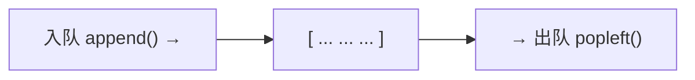
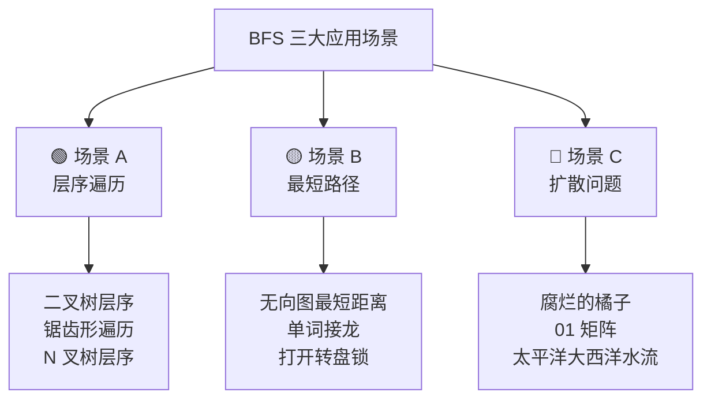
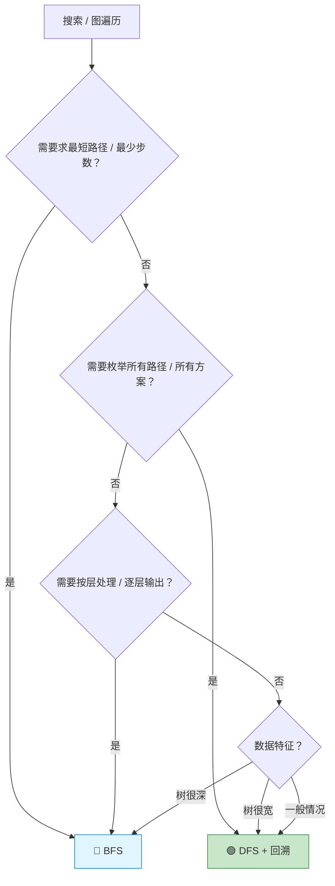

## 前置知识：BFS 到底是什么

### 一层一层往外扩散

想象一颗石子丢进池塘——波纹从中心向外**一圈一圈扩散**。BFS（Breadth-First Search，广度优先搜索）也是这个思路：

1. 从起点开始
2. 先走完**所有距离为 1** 的节点
3. 再走完**所有距离为 2** 的节点
4. 依次类推，一层一层往外走

```
         [1]        ← 第 0 层
        /   \
      [2]   [3]     ← 第 1 层
     /   \    \
   [4]   [5]  [6]   ← 第 2 层

BFS 访问顺序：1 → 2 → 3 → 4 → 5 → 6
```

> [!important] 核心特征：广度优先
> BFS 不关心"某条路径走到底"，只关心"当前层还有谁没处理完"。同一层的节点先处理完，才轮到下一层。

### 队列是 BFS 的灵魂

```python
from collections import deque

# BFS 的最小骨架
q = deque([起点])
visited = {起点}

while q:
    node = q.popleft()           # ① 从队首取出最早入队的节点
    for neighbor in get_neighbors(node):
        if neighbor not in visited:
            visited.add(neighbor)  # ② 标记 + 入队
            q.append(neighbor)     # ③ 新节点放到队尾
```



> [!tip] 为什么是队列？
> **FIFO（先进先出）** 保证了"先被发现的节点先被处理"。距离起点的远近正好对应入队的早晚——距离 = 1 的节点一定比距离 = 2 的节点先入队、先出队。

### BFS 天然适合求最短路径

因为 BFS 是**一层一层**扩散的，第一次到达目标节点时，所走的步数就是最短步数（在无权图中）。

```
起点 A → 终点 G，求最少步数

     A ─ B ─ D ─ G
     │    ╲  │
     C ──── E ─ F

BFS 的扩散过程：
  第 0 层: A
  第 1 层: B, C          ← 距离 A 为 1
  第 2 层: D, E           ← 距离 A 为 2
  第 3 层: G, F           ← 距离 A 为 3（G 首先在距离 3 被 BFS 访问）

结论：A 到 G 的最短路径长度 = 3
```

> [!important] 一句话总结
> **BFS = 队列 + 层序扩散。** 每个节点第一次被访问到的步数，就是从起点到它的最短距离（无权图）。

---

## BFS 核心模板（两个版本）

### 版本一：基础版（不区分层）

当你**不需要知道当前在第几层**时使用——比如只判断可达性。

```python
from collections import deque

# ====== BFS 基础版模板 ======
def bfs_basic(start):
    q = deque([start])
    visited = {start}

    while q:
        node = q.popleft()               # ① 出队

        # ② 处理当前节点（判断目标 / 收集结果）
        if node == target:
            return 结果

        # ③ 扩散：遍历所有邻居
        for neighbor in get_neighbors(node):
            if neighbor not in visited:
                visited.add(neighbor)     # ⚠️ 入队前立即标记
                q.append(neighbor)        # 入队

    return 未找到
```

**真题：200. 岛屿数量（BFS 版）**

```python
from collections import deque

def numIslands(grid):
    if not grid:
        return 0
    rows, cols = len(grid), len(grid[0])
    count = 0

    def bfs(r, c):
        q = deque([(r, c)])
        grid[r][c] = '0'                  # 入队前立即标记
        while q:
            x, y = q.popleft()
            for dx, dy in [(1,0), (-1,0), (0,1), (0,-1)]:
                nx, ny = x + dx, y + dy
                if 0 <= nx < rows and 0 <= ny < cols and grid[nx][ny] == '1':
                    grid[nx][ny] = '0'    # 入队前标记
                    q.append((nx, ny))

    for r in range(rows):
        for c in range(cols):
            if grid[r][c] == '1':
                count += 1
                bfs(r, c)
    return count
```

---

### 版本二：分层版（需要知道当前层数）

当你**需要知道当前在第几层**时使用——比如层序遍历、求最短距离。

```python
from collections import deque

# ====== BFS 分层版模板 ======
def bfs_level(start):
    q = deque([start])
    visited = {start}
    level = 0                            # ① 记录当前层数

    while q:
        level += 1
        # ② for _ in range(len(q))：把当前层的节点全部处理完
        for _ in range(len(q)):          # ⚠️ 关键！不能用 while q 直接循环
            node = q.popleft()

            # ③ 在当前层处理节点
            if node == target:
                return level              # 返回层次 = 最短距离

            # ④ 扩散：邻居进入下一层
            for neighbor in get_neighbors(node):
                if neighbor not in visited:
                    visited.add(neighbor)
                    q.append(neighbor)

    return -1
```

> [!warning] `for _ in range(len(q))` 的意义
> 这个 `for` 循环保证了：**每次 while 迭代处理完一整层的节点**。如果你用 `while q:` 直接取，就无法区分哪些节点属于同一层。

**为什么是 `len(q)` 在 for 头部？** `range(len(q))` 在一开始就固定了循环次数，之后 `q.append()` 追加的下层节点不会被本轮循环处理。

```
初始: q = [A]              → len(q)=1 → 处理 A，孩子入队
下一轮: q = [B, C]         → len(q)=2 → 处理 B, C，孩子入队
再下一轮: q = [D, E, F]    → len(q)=3 → 处理 D, E, F
```

---

## 三大应用场景



---

### 场景 A：层序遍历

**特点**：需要**按层输出结果**，每层一个列表。必须用分层版模板。

**真题：102. 二叉树的层序遍历**

```python
from collections import deque

def levelOrder(root):
    if not root:
        return []
    result = []
    q = deque([root])

    while q:
        level = []
        for _ in range(len(q)):       # 当前层有 len(q) 个节点
            node = q.popleft()
            level.append(node.val)    # 收集当前层
            if node.left:
                q.append(node.left)
            if node.right:
                q.append(node.right)
        result.append(level)

    return result

# 输入: [3,9,20,null,null,15,7]
# 输出: [[3], [9,20], [15,7]]
```

**真题：103. 二叉树的锯齿形层序遍历**

```python
from collections import deque

def zigzagLevelOrder(root):
    if not root:
        return []
    result = []
    q = deque([root])
    left_to_right = True

    while q:
        level = deque()               # 用 deque 方便双端插入
        for _ in range(len(q)):
            node = q.popleft()
            if left_to_right:
                level.append(node.val)    # 左→右：尾部追加
            else:
                level.appendleft(node.val) # 右→左：头部插入
            if node.left:
                q.append(node.left)
            if node.right:
                q.append(node.right)
        result.append(list(level))
        left_to_right = not left_to_right

    return result
```

**适用题目**：

| 题目 | 变体要点 |
|------|---------|
| 102. 层序遍历 | 基础版，每层一个 list |
| 103. 锯齿形遍历 | 用 `deque` 双向插入 |
| 107. 层序遍历 II | 结果 `[::-1]` 反转即可 |
| 429. N 叉树层序 | 子节点用 `extend` 入队 |
| 199. 二叉树右视图 | 每层取最后一个节点 |
| 513. 找树左下角 | 每层取第一个，最后一层即答案 |

---

### 场景 B：最短路径

**特点**：在无权图中求**起点到终点的最短距离**，BFS 第一次碰到终点即最短。

**真题：127. 单词接龙**

```python
from collections import deque

def ladderLength(beginWord, endWord, wordList):
    word_set = set(wordList)
    if endWord not in word_set:
        return 0

    q = deque([beginWord])
    visited = {beginWord}
    level = 0

    while q:
        level += 1
        for _ in range(len(q)):
            word = q.popleft()
            if word == endWord:
                return level                     # 第一次到达 = 最短路径

            # 尝试替换每个位置的字母
            for i in range(len(word)):
                for c in 'abcdefghijklmnopqrstuvwxyz':
                    new_word = word[:i] + c + word[i+1:]
                    if new_word in word_set and new_word not in visited:
                        visited.add(new_word)
                        q.append(new_word)

    return 0
```

**真题：752. 打开转盘锁**

```python
from collections import deque

def openLock(deadends, target):
    dead = set(deadends)
    if "0000" in dead:
        return -1

    q = deque(["0000"])
    visited = {"0000"}
    level = 0

    while q:
        for _ in range(len(q)):
            state = q.popleft()
            if state == target:
                return level

            # 每个转盘可以 +1 或 -1
            for i in range(4):
                digit = int(state[i])
                for delta in [1, -1]:
                    new_digit = (digit + delta) % 10
                    new_state = state[:i] + str(new_digit) + state[i+1:]
                    if new_state not in dead and new_state not in visited:
                        visited.add(new_state)
                        q.append(new_state)
        level += 1

    return -1
```

**真题：1091. 二进制矩阵中的最短路径**

```python
from collections import deque

def shortestPathBinaryMatrix(grid):
    n = len(grid)
    if grid[0][0] == 1 or grid[n-1][n-1] == 1:
        return -1

    q = deque([(0, 0, 1)])          # (r, c, distance)
    grid[0][0] = 1                   # 标记为已访问

    # 八个方向
    directions = [(-1,-1), (-1,0), (-1,1),
                   (0,-1),          (0,1),
                   (1,-1),  (1,0),  (1,1)]

    while q:
        r, c, dist = q.popleft()
        if r == n - 1 and c == n - 1:
            return dist

        for dr, dc in directions:
            nr, nc = r + dr, c + dc
            if 0 <= nr < n and 0 <= nc < n and grid[nr][nc] == 0:
                grid[nr][nc] = 1     # 标记已访问
                q.append((nr, nc, dist + 1))

    return -1
```

**适用题目**：

| 题目 | 最短什么 | 邻居生成方式 |
|------|---------|-------------|
| 127. 单词接龙 | 转换序列长度 | 改一个字母 |
| 752. 打开转盘锁 | 旋转次数 | 每个转盘 +1/-1 |
| 1091. 二进制矩阵中的最短路径 | 经过单元格数 | 八个方向 |
| 279. 完全平方数 | 最少平方数个数 | 减去一个平方数 |
| 433. 最小基因变化 | 基因变化次数 | 改一个字符 |
| 815. 公交路线 | 最少公交车数 | 站台到线路映射 |

---

### 场景 C：扩散问题

**特点**：从**多个起点同时扩散**，计算影响范围。核心技巧——**多源 BFS**。

> [!tip] 多源 BFS 的技巧
> 把**所有起点同时入队**，然后一起扩散。等价于有一个虚拟"超级起点"连接到所有真实起点。

**真题：994. 腐烂的橘子**

```python
from collections import deque

def orangesRotting(grid):
    rows, cols = len(grid), len(grid[0])
    q = deque()
    fresh = 0

    # ① 找出所有腐烂橘子 + 统计新鲜橘子
    for r in range(rows):
        for c in range(cols):
            if grid[r][c] == 2:
                q.append((r, c))          # 所有腐烂橘子同时入队
            elif grid[r][c] == 1:
                fresh += 1

    if fresh == 0:
        return 0

    minutes = 0
    directions = [(1,0), (-1,0), (0,1), (0,-1)]

    while q:
        for _ in range(len(q)):           # 按层扩散
            r, c = q.popleft()
            for dr, dc in directions:
                nr, nc = r + dr, c + dc
                if 0 <= nr < rows and 0 <= nc < cols and grid[nr][nc] == 1:
                    grid[nr][nc] = 2       # 感染
                    fresh -= 1
                    q.append((nr, nc))
        if q:                              # 下一轮还有要扩散的
            minutes += 1

    return minutes if fresh == 0 else -1
```

**真题：542. 01 矩阵**

```python
from collections import deque

def updateMatrix(mat):
    rows, cols = len(mat), len(mat[0])
    q = deque()
    dist = [[-1] * cols for _ in range(rows)]

    # ① 所有 0 同时入队（多源 BFS）
    for r in range(rows):
        for c in range(cols):
            if mat[r][c] == 0:
                q.append((r, c))
                dist[r][c] = 0

    directions = [(1,0), (-1,0), (0,1), (0,-1)]

    while q:
        r, c = q.popleft()
        for dr, dc in directions:
            nr, nc = r + dr, c + dc
            if 0 <= nr < rows and 0 <= nc < cols and dist[nr][nc] == -1:
                dist[nr][nc] = dist[r][c] + 1
                q.append((nr, nc))

    return dist
```

**真题：1162. 地图分析**

```python
from collections import deque

def maxDistance(grid):
    n = len(grid)
    q = deque()

    # 所有陆地作为多源 BFS 起点
    for r in range(n):
        for c in range(n):
            if grid[r][c] == 1:
                q.append((r, c))

    if not q or len(q) == n * n:   # 全海洋或全陆地
        return -1

    level = -1
    directions = [(1,0), (-1,0), (0,1), (0,-1)]

    while q:
        for _ in range(len(q)):
            r, c = q.popleft()
            for dr, dc in directions:
                nr, nc = r + dr, c + dc
                if 0 <= nr < n and 0 <= nc < n and grid[nr][nc] == 0:
                    grid[nr][nc] = 1
                    q.append((nr, nc))
        level += 1

    return level
```

**适用题目**：

| 题目 | 扩散源 | 扩散规则 |
|------|-------|---------|
| 994. 腐烂的橘子 | 所有腐烂橘子 | 四方向感染 |
| 542. 01 矩阵 | 所有 0 | 四方向计算距离 |
| 1162. 地图分析 | 所有陆地 | 四方向，最远海洋 |
| 1765. 地图中最高点 | 所有水域 | 四方向递增 |
| 417. 太平洋大西洋水流 | 边界单元格 | 逆流而上 |

---

## BFS vs DFS 对比表

| 维度 | 🔵 BFS | 🟢 DFS |
|------|--------|--------|
| **核心数据结构** | 队列（`deque`） | 栈（函数调用栈 或 `list`） |
| **遍历方式** | 一层一层，横向扩散 | 一条路走到黑，纵向深入 |
| **空间复杂度** | O(w) — 最宽层的节点数 | O(h) — 树的高度 / 递归深度 |
| **最适场景** | 最短路径、层序遍历、扩散 | 所有路径、排列组合、树属性 |
| **最短路径** | ✅ 天然最优（无权图） | ❌ 需要全搜后比较 |
| **所有方案** | ❌ 不适合 | ✅ 回溯天然支持 |
| **代码风格** | 循环 + 队列 | 递归为主 |
| **递归依赖** | 无 | 依赖函数调用栈 |
| **树很宽时** | ⚠️ 空间消耗大 | ✅ 空间消耗小 |
| **树很深时** | ✅ 不受影响 | ⚠️ 可能递归爆栈 |



> [!tip] 面试中的实用判断
> • 看到"最短 / 最少 / 最近"→ 想 BFS
> • 看到"所有可能 / 全部方案 / 排列组合"→ 想 DFS + 回溯
> • 看到"层 / 每一层"→ 想 BFS
> • 其他情况 → DFS 优先（代码更短、更直观）

---

## 新手练习路线图

> [!important] 练习策略
> 从树开始（最直观），再到图，最后到扩散。BFS 核心就一层窗户纸——`for _ in range(len(q))`。

```
阶段 1️⃣  层序遍历：理解 BFS 基本机制
  ├── 102. 二叉树的层序遍历          ← BFS 入门第一题
  ├── 107. 二叉树的层序遍历 II       ← 输出格式变化
  ├── 199. 二叉树的右视图            ← 取每层最后一个
  └── 103. 二叉树的锯齿形层序遍历    ← 交替方向

阶段 2️⃣  最短路径：BFS 的最大优势
  ├── 111. 二叉树的最小深度          ← 树上的最短路径
  ├── 752. 打开转盘锁                ← 图上的 BFS 最短路径
  ├── 127. 单词接龙                  ← 字符串 BFS
  └── 279. 完全平方数                ← 数学 BFS（抽象状态）

阶段 3️⃣  多源 BFS：扩散问题
  ├── 994. 腐烂的橘子                ← 多源 BFS 入门
  ├── 542. 01 矩阵                   ← 多源 BFS 距离计算
  └── 1162. 地图分析                 ← 多源 BFS 最大值

阶段 4️⃣  矩阵 BFS + 复合条件
  ├── 1091. 二进制矩阵最短路径        ← 八方向 BFS
  ├── 417. 太平洋大西洋水流           ← 边界多源 BFS
  └── 815. 公交路线                   ← 图建模 + BFS
```

---

## 常见易错点

> [!warning] **坑 1：忘记 visited 导致无限循环**
> ```python
> # ❌ 没有 visited → 循环图会无限跑
> q = deque([start])
> while q:
>     node = q.popleft()
>     for neighbor in graph[node]:
>         q.append(neighbor)  # A → B → A → B ... 死循环
>
> # ✅ 必须维护 visited
> q = deque([start])
> visited = {start}
> while q:
>     node = q.popleft()
>     for neighbor in graph[node]:
>         if neighbor not in visited:
>             visited.add(neighbor)
>             q.append(neighbor)
> ```
> 对于树（DAG、无环），可以不加 `visited`（有 `parent` 参数即可）。但**凡是图（可能有环），必须加 `visited`**。

> [!warning] **坑 2：入队前标记 vs 出队时标记**
> ```python
> # ❌ 出队时才标记 → 同一个节点被多次入队，严重低效
> while q:
>     node = q.popleft()
>     if node in visited:
>         continue              # 同一个节点重复出队！
>     visited.add(node)
>     for neighbor in graph[node]:
>         q.append(neighbor)    # 没有在入队前标记，neighbor 会被重复入队
>
> # ✅ 入队前立即标记 → 每个节点最多入队一次
> while q:
>     node = q.popleft()
>     for neighbor in graph[node]:
>         if neighbor not in visited:
>             visited.add(neighbor)  # 入队前标记！
>             q.append(neighbor)
> ```
> **原则：一入队就标记，绝不等出队。**

> [!warning] **坑 3：分层写法用错**
> ```python
> # ❌ 无法区分层
> level = 0
> while q:
>     node = q.popleft()       # 直接 pop 无法知道属于哪层
>     # ...
>
> # ✅ 用 for _ in range(len(q)) 固定当前层的节点数
> level = 0
> while q:
>     level += 1
>     for _ in range(len(q)):  # 处理"当前层"的所有节点
>         node = q.popleft()
>         # ...
> ```
> `for _ in range(len(q))` 是 BFS 分层的最核心技巧。`len(q)` 在一开始就固定，不会因为后续 `q.append()` 而改变循环次数。

> [!warning] **坑 4：起点特殊处理**
> ```python
> # ❌ 起点未标记 → 可能被重复访问
> q = deque([start])
> # visited 为空！
> while q:
>     node = q.popleft()
>     for neighbor in graph[node]:
>         if neighbor not in visited:
>             visited.add(neighbor)
>             q.append(neighbor)
>     # start 没在 visited 中 → 后续可能被其他节点反向连回来
>
> # ✅ 起点在入队前就标记
> q = deque([start])
> visited = {start}             # 关键！
> ```

> [!warning] **坑 5：多源 BFS 忘记同时入队**
> ```python
> # ❌ 对每个起点分别 BFS → O(n²) 的时间复杂度
> for start in sources:
>     bfs(start)    # 惨——每个源都重新 BFS 一遍整个图
>
> # ✅ 所有源同时入队 → 一次 BFS 搞定
> q = deque(sources)
> for source in sources:
>     visited.add(source)
> # 等价于添加"虚拟超级源点"
> ```

> [!warning] **坑 6：二维矩阵的 visited 优化**
> ```python
> # ❌ 额外开辟 visited 二维数组 → 浪费空间
> visited = [[False] * cols for _ in range(rows)]
>
> # ✅ 原地修改（如果题目允许）→ 省空间
> grid[nr][nc] = '0'     # 把陆地直接改成水
> # 或
> dist[nr][nc] = -1      # 用特殊值标记未访问
> ```
> 能用原数组标记就用原数组，省一个 visited 矩阵。

---

## 相关题目索引

| 题号 | 题目 | 场景 | 关键技巧 |
|------|------|------|---------|
| 102 | 二叉树的层序遍历 | A 层序 | `for _ in range(len(q))` |
| 103 | 锯齿形层序遍历 | A 层序 | `deque` 双端插入 |
| 107 | 层序遍历 II | A 层序 | 结果反转 |
| 199 | 二叉树右视图 | A 层序 | 每层最后一个 |
| 513 | 找树左下角的值 | A 层序 | 每层第一个 |
| 429 | N 叉树层序遍历 | A 层序 | `children` 入队 |
| 111 | 二叉树最小深度 | B 最短 | 第一个叶子 |
| 127 | 单词接龙 | B 最短 | 字母替换 + visited |
| 752 | 打开转盘锁 | B 最短 | 状态空间 BFS |
| 279 | 完全平方数 | B 最短 | 抽象 BFS |
| 1091 | 二进制矩阵最短路径 | B 最短 | 八方向 BFS |
| 815 | 公交路线 | B 最短 | 站台 → 线路建模 |
| 433 | 最小基因变化 | B 最短 | 基因序列 BFS |
| 994 | 腐烂的橘子 | C 扩散 | 多源 BFS |
| 542 | 01 矩阵 | C 扩散 | 多源 BFS 距离计算 |
| 1162 | 地图分析 | C 扩散 | 多源 BFS 最远距离 |
| 1765 | 地图中最高点 | C 扩散 | 多源 BFS 高度分配 |
| 417 | 太平洋大西洋水流 | C 扩散 | 边界多源 BFS |
| 200 | 岛屿数量 | A 遍历 | BFS/DFS 均可 |
| 695 | 岛屿最大面积 | A 遍历 | BFS 面积统计 |

---

## 相关笔记

- [[DFS深度优先搜索基础与通用解题框架]] — DFS 的递归/迭代实现、回溯、记忆化搜索，与 BFS 的对比
- [[二叉树基础与通用解题框架]] — 树上的 DFS/BFS 三大模板
- [[队列基础与通用解题框架]] 与 [[栈基础与通用解题框架]] — `deque` 的底层原理和常见用法
- [[图论基础与通用解题框架]] — 图的表示、BFS 遍历、连通分量
- [[图论基础与通用解题框架]]（Dijkstra 等） — Dijkstra / Floyd 等加权图的最短路径（BFS 只能处理无权图）
- [[动态规划基础与通用解题框架]] — 记忆化搜索 → BFS 处理最短路径类 DP
