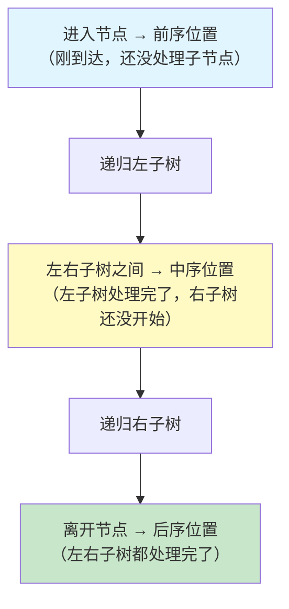
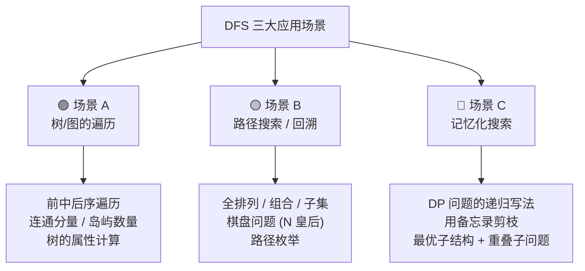
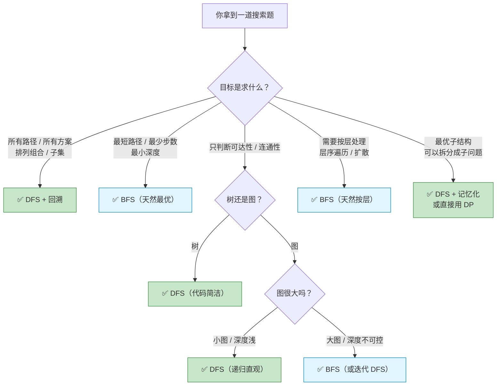

## 前置知识：DFS 到底是什么

### 一条路走到黑，走不通再回头

想象你在一个迷宫里：你每到一个岔路口，先选**最左边那条路**一直走到底；走不通了，退回到上一个岔路口，再选**下一条路**继续走到底；如此往复，直到找到出口。

这就是 **DFS（Depth-First Search，深度优先搜索）** 的核心思想：

```
         [1]
        /   \
      [2]   [5]
     /   \
   [3]   [4]

DFS 访问顺序：1 → 2 → 3 → 4 → 5
```

> [!info] 核心特征：深度优先
> 不关心"离起点多远"，只关心"沿着当前路径还能走多远"。走到叶子 / 死胡同时，**原路退回**，换一条分支继续。

### 调用栈就是天然的 DFS

```python
def dfs(n):
    if n > 3:
        return
    print(f"进入 {n}")
    dfs(n + 1)       # 递归调用 → 自动"深入"
    print(f"退出 {n}")  # 递归返回 → 自动"回溯"

dfs(1)

# 输出：
# 进入 1
# 进入 2
# 进入 3
# 退出 3
# 退出 2
# 退出 1
```

> [!tip] 一句话总结
> **递归 = DFS，函数调用栈 = DFS 的"路径记忆"。** 每进入一层递归就是"往前走一步"，每 return 就是"往回退一步"。

### 前序、中序、后序的本质



```python
def traverse(node):
    if not node:
        return
    # ─── 前序位置：访问当前节点 ───
    print(node.val)                       # 前序遍历
    traverse(node.left)
    # ─── 中序位置：左子树处理完毕 ───
    print(node.val)                       # 中序遍历（BST 有序输出）
    traverse(node.right)
    # ─── 后序位置：左右子树都处理完毕 ───
    print(node.val)                       # 后序遍历
```

> [!important] 前序 vs 后序的本质区别
> • **前序**：自顶向下，信息从父传子。你能拿到"从根到当前节点"的所有信息。
> • **后序**：自底向上，信息从子传父。你能拿到"整棵子树"的所有信息。
> • **中序**：仅在二叉搜索树（BST）中常用，可以得到升序序列。

---

## DFS 的两种实现方式

### 方式一：递归实现（最常用）

```python
def dfs_recursive(graph, node, visited):
    """递归 DFS 模板"""
    # ① 标记当前节点为已访问
    visited.add(node)
    # ② 前序位置：处理当前节点（可选）
    print(node)
    # ③ 遍历所有邻居
    for neighbor in graph[node]:
        if neighbor not in visited:
            dfs_recursive(graph, neighbor, visited)
    # ④ 后序位置：回溯前的处理（可选）
    pass
```

**优点**：代码简洁，天然契合"深入 + 回溯"的执行逻辑。
**缺点**：深度过大时可能触发递归深度限制（Python 默认约 1000 层）。
**适用**：树的遍历、回溯搜索、记忆化搜索。

### 方式二：迭代实现（手动栈）

```python
def dfs_iterative(graph, start):
    """迭代 DFS 模板"""
    visited = set()
    stack = [start]            # 手动维护的栈

    while stack:
        node = stack.pop()     # 弹出栈顶（LIFO：后进先出）
        if node in visited:
            continue
        visited.add(node)
        # 处理当前节点
        print(node)
        # 邻居入栈（注意：入栈顺序决定遍历顺序）
        for neighbor in graph[node]:
            if neighbor not in visited:
                stack.append(neighbor)
```

**优点**：不依赖函数调用栈，可以处理深度非常大的遍历。
**缺点**：代码不如递归直观，回溯类题目写起来复杂。
**适用**：图遍历（避免递归爆栈）、需要手动控制遍历次序的场景。

> [!tip] 选型口诀
> **能递归就递归。** 只有深度明显过大（例如链表长 10000+，或图的连通分量极深）时才考虑迭代写法。面试 95% 的 DFS 题用递归即可。

### 递归 vs 迭代对比

| | 递归 DFS | 迭代 DFS |
|---|---|---|
| **数据结构** | 函数调用栈（隐式） | `list` 手动栈（显式） |
| **代码量** | 短，简洁 | 较长 |
| **回溯操作** | return 自动完成 | 需要手动管理 |
| **深度限制** | 受 Python 递归深度限制 | 无限制 |
| **调试难度** | 容易（调用栈清晰） | 稍难（手动模拟） |
| **面试频率** | 90%+ | 少数场景 |

---

## DFS 的三大应用场景



---

### 场景 A：树 / 图的遍历

**特点**：访问每个节点恰好一次，不关心具体路径，只关心"有没有到过"。

```python
# ====== 模板 A：树/图遍历 DFS ======
def dfs_traverse(node, visited=None):
    """通用遍历模板 —— 访问每个节点一次"""
    if visited is None:
        visited = set()

    if not node:
        return

    # ① 前序：到达节点时做判断
    if 满足停止条件:
        return 某值

    visited.add(node)

    # ② 遍历所有子节点 / 邻居
    for child in get_children(node):
        if child not in visited:
            dfs_traverse(child, visited)

    # ③ 后序：离开节点时汇总子节点结果（分治时用）
```

**真题：200. 岛屿数量**

```python
def numIslands(grid):
    """计算二维网格中岛屿的数量"""
    if not grid:
        return 0
    rows, cols = len(grid), len(grid[0])
    count = 0

    def dfs(r, c):
        # 越界或碰到水 → 退回
        if r < 0 or c < 0 or r >= rows or c >= cols or grid[r][c] == '0':
            return
        # 标记为已访问（直接把陆地改成水，省一个 visited 数组）
        grid[r][c] = '0'
        # 向四个方向深入
        dfs(r + 1, c)
        dfs(r - 1, c)
        dfs(r, c + 1)
        dfs(r, c - 1)

    for r in range(rows):
        for c in range(cols):
            if grid[r][c] == '1':
                count += 1
                dfs(r, c)  # 把整个岛屿"沉没"

    return count
```

**真题：104. 二叉树的最大深度**

```python
def maxDepth(root):
    """后序遍历：向左右子树要答案，合并返回"""
    if not root:
        return 0
    left = maxDepth(root.left)
    right = maxDepth(root.right)
    return max(left, right) + 1
```

**适用题目汇总**：

| 题目 | 遍历类型 | 关键技巧 |
|------|---------|---------|
| 104. 二叉树最大深度 | 后序 | `max(左, 右) + 1` |
| 226. 翻转二叉树 | 后序 | 交换左右引用 |
| 200. 岛屿数量 | 前序 + 标记 | 沉没法（`grid[r][c]='0'`） |
| 695. 岛屿最大面积 | 后序 | 返回面积累加 |
| 98. 验证 BST | 中序 | 维护 `prev` 比较 |

---

### 场景 B：路径搜索 / 回溯

**特点**：需要**枚举所有可能性**，做选择 → 深入 → 撤销选择，返回上一层时**恢复现场**。

> [!important] 回溯 = DFS + 状态恢复
> 回溯是 DFS 的一个子集。凡是有"做选择 / 撤销选择"这个动作的 DFS，就是回溯。

```python
# ====== 模板 B：回溯 DFS ======
class Solution:
    def solve(self, 输入参数):
        self.result = []          # ① 收集所有方案
        path = []                 # ② 当前路径（可变，必须回溯）
        self.backtrack(起始选择, path)
        return self.result

    def backtrack(self, 选择列表, path):
        # ③ 终止条件：到达叶子 / 满足要求
        if 满足终止条件:
            self.result.append(list(path))   # ⚠️ 拷贝！不能直接 append(path)
            return

        # ④ 遍历所有选择
        for choice in 选择列表:
            # ⑤ 剪枝：跳过非法选择
            if 不合法:
                continue

            # ⑥ 做选择
            path.append(choice)
            更新选择列表（标记已使用 / 移除等）

            # ⑦ 递归深入
            self.backtrack(新的选择列表, path)

            # ⑧ 撤销选择（回溯！关键一步！）
            path.pop()
            恢复选择列表
```

**真题：46. 全排列**

```python
def permute(nums):
    """返回数组的所有排列"""
    result = []
    path = []
    used = [False] * len(nums)

    def backtrack():
        if len(path) == len(nums):
            result.append(list(path))  # ⚠️ 拷贝
            return
        for i in range(len(nums)):
            if used[i]:
                continue
            # 做选择
            path.append(nums[i])
            used[i] = True
            # 深入
            backtrack()
            # 撤销
            path.pop()
            used[i] = False

    backtrack()
    return result
```

**真题：22. 括号生成**

```python
def generateParenthesis(n):
    """生成 n 对有效括号的所有组合"""
    result = []

    def backtrack(left, right, path):
        if len(path) == 2 * n:
            result.append(''.join(path))
            return
        # 左括号还有剩余 → 可以加左括号
        if left < n:
            path.append('(')
            backtrack(left + 1, right, path)
            path.pop()
        # 右括号少于左括号 → 可以加右括号
        if right < left:
            path.append(')')
            backtrack(left, right + 1, path)
            path.pop()

    backtrack(0, 0, [])
    return result
```

**真题：78. 子集**

```python
def subsets(nums):
    """返回数组的所有子集"""
    result = []

    def backtrack(start, path):
        result.append(list(path))     # 每个中间节点都要收集
        for i in range(start, len(nums)):
            path.append(nums[i])
            backtrack(i + 1, path)    # 从 i+1 开始，避免重复
            path.pop()

    backtrack(0, [])
    return result
```

> [!tip] 回溯题的口诀
> **"做选择 → 深入 → 撤销选择"** 三步走。`path.append()` 和 `path.pop()` 必须成对出现，中间夹着递归调用。

**适用题目汇总**：

| 题目 | 类型 | 剪枝要点 |
|------|------|---------|
| 46. 全排列 | 排列 | `used[i]` 标记已用 |
| 47. 全排列 II | 排列 + 去重 | 排序 + `i>0 and nums[i]==nums[i-1] and not used[i-1]` |
| 78. 子集 | 子集 | `start` 参数 + 每个节点都收集 |
| 90. 子集 II | 子集 + 去重 | 排序 + 跳过重复 |
| 77. 组合 | 组合 | `start` 参数控制 |
| 39. 组合总和 | 组合 + 可重复选 | `start` 不递增（可重复选同一元素） |
| 22. 括号生成 | 剪枝 | left < n, right < left |
| 51. N 皇后 | 棋盘 | 列 + 两条对角线冲突检测 |

---

### 场景 C：记忆化搜索

**特点**：DFS 的过程中，用 **备忘录（memo）** 缓存中间结果。本质是 **DP 的递归写法**，自顶向下。

```python
# ====== 模板 C：记忆化搜索 ======
from functools import lru_cache

# 方式一：Python 内置装饰器（最简洁）
@lru_cache(None)
def dfs(state):
    if 终止条件:
        return 基础值
    结果 = -inf
    for choice in 可选:
        结果 = max(结果, dfs(new_state) + 收益)
    return 结果

# 方式二：手动管理 memo 字典
def dfs(state, memo={}):
    if state in memo:
        return memo[state]           # ① 已计算过 → 直接返回
    if 终止条件:
        return 基础值
    # ② 计算
    result = 计算逻辑
    for choice in 可选:
        result = better(result, dfs(new_state, memo) + 收益)
    memo[state] = result             # ③ 存入备忘录
    return result
```

> [!tip] 什么时候用记忆化搜索？
> 当你发现 DFS 过程中 **同一个状态被反复计算**，就用 memo 缓存它。所有能用 DP 解的题，理论上都能用记忆化搜索写。

**真题：70. 爬楼梯**

```python
# DP 的自顶向下写法
from functools import lru_cache

@lru_cache(None)
def climbStairs(n):
    if n <= 2:
        return n
    return climbStairs(n - 1) + climbStairs(n - 2)
```

**真题：322. 零钱兑换**

```python
def coinChange(coins, amount):
    from functools import lru_cache

    @lru_cache(None)
    def dfs(remaining):
        if remaining == 0:
            return 0            # 凑齐了
        if remaining < 0:
            return float('inf')  # 无效路径
        best = float('inf')
        for coin in coins:
            best = min(best, dfs(remaining - coin) + 1)
        return best

    ans = dfs(amount)
    return ans if ans != float('inf') else -1
```

**真题：139. 单词拆分**

```python
def wordBreak(s, wordDict):
    from functools import lru_cache
    word_set = set(wordDict)

    @lru_cache(None)
    def dfs(start):
        if start == len(s):
            return True         # 已拆分到末尾
        for end in range(start + 1, len(s) + 1):
            if s[start:end] in word_set and dfs(end):
                return True
        return False

    return dfs(0)
```

**适用题目汇总**：

| 题目 | 状态定义 | memo 缓存什么 |
|------|---------|-------------|
| 70. 爬楼梯 | `dfs(n)` | 爬上第 n 阶的方法数 |
| 509. 斐波那契数 | `dfs(n)` | 第 n 个斐波那契数 |
| 322. 零钱兑换 | `dfs(remaining)` | 凑出 remaining 的最少硬币数 |
| 139. 单词拆分 | `dfs(start)` | 从 start 开始能否拆分成功 |
| 62. 不同路径 | `dfs(r, c)` | 从 (r,c) 到终点的路径数 |
| 198. 打家劫舍 | `dfs(i)` | 从第 i 间开始能偷的最大金额 |

---

## DFS vs BFS 选型决策



> [!important] 一句话决策
> • **枚举所有可能**（排列、组合、子集、棋盘）→ DFS + 回溯
> • **最短路径 / 最少步数** → BFS
> • **树上的问题** → DFS（代码更短）
> • **图上的可达性**（数据小）→ DFS；（数据大）→ BFS

---

## 新手练习路线图

> [!important] 练习策略
> 按场景分类练习，一个场景一个场景吃透。不要跳来跳去！

```
阶段 1️⃣  遍历：建立 DFS 直觉
  ├── 104. 二叉树的最大深度          ← 理解"后序分治"
  ├── 226. 翻转二叉树               ← 理解"后序操作"
  ├── 100. 相同的树                 ← 理解"左右都满足"
  └── 112. 路径总和                 ← 理解"参数向下传"

阶段 2️⃣  回溯：学会"做选择 / 撤销选择"
  ├── 78. 子集                      ← 回溯入门，最简单
  ├── 77. 组合                      ← 理解 start 参数
  ├── 46. 全排列                    ← 理解 used 标记
  └── 22. 括号生成                  ← 理解剪枝条件

阶段 3️⃣  回溯进阶：去重 + 棋盘
  ├── 90. 子集 II                   ← 回溯去重
  ├── 47. 全排列 II                 ← 排列去重
  ├── 39. 组合总和                  ← 可重复选
  ├── 51. N 皇后                    ← 棋盘类经典
  └── 37. 解数独                    ← 棋盘进阶

阶段 4️⃣  图遍历：连通分量 + 岛屿
  ├── 200. 岛屿数量                 ← 图 DFS 入门
  ├── 695. 岛屿最大面积             ← 后序返回面积
  └── 463. 岛屿周长                 ← 边界判断

阶段 5️⃣  记忆化搜索：DFS → DP 的桥梁
  ├── 509. 斐波那契数               ← 理解 memo 缓存
  ├── 322. 零钱兑换                 ← 最优子结构
  ├── 139. 单词拆分                 ← 字符串 DFS + memo
  └── 62. 不同路径                  ← 二维 memo
```

---

## 常见易错点

> [!warning] **坑 1：递归深度超限**
> Python 默认递归深度约 1000 层。当数据规模过大时（如链表 2000+ 节点、极深的树），会抛出 `RecursionError`。
> ```python
> # ❌ 对 2000 个节点的链表递归
> def dfs(head):
>     if not head: return
>     dfs(head.next)   # 第 1000 层时崩溃
>
> # ✅ 方案一：改用迭代 DFS
> # ✅ 方案二：sys.setrecursionlimit(10000)
> # ✅ 方案三：改用 BFS
> ```
> 对于树，深度很少超过 1000；对于链表或退化的树（一条线），务必警惕。

> [!warning] **坑 2：visited 标记时机不对**
> ```python
> # ❌ 出队时才标记 → 同一个节点可能被多次入队
> while stack:
>     node = stack.pop()
>     if node not in visited:
>         visited.add(node)   # 晚了！
>         for neighbor in graph[node]:
>             stack.append(neighbor)   # neighbor 可能已被其他路径入过栈
>
> # ✅ 入栈时立即标记
> stack = [start]
> visited = {start}
> while stack:
>     node = stack.pop()
>     for neighbor in graph[node]:
>         if neighbor not in visited:
>             visited.add(neighbor)   # 立即标记！
>             stack.append(neighbor)
> ```

> [!warning] **坑 3：回溯时忘记恢复现场**
> ```python
> # ❌ path 被污染
> path.append(nums[i])
> backtrack()
> # 忘记 path.pop()！下一个分支的 path 会包含上一个分支的元素
>
> # ✅ 成对出现
> path.append(nums[i])
> backtrack()
> path.pop()
> ```
> 回溯三要素缺一不可：**做选择 → 递归 → 撤销选择**。如果参数是不可变类型（int、str），则不需要显式撤销。

> [!warning] **坑 4：base case 遗漏导致无限递归**
> ```python
> # ❌ 忘记空节点 / 越界判断
> def dfs(node):
>     dfs(node.left)    # 如果 node.left 是 None？下一层的 node 就是 None
>     # ...
>
> # ✅ 先判断终止条件
> def dfs(node):
>     if not node:
>         return
>     dfs(node.left)
>     dfs(node.right)
> ```
> 写递归的第一步永远是 **写 base case**，然后才写递归逻辑。

> [!warning] **坑 5：回溯题收集结果时忘记拷贝**
> ```python
> # ❌ 直接 append 引用 → 后续 pop 会修改已收集的结果
> result.append(path)       # path 在后续会被 pop() 掉！
>
> # ✅ 拷贝一份
> result.append(list(path))  # 或者 path[:]
> ```

> [!warning] **坑 6：记忆化搜索的 memo 缓存状态遗漏**
> ```python
> # ❌ memo 没有存结果，白算
> def dfs(state, memo):
>     if state in memo:
>         return memo[state]
>     result = dfs(state1, memo) + dfs(state2, memo)
>     # 忘记 memo[state] = result → 下次还是会重新算
>
> # ✅ 存入备忘录
> def dfs(state, memo):
>     if state in memo:
>         return memo[state]
>     result = dfs(state1, memo) + dfs(state2, memo)
>     memo[state] = result     # 关键！
>     return result
> ```

---

## 相关题目索引

| 题号 | 题目 | 场景 | 关键技巧 |
|------|------|------|---------|
| 104 | 二叉树的最大深度 | A 遍历 | 后序分治 |
| 226 | 翻转二叉树 | A 遍历 | 后序交换 |
| 200 | 岛屿数量 | A 遍历 | 沉没法 |
| 695 | 岛屿最大面积 | A 遍历 | 后序返回面积 |
| 46 | 全排列 | B 回溯 | used 标记 |
| 47 | 全排列 II | B 回溯 | 排序去重 |
| 78 | 子集 | B 回溯 | start 参数 |
| 90 | 子集 II | B 回溯 | 排序去重 |
| 77 | 组合 | B 回溯 | start 参数 |
| 39 | 组合总和 | B 回溯 | 可重复选 |
| 40 | 组合总和 II | B 回溯 | 排序去重 |
| 22 | 括号生成 | B 回溯 | 剪枝 |
| 51 | N 皇后 | B 回溯 | 棋盘冲突 |
| 37 | 解数独 | B 回溯 | 棋盘搜索 |
| 131 | 分割回文串 | B 回溯 | 字符串分片 |
| 70 | 爬楼梯 | C 记忆化 | memo 换时间 |
| 509 | 斐波那契数 | C 记忆化 | memo 入门 |
| 322 | 零钱兑换 | C 记忆化 | 最优解 |
| 139 | 单词拆分 | C 记忆化 | 字符串 DFS |
| 62 | 不同路径 | C 记忆化 | 二维 memo |
| 112 | 路径总和 | A 遍历 | 前序传参 |
| 113 | 路径总和 II | B 回溯 | 路径收集 |
| 257 | 二叉树所有路径 | B 回溯 | 字符串路径 |

---

## 相关笔记

- [[二叉树基础与通用解题框架]] — 树上的 DFS/BFS 模板
- [[递归基础与通用解题框架]]（分治见 [[分治与堆：从原理到实战]]） — 递归的本质、调用栈、分治思想
- [[回溯基础与通用解题框架]] — 回溯 = DFS + 状态恢复，排列组合子集专题
- [[BFS广度优先搜索基础与通用解题框架]] — 层序扩散、最短路径、与 DFS 的对比
- [[图论基础与通用解题框架]] — 图的 DFS 遍历、连通分量、拓扑排序
- [[动态规划基础与通用解题框架]] — 记忆化搜索 → DP 的桥梁
- [[双指针基础与通用解题框架]] 与 [[滑动窗口基础与通用解题框架]] — 另一类线性遍历模式
