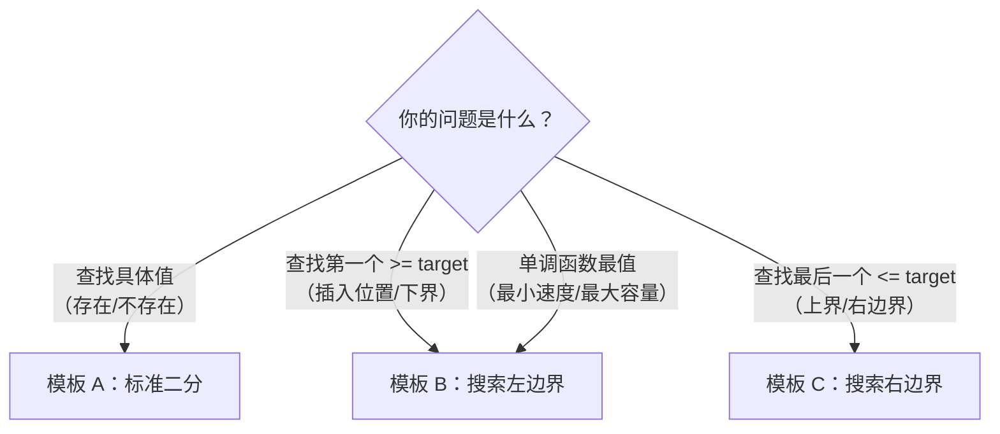
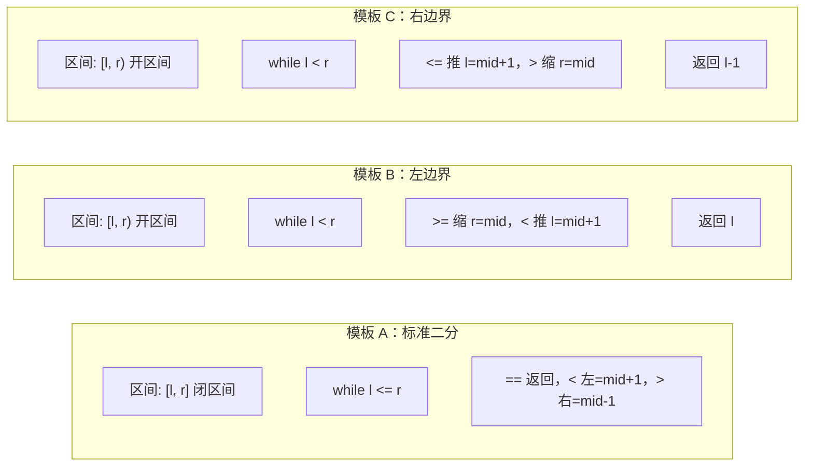

## 前置知识：二分查找到底是什么

### 一句话定义

**二分查找** = 在**有序**（或具备单调性）的搜索空间中，每次砍掉一半候选区域，将查找范围缩小到原来的 1/2，直到找到目标或区间为空。

### 为什么是 O(log n)

```
数组长度 n = 16
第 1 次比较后 → 还剩 8
第 2 次比较后 → 还剩 4
第 3 次比较后 → 还剩 2
第 4 次比较后 → 还剩 1（或找到/没找到）
```

每比较一次，搜索空间减半。16 个元素只需 4 次，100 万个元素只需约 20 次。

$$
\text{比较次数} = \lceil \log_2 n \rceil
$$

### 前提条件：单调性

二分查找要求搜索空间具备**单调性**——某个条件在某一点之前全为 False，之后全为 True（或反之）。这个"分界点"就是二分查找的目标。

```
False False False False True True True True True
                      ↑
                  分界点 = 第一个 True
```

> [!important] 关键认知
> 二分查找**不是只能用在有序数组上**！只要是「单调函数」就能二分。详见第四节「二分查找的泛化」。

---

## 核心思想：循环不变量

### 什么是循环不变量

**循环不变量** = 在整个 while 循环执行期间，始终保持不变的性质。

二分查找的循环不变量就是**区间的定义**——你一旦选定「闭区间」或「开区间」，while 条件、mid 计算、边界更新都必须和这个定义保持一致，一步都不能出轨。

### 闭区间 vs 开区间

| | 闭区间 `[l, r]` | 开区间 `[l, r)` |
|---|---|---|
| 含义 | 答案**一定在** `[l, r]` 之间（含两端） | 答案**一定在** `[l, r)` 之间（含左不含右） |
| 初始值 | `l=0, r=n-1` | `l=0, r=n` |
| while 条件 | `l <= r`（区间内至少有一个元素时继续） | `l < r`（区间内至少有一个元素时继续） |
| `l` 更新 | `l = mid + 1` | `l = mid + 1` |
| `r` 更新 | `r = mid - 1` | `r = mid` |
| 循环结束 | `l > r`，区间为空 | `l == r`，区间为空 |
| 结束时的 `l` | 无特殊含义 | **第一个不满足 `< target` 的位置** |

> [!warning] 核心法则
> **区间的定义一旦确定，就绝对不能改。** 90% 的二分 bug 都源于"选了闭区间，却用开区间的方式更新边界"。

### 为什么开区间如此重要

开区间模板在「搜索边界」问题中有天然优势：循环结束时 `l` 恰好指向目标边界位置，不需要额外判断。

```python
# 开区间结束条件
while l < r:      # 当 l == r 时退出
    ...
return l          # l 恰好停在答案位置
```

---

## 三大万能模板

### 模板选择决策树



---

### 模板 A：标准二分（闭区间 `[l, r]`）—— 搜索单个目标

**适用场景**：数组无重复元素，只判断 target 是否存在，返回其索引。

```python
# ====== 模板 A：标准二分查找（闭区间） ======
def binary_search(nums, target):
    l, r = 0, len(nums) - 1          # ① 闭区间 [l, r]

    while l <= r:                     # ② 区间不为空就继续
        mid = l + (r - l) // 2        # ③ 防溢出的 mid 计算
        if nums[mid] == target:
            return mid                # ④ 找到，直接返回
        elif nums[mid] < target:
            l = mid + 1               # ⑤ target 在右半区
        else:
            r = mid - 1               # ⑥ target 在左半区

    return -1                         # ⑦ 没找到
```

**逐行解读**：

| 行 | 代码 | 为什么这样写 |
|----|------|------------|
| ① | `l, r = 0, len(nums) - 1` | `n-1` 是最后一个元素的索引，闭区间 |
| ② | `while l <= r` | `l == r` 时区间还剩一个元素，必须检查 |
| ③ | `mid = l + (r - l) // 2` | 等价于 `(l+r)//2`，但防溢出 |
| ④ | `return mid` | 找到直接返回 |
| ⑤ | `l = mid + 1` | 排除了 `[l, mid]`，新区间 `[mid+1, r]` |
| ⑥ | `r = mid - 1` | 排除了 `[mid, r]`，新区间 `[l, mid-1]` |

> [!tip] 闭区间口诀
> **「闭区间，<= 走，+1 -1 记心头。」**

---

### 模板 B：搜索左边界（开区间 `[l, r)`）—— 第一个 >= target

**适用场景**：数组有重复元素，要找 target 第一次出现的位置；或者要找插入位置；或者要找「第一个满足某条件」的分界点。

```python
# ====== 模板 B：搜索左边界（开区间） ======
def left_bound(nums, target):
    l, r = 0, len(nums)               # ① 开区间 [l, r)，r = n

    while l < r:                       # ② l == r 时退出
        mid = l + (r - l) // 2
        if nums[mid] >= target:        # ③ 收缩右边界
            r = mid                    #    mid 可能是答案，保留在区间内
        else:
            l = mid + 1                # ④ nums[mid] 太小，排除

    return l                           # ⑤ l = 第一个 >= target 的位置
```

**逐行解读**：

| 行 | 代码 | 为什么这样写 |
|----|------|------------|
| ① | `l, r = 0, len(nums)` | `r = n`，表示右边界在数组之外（开区间） |
| ② | `while l < r` | 当 `l == r` 时区间为空，退出 |
| ③ | `nums[mid] >= target: r = mid` | mid 满足条件，答案在 `[l, mid]`，收缩右边界到 mid |
| ④ | `nums[mid] < target: l = mid + 1` | mid 不满足条件，答案在 `[mid+1, r)` |
| ⑤ | `return l` | 循环结束时，`l` 指向第一个 `>= target` 的位置 |

**返回值含义**：

```python
nums = [1, 3, 5, 5, 7, 9]
# 索引:  0  1  2  3  4  5

left_bound(nums, 5)  # → 2  （第一个 5 的位置）
left_bound(nums, 4)  # → 2  （4 应该插入的位置）
left_bound(nums, 0)  # → 0  （0 应该插入的位置）
left_bound(nums, 10) # → 6  （= n，说明所有数都 < 10）
```

> [!important] 模板 B 的通用性
> 模板 B 是**最常用的二分模板**。找「第一个 >= target」「插入位置」「满足条件的最小值」都用它。大多数二分变形题本质上都是在找左边界。

**左边界口诀**：「开区间，< 来走，遇大缩右，遇小左走，返回 l 不用愁。」

---

### 模板 C：搜索右边界 —— 最后一个 <= target

**适用场景**：数组有重复元素，要找 target 最后一次出现的位置。

```python
# ====== 模板 C：搜索右边界（开区间） ======
def right_bound(nums, target):
    l, r = 0, len(nums)               # ① 开区间 [l, r)

    while l < r:
        mid = l + (r - l) // 2
        if nums[mid] <= target:        # ② 收缩左边界
            l = mid + 1                #    mid 满足条件，但答案可能在更右边
        else:
            r = mid                    # ③ nums[mid] 太大，排除

    return l - 1                       # ④ l = 第一个 > target 的位置
                                       #    l-1 = 最后一个 <= target 的位置
```

**逐行解读**：

| 行 | 代码 | 为什么这样写 |
|----|------|------------|
| ① | `l, r = 0, len(nums)` | 同样是开区间 |
| ② | `nums[mid] <= target: l = mid + 1` | mid 满足，但右边界可能在更右边，往右推 |
| ③ | `nums[mid] > target: r = mid` | mid 太大，排除右半区 |
| ④ | `return l - 1` | 循环结束时 `l` = 第一个 `> target` 的位置，`l-1` = 最后一个 `<= target` |

**返回值含义**：

```python
nums = [1, 3, 5, 5, 7, 9]
# 索引:  0  1  2  3  4  5

right_bound(nums, 5)  # → 3  （最后一个 5 的位置）
right_bound(nums, 4)  # → 1  （最后一个 <= 4 的是 3，索引 1）
right_bound(nums, 0)  # → -1 （说明所有数都 > 0）
right_bound(nums, 10) # → 5  （最后一个元素索引）
```

**右边界口诀**：「左边界反过来，`<=` 推左，`>` 缩右，最后减一拿到手。」

---

### 三模板对比总结



| | 模板 A（标准） | 模板 B（左边界） | 模板 C（右边界） |
|---|---|---|---|
| **区间类型** | 闭区间 `[l, r]` | 开区间 `[l, r)` | 开区间 `[l, r)` |
| **while 条件** | `l <= r` | `l < r` | `l < r` |
| **收缩条件** | `==` 返回，`<` 和 `>` 对称 | `>=` 缩右，`<` 推左 | `<=` 推左，`>` 缩右 |
| **返回值** | mid 或 -1 | `l` | `l - 1` |
| **循环结束** | `l > r` | `l == r` | `l == r` |
| **典型问题** | "target 在不在？" | "第一个 >= target 在哪？" | "最后一个 <= target 在哪？" |

---

## 二分查找的泛化

### 不是只能在有序数组上用

二分查找的本质是在**单调布尔函数**上找分界点。只要一个函数 `f(x)` 满足：

```
f(x) = False  False  False  ...  True  True  True
                              ↑
                         分界点 = 第一个 True
```

就可以用二分查找找到这个分界点。

### 泛化模板

```python
# ====== 泛化二分：在单调函数上找分界点 ======
def binary_search_generic(check, lo, hi):
    """
    check(x): 单调函数，False → True
    返回第一个使 check(x) == True 的 x
    """
    l, r = lo, hi                     # 开区间
    while l < r:
        mid = l + (r - l) // 2
        if check(mid):                # mid 满足条件
            r = mid                   # 答案在左边（含 mid）
        else:
            l = mid + 1               # 答案在右边
    return l
```

### 经典泛化题型

| 题目 | 单调函数 `check(x)` | 搜索的 x |
|------|--------------------|----------|
| 875. 爱吃香蕉的珂珂 | `check(speed)` = 能否在 H 小时内吃完 | 最小速度 |
| 1011. 在 D 天内送达包裹 | `check(capacity)` = 能否在 D 天内运完 | 最小容量 |
| 410. 分割数组的最大值 | `check(max_sum)` = 能否分成 m 个子数组 | 最小的最大值 |
| 719. 找出第 K 小的数对距离 | `check(dist)` = 距离 <= dist 的数对是否 >= K | 第 K 小的距离 |
| 4. 寻找两个正序数组的中位数 | `check(k)` = 第 k 小的元素是否满足条件 | 中位数 |

> [!info] 这类题的共同特征
> 题目问的是「最小/最大的 xxx」，且条件满足「越大越容易满足」或「越小越容易满足」的单调性。这时候直接套泛化模板，**把问题转化为：枚举答案 + check 函数二分验证**。

### 泛化题示例：875. 爱吃香蕉的珂珂

```python
def minEatingSpeed(piles, h):
    def can_finish(speed):
        """以 speed 的速度，能否在 h 小时内吃完"""
        hours = 0
        for pile in piles:
            hours += (pile + speed - 1) // speed  # 向上取整
        return hours <= h

    l, r = 1, max(piles)              # 最小速度 1，最大速度 max(piles)
    while l < r:
        mid = l + (r - l) // 2
        if can_finish(mid):
            r = mid                   # 能吃完，尝试更小的速度
        else:
            l = mid + 1               # 吃不完，必须加速
    return l
```

> [!tip] 泛化二分的心法
> **「答案是什么，就对什么做二分。」** 不要被题目描述迷惑。如果问最小速度，就对速度二分；如果问最小容量，就对容量二分。二分的对象是答案本身。

---

## 新手练习路线图

> [!important] 练习策略
> 先默写模板 → 再理解边界 → 最后做泛化。每道题在纸上画出搜索区间的变化过程。

```
阶段 1️⃣  模板默写（建立肌肉记忆）
  ├── 704. 二分查找                ← 模板 A：最纯正的二分
  ├── 35.  搜索插入位置             ← 模板 B：找左边界
  └── 34.  在排序数组中找首尾位置    ← 模板 B + C：左边界 + 右边界一起用

阶段 2️⃣  边界敏感度训练
  ├── 69.  x 的平方根              ← 对整数二分，理解 mid*mid 溢出
  ├── 367. 有效的完全平方数          ← 同 69，判断
  └── 278. 第一个错误的版本         ← 典型的单调函数二分

阶段 3️⃣  旋转数组专场（理解部分有序）
  ├── 153. 寻找旋转排序数组中的最小值 ← 二分思想升华
  ├── 154. 寻找旋转数组最小值 II     ← 含重复元素
  └── 33.  搜索旋转排序数组          ← 先确定有序区间，再二分

阶段 4️⃣  二维二分
  ├── 74.  搜索二维矩阵             ← 两次二分 / 一次二分
  └── 240. 搜索二维矩阵 II          ← 从右上角开始，不是二分但思想类似

阶段 5️⃣  泛化二分（答案二分）
  ├── 875. 爱吃香蕉的珂珂            ← 经典入门
  ├── 1011. 在 D 天内送达包裹的能力   ← check 函数稍复杂
  ├── 410. 分割数组的最大值          ← 同 1011，更难
  └── 4.   寻找两个正序数组的中位数   ← Hard，二分思想巅峰
```

---

## 常见易错点

> [!warning] **坑 1：mid 溢出**
> ```python
> # ❌ 错误：l + r 可能溢出（Python 不会，但 Java/C++ 会）
> mid = (l + r) // 2
>
> # ✅ 正确：通用防溢出写法
> mid = l + (r - l) // 2
> ```
> 虽然 Python 的整数不会溢出，但养成好习惯——面试官可能让你用其他语言写。

> [!warning] **坑 2：while 条件写错 = 号**
> ```python
> # 闭区间 [l, r] —— 必须用 <=
> l, r = 0, len(nums) - 1
> while l <= r:        # ✅ l==r 时区间还有一个元素
>
> # 开区间 [l, r) —— 必须用 <
> l, r = 0, len(nums)
> while l < r:         # ✅ l==r 时区间为空
> ```
> 闭区间用 `<` 会少检查一个元素，开区间用 `<=` 可能死循环。

> [!warning] **坑 3：区间开闭混乱——最常见！**
> ```python
> # ❌ 选了闭区间，却用开区间的方式更新 r
> l, r = 0, len(nums) - 1     # 闭区间！
> while l <= r:
>     mid = l + (r - l) // 2
>     if nums[mid] >= target:
>         r = mid             # ❌ 闭区间应该 r = mid - 1
>
> # ✅ 一致性铁律：
> # 闭区间 → while l <= r → r = mid - 1, l = mid + 1
> # 开区间 → while l < r  → r = mid,     l = mid + 1
> ```

> [!warning] **坑 4：死循环——mid 偏向和偶数长度**
> ```python
> # 区间只剩两个元素 [l, r] = [0, 1]
> # mid = 0 + (1 - 0) // 2 = 0
> #
> # 注意：r = mid 不会死循环——while l < r 下 mid < r 恒成立，r = mid 必然缩小区间
> # 死循环的唯一来源是 l = mid（mid 偏左时 l = mid 原地踏步）：
> while l < r:
>     mid = l + (r - l) // 2    # mid 偏向左边
>     if nums[mid] == target:
>         l = mid               # ❌ 区间没有缩小！死循环！
>
> # ✅ 推进 l = mid + 1 才安全
> ```
> **解决**：当 `l = mid` 时必须把 mid 偏向右边：`mid = l + (r - l + 1) // 2`。

> [!warning] **坑 5：搜索右边界忘记减一**
> ```python
> # 模板 C 的返回值是 l - 1，不是 l！
> def right_bound(nums, target):
>     ...
>     return l - 1    # ✅ l 指向第一个 > target，l-1 才是最后一个 <= target
>
> # 如果 l == 0，说明所有元素都 > target，target 不存在
> # 如果 l - 1 对应的值 != target，说明 target 不存在
> ```

> [!warning] **坑 6：空数组没有判断**
> ```python
> # ❌ 没有判空
> def binary_search(nums, target):
>     l, r = 0, len(nums) - 1    # nums = [] → r = -1
>     while l <= r:              # 0 <= -1 → False，不会执行
>         ...
>     return -1                  # 结果正确，但有些题需要提前判空
>
> # ✅ 显式判空更安全
> def binary_search(nums, target):
>     if not nums:
>         return -1
>     ...
> ```

---

## 相关题目索引

| 题号 | 题目 | 模板 | 难度 | 备注 |
|------|------|------|------|------|
| 704 | 二分查找 | A | Easy | 纯模板 |
| 35 | 搜索插入位置 | B | Easy | 左边界最简题 |
| 34 | 在排序数组中找首尾位置 | B + C | Medium | 左+右边界 |
| 69 | x 的平方根 | B | Easy | 整数二分 |
| 367 | 有效的完全平方数 | B | Easy | 同 69 |
| 278 | 第一个错误的版本 | 泛化 B | Easy | 单调函数二分 |
| 153 | 寻找旋转排序数组最小值 | 变种 | Medium | 部分有序 |
| 154 | 旋转数组最小值 II | 变种 | Hard | 含重复 |
| 33 | 搜索旋转排序数组 | A + 变种 | Medium | 先定区间 |
| 74 | 搜索二维矩阵 | A | Medium | 二维化一维 |
| 240 | 搜索二维矩阵 II | 变种 | Medium | 右上角 |
| 875 | 爱吃香蕉的珂珂 | 泛化 B | Medium | 答案二分入门 |
| 1011 | 在 D 天内送达包裹 | 泛化 B | Medium | check 稍难 |
| 410 | 分割数组的最大值 | 泛化 B | Hard | 同 1011 |
| 4 | 两个正序数组的中位数 | 泛化 | Hard | 二分巅峰 |

---

## 相关笔记

- [[二叉树基础与通用解题框架]] — 同系列的框架笔记
- [[排序基础与通用解题框架]] — 快排的 partition 与二分思想同源
- [[双指针基础与通用解题框架]] — 对撞指针 = 二分查找的"每次排除一半"
- [[前缀和基础与通用解题框架]] — 二分答案常见于前缀和场景
- [[动态规划基础与通用解题框架]] — 二分 + DP 的组合题（如 LIS 的 O(n log n) 做法）

---

## 一句话总结

> [!important] 记住这一句就够了
> **「二分查找 = 确定区间定义 + 每次砍掉一半 + 保持循环不变量。」** 闭区间用 `<=`，开区间用 `<`，收缩边界必须与区间定义一致。遇到「最小/最大的 xxx」先想答案是否具备单调性——如果有，直接对答案二分。
