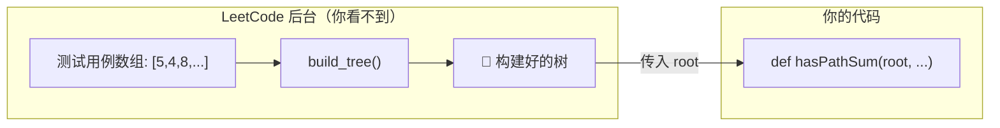
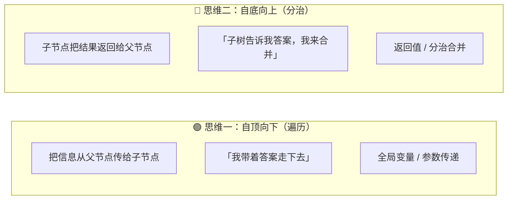
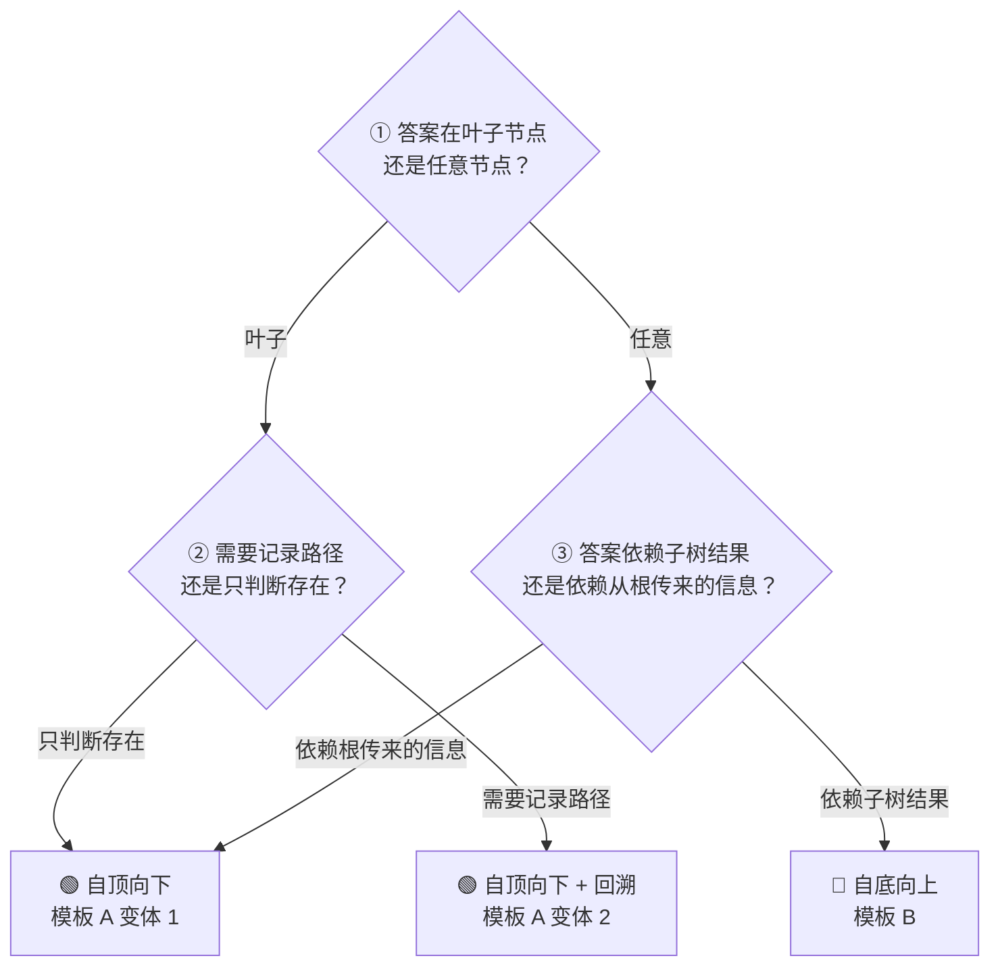

## 前置知识：TreeNode 到底是什么

### 一个节点 = 一个值 + 两个指针

```python
class TreeNode:
    def __init__(self, val=0, left=None, right=None):
        self.val   = val      # 节点的值
        self.left  = left     # 指向左子节点（或 None）
        self.right = right    # 指向右子节点（或 None）
```

每个 `TreeNode` 就是一个**有三个槽位的盒子**：

```
┌─────────────────────┐
│  val: 5             │
│  left:  ──────→ (指向左子树根节点，或 None)
│  right: ──────→ (指向右子树根节点，或 None)
└─────────────────────┘
```

> [!warning] TreeNode 只是"模具"，不是"自动装配机"
> **`class TreeNode` 不会自动做任何事。** 它只定义了单个节点的形状。

```python
# 创建三个节点——它们互不相连！
a = TreeNode(5)
b = TreeNode(4)
c = TreeNode(8)

# a.left → None    （没有连接！）
# 三个节点是独立的，漂浮在内存里
```

你必须手动连接：

```python
a.left  = b    # 把 b 挂到 a 左边
a.right = c    # 把 c 挂到 a 右边

# 现在才形成了一棵树：
#     a(5)
#    /    \
#  b(4)  c(8)
```

### 三层职责，各管各的

| 角色 | 谁做的 | 做了什么 |
|------|--------|---------|
| 🧱 `TreeNode` 类 | 你定义的 | 定义"一个节点长什么样"（模具） |
| 👷 `build_tree()` | 你写的函数 | 借助队列按层序逐个消费数组，循环执行 `node.left = ...` 把节点串起来（工人） |
| 🕵️ 解题函数 | 你写的函数 | 在**已经建好的树**上遍历找答案（住客） |

---

## 数组如何变成二叉树？

LeetCode 的输入 `root = [5,4,8,11,null,13,4,7,2,null,null,null,1]` 是怎么变成一棵树的？

### 核心规则：层序编号

数组按**层序遍历（BFS）**顺序排列，父子关系怎么确定？分两种情况：

> [!important] 黄金公式：仅适用于**无 null 的完全二叉树**（堆式数组）
> 若数组是一棵**不含 `null` 的完全二叉树**（如堆的存储方式），对于索引为 `i` 的节点：
> • **左子节点**在索引 `2i + 1`
> • **右子节点**在索引 `2i + 2`
>
> ⚠️ LeetCode 的层序数组是「**队列逐个消费**」格式：非 null 节点按层序出队，依次消费数组接下来的**两个槽位**作为左右孩子；`null` 槽位不创建节点（也就不再派生子节点槽位）。**一旦数组含 `null`，上面的索引公式就失效**——例如本例中索引 5 的 `13` 的孩子并不是索引 11、12 的元素。正确解法是下方 `build_tree` 的队列法。

### 手算一遍

数组：`[5, 4, 8, 11, null, 13, 4, 7, 2, null, null, null, 1]`

```
索引:  0   1   2   3    4    5   6   7   8    9    10   11   12
数值: [5,  4,  8,  11, null,13, 4,  7,  2,  null,null,null, 1]
```

| 步骤 | 出队的父节点 | 消费槽位 → 左子 | 消费槽位 → 右子 | 结果 |
|------|--------|----------|----------|------|
| ① | `i=0, 值=5`（根） | `索引 1 → 4` | `索引 2 → 8` | 5 的左子是 4，右子是 8 |
| ② | `i=1, 值=4` | `索引 3 → 11` | `索引 4 → null` | 4 的左子是 11，无右子 |
| ③ | `i=2, 值=8` | `索引 5 → 13` | `索引 6 → 4` | 8 的左子是 13，右子是 4 |
| ④ | `i=3, 值=11` | `索引 7 → 7` | `索引 8 → 2` | 11 的左子是 7，右子是 2 |
| ⑤ | `i=5, 值=13` | `索引 9 → null` | `索引 10 → null` | 13 是叶子节点（消费了两个 null） |
| ⑥ | `i=6, 值=4`（右子树的 4） | `索引 11 → null` | `索引 12 → 1` | 4 无左子，右子是 1（1 挂在 4 下） |

最终树结构：

```
             [5]
           /     \
        [4]       [8]
        /         /   \
     [11]      [13]   [4]
     /   \               \
   [7]   [2]              [1]
```

> [!warning] 若套用索引公式会错在哪
> 按公式，13（索引 5）会得到「右子 = 索引 12 的 1」；但队列法中 13 消费的是索引 9、10 两个 null——**13 是叶子**。索引 12 的 `1` 是索引 6 的 4 消费的——**1 是右子树中 4 的右孩子**。前几步的消费索引恰好与 `2i+1 / 2i+2` 重合纯属巧合（前面的 null 还没造成错位）。

### `build_tree` 完整代码

```python
from collections import deque

def build_tree(values):
    """把 LeetCode 风格的数组转成一棵二叉树"""
    if not values or values[0] is None:
        return None

    root = TreeNode(values[0])           # ① 创建根节点
    queue = deque([root])                # ② 队列存"等着挂孩子的节点"
    i = 1

    while queue and i < len(values):
        node = queue.popleft()           # ③ 按顺序取出一个等待节点

        # 挂左孩子
        if i < len(values) and values[i] is not None:
            node.left = TreeNode(values[i])
            queue.append(node.left)      # 左孩子将来也要挂孩子
        i += 1                           # ⚠️ 不管是不是 null，索引都前进！

        # 挂右孩子
        if i < len(values) and values[i] is not None:
            node.right = TreeNode(values[i])
            queue.append(node.right)
        i += 1

    return root
```

> [!warning] 关键细节
> **`i += 1` 不论值是不是 `null` 都要执行！** `null` 虽然不创建节点，但占了一个索引位置，跳过会导致后续的父子关系全乱。

### 反向验证：树 → 数组

```python
def tree_to_array(root):
    """把二叉树转回 LeetCode 数组格式"""
    if not root:
        return []
    result = []
    queue = deque([root])
    while queue:
        node = queue.popleft()
        if node:
            result.append(node.val)
            queue.append(node.left)
            queue.append(node.right)
        else:
            result.append(None)
    while result and result[-1] is None:
        result.pop()
    return result
```

> [!tip] 自检技巧
> `tree_to_array(build_tree(x)) == x` 若成立，说明「数组 → 树 → 数组」往返一致，建树逻辑无误。

### `popleft()` 为什么这样用？

`queue.popleft()` 从队列**左端**弹出；`append()` 在**右端**追加。合起来就是 **FIFO（先进先出）**：

```
初始: queue = [5]
轮①: popleft() → 5, 孩子入队 → queue = [4, 8]
轮②: popleft() → 4, 孩子入队 → queue = [8, 11]
轮③: popleft() → 8, 孩子入队 → queue = [11, 13, 4]
...
```

先创建的节点先挂孩子 → 恰好是层序。

### LeetCode 后台做了什么？



你只需要写遍历逻辑，LeetCode 帮你完成了"数组→树"这一步。

### 本地调试的正确姿势

```python
# ❌ 错误——Python 不认 LeetCode 的数组语法
root = [5,4,8,11,None,13,4,7,2,None,None,None,1]
hasPathSum(root, 22)  # 报错！list 没有 .left 属性

# ✅ 正确——自己调 build_tree
values = [5,4,8,11,None,13,4,7,2,None,None,None,1]
root = build_tree(values)          # 数组 → 真正的树
hasPathSum(root, 22)               # root 是 TreeNode ✅
```

---

## 二叉树在业务场景中的体现

二叉树不只在面试里出现——你日常用的每个软件底层几乎都有它。

| 领域 | 树的类型 | 干什么用 |
|------|---------|---------|
| 📁 文件系统 | 目录树 | 组织文件，快速查找 |
| 🗄️ 数据库 | B+ 树 / LSM 树 | 亿级数据毫秒查询 |
| 🌐 网页 | DOM 树 | 浏览器渲染页面的基础 |
| 🧠 AI/ML | 决策树 / 随机森林 | 风控审批、推荐系统 |
| 🎮 游戏 AI | 行为树 / Minimax | NPC 决策、棋类博弈 |
| 🔤 输入法/搜索 | 前缀树（Trie） | 自动补全、拼写检查 |
| 📦 压缩 | 哈夫曼树 | ZIP/GZIP 压缩编码 |
| 🔀 路由 | 基数树 | Nginx/路由器 IP 匹配 |
| 🏢 企业系统 | 组织树 / 权限树 | 审批链、RBAC 权限继承 |
| ⏳ 任务调度 | 堆（完全二叉树） | 优先级队列、定时器 |

| LeetCode 题型 | 对应业务场景 |
|--------------|-------------|
| 112. 路径总和 | 审批链：每级有审批额度，看总金额是否够 |
| 104. 最大深度 | 公司最多几级汇报 |
| 102. 层序遍历 | 全员通知按层级逐级下达 |
| 226. 翻转二叉树 | 镜像站点：左菜单变右菜单 |
| 543. 直径 | 组织内任意两人最长沟通路径 |
| 236. 最近公共祖先 | 找两个人的共同上级 |

---

## 两大核心思维模式

二叉树递归题的底层逻辑只有两种：



> [!info] 用现实类比理解
>
> **自顶向下（遍历）** = 老板分发任务
> • 老板说"预算 100 万"，层层下发，每人花一部分，最后看花完没有
> • 对应路径总和：`targetSum` 从根一路传到叶子
>
> **自底向上（分治）** = 领导收集汇报
> • 领导问"你们部门多少人？"→ 小组长报数 → 汇总
> • 对应最大深度：左右子树各报深度 → 取 max + 1

---

## 拿到题，先问自己这三个问题



> [!tip] 口诀
> **"判断在叶子"→ 自顶向下传参数；"汇总子树"→ 自底向上靠返回。**

---

## 三大万能模板

### 🟢 模板 A：自顶向下（遍历思维）

**核心特征**：没有返回值（或只返回 bool），信息通过**函数参数**向下传递，用**全局变量**收集答案。

模板 A 根据"**只判断存在**"还是"**要记录路径**"分为两个变体：

---

#### 变体 1：只判断存在（无回溯）

**适用场景**：只需要知道"有没有"，不需要记录具体路径。参数是**不可变类型**（整数、字符串），每次递归自动创建新值，互不干扰，无需回溯。

```python
# ====== 模板 A 变体 1：只判断存在 ======
class Solution:
    def solve(self, root, target):
        self.ans = False               # ① 全局变量（或直接用返回值短路）
        self.dfs(root, target)
        return self.ans

    def dfs(self, node, remaining):
        if not node:
            return                      # ② 空节点，直接返回

        # ③ 在「前序位置」更新参数（不可变类型，天然安全）
        remaining = remaining - node.val

        # ④ 在叶子节点判断
        if not node.left and not node.right:
            if remaining == 0:          # 满足条件
                self.ans = True
            return

        # ⑤ 递归左右子树，参数是"新值"，互不影响
        self.dfs(node.left, remaining)
        self.dfs(node.right, remaining)
```

> [!example] 示例：112. 路径总和
> ```python
> def hasPathSum(root, targetSum):
>     if not root:
>         return False
>     if not root.left and not root.right:
>         return targetSum == root.val
>     return (hasPathSum(root.left, targetSum - root.val) or
>             hasPathSum(root.right, targetSum - root.val))
> ```

**对应题目**：

| 题目 | 传什么参数 | 在哪判断 |
|------|-----------|---------|
| 112. 路径总和 | 剩余 targetSum | 叶子节点 |
| 129. 求根到叶子数字之和 | 当前累积数值 | 叶子节点 |

---

#### 变体 2：记录路径（需要回溯）

**适用场景**：需要收集完整路径 / 所有方案。参数包含**可变类型**（列表 `path`），`append` 之后必须在递归返回时 `pop` 恢复现场，否则不同分支的路径会互相污染。

```python
# ====== 模板 A 变体 2：记录路径（回溯） ======
class Solution:
    def solve(self, root):
        self.ans = []                    # ① 全局变量收集「所有路径」
        path = []                        # ② 一条「当前路径」（可变，必须回溯）
        self.dfs(root, path, 初始参数)
        return self.ans

    def dfs(self, node, path, 携带的参数):
        if not node:
            return                        # ③ 空节点，直接返回

        # ④ 在「前序位置」：做选择 + 更新参数
        path.append(node.val)             # ← 选中当前节点
        更新后的参数 = 携带的参数 - node.val   #   更新参数

        # ⑤ 在叶子节点：收集答案
        if not node.left and not node.right:
            if 满足条件:
                self.ans.append(list(path))  # ⚠️ 拷贝！不能直接 append(path)
            # ⚠️ 回溯！叶子节点也要 pop
            path.pop()
            return

        # ⑥ 递归左右子树
        self.dfs(node.left, path, 更新后的参数)
        self.dfs(node.right, path, 更新后的参数)

        # ⑦ 在「后序位置」：撤销选择（回溯）
        path.pop()                        # ← 恢复现场，关键一步！
```

> [!example] 示例：113. 路径总和 II
> ```python
> def pathSum(root, targetSum):
>     ans, path = [], []
>     def dfs(node, remaining):
>         if not node:
>             return
>         path.append(node.val)                                   # ① 做选择
>         if not node.left and not node.right and remaining == node.val:
>             ans.append(list(path))                              # ② 收集（拷贝！）
>         else:
>             dfs(node.left, remaining - node.val)
>             dfs(node.right, remaining - node.val)
>         path.pop()                                              # ③ 撤销选择
>     dfs(root, targetSum)
>     return ans
> ```

**对应题目**：

| 题目 | 传什么参数 | 回溯内容 |
|------|-----------|---------|
| 113. 路径总和 II | path 列表 + 剩余和 | `path.pop()` |
| 257. 二叉树的所有路径 | path 列表 / 路径字符串 | `path.pop()` 或字符串无需回溯 |

---

> [!important] 两个变体的本质区别
>
> | | 变体 1（无回溯） | 变体 2（回溯） |
> |---|---|---|
> | **参数类型** | 不可变（int, str） | 可变（list）+ 不可变 |
> | **是否回溯** | ❌ 不需要 | ✅ 必须 `pop()` |
> | **为什么** | `remaining - node.val` 创建了新值，旧值不变 | `path.append()` 改的是同一个 list 对象 |
> | **返回内容** | `bool` / 单个值 | `List[List[int]]` / 所有路径 |
> | **典型题** | 112. 路径总和、129. 数字之和 | 113. 路径总和 II、257. 所有路径 |

---

### 🔵 模板 B：自底向上（分治思维）

**核心特征**：**必须有返回值**，左右子树的结果交给当前节点来合并。

```python
# ====== 模板 B：自底向上分治 ======
def dfs(node):
    # ① 终止条件：空节点返回基准值
    if not node:
        return 基准值（如 0、None、True）

    # ② 分：分别计算左右子树
    left_result  = dfs(node.left)
    right_result = dfs(node.right)

    # ③ 治：在「后序位置」合并左右结果
    当前结果 = 合并(left_result, right_result, node.val)

    return 当前结果
```

> [!tip] 记忆技巧
> 模板 B 的结构就是 **"左 → 右 → 根"**（后序遍历）。先问左右子树要结果，再处理当前节点。

**适用题目**：

| 题目 | 返回值含义 | 合并逻辑 |
|------|-----------|---------|
| 104. 最大深度 | 子树深度 | `max(左深, 右深) + 1` |
| 226. 翻转二叉树 | 翻转后的子树根 | `node.left=右翻; node.right=左翻` |
| 100. 相同的树 | 两子树是否相同 | `左同 and 右同 and 值同` |
| 110. 平衡二叉树 | (深度, 是否平衡) | `abs(左深-右深)≤1 and 都平衡` |
| 543. 二叉树直径 | 经过该节点的最大路径 | `左深 + 右深` |

**示例：104. 最大深度**

```python
def maxDepth(root):
    if not root:
        return 0
    left  = maxDepth(root.left)
    right = maxDepth(root.right)
    return max(left, right) + 1
```

**示例：226. 翻转二叉树**

```python
def invertTree(root):
    if not root:
        return None
    left  = invertTree(root.left)
    right = invertTree(root.right)
    root.left, root.right = right, left
    return root
```

---

### 🔶 模板 C：层序遍历（BFS）

**核心特征**：用 `deque` 做队列，**一层一层**处理。

```python
# ====== 模板 C：层序遍历 BFS ======
from collections import deque

def bfs(root):
    if not root:
        return 结果

    queue = deque([root])

    while queue:
        for _ in range(len(queue)):    # ① 按层处理
            node = queue.popleft()

            # ② 处理当前节点

            if node.left:
                queue.append(node.left)
            if node.right:
                queue.append(node.right)
```

**适用题目**：

| 题目 | 为什么用 BFS |
|------|-------------|
| 111. 二叉树最小深度 | 遇到第一个叶子就返回，比 DFS 快 |
| 102. 层序遍历 | 天然按层输出 |
| 199. 二叉树的右视图 | 每层最后一个节点 |
| 513. 找树左下角的值 | 每层第一个 / 最后一个 |

**示例：111. 最小深度**

```python
def minDepth(root):
    if not root:
        return 0
    q = deque([root])
    depth = 0
    while q:
        depth += 1
        for _ in range(len(q)):
            node = q.popleft()
            if not node.left and not node.right:
                return depth         # 第一个叶子 = 最小深度
            if node.left: q.append(node.left)
            if node.right: q.append(node.right)
```

---

## 三大模板速查表

| | 🟢 模板 A 遍历 | 🔵 模板 B 分治 | 🔶 模板 C BFS |
|---|---|---|---|
| **方向** | 自顶向下 ↓ | 自底向上 ↑ | 一层层 → |
| **返回值** | void 或 bool | 必须有返回值 | 不递归 |
| **信息流向** | 参数向下传 | return 向上返 | 队列水平传 |
| **结构骨架** | 全局变量 + `dfs(参数)` | `left=dfs(); right=dfs(); return 合并` | `while queue: for _ in range(len)` |
| **一眼认出** | "找路径""所有方案" | "深度""高度""是否平衡" | "层序""最小深度""右视图" |

---

## 新手练习路线图

> [!important] 练习策略
> 每道题先判断属于哪个模板 → 默写模板骨架 → 填业务逻辑。不要上来就抠细节！

```
阶段 1️⃣  建立递归直觉（模板 B 入门）
  ├── 104. 二叉树的最大深度        ← 最最简单，理解"分治"
  ├── 226. 翻转二叉树              ← 理解"交换子树"
  └── 100. 相同的树               ← 理解"左右都满足"

阶段 2️⃣  学会自顶向下（模板 A 入门）
  ├── 112. 路径总和               ← 理解"参数向下传"
  ├── 257. 二叉树的所有路径        ← 理解"收集路径"
  └── 129. 求根到叶子数字之和      ← 理解"累积参数"

阶段 3️⃣  混合运用（模板 A + 回溯）
  ├── 113. 路径总和 II             ← 回溯 + 记录完整路径
  └── 437. 路径总和 III            ← 双重递归

阶段 4️⃣  模板 B 进阶（需要额外信息）
  ├── 110. 平衡二叉树              ← 返回值带两个信息
  ├── 543. 二叉树的直径            ← 全局变量 + 后序
  └── 124. 二叉树最大路径和        ← 稍难，逻辑一样

阶段 5️⃣  BFS 专场
  ├── 111. 二叉树的最小深度        ← 体会 BFS 优势
  ├── 102. 二叉树的层序遍历        ← BFS 基础
  └── 199. 二叉树的右视图          ← BFS 变体
```

---

## 常见易错点

> [!warning] **坑 1：分不清"空节点"和"叶子节点"**
> ```python
> # ❌ 在空节点处判断
> if not root:
>     return targetSum == 0
>
> # ✅ 在叶子节点处判断
> if not root.left and not root.right:
>     return targetSum == root.val
> ```
> 如果树是 `[1,2]`，targetSum=1，第一种会错误认为 `1→None` 是路径。

> [!warning] **坑 2：可变参数必须显式回溯**
> ```python
> # ✅ 整数（不可变）每次 - root.val 创建新值，互不影响
> dfs(node.left, targetSum - root.val)
>
> # ⚠️ 列表（可变）必须回溯！
> path.append(node.val)
> dfs(node.left, path)
> path.pop()          # ← 不写就出 bug
> ```

> [!warning] **坑 3：BFS 队列要同时存节点和路径和**
> ```python
> q = deque([(root, root.val)])    # (节点, 到达该节点的路径和)
> ```

> [!warning] **坑 4：模板 A 的返回值不要被吞掉**
> ```python
> # ❌ True 被吞掉
> dfs(node.left, remaining)
>
> # ✅ 用 or 短路或全局变量
> return dfs(node.left, remaining) or dfs(node.right, remaining)
> ```

---

## 相关题目索引

| 题号 | 题目 | 模板 | 笔记 |
|------|------|------|------|
| 112 | 路径总和 | 🟢 A | [[112. 路径总和]] |
| 113 | 路径总和 II | 🟢 A + 回溯 | |
| 437 | 路径总和 III | 🟢 A 双重递归 | |
| 257 | 二叉树的所有路径 | 🟢 A | |
| 129 | 求根到叶子数字之和 | 🟢 A | |
| 104 | 二叉树的最大深度 | 🔵 B | |
| 226 | 翻转二叉树 | 🔵 B | |
| 100 | 相同的树 | 🔵 B | |
| 110 | 平衡二叉树 | 🔵 B | |
| 543 | 二叉树的直径 | 🔵 B + 全局 | |
| 111 | 二叉树的最小深度 | 🔶 C | |
| 102 | 层序遍历 | 🔶 C | |
| 199 | 二叉树的右视图 | 🔶 C | |
