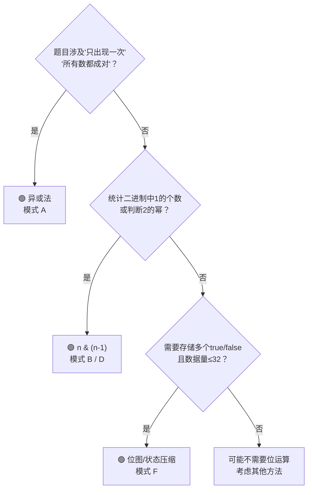

## 前置知识：位运算到底是什么

位运算就是**直接对整数的二进制位进行操作**。CPU 原生支持，是所有运算里最快的。

### 基础操作速查

| 运算符 | 名称 | 示例 | 含义 |
|--------|------|------|------|
| `&` | 按位与 | `5 & 3 = 1` | 两个位都为1才得1 |
| `\|` | 按位或 | `5 \| 3 = 7` | 有一个为1就得1 |
| `^` | 按位异或 | `5 ^ 3 = 6` | 不同得1，相同得0 |
| `~` | 按位取反 | `~5 = -6` | 0变1，1变0（含符号位） |
| `<<` | 左移 | `1 << 3 = 8` | 左移n位 = 乘 2^n |
| `>>` | 右移 | `8 >> 2 = 2` | 右移n位 = 整除 2^n |

### 三个最重要的性质

> [!important] 异或 `^` 的三个魔法属性
>  ① **自消**：`x ^ x = 0` —— 任何数和自己异或等于 0（成对的数全部抵消）
>  ② **恒等**：`x ^ 0 = x` —— 任何数和 0 异或保持不变
>  ③ **交换律 + 结合律**：`a ^ b ^ c = c ^ a ^ b` —— 异或顺序任意调换，结果不变

> [!tip] `n & (n-1)` 的妙用
> 这个操作会把 `n` 的**最低位的 1 变成 0**。反复执行直到 n=0，次数 = n 的二进制中 1 的个数。

> [!tip] `n & (-n)` 的妙用
> 这个操作会**只保留最低位的 1**，其他位全变 0。也叫 lowbit。

---

## 六大核心解题模式

### 模式 A：异或找唯一数

**场景**：一组数中只有一个出现奇数次，其他都出现偶数次。

```python
# ====== 136. 只出现一次的数字 ======
def singleNumber(nums):
    res = 0
    for n in nums:
        res ^= n          # 成对的消掉，最后剩下那个单独的数
    return res
```

**扩展**：两个数各出现一次，其他都出现两次（260. 只出现一次的数字 III）

```python
def singleNumber3(nums):
    xor = 0
    for n in nums:
        xor ^= n           # xor = a ^ b（两个目标数的异或）

    # 找到 xor 最低位的 1，它来自 a 和 b 在这一位不同
    lowbit = xor & (-xor)

    a = 0
    for n in nums:
        if n & lowbit:     # 按这一位是否为1分组
            a ^= n         # 组内异或，剩下的就是 a
    return [a, xor ^ a]    # b = xor ^ a
```

---

### 模式 B：位计数（n & (n-1)）

**场景**：统计二进制中 1 的个数。

```python
# ====== 191. 位1的个数 ======
def hammingWeight(n):
    count = 0
    while n:
        n &= (n - 1)       # 每次消掉最低位的1
        count += 1
    return count
```

**扩展**：338. 比特位计数 — 0 到 n 每个数的 1 个数

```python
def countBits(n):
    dp = [0] * (n + 1)
    for i in range(1, n + 1):
        dp[i] = dp[i >> 1] + (i & 1)   # i的1个数 = i/2的1个数 + 奇偶
    return dp
```

---

### 模式 C：判断奇偶

```python
# n & 1 == 1 → 奇数；n & 1 == 0 → 偶数
if n & 1:
    print("奇数")
```

---

### 模式 D：判断 2 的幂

```python
# ====== 231. 2的幂 ======
def isPowerOfTwo(n):
    return n > 0 and (n & (n - 1)) == 0
    # 2的幂的二进制只有一个1，消掉后应该为0
```

**扩展**：判断 3 的幂、4 的幂：

```python
# 326. 3的幂 — 用整数范围上限
def isPowerOfThree(n):
    return n > 0 and 3**19 % n == 0   # 3^19 是 int 范围内最大 3 的幂

# 342. 4的幂 — 先判断2的幂，再判断1在奇位
def isPowerOfFour(n):
    return n > 0 and (n & (n - 1)) == 0 and (n & 0x55555555) != 0
```

---

### 模式 E：位运算实现加减

```python
# ====== 371. 两整数之和（不用+号） ======
def getSum(a, b):
    MASK = 0xFFFFFFFF           # 32位掩码
    while b:
        carry = (a & b) << 1    # 进位
        a = (a ^ b) & MASK      # 无进位加法
        b = carry & MASK
    return a if a <= 0x7FFFFFFF else ~(a ^ MASK)  # 处理负数
```

---

### 模式 F：位图/状态压缩

**场景**：用整数的每一位表示一个布尔状态，一个 int 可以存 32 个 bool。

```python
# 集合压缩：{0, 2, 5} → 二进制 100101 → 整数 37
state = (1 << 0) | (1 << 2) | (1 << 5)

# 检查元素是否存在
if state & (1 << 2):     # 2 在集合中
    ...

# 回溯题目中代替 visited 数组
def permute_bit(nums):
    ans = []
    def backtrack(path, used_mask):
        if len(path) == len(nums):
            ans.append(path[:])
            return
        for i, n in enumerate(nums):
            if not (used_mask & (1 << i)):
                path.append(n)
                backtrack(path, used_mask | (1 << i))   # 设置第i位
                path.pop()
    backtrack([], 0)
    return ans
```

---

## 拿到题，先问自己



---

## 新手练习路线图

```
阶段 1️⃣  基础位操作
  ├── 136. 只出现一次的数字            ← 理解异或
  ├── 191. 位1的个数                   ← 理解 n & (n-1)
  └── 231. 2的幂                       ← 巩固 n & (n-1)

阶段 2️⃣  位运算扩展
  ├── 260. 只出现一次的数字 III         ← 异或 + 分组
  ├── 338. 比特位计数                   ← 位运算 DP
  └── 342. 4的幂                       ← 位运算 + 数学

阶段 3️⃣  位运算应用
  ├── 371. 两整数之和                   ← 位运算实现加法
  ├── 78. 子集（位图版）                ← 状态压缩入门
  └── 190. 颠倒二进制位                 ← 位操作综合
```

---

## 常见易错点

> [!warning] **坑 1：Python 的 `~` 取反结果不是直觉的**
> ```python
> # Python 用补码表示，~5 = -(5+1) = -6
> # 不要直接用 ~ 做位翻转！
> ```

> [!warning] **坑 2：左移/右移的优先级低于加减**
> ```python
> # ❌ 错误
> mask = 1 << k - 1      # 等于 1 << (k-1)，不是 (1<<k) - 1
> # ✅ 正确
> mask = (1 << k) - 1
> ```

> [!warning] **坑 3：Python 的整数无限大，但位运算要按 32 位处理**
> ```python
> # LeetCode 很多位运算题限定 32 位，Python 要手动 mask
> MASK = 0xFFFFFFFF
> ```

> [!warning] **坑 4：Python 负数右移是算术右移（整数无限宽），做无符号数题需手动 32 位 mask**
> ```python
> # Python 的 >> 是算术右移（填符号位），且整数无限宽、没有 32 位回绕
> # -8 >> 2 = -2  （正确）
> # 但位计数题目中，LeetCode 传入的是无符号整数的补码形式，
> # 需要先 n &= 0xFFFFFFFF 截断成 32 位再处理
> ```

---

## 相关题目索引

| 题号 | 题目 | 模式 | 难度 |
|------|------|------|------|
| 136 | 只出现一次的数字 | A-异或 | 🟢 |
| 137 | 只出现一次的数字 II | 位计数 | 🟡 |
| 260 | 只出现一次的数字 III | A-异或+分组 | 🟡 |
| 191 | 位1的个数 | B-n&(n-1) | 🟢 |
| 338 | 比特位计数 | B-DP | 🟢 |
| 231 | 2的幂 | D-幂判断 | 🟢 |
| 342 | 4的幂 | D-幂判断 | 🟢 |
| 371 | 两整数之和 | E-加减 | 🟡 |
| 78 | 子集 | F-位图 | 🟡 |
| 190 | 颠倒二进制位 | 综合 | 🟢 |

---

## 相关笔记

- [[数组基础与通用解题框架]]
- [[哈希表基础与通用解题框架]]
- [[回溯基础与通用解题框架]] — 位图在回溯中的应用
- [[状态机基础与通用解题框架]]
