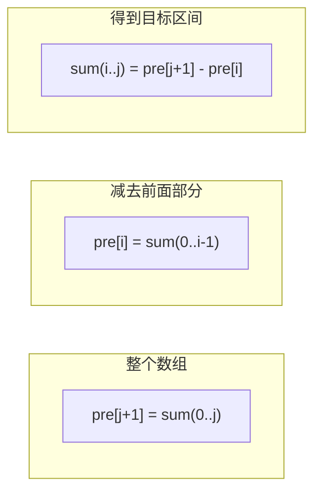
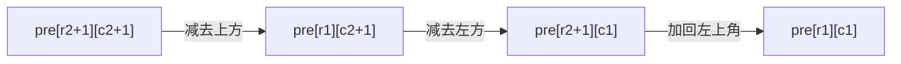

## 前置知识：前缀和是什么

### 一句话定义

> [!important] 前缀和
> `pre[i]` = 数组 `nums[0]` 到 `nums[i-1]` 的累加和（前 i 个元素的和）。

```
nums:   [ 3,  5,  2, -1,  8,  2 ]
索引:     0   1   2   3   4   5

pre[0] = 0             （空数组的和）
pre[1] = 3             （nums[0]）
pre[2] = 3 + 5 = 8     （nums[0] + nums[1]）
pre[3] = 3 + 5 + 2 = 10
pre[4] = 3 + 5 + 2 + (-1) = 9
pre[5] = 3 + 5 + 2 + (-1) + 8 = 17
pre[6] = 3 + 5 + 2 + (-1) + 8 + 2 = 19
```

### 为什么要有前缀和？

**把区间求和从 O(n) 降到 O(1)。**

```
问：nums[1] 到 nums[4] 的和是多少？（即 5 + 2 + (-1) + 8 = 14）

❌ 不用前缀和：遍历 [1,4]，累加 → O(n)
✅ 用前缀和：pre[5] - pre[1] = 17 - 3 = 14 → O(1)
```

如果有 **m 次查询**，复杂度从 O(m×n) 降到 O(m + n)，这是质的改变。

### 构造前缀和数组

```python
def build_prefix(nums):
    n = len(nums)
    pre = [0] * (n + 1)          # ⚠️ 长度是 n+1，不是 n！
    for i in range(n):
        pre[i + 1] = pre[i] + nums[i]
    return pre

# 示例
nums = [3, 5, 2, -1, 8, 2]
pre  = build_prefix(nums)
# pre = [0, 3, 8, 10, 9, 17, 19]
```

> [!warning] pre 数组长度是 n+1，不是 n！
> `pre[0] = 0` 是哨兵位，代表"前 0 个元素的和"。保留这个位置让 `sum(i, j) = pre[j+1] - pre[i]` 这个公式在所有边界情况（`i=0` 时）都成立。

---

## 核心公式

### 一句话说清楚

```
sum(nums[i:j+1]) = pre[j + 1] - pre[i]
```

- `pre[j+1]`：从开头到 `nums[j]` 的累加和
- `pre[i]`：从开头到 `nums[i-1]` 的累加和
- 相减：恰好是 `nums[i]` 到 `nums[j]` 的和



### 手算验证

```
nums = [3, 5, 2, -1, 8, 2]
pre  = [0, 3, 8, 10, 9, 17, 19]

问 sum(1, 4)：nums[1] + nums[2] + nums[3] + nums[4] = 5+2+(-1)+8 = 14
公式计算：pre[5] - pre[1] = 17 - 3 = 14 ✅

问 sum(0, 2)：nums[0] + nums[1] + nums[2] = 3+5+2 = 10
公式计算：pre[3] - pre[0] = 10 - 0 = 10 ✅  （pre[0] 在这发挥价值了！）

问 sum(3, 3)：nums[3] = -1
公式计算：pre[4] - pre[3] = 9 - 10 = -1 ✅
```

---

## 三大变体

### 变体 A：标准前缀和（一维数组区间求和）

**适用场景**：给定数组，多次查询任意区间的和。

```python
class NumArray:
    def __init__(self, nums):
        n = len(nums)
        self.pre = [0] * (n + 1)
        for i in range(n):
            self.pre[i + 1] = self.pre[i] + nums[i]

    def sumRange(self, left: int, right: int) -> int:
        """返回 nums[left:right+1] 的和，O(1)"""
        return self.pre[right + 1] - self.pre[left]


# 使用示例
na = NumArray([-2, 0, 3, -5, 2, -1])
print(na.sumRange(0, 2))   # -2 + 0 + 3 = 1
print(na.sumRange(2, 5))   # 3 + (-5) + 2 + (-1) = -1
print(na.sumRange(0, 5))   # 整个数组 = -3
```

**对应题目**：303. 区域和检索 - 数组不可变

> [!tip] 变体 A 的思维骨架
>  ① 
>  ② 

---

### 变体 B：前缀和 + 哈希表（和为 K 的子数组）

**适用场景**：在一个数组中，找"和为 K 的连续子数组个数"，或"满足某种条件的最长子数组"。

这个变体是面试最高频的题型之一。

#### 核心推导

```
要找的子数组：nums[i:j+1] 的和 == K
即：pre[j+1] - pre[i] == K
变形：pre[i] == pre[j+1] - K
```

**翻译成人话**：当我走到位置 `j` 时，看之前有多少个位置 `i` 的前缀和恰好等于 `pre[j+1] - K`。

#### 完整代码

```python
def subarraySum(nums, k):
    """返回和为 K 的连续子数组个数"""
    count = 0
    cur_sum = 0                        # 当前前缀和（滚动计算，省掉 pre 数组）
    prefix_count = {0: 1}             # ⚠️ 哈希表要初始化 {0: 1}！

    for num in nums:
        cur_sum += num                 # 当前前缀和 = pre[j+1]

        # 检查有多少个 pre[i] 满足 pre[i] == cur_sum - k
        target = cur_sum - k
        if target in prefix_count:
            count += prefix_count[target]

        # 把当前前缀和记录到哈希表
        if cur_sum in prefix_count:
            prefix_count[cur_sum] += 1
        else:
            prefix_count[cur_sum] = 1

    return count


# 示例
nums = [1, 1, 1]; k = 2
print(subarraySum(nums, k))  # 2（[1,1] 出现两次：索引 [0,1] 和 [1,2]）

nums = [1, 2, 3]; k = 3
print(subarraySum(nums, k))  # 2（[1,2] 和 [3]）
```

#### 执行过程手算（nums=[1,2,3], k=3）

| 步骤 | num | cur_sum | target = cur_sum - k | 哈希表里有 target? | count 变化 | 更新后哈希表 |
|------|-----|---------|----------------------|-------------------|-----------|-------------|
| 初始 | — | 0 | — | — | 0 | `{0:1}` |
| ① | 1 | 1 | -2 | 没有 | 0 | `{0:1, 1:1}` |
| ② | 2 | 3 | 0 | 有！0 出现了 1 次 | 0+1=1 | `{0:1, 1:1, 3:1}` |
| ③ | 3 | 6 | 3 | 有！3 出现了 1 次 | 1+1=2 | `{0:1, 1:1, 3:1, 6:1}` |

最终 count = 2。子数组 [1,2]（索引 0..1）和 [3]（索引 2..2）的和都是 3。

#### 变体 B 常见衍生题

| 题目 | 哈希表存什么 | 关键不同点 |
|------|-------------|-----------|
| 560. 和为 K 的子数组 | `{前缀和: 出现次数}` | 求个数 |
| 525. 连续数组 | `{前缀和: 最早出现索引}` | 0 和 1 数量相等 → 把 0 换 -1 |
| 523. 连续的子数组和 | `{前缀和%k: 索引}` | K 的倍数 → 模运算 |
| 974. 和可被 K 整除的子数组 | `{前缀和%k: 出现次数}` | 同余定理 |

---

### 变体 C：二维前缀和（矩阵区域和检索）

**适用场景**：在二维矩阵中，多次查询任意矩形区域的和。

#### 核心公式

```
pre[i][j] = sum( matrix[0..i-1][0..j-1] )

即 pre[i][j] 表示从矩阵左上角 (0,0) 到 (i-1, j-1) 的矩形区域和
```

```
matrix:              pre（二维前缀和）:
┌───────────┐        ┌───────────────┐
│ 1  2  3   │        │ 0   0   0   0 │  ← 第 0 行是哨兵
│ 4  5  6   │        │ 0   1   3   6 │
│ 7  8  9   │        │ 0   5  12  21 │
└───────────┘        │ 0  12  27  45 │
                     └───────────────┘
                      第 0 列也是哨兵
```

#### 构造公式

```
pre[i][j] = pre[i-1][j] + pre[i][j-1] - pre[i-1][j-1] + matrix[i-1][j-1]
            ───────────   ───────────   ──────────────   ─────────────────
              上方矩形        左方矩形      重复加的部分        当前元素
```

#### 查询公式

```text
求 (r1, c1) 到 (r2, c2) 的矩形和：

sum = pre[r2+1][c2+1] - pre[r1][c2+1] - pre[r2+1][c1] + pre[r1][c1]
      ──────────────    ─────────────    ─────────────   ──────────
         整个大矩形        减去上方矩形       减去左方矩形      加回重复减的
```



#### 完整代码

```python
class NumMatrix:
    def __init__(self, matrix):
        if not matrix or not matrix[0]:
            self.pre = []
            return
        m, n = len(matrix), len(matrix[0])
        self.pre = [[0] * (n + 1) for _ in range(m + 1)]  # ⚠️ 行列都 +1

        for i in range(m):
            for j in range(n):
                self.pre[i + 1][j + 1] = (
                    self.pre[i][j + 1]           # 上方矩形
                    + self.pre[i + 1][j]          # 左方矩形
                    - self.pre[i][j]              # 减去重复（左上角）
                    + matrix[i][j]                # 加上当前元素
                )

    def sumRegion(self, r1: int, c1: int, r2: int, c2: int) -> int:
        """返回以 (r1,c1) 为左上角、(r2,c2) 为右下角的矩形区域和"""
        return (
            self.pre[r2 + 1][c2 + 1]
            - self.pre[r1][c2 + 1]
            - self.pre[r2 + 1][c1]
            + self.pre[r1][c1]
        )


# 使用示例
matrix = [
    [3, 0, 1, 4, 2],
    [5, 6, 3, 2, 1],
    [1, 2, 0, 1, 5],
    [4, 1, 0, 1, 7],
    [1, 0, 3, 0, 5],
]
nm = NumMatrix(matrix)
print(nm.sumRegion(2, 1, 4, 3))  # 第 3 行到第 5 行，第 2 列到第 4 列
print(nm.sumRegion(1, 1, 2, 2))  # 中心 2×2 区域
print(nm.sumRegion(1, 2, 2, 4))  # 任意矩形
```

**对应题目**：304. 二维区域和检索 - 矩阵不可变

---

## 差分数组：前缀和的逆运算

前缀和是"快速求区间和"，差分数组是"快速做区间加法"。

### 一句话理解

```
原数组 nums：  [1,  3,  5,  2,  4]
差分数组 diff：[1,  2,  2, -3,  2, -4]  （长度 n+1）

前缀和(diff) 能还原出 nums：
  diff[0] = 1 → 累加得 1
  diff[1] = 2 → 累加得 3
  diff[2] = 2 → 累加得 5
  ...
```

**前缀和 ≈ 积分，差分 ≈ 微分。**

### 区间加法 O(1)

```python
# 要对 nums[2:5]（索引 2,3,4）每个元素 +3
diff[2] += 3       # 从位置 2 开始，所有后续元素都 +3
diff[5] -= 3       # 从位置 5 开始，取消 +3 的效果
```

> [!tip] 差分数组的黄金操作
> 对区间 `[L, R]` 的每个元素加 `k`：
> ```python
> diff[L] += k
> diff[R + 1] -= k
> ```
> 对所有修改做完后，求 diff 的前缀和即可还原最终数组。

### 完整代码

```python
class Difference:
    def __init__(self, nums):
        n = len(nums)
        self.diff = [0] * n
        self.diff[0] = nums[0]
        for i in range(1, n):
            self.diff[i] = nums[i] - nums[i - 1]

    def increment(self, L: int, R: int, k: int):
        """对 [L, R] 区间每个元素 +k"""
        self.diff[L] += k
        if R + 1 < len(self.diff):
            self.diff[R + 1] -= k

    def result(self):
        """还原最终数组"""
        res = [0] * len(self.diff)
        res[0] = self.diff[0]
        for i in range(1, len(self.diff)):
            res[i] = res[i - 1] + self.diff[i]
        return res


# 使用示例：航班预订统计（1109）
# bookings = [[1,2,10],[2,3,20],[2,5,25]], n = 5
# 解释：第 1~2 航班 +10, 第 2~3 航班 +20, 第 2~5 航班 +25

diff = Difference([0, 0, 0, 0, 0])
diff.increment(0, 1, 10)   # 航班 1~2（索引 0~1）+10
diff.increment(1, 2, 20)   # 航班 2~3（索引 1~2）+20
diff.increment(1, 4, 25)   # 航班 2~5（索引 1~4）+25
print(diff.result())        # [10, 55, 45, 25, 25]
```

> [!info] 前缀和 vs 差分，一图看懂
>
> ```
>         原数组 ──差分──→ 差分数组
>           │                 │
>           │  前缀和         │  前缀和
>           ↓                 ↓
>        区间和 ←─── 前缀和 ── 原数组（恢复）
> ```
> 前缀和和差分是**互逆运算**。一个用来求和，一个用来加减。

**对应题目**：
- 1109. 航班预订统计
- 1094. 拼车
- 370. 区间加法（Plus 会员）

---

## 新手练习路线图

> [!important] 练习策略
> 前缀和的核心只有一行公式，难度全在"什么时候用"以及"哈希表怎么初始化"。按顺序刷，掌握识别模式。

```
阶段 1️⃣  一维前缀和（建立直觉）
  ├── 303. 区域和检索 - 数组不可变     ← 最基础，搞懂 pre[i+1] = pre[i] + nums[i]
  └── 1480. 一维数组的动态和          ← 其实就是前缀和，验证理解

阶段 2️⃣  前缀和 + 哈希表（必考！）
  ├── 560. 和为 K 的子数组             ← 哈希表 {0:1} 初始化，理解推导过程
  ├── 974. 和可被 K 整除的子数组       ← 模运算 + 同余定理
  ├── 525. 连续数组                    ← 0 → -1 转化 + 哈希表存最早索引
  └── 523. 连续的子数组和              ← K 的倍数 → 哈希表存余数

阶段 3️⃣  二维前缀和（矩阵）
  ├── 304. 二维区域和检索              ← 构造公式 + 查询公式都要记牢
  └── 1314. 矩阵区域和                ← 二维前缀和的灵活运用

阶段 4️⃣  差分数组（前缀和逆运算）
  ├── 1109. 航班预订统计              ← 差分模板的直接应用
  └── 1094. 拼车                      ← 差分 + 扫描线思想
```

---

## 常见易错点

> [!warning] **坑 1：pre 数组长度忘记 +1**
> ```python
> # ❌ 错误：长度 n，访问 pre[n] 时会越界
> pre = [0] * n
> for i in range(n):
>     pre[i] = pre[i - 1] + nums[i]   # i=0 时 pre[-1] 拿到错误值！
>
> # ✅ 正确：长度 n+1，pre[0] = 0 是哨兵
> pre = [0] * (n + 1)
> for i in range(n):
>     pre[i + 1] = pre[i] + nums[i]
> ```
> 不要为了省一行代码而忽略这个——**99% 的前缀和 bug 都是索引偏移问题**。

> [!warning] **坑 2：哈希表初始化 {0:1} 还是 {0:-1}？**
> ```python
> # 求子数组个数 → 初始化 {0: 1}
> # 因为空前缀 sum=0 自身算一种情况（比如第一个元素就等于 K）
> prefix_count = {0: 1}
>
> # 求最长子数组长度 → 初始化 {0: -1}
> # 因为空前缀出现在索引 -1 处（实际不存在），这样长度公式 j - i 才对
> prefix_index = {0: -1}
> ```
> 规则：**统计个数用 {0:1}，求最大/最小长度用 {0:-1}**。

> [!warning] **坑 3：二维前缀和的索引偏移方向搞反**
> ```python
> # 构造时：pre[i+1][j+1] 由 i, i+1, j, j+1 共同决定
> self.pre[i + 1][j + 1] = (
>     self.pre[i][j + 1]     +    # 上一行（i）
>     self.pre[i + 1][j]     -    # 左一列（j）
>     self.pre[i][j]         +    # 左上角（i, j 都小 1）
>     matrix[i][j]                 # 当前元素
> )
> # 查询时：r1/c1 不变（不用 +1），r2/c2 要 +1
> result = pre[r2+1][c2+1] - pre[r1][c2+1] - pre[r2+1][c1] + pre[r1][c1]
> ```

> [!warning] **坑 4：差分数组的 R+1 越界检查**
> ```python
> # ❌ 忘记检查边界
> diff[L] += k
> diff[R + 1] -= k          # R = n-1 时，diff[n] 越界！
>
> # ✅ 检查边界
> diff[L] += k
> if R + 1 < len(diff):
>     diff[R + 1] -= k
> ```
> 或者干脆把 diff 长度设为 `n+1`，让 `diff[n]` 合法存在（多余一位不影响结果）。

---

## 量化场景应用：收益计算与回撤的前缀和

> 2026-09 增补。前缀和不是面试专用——对数收益的**可加性**让它成为时间序列计算的基本功，对应 [[01-学习/时间序列/00-时间序列学习路径总索引|时间序列]] 与 [[01-学习/量化研究/00-量化研究与回测学习路径总索引|量化研究与回测]] 专题。

### 应用 1：前缀和算任意区间收益

把 `nums` 换成**对数收益率序列**，任意区间的累计收益都是两次前缀和相减（log return 可加是它的核心优势）：

```python
import numpy as np

prices = np.array([100, 102, 101, 103, 107])
log_ret = np.diff(np.log(prices))                  # 每日对数收益
pre = np.concatenate([[0], np.cumsum(log_ret)])    # 前缀和，首位哨兵 0

def window_return(i, j):
    """第 i 天到第 j 天的累计对数收益（prices[i] → prices[j]），O(1)"""
    return pre[j] - pre[i]

print(window_return(1, 4))   # = log(107/102)，O(1) 得解
```

### 应用 2：前缀最大值 → 最大回撤

"前缀和"思想的 max 变体：**前缀最大值** + 一次 O(n) 扫描即得最大回撤（从区间最高点回落的最深幅度）：

```python
equity = np.cumsum(log_ret)                # 累计对数收益曲线
run_max = np.maximum.accumulate(equity)    # 前缀最大值：到当前为止的历史高点
drawdown = equity - run_max                # 当前点相对历史高点的回撤（对数尺度）
max_drawdown = drawdown.min()              # 最深回撤；百分数 ≈ exp(dd) - 1
```

### 应用 3：差分数组做调仓事件流

回测里"某区间每天持仓 +100 股、另一区间 -50 股"这类**成段区间修改**，用差分数组 O(1) 落账，全部指令处理完再一次性前缀和还原持仓曲线——避免逐日逐指令模拟的 O(n×m)。

> [!warning] 与滑动窗口的分工
> 前缀和适合"从头累计、任意区间查询"（累计收益、累计成交额）；**只依赖最近 W 天**的指标（20 日均线、滚动波动率）用滑动窗口——见 [[滑动窗口基础与通用解题框架]] 的量化应用节。

---

## 相关题目索引

| 题号 | 题目 | 变体 | 难度 | 笔记 |
|------|------|------|------|------|
| 303 | 区域和检索 - 数组不可变 | A - 标准前缀和 | 🟢 | |
| 1480 | 一维数组的动态和 | A - 标准前缀和 | 🟢 | |
| 560 | 和为 K 的子数组 | B - 哈希表 | 🟡 | |
| 974 | 和可被 K 整除的子数组 | B - 哈希表 + 模 | 🟡 | |
| 525 | 连续数组 | B - 哈希表 + 索引 | 🟡 | |
| 523 | 连续的子数组和 | B - 哈希表 + 模 | 🟡 | |
| 304 | 二维区域和检索 | C - 二维前缀和 | 🟡 | |
| 1314 | 矩阵区域和 | C - 二维前缀和 | 🟡 | |
| 1109 | 航班预订统计 | 差分数组 | 🟡 | |
| 1094 | 拼车 | 差分数组 | 🟡 | |
| 238 | 除自身以外数组的乘积 | 前缀积（类比） | 🟡 | |

---

## 相关笔记

- [[数组基础与通用解题框架]] — 前缀和的底层数据结构
- [[哈希表基础与通用解题框架]] — 前缀和 + 哈希表是最强组合
- [[矩阵基础与通用解题框架]] — 二维前缀和的载体
- [[滑动窗口基础与通用解题框架]] — 另一种处理子数组的利器，和前缀和互补
- 数学公式与定理 — 同余定理等模运算基础
- [[前缀和基础与通用解题框架]]（差分章节） — 前缀和的逆运算，区间加法专用
- [[01-学习/时间序列/00-时间序列学习路径总索引|时间序列专题]] — 累计收益/最大回撤计算的业务背景（2026-09 量化主线增补）
