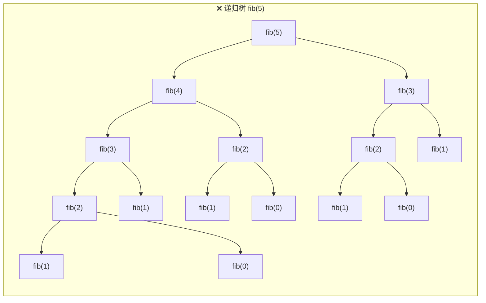
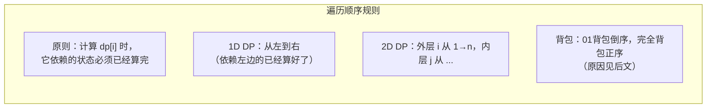

## 前置知识：DP 到底是什么

### 一句话定义

**动态规划（Dynamic Programming）**：把一个大问题拆成**重叠的子问题**，用数组（或哈希表）存中间结果，避免重复计算。

> [!tip] 为什么叫"Dynamic Programming"？
> Richard Bellman 在 1950 年代命名时，故意选了一个听起来高大上的名字来忽悠军方拨款。"Dynamic"表示问题有时序性，"Programming"在当时的意思是"规划/填表"，和写代码没关系。

### DP 三要素

| 要素 | 含义 | 一句话判断 |
|------|------|-----------|
| **最优子结构** | 大问题的最优解包含子问题的最优解 | "从子问题的最优能推出大问题的最优吗？" |
| **重叠子问题** | 不同分支会重复计算同一个子问题 | "递归树里同一个状态被算了好几次？" |
| **状态转移方程** | 子问题之间怎么推导 | "当前状态由哪些前置状态推出？" |

### 一个例子彻底搞懂

**斐波那契数列**：`F(n) = F(n-1) + F(n-2)`，`F(0)=0, F(1)=1`

```python
# ❌ 暴力递归：O(2^n)，指数爆炸
def fib(n):
    if n <= 1:
        return n
    return fib(n-1) + fib(n-2)

# fib(5) 调用 fib(3) 两次，fib(2) 三次……大量重复！

# ✅ 动态规划：O(n)，每个值只算一次
def fib_dp(n):
    if n <= 1:
        return n
    dp = [0] * (n + 1)
    dp[0], dp[1] = 0, 1
    for i in range(2, n + 1):
        dp[i] = dp[i-1] + dp[i-2]
    return dp[n]

# ✅ 空间优化版：O(1)，只保留前两个
def fib_opt(n):
    if n <= 1:
        return n
    prev2, prev1 = 0, 1
    for i in range(2, n + 1):
        cur = prev2 + prev1
        prev2, prev1 = prev1, cur
    return prev1
```



> [!info] 数一数（自检）
> 全树共 **15 个节点**：fib(4)×1、fib(3)×2、fib(2)×3、fib(1)×5、fib(0)×3——`fib(1)` 被重复算了 5 次，这就是 DP 要消除的重复。

> [!warning] DP 不是万能药
> DP 要求问题有**最优子结构**。如果子问题的最优解拼起来不是全局最优，就不能用 DP（比如贪心和回溯的领域）。另外，DP 需要**重叠子问题**——如果每个子问题都互不重叠，那分治法更适合。

### DP 和递归/回溯/贪心的关系

| 方法 | 特征 | 典型题 |
|------|------|--------|
| **递归/回溯** | 暴力穷举所有可能，决策树 | 全排列、N 皇后 |
| **贪心** | 每步选局部最优，不回头 | 跳跃游戏、活动选择 |
| **DP** | 有重叠子问题，用表存结果 | 爬楼梯、背包、编辑距离 |

> [!important] 一句话区分
> **回溯 = 穷举所有方案**（无重叠，或不在乎重叠）；**DP = 存结果避免重复穷举**（有重叠）。
> 如果你画出递归树，发现很多节点长得一样 → 用 DP。如果每个分支都独一无二 → 回溯。

---

## DP 五步法（核心方法论！）

拿到一道 DP 题，按这五步走，缺一不可：

### 步骤 ① 定义状态

**`dp[i]` 代表什么？** 这是最关键的一步，定义错了后面全错。

```python
# 线性 DP 常见定义：
dp[i]     = 以 i 结尾的子问题的解        # 最大子数组和
dp[i]     = 处理前 i 个元素的最优解       # 打家劫舍
dp[i][j]  = 从 i 到 j 这段的最优解       # 区间 DP

# 背包 DP：
dp[i][w]  = 前 i 个物品，容量为 w 时的最大价值
dp[j]     = 容量为 j 时的最大价值（一维优化）
```

> [!tip] 命名技巧
> 状态名要**见名知意**。别只写 `dp`，写成 `dp[i][w]` 或加注释说明维度含义。推荐用有意义的变量名：`maxProfit[i]`、`minCost[i][j]`。

### 步骤 ② 找状态转移方程

**`dp[i]` 怎么从前面推出来？** 问自己三个问题：

1. 当前的"最后一步"有哪些选择？
2. 每个选择对应哪个前置状态？
3. 这些前置状态怎么组合（取 max？求和？取 or？）

```python
# 爬楼梯：最后一步跨 1 级或跨 2 级
dp[i] = dp[i-1] + dp[i-2]

# 打家劫舍：当前屋偷不偷？
dp[i] = max(dp[i-1], dp[i-2] + nums[i])
#       不偷这一家   偷这一家（必须隔一家）

# 最大子数组和：当前数接不接前面？
dp[i] = max(nums[i], dp[i-1] + nums[i])
#       另起炉灶     接在后面
```

### 步骤 ③ 初始化（Base Case）

没有 base case，递推不起来。通常需要初始化 `dp[0]`、`dp[1]` 或第一行/第一列。

```python
# 爬楼梯
dp[0] = 1  # 或者 dp[1]=1, dp[2]=2，看你怎么定义

# 打家劫舍
dp[0] = nums[0]             # 只有一家，偷
dp[1] = max(nums[0], nums[1])  # 两家，偷价值大的

# 网格 DP
dp[0][0] = grid[0][0]       # 起点
dp[i][0] = dp[i-1][0] + ... # 第一列只能从上面来
dp[0][j] = dp[0][j-1] + ... # 第一行只能从左边来
```

### 步骤 ④ 确定遍历顺序

**遍历顺序 = 状态的依赖方向**。画一个 1D/2D 表，箭头从谁指向谁，遍历就从谁开始。



```python
# 线性 DP：i 从小到大
for i in range(1, n):
    dp[i] = ...

# 网格 DP：从左到右、从上到下
for i in range(1, m):
    for j in range(1, n):
        dp[i][j] = ...

# 区间 DP：区间长度从小到大
for length in range(2, n + 1):
    for i in range(n - length + 1):
        j = i + length - 1
        dp[i][j] = ...
```

### 步骤 ⑤ 举例验证

用一个小例子手算一遍，和代码结果比对。发现不一致时，用这招定位：**打印 dp 表**。

```python
# 调试神器：打印 dp 表
def debug_dp(dp, m, n=None):
    if n is None:
        print(" ".join(f"{v:3d}" for v in dp[:m]))
    else:
        for i in range(m):
            print(" ".join(f"{dp[i][j]:3d}" if dp[i][j] != float('inf') else "inf" for j in range(n)))
    print("---")
```

> [!tip] 拿不准时先列转移方程
> 很多人上来就写代码，然后 debug 半天。更好的做法是：**先一句话说清 dp[i] 的含义，再写出递推公式，在纸上画个小例子走一遍，最后才写代码。** 顺序不能乱。

---

## DP 的四大类型

### 类型一：线性 DP

**特征**：状态是一维数组，每个元素依赖前面固定几个位置。

#### 爬楼梯（LeetCode 70）

```python
def climbStairs(n: int) -> int:
    if n <= 2:
        return n
    dp = [0] * (n + 1)
    dp[1], dp[2] = 1, 2
    for i in range(3, n + 1):
        dp[i] = dp[i-1] + dp[i-2]
    return dp[n]

# 空间优化：只需保留前两个
def climbStairs_opt(n: int) -> int:
    if n <= 2:
        return n
    prev2, prev1 = 1, 2
    for i in range(3, n + 1):
        cur = prev2 + prev1
        prev2, prev1 = prev1, cur
    return prev1
```

#### 打家劫舍（LeetCode 198）

```python
def rob(nums):
    if not nums:
        return 0
    n = len(nums)
    if n == 1:
        return nums[0]

    dp = [0] * n
    dp[0] = nums[0]
    dp[1] = max(nums[0], nums[1])

    for i in range(2, n):
        # 偷 i：dp[i-2] + nums[i]  ；不偷 i：dp[i-1]
        dp[i] = max(dp[i-1], dp[i-2] + nums[i])

    return dp[-1]

# 空间优化：O(1)
def rob_opt(nums):
    if not nums:
        return 0
    prev2 = prev1 = 0  # prev2 = dp[i-2], prev1 = dp[i-1]
    for num in nums:
        cur = max(prev1, prev2 + num)
        prev2, prev1 = prev1, cur
    return prev1
```

#### 最大子数组和（LeetCode 53）

```python
def maxSubArray(nums):
    # dp[i] = 以 i 结尾的最大子数组和
    n = len(nums)
    dp = [0] * n
    dp[0] = nums[0]
    ans = dp[0]

    for i in range(1, n):
        dp[i] = max(nums[i], dp[i-1] + nums[i])
        #       另起炉灶    接在后面
        ans = max(ans, dp[i])

    return ans

# 空间优化：只需保留前一个
def maxSubArray_opt(nums):
    cur_max = ans = nums[0]
    for num in nums[1:]:
        cur_max = max(num, cur_max + num)
        ans = max(ans, cur_max)
    return ans
```

---

### 类型二：背包 DP

**特征**：从若干物品中选择，在容量限制下求最优。这是 DP 的皇冠题型。

#### 01背包（每件物品只能选一次）

**问题**：有 `n` 件物品，重量 `weights`，价值 `values`，背包容量 `W`。每件物品最多选一次，求最大总价值。

```python
# ===== 二维版本（便于理解） =====
def knapsack_01_2d(weights, values, W):
    n = len(weights)
    # dp[i][w] = 前 i 件物品，容量为 w 时的最大价值
    dp = [[0] * (W + 1) for _ in range(n + 1)]

    for i in range(1, n + 1):
        w_i = weights[i-1]
        v_i = values[i-1]
        for w in range(1, W + 1):
            if w < w_i:
                dp[i][w] = dp[i-1][w]               # 装不下，不选
            else:
                dp[i][w] = max(dp[i-1][w],           # 不选
                               dp[i-1][w - w_i] + v_i)  # 选
    return dp[n][W]

# ===== 一维优化（面试必写版本！） =====
def knapsack_01(weights, values, W):
    dp = [0] * (W + 1)
    for w_i, v_i in zip(weights, values):
        # ⚠️ 关键：倒序遍历！
        for w in range(W, w_i - 1, -1):
            dp[w] = max(dp[w], dp[w - w_i] + v_i)
    return dp[W]
```

> [!warning] 01背包为什么倒序？
> 正序遍历会导致**同一件物品被多次选取**（变成完全背包）。
> ```python
> # 假设物品重量 3，价值 5，W=6
> # 正序遍历：
> # w=3: dp[3] = max(dp[3], dp[0] + 5) = 5
> # w=6: dp[6] = max(dp[6], dp[3] + 5) = 10  ← 物品被用了两次！
> # dp[3] 已经是更新后的值，它本身包含了这件物品！
>
> # 倒序遍历：
> # w=6: dp[6] = max(dp[6], dp[3] + 5) = 5   ← dp[3] 是上一件物品留下的，安全！
> # w=3: dp[3] = max(dp[3], dp[0] + 5) = 5
> ```
>
> **倒序保证 `dp[w - w_i]` 代表的是"上一件物品"的状态，还没有被当前物品污染。**

#### 完全背包（每件物品可以选无限次）

**问题**：和 01 背包相同，但每件物品不限数量。

```python
# ===== 完全背包（一维优化） =====
def knapsack_complete(weights, values, W):
    dp = [0] * (W + 1)
    for w_i, v_i in zip(weights, values):
        # ⚠️ 关键：正序遍历！
        for w in range(w_i, W + 1):
            dp[w] = max(dp[w], dp[w - w_i] + v_i)
    return dp[W]
```

> [!tip] 完全背包为什么正序？
> 正序遍历允许同一件物品在同一轮中被多次使用——`dp[w - w_i]` 可能已经包含当前物品了，再加一次就是"选两件"。这正是完全背包要的！

#### 01背包 vs 完全背包：一维优化对比

| | 01背包 | 完全背包 |
|---|---|---|
| **每件物品** | 最多选 1 次 | 不限次数 |
| **遍历方向** | `for w in range(W, w_i-1, -1)` **倒序** | `for w in range(w_i, W+1)` **正序** |
| **状态含义** | `dp[w]` = 用**已处理的物品**，容量 w 的最大价值 | 同左 |
| **记忆口诀** | **"0倒1正"**——01倒序，完全正序 |

---

### 背包问题专题（重点！）

#### 组合 vs 排列的遍历顺序区别

这是背包问题中最容易搞混的知识点。

> [!important] 一句话总结
> • **外层物品、内层容量** → **组合数**（物品顺序无关）
> • **外层容量、内层物品** → **排列数**（物品顺序有关）

```python
# 经典例题：零钱兑换 II（LeetCode 518）
# 问：凑成 amount 有几种组合方式？

# ✅ 求组合数：外层 coins，内层容量
def change(amount, coins):
    dp = [0] * (amount + 1)
    dp[0] = 1  # 凑 0 元：什么都不选，也算一种方式
    for coin in coins:                        # ← 先物品
        for w in range(coin, amount + 1):     # ← 后容量
            dp[w] += dp[w - coin]
    return dp[amount]

# 如果换成 外层容量、内层物品，求的就是排列数！
# 此时 {1,2,1} 和 {2,1,1} 算两种不同方式。
def combination_sum_4(amount, nums):
    dp = [0] * (amount + 1)
    dp[0] = 1
    for w in range(1, amount + 1):           # ← 先容量
        for num in nums:                      # ← 后物品
            if w >= num:
                dp[w] += dp[w - num]
    return dp[amount]
```

> [!warning] 为什么顺序决定组合/排列？
>
> **外层物品 → 内层容量**：每个物品只被"考虑加入"一轮。一旦硬币 1 处理完了，后面就再也不会往已有的组合里"插入"硬币 1。所以 `{1,2}` 只能产生 `{1,2}` 这一种顺序。
>
> **外层容量 → 内层物品**：对于每个容量 w，你尝试所有硬币。`dp[3]` 可以来自 `dp[2]+1`，也可以来自 `dp[1]+2`——两条路径到达 `dp[3]` 时选硬币的顺序不同，会分别计为不同的方案。

#### 背包问题的其他常见变体

```python
# ===== 变体 1：求"是否存在"（布尔DP） =====
# 416. 分割等和子集
def canPartition(nums):
    total = sum(nums)
    if total % 2 != 0:
        return False
    target = total // 2
    dp = [False] * (target + 1)
    dp[0] = True
    for num in nums:
        for w in range(target, num - 1, -1):
            dp[w] = dp[w] or dp[w - num]
    return dp[target]

# ===== 变体 2：求"最小值"（完全背包 + 恰好装满） =====
# 322. 零钱兑换
def coinChange(coins, amount):
    dp = [float('inf')] * (amount + 1)
    dp[0] = 0
    for coin in coins:
        for w in range(coin, amount + 1):
            dp[w] = min(dp[w], dp[w - coin] + 1)
    return dp[amount] if dp[amount] != float('inf') else -1
```

---

### 类型三：区间 DP

**特征**：求 `dp[i][j]`（从 i 到 j 这段区间的最优解），通常按**区间长度**从小到大计算。

#### 最长回文子串（LeetCode 5）

```python
def longestPalindrome(s):
    n = len(s)
    if n < 2:
        return s

    # dp[i][j] = s[i..j] 是不是回文串
    dp = [[False] * n for _ in range(n)]
    start, max_len = 0, 1

    # 单个字符都是回文
    for i in range(n):
        dp[i][i] = True

    # 按区间长度从小到大
    for length in range(2, n + 1):
        for i in range(n - length + 1):
            j = i + length - 1
            if s[i] == s[j]:
                if length == 2:
                    dp[i][j] = True
                else:
                    dp[i][j] = dp[i+1][j-1]
                if dp[i][j] and length > max_len:
                    start, max_len = i, length
            else:
                dp[i][j] = False

    return s[start:start + max_len]
```

#### 戳气球（LeetCode 312）

```python
def maxCoins(nums):
    # 核心思想：倒过来想——最后一个戳破的气球是谁？
    # dp[i][j] = 戳破开区间 (i, j) 内所有气球的最大金币
    nums = [1] + nums + [1]  # 两端加虚拟气球
    n = len(nums)
    dp = [[0] * n for _ in range(n)]

    for length in range(2, n):          # 区间长度（至少 3 才能放气球）
        for i in range(n - length):
            j = i + length
            for k in range(i + 1, j):   # 枚举 k 是 (i, j) 中最后一个戳破的
                coins = nums[i] * nums[k] * nums[j]
                dp[i][j] = max(dp[i][j], dp[i][k] + coins + dp[k][j])

    return dp[0][n-1]
```

---

### 类型四：二维 DP / 网格 DP

**特征**：状态是二维数组，通常代表网格中的某个位置。

#### 不同路径（LeetCode 62）

```python
def uniquePaths(m, n):
    dp = [[1] * n for _ in range(m)]  # 第一行和第一列都是 1（边界）

    for i in range(1, m):
        for j in range(1, n):
            dp[i][j] = dp[i-1][j] + dp[i][j-1]
            # 从上边来 + 从左边来

    return dp[-1][-1]
```

#### 最小路径和（LeetCode 64）

```python
def minPathSum(grid):
    m, n = len(grid), len(grid[0])
    dp = [[0] * n for _ in range(m)]
    dp[0][0] = grid[0][0]

    # 初始化第一列
    for i in range(1, m):
        dp[i][0] = dp[i-1][0] + grid[i][0]
    # 初始化第一行
    for j in range(1, n):
        dp[0][j] = dp[0][j-1] + grid[0][j]

    for i in range(1, m):
        for j in range(1, n):
            dp[i][j] = min(dp[i-1][j], dp[i][j-1]) + grid[i][j]

    return dp[-1][-1]
```

#### 编辑距离（LeetCode 72）—— 经典二维 DP

```python
def minDistance(word1, word2):
    m, n = len(word1), len(word2)
    # dp[i][j] = word1 前 i 个字符 → word2 前 j 个字符的最少操作数
    dp = [[0] * (n + 1) for _ in range(m + 1)]

    # 边界：空串 → 另一个串，只能插入
    for i in range(m + 1):
        dp[i][0] = i
    for j in range(n + 1):
        dp[0][j] = j

    for i in range(1, m + 1):
        for j in range(1, n + 1):
            if word1[i-1] == word2[j-1]:
                dp[i][j] = dp[i-1][j-1]          # 末位相同，不动
            else:
                dp[i][j] = min(
                    dp[i-1][j],     # 删除 word1[i-1]
                    dp[i][j-1],     # word1 末尾插入 word2[j-1]
                    dp[i-1][j-1]    # 替换 word1[i-1]
                ) + 1

    return dp[m][n]
```

> [!tip] 编辑距离为什么难？
> 因为**三种操作方向不同**。画个表格，给每个格子标上"从哪个方向来"，就清晰了：
> • 左上方：替换（或匹配不操作）
> • 上方：删除 word1 字符
> • 左方：插入（在 word1 末尾插入 word2 字符）

---

## 记忆化搜索 vs 递推 DP

两种写法都能解决 DP 问题，本质是同一套状态转移的两种实现方式。

```python
# ===== 示例：最长递增子序列（LeetCode 300）=====

# 写法一：记忆化搜索（自顶向下）
def lengthOfLIS_memo(nums):
    n = len(nums)
    memo = [[-1] * (n + 1) for _ in range(n)]
    # 每次调用递归函数时，检查之前是否计算过

    def dfs(i, prev_idx):  # 当前考虑 nums[i]，上一个选的索引是 prev_idx
        if i == n:
            return 0
        if memo[i][prev_idx + 1] != -1:
            return memo[i][prev_idx + 1]

        # 不选 nums[i]
        skip = dfs(i + 1, prev_idx)
        # 选 nums[i]（如果能选）
        take = 0
        if prev_idx == -1 or nums[i] > nums[prev_idx]:
            take = 1 + dfs(i + 1, i)

        memo[i][prev_idx + 1] = max(skip, take)
        return memo[i][prev_idx + 1]

    return dfs(0, -1)

# 写法二：递推 DP（自底向上）
def lengthOfLIS_dp(nums):
    n = len(nums)
    dp = [1] * n  # dp[i] = 以 i 结尾的 LIS 长度
    for i in range(n):
        for j in range(i):
            if nums[j] < nums[i]:
                dp[i] = max(dp[i], dp[j] + 1)
    return max(dp)
```

> [!important] 记忆化搜索 vs 递推 DP 对比

| | 记忆化搜索 | 递推 DP |
|---|---|---|
| **实现方式** | 递归 + 备忘录 | 迭代 + 数组 |
| **思维方向** | 自顶向下（从大问题"要"子问题的结果） | 自底向上（从小问题"推"出大问题） |
| **空间** | 可能更大（递归栈 + memo） | 通常更省 |
| **何时用** | 状态太多，不确定依赖顺序时 | 能确定遍历顺序时 |
| **容易 debug** | ✅ 可以把递归树画出来 | ❌ 出错了得打表看 |
| **面试推荐** | 先写出来，再优化为递推 | 递推写法更受面试官青睐 |

> [!tip] 面试技巧
> 如果你对递推的遍历顺序不自信，**先用记忆化搜索写出来**（不容易出错），确认逻辑正确后，再改写为递推版本展示优化能力。

---

## 新手练习路线图

> [!important] 练习策略
> 按顺序刷，前面的题是后面题的基础。每道题先自己定义 dp[i] 含义，列出转移方程，手写一个小例子验证，最后再写代码。

```
阶段 1️⃣  线性 DP 入门（建立"状态转移"直觉）
  ├── 70.  爬楼梯                      ← 最最简单的 DP
  ├── 509. 斐波那契数                   ← 同上，理解"重叠子问题"
  ├── 746. 使用最小花费爬楼梯           ← 加了一点变体
  └── 53.  最大子数组和                ← 经典 Kadane

阶段 2️⃣  线性 DP 进阶
  ├── 198. 打家劫舍                    ← 经典"选或不选"
  ├── 213. 打家劫舍 II                 ← 环形数组处理
  ├── 300. 最长递增子序列              ← LIS，经典 O(n^2)
  └── 152. 乘积最大子数组              ← 注意负数，需要保持两个状态

阶段 3️⃣  背包 DP（必须吃透！）
  ├── 416. 分割等和子集                ← 01背包的"是否存在"变体
  ├── 494. 目标和                      ← 难一点的 01背包
  ├── 322. 零钱兑换                    ← 完全背包"求最小值"
  ├── 518. 零钱兑换 II                 ← 完全背包"求组合数"
  └── 377. 组合总和 Ⅳ                 ← 完全背包"求排列数"

阶段 4️⃣  网格 / 二维 DP
  ├── 62.  不同路径                    ← 网格入门
  ├── 63.  不同路径 II                 ← 加障碍物
  ├── 64.  最小路径和                  ← 经典网格 DP
  └── 221. 最大正方形                  ← 二维 dp，稍难

阶段 5️⃣  字符串 DP / 经典题
  ├── 72.  编辑距离                    ← 必刷经典
  ├── 1143. 最长公共子序列             ← LCS
  ├── 5.   最长回文子串               ← 区间 DP 入门
  ├── 516. 最长回文子序列             ← 区间 DP 变体
  └── 139. 单词拆分                    ← DP + 字符串

阶段 6️⃣  综合提升
  ├── 312. 戳气球                      ← 区间 DP 经典
  ├── 121. 买卖股票的最佳时机          ← 开始接触状态 DP（见 [[状态机基础与通用解题框架]]）
  ├── 123. 买卖股票 III                ← 多维 DP
  └── 188. 买卖股票 IV                 ← 股票通用解
```

---

## 常见易错点

> [!warning] **坑 1：dp 数组大小写错**
> ```python
> # ❌ 常见错误：少开了一位
> dp = [0] * n          # 如果定义 dp[i] 需要用到 dp[0]..dp[n]
> # ✅
> dp = [0] * (n + 1)    # 推荐把 dp[0] 留给 base case
> ```
> 建议统一从 1 开始编号：`dp[i]` 代表"前 i 个元素"，这样 `dp[0]` 就是空集的 base case。不过要注意原数组索引要对应 `nums[i-1]`。

> [!warning] **坑 2：初始化值搞错**
> ```python
> # 求最大值 → 初始化为 -inf（或 0，看场景）
> dp = [float('-inf')] * n
> dp[0] = ...
>
> # 求最小值 → 初始化为 +inf
> dp = [float('inf')] * (amount + 1)
> dp[0] = 0
>
> # 求方案数 → 初始化为 0，但 dp[0] = 1（"什么都不选"是一种方案）
> dp = [0] * (target + 1)
> dp[0] = 1
> ```
> 用错初始化值会让所有转移都算错。

> [!warning] **坑 3：背包一维优化方向搞反**
> ```python
> # 01背包 → 倒序！
> for num in nums:
>     for w in range(target, num - 1, -1):
>         dp[w] = max(dp[w], dp[w - num] + ...)
>
> # 完全背包 → 正序！
> for coin in coins:
>     for w in range(coin, amount + 1):
>         dp[w] = min(dp[w], dp[w - coin] + ...)
> ```
> **"0倒1正"**——01倒序，完全正序。如果你把方向搞反了，01 背包会变成完全背包，完全背包会只用一次。

> [!warning] **坑 4：遍历顺序错误导致结果含义改变**
> ```python
> # 求组合数：先物品，后容量
> for coin in coins:
>     for w in range(coin, amount + 1):
>         dp[w] += dp[w - coin]
>
> # 求排列数：先容量，后物品
> for w in range(1, amount + 1):
>     for coin in coins:
>         if w >= coin:
>             dp[w] += dp[w - coin]
> ```
> **先物品后容量 = 组合，先容量后物品 = 排列。** 这是很多人的翻车点。

> [!warning] **坑 5：二维 dp 忘记处理边界**
> ```python
> # 网格 DP 中，第一行和第一列必须单独初始化
> # ❌ 直接从 (1,1) 开始循环，忘了 (0,j) 和 (i,0)
> for i in range(1, m):
>     for j in range(1, n):
>         dp[i][j] = ...
>
> # ✅ 先初始化第一行和第一列
> dp[0][0] = grid[0][0]
> for i in range(1, m):
>     dp[i][0] = dp[i-1][0] + grid[i][0]
> for j in range(1, n):
>     dp[0][j] = dp[0][j-1] + grid[0][j]
> ```

> [!warning] **坑 6：区间 DP 的循环顺序**
> ```python
> # ✅ 正确：按区间长度从小到大
> for length in range(2, n + 1):
>     for i in range(n - length + 1):
>         j = i + length - 1
>         dp[i][j] = ...
>
> # ❌ 错误：i 从 0 到 n，j 从 0 到 n
> # 这样 dp[i][j] 需要用到 dp[i+1][j-1] 时，后者可能还没算！
> ```

---

## 相关笔记

- [[回溯基础与通用解题框架]] — 回溯是"穷举所有可能"的暴力方法，DP 是"有选择性记忆"的优化方法
- [[贪心基础与通用解题框架]] — 贪心每步选最优且不回头，DP 则需要穷举所有选择取最优
- [[状态机基础与通用解题框架]] — 买卖股票系列是状态 DP 的经典应用
- [[排列组合基础与通用解题框架]] — 排列组合的穷举模板，与 DP 求组合数/排列数呼应
- [[图论基础与通用解题框架]] — DAG 上的 DP 与图的拓扑排序相关
