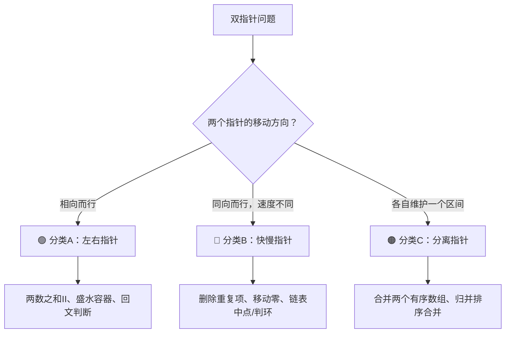
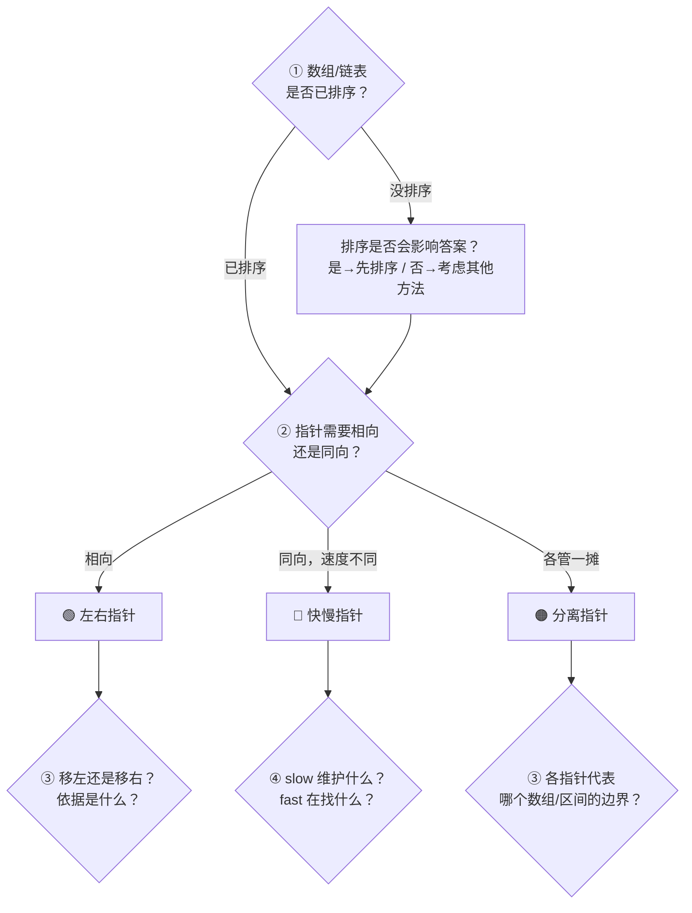

## 前置知识：双指针到底是什么

### 一个朴素的动机：为什么需要两个指针

很多数组/链表问题，最暴力的想法是两层循环：

```python
# 暴力：找两数之和 = target，O(n²)
for i in range(len(nums)):
    for j in range(i + 1, len(nums)):
        if nums[i] + nums[j] == target:
            return [i, j]
```

双指针的本质就是：**用两个巧妙移动的索引，把内层循环干掉**。

```
暴力：   i→         j→→→→→→   （j 每次都从头扫）
双指针:  left→  ←right         （两个指针各走一遍，不相干）
```

> [!important] 一句话定义
> **双指针 = 两个变量在数组/链表上按规则移动，协同完成一次遍历，将 O(n²) 降为 O(n)。**

### 双指针的物理直觉

把数组想成一条数轴：

```
索引:  0   1   2   3   4   5   6
数值: [2,  7, 11, 15, 18, 22, 30]
        ↑                   ↑
       left               right
```

- `left` 从左往右走
- `right` 从右往左走
- 每一步根据当前两个值的计算结果，决定移动 left 还是 right

**核心权衡**：每一步你都有两个选择（移左边还是移右边），但根据**单调性**你能排除一个选项——这就是"不用回退"的关键。

---

## 三大分类

双指针不是"一种技巧"，而是**三种不同移动模式**的统称。拿到题先判断属于哪一类，然后套对应模板。



---

## 🟢 分类A：左右指针（相向而行）

### 特征识别

- 两个指针初始在**两端**，向中间移动
- 前提：数组**有序**（或排序后不影响答案）
- 每一步根据条件决定移左还是移右

### 通用模板

```python
# ====== 模板 A：左右指针（相向而行） ======
def two_pointers_opposite(nums, target):
    left, right = 0, len(nums) - 1          # ① 初始化：两端

    while left < right:                     # ② 条件：未相遇
        current = nums[left] + nums[right]  # ③ 计算当前值

        if current == target:               # ④ 找到答案
            return [left, right]
        elif current < target:              # ⑤ 太小 → 左指针右移
            left += 1
        else:                               # ⑥ 太大 → 右指针左移
            right -= 1

    return [-1, -1]                         # ⑦ 未找到
```

> [!tip] 关键心法
> **左右指针的每一步都在"排除不可能的解"。** `current < target` 意味着 nums[left] 跟谁都凑不够，所以 left 可以安心右移——因为 right 左边的数更小，更不可能。

### 真题示例

**167. 两数之和 II - 输入有序数组**

```python
def twoSum(numbers, target):
    left, right = 0, len(numbers) - 1
    while left < right:
        s = numbers[left] + numbers[right]
        if s == target:
            return [left + 1, right + 1]   # 题目要求 1-indexed
        elif s < target:
            left += 1
        else:
            right -= 1
    return [-1, -1]
```

**11. 盛最多水的容器**

```python
def maxArea(height):
    left, right = 0, len(height) - 1
    ans = 0
    while left < right:
        h = min(height[left], height[right])
        ans = max(ans, h * (right - left))
        # 核心决策：谁矮谁移动——因为矮的那边是瓶颈
        if height[left] < height[right]:
            left += 1
        else:
            right -= 1
    return ans
```

**125. 验证回文串**

```python
def isPalindrome(s):
    left, right = 0, len(s) - 1
    while left < right:
        # 跳过非字母数字
        while left < right and not s[left].isalnum():
            left += 1
        while left < right and not s[right].isalnum():
            right -= 1
        if s[left].lower() != s[right].lower():
            return False
        left += 1
        right -= 1
    return True
```

### 适用题目一览

| 题号 | 题目 | 移动决策依据 |
|------|------|-------------|
| 167 | 两数之和 II | 和 vs target |
| 15 | 三数之和 | 固定一个 + 左右指针 |
| 11 | 盛最多水的容器 | 谁矮移谁 |
| 125 | 验证回文串 | 字符是否相等 |
| 345 | 反转字符串中的元音字母 | 两边找元音交换 |
| 977 | 有序数组的平方 | 两端绝对值更大者先放入 |

---

## 🔵 分类B：快慢指针（同向而行，速度不同）

### 特征识别

- 两个指针都从左往右走，但**速度不同**
- 快指针负责"探索"，慢指针负责"写入"或"标记"
- 常用于**原地修改数组**和**链表**操作

### 通用模板

```python
# ====== 模板 B：快慢指针（同向，速度不同） ======
def fast_slow_pointers(nums):
    slow = 0                                 # ① 慢指针：指向"已处理区"末尾

    for fast in range(len(nums)):            # ② 快指针：扫描每个元素
        if nums[fast] 满足某条件:             # ③ 条件判断
            nums[slow] = nums[fast]          # ④ 写入/交换
            slow += 1                        # ⑤ 慢指针前进

    return slow                               # ⑥ slow = 有效长度
```

> [!tip] 核心思想
> **`[0, slow)` 区间 = 已经处理好的元素。** 快指针 `fast` 遍历原数组，发现符合条件的元素就塞到 `slow` 位置，然后 `slow++`。最终 `slow` 就是新数组的长度。

### 真题示例

**26. 删除有序数组中的重复项**

```python
def removeDuplicates(nums):
    if not nums:
        return 0
    slow = 0                                  # [0, slow] 是不重复区
    for fast in range(1, len(nums)):
        if nums[fast] != nums[slow]:          # 发现新元素
            slow += 1
            nums[slow] = nums[fast]           # 搬到 slow 位置
    return slow + 1                            # slow 是索引，+1 是长度
```

**27. 移除元素**

```python
def removeElement(nums, val):
    slow = 0
    for fast in range(len(nums)):
        if nums[fast] != val:                 # 不等于 val 才保留
            nums[slow] = nums[fast]
            slow += 1
    return slow
```

**283. 移动零**

```python
def moveZeroes(nums):
    slow = 0
    for fast in range(len(nums)):
        if nums[fast] != 0:
            nums[slow], nums[fast] = nums[fast], nums[slow]  # 交换
            slow += 1
```

### 链表中的快慢指针

```python
# ====== 链表: 快慢指针找中点 ======
def findMiddle(head):
    slow = fast = head
    while fast and fast.next:
        slow = slow.next       # 慢指针走 1 步
        fast = fast.next.next  # 快指针走 2 步
    return slow                # fast 到末尾时 slow 恰在中点
```

```python
# ====== 链表: 快慢指针判环 ======
def hasCycle(head):
    slow = fast = head
    while fast and fast.next:
        slow = slow.next
        fast = fast.next.next
        if slow == fast:       # 相遇 = 有环
            return True
    return False
```

> [!important] 快慢指针的核心区别
> | | 数组快慢指针 | 链表快慢指针 |
> |---|---|---|
> | **干什么** | 原地去重/移除/移动元素 | 找中点/判环/找环入口 |
> | **slow 含义** | 已处理区边界 | 慢指针当前位置 |
> | **fast 含义** | 遍历扫描 | 快指针当前位置 |
> | **关系** | slow <= fast（速度不一定差两倍） | fast = 2x slow |
> | **判环关键** | 不适用 | 如果有环，fast 必追上 slow |

---

## 🟠 分类C：分离指针（各自维护一个区间）

### 特征识别

- 两个指针分别遍历**两个不同的数组**，或同一个数组的**两个已处理区域**
- 常用于**合并**操作
- 核心是 `while p1 < len1 and p2 < len2`

### 通用模板

```python
# ====== 模板 C：分离指针（合并两个有序结构） ======
def merge_two(arr1, arr2):
    p1, p2 = 0, 0                           # ① 各指各的数组头
    result = []

    while p1 < len(arr1) and p2 < len(arr2): # ② 两者都有元素
        if arr1[p1] <= arr2[p2]:             # ③ 谁小放谁
            result.append(arr1[p1])
            p1 += 1
        else:
            result.append(arr2[p2])
            p2 += 1

    # ④ 收尾：把剩余的全部追加
    while p1 < len(arr1):
        result.append(arr1[p1])
        p1 += 1
    while p2 < len(arr2):
        result.append(arr2[p2])
        p2 += 1

    return result
```

### 真题示例

**88. 合并两个有序数组**

```python
def merge(nums1, m, nums2, n):
    # 逆序填充，从后往前——因为 nums1 尾部有空位
    p1, p2 = m - 1, n - 1
    tail = m + n - 1

    while p1 >= 0 and p2 >= 0:
        if nums1[p1] > nums2[p2]:
            nums1[tail] = nums1[p1]
            p1 -= 1
        else:
            nums1[tail] = nums2[p2]
            p2 -= 1
        tail -= 1

    # 收尾：nums1 左侧不动，只需要处理 nums2 剩余
    while p2 >= 0:
        nums1[tail] = nums2[p2]
        p2 -= 1
        tail -= 1
```

**21. 合并两个有序链表**

```python
def mergeTwoLists(l1, l2):
    dummy = ListNode(0)       # 哨兵节点，避免判空
    cur = dummy

    while l1 and l2:
        if l1.val <= l2.val:
            cur.next = l1
            l1 = l1.next
        else:
            cur.next = l2
            l2 = l2.next
        cur = cur.next

    # 收尾：把剩余的直接接上
    cur.next = l1 if l1 else l2
    return dummy.next
```

### 分离指针的变体：划分区间

```python
# ====== 分离指针变体：荷兰国旗问题（三指针分区） ======
def sortColors(nums):
    p0, p2 = 0, len(nums) - 1    # p0: 0 的右边界, p2: 2 的左边界
    i = 0                         # 扫描指针

    while i <= p2:
        if nums[i] == 0:
            nums[i], nums[p0] = nums[p0], nums[i]
            p0 += 1
            i += 1
        elif nums[i] == 2:
            nums[i], nums[p2] = nums[p2], nums[i]
            p2 -= 1               # ⚠️ i 不自增，因为换过来的还没检查
        else:
            i += 1
```

---

## 拿到题，先问自己

在套任何模板之前，用下面四个问题快速定位：



> [!tip] 口诀
> **"相向看两端，同向看快慢，合并各管各。"**

### 更具体的决策表

| 题目特征 | 选哪类 | 例子 |
|----------|--------|------|
| "两数之和""三数之和""盛水" | 🟢 左右指针 | 167, 15, 11 |
| "回文""反转" | 🟢 左右指针 | 125, 345 |
| "原地删除重复""移除特定值" | 🔵 数组快慢指针 | 26, 27, 80 |
| "移动零""调整顺序" | 🔵 数组快慢指针 | 283 |
| "链表中点""链表判环" | 🔵 链表快慢指针 | 876, 141, 142 |
| "合并两个有序数组/链表" | 🟠 分离指针 | 88, 21 |
| "归并排序合并阶段" | 🟠 分离指针 | 归并排序 |
| "颜色分类""三路划分" | 🟠 分离指针变体 | 75 |
| "两个数组的交集" | 🟠 分离指针 | 349, 350 |

---

## 新手练习路线图

> [!important] 练习策略
> 每道题先判断属于哪个分类 → 默写对应模板骨架 → 填业务逻辑。顺序很重要，不要跳！

```
阶段 1️⃣  左右指针入门（最直观）
  ├── 167. 两数之和 II               ← 理解"相向而行"和"单调性"
  ├── 125. 验证回文串                ← 理解"跳过无关字符"
  └── 345. 反转字符串中的元音字母     ← 巩固左右指针

阶段 2️⃣  左右指针进阶
  ├── 11. 盛最多水的容器             ← 理解"谁矮移谁"的贪心决策
  ├── 15. 三数之和                   ← 固定一个 + 左右指针 + 去重
  ├── 977. 有序数组的平方            ← 左右指针变体（从两端放入）
  └── 18. 四数之和                   ← 固定两个 + 左右指针

阶段 3️⃣  数组快慢指针
  ├── 26. 删除有序数组中的重复项      ← 理解 [0, slow) 不变量
  ├── 27. 移除元素                   ← 巩固
  ├── 283. 移动零                    ← 交换版快慢指针
  └── 80. 删除有序数组中的重复项 II   ← 允许最多两个重复

阶段 4️⃣  链表快慢指针
  ├── 876. 链表的中间节点            ← 理解快慢指针速度差
  ├── 141. 环形链表                  ← 判环（必背）
  ├── 142. 环形链表 II               ← 找环入口（公式推导）
  └── 234. 回文链表                  ← 找中点 + 翻转 + 比较

阶段 5️⃣  分离指针
  ├── 88. 合并两个有序数组           ← 逆序填充
  ├── 21. 合并两个有序链表           ← 哨兵节点
  ├── 349. 两个数组的交集            ← 排序 + 分离指针
  └── 75. 颜色分类                   ← 三指针（荷兰国旗）
```

---

## 常见易错点

> [!warning] **坑 1：while 循环条件写错**
> ```python
> # ❌ 左右指针用 while left <= right
> #   left == right 时只有一个元素，没必要比
> 
> # ✅ 正确
> while left < right:
> ```
> 特例：三数之和的左右指针也是 `while left < right`。

> [!warning] **坑 2：指针移动时机搞反**
> ```python
> # 两数之和 II
> # ❌ 和太大 → 移左指针（错！左指针右移和更大）
> if s > target:
>     left += 1
> 
> # ✅ 和太大 → 移右指针（右指针左移和变小）
> if s > target:
>     right -= 1
> ```
> 判断依据：数组有序，`left` 右移 → 和增大，`right` 左移 → 和减小。

> [!warning] **坑 3：快慢指针中 slow 和 fast 的含义混淆**
> ```python
> # 删除重复项
> # ❌ 比较 nums[fast] 和 nums[fast - 1]（没有利用 slow 的语义）
> if nums[fast] != nums[fast - 1]:
> 
> # ✅ 比较 nums[fast] 和 nums[slow]（slow 指向已处理区的最后一个）
> if nums[fast] != nums[slow]:
>     slow += 1
>     nums[slow] = nums[fast]
> ```
> `slow` 始终指向"已确认不重复的最后一个元素"——这才是正确的不变量。

> [!warning] **坑 4：链表快慢指针没有判空**
> ```python
> # ❌ 直接用 fast.next.next，可能空指针
> while slow != fast:
>     slow = slow.next
>     fast = fast.next.next          # 💥 fast.next 可能为 None
> 
> # ✅ 必须在 while 条件中判空
> while fast and fast.next:
>     slow = slow.next
>     fast = fast.next.next
> ```

> [!warning] **坑 5：分离指针忘了收尾**
> ```python
> # ❌ 主循环结束后直接 return
> while p1 < m and p2 < n:
>     ...
> return result          # 可能漏掉了一边的元素！
> 
> # ✅ 必须追加剩余元素
> while p1 < m:
>     result.append(arr1[p1]); p1 += 1
> while p2 < n:
>     result.append(arr2[p2]); p2 += 1
> ```

> [!warning] **坑 6：双指针去重时漏掉跳过逻辑**
> ```python
> # 三数之和中，找到一个解后必须跳过重复值
> # ❌ 找到解后直接移动指针
> left += 1
> 
> # ✅ 跳过所有重复值
> while left < right and nums[left] == nums[left + 1]:
>     left += 1
> while left < right and nums[right] == nums[right - 1]:
>     right -= 1
> left += 1
> right -= 1
> ```

---

## 三种分类对比速查表

| | 🟢 左右指针 | 🔵 快慢指针 | 🟠 分离指针 |
|---|---|---|---|
| **移动方向** | 相向（两端→中间） | 同向（slow ≤ fast） | 各自独立 |
| **典型操作** | 二分查找的变形 | 原地覆盖/链表遍历 | 合并/划分 |
| **时间复杂度** | O(n) | O(n) | O(m + n) |
| **空间复杂度** | O(1) | O(1) | O(1) 或 O(m + n) |
| **前提条件** | 数组有序 | 无 | 两个数组各自有序 |
| **口诀** | "两头堵" | "追及问题" | "谁小谁先走" |
| **循环条件** | `while left < right` | `for fast in range(n)` | `while p1 < n1 and p2 < n2` |
| **一句话** | 首尾夹逼 | 快探慢写 | 双路归并 |

---

## 双指针 vs 滑动窗口

很多新手分不清，这里做一次彻底区分：

| 维度 | 双指针 | 滑动窗口 |
|------|--------|----------|
| **指针角色** | 两个独立角色（快/慢，左/右） | 左右边界共同定义一个区间 |
| **维护的是什么** | 两个位置（元素关系） | 一个区间（连续子数组/子串） |
| **典型场景** | 找两个元素满足条件 | 找一个区间满足条件 |
| **是否要求连续** | 通常不关心连续性 | 必须连续 |
| **例子** | 两数之和（不连续也行） | 无重复字符最长子串（必须连续） |

> [!tip] 快速区分
> 问自己：**"我关心的是两个元素，还是连续一段？"**
> • 两个元素 → 双指针
> • 连续一段 → [[滑动窗口基础与通用解题框架|滑动窗口]]

---

## 相关题目索引

| 题号 | 题目 | 分类 | 难度 |
|------|------|------|------|
| 167 | 两数之和 II - 输入有序数组 | 🟢 左右指针 | 简单 |
| 15 | 三数之和 | 🟢 左右指针 | 中等 |
| 11 | 盛最多水的容器 | 🟢 左右指针 | 中等 |
| 125 | 验证回文串 | 🟢 左右指针 | 简单 |
| 345 | 反转字符串中的元音字母 | 🟢 左右指针 | 简单 |
| 977 | 有序数组的平方 | 🟢 左右指针 | 简单 |
| 26 | 删除有序数组中的重复项 | 🔵 快慢指针 | 简单 |
| 27 | 移除元素 | 🔵 快慢指针 | 简单 |
| 80 | 删除有序数组中的重复项 II | 🔵 快慢指针 | 中等 |
| 283 | 移动零 | 🔵 快慢指针 | 简单 |
| 876 | 链表的中间节点 | 🔵 链表快慢指针 | 简单 |
| 141 | 环形链表 | 🔵 链表快慢指针 | 简单 |
| 142 | 环形链表 II | 🔵 链表快慢指针 | 中等 |
| 234 | 回文链表 | 🔵 链表快慢指针 | 简单 |
| 88 | 合并两个有序数组 | 🟠 分离指针 | 简单 |
| 21 | 合并两个有序链表 | 🟠 分离指针 | 简单 |
| 349 | 两个数组的交集 | 🟠 分离指针 | 简单 |
| 350 | 两个数组的交集 II | 🟠 分离指针 | 简单 |
| 75 | 颜色分类 | 🟠 分离指针变体 | 中等 |

---

## 相关笔记

- [[数组基础与通用解题框架]] — 数组的遍历、排序、原地修改
- [[链表基础与通用解题框架]] — 链表的快慢指针、反转、合并
- [[滑动窗口基础与通用解题框架]] — 窗口的本质是"双指针维护的连续区间"
- [[排序基础与通用解题框架]] — 归并排序的合并阶段就是分离指针
- [[二分查找基础与通用解题框架]] — 左右指针在有序数组上的特化
