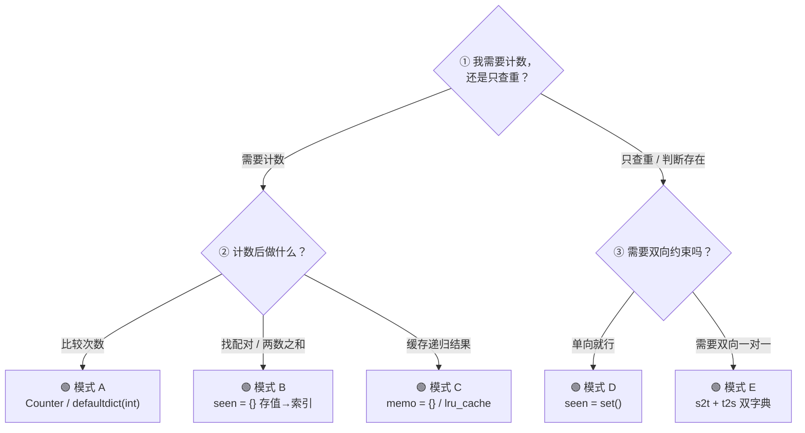

## 前置知识：哈希表到底是什么

### 键值对 —— 世界上最快的一对一映射

哈希表（Hash Table）本质是一个**超级快查表**：你给它一个 `key`，它立刻还你一个 `value`。

```
传统数组查找： "第 3 个元素是什么？" → arr[3] → O(1)
哈希表查找：   "key='张三' 对应的值是什么？" → hash['张三'] → O(1)

关键在于：把任意类型的 key（字符串、数字、元组）通过哈希函数
转化为数组下标，从而实现 O(1) 随机访问。
```

### 哈希函数：把 key 变成数组下标

```python
# 哈希函数的核心工作
def simple_hash(key, array_size):
    return hash(key) % array_size
    # hash("张三") → 某个大整数 → % 100 → 落在 0~99 之间
```

哈希函数必须满足：
- **确定性**：同一个 `key` 永远映射到同一个下标
- **均匀性**：尽量把不同 `key` 分散到不同下标（减少冲突）
- **高效性**：计算必须快

### 冲突解决：当两个 key 抢同一个下标

不同的 key 算出同一个下标 → 冲突（Collision）。两种主流解决方案：

```
方案 A：拉链法（Chaining）—— Java HashMap 采用
─────────────────────────────────────────────────
数组每个槽位挂一个链表（或红黑树），冲突的键值对都挂在一起。

下标 0:  [ ] → ("张三", 90) → ("李四", 85)
下标 1:  [ ] → ("王五", 95)
下标 2:  [ ] → ("赵六", 88) → ("钱七", 92)

查找时：先找到下标，再遍历链表找具体 key
```

```
方案 B：开放寻址法（Open Addressing）—— CPython dict 采用
─────────────────────────────────────────────────
冲突了就往后找下一个空位。

下标 0: ("张三", 90)
下标 1: ("王五", 95)
下标 2: ("李四", 85)  ← 本该在下标 0，冲突后顺延到 2
```

> [!info] Python dict 的进化
> CPython dict 属于**方案 B 开放寻址**（探测序列 + 空槽标记），不是拉链法。Python 3.6+ 的紧凑 dict 是**稠密 entries 数组 + 稀疏索引数组**的结构：哈希表只存指向 entries 的索引，内存减少 20-25%，同时保持插入顺序——但冲突时仍在稀疏索引表里探测下一空位，仍然不是链表。

### 为什么是 O(1)？

```
理想情况下，平均每个槽位 1 个元素 → 一次到位。
最坏情况下，所有 key 冲突到同一个槽 → O(n)（退化链表）。
但好的哈希函数 + 动态扩容 → 均摊 O(1)。
```

---

## Python 中的哈希表

### dict：键值对存储

```python
# 创建
d = {}                    # 空字典
d = {'a': 1, 'b': 2}     # 直接初始化
d = dict(a=1, b=2)       # 关键字参数

# 核心 O(1) 操作
d['c'] = 3               # 插入/更新
val = d['a']             # 查找（key 不存在 → KeyError）
val = d.get('a', 0)      # 安全查找，不存在返回默认值
d.pop('a')               # 删除并返回值
del d['a']               # 删除
'a' in d                 # 存在判断 → True/False
len(d)                   # 键值对数量

# 遍历
for key in d:            # 遍历 key
for key, val in d.items():  # 遍历 key + value
for val in d.values():   # 遍历 value
```

### set：只存 key，不存 value

```python
# 创建
s = set()                # 空集合（不能用 {}，那是空字典！）
s = {1, 2, 3}            # 直接初始化

# 核心 O(1) 操作
s.add(4)                 # 添加元素
s.remove(4)              # 删除（不存在 → KeyError）
s.discard(4)             # 安全删除（不存在不报错）
4 in s                   # 存在判断 → True/False
len(s)                   # 元素数量
```

> [!warning] 关键选择：dict vs set
>
> | 场景 | 用什么 | 为什么 |
> |------|--------|--------|
> | 需要计数 | `dict` / `Counter` | key=元素, value=出现次数 |
> | 只需判断存在 | `set` | 不需要 value，更省内存 |
> | 需要映射关系 | `dict` | key→value 的一对一关系 |
> | 去重 | `set` | 最简单：`list(set(arr))` |

### collections 模块：三个必知工具

```python
from collections import Counter, defaultdict, OrderedDict

# Counter：计数器（继承自 dict）
cnt = Counter("abracadabra")
# Counter({'a': 5, 'b': 2, 'r': 2, 'c': 1, 'd': 1})
cnt.most_common(2)  # [('a', 5), ('b', 2)]  — top K

# defaultdict：带默认值的字典
d = defaultdict(int)      # 默认值 0
d = defaultdict(list)     # 默认值 []
d = defaultdict(set)      # 默认值 set()
d['a'] += 1               # 不用检查 key 是否存在！

# OrderedDict：保持插入顺序（Python 3.7+ 普通 dict 已有序）
```

---

## 五大核心解题模式

### 模式 A：频率统计 / 计数

**一眼认出**：题目问"出现次数""多数元素""第一个不重复的字符""异位词"。

```python
# ====== 模式 A 骨架：频率统计 ======
from collections import Counter, defaultdict

# 方案 1：Counter（最简洁）
def solve_with_counter(arr):
    cnt = Counter(arr)
    # 用 cnt[key] 获取出现次数

# 方案 2：手动 defaultdict
def solve_with_defaultdict(arr):
    cnt = defaultdict(int)
    for x in arr:
        cnt[x] += 1
    # 用 cnt[key] 获取出现次数

# 方案 3：普通 dict（需要判断 key 是否存在）
def solve_with_dict(arr):
    cnt = {}
    for x in arr:
        cnt[x] = cnt.get(x, 0) + 1
```

> [!example] 示例：242. 有效的字母异位词
> ```python
> def isAnagram(s: str, t: str) -> bool:
>     from collections import Counter
>     return Counter(s) == Counter(t)
> ```

> [!example] 示例：387. 字符串中的第一个唯一字符
> ```python
> def firstUniqChar(s: str) -> int:
>     from collections import Counter
>     cnt = Counter(s)
>     for i, ch in enumerate(s):
>         if cnt[ch] == 1:
>             return i
>     return -1
> ```

> [!example] 示例：169. 多数元素（摩尔投票是进阶解法）
> ```python
> def majorityElement(nums):
>     from collections import Counter
>     cnt = Counter(nums)
>     return max(cnt, key=cnt.get)  # 返回出现次数最多的 key
> ```

**对应题目**：

| 题号 | 题目 | 关键操作 |
|------|------|---------|
| 242 | 有效的字母异位词 | Counter 比较 |
| 49 | 字母异位词分组 | 计数 → 元组做 key |
| 387 | 第一个唯一字符 | 计数 + 遍历找次数=1 |
| 169 | 多数元素 | 计数找最大值 |
| 383 | 赎金信 | 计数比较 |

---

### 模式 B：快速查找 / 两数之和（空间换时间）

**一眼认出**：题目问"是否存在两个元素之和 / 之差等于某个值""找重复"。

核心思想：**把暴力 O(n^2) 的双重循环，降为 O(n) 的单次遍历 + O(1) 查找。**

```python
# ====== 模式 B 骨架：用哈希表存储「已遍历元素」 ======
def two_sum_pattern(arr, target):
    seen = {}  # {值: 索引} 或 {值: 出现次数}

    for i, num in enumerate(arr):
        complement = target - num  # 需要的配对值

        if complement in seen:     # 哈希表 O(1) 查找
            return [seen[complement], i]

        seen[num] = i              # 记录当前值
    return None
```

> [!important] 核心逻辑
> 每走一步，问自己："我需要找的那个数，在前面出现过吗？"
> 把"前面所有数"扔进哈希表 → 每次 O(1) 查询 → 总共 O(n)。

> [!example] 示例：1. 两数之和
> ```python
> def twoSum(nums, target):
>     seen = {}
>     for i, num in enumerate(nums):
>         comp = target - num
>         if comp in seen:
>             return [seen[comp], i]
>         seen[num] = i
> ```

> [!example] 示例：217. 存在重复元素
> ```python
> def containsDuplicate(nums):
>     seen = set()
>     for n in nums:
>         if n in seen:
>             return True
>         seen.add(n)
>     return False
> # 更简洁：return len(set(nums)) < len(nums)
> ```

**对应题目**：

| 题号 | 题目 | 哈希表存什么 |
|------|------|-------------|
| 1 | 两数之和 | `{值: 索引}` |
| 217 | 存在重复元素 | `set()` |
| 219 | 存在重复元素 II | `{值: 最近索引}` |
| 454 | 四数相加 II | `{a+b的和: 次数}` |

---

### 模式 C：缓存 / 记忆化（Memoization）

**一眼认出**：题目有重叠子问题——递归过程中同样的参数被重复计算。

```python
# ====== 模式 C 骨架：用字典缓存计算结果 ======
def memoize_pattern(func):
    cache = {}  # {输入参数: 计算结果}

    def wrapper(n):
        if n in cache:           # ① 已经算过 → 直接返回
            return cache[n]

        result = func(n)          # ② 没算过 → 计算
        cache[n] = result         # ③ 存起来
        return result

    return wrapper

# Python 内置装饰器
from functools import lru_cache
```

> [!example] 示例：509. 斐波那契数（记忆化递归）
> ```python
> def fib(n):
>     memo = {0: 0, 1: 1}
>
>     def dfs(k):
>         if k in memo:
>             return memo[k]
>         memo[k] = dfs(k - 1) + dfs(k - 2)
>         return memo[k]
>
>     return dfs(n)
>
> # 或用 lru_cache：
> from functools import lru_cache
>
> @lru_cache(None)
> def fib(n):
>     if n < 2:
>         return n
>     return fib(n - 1) + fib(n - 2)
> ```

> [!example] 示例：70. 爬楼梯
> ```python
> def climbStairs(n):
>     from functools import lru_cache
>
>     @lru_cache(None)
>     def dfs(remaining):
>         if remaining <= 1:
>             return 1
>         return dfs(remaining - 1) + dfs(remaining - 2)
>
>     return dfs(n)
> ```

> [!tip] 记忆化 vs DP
> 记忆化是**自顶向下**（递归 + 缓存），DP 是**自底向上**（循环填表）。
> 两者本质相同：**用空间换时间，避免重复计算。**
> 面试中先写记忆化版本（思路更自然），再根据要求改写 DP。

**对应题目**：

| 题号 | 题目 | 缓存什么 |
|------|------|---------|
| 509 | 斐波那契数 | `fib(n) 的值` |
| 70 | 爬楼梯 | `dfs(n) 的值` |
| 322 | 零钱兑换 | `对于金额 amount 的最少硬币数` |
| 139 | 单词拆分 | `s[i:] 是否可以拆分` |

---

### 模式 D：哈希集合去重 / 存在判断

**一眼认出**：题目需要"判断某元素是否出现过""去重""查找是否存在"。

```python
# ====== 模式 D 骨架：用 set 做快速存在判断 ======
def set_pattern(arr):
    seen = set()

    for x in arr:
        if x in seen:         # O(1) 判断
            # 重复了，做点什么
            pass
        seen.add(x)           # O(1) 记录
```

> [!example] 示例：141. 环形链表（用 set 判重）
> ```python
> def hasCycle(head):
>     seen = set()
>     cur = head
>     while cur:
>         if cur in seen:     # 之前见过这个节点 → 有环
>             return True
>         seen.add(cur)
>         cur = cur.next
>     return False
> # 注：最优解是快慢指针（O(1)空间），但 set 版更直观
> ```

> [!example] 示例：128. 最长连续序列
> ```python
> def longestConsecutive(nums):
>     num_set = set(nums)       # 去重 + O(1) 查找
>     max_len = 0
>
>     for n in num_set:
>         if n - 1 not in num_set:   # 只从序列起点开始数
>             cur = n
>             cur_len = 1
>             while cur + 1 in num_set:
>                 cur += 1
>                 cur_len += 1
>             max_len = max(max_len, cur_len)
>
>     return max_len
> ```

**对应题目**：

| 题号 | 题目 | set 的用途 |
|------|------|-----------|
| 217 | 存在重复元素 | 判断重复 |
| 141 | 环形链表 | 记录访问过的节点 |
| 128 | 最长连续序列 | O(1) 判断元素是否存在 |
| 202 | 快乐数 | 检测循环 |
| 349 | 两个数组的交集 | 取交集 |

---

### 模式 E：映射关系建立

**一眼认出**：题目要建立**两个集合之间的一对一映射**——每个 a 只能对应一个 b，反之亦然。

```python
# ====== 模式 E 骨架：双字典建立双向映射 ======
def mapping_pattern(s, t):
    s2t = {}  # s 的元素 → t 的元素
    t2s = {}  # t 的元素 → s 的元素（如果需要双向约束）

    for a, b in zip(s, t):
        # 检查 a 是否已经被映射到另一个 b
        if a in s2t and s2t[a] != b:
            return False
        # 检查 b 是否已经被另一个 a 映射
        if b in t2s and t2s[b] != a:
            return False

        s2t[a] = b
        t2s[b] = a

    return True
```

> [!example] 示例：205. 同构字符串
> ```python
> def isIsomorphic(s: str, t: str) -> bool:
>     s2t, t2s = {}, {}
>     for a, b in zip(s, t):
>         if (a in s2t and s2t[a] != b) or (b in t2s and t2s[b] != a):
>             return False
>         s2t[a] = b
>         t2s[b] = a
>     return True
> ```

> [!example] 示例：290. 单词规律
> ```python
> def wordPattern(pattern: str, s: str) -> bool:
>     words = s.split()
>     if len(pattern) != len(words):
>         return False
>
>     p2w, w2p = {}, {}
>     for p, w in zip(pattern, words):
>         if (p in p2w and p2w[p] != w) or (w in w2p and w2p[w] != p):
>             return False
>         p2w[p] = w
>         w2p[w] = p
>     return True
> ```

> [!tip] 为什么需要双向映射？
> `s2t` 确保 "a 只映射到一个 b"，`t2s` 确保 "不同的 a 不会映射到同一个 b"。
> 只用一个字典无法检查后者。例如 `egg → add` 是 OK 的，但 `foo → bar` 不是——因为 `o→r` 和 `o→a` 冲突。

**对应题目**：

| 题号 | 题目 | 映射关系 |
|------|------|---------|
| 205 | 同构字符串 | 字符 ↔ 字符 |
| 290 | 单词规律 | 字符 ↔ 单词 |
| 890 | 查找和替换模式 | 字符 ↔ 字符 |

---

## 拿到题，先问自己



> [!tip] 三问定位法
> **Q1**: 需要计数字典还是查重集合？
> **Q2**: key 是什么？（元素本身、差值的补数、索引？）
> **Q3**: value 是什么？（出现次数、索引、映射的目标？）

---

## 新手练习路线图

> [!important] 练习策略
> 哈希表是最常用的数据结构，几乎每道题都会遇到。建议按模式掌握，而不是刷题号。

```
阶段 1️⃣  基本操作熟练（模式 A + D）
  ├── 242. 有效的字母异位词         ← 理解 Counter
  ├── 349. 两个数组的交集           ← 理解 set 交并差
  ├── 217. 存在重复元素             ← 理解 set 判重
  ├── 387. 第一个唯一字符           ← 计数 + 遍历
  └── 169. 多数元素                 ← Counter 找最大值

阶段 2️⃣  空间换时间（模式 B）
  ├── 1. 两数之和                   ← 经典中的经典
  ├── 202. 快乐数                   ← set 检测循环
  └── 454. 四数相加 II             ← 分组 + 哈希表

阶段 3️⃣  映射与记忆化（模式 C + E）
  ├── 205. 同构字符串               ← 双字典映射
  ├── 290. 单词规律                 ← 同构变体
  ├── 509. 斐波那契数               ← 记忆化入门
  └── 70. 爬楼梯                   ← 记忆化DP

阶段 4️⃣  综合应用
  ├── 49. 字母异位词分组           ← 计数元组做 key
  ├── 128. 最长连续序列            ← set + 只从起点数
  ├── 146. LRU 缓存                ← OrderedDict / 双向链表+哈希
  └── 380. O(1) 时间插入删除随机   ← dict + list 组合
```

---

## 常见易错点

> [!warning] **坑 1：可变对象不能做 key**
> ```python
> # ❌ 列表是可变的，不能做 key
> d = {[1, 2]: "value"}  # TypeError: unhashable type: 'list'
>
> # ✅ 转成不可变类型
> d = {tuple([1, 2]): "value"}  # OK
>
> # ✅ 字母异位词分组常用技巧
> key = tuple(sorted(s))        # 排序后的元组做 key
> ```

> [!warning] **坑 2：defaultdict 的默认值副作用**
> ```python
> from collections import defaultdict
>
> # ❌ 直接访问不存在的 key 也会创建条目！
> d = defaultdict(int)
> if d['a'] == 0:    # 此时 d 里已经多了一个 'a': 0！
>     pass
>
> # ✅ 判断存在时用 in
> if 'a' in d:       # 不会意外创建
>     pass
>
> # ⚠️ defaultdict(list) 尤其需要注意——每个不存在 key 都会创建空列表
> d = defaultdict(list)
> for x in [1, 1, 2]:
>     d[x].append(x)   # first time: d[1] = [] ; second time: d[1] = [1]
> ```

> [!warning] **坑 3：遍历时修改字典**
> ```python
> # ❌ RuntimeError: dictionary changed size during iteration
> for key in d:
>     if some_condition:
>         del d[key]
>
> # ✅ 先收集要删的 key，再统一删
> to_delete = [k for k, v in d.items() if some_condition]
> for k in to_delete:
>     del d[k]
>
> # ✅ 或用 list() 拷贝一份 key 列表
> for key in list(d.keys()):
>     if some_condition:
>         del d[key]
> ```

> [!warning] **坑 4：`{}` 是空字典不是空集合**
> ```python
> # ❌ 想创建空集合
> s = {}       # 这是 dict！不是 set！
> type(s)      # <class 'dict'>
>
> # ✅ 正确创建空集合
> s = set()    # 这才是 set
> ```

> [!warning] **坑 5：set 的元素也必须可哈希**
> ```python
> # ❌ 列表不能放进 set
> s = {[1, 2], [3, 4]}  # TypeError
>
> # ✅ 转元组
> s = {(1, 2), (3, 4)}
> ```

---

## 相关题目索引

| 题号 | 题目 | 模式 | 核心技巧 |
|------|------|------|---------|
| 1 | 两数之和 | B | `{值: 索引}` + 互补查找 |
| 49 | 字母异位词分组 | A + E | 计数元组 / sorted 做 key |
| 128 | 最长连续序列 | D | set + 只从起点数 |
| 146 | LRU 缓存 | C | 双向链表 + 哈希表 |
| 169 | 多数元素 | A | Counter |
| 202 | 快乐数 | D | set 检测循环 |
| 205 | 同构字符串 | E | 双字典双向映射 |
| 217 | 存在重复元素 | D | set |
| 219 | 存在重复元素 II | B | `{值: 最近索引}` |
| 242 | 有效的字母异位词 | A | Counter 比较 |
| 290 | 单词规律 | E | 双字典 |
| 349 | 两个数组的交集 | D | set 交集 |
| 383 | 赎金信 | A | Counter |
| 387 | 第一个唯一字符 | A | 计数 + 遍历 |
| 454 | 四数相加 II | B | 分组 + 哈希表 |
| 509 | 斐波那契数 | C | 记忆化 |
| 70 | 爬楼梯 | C | 记忆化 |
| 380 | O(1) 插入删除随机 | 综合 | dict + list |
| 560 | 和为 K 的子数组 | B | 前缀和 + `{前缀和: 次数}` |

---

## 哈希表时间复杂度速查

| 操作 | dict | set | 备注 |
|------|------|-----|------|
| 插入 | O(1) 均摊 | O(1) 均摊 | 最坏 O(n)，但极少发生 |
| 删除 | O(1) 均摊 | O(1) 均摊 | |
| 查找 | O(1) 均摊 | O(1) 均摊 | `key in dict` 也是 O(1) |
| 遍历 | O(n) | O(n) | |
| 空间 | O(n) | O(n) | |

---

## 相关笔记

- [[二叉树基础与通用解题框架]] — 二叉树遍历中常用哈希表做记忆化
- [[栈基础与通用解题框架]] — 单调栈配合哈希表使用
- [[队列基础与通用解题框架]] — BFS 用 set 记录 visited
- [[双指针基础与通用解题框架]] 与 [[滑动窗口基础与通用解题框架]] — 滑动窗口常配合哈希表做频率统计
- [[前缀和基础与通用解题框架]] — 前缀和 + 哈希表是经典组合
