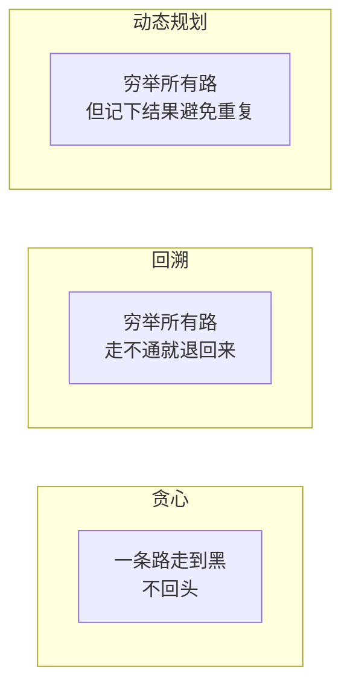
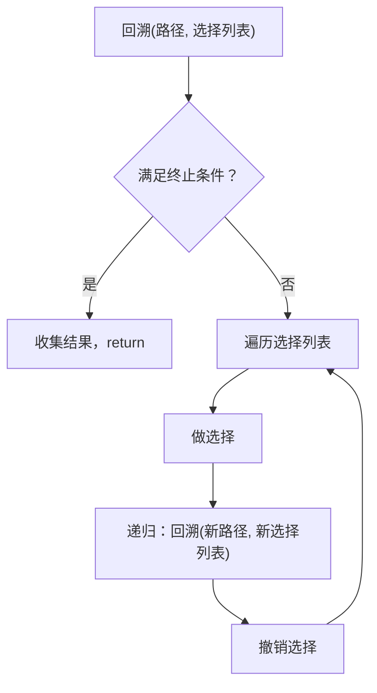
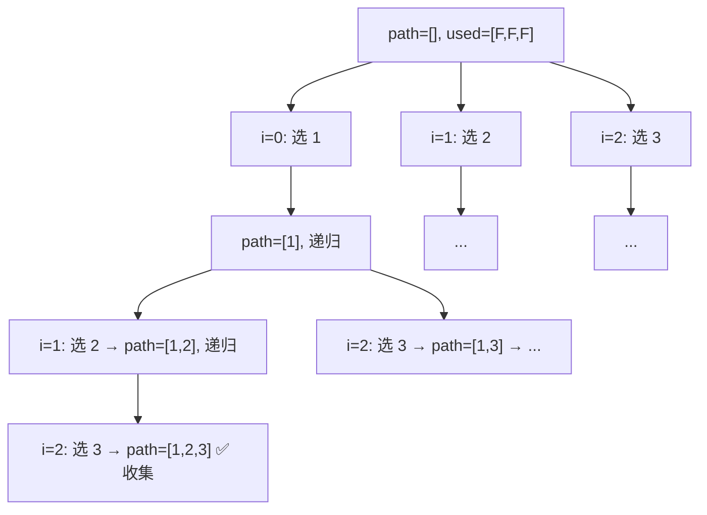
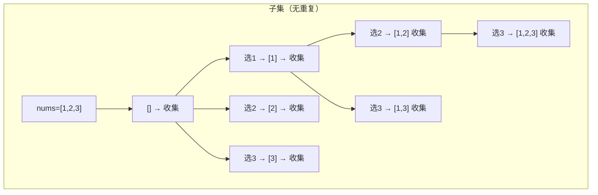
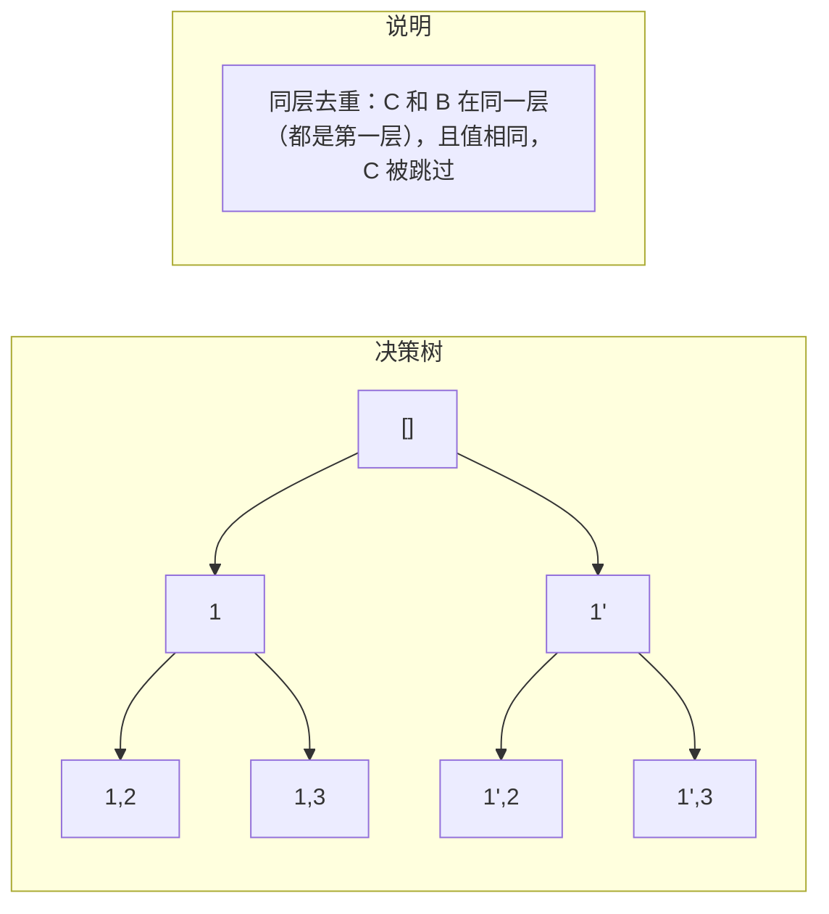

## 前置知识：回溯到底是什么

### 穷举所有可能 + 剪枝优化

回溯算法（Backtracking）本质上是一种**深度优先的穷举搜索**。它把问题的解空间看成一棵树，在树上做 DFS，遇到不满足条件的路径就**提前返回（剪枝）**，避免无意义的搜索。

```
回溯 = DFS + 撤销
    = "做选择 → 递归 → 撤销选择"
    = 遍历决策树的每一条路径
```

> [!info] 现实类比
> 你在迷宫中找出口。每到一个岔路口：
>  ① 
>  ② 
>  ③ 
>
> 回溯的"回"字，说的就是**回到岔路口，换一条路**。

### 回溯 vs 动态规划 vs 贪心



| | 回溯 | 动态规划 | 贪心 |
|------|------|---------|------|
| **决策** | 穷举所有选择 | 穷举所有选择 | 只做一种选择 |
| **重叠子问题** | 可能有，但不做优化 | 必须有（否则 DP 没必要） | 不关心 |
| **最优子结构** | 不需要 | 需要 | 需要 + 贪心选择性质 |
| **典型问题** | 全排列、组合、N 皇后 | 背包、LCS、编辑距离 | 区间调度、跳跃游戏 |

---

## 回溯三要素

每道回溯题，先想清楚这三件事：

| 要素 | 含义 | 在代码中的体现 |
|------|------|---------------|
| **路径** | 已经做出的选择 | `path` 列表，递归参数 |
| **选择列表** | 当前还可以做哪些选择 | `for 选择 in 选择列表` |
| **终止条件** | 什么时候该停下，收集结果 | `if 满足条件: result.append(拷贝)` |



> [!tip] 拿到回溯题，先填三个空
>  ① 
>  ② 
>  ③ 

---

## 万能回溯模板（核心！）

```python
def backtrack(路径, 选择列表):
    if 满足终止条件:
        收集结果              # ⚠️ 必须拷贝路径！result.append(list(path))
        return

    for 选择 in 选择列表:
        # 可选：剪枝判断
        if 不满足约束条件:
            continue           # 提前跳过，不递归

        做选择                 # path.append(选择) 或 修改状态
        backtrack(路径, 新的选择列表)
        撤销选择               # path.pop() 或 恢复状态
```

> [!important] 这个模板能解决 90% 的回溯题
> 排列、组合、子集、棋盘问题都是这个模板的变体。区别只在于**选择列表如何定义**和**如何剪枝去重**。

---

## 四大经典回溯题型

### 一、排列问题 — 用 `used` 数组去重

**特征**：顺序有关，`[1,2]` 和 `[2,1]` 是不同的解。每个元素只能使用一次。

#### 题型 A：全排列（46）

```python
def permute(nums):
    result = []
    path = []
    used = [False] * len(nums)   # 标记哪些元素已经用过

    def backtrack():
        if len(path) == len(nums):
            result.append(list(path))   # ⚠️ 拷贝！
            return

        for i in range(len(nums)):
            if used[i]:                # ① 跳过已使用的元素
                continue
            used[i] = True             # ② 做选择
            path.append(nums[i])
            backtrack()                # ③ 递归
            path.pop()                 # ④ 撤销选择
            used[i] = False

    backtrack()
    return result
```



#### 题型 B：含重复数字的全排列（47）

```python
def permuteUnique(nums):
    result = []
    path = []
    used = [False] * len(nums)
    nums.sort()                   # ① 先排序！让相同元素相邻

    def backtrack():
        if len(path) == len(nums):
            result.append(list(path))
            return

        for i in range(len(nums)):
            if used[i]:
                continue

            # ② 去重核心：跳过"前一个相同元素未使用"的情况
            if i > 0 and nums[i] == nums[i - 1] and not used[i - 1]:
                continue

            used[i] = True
            path.append(nums[i])
            backtrack()
            path.pop()
            used[i] = False

    backtrack()
    return result
```

> [!important] 排列去重的关键一行
> ```python
> if i > 0 and nums[i] == nums[i-1] and not used[i-1]:
>     continue
> ```
> **含义**：如果当前元素和前一个相同，且前一个**还没被使用**，说明前一个已经在同层被选过了（之后又被撤销了），当前这个在同一位置的选择就是重复的。
>
> 如果把条件写成 `used[i-1]`（不加 not），也能去重，但效率较低（在树枝层面而非树层层面去重）。**`not used[i-1]` 是更高效的做法**。

---

### 二、组合问题 — 用 `start` 参数去重

**特征**：顺序无关，`[1,2]` 和 `[2,1]` 是同一个解。每个元素只能使用一次。

#### 题型 A：组合（77）

```python
def combine(n, k):
    """从 1..n 中选 k 个数，返回所有组合"""
    result = []
    path = []

    def backtrack(start):
        if len(path) == k:
            result.append(list(path))
            return

        for i in range(start, n + 1):    # ① 从 start 开始，不回头
            path.append(i)
            backtrack(i + 1)              # ② 下一层从 i+1 开始
            path.pop()

    backtrack(1)
    return result
```

> [!tip] `start` 参数 = 组合去重的灵魂
> 排列用 `used` 数组区分"哪些元素用过"，组合用 `start` 参数确保"只往后选，不往前看"。这样 `[1,2]` 只会被生成一次（1→2），不会生成 `[2,1]`（2 不会再回头选 1）。

#### 题型 B：组合总和（39）— 可重复使用

```python
def combinationSum(candidates, target):
    """每个数字可以无限次使用（但组合不能重复）"""
    result = []
    path = []
    candidates.sort()    # 排序便于剪枝

    def backtrack(start, remaining):
        if remaining == 0:
            result.append(list(path))
            return
        if remaining < 0:
            return

        for i in range(start, len(candidates)):
            # 剪枝：如果当前值已经超过剩余目标，后面的更大，全跳过
            if candidates[i] > remaining:
                break

            path.append(candidates[i])
            backtrack(i, remaining - candidates[i])   # ⚠️ 还是 i，不是 i+1
            path.pop()

    backtrack(0, target)
    return result
```

> [!important] 可重复 vs 不可重复的区别
> | 场景 | `start` 传递 | 含义 |
> |------|-------------|------|
> | 每个数只能用一次（77, 40） | `backtrack(i + 1, ...)` | 下一层从下一个元素开始 |
> | 每个数可以无限用（39） | `backtrack(i, ...)` | 下一层还可以选同一个元素 |

#### 题型 C：组合总和 II（40）— 含重复元素

```python
def combinationSum2(candidates, target):
    """每个数字只能用一次，且 candidates 有重复"""
    result = []
    path = []
    candidates.sort()

    def backtrack(start, remaining):
        if remaining == 0:
            result.append(list(path))
            return

        for i in range(start, len(candidates)):
            if candidates[i] > remaining:
                break

            # 去重：跳过同层相邻相同元素
            if i > start and candidates[i] == candidates[i - 1]:
                continue

            path.append(candidates[i])
            backtrack(i + 1, remaining - candidates[i])
            path.pop()

    backtrack(0, target)
    return result
```

> [!warning] 组合去重 vs 排列去重
> | | 排列（47） | 组合（40） |
> |---|---|---|
> | 去重条件 | `i>0 and nums[i]==nums[i-1] and not used[i-1]` | `i>start and nums[i]==nums[i-1]` |
> | 区别 | 需要 `used` 辅助，因为排列可以回头选 | 只需 `i > start`，因为 `start` 已经保证不回头 |
> | 排序 | 必须 | 必须 |

---

### 三、子集问题 — 排序 + 跳过相邻相同

**特征**：收集决策树上的**每个节点**（而不是只收集叶子）。`[1,2]` 的子集有 `[], [1], [2], [1,2]`。

#### 题型 A：子集（78）

```python
def subsets(nums):
    """不含重复元素，求所有子集"""
    result = []
    path = []

    def backtrack(start):
        result.append(list(path))    # ① ⚠️ 每个节点都收集！不是只在叶子收集

        for i in range(start, len(nums)):
            path.append(nums[i])
            backtrack(i + 1)
            path.pop()

    backtrack(0)
    return result
```

> [!important] 子集 vs 组合的本质区别
> • **组合**：只在叶子节点收集（`len(path) == k` 时）
> • **子集**：在**每个节点**都收集（递归入口就 `result.append`）
>
> 除此之外，代码结构完全一样。

#### 题型 B：含重复子集（90）

```python
def subsetsWithDup(nums):
    """含重复元素，求无重复的子集"""
    result = []
    path = []
    nums.sort()                       # ① 排序让相同元素相邻

    def backtrack(start):
        result.append(list(path))

        for i in range(start, len(nums)):
            # ② 跳过同层相邻相同元素
            if i > start and nums[i] == nums[i - 1]:
                continue

            path.append(nums[i])
            backtrack(i + 1)
            path.pop()

    backtrack(0)
    return result
```



---

### 四、棋盘问题 — N 皇后 + 解数独

#### 题型 A：N 皇后（51）

```python
def solveNQueens(n):
    result = []
    # board[i] = j 表示第 i 行皇后在第 j 列
    board = [-1] * n

    def is_valid(row, col):
        for r in range(row):
            # 同列 或 同对角线
            if board[r] == col or abs(board[r] - col) == row - r:
                return False
        return True

    def backtrack(row):
        if row == n:
            # 构造棋盘表示
            chessboard = []
            for i in range(n):
                line = ['.'] * n
                line[board[i]] = 'Q'
                chessboard.append(''.join(line))
            result.append(chessboard)
            return

        for col in range(n):
            if not is_valid(row, col):
                continue              # 剪枝：不合法位置直接跳过
            board[row] = col
            backtrack(row + 1)
            board[row] = -1           # 撤销（可省略，因为会被覆盖）

    backtrack(0)
    return result
```

> [!tip] N 皇后本质上也是回溯
> • **路径**：`board[0..row-1]` 已经放置的皇后位置
> • **选择列表**：当前行的所有列
> • **终止条件**：`row == n`，所有行都放完了

#### 题型 B：解数独（37）

```python
def solveSudoku(board):
    """原地修改 board"""
    def is_valid(row, col, num):
        # 检查行
        for j in range(9):
            if board[row][j] == num:
                return False
        # 检查列
        for i in range(9):
            if board[i][col] == num:
                return False
        # 检查 3x3 宫格
        start_row, start_col = (row // 3) * 3, (col // 3) * 3
        for i in range(start_row, start_row + 3):
            for j in range(start_col, start_col + 3):
                if board[i][j] == num:
                    return False
        return True

    def backtrack():
        for i in range(9):
            for j in range(9):
                if board[i][j] != '.':
                    continue
                for num in '123456789':
                    if not is_valid(i, j, num):
                        continue
                    board[i][j] = num
                    if backtrack():
                        return True     # 找到解，逐层返回
                    board[i][j] = '.'   # 撤销
                return False            # 1-9 都不行，回溯
        return True                     # 所有格子都填完了

    backtrack()
```

> [!important] 数独的回溯只有一种选择：选了就一路到底
> 与排列/组合不同，数独只需要找到**一个**解。所以 `backtrack()` 返回 `bool`，一旦找到就逐层 `return True` 终止搜索。

---

## 剪枝技巧详解

### 技巧 1：排序后剪枝

```python
# candidates.sort() 后，如果 candidates[i] > remaining，
# 则 candidates[i+1..] 都 > remaining，直接 break
for i in range(start, len(candidates)):
    if candidates[i] > remaining:
        break           # 不是 continue！后面的更大，全跳过
```

### 技巧 2：visited / used 去重

```python
# 排列问题：用 used 数组标记哪些元素已选
# 优点：O(1) 判断，比 `if x in path` 的 O(n) 快
used = [False] * n
```

### 技巧 3：start 去重（组合/子集）

```python
# start 参数的核心作用：保证选择顺序固定
# 对于 [1,2,3]：
#   start=1 意味着只能从 2,3 选（1 已经被考虑过了）
# 这样 [1,2] 和 [2,1] 只有前者会被生成
```

### 技巧 4：同层去重 vs 同枝去重

```python
# 同层去重（推荐，效率高）：跳过同一层中相邻的相同元素
if i > start and nums[i] == nums[i - 1]:
    continue

# 同枝去重（也可以，效率低）：允许同一树枝上使用相同值
# 但同一层中前一个相同元素如果被用过就跳过
if i > 0 and nums[i] == nums[i - 1] and used[i - 1]:
    continue
```



---

## 新手练习路线图

> [!important] 练习策略
> 先默写万能模板，再针对每种题型练习对应的去重方式。排列 / 组合 / 子集是三大核心，搞懂它们的去重区别，回溯就拿下了。

```
阶段 1️⃣  排列问题（掌握 used 数组）
  ├── 46. 全排列                      ← 回溯入门教科书
  └── 47. 全排列 II                   ← 去重技巧

阶段 2️⃣  组合问题（掌握 start 参数）
  ├── 77. 组合                        ← 组合基础模板
  ├── 39. 组合总和                     ← 可重复使用元素
  └── 40. 组合总和 II                  ← 含重复 + 去重

阶段 3️⃣  子集问题（掌握每个节点收集）
  ├── 78. 子集                        ← 子集基础
  └── 90. 子集 II                     ← 含重复子集去重

阶段 4️⃣  分割 + 综合
  ├── 131. 分割回文串                  ← 分割 = 变相组合
  ├── 17. 电话号码的字母组合            ← 多集合组合
  └── 216. 组合总和 III                ← 固定长度组合

阶段 5️⃣  棋盘问题
  ├── 51. N 皇后                      ← 经典约束满足
  └── 37. 解数独                      ← 二维回溯
```

---

## 常见易错点

> [!warning] **坑 1：排列 vs 组合的去重方式完全不同**
>
> ```python
> # 排列去重（47）：用 used 数组 + 相邻相同判断
> if i > 0 and nums[i] == nums[i-1] and not used[i-1]:
>     continue
> 
> # 组合/子集去重（40/90）：用 start + 相邻相同判断
> if i > start and nums[i] == nums[i-1]:
>     continue
> ```
>
> **原因**：排列可以回头选前面的元素，需要 `used` 来区分"哪个在前面出现过"；
> 组合不能回头（靠 `start` 保证），所以只需要 `i > start` 来判断同层。

> [!warning] **坑 2：收集结果时必须拷贝 `path`**
> ```python
> # ❌ 错误
> result.append(path)       # path 后面还会被修改！最终 result 里全是空列表
>
> # ✅ 正确
> result.append(list(path)) # 创建一个副本
> result.append(path[:])    # 切片也创建副本
> ```
> 原因：`path` 是可变对象，在整个回溯过程中一直在 `append` 和 `pop`。如果直接存引用，最终所有引用都指向已经清空的同一个 list。

> [!warning] **坑 3：回溯恢复不完整**
> ```python
> # ❌ 忘记恢复 used 状态
> used[i] = True
> path.append(nums[i])
> backtrack()
> path.pop()
> # 忘了 used[i] = False  ← BUG！
>
> # ✅ 做选择时改了什么，撤销时就恢复什么
> used[i] = True
> path.append(nums[i])
> backtrack()
> path.pop()
> used[i] = False
> ```
> 口诀：**做什么改什么，撤销时对称恢复**。

> [!warning] **坑 4：剪枝条件写成 `continue` 还是 `break`**
> ```python
> # 如果数组已排序，且 candidates[i] > remaining：
> # ✅ 用 break（后面的更大，全都不行）
> if candidates[i] > remaining:
>     break
>
> # ✅ 用 continue（后面可能还有小的）
> if not is_valid(row, col):
>     continue    # 这一列不行，换下一列
> ```
> 判断标准：剪枝后，**后面的元素是否还有可能满足条件**？如果没可能，用 `break`；如果有，用 `continue`。

> [!warning] **坑 5：`start` 参数到底传 `i` 还是 `i+1`**
> 
> | 传什么 | 含义 | 典型题 |
> |--------|------|--------|
> | `i + 1` | 每个元素只能用一次 | 77. 组合, 40. 组合总和 II, 78. 子集 |
> | `i` | 同一个元素可以重复使用 | 39. 组合总和 |
> 
> 想清楚：下一层递归还能不能选当前这个元素？

> [!warning] **坑 6：子集问题忘了在递归入口收集结果**
> ```python
> def backtrack(start):
>     result.append(list(path))    # ⚠️ 子集必须在开头收集！
>     for i in range(start, len(nums)):
>         ...
> ```
> 组合/排列只在叶子收集；子集要在**每个节点**（包括空集 `[]`）都收集。

---

## 相关笔记

- [[DFS深度优先搜索基础与通用解题框架]] — 回溯本质是 DFS 的一种应用
- [[递归基础与通用解题框架]] — 递归是回溯的基础功
- [[排列组合基础与通用解题框架]] — 排列/组合/子集的更多变体
- [[动态规划基础与通用解题框架]] — 什么时候回溯不行该换 DP
