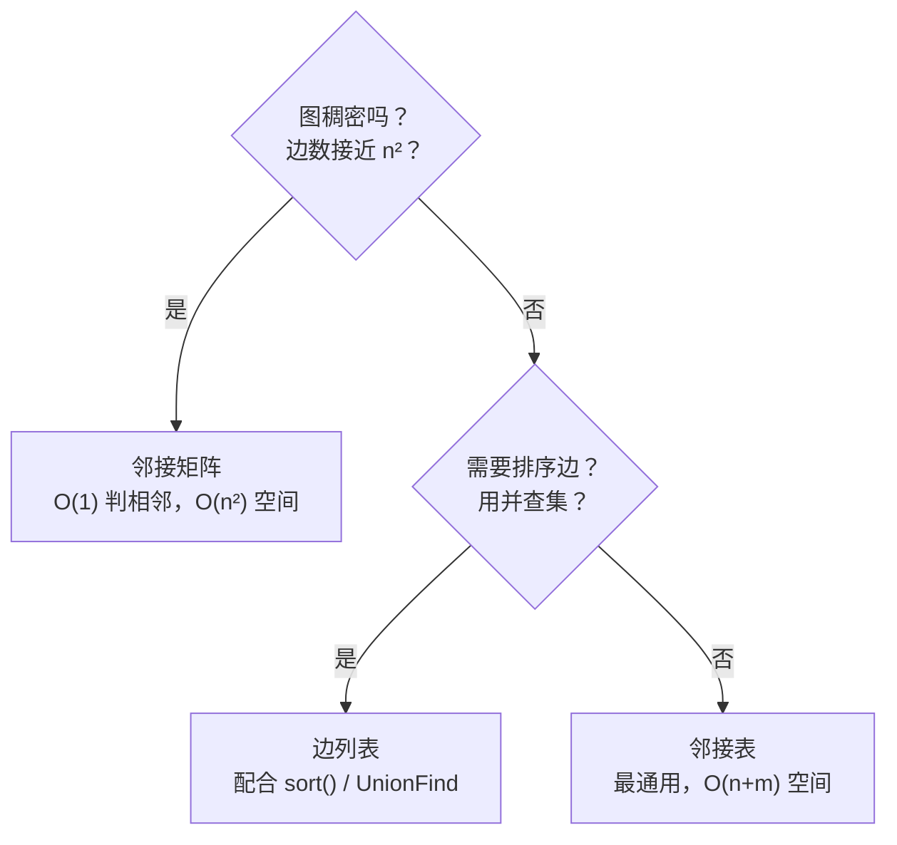
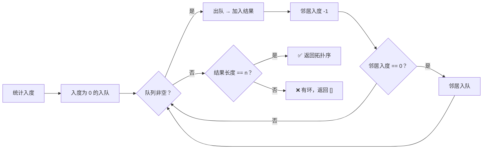
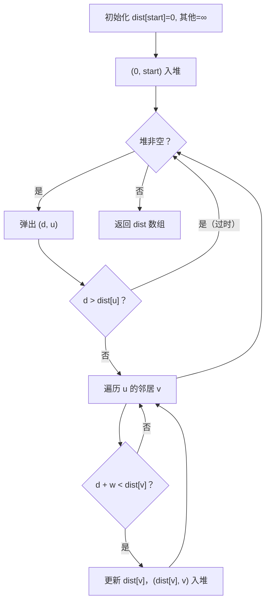
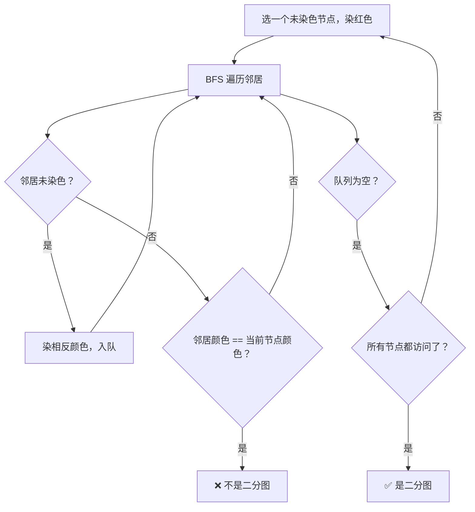

## 前置知识：图到底是什么

### 顶点 + 边 = 图

图由**顶点（Vertex / Node）**和**边（Edge）**组成。边连接两个顶点，表示它们之间的关系。

```python
# 一个最简单的图：两个节点，一条边
#    [0] ---- [1]
```

> [!info] 现实世界中的图
> • **社交网络**：顶点 = 用户，边 = 好友关系
> • **地图导航**：顶点 = 路口，边 = 道路
> • **课程依赖**：顶点 = 课程，边 = 先修关系
> • **网页排名**：顶点 = 网页，边 = 超链接
> • **编译器**：顶点 = 模块，边 = 依赖关系

### 图的核心分类

| 维度 | 类型 | 说明 | 示例 |
|------|------|------|------|
| **方向** | 无向图 | 边没有方向，`A—B` 表示 A 和 B 互通 | 好友关系（互为好友） |
| | 有向图 | 边有方向，`A→B` 表示从 A 到 B | 微博关注（单向） |
| **权重** | 无权图 | 所有边权重相同（通常视为 1） | 好友关系 |
| | 带权图 | 每条边有一个数值权重 | 城市间距离 |
| **连通性** | 连通图 | 任意两点都有路径可达 | 一个省的公路网 |
| | 非连通图 | 存在孤立的部分（连通分量） | 多个互不联通的岛屿 |

### 连通分量

一个非连通图由多个**连通分量**组成，每个分量内部连通，分量之间互不相连。

```
连通分量1:  [0]--[1]--[2]         连通分量2:  [3]--[4]

整个图有两个连通分量，不是一个连通图。
```

> [!warning] 遍历非连通图时，必须对每个未访问的节点都启动一次遍历
> 很多新手只从节点 0 开始 DFS/BFS，如果图不连通，其他分量永远不会被访问到。

### 环与无环图

| 术语 | 含义 |
|------|------|
| **环（Cycle）** | 一条起点 = 终点的路径，且长度 >= 1 |
| **无环图（Acyclic）** | 图中没有任何环 |
| **有向无环图（DAG）** | 有向 + 无环，拓扑排序的用武之地 |
| **树** | 连通的无环无向图（n 个节点，n-1 条边） |

---

## 图的三种存储方式

### 1. 邻接矩阵（适合稠密图）

用一个 `n × n` 的二维数组存储：`matrix[i][j] = 1` 表示有边，`0` 表示无边。带权图存权重。

```python
# 邻接矩阵：n 个节点
n = 5
# 无向无权图
graph = [[0] * n for _ in range(n)]
graph[0][1] = graph[1][0] = 1  # 0--1
graph[0][2] = graph[2][0] = 1  # 0--2
graph[1][3] = graph[3][1] = 1  # 1--3
graph[2][4] = graph[4][2] = 1  # 2--4

# 带权有向图：graph[i][j] = 权重（0 表示无边）
# graph[0][1] = 5  表示 0 → 1，权重 5
```

| 操作 | 时间复杂度 | 说明 |
|------|-----------|------|
| 判断 `i` 和 `j` 是否相邻 | O(1) | 直接查 `matrix[i][j]` |
| 获取节点 `i` 的所有邻居 | O(n) | 需要遍历整行 |
| 空间复杂度 | O(n²) | 即使边很少，也占满 |
| 适合场景 | 稠密图（边数接近 n²）、Floyd-Warshall |

> [!tip] 什么时候用邻接矩阵？
> 边数 m 接近 n² 时（稠密图）。如果 m << n²（稀疏图），空间浪费严重，用邻接表。

---

### 2. 邻接表（最常用，适合稀疏图）

用一个列表数组：`graph[i]` 存放节点 `i` 的所有邻居。这是 **LeetCode 上最常见的存图方式**。

```python
# 邻接表：每个节点存一个邻居列表
n = 5
graph = [[] for _ in range(n)]

# 无向无权图：加边时双向添加
edges = [[0,1], [0,2], [1,3], [2,4]]
for u, v in edges:
    graph[u].append(v)
    graph[v].append(u)  # 无向图必须双向

# 有向带权图：存 (邻居, 权重) 元组
graph = [[] for _ in range(n)]
# edges = [[0,1,5], [0,2,3]]  表示 0→1 权 5，0→2 权 3
for u, v, w in weighted_edges:
    graph[u].append((v, w))
```

| 操作 | 时间复杂度 | 说明 |
|------|-----------|------|
| 判断 `i` 和 `j` 是否相邻 | O(degree(i)) | 需要遍历邻居列表 |
| 获取节点 `i` 的所有邻居 | O(degree(i)) | 直接拿列表 |
| 空间复杂度 | O(n + m) | 只存实际存在的边 |
| 适合场景 | 稀疏图（大多数情况）、DFS/BFS 遍历 |

```python
# 实际遍历示例
def dfs(graph, node, visited):
    visited.add(node)
    for neighbor in graph[node]:
        if neighbor not in visited:
            dfs(graph, neighbor, visited)
```

> [!important] LeetCode 中绝大部分图题都用邻接表
> 题目给你的 `edges` / `prerequisites` 本质上就是边列表，你读题第一步就是把它转成邻接表。

---

### 3. 边列表（适合并查集、最小生成树）

直接把所有边存成一个列表，每条边是一个 `(u, v)` 或 `(u, v, w)` 元组。

```python
# 边列表：最简单的存图方式
edges = [[0,1], [0,2], [1,3], [2,4]]      # 无权
edges = [[0,1,5], [0,2,3], [1,3,2]]       # 带权 (u, v, weight)
```

| 操作 | 时间复杂度 |
|------|-----------|
| 遍历所有边 | O(m) |
| 判断两点是否相邻 | O(m) |
| 适合场景 | 并查集、Kruskal 最小生成树、Bellman-Ford |

> [!tip] 边列表虽然简单，但处理特定算法时极其方便
> Kruskal 算法直接对边列表按权重排序；Bellman-Ford 需要遍历所有边做松弛。

### 三种存储方式速查



---

## 图的两种遍历

> [!info] 图遍历与树遍历的区别
> 树没有环，不会重复访问；**图有环，必须用 `visited` 集合避免死循环。**

### DFS 遍历

```python
# 图的 DFS 遍历（递归版）
def dfs(graph, node, visited):
    if node in visited:
        return
    visited.add(node)
    # 前序位置：处理当前节点
    for neighbor in graph[node]:
        dfs(graph, neighbor, visited)
    # 后序位置：离开当前节点（拓扑排序在这里记录）

# 图的 DFS 遍历（迭代版）
def dfs_iterative(graph, start):
    visited = set()
    stack = [start]
    while stack:
        node = stack.pop()
        if node in visited:
            continue
        visited.add(node)
        for neighbor in graph[node]:
            if neighbor not in visited:
                stack.append(neighbor)
```

> [!warning] 图的 visited 必须在"进入邻居前"标记，而不能在"出队时"标记
> BFS/DFS 中，一个节点可能被多次加入队列/栈。如果在出队时才标 visited，同一个节点可能被处理多次。正确做法是 **入队/入栈时立刻标记**。

### BFS 遍历

```python
from collections import deque

def bfs(graph, start):
    visited = set([start])
    queue = deque([start])

    while queue:
        node = queue.popleft()
        # 处理当前节点
        for neighbor in graph[node]:
            if neighbor not in visited:
                visited.add(neighbor)   # ⚠️ 入队时立刻标记！
                queue.append(neighbor)
```

> [!tip] 更详细的 DFS/BFS 讲解见
> • [[DFS深度优先搜索基础与通用解题框架]]
> • [[BFS广度优先搜索基础与通用解题框架]]

---

## 五大核心算法

### 一、拓扑排序 — 有向图的"排序"

**问题**：有 n 门课，有些课有先修要求。找一个合法的上课顺序。如果图中存在环，则无解。

**核心思想**：每次选入度为 0 的节点，移除它（及其出边），重复直到所有节点被移除。

#### 版本 1：Kahn 算法（BFS 版，最常用）

```python
from collections import deque, defaultdict

def findOrder(numCourses, prerequisites):
    # ① 建图 + 入度表
    graph = defaultdict(list)
    indegree = [0] * numCourses
    for course, prereq in prerequisites:
        graph[prereq].append(course)   # prereq → course
        indegree[course] += 1

    # ② 所有入度为 0 的节点入队
    queue = deque([i for i in range(numCourses) if indegree[i] == 0])
    order = []

    # ③ BFS
    while queue:
        course = queue.popleft()
        order.append(course)
        for next_course in graph[course]:
            indegree[next_course] -= 1
            if indegree[next_course] == 0:
                queue.append(next_course)

    # ④ 判断是否有环
    return order if len(order) == numCourses else []
```



> [!example] 真题：207. 课程表 / 210. 课程表 II
> 207 只判断能否完成（是否存在拓扑序），210 要返回具体顺序。

#### 版本 2：DFS 版（后序遍历逆序）

```python
def findOrderDFS(numCourses, prerequisites):
    graph = defaultdict(list)
    for course, prereq in prerequisites:
        graph[prereq].append(course)

    # 0 = 未访问, 1 = 访问中（当前路径）, 2 = 已完成
    state = [0] * numCourses
    order = []

    def dfs(node):
        if state[node] == 1:   # 在当前路径中又遇到 → 有环
            return False
        if state[node] == 2:   # 已处理过
            return True

        state[node] = 1        # 标记"访问中"
        for neighbor in graph[node]:
            if not dfs(neighbor):
                return False
        state[node] = 2        # 标记"已完成"
        order.append(node)     # 后序位置记录
        return True

    for i in range(numCourses):
        if state[i] == 0:
            if not dfs(i):
                return []
    return order[::-1]         # ⚠️ 后序的逆序 = 拓扑序
```

> [!tip] DFS 版拓扑排序的记忆口诀
> "后序记录，最后反转" — 在 DFS 的后序位置把节点加入列表，最终反转列表就是拓扑序。

---

### 二、Dijkstra 最短路径 — 单源最短路径

**问题**：给定起点，求到所有其他节点的最短距离。**要求边权非负。**

```python
import heapq

def dijkstra(n, edges, start):
    # ① 建邻接表
    graph = [[] for _ in range(n)]
    for u, v, w in edges:
        graph[u].append((v, w))

    # ② 初始化距离数组
    INF = float('inf')
    dist = [INF] * n
    dist[start] = 0

    # ③ 优先队列（最小堆）：(当前距离, 节点)
    heap = [(0, start)]

    while heap:
        d, u = heapq.heappop(heap)
        if d > dist[u]:        # ⚠️ 过时数据，跳过
            continue

        for v, w in graph[u]:
            new_d = d + w
            if new_d < dist[v]:
                dist[v] = new_d
                heapq.heappush(heap, (new_d, v))

    return dist
```

> [!example] 真题：743. 网络延迟时间
> 从起点 k 发信号，求所有节点收到信号的最早时间。即求 `max(dist)`，如果有 INF 则返回 -1。



---

### 三、并查集 — 连通性 + 判环

**核心**：两个操作 — `find`（找根）+ `union`（合并）。用于判断两点是否连通、图是否有环。

```python
class UnionFind:
    def __init__(self, n):
        self.parent = list(range(n))   # 初始每个节点的父节点是自己
        self.rank = [0] * n            # 按秩合并

    def find(self, x):
        # 路径压缩：让 x 直接指向根
        if self.parent[x] != x:
            self.parent[x] = self.find(self.parent[x])
        return self.parent[x]

    def union(self, x, y):
        root_x = self.find(x)
        root_y = self.find(y)
        if root_x == root_y:
            return False               # ⚠️ 已经在同一集合 → 有环！
        # 按秩合并：让矮树接到高树下
        if self.rank[root_x] < self.rank[root_y]:
            self.parent[root_x] = root_y
        elif self.rank[root_x] > self.rank[root_y]:
            self.parent[root_y] = root_x
        else:
            self.parent[root_y] = root_x
            self.rank[root_x] += 1
        return True

    def connected(self, x, y):
        return self.find(x) == self.find(y)
```

> [!example] 真题：684. 冗余连接
> 给定一棵树加了一条多余的边。遍历边列表，对每条边 `(u, v)`：
> • `uf.union(u, v)` 返回 `False` → 这条边就是多余的（加它后形成环）
> • 否则正常合并

```python
def findRedundantConnection(edges):
    n = len(edges)
    uf = UnionFind(n + 1)    # 节点编号从 1 开始
    for u, v in edges:
        if not uf.union(u, v):
            return [u, v]    # 这条边导致了环
    return []
```

> [!tip] 并查集的更多用法见 [[并查集基础与通用解题框架]]

---

### 四、最小生成树（MST）

**问题**：在带权连通无向图中找一棵包含所有节点的树，使得边的总权重最小。

#### Prim 算法（加点法，类似 Dijkstra）

```python
import heapq

def prim(n, edges):
    # 建邻接表
    graph = [[] for _ in range(n)]
    for u, v, w in edges:
        graph[u].append((v, w))
        graph[v].append((u, w))

    visited = [False] * n
    heap = [(0, 0)]         # (权重, 节点)，从 0 开始
    total_weight = 0
    count = 0

    while heap and count < n:
        w, u = heapq.heappop(heap)
        if visited[u]:
            continue
        visited[u] = True
        total_weight += w
        count += 1
        for v, weight in graph[u]:
            if not visited[v]:
                heapq.heappush(heap, (weight, v))

    return total_weight if count == n else -1
```

#### Kruskal 算法（加边法，配合并查集）

```python
def kruskal(n, edges):
    uf = UnionFind(n)
    # 按权重升序排序
    edges.sort(key=lambda x: x[2])
    total_weight = 0
    count = 0

    for u, v, w in edges:
        if uf.union(u, v):      # 不形成环才加入
            total_weight += w
            count += 1
            if count == n - 1:  # 树有 n-1 条边
                break

    return total_weight if count == n - 1 else -1
```

> [!tip] Prim vs Kruskal
> | | Prim | Kruskal |
> |---|---|---|
> | 策略 | 加点（从当前生成树扩展） | 加边（全局选最小边） |
> | 数据结构 | 堆 + visited | 并查集 + 排序 |
> | 适合 | 稠密图 | 稀疏图 |

---

### 五、二分图判断（染色法）

**定义**：能把所有节点分成两组，每条边都连接两个不同组的节点。等价于**图中没有奇数长度的环**。

```python
from collections import deque

def isBipartite(graph):
    n = len(graph)
    color = [0] * n     # 0=未染色, 1=红, -1=蓝

    # ⚠️ 图可能不连通，需要对每个未访问节点启动 BFS
    for i in range(n):
        if color[i] != 0:
            continue

        queue = deque([i])
        color[i] = 1

        while queue:
            u = queue.popleft()
            for v in graph[u]:
                if color[v] == 0:
                    color[v] = -color[u]   # 染相反颜色
                    queue.append(v)
                elif color[v] == color[u]:
                    return False            # 相邻节点同色 → 非二分图

    return True
```



> [!example] 真题：785. 判断二分图 / 886. 可能的二分法
> 886 是"把人分成两组，某些人不喜欢彼此" — 不喜欢关系当作边，转化为二分图判定。

---

## 新手练习路线图

> [!important] 练习策略
> 先掌握图的存储和遍历，再逐个攻克五大核心算法。每个算法先理解"为什么这样做"，再默写代码骨架。

```
阶段 1️⃣  图的存储 + DFS/BFS 遍历
  ├── 797. 所有可能的路径              ← DAG 简单 DFS，不用 visited
  └── 841. 钥匙和房间                  ← BFS/DFS 遍历，判断连通性

阶段 2️⃣  拓扑排序
  ├── 207. 课程表                      ← 判断是否有环（BFS 版）
  └── 210. 课程表 II                   ← 返回拓扑序

阶段 3️⃣  最短路径
  ├── 743. 网络延迟时间                 ← Dijkstra 模板题
  └── 787. K 站中转内最便宜航班          ← Bellman-Ford / BFS 变体

阶段 4️⃣  并查集 + 判环
  ├── 684. 冗余连接                    ← 并查集模板题
  └── 547. 省份数量                    ← 并查集统计连通分量

阶段 5️⃣  二分图 + 进阶
  ├── 785. 判断二分图                   ← 染色法模板
  ├── 886. 可能的二分法                 ← 二分图应用
  └── 1584. 连接所有点的最小费用          ← Prim 模板题
```

---

## 常见易错点

> [!warning] **坑 1：visited 标记的时机（BFS/DFS 的头号坑）**
> ```python
> # ❌ 错误：出队时标记
> while queue:
>     node = queue.popleft()
>     if node in visited:      # 同一个节点可能入队多次
>         continue
>     visited.add(node)
>     # ...
>
> # ✅ 正确：入队时立刻标记
> visited.add(start)
> queue.append(start)
> while queue:
>     node = queue.popleft()
>     for neighbor in graph[node]:
>         if neighbor not in visited:
>             visited.add(neighbor)    # 立刻标记！
>             queue.append(neighbor)
> ```
> 原因：一个节点可能同时被多个节点加入队列，出队时才标记会导致重复处理甚至无限循环。

> [!warning] **坑 2：图不连通，只从节点 0 开始遍历**
> ```python
> # ❌ 只遍历了节点 0 所在的连通分量
> dfs(graph, 0, visited)
>
> # ✅ 对每个节点，如果没访问过就启动遍历
> for i in range(n):
>     if i not in visited:
>         dfs(graph, i, visited)
> ```

> [!warning] **坑 3：环检测的 DFS 三色标记法**
> ```python
> # 拓扑排序 DFS 版中，只用 True/False 不够
> # 必须区分"正在访问"和"已经完成"：
> # 0 = 未访问, 1 = 当前路径中（访问中）, 2 = 已完成
> # 如果在 state==1 的路径上再次遇到 → 有环
> ```

> [!warning] **坑 4：Dijkstra 不能处理负权边**
> Dijkstra 基于贪心——一个节点一旦从堆中弹出确定最短距离后就不再更新。但如果有负权边，后续路径可能更短，之前的"确定"就错了。
> ```python
> # 负权边场景请用 Bellman-Ford 或 SPFA
> ```
> | 算法 | 负权边 | 负权环 | 时间复杂度 |
> |------|--------|--------|-----------|
> | Dijkstra | ❌ | ❌ | O((n+m) log n) |
> | Bellman-Ford | ✅ | ✅ 可检测 | O(n·m) |
> | Floyd-Warshall | ✅ | ✅ 可检测 | O(n³) |

> [!warning] **坑 5：无向图建邻接表时只加单向边**
> ```python
> # ❌ 无向图忘了双向添加
> for u, v in edges:
>     graph[u].append(v)
>
> # ✅ 无向图必须双向
> for u, v in edges:
>     graph[u].append(v)
>     graph[v].append(u)
> ```

> [!warning] **坑 6：拓扑排序中先修关系方向搞反**
> ```python
> # prerequisites = [[a, b]] 表示 a 依赖 b，即 b → a
> # ❌ 方向反了
> for course, prereq in prerequisites:
>     graph[course].append(prereq)   # 错！变成了 a → b
>     indegree[prereq] += 1
>
> # ✅ 正确方向：prereq → course
> for course, prereq in prerequisites:
>     graph[prereq].append(course)   # b → a
>     indegree[course] += 1
> ```

---

## 相关题目索引

| 题号 | 题目 | 核心算法 | 难度 |
|------|------|---------|------|
| 797 | 所有可能的路径 | DFS 遍历 | 🟢 简单 |
| 841 | 钥匙和房间 | BFS / DFS 连通性 | 🟢 简单 |
| 207 | 课程表 | 拓扑排序（判环） | 🟡 中等 |
| 210 | 课程表 II | 拓扑排序（输出序） | 🟡 中等 |
| 743 | 网络延迟时间 | Dijkstra | 🟡 中等 |
| 684 | 冗余连接 | 并查集判环 | 🟡 中等 |
| 547 | 省份数量 | 并查集 / DFS | 🟡 中等 |
| 785 | 判断二分图 | 染色法 | 🟡 中等 |
| 886 | 可能的二分法 | 染色法 | 🟡 中等 |
| 787 | K 站中转内最便宜航班 | Bellman-Ford / BFS | 🟡 中等 |
| 1584 | 连接所有点的最小费用 | Prim / Kruskal | 🟡 中等 |
| 802 | 找到最终的安全状态 | 拓扑排序（反向图） | 🟡 中等 |
| 990 | 等式方程的可满足性 | 并查集 | 🟡 中等 |

---

## 相关笔记

- [[DFS深度优先搜索基础与通用解题框架]] — 图的 DFS 遍历基础
- [[BFS广度优先搜索基础与通用解题框架]] — 图的 BFS 遍历基础
- [[并查集基础与通用解题框架]] — UnionFind 详解
- [[分治与堆：从原理到实战]] — Dijkstra 依赖的优先队列
- [[动态规划基础与通用解题框架]] — Bellman-Ford 本质是 DP
