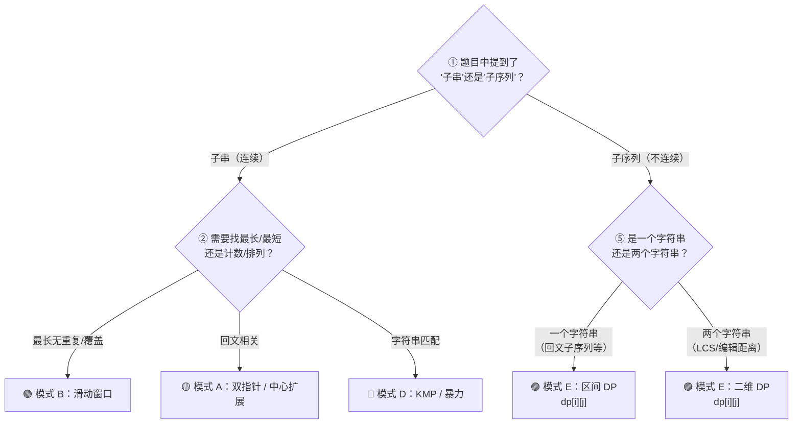

## 前置知识：字符串到底是什么

### 字符串 = 不可变的字符序列

在 Python 中，字符串 `str` 是一个**不可变（immutable）**的有序字符序列。它的底层是一个连续内存区域中存储的 Unicode 码点数组，但你**不能原地修改**其中的任何字符。

```python
s = "hello"

# ✅ 读取——O(1)
print(s[0])       # 'h'
print(s[1:4])     # 'ell'（切片，O(k)，k 为切片长度）

# ❌ 修改——直接报错！
s[0] = 'H'        # TypeError: 'str' object does not support item assignment
```

> [!warning] 不可变性（Immutability）是字符串所有操作的地基
> 任何"修改"字符串的操作（拼接、替换、切片）实际上都在**创建全新的字符串对象**。忘记这一点，你就会写出 O(n^2) 的拼接代码。

### 字符串 vs 数组：像但不完全像

| | 字符串 `str` | 数组 `list` |
|---|---|---|
| **可变性** | 不可变 | 可变 |
| **索引访问** | O(1) | O(1) |
| **原地修改** | 不支持 | 支持 |
| **切片** | 返回新字符串 O(k) | 返回新列表 O(k) |
| **拼接** | 创建新字符串 O(n+m) | `append` O(1)，`extend` O(m) |
| **字符类型** | 全部是字符 | 可以混合类型 |
| **典型转换** | `list(s)` → 字符列表 | `''.join(lst)` → 字符串 |

> [!tip] 经验法则
> 需要频繁修改字符时，先用 `list(s)` 转成字符列表，改完了再用 `''.join(lst)` 转回字符串。这是 Python 字符串题的**基本操作套路**。

### 索引与切片图解

```
字符串:  "p  y  t  h  o  n"
正索引:  0  1  2  3  4  5
负索引: -6 -5 -4 -3 -2 -1

s[0]   → 'p'
s[-1]  → 'n'
s[0:3] → 'pyt'    （左闭右开，取索引 0,1,2）
s[::2] → 'pto'    （步长为 2，隔一个取一个）
s[::-1]→ 'nohtyp' （反转字符串，O(n)）
```

---

## 核心操作与时间复杂度

> [!important] 每个操作的时间代价必须烂熟于心

| 操作 | 代码 | 时间复杂度 | 说明 |
|------|------|-----------|------|
| 索引访问 | `s[i]` | O(1) | 底层数组随机访问 |
| 求长度 | `len(s)` | O(1) | Python 存储了长度元数据 |
| 切片 | `s[i:j]` | O(k)，k = j-i | 复制一段新字符串 |
| 拼接（少量） | `s1 + s2` | O(n+m) | 每次创建新字符串 |
| 拼接（大量） | `''.join(list)` | O(n) | 一次性分配内存，**比循环 `+=` 快得多** |
| 查找子串 | `s.find(t)` | O(n·m) 朴素 | Python 内部用 Boyer-Moore 等优化，实际更快 |
| `in` 操作 | `'a' in s` | O(n) | 遍历查找 |
| 替换 | `s.replace(a, b)` | O(n) | 复制一份并替换 |
| 分割 | `s.split(',')` | O(n) | 扫描一遍 |
| 大小写转换 | `s.lower()` | O(n) | 复制一份转换 |
| 去首尾空白 | `s.strip()` | O(n) | 复制一份 |
| 转列表 | `list(s)` | O(n) | 每个字符变成一个元素 |

> [!warning] **坑：循环中用 `+=` 拼接字符串**
> ```python
> # ❌ O(n^2) —— 每次 += 都创建新字符串，复制之前所有内容
> result = ""
> for c in s:
>     result += c
>
> # ✅ O(n) —— 收集到列表，一次性 join
> parts = []
> for c in s:
>     parts.append(c)
> result = ''.join(parts)
> ```
> 两者的时间差距在字符串长度达到 10^5 时会从几毫秒变成几秒。

---

## 五大核心解题模式

### 模式 A：双指针（对撞指针 / 左右指针）

**核心思想**：两个指针从两端向中间移动，在字符级别上操作。

**一眼认出**：回文串、反转字符串、两数之和变体（在有序字符数组上）。

```python
# ====== 模式 A：对撞双指针（通用骨架） ======
def two_pointers_on_string(s):
    left, right = 0, len(s) - 1

    while left < right:
        # 根据题目需求，处理 s[left] 和 s[right]
        if condition(s[left], s[right]):
            # 满足条件时的操作
            left += 1
            right -= 1
        else:
            # 不满足条件时的操作
            return False  # 或做其他处理

    return True
```

> [!example] 示例：125. 验证回文串
> ```python
> def isPalindrome(s):
>     # 预处理：只保留字母数字，转小写
>     s = ''.join(c.lower() for c in s if c.isalnum())
>     left, right = 0, len(s) - 1
>     while left < right:
>         if s[left] != s[right]:
>             return False
>         left += 1
>         right -= 1
>     return True
> ```

**双指针变体：中心扩展法**

用于求**最长回文子串**——不是两边向中间走，而是从中心向两边扩。

```python
# ====== 变体：中心扩展法（通用骨架） ======
def expand_around_center(s, left, right):
    """从 left/right 向两边扩展，返回回文串"""
    while left >= 0 and right < len(s) and s[left] == s[right]:
        left -= 1
        right += 1
    # 退出循环时 s[left+1:right] 是回文
    return s[left + 1:right]

def longestPalindrome(s):
    res = ""
    for i in range(len(s)):
        # 奇数长度：以 i 为中心
        odd = expand_around_center(s, i, i)
        # 偶数长度：以 i, i+1 为中心
        even = expand_around_center(s, i, i + 1)
        res = max(res, odd, even, key=len)
    return res
```

**双指针模式对应题目**：

| 题号 | 题目 | 指针类型 | 关键技巧 |
|------|------|---------|---------|
| 125 | 验证回文串 | 对撞指针 | 跳过非字母数字 |
| 680 | 验证回文串 II | 对撞指针 | 允许删一个字符，递归或两次判断 |
| 5 | 最长回文子串 | 中心扩展 | 奇偶两种情况 |
| 344 | 反转字符串 | 对撞指针 | 交换字符（需转数组） |
| 345 | 反转字符串中的元音字母 | 对撞指针 | 两边分别找元音 |

---

### 模式 B：滑动窗口

**核心思想**：用两个指针 `left` 和 `right` 维护一个窗口 `[left, right)`，`right` 向右扩展窗口，条件破坏时 `left` 向右收缩窗口。

**一眼认出**：子串（连续！）、最小覆盖、最长无重复、包含某条件的连续区间。

```python
# ====== 模式 B：滑动窗口（通用骨架） ======
from collections import defaultdict, Counter

def sliding_window(s):
    left = 0
    window = defaultdict(int)  # 或 Counter()，记录窗口内字符频率
    ans = 0  # 或 float('inf')（求最小）

    for right in range(len(s)):
        # ① 右侧新字符进入窗口
        c = s[right]
        window[c] += 1

        # ② 当窗口不满足条件时，收缩左边界
        while 窗口条件被破坏:
            d = s[left]
            window[d] -= 1
            if window[d] == 0:
                del window[d]  # 清理频率为 0 的 key（可选）
            left += 1

        # ③ 此时窗口满足条件，收集答案
        ans = max(ans, right - left + 1)  # 或 min(ans, ...)

    return ans
```

> [!example] 示例：3. 无重复字符的最长子串
> ```python
> def lengthOfLongestSubstring(s):
>     window = set()
>     left = 0
>     ans = 0
>     for right in range(len(s)):
>         while s[right] in window:          # 重复了，收缩
>             window.remove(s[left])
>             left += 1
>         window.add(s[right])               # 加入新字符
>         ans = max(ans, right - left + 1)   # 更新答案
>     return ans
> ```

> [!example] 示例：76. 最小覆盖子串
> ```python
> def minWindow(s, t):
>     from collections import Counter
>     need = Counter(t)                      # 需要的字符频率
>     window = Counter()                     # 窗口中已有的字符频率
>     left = 0
>     valid = 0                              # 已满足的字符种类数
>     start, length = 0, float('inf')
>
>     for right in range(len(s)):
>         c = s[right]
>         if c in need:
>             window[c] += 1
>             if window[c] == need[c]:
>                 valid += 1                 # 该类字符已满足
>
>         while valid == len(need):          # 全部满足，收缩
>             if right - left + 1 < length:
>                 start, length = left, right - left + 1
>             d = s[left]
>             if d in need:
>                 if window[d] == need[d]:
>                     valid -= 1
>                 window[d] -= 1
>             left += 1
>
>     return "" if length == float('inf') else s[start:start + length]
> ```

**滑动窗口模式对应题目**：

| 题号 | 题目 | 窗口内容 | 收缩条件 |
|------|------|---------|---------|
| 3 | 无重复字符的最长子串 | 不重复字符集合 | 出现重复 |
| 76 | 最小覆盖子串 | 字符频率表 | 已覆盖 t 中全部字符 |
| 438 | 找到字符串中所有字母异位词 | 字符频率表 | 窗口大小 > len(p) |
| 567 | 字符串的排列 | 字符频率表 | 窗口大小 > len(s1) |
| 159 | 至多包含两个不同字符的最长子串 | 不同字符频率 | 不同字符数 > 2 |
| 395 | 至少有 K 个重复字符的最长子串 | 字符频率 | 分治或滑动窗口 |

---

### 模式 C：哈希表计数 / 数组映射

**核心思想**：用哈希表（或数组）统计字符出现次数，利用字符的离散性（只有 26 个字母或 128/256 个 ASCII）做频率对比。

**一眼认出**：异位词、字符计数、同构字符串、单词模式匹配。

```python
# ====== 模式 C：哈希表计数（通用骨架） ======
def char_count_pattern(s, t):
    # 方法 1：Counter（通用，适合任意字符集）
    from collections import Counter
    return Counter(s) == Counter(t)

    # 方法 2：定长数组（仅限小写字母，O(1) 空间更优）
    count = [0] * 26
    for c in s:
        count[ord(c) - ord('a')] += 1
    # 再做频率对比……
```

> [!example] 示例：242. 有效的字母异位词
> ```python
> def isAnagram(s, t):
>     if len(s) != len(t):
>         return False
>     count = [0] * 26
>     for i in range(len(s)):
>         count[ord(s[i]) - ord('a')] += 1
>         count[ord(t[i]) - ord('a')] -= 1
>     return all(c == 0 for c in count)
> ```

> [!example] 示例：49. 字母异位词分组
> ```python
> def groupAnagrams(strs):
>     from collections import defaultdict
>     groups = defaultdict(list)
>     for s in strs:
>         # 对每个字符串排序作为 key（或用字符计数元组）
>         key = ''.join(sorted(s))
>         groups[key].append(s)
>     return list(groups.values())
> ```

> [!tip] 什么时候用数组代替 dict？
> | 场景 | 用 `[0]*26` | 用 `dict`/`Counter` |
> |------|------------|-------------------|
> | 明确只有 a-z | ✅ 更快更省 | 也可以 |
> | 只有 A-Z | `[0]*26`（先转小写） | 也可以 |
> | 包含数字/符号 | `[0]*128`（ASCII） | ✅ 更好 |
> | Unicode / 中文 | ❌ | ✅ 必须用 dict |

**哈希表计数模式对应题目**：

| 题号 | 题目 | 计数方式 | 关键点 |
|------|------|---------|--------|
| 242 | 有效的字母异位词 | 数组 [26] | 同时加减 |
| 49 | 字母异位词分组 | 排序后字符串作 key | 或计数元组作 key |
| 205 | 同构字符串 | 双映射 dict | 每个字符映射到唯一字符 |
| 290 | 单词规律 | 双映射 dict | 字符↔单词 |
| 387 | 字符串中的第一个唯一字符 | 数组 [26] | 两遍扫描 |
| 451 | 根据字符出现频率排序 | Counter | 按频率排序拼接 |
| 409 | 最长回文串 | Counter | 偶数全取，奇数取最多一个中心 |

---

### 模式 D：字符串匹配（KMP 思想简介）

**核心思想**：在文本串 `s` 中查找模式串 `p` 的出现位置。暴力法 O(n·m)，KMP 利用**已匹配部分的信息**避免回溯，达到 O(n+m)。

> [!info] KMP 的核心：next 数组（前缀函数）
> `next[i]` 的含义：在模式串 `p` 的前缀 `p[0:i+1]` 中，**最长相等前后缀**的长度。
> 当匹配失败时，模式串不需要退回起点，而是跳到 `next` 数组指示的位置继续匹配。

**KMP 代码骨架**（理解思想即可，面试中手动写出有难度）：

```python
# ====== 模式 D：KMP 字符串匹配 ======
def build_next(p):
    """构建 next 数组：next[i] = p[:i+1] 的最长相等前后缀长度"""
    next_arr = [0] * len(p)
    j = 0  # 前缀末尾
    for i in range(1, len(p)):
        while j > 0 and p[i] != p[j]:
            j = next_arr[j - 1]      # 回退
        if p[i] == p[j]:
            j += 1
        next_arr[i] = j
    return next_arr

def kmp_search(s, p):
    """在 s 中查找 p 的所有出现位置"""
    if not p:
        return [0]
    next_arr = build_next(p)
    j = 0
    result = []
    for i in range(len(s)):
        while j > 0 and s[i] != p[j]:
            j = next_arr[j - 1]
        if s[i] == p[j]:
            j += 1
        if j == len(p):              # 找到一个匹配
            result.append(i - j + 1)
            j = next_arr[j - 1]      # 继续找下一个
    return result
```

> [!tip] 实际建议
> 面试中遇到字符串匹配，先说暴力法 O(n·m)，再提 KMP 优化到 O(n+m)。除非面的岗位对算法要求极高（如校招算法岗），通常暴力法或调 `s.find()` 就够了。

**字符串匹配对应题目**：

| 题号 | 题目 | 解法 |
|------|------|------|
| 28 | 找出字符串中第一个匹配项的下标 | KMP / 暴力 / `find()` |
| 459 | 重复的子字符串 | KMP next 数组变体 |
| 214 | 最短回文串 | KMP / Manacher |
| 1392 | 最长快乐前缀 | KMP next 数组 |

---

### 模式 E：动态规划 on String

**核心思想**：两个字符串（或一个字符串的子区间）之间的状态转移，通常用二维 DP 表。

**一眼认出**：两个字符串的编辑距离、最长公共子序列、最长公共子串、正则匹配、通配符匹配。

```python
# ====== 模式 E：字符串 DP（通用骨架） ======
def string_dp(s1, s2):
    m, n = len(s1), len(s2)
    # ① 定义 dp[i][j]：
    #    通常表示 s1 的前 i 个字符 与 s2 的前 j 个字符 之间的关系

    dp = [[0] * (n + 1) for _ in range(m + 1)]

    # ② 初始化第一行和第一列（空字符串的情况）
    for i in range(m + 1):
        dp[i][0] = ...  # s2 为空时
    for j in range(n + 1):
        dp[0][j] = ...  # s1 为空时

    # ③ 填表
    for i in range(1, m + 1):
        for j in range(1, n + 1):
            if s1[i - 1] == s2[j - 1]:
                dp[i][j] = f(dp[i-1][j-1])   # 当前字符匹配
            else:
                dp[i][j] = g(dp[i-1][j], dp[i][j-1], dp[i-1][j-1])

    return dp[m][n]
```

> [!example] 示例：1143. 最长公共子序列（LCS）
> ```python
> def longestCommonSubsequence(text1, text2):
>     m, n = len(text1), len(text2)
>     dp = [[0] * (n + 1) for _ in range(m + 1)]
>
>     for i in range(1, m + 1):
>         for j in range(1, n + 1):
>             if text1[i - 1] == text2[j - 1]:
>                 dp[i][j] = dp[i - 1][j - 1] + 1   # 匹配：斜对角 + 1
>             else:
>                 dp[i][j] = max(dp[i - 1][j], dp[i][j - 1])  # 不匹配：取左/上较大值
>     return dp[m][n]
> ```

> [!example] 示例：72. 编辑距离
> ```python
> def minDistance(word1, word2):
>     m, n = len(word1), len(word2)
>     dp = [[0] * (n + 1) for _ in range(m + 1)]
>
>     # 初始化：空字符串到另一个字符串的编辑距离
>     for i in range(m + 1):
>         dp[i][0] = i  # 全删
>     for j in range(n + 1):
>         dp[0][j] = j  # 全插
>
>     for i in range(1, m + 1):
>         for j in range(1, n + 1):
>             if word1[i - 1] == word2[j - 1]:
>                 dp[i][j] = dp[i - 1][j - 1]              # 相同：不用操作
>             else:
>                 dp[i][j] = min(
>                     dp[i - 1][j] + 1,     # 删除 word1[i-1]
>                     dp[i][j - 1] + 1,     # 插入 word2[j-1]
>                     dp[i - 1][j - 1] + 1  # 替换
>                 )
>     return dp[m][n]
> ```

**字符串 DP 模式对应题目**：

| 题号 | 题目 | 状态定义 | 转移核心 |
|------|------|---------|---------|
| 1143 | 最长公共子序列 | `dp[i][j]` = s1 前 i 和 s2 前 j 的 LCS 长度 | 匹配 +1，不匹配取 max |
| 72 | 编辑距离 | `dp[i][j]` = 最少操作数 | min(删,插,替) + 1 |
| 5 | 最长回文子串 | `dp[i][j]` = s[i:j+1] 是否回文 | `s[i]==s[j] and dp[i+1][j-1]` |
| 516 | 最长回文子序列 | `dp[i][j]` = s[i:j+1] 的最长回文子序列 | 匹配 +2，不匹配取 max |
| 115 | 不同的子序列 | `dp[i][j]` = s 前 i 中子序列 t 前 j 的次数 | 匹配可选，不匹配必跳 |
| 97 | 交错字符串 | `dp[i][j]` = s1 前 i + s2 前 j 能否组成 s3 前 i+j | 看 s3[i+j-1] 跟谁匹配 |

---

## 拿到题，先问自己三个问题



> [!tip] 另外半棵树：单词 / 频率类问题
> 如果题目不涉及顺序，只关心字符种类和次数（如异位词、同构），直接跳到**模式 C：哈希表计数**。

---

## 新手练习路线图

> [!important] 练习策略
> 字符串题套路极强。先攻下"双指针"和"滑动窗口"两座大山，再碰 DP。

```
阶段 1️⃣  双指针入门（最简单，建立语感）
  ├── 344. 反转字符串              ← 最基础的双指针
  ├── 125. 验证回文串              ← 理解"跳过无关字符"
  └── 680. 验证回文串 II           ← 理解"容错一次"

阶段 2️⃣  滑动窗口核心（面试最高频）
  ├── 3. 无重复字符的最长子串        ← 滑动窗口新手村
  ├── 209. 长度最小的子数组          ← 虽是数组，窗口思想一样
  ├── 438. 找到所有字母异位词        ← 固定窗口大小
  ├── 567. 字符串的排列             ← 固定窗口 + 频率对比
  └── 76. 最小覆盖子串              ← 滑动窗口集大成者，必须手写三遍

阶段 3️⃣  哈希计数与映射
  ├── 242. 有效的字母异位词         ← 最简单的计数
  ├── 409. 最长回文串              ← 理解"偶数全取，奇数留一"
  ├── 205. 同构字符串              ← 双映射
  └── 49. 字母异位词分组           ← 排序为 key

阶段 4️⃣  回文串专题（双指针 + DP 混用）
  ├── 5. 最长回文子串              ← 中心扩展法
  ├── 647. 回文子串               ← 中心扩展（计数版）
  └── 516. 最长回文子序列          ← 区间 DP 入门

阶段 5️⃣  字符串 DP（需要一定 DP 基础）
  ├── 1143. 最长公共子序列         ← 二维 DP 入门
  ├── 72. 编辑距离                ← 二维 DP 经典
  └── 115. 不同的子序列            ← 二维 DP 进阶

阶段 6️⃣  字符串匹配（选做，了解思想）
  └── 28. 找出第一个匹配项的下标    ← 暴力 → 了解 KMP 思想
```

---

## 常见易错点

> [!warning] **坑 1：Python 字符串不可变，修改前必须转数组**
> ```python
> # ❌ 直接改
> s = "hello"
> s[0] = 'H'   # TypeError!
>
> # ✅ 转数组 → 修改 → 转回来
> arr = list(s)
> arr[0] = 'H'
> s = ''.join(arr)
> ```
> 这个坑在 "反转字符串" 类题目中很容易踩到。

> [!warning] **坑 2：空字符串处理**
> ```python
> # ⚠️ s = "" 时，这些操作不会报错但可能产生错误结果
> len(s) == 0        # → True（正常）
> s[0]               # → IndexError（崩溃！）
>
> # ✅ 永远先判空
> if not s:
>     return 0  # 或合适的默认值
> ```
> 面试官经常用空字符串、单字符、全相同字符这些边界来测你。

> [!warning] **坑 3：混淆 substring（子串）和 subsequence（子序列）**
> ```
> 子串（substring）  = 原字符串中连续的一段          → 滑动窗口 / 双指针
> 子序列（subsequence）= 原字符串中按顺序但不一定连续  → 动态规划
>
> s = "abcde"
> "bcd" 是子串，也是子序列  ✅
> "ace" 是子序列，不是子串  ⚠️（跳过了 b 和 d）
> ```
> **读题时先圈出"子串"还是"子序列"，这决定了你用哪个模式！**

> [!warning] **坑 4：滑动窗口的 left 收缩条件写反**
> ```python
> # ❌ 当窗口"有效"时收缩——这会把答案越缩越小
> while valid == len(need):
>     window[s[left]] -= 1
>     left += 1
>     ans = min(ans, right - left + 1)  # ← 这里的 ans 在收缩之后才更新，可能漏局部最优
>
> # ✅ 在收缩前更新答案（求最小），或收缩后更新（求最大）
> while valid == len(need):
>     ans = min(ans, right - left + 1)  # ← 先更新
>     window[s[left]] -= 1              # ← 再收缩
>     if window[s[left]] < need[s[left]]:
>         valid -= 1
>     left += 1
> ```
> 经验：求最小 → while 内**先更新答案再收缩**；求最大 → while 外更新答案。

> [!warning] **坑 5：Counter 比较时忽略顺序问题**
> ```python
> # Counter 相等判断比较的是值，不是地址
> from collections import Counter
> Counter("aab") == Counter("baa")   # True ✅
>
> # 但如果 s 非常长（10^6），每次 Counter(s) 是 O(n)，滑动窗口内会退化
> # ✅ 维护一个窗口内的 Counter，增量更新，不要每次重建
> ```

> [!warning] **坑 6：切片索引越界不报错！**
> ```python
> s = "hello"
> s[1:100]    # → 'ello'（不会报错！右边界自动截断）
> s[10:20]    # → ''（不会报错！返回空字符串）
>
> # 这可能导致逻辑 bug：你以为取了 10 个字符，实际只取了 4 个
> # ✅ 对于精确长度有要求的场景，先检查 len(s) 是否足够
> ```

---

## 五大模式速查表

| | 🟢 双指针 | 🟡 滑动窗口 | 🔵 哈希计数 | 🟠 KMP | 🟣 字符串 DP |
|---|---|---|---|---|---|
| **处理对象** | 两端字符 | 连续子串 | 字符频率 | 模式匹配 | 子序列 / 编辑 |
| **时间复杂度** | O(n) | O(n) | O(n) | O(n+m) | O(n·m) |
| **核心数据结构** | 两个索引 | left + right + dict | dict / `[26]` | next 数组 | `dp[m+1][n+1]` |
| **一眼认出** | 回文 / 反转 | 最长子串 / 覆盖 | 异位词 / 频率 | 查找子串位置 | 两个字符串 / 编辑 |
| **关键记忆点** | `while left < right` | `for right: while 不满足: left++` | `ord(c)-ord('a')` | `next[i] = 最长前后缀` | `dp[i][j]` 空串行/列 |

---

## 相关题目索引

| 题号 | 题目 | 模式 | 难度 | 笔记 |
|------|------|------|------|------|
| 3 | 无重复字符的最长子串 | 🟡 B | 中等 | |
| 5 | 最长回文子串 | 🟢 A / 🟣 E | 中等 | |
| 28 | 找出第一个匹配项的下标 | 🟠 D | 简单 | |
| 49 | 字母异位词分组 | 🔵 C | 中等 | |
| 72 | 编辑距离 | 🟣 E | 困难 | |
| 76 | 最小覆盖子串 | 🟡 B | 困难 | |
| 125 | 验证回文串 | 🟢 A | 简单 | |
| 205 | 同构字符串 | 🔵 C | 简单 | |
| 242 | 有效的字母异位词 | 🔵 C | 简单 | |
| 344 | 反转字符串 | 🟢 A | 简单 | |
| 409 | 最长回文串 | 🔵 C | 简单 | |
| 438 | 找到所有字母异位词 | 🟡 B | 中等 | |
| 516 | 最长回文子序列 | 🟣 E | 中等 | |
| 567 | 字符串的排列 | 🟡 B | 中等 | |
| 680 | 验证回文串 II | 🟢 A | 简单 | |
| 1143 | 最长公共子序列 | 🟣 E | 中等 | |

---

## 相关笔记

- [[二叉树基础与通用解题框架]] — 同为「基础概念」系列，结构与本文一致
- [[链表基础与通用解题框架]] — 同为「基础概念」系列
- [[滑动窗口基础与通用解题框架]] — 模式 B 的深入展开
- [[动态规划基础与通用解题框架]] — 模式 E 的 DP 基础
- [[双指针基础与通用解题框架]] — 模式 A 的深入展开
