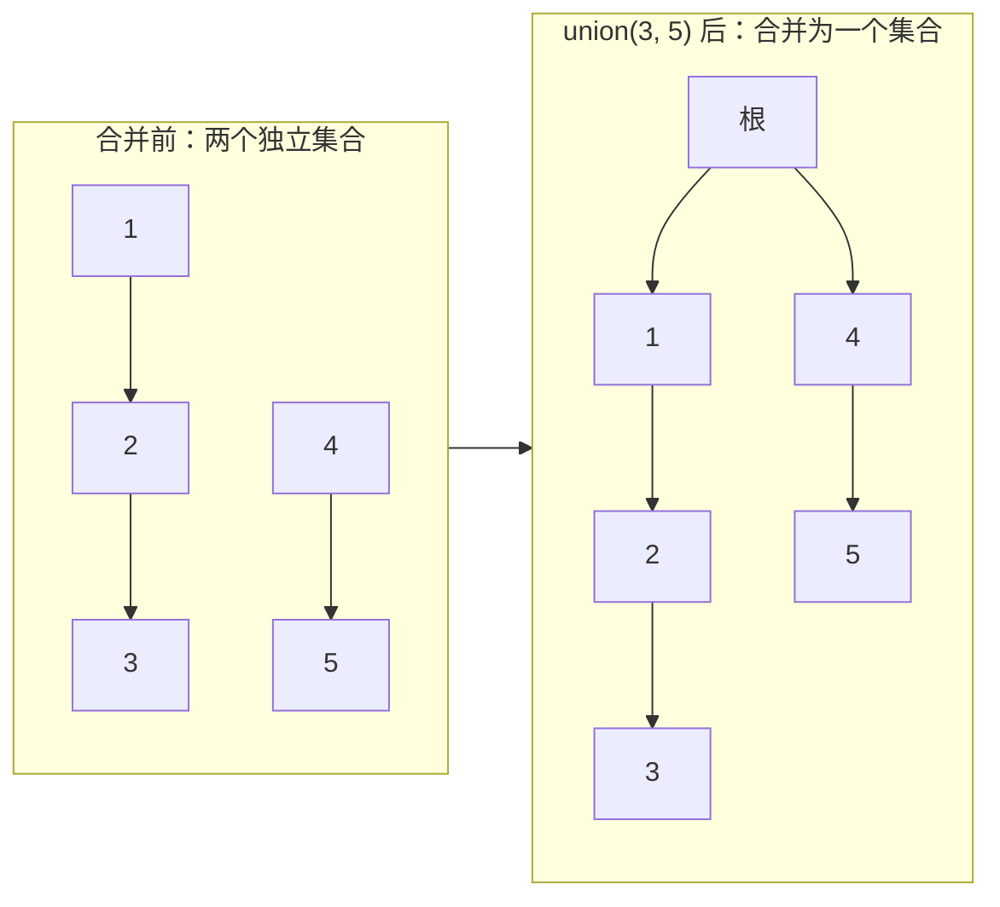
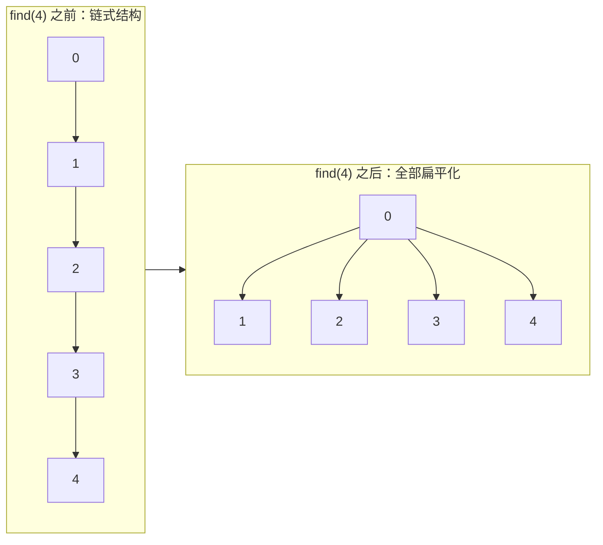
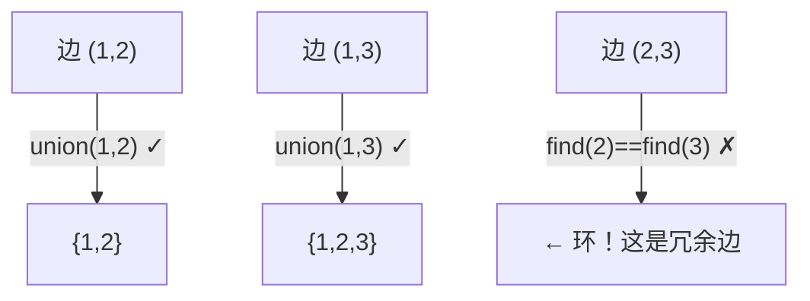

## 前置知识：并查集是什么

### 一句话定义

**并查集（Disjoint Set Union / Union-Find）**：管理若干**不相交集合**的数据结构，支持两个操作：

| 操作 | 含义 | 时间复杂度（优化后） |
|------|------|---------------------|
| `find(x)` | 找 x 所在集合的**根**（代表元） | 近似 O(1) |
| `union(x, y)` | 把 x 和 y 所在的**两个集合合并** | 近似 O(1) |



### 数据结构本质

并查集的底层是一个**森林**（多棵树）。每个节点指向它的父节点，根节点指向自己。

```python
# 最简单的表示：parent 数组
parent = list(range(n))  # parent[i] = i  → 初始时每个节点是自己的根
```

```python
# parent 数组的演化示例
# 初始：    [0, 1, 2, 3, 4]
# union(0,1): [0, 0, 2, 3, 4]   # 1 的父节点变成 0
# union(2,3): [0, 0, 2, 2, 4]   # 3 的父节点变成 2
# union(0,2): [0, 0, 0, 2, 4]   # 2 的父节点变成 0（0 的集合吞并了 2 的集合）
```

> [!tip] 并查集 vs 其他数据结构
>
> | 场景 | 用什么 |
> |------|--------|
> | 判断两个节点是否在同一个集合 | **并查集**（O(1)） |
> | 找两点之间的具体路径 | BFS / DFS |
> | 找图中是否有环 | 并查集（无向图） / DFS / 拓扑排序（有向图） |

---

## 核心模板

### 基础版（无优化）

```python
class UnionFind:
    def __init__(self, n):
        self.parent = list(range(n))  # 初始：每个节点的父节点是自己

    def find(self, x):
        """找到 x 的根节点"""
        while self.parent[x] != x:
            x = self.parent[x]
        return x

    def union(self, x, y):
        """合并 x 和 y 所在的集合"""
        root_x = self.find(x)
        root_y = self.find(y)
        if root_x != root_y:
            self.parent[root_y] = root_x  # 把 root_y 挂到 root_x 下面
```

> [!warning] 基础版的问题
> 如果每次 `union` 都让链变长，`find` 会退化成 O(n)。比如 `union(1,0)`, `union(2,1)`, `union(3,2)`... 形成一条链，`find(999)` 要爬 999 步。

### 优化一：路径压缩（Path Compression）

**核心思想**：在 `find` 的过程中，把路径上**所有节点**都直接指向根节点。下次再查就一步到位。

```python
def find(self, x):
    """找根的同时，把沿途节点全部拉直"""
    if self.parent[x] != x:
        self.parent[x] = self.find(self.parent[x])  # 递归压缩
    return self.parent[x]
```



### 优化二：按秩合并（Union by Rank / Size）

**核心思想**：永远把**小的树挂到大的树**下面，避免树过高。

```python
def union(self, x, y):
    root_x = self.find(x)
    root_y = self.find(y)
    if root_x != root_y:
        # 把 size 小的根挂到 size 大的根下面
        if self.size[root_x] < self.size[root_y]:
            root_x, root_y = root_y, root_x  # 保证 root_x 是大的
        self.parent[root_y] = root_x
        self.size[root_x] += self.size[root_y]
```

### 终极模板（路径压缩 + 按秩合并）

```python
class UnionFind:
    """并查集 — 路径压缩 + 按秩合并（按 size）"""

    def __init__(self, n):
        self.parent = list(range(n))
        self.size = [1] * n           # 记录每棵树的大小
        self.count = n                # 连通分量数量（可选，方便计数）

    def find(self, x):
        """找根 + 路径压缩"""
        if self.parent[x] != x:
            self.parent[x] = self.find(self.parent[x])
        return self.parent[x]

    def union(self, x, y):
        """合并 + 按大小合并"""
        rx, ry = self.find(x), self.find(y)
        if rx == ry:
            return False               # 已经在同一个集合里

        # 保证 rx 是较大的那棵树的根
        if self.size[rx] < self.size[ry]:
            rx, ry = ry, rx

        self.parent[ry] = rx
        self.size[rx] += self.size[ry]
        self.count -= 1                # 合并后连通分量减少
        return True                    # 合并成功

    def connected(self, x, y):
        """判断 x 和 y 是否连通"""
        return self.find(x) == self.find(y)
```

> [!important] 两种优化的复杂度
> 同时使用路径压缩和按秩合并时，`find` 和 `union` 的**均摊时间复杂度**为 **O(alpha(n))**，其中 `alpha(n)` 是阿克曼函数的反函数——对于任何实际输入都不会超过 5。**近似 O(1)**。

---

## 三大应用场景

### 场景一：判环 / 冗余连接（无向图）

**核心思路**：遍历每条边，如果两端点已经在同一集合中，说明这条边是多余的（形成环）。

```python
# 684. 冗余连接（Redundant Connection）
def findRedundantConnection(edges):
    n = len(edges)
    uf = UnionFind(n + 1)  # 节点编号从 1 开始
    for u, v in edges:
        if not uf.union(u, v):  # 已经在同一集合 → 这条边形成环
            return [u, v]
    return []
```



> [!tip] 判别思路
> 并查集判环只适用于**无向图**。有向图判环请用拓扑排序或 DFS 三色标记法。

### 场景二：连通分量计数

**核心思路**：初始化 `count = n`，每次成功 `union` 时 `count -= 1`，最终 `count` 就是连通分量数。

```python
# 547. 省份数量（Number of Provinces）
def findCircleNum(isConnected):
    n = len(isConnected)
    uf = UnionFind(n)
    for i in range(n):
        for j in range(i + 1, n):
            if isConnected[i][j] == 1:
                uf.union(i, j)
    return uf.count
```

```python
# 200. 岛屿数量（用并查集解）
def numIslands(grid):
    if not grid or not grid[0]:
        return 0
    m, n = len(grid), len(grid[0])
    uf = UnionFind(m * n)

    # 初始连通分量数 = '1' 的总数
    water = 0
    for i in range(m):
        for j in range(n):
            if grid[i][j] == '0':
                water += 1
    uf.count = m * n - water

    directions = [(0, 1), (1, 0)]  # 只向右和向下合并，避免重复
    for i in range(m):
        for j in range(n):
            if grid[i][j] == '1':
                for dx, dy in directions:
                    ni, nj = i + dx, j + dy
                    if 0 <= ni < m and 0 <= nj < n and grid[ni][nj] == '1':
                        uf.union(i * n + j, ni * n + nj)
    return uf.count
```

> [!tip] 岛屿数量：并查集 vs DFS
> 岛屿数量通常用 DFS/BFS 更直观。但**岛屿数量 II**（动态添加陆地，如 LeetCode 305）必须用并查集——每次添加一个陆地，实时合并邻居，查询连通分量数。

### 场景三：动态连通性

**核心思路**：一边添加元素/关系，一边用并查集维护连通状态，随时查询任意两点是否连通。

```python
# 990. 等式方程的可满足性
def equationsPossible(equations):
    uf = UnionFind(26)  # 26 个小写字母

    # 第一遍：处理所有 "=="，建立连通关系
    for eq in equations:
        if eq[1] == '=':
            a, b = ord(eq[0]) - 97, ord(eq[3]) - 97
            uf.union(a, b)

    # 第二遍：检查所有 "!="，看是否矛盾
    for eq in equations:
        if eq[1] == '!':
            a, b = ord(eq[0]) - 97, ord(eq[3]) - 97
            if uf.connected(a, b):
                return False  # 矛盾：本该不同，却属于同一个连通分量

    return True
```

```python
# 1319. 连通网络的操作次数
def makeConnected(n, connections):
    if len(connections) < n - 1:
        return -1  # 线不够，无论如何连不起来

    uf = UnionFind(n)
    redundant = 0  # 多余线缆数

    for u, v in connections:
        if not uf.union(u, v):  # 已经在同一集合，这条线多余
            redundant += 1

    # 连通分量数 - 1  = 需要的线缆数
    need = uf.count - 1
    return need if redundant >= need else -1
```

---

## 新手练习路线图

> [!important] 练习策略
> 先背熟终极模板（路径压缩 + 按秩合并），然后从判环入手，逐步扩展到连通分量和动态连通性。

```
阶段 1️⃣  入门（理解基本操作）
  ├── 547. 省份数量                    ← 最基础：连通分量计数
  └── 684. 冗余连接                    ← 经典判环

阶段 2️⃣  巩固
  ├── 200. 岛屿数量（并查集版）         ← 二维坐标 → 一维索引的转换
  ├── 1319. 连通网络的操作次数         ← 多余边 + 需要边
  └── 990. 等式方程的可满足性          ← 动态约束判断

阶段 3️⃣  进阶
  ├── 721. 账户合并                    ← 字符串映射 + 并查集
  ├── 399. 除法求值                    ← 带权并查集
  ├── 1202. 交换字符串中的元素         ← 连通分量排序
  └── 305. 岛屿数量 II                ← 动态添加陆地（会员题）

阶段 4️⃣  挑战
  ├── 685. 冗余连接 II                ← 有向图 + 并查集
  ├── 1631. 最小体力消耗路径          ← 并查集 + 二分
  └── 778. 水位上升的泳池中游泳        ← 并查集 + 排序
```

---

## 常见易错点

> [!warning] **坑 1：忘记路径压缩的写法**
> ```python
> # ❌ 这样写没有压缩效果
> def find(self, x):
>     while self.parent[x] != x:
>         x = self.parent[x]
>     return x
>
> # ✅ 递归压缩（推荐）
> def find(self, x):
>     if self.parent[x] != x:
>         self.parent[x] = self.find(self.parent[x])
>     return self.parent[x]
> ```
> 很多面试中的 bug 就是忘写 `self.parent[x] = ...` 这句。

> [!warning] **坑 2：合并时搞错根**
> ```python
> # ❌ 直接改 x 的父节点，没有找根
> def union(self, x, y):
>     self.parent[x] = y
>
> # ✅ 合并两个集合的根
> def union(self, x, y):
>     rx, ry = self.find(x), self.find(y)
>     if rx != ry:
>         self.parent[ry] = rx
> ```
> 如果只改 `x` 的父节点而不处理根，x 原来的兄弟节点（和 x 同根的其他节点）不会被合并进来。

> [!warning] **坑 3：二维坐标没有正确转换为一维索引**
> ```python
> # 网格大小为 m × n
> # ✅ idx = i * n + j（不是 i * m + j！）
> idx = i * n + j
>
> # 验证：第 i 行第 j 列，前面有 i 个完整行，每行 n 个
> ```

> [!warning] **坑 4：每次查询前没有调 find**
> ```python
> # ❌ 直接比较 parent[x]
> def connected(self, x, y):
>     return self.parent[x] == self.parent[y]
>
> # ✅ 比较 find(x)（确保路径压缩执行了）
> def connected(self, x, y):
>     return self.find(x) == self.find(y)
> ```

> [!warning] **坑 5：按秩合并时用 rank 而非 size**
> 按秩合并有两种常见实现：
> • **按 size**（树的大小）：推荐，语义直观
> • **按 rank**（树的高度近似）：两种效果差不多
>
> 但用 size 时，初始化是 `self.size = [1] * n`；用 rank 时，初始化是 `self.rank = [0] * n`。**不要混用**。

---

## 相关笔记

- [[图论基础与通用解题框架]] — 并查集是图论中处理连通性问题的高效工具
- [[动态规划基础与通用解题框架]] — 最优子结构与连通性判断是不同维度的方法论
- [[二叉树基础与通用解题框架]] — 树结构 vs 森林（并查集底层是森林）
