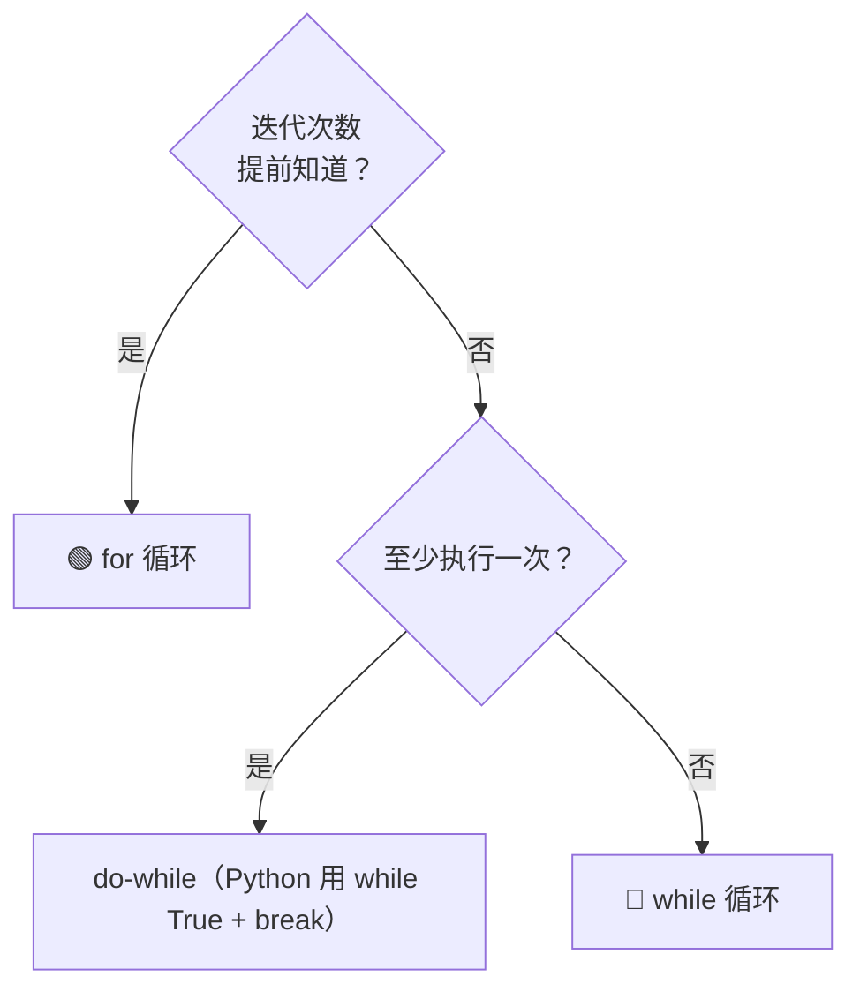

## 前置知识：循环是什么

循环 = **重复执行一段代码，直到条件不满足**。编程中最基本的控制结构之一。

---

## Python 中的三种循环

### `for` — 已知遍历范围

```python
# 遍历序列
for item in arr:
    ...

# 需要索引时
for i, item in enumerate(arr):
    ...

# 固定次数
for i in range(n):
    ...

# 遍历字典
for key, val in d.items():
    ...
```

### `while` — 条件驱动

```python
# 不知道确切次数，只知道终止条件
while condition:
    ...

# 经典：链表遍历
while node:
    node = node.next
```

### 嵌套循环

```python
# 双重循环 = 二维遍历
for i in range(m):
    for j in range(n):
        ...                     # O(m*n)
```

---

## 循环中的核心模式

### 模式 A：提前退出

```python
# 找到目标就终止
for item in arr:
    if 满足条件:
        return 结果            # break 或 return
```

### 模式 B：循环不变量

> [!important] 循环不变量
> 在循环的**每一次迭代开始前**，某个条件始终为真。
> 这是理解和写出正确循环的关键思维方式。

```python
# 二分查找中的循环不变量
# [l, r] 闭区间内一定包含 target（如果存在）
l, r = 0, len(nums) - 1
while l <= r:
    mid = l + (r - l) // 2
    if nums[mid] == target:
        return mid
    elif nums[mid] < target:
        l = mid + 1    # 维持不变量：target 在 [l, r] 中
    else:
        r = mid - 1
```

### 模式 C：双指针/滑动窗口中的循环

```python
# 双指针经典结构
l = 0
for r in range(len(arr)):      # r 自动前进
    while 需要收缩:
        l += 1                 # l 手动前进
```

### 模式 D：循环改写为递归

```python
# 循环版
def factorial_iter(n):
    res = 1
    for i in range(1, n+1):
        res *= i
    return res

# 递归版（等价）
def factorial_rec(n):
    if n <= 1:
        return 1
    return n * factorial_rec(n - 1)
```

---

## for vs while：什么时候用哪个？



| 场景 | 用什么 |
|------|--------|
| 遍历数组/列表所有元素 | `for` |
| 固定循环 N 次 | `for i in range(N)` |
| 链表遍历到末尾 | `while node:` |
| BFS 队列处理到空 | `while queue:` |
| 二分查找收缩区间 | `while l <= r:` |
| 不确定何时终止（如输入验证） | `while True + break` |

---

## 常见易错点

> [!warning] **坑 1：遍历时修改列表**
> ```python
> # ❌ for 遍历中删除元素会跳过元素
> for item in arr:
>     if item == target:
>         arr.remove(item)      # 索引错乱
>
> # ✅ 倒序遍历，或用列表推导
> arr = [x for x in arr if x != target]
> ```

> [!warning] **坑 2：`while` 忘记更新条件导致死循环**
> ```python
> # ❌ 死循环
> while i < n:
>     arr.append(i)
>     # 忘记 i += 1！
>
> # ✅
> while i < n:
>     arr.append(i)
>     i += 1
> ```

> [!warning] **坑 3：嵌套循环的复杂度误判**
> ```python
> # 这个不是 O(n^2)！
> l = 0
> for r in range(n):     # r 走 n 次
>     while ...:
>         l += 1         # l 总共最多走 n 次
> # 总复杂度 O(n)，不是 O(n^2)
> ```

> [!warning] **坑 4：`range()` 的边界**
> ```python
> range(5)      # [0, 1, 2, 3, 4] — 不含 5！
> range(1, 5)   # [1, 2, 3, 4]
> range(5, 0, -1)  # [5, 4, 3, 2, 1]
> ```

---

## 相关笔记

- [[递归基础与通用解题框架]] — 循环和递归的等价关系
- [[双指针基础与通用解题框架]] — for+while 的经典组合
- [[滑动窗口基础与通用解题框架]] — 循环中的窗口维护
- [[二分查找基础与通用解题框架]] — 循环不变量的经典应用
- [[BFS广度优先搜索基础与通用解题框架]] — while queue 循环
