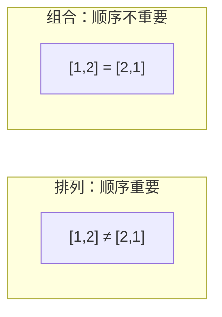
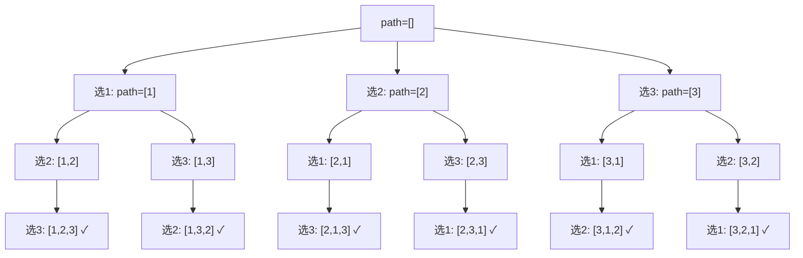
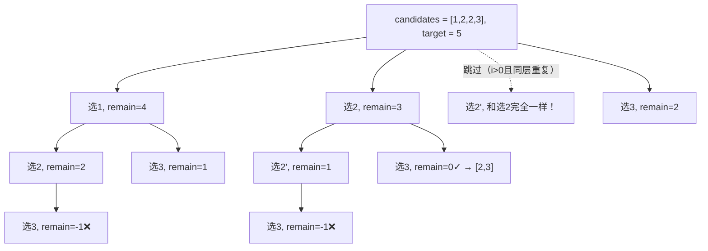

## 前置知识：排列 vs 组合

### 一句话区分

| | 排列（Permutation） | 组合（Combination） |
|---|---|---|
| **顺序重要？** | **是** — `[1,2]` 和 `[2,1]` 是不同的排列 | **否** — `[1,2]` 和 `[2,1]` 是同一种组合 |
| **去重方式** | `used` 数组（标记这个元素用过没） | `start` 指针（只能选当前位置及之后的元素） |
| **结果数量** | `P(n,k) = n! / (n-k)!` | `C(n,k) = n! / (k!(n-k)!)` |

```python
# 从 [1, 2, 3] 中选 2 个：
# 排列有 6 种：[1,2] [1,3] [2,1] [2,3] [3,1] [3,2]
# 组合有 3 种：[1,2] [1,3] [2,3]
```



### 去重策略速查

| 场景 | 去重方法 | 核心机制 |
|------|---------|---------|
| 无重复排列 | `used` 数组 | 跳过已用元素 |
| 有重复排列 | 排序 + `used[i-1]` 剪枝 | `nums[i] == nums[i-1] and not used[i-1]` 跳过同层重复 |
| 无重复组合 | `start` 指针 | 下一层从 `start+1` 开始，保证不回头 |
| 有重复组合 | 排序 + 跳过相邻相同 | `i > start and nums[i] == nums[i-1]` 跳过同层重复 |

> [!important] 核心记忆
> • **排列** = 每层遍历**全部元素**，用 `used` 跳过已选的
> • **组合** = 每层只选**当前及之后的元素**，用 `start` 保证不回头

---

## 四大核心模板

### 模板一：无重复排列（全排列）

**LeetCode 46. 全排列**

```python
def permute(nums):
    """数组中无重复元素，返回所有排列"""
    n = len(nums)
    ans = []
    path = []
    used = [False] * n  # 标记哪些索引已经用过

    def backtrack():
        if len(path) == n:
            ans.append(list(path))  # ⚠️ 拷贝！
            return

        for i in range(n):              # ← 每层遍历全部元素
            if used[i]:                   #  跳过已经用过的
                continue
            path.append(nums[i])          #  做选择
            used[i] = True
            backtrack()                   #  递归
            path.pop()                    #  撤销选择（回溯）
            used[i] = False

    backtrack()
    return ans
```



---

### 模板二：有重复排列（排序 + 剪枝）

**LeetCode 47. 全排列 II**

```python
def permuteUnique(nums):
    """数组中可能有重复元素，返回所有不重复的排列"""
    nums.sort()                           # ① 排序：让相同元素相邻
    n = len(nums)
    ans = []
    path = []
    used = [False] * n

    def backtrack():
        if len(path) == n:
            ans.append(list(path))
            return

        for i in range(n):
            if used[i]:
                continue
            # ② 剪枝：跳过同一层的重复元素
            # 如果 nums[i] == nums[i-1] 且 nums[i-1] 在同一层没被用
            # 说明这个分支和上一个分支会产生一模一样的排列
            if i > 0 and nums[i] == nums[i-1] and not used[i-1]:
                continue

            path.append(nums[i])
            used[i] = True
            backtrack()
            path.pop()
            used[i] = False

    backtrack()
    return ans
```

> [!warning] 剪枝条件为什么是 `not used[i-1]`？
>
> 有两种写法都能去重：
> ```python
> # 写法 A：not used[i-1]（效率更高，跳过"同一层"的重复）
> if i > 0 and nums[i] == nums[i-1] and not used[i-1]:
>     continue
>
> # 写法 B：used[i-1]（也能去重，但跳过"同一路径"的重复）
> if i > 0 and nums[i] == nums[i-1] and used[i-1]:
>     continue
> ```
>
> 两种都能得到正确答案，但**写法 A（`not used[i-1]`）更高效**，因为它在递归树较浅的层就剪枝了。

> [!tip] 去重核心理解
> 画出递归树，`[1, 1', 2]` 中：
> • 第一个 1 开头的分支 = 第二个 1' 开头的分支（结果完全一样）
> • 所以要保证：对于相同的数，只有第一个没被用过的才能作为这一层的起点
> • `nums[i] == nums[i-1] and not used[i-1]` 的意思就是"前一个相同的数还没被用 → 说明你是同层的重复 → 跳过"

---

### 模板三：无重复组合

**LeetCode 77. 组合**

```python
def combine(n, k):
    """从 1 到 n 中选 k 个数的所有组合"""
    ans = []
    path = []

    def backtrack(start):
        if len(path) == k:
            ans.append(list(path))
            return

        # 剪枝优化：剩下的数不够凑齐 k 个，提前终止
        for i in range(start, n + 1):
            if n - i + 1 < k - len(path):  # 剪枝
                break
            path.append(i)
            backtrack(i + 1)  # ← 下一层从 i+1 开始（不回头！）
            path.pop()

    backtrack(1)
    return ans
```

**LeetCode 39. 组合总和**

```python
def combinationSum(candidates, target):
    """每个数可选无限次，找所有和为 target 的组合"""
    ans = []
    path = []

    def backtrack(start, remaining):
        if remaining == 0:
            ans.append(list(path))
            return
        if remaining < 0:
            return

        for i in range(start, len(candidates)):
            path.append(candidates[i])
            backtrack(i, remaining - candidates[i])  # ← 从 i 开始（可重复选）
            #   ↑ 不是 i+1，因为同一个数能选多次
            path.pop()

    backtrack(0, target)
    return ans
```

> [!important] `start` vs `i+1` vs `i`
>
> | 写法 | 含义 | 适用场景 |
> |------|------|---------|
> | `backtrack(i + 1)` | 下一层不能选当前及之前的元素 | 每个元素最多选一次（标准组合） |
> | `backtrack(i)` | 下一层可以选当前元素及之后的 | 同一元素能选多次（组合总和） |
> | 不用 start，用 `used` | 每层遍历全体 | 排列 |

---

### 模板四：有重复组合（排序 + 跳过相邻相同）

**LeetCode 90. 子集 II**

```python
def subsetsWithDup(nums):
    """包含重复元素的数组，返回所有不重复的子集"""
    nums.sort()  # 排序：让相同元素相邻
    n = len(nums)
    ans = []
    path = []

    def backtrack(start):
        ans.append(list(path))  # 每个节点都是答案（子集题的特征）

        for i in range(start, n):
            # 跳过同层重复
            if i > start and nums[i] == nums[i-1]:
                continue
            path.append(nums[i])
            backtrack(i + 1)
            path.pop()

    backtrack(0)
    return ans
```

**LeetCode 40. 组合总和 II**

```python
def combinationSum2(candidates, target):
    """每个数最多用一次，数组有重复，找所有和为 target 的不重复组合"""
    candidates.sort()  # 排序：让相同元素相邻
    ans = []
    path = []

    def backtrack(start, remaining):
        if remaining == 0:
            ans.append(list(path))
            return
        if remaining < 0:
            return

        for i in range(start, len(candidates)):
            # 剪枝一：同层跳过重复元素
            if i > start and candidates[i] == candidates[i-1]:
                continue
            # 剪枝二：剩下的都太大，提前终止
            if candidates[i] > remaining:
                break

            path.append(candidates[i])
            backtrack(i + 1, remaining - candidates[i])  # i+1，每个最多用一次
            path.pop()

    backtrack(0, target)
    return ans
```



---

## 四大模板速查表

| 模板 | 特征 | 关键机制 | LeetCode |
|------|------|---------|----------|
| 无重复排列 | `for i in range(n)` (遍历全部) | `used[i]` 跳过已选 | 46 |
| 有重复排列 | 排序 + 遍历全部 | `used[i]` + `not used[i-1]` 剪枝 | 47 |
| 无重复组合 | `for i in range(start, n)` | `start` 保证不回头 | 77, 39 |
| 有重复组合 | 排序 + `range(start, n)` | `start` + `i > start and nums[i]==nums[i-1]` | 40, 90 |

---

## Python 内置工具

当题目没有特殊约束时，可以直接用 `itertools` 快速生成排列组合：

```python
import itertools

# ===== 排列 =====
# permutations(iterable, r) — 无重复排列
list(itertools.permutations([1, 2, 3], 2))
# 结果: [(1,2), (1,3), (2,1), (2,3), (3,1), (3,2)]

# permutations — 有重复元素时会产生重复结果！
list(itertools.permutations([1, 1, 2], 2))
# 结果: [(1,1), (1,2), (1,1), (1,2), (2,1), (2,1)]
#                                       ↑ 重复的！需要手动 set() 去重

# ===== 组合 =====
# combinations(iterable, r) — 无重复组合
list(itertools.combinations([1, 2, 3], 2))
# 结果: [(1,2), (1,3), (2,3)]

# combinations_with_replacement(iterable, r) — 可重复组合
list(itertools.combinations_with_replacement([1, 2, 3], 2))
# 结果: [(1,1), (1,2), (1,3), (2,2), (2,3), (3,3)]
# 相当于组合总和里允许重复选同一个数

# ===== 笛卡尔积 =====
# product(*iterables, repeat=1)
list(itertools.product([1, 2], ['a', 'b']))
# 结果: [(1,'a'), (1,'b'), (2,'a'), (2,'b')]
# repeat = r 时，相当于 n 选 r 的排列（每个位置独立选，不考虑去重）
```

> [!warning] `itertools` 在面试中的使用
> • 可以提一句"有现成的库"，但**千万别直接调库交卷**——面试官要看你写回溯
> • 作为**验证答案**的工具非常方便：用回溯写出答案后，和 `itertools` 结果比对

---

## 新手练习路线图

> [!important] 练习策略
> 先背熟"无重复排列"和"无重复组合"两个基础模板，再往上面加去重逻辑。排列组合是回溯的基石。

```
阶段 1️⃣  无重复 — 打基础
  ├── 46.  全排列                       ← 理解 used[] 的作用
  ├── 77.  组合                         ← 理解 start 的作用
  └── 78.  子集                         ← 理解子集 = 组合 + 每个节点都是答案

阶段 2️⃣  元素可重复使用
  ├── 39.  组合总和                     ← 理解 start 不 +1 的含义
  └── 17.  电话号码的字母组合           ← 多数组组合

阶段 3️⃣  含重复元素 — 去重
  ├── 47.  全排列 II                    ← 掌握排序 + not used[i-1] 剪枝
  ├── 40.  组合总和 II                  ← 掌握排序 + i>start 剪枝
  └── 90.  子集 II                      ← 组合去重的另一个应用

阶段 4️⃣  带约束的排列组合
  ├── 22.  括号生成                     ← 排列 + 平衡约束
  ├── 216. 组合总和 III                 ← 组合 + 固定个数
  ├── 131. 分割回文串                   ← 分割 = 组合的一种特殊形式
  └── 51.  N皇后                        ← 排列 + 对角约束
```

---

## 常见易错点

> [!warning] **坑 1：排列和组合的核心去重方式搞混**
> ```python
> # ❌ 组合题用 used[] 去重——会产生重复组合、搜索树膨胀
> def combine_wrong(n, k):
>     used = [False] * (n + 1)
>     def backtrack():
>         if len(path) == k:
>             ans.append(list(path))
>             return
>         for i in range(1, n + 1):
>             if used[i]:
>                 continue
>             used[i] = True
>             path.append(i)
>             backtrack()
>             path.pop()
>             used[i] = False
>     # used 只能拦"同一条路径上重复使用同一个元素"，拦不住"顺序不同"：
>     # [1,2] 进结果后，[2,1] 不会被 used 拦住，也照样进结果——
>     # 组合语义下 [1,2] 和 [2,1] 是同一个，结果集出现重复，搜索树也膨胀成排列规模
>
> # ✅ 组合题应该用 start 指针（从源头保证不回头，不产生重复）
> def backtrack(start):
>     if len(path) == k:
>         ans.append(list(path))
>         return
>     for i in range(start, n + 1):
>         path.append(i)
>         backtrack(i + 1)   # 保证不回头
>         path.pop()
> # 若被迫沿用 used 写法，只能靠收集时 map(tuple, sorted(path)) 去重亡羊补牢
> ```

> [!warning] **坑 2：收集答案时忘记 list() 拷贝**
> ```python
> # ❌ 直接 append(path)，后续 path 被 pop 会修改已收集的结果
> def backtrack():
>     if 终止条件:
>         ans.append(path)   # ← 错的！引用同一个 list
>         return
>
> # ✅ 拷贝一份
> def backtrack():
>     if 终止条件:
>         ans.append(list(path))  # 或 ans.append(path[:])
>         return
> ```

> [!warning] **坑 3：回溯时 forget to pop()**
> ```python
> # ❌ 忘了 pop —— path 永远不会被清干净
> def backtrack(start):
>     path.append(num)
>     backtrack(start + 1)
>     # 缺少 path.pop()！
>
> # ✅ 做选择 → 递归 → 撤销选择（成对出现）
> def backtrack(start):
>     path.append(num)        # 做选择
>     backtrack(start + 1)    # 递归
>     path.pop()              # 撤销选择（必须！）
> ```

> [!warning] **坑 4：去重时忘了先排序**
> ```python
> # ❌ 不排序就去重——相邻相同元素检测失效
> nums = [2, 1, 2]
> # 2 和 1 之间还有个 2，无法用 nums[i] == nums[i-1] 检测
>
> # ✅ 先排序
> nums.sort()  # [1, 2, 2] — 相同元素现在相邻了
> # 这时 nums[i] == nums[i-1] 才能检测到重复
> ```

> [!warning] **坑 5：有重复排列的剪枝条件写错**
> ```python
> # 容易写错的两个方向：
> # ❌ used[i-1] == True  → 也能去重，但效率低（剪枝在深层）
> # ✅ not used[i-1]     → 效率高（剪枝在浅层，推荐）
>
> if i > 0 and nums[i] == nums[i-1] and not used[i-1]:
>     continue
> ```

---

## 相关笔记

- [[回溯基础与通用解题框架]] — 排列组合是回溯法的核心应用场景，回溯的"选择-递归-撤销"三步骤在这里体现得最清晰
- [[DFS深度优先搜索基础与通用解题框架]] — DFS 是回溯的底层遍历方式
- [[动态规划基础与通用解题框架]] — DP 求排列数/组合数（计数），回溯是穷举所有具体方案
