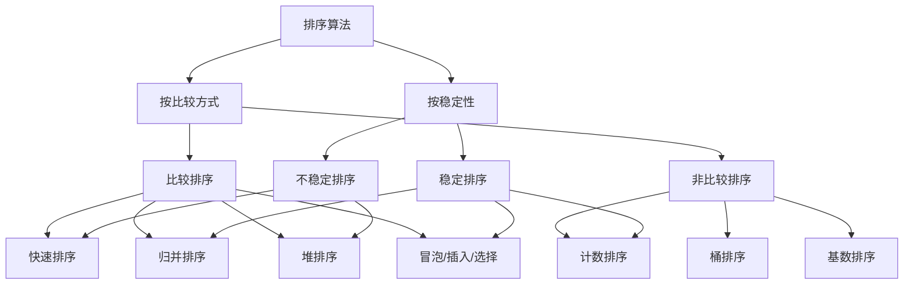
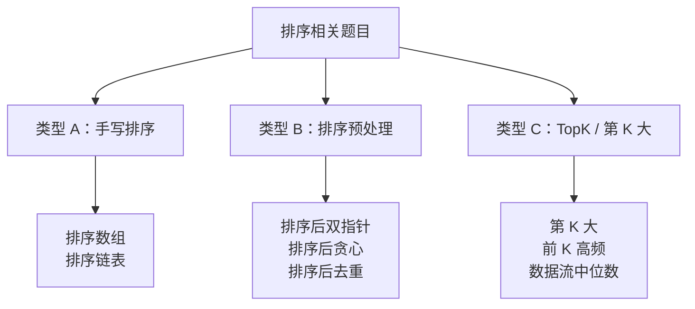

## 前置知识：排序的分类

### 两个维度看懂所有排序算法



### 比较排序 vs 非比较排序

| | 比较排序 | 非比较排序 |
|---|---|---|
| **原理** | 通过比较元素大小决定顺序 | 利用元素的"位"或"范围"特性 |
| **时间复杂度下限** | O(n log n)（决策树证明） | 可突破 O(n log n)，达到 O(n + k) |
| **适用范围** | 任何可比较的类型 | 整数 / 有限范围的数据 |
| **额外空间** | 通常 O(1) 或 O(log n) | 通常 O(n + k) |
| **典型算法** | 快排、归并、堆排 | 计数、桶、基数 |

### 稳定 vs 不稳定

> [!info] 稳定性指什么
> 相等的元素在排序后，它们的**相对先后顺序**保持不变。

```
原始: [5a, 3, 5b, 2]   （5a 在 5b 前面）
稳定排序后:   [2, 3, 5a, 5b]   ← 5a 仍在 5b 前 ✅
不稳定排序后: [2, 3, 5b, 5a]   ← 5b 跑到 5a 前面了 ❌
```

| 稳定排序 | 不稳定排序 |
|---------|----------|
| 归并排序 | 快速排序 |
| 冒泡排序 | 堆排序 |
| 插入排序 | 选择排序 |
| 计数排序 | 希尔排序 |

> [!tip] 什么时候需要稳定性
> 带"次级排序键"时：如先按成绩排，成绩相同的按学号排。稳定排序只需排两次（先排次级键，再排主键）；不稳定排序必须一次排完。

---

## 必掌握的四种排序

### 速查总表

| 排序 | 平均时间 | 最坏时间 | 空间 | 稳定 | 核心思想 |
|------|---------|---------|------|------|---------|
| 快速排序 | O(n log n) | O(n^2) | O(log n) | ❌ | 分治 + partition |
| 归并排序 | O(n log n) | O(n log n) | O(n) | ✅ | 分治 + 合并有序数组 |
| 堆排序 | O(n log n) | O(n log n) | O(1) | ❌ | 堆维护最值 |
| 计数排序 | O(n + k) | O(n + k) | O(n + k) | ✅ | 统计频次 |

---

### 快速排序（Quick Sort）—— 面试最高频

**核心思想**：每次选一个 `pivot`（基准值），把数组分成「小于 pivot」和「大于 pivot」两部分，然后递归处理两边。

```python
# ====== 快速排序 ======
import random

def quick_sort(nums, left, right):
    if left >= right:
        return

    pivot_idx = partition(nums, left, right)
    quick_sort(nums, left, pivot_idx - 1)
    quick_sort(nums, pivot_idx + 1, right)

def partition(nums, left, right):
    """
    分区函数：选一个 pivot，把 <= pivot 的放左边，> pivot 的放右边
    返回 pivot 最终所在的位置
    """
    # 随机选 pivot 并交换到最右边（避免最坏情况）
    rand_idx = random.randint(left, right)
    nums[rand_idx], nums[right] = nums[right], nums[rand_idx]

    pivot = nums[right]
    i = left - 1                      # i 指向「已处理的小于区」的末尾

    for j in range(left, right):
        if nums[j] <= pivot:
            i += 1
            nums[i], nums[j] = nums[j], nums[i]

    nums[i + 1], nums[right] = nums[right], nums[i + 1]
    return i + 1                      # pivot 的最终位置
```

**partition 过程图解**：

```
pivot = 4（最右端）
初始: [3, 7, 1, 6, 2, 4]
       ↑i=-1

j=0, 3≤4: i=0, swap(0,0) → [3, 7, 1, 6, 2, 4]
j=1, 7>4:  跳过
j=2, 1≤4: i=1, swap(1,2) → [3, 1, 7, 6, 2, 4]
j=3, 6>4:  跳过
j=4, 2≤4: i=2, swap(2,4) → [3, 1, 2, 6, 7, 4]

最后一 swap: i+1=3, swap(3,5) → [3, 1, 2, 4, 7, 6]
                                   ↑ pivot 就位
```

> [!tip] 一句口诀
> **「随机选 pivot 扔最后，遍历换小 i 就加，最后归位分两边。」**

**为什么随机选 pivot**：如果数组已经有序，每次都选最右边做 pivot 会导致每次只排除一个元素，退化为 O(n^2)。随机选 pivot 将这种概率降到极低。

**快排的三大用途**：

| 用途 | 说明 | 相关题 |
|------|------|--------|
| 排序 | 基本功能 | 912. 排序数组 |
| 第 K 大 / TopK | partition 后 pivot 位置 = 排好序的位置 | 215. 数组中的第K个最大元素 |
| 颜色分类 / 三路 | 分三段而非两段（< pivot, = pivot, > pivot） | 75. 颜色分类 |

---

### 归并排序（Merge Sort）—— 稳定 + 适合链表

**核心思想**：先递归把数组切成单个元素，再两两合并有序数组。

```python
# ====== 归并排序 ======
def merge_sort(nums):
    if len(nums) <= 1:
        return nums

    mid = len(nums) // 2
    left  = merge_sort(nums[:mid])     # ① 分：递归排序左半
    right = merge_sort(nums[mid:])     # ② 分：递归排序右半

    return merge(left, right)          # ③ 治：合并两个有序数组

def merge(left, right):
    """合并两个有序数组"""
    result = []
    i = j = 0

    while i < len(left) and j < len(right):
        if left[i] <= right[j]:
            result.append(left[i])
            i += 1
        else:
            result.append(right[j])
            j += 1

    # 把剩余元素追加到末尾
    result.extend(left[i:])
    result.extend(right[j:])
    return result
```

**merge 过程图解**：

```
left  = [1, 3, 6]      right = [2, 4, 5]
         ↑i                     ↑j

i=0,j=0: 1<2 → 放 1, i++
i=1,j=0: 3>2 → 放 2, j++
i=1,j=1: 3<4 → 放 3, i++
i=2,j=1: 6>4 → 放 4, j++
i=2,j=2: 6>5 → 放 5, j++
j 走完，追加 left[2:] = [6]

结果: [1, 2, 3, 4, 5, 6]
```

> [!tip] 一句口诀
> **「先分后合，左右各有序，双指针合并，谁小谁先进。」**

**归并排序的三大用途**：

| 用途 | 说明 | 相关题 |
|------|------|--------|
| 排序 | 稳定排序，适合链表 | 148. 排序链表 |
| 求逆序对 | `merge` 时统计「左 > 右」的次数 | 剑指 Offer 51. 数组中的逆序对 |
| 合并 K 个有序链表 | 分治归并 | 23. 合并 K 个升序链表 |

**求逆序对的核心代码**：

```python
def merge_and_count(left, right):
    result, count = [], 0
    i = j = 0
    while i < len(left) and j < len(right):
        if left[i] <= right[j]:
            result.append(left[i])
            i += 1
        else:
            result.append(right[j])
            # left 中从 i 到末尾的所有元素都 > right[j]
            count += len(left) - i     # ← 关键！
            j += 1
    result.extend(left[i:])
    result.extend(right[j:])
    return result, count
```

---

### 堆排序（Heap Sort）—— TopK 首选

**核心思想**：用堆（优先队列）维护当前的最值，每次弹出堆顶。

```python
# ====== 堆排序（用小顶堆） ======
import heapq

def heap_sort(nums):
    heapq.heapify(nums)               # O(n) 建堆
    result = []
    while nums:
        result.append(heapq.heappop(nums))  # 每次弹出最小值 O(log n)
    return result

# ====== 手动实现堆排序（大顶堆 + 原地排序） ======
def heap_sort_inplace(nums):
    n = len(nums)

    # ① 建大顶堆：从最后一个非叶子节点开始下沉
    for i in range(n // 2 - 1, -1, -1):
        sift_down(nums, n, i)

    # ② 逐个将堆顶（最大值）交换到末尾
    for i in range(n - 1, 0, -1):
        nums[0], nums[i] = nums[i], nums[0]   # 最大值归位
        sift_down(nums, i, 0)                  # 剩下部分重新下沉

def sift_down(nums, heap_size, i):
    """大顶堆下沉：把 nums[i] 下沉到合适位置"""
    largest = i
    left  = 2 * i + 1
    right = 2 * i + 2

    if left < heap_size and nums[left] > nums[largest]:
        largest = left
    if right < heap_size and nums[right] > nums[largest]:
        largest = right

    if largest != i:
        nums[i], nums[largest] = nums[largest], nums[i]
        sift_down(nums, heap_size, largest)     # 继续下沉
```

> [!tip] 一句口诀
> **「大顶堆找第 K 小，小顶堆找第 K 大，堆顶=答案。」**

**堆排序的三大用途**：

| 用途 | 说明 | 相关题 |
|------|------|--------|
| TopK | 大小为 K 的堆，O(n log k) | 215. 第 K 大元素 |
| 数据流中位数 | 大小堆对顶 | 295. 数据流的中位数 |
| 合并 K 个有序链表 | 小顶堆维护 K 个头的 min | 23. 合并 K 个升序链表 |

---

### 计数排序（Counting Sort）—— 范围小时最快

**核心思想**：统计每个值出现的次数，按顺序重建数组。

```python
# ====== 计数排序 ======
def counting_sort(nums):
    if not nums:
        return []

    min_val, max_val = min(nums), max(nums)
    count_range = max_val - min_val + 1

    # ① 统计频次
    count = [0] * count_range
    for num in nums:
        count[num - min_val] += 1

    # ② 按频次重建
    result = []
    for i, freq in enumerate(count):
        result.extend([i + min_val] * freq)

    return result
```

**过程图解**：

```
nums = [3, 1, 4, 1, 3, 5, 3]
min=1, max=5, range=5

count 数组（索引 0→值 1, 索引 1→值 2, ...）:
值:      1  2  3  4  5
count:  [2, 0, 3, 1, 1]

重建: 1×2, 2×0, 3×3, 4×1, 5×1
→ [1, 1, 3, 3, 3, 4, 5]
```

> [!tip] 一句口诀
> **「数据范围小，计数跑不了；O(n + k)，空间换时间。」**

> [!warning] 计数排序的局限
> 只适合**整数**且**范围不太大**的场景。如果数据范围是 [0, 10^9]，数组只有 10 个数，计数排序会浪费巨大空间。此时应改用快排或归并。

**计数排序的用途**：

| 用途 | 说明 | 相关题 |
|------|------|--------|
| 整数排序 | 范围小、数据量大 | 912. 排序数组（部分场景） |
| 基数排序的基础 | 每位用计数排序 | — |
| 字符串排序 | 字母只有 26 种 | 49. 字母异位词分组 |

---

## Python 内置排序

### Timsort 是什么

Python 的 `sorted()` 和 `.sort()` 底层都是 **Timsort**——归并排序 + 插入排序的混合算法。

| 特性 | 说明 |
|------|------|
| 时间复杂度 | O(n log n) 平均和最坏 |
| 最好情况 | O(n)（已有序数组） |
| 空间 | O(n) |
| 稳定性 | ✅ 稳定 |
| 优化 | 识别已有序的连续子数组（run），减少归并次数 |

### 什么时候直接用内置排序

```python
# 基本用法
nums = [3, 1, 4, 1, 5, 9]
sorted_nums = sorted(nums)          # 返回新列表，原列表不变
nums.sort()                          # 原地排序，返回 None

# 自定义排序键
words = ["apple", "banana", "kiwi"]
sorted(words, key=len)               # 按长度排 → ['kiwi', 'apple', 'banana']

# 复合排序键
students = [("Alice", 90), ("Bob", 85), ("Charlie", 90)]
sorted(students, key=lambda x: (-x[1], x[0]))   # 成绩降序，姓名升序

# 自定义比较器（Python 3 用 functools.cmp_to_key）
from functools import cmp_to_key
def compare(a, b):
    return a - b   # 负数 a 在前，正数 b 在前
sorted(nums, key=cmp_to_key(compare))
```

> [!tip] 经验法则
> **90% 的算法题，直接用 `sorted()` 就够了。** 只有题目明确要求「手写排序」或「利用排序过程中的中间状态」时，才需要自己写。不要在面试中手写快排除非被明确要求——直接用内置，把时间留给核心逻辑。

### 哪些题必须手写排序

| 场景 | 原因 | 典型题 |
|------|------|--------|
| 要求 O(1) 空间 | 快排 partition 原地操作 | 215. 第 K 大（堆也行） |
| 求逆序对 | 需要 merge 过程的中间信息 | 剑指 Offer 51 |
| 利用 partition 思想 | 只需找到位置，不需要全排 | 215、347（桶排变种） |
| 链表排序 | 内置排序不适用于链表 | 148. 排序链表 |

---

## 排序的三种考题类型



---

### 类型 A：手写排序

面试官让你写快排的 partition 或归并的 merge。

```python
# 最常见的面试要求：写 partition 函数
def partition(nums, left, right):
    pivot = nums[right]
    i = left - 1
    for j in range(left, right):
        if nums[j] <= pivot:
            i += 1
            nums[i], nums[j] = nums[j], nums[i]
    nums[i + 1], nums[right] = nums[right], nums[i + 1]
    return i + 1
```

**识别信号**：题目直接说「实现快速排序」「实现归并排序」，或者让你在链表上排序（只能用归并）。

---

### 类型 B：利用排序预处理

排序本身不是目的，而是**为后续算法创造条件**。排序后，很多问题变得简单：

```python
# 模式 1：排序后双指针
# 例题：15. 三数之和
def threeSum(nums):
    nums.sort()                                # ① 先排序
    res = []
    for i in range(len(nums)):
        if i > 0 and nums[i] == nums[i - 1]:   # 跳过重复
            continue
        l, r = i + 1, len(nums) - 1
        while l < r:                           # ② 双指针
            total = nums[i] + nums[l] + nums[r]
            if total == 0:
                res.append([nums[i], nums[l], nums[r]])
                l += 1
                while l < r and nums[l] == nums[l - 1]: l += 1
            elif total < 0:
                l += 1
            else:
                r -= 1
    return res

# 模式 2：排序后贪心
# 例题：455. 分发饼干
def findContentChildren(g, s):
    g.sort()
    s.sort()
    i = j = 0
    while i < len(g) and j < len(s):
        if s[j] >= g[i]:   # 饼干满足胃口
            i += 1
        j += 1
    return i

# 模式 3：排序后合并区间
# 例题：56. 合并区间
def merge(intervals):
    intervals.sort(key=lambda x: x[0])          # 按起点排序
    res = [intervals[0]]
    for start, end in intervals[1:]:
        if start <= res[-1][1]:                 # 有重叠
            res[-1][1] = max(res[-1][1], end)
        else:
            res.append([start, end])
    return res
```

> [!tip] 什么时候先排序
> 看到以下关键词马上想排序：
> • "三数之和""四数之和" → 排序 + 双指针
> • "合并""重叠" → 按起点排序
> • "分发""分配" → 排序 + 贪心
> • "去重" → 排序后相邻比较

**相关题目**：

| 题号 | 题目 | 排序后做什么 |
|------|------|------------|
| 15 | 三数之和 | 双指针 |
| 16 | 最接近的三数之和 | 双指针 |
| 18 | 四数之和 | 双指针 |
| 56 | 合并区间 | 一次遍历 |
| 455 | 分发饼干 | 贪心 |
| 435 | 无重叠区间 | 按终点排 + 贪心 |
| 452 | 用最少的箭射气球 | 按终点排 + 贪心 |

---

### 类型 C：TopK / 第 K 大

最经典的考察方式：不需要全排序，只要找到第 K 大（或前 K 个）。

```python
# 解法 1：堆（最通用）— O(n log k)
import heapq
def findKthLargest(nums, k):
    heap = []
    for num in nums:
        heapq.heappush(heap, num)
        if len(heap) > k:
            heapq.heappop(heap)      # 保持堆大小为 k，堆顶 = 第 K 大
    return heap[0]

# 解法 2：快排 partition — O(n) 期望
import random
def findKthLargest_partition(nums, k):
    """第 K 大 = 第 n-k 小（从 0 开始）"""
    target = len(nums) - k
    left, right = 0, len(nums) - 1

    while True:
        pivot_idx = partition(nums, left, right)
        if pivot_idx == target:
            return nums[pivot_idx]
        elif pivot_idx < target:
            left = pivot_idx + 1
        else:
            right = pivot_idx - 1

# 解法 3：计数/桶排 — 范围小时 O(n)
def findKthLargest_bucket(nums, k):
    min_v, max_v = min(nums), max(nums)
    bucket = [0] * (max_v - min_v + 1)
    for num in nums:
        bucket[num - min_v] += 1

    for i in range(len(bucket) - 1, -1, -1):
        k -= bucket[i]
        if k <= 0:
            return i + min_v
```

| 解法 | 时间 | 空间 | 适用场景 |
|------|------|------|---------|
| 堆 | O(n log k) | O(k) | k 很小，或数据流 |
| 快排 partition | O(n) 期望 | O(1) | k 任意，需原地操作 |
| 计数/桶 | O(n) | O(范围) | 数据范围小 |

---

## 新手练习路线图

> [!important] 练习策略
> 先能用内置排序解题 → 再手写核心函数 → 最后做变形题。不要上来就背完整的快排。

```
阶段 1️⃣  排序预处理（感受"排序为后续服务"）
  ├── 15.  三数之和                  ← 排序 + 双指针，最经典
  ├── 56.  合并区间                  ← 排序 + 一次遍历
  └── 455. 分发饼干                  ← 排序 + 贪心

阶段 2️⃣  手写核心函数（面试高频）
  ├── 912. 排序数组                  ← 快排 + 归并，完整手写
  ├── 215. 数组中的第K个最大元素       ← partition 只找不排
  └── 75.  颜色分类                  ← 三路 partition（荷兰国旗）

阶段 3️⃣  归并排序专场
  ├── 148. 排序链表                  ← 归并排序在链表上的应用
  ├── 剑指 Offer 51. 数组中的逆序对    ← merge 过程中计数
  └── 23.  合并 K 个升序链表          ← 分治归并 / 堆

阶段 4️⃣  TopK 问题
  ├── 347. 前 K 个高频元素            ← 堆 / 桶排序
  ├── 451. 根据字符出现频率排序        ← 桶排序
  └── 295. 数据流的中位数             ← 对顶堆

阶段 5️⃣  自定义排序
  ├── 179. 最大数                    ← 自定义比较器的排序
  └── 791. 自定义字符串排序           ← 自定义字母序
```

---

## 常见易错点

> [!warning] **坑 1：快排 pivot 选最右 + 已有序数组 = O(n^2)**
> ```python
> # ❌ 每次都选最右边，遇到已排序数组退化为 O(n^2)
> pivot = nums[right]
>
> # ✅ 随机选 pivot 再交换到最右边
> rand_idx = random.randint(left, right)
> nums[rand_idx], nums[right] = nums[right], nums[rand_idx]
> pivot = nums[right]
> ```
> 面试时加上随机化一行，面试官会眼前一亮。

> [!warning] **坑 2：归并排序的额外空间**
> ```python
> # ❌ 每次 merge 都创建新列表，空间 O(n log n)
> def merge_sort(nums):
>     ...
>     left = merge_sort(nums[:mid])    # 切片创建新列表
>     right = merge_sort(nums[mid:])
>
> # ✅ 只用一个辅助数组，原地合并（更高效）
> def merge_sort_inplace(nums, left, right, temp):
>     if left >= right: return
>     mid = (left + right) // 2
>     merge_sort_inplace(nums, left, mid, temp)
>     merge_sort_inplace(nums, mid + 1, right, temp)
>     merge_inplace(nums, left, mid, right, temp)
> ```

> [!warning] **坑 3：堆排的 TopK 方向搞反**
> ```python
> # 找第 K 大 → 用大小为 K 的小顶堆（堆顶 = 第 K 大）
> import heapq
> heap = []
> for num in nums:
>     heapq.heappush(heap, num)
>     if len(heap) > k:
>         heapq.heappop(heap)       # 弹出最小值，保留大的 K 个
> # heap[0] = 第 K 大
>
> # 找第 K 小 → 用大小为 K 的大顶堆（Python 用小顶堆放负数模拟）
> heap = []
> for num in nums:
>     heapq.heappush(heap, -num)
>     if len(heap) > k:
>         heapq.heappop(heap)
> # -heap[0] = 第 K 小
> ```

> [!warning] **坑 4：自定义排序 key 的优先级顺序**
> ```python
> # 需求：按成绩降序，成绩相同按学号升序
> students = [("A001", 90), ("A002", 85), ("A003", 90)]
>
> # ❌ 错误理解——想先排成绩再排学号？
> students.sort(key=lambda x: x[1], reverse=True)  # 只排了成绩
>
> # ✅ Python 的 sort 是稳定的，排两次即可
> students.sort(key=lambda x: x[0])                 # 先排学号（次要键）
> students.sort(key=lambda x: x[1], reverse=True)   # 再排成绩（主要键）
>
> # ✅ 或者用元组一次排完
> students.sort(key=lambda x: (-x[1], x[0]))        # 负号 = 降序
> ```

> [!warning] **坑 5：计数排序忘记处理负数**
> ```python
> # ❌ 负数直接用
> count = [0] * (max_val + 1)    # 负数索引越界！
>
> # ✅ 做偏移
> min_val = min(nums)
> offset = -min_val
> count = [0] * (max_val - min_val + 1)
> count[num + offset] += 1       # 负数映射到正索引
> ```

---

## 相关笔记

| 笔记 | 关联点 |
|------|--------|
| [[二分查找基础与通用解题框架]] | 快排 partition = 二分思想在数组上的体现 |
| [[二叉树基础与通用解题框架]] | 堆 = 完全二叉树，堆排序依赖二叉树性质 |
| [[双指针基础与通用解题框架]] | 排序预处理后常用双指针（三数之和等） |
| [[动态规划基础与通用解题框架]] | LIS 的 O(n log n) 做法依赖二分查找 + patience sorting |
| [[分治与堆：从原理到实战]] | 快排和归并是分治法的两大代表 |
| [[分治与堆：从原理到实战]] | 堆排序和 TopK 问题的底层数据结构 |

---

## 一句话总结

> [!important] 记住这一句就够了
> **「排序服务于核心算法。快排 partition 找位置，归并 merge 求逆序，堆排堆顶找 TopK，计数桶排抢时间。」** 90% 的题用内置排序预处理即可，剩下的 10% 才需要手写排序核心函数。
