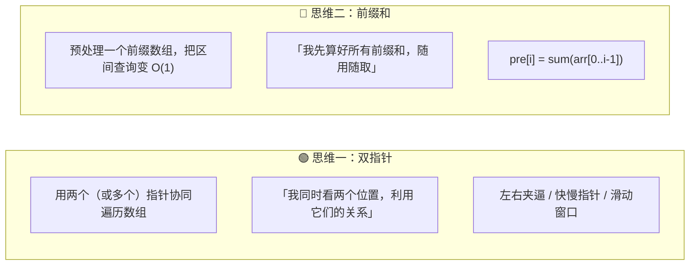
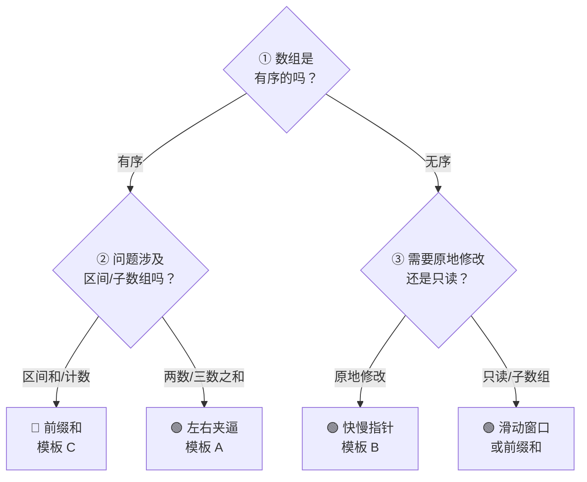

## 前置知识：数组到底是什么

### 连续内存 = 索引 O(1) 的秘密

数组在内存中是一块**连续的、固定大小的**存储空间。每个元素紧挨着下一个元素存放。

```python
# Python 的 list 底层就是动态数组
arr = [10, 20, 30, 40, 50]

# 内存中的样子（逻辑示意图）：
# 地址:  0x1000  0x1004  0x1008  0x100C  0x1010
# 值:    [ 10  ][ 20  ][ 30  ][ 40  ][ 50  ]
# 索引:     0       1       2       3       4
```

> [!important] 黄金公式
> 给定数组起始地址 `base` 和元素大小 `size`：
> • **元素 `arr[i]` 的地址** = `base + i * size`
> • 这就是为什么 `arr[i]` 是 **O(1)** —— 直接算地址，不需要遍历！

### 三个核心特性

```
┌──────────────────────────────────────────────┐
│  ① 连续存储：所有元素物理上紧挨着              │
│  ② 随机访问：arr[i] 直接计算地址，O(1)         │
│  ③ 插入/删除需要搬移元素，O(n)                  │
└──────────────────────────────────────────────┘
```

> [!warning] 数组 vs 链表：本质区别
> ```python
> # 数组：随机访问 O(1)，插入删除 O(n)
> arr[3]          # ← 直接算地址，瞬间拿到
> arr.insert(0,1) # ← 所有元素往后挪，O(n)
>
> # 链表：随机访问 O(n)，插入删除 O(1)（已知位置时）
> head.next.next.next  # ← 必须从头部一步步走
> ```
> 这直接决定了什么题型适合用数组、什么题型适合用链表。见 [[链表基础与通用解题框架]]。

### Python 的 list：动态数组

```python
# Python list 在底层是一个"有容量的数组"
# 当你 append 时：
#   - 如果容量够 → O(1)（摊还）
#   - 如果容量不够 → 分配更大内存，拷贝全部元素，O(n)

# 容量变化（C 实现，你看不到）：
# 初始: capacity=0,  arr=[]
# append(1): capacity=4, arr=[1, _, _, _]
# append 5次: 容量不够，扩容到 8，拷贝旧元素
# append 9次: 容量不够，扩容到 16...
```

> [!tip] 摊还分析
> 虽然扩容时是 O(n)，但扩容频率越来越低，平均下来 `append` 是 **O(1)**。

---

## 核心操作与时间复杂度

| 操作 | 时间复杂度 | 说明 |
|------|-----------|------|
| `arr[i]` 随机访问 | O(1) | 直接算地址 |
| `arr.append(x)` | O(1) 摊还 | 扩容时 O(n) |
| `arr.pop()` | O(1) | 删末尾，无需搬移 |
| `arr.insert(i, x)` | O(n) | i 之后所有元素后移 |
| `arr.pop(i)` | O(n) | i 之后所有元素前移 |
| `arr.remove(x)` | O(n) | 先查找 O(n)，再搬移 O(n) |
| `x in arr` | O(n) | 线性扫描 |
| `arr.sort()` | O(n log n) | Timsort |
| `len(arr)` | O(1) | Python 内部维护了长度 |

```python
# 直观感受：insert(0, ...) 有多慢？
import timeit

def test_append(n):
    arr = []
    for i in range(n):
        arr.append(i)

def test_insert_head(n):
    arr = []
    for i in range(n):
        arr.insert(0, i)    # 每次搬移所有元素

# n=10000 时，insert_head 比 append 慢 ~100 倍
```

---

## 两大核心思维模式

数组题的底层逻辑只有两种：



> [!info] 用现实类比理解
>
> **双指针** = 两个人一起干活
> • 左右夹逼：两个人从走廊两头往中间走，谁矮谁动
> • 快慢指针：一个人走两步，一个人走一步，找中点或检测环
>
> **前缀和** = 记账本
> • 你每天记账，想知道 3 号到 10 号一共花了多少钱，不用一天天加——用第 10 天的总和减第 2 天的总和就行。

---

## 拿到题，先问自己三个问题



> [!tip] 口诀
> **"有序就上左右夹逼，无序先想快慢指针，区间和秒选前缀和。"**

---

## 三大万能模板

### 🟢 模板 A：双指针 —— 左右夹逼

**核心特征**：数组**有序**，两个指针从两端向中间收缩，每次移动其中一个。

**适用场景**：两数之和 II、三数之和、盛水容器、平方数之和、验证回文串。

```python
# ====== 模板 A：双指针 —— 左右夹逼 ======
def two_pointer_opposite(arr):
    """
    适用条件：数组有序（或可以排序后处理）
    指针移动规则：每次移动一个指针，向中间靠拢
    """
    left, right = 0, len(arr) - 1

    while left < right:
        current = 根据 arr[left] 和 arr[right] 计算

        if 满足条件:
            return arr[left], arr[right]      # 或其他处理
        elif 需要增大 current:
            left += 1                          # 左指针右移 → 值变大
        else:  # 需要减小 current
            right -= 1                         # 右指针左移 → 值变小

    return None  # 没找到
```

> [!example] 示例：167. 两数之和 II - 输入有序数组
> ```python
> def twoSum(numbers, target):
>     left, right = 0, len(numbers) - 1
>     while left < right:
>         s = numbers[left] + numbers[right]
>         if s == target:
>             return [left + 1, right + 1]   # 题目要求 1-indexed
>         elif s < target:
>             left += 1                       # 和太小，左指针右移
>         else:
>             right -= 1                      # 和太大，右指针左移
>     return [-1, -1]
> ```

> [!example] 示例：11. 盛最多水的容器
> ```python
> def maxArea(height):
>     left, right = 0, len(height) - 1
>     max_area = 0
>     while left < right:
>         h = min(height[left], height[right])
>         max_area = max(max_area, h * (right - left))
>         # 谁矮谁移动——因为矮的那根决定了上限
>         if height[left] < height[right]:
>             left += 1
>         else:
>             right -= 1
>     return max_area
> ```

**对应题目**：

| 题目 | 为什么用左右夹逼 | 移动规则 |
|------|-----------------|---------|
| 167. 两数之和 II | 有序数组，找两数和 | sum < target → left++ |
| 15. 三数之和 | 排序后固定一个，剩下两个夹逼 | sum < 0 → left++ |
| 11. 盛最多水的容器 | 容积由矮边决定 | 矮的那边移动 |
| 125. 验证回文串 | 两端比较字符 | 不同则不是回文 |
| 633. 平方数之和 | 有序搜索空间 | 类似两数之和 |

---

### 🟢 模板 B：双指针 —— 快慢指针

**核心特征**：两个指针从**同一端**出发，一个快一个慢。慢指针指向"已处理区间的下一个位置"，快指针扫描整个数组。

**适用场景**：删除重复项、移除元素、移动零、压缩数组。

```python
# ====== 模板 B：双指针 —— 快慢指针 ======
def fast_slow_pointer(arr):
    """
    慢指针 slow：指向「有效区」的下一个写入位置
    快指针 fast：扫描原数组的每一个元素
    不变量：arr[0..slow-1] 始终是处理好的有效数据
    """
    slow = 0  # 下一个有效元素的写入位置

    for fast in range(len(arr)):
        if 条件成立（arr[fast] 应该保留）:
            arr[slow] = arr[fast]            # 搬到慢指针位置
            slow += 1                         # 写入位前进
        # 条件不成立 → 跳过，fast 继续前进

    return slow  # 有效数据的长度
```

> [!important] 快慢指针的核心不变量
> ```
> [   有效区   ][  待写入  ][         未扫描         ]
>  0 ... slow-1   slow       fast       ... n-1
>
> ① arr[0..slow-1] = 已处理好的结果（始终正确）
> ② arr[slow]       = 下一个要写入的位置
> ③ arr[fast..n-1]  = 尚未扫描的元素
> ```

> [!example] 示例：26. 删除有序数组中的重复项
> ```python
> def removeDuplicates(nums):
>     if not nums:
>         return 0
>     slow = 1  # nums[0] 一定保留，从第二个位置开始写
>     for fast in range(1, len(nums)):
>         if nums[fast] != nums[fast - 1]:   # 发现新元素
>             nums[slow] = nums[fast]
>             slow += 1
>     return slow  # 去重后的长度
> ```

> [!example] 示例：283. 移动零
> ```python
> def moveZeroes(nums):
>     slow = 0
>     for fast in range(len(nums)):
>         if nums[fast] != 0:
>             nums[slow], nums[fast] = nums[fast], nums[slow]
>             slow += 1
>     # 遍历结束后，nums[0..slow-1] 为非零，其余为零
> ```

> [!example] 示例：27. 移除元素
> ```python
> def removeElement(nums, val):
>     slow = 0
>     for fast in range(len(nums)):
>         if nums[fast] != val:
>             nums[slow] = nums[fast]
>             slow += 1
>     return slow
> ```

**对应题目**：

| 题目 | 保留条件 | slow 含义 |
|------|---------|----------|
| 26. 删除有序数组重复项 | 与前一个不同 | 不重复元素个数 |
| 27. 移除元素 | 不等于 val | 非 val 元素个数 |
| 283. 移动零 | 不等于 0 | 非零元素个数 |
| 80. 删除有序数组重复项 II | 最多出现两次 | 有效元素个数 |

---

### 🔵 模板 C：前缀和

**核心特征**：预处理一个前缀数组 `pre[i] = sum(arr[0..i-1])`，把区间和查询从 O(n) 变为 O(1)。

**适用场景**：区间和查询、和为 K 的子数组、子数组和统计。

```python
# ====== 模板 C：前缀和 ======
def prefix_sum_template(nums):
    """
    构建前缀和数组：
    pre[0] = 0（哨兵，方便计算完整数组的和）
    pre[i] = sum(nums[0..i-1])  （前 i 个元素的和）
    """
    n = len(nums)
    pre = [0] * (n + 1)     # 多开一格，pre[0] = 0

    for i in range(n):
        pre[i + 1] = pre[i] + nums[i]

    # 区间 [L, R] 的和 = pre[R+1] - pre[L]
    # 比如 nums = [1, 3, 5, 2, 8]
    # pre = [0, 1, 4, 9, 11, 19]
    # 区间 [2, 4]（即 [5, 2, 8]）的和 = pre[5] - pre[2] = 19 - 4 = 15

    return pre


# ====== 进阶：前缀和 + 哈希表（统计子数组） ======
def subarraySum(nums, k):
    """
    统计和为 k 的子数组个数
    核心思路：pre[j] - pre[i] = k → pre[i] = pre[j] - k
    """
    count = 0
    pre_sum = 0
    seen = {0: 1}           # {前缀和: 出现的次数}，0:1 处理从头开始的子数组

    for num in nums:
        pre_sum += num      # 当前前缀和
        # 查找之前有几个前缀和等于 pre_sum - k
        need = pre_sum - k
        if need in seen:
            count += seen[need]
        # 把当前前缀和记录到哈希表
        seen[pre_sum] = seen.get(pre_sum, 0) + 1

    return count
```

> [!tip] 前缀和的精髓
> ```
> 把「求 sum[L..R]」这个 O(n) 操作 → 变成「pre[R+1] - pre[L]」O(1) 操作
> 本质是用空间换时间：多存一个数组，换来任意区间和的瞬时查询。
> ```

> [!example] 示例：303. 区域和检索 - 数组不可变
> ```python
> class NumArray:
>     def __init__(self, nums):
>         self.pre = [0]
>         for x in nums:
>             self.pre.append(self.pre[-1] + x)
>
>     def sumRange(self, left, right):
>         return self.pre[right + 1] - self.pre[left]
> ```

> [!example] 示例：560. 和为 K 的子数组
> ```python
> def subarraySum(nums, k):
>     count = pre_sum = 0
>     seen = {0: 1}
>     for num in nums:
>         pre_sum += num
>         count += seen.get(pre_sum - k, 0)
>         seen[pre_sum] = seen.get(pre_sum, 0) + 1
>     return count
> ```

**对应题目**：

| 题目 | 前缀和用法 | 关键技巧 |
|------|-----------|---------|
| 303. 区域和检索 | 基础前缀和 | 直接减法 |
| 560. 和为 K 的子数组 | 前缀和 + 哈希表 | `pre[j] - pre[i] = k` |
| 304. 二维区域和检索 | 二维前缀和 | [[矩阵基础与通用解题框架]] |
| 238. 除自身以外的乘积 | 前缀积 + 后缀积 | 双向前缀 |
| 525. 连续数组 | 前缀和 + 哈希表 | 0 变 -1 |

---

## 新手练习路线图

> [!important] 练习策略
> 每道题先判断属于哪个模板 → 默写模板骨架 → 填业务逻辑。不要上来就抠细节！

```
阶段 1️⃣  双指针入门（左右夹逼）
  ├── 125. 验证回文串              ← 最最简单，理解两端比较
  ├── 167. 两数之和 II             ← 理解左右指针的移动规则
  └── 345. 反转字符串中的元音字母    ← 练习两端指针交换

阶段 2️⃣  双指针进阶（快慢指针）
  ├── 26. 删除有序数组的重复项       ← 理解"有效区"不变量
  ├── 27. 移除元素                 ← 巩固快慢指针模式
  └── 283. 移动零                  ← 掌握交换式写法

阶段 3️⃣  左右夹逼深入
  ├── 11. 盛最多水的容器            ← 理解"谁矮谁移动"
  ├── 15. 三数之和                 ← 固定一个 + 两头夹逼
  └── 16. 最接近的三数之和          ← 三数之和变体

阶段 4️⃣  前缀和专场
  ├── 303. 区域和检索 - 数组不可变   ← 理解前缀和本质
  ├── 560. 和为 K 的子数组          ← 前缀和 + 哈希表
  └── 238. 除自身以外的乘积          ← 前缀积 + 后缀积

阶段 5️⃣  综合运用
  ├── 42. 接雨水                  ← 双指针 / 前缀最大值
  ├── 209. 长度最小的子数组         ← 滑动窗口（双指针变体）
  └── 3. 无重复字符的最长子串       ← 滑动窗口 + 哈希表
```

---

## 常见易错点

> [!warning] **坑 1：快慢指针的 slow 初始值**
> ```python
> # 26. 删除重复项，第一个元素一定保留
> # ✅ slow 从 1 开始
> slow = 1
> for fast in range(1, len(nums)):
>     if nums[fast] != nums[fast - 1]:
>         nums[slow] = nums[fast]
>         slow += 1
>
> # ❌ slow 从 0 开始，会覆盖第一个元素
> slow = 0
> ```

> [!warning] **坑 2：左右夹逼忘记移动指针导致死循环**
> ```python
> # ❌ 每次循环必须移动一个指针，否则 left < right 永真
> while left < right:
>     if cond:
>         left += 1   # ✅ 确保每次循环至少移动一边
>     else:
>         right -= 1
>
> # ❌ 死循环！
> while left < right:
>     if cond:
>         pass        # 什么都没动
>     else:
>         pass
> ```

> [!warning] **坑 3：前缀和哈希表忘记初始化 `{0: 1}`**
> ```python
> # ❌ 缺少 0:1，无法统计从索引 0 开始的子数组
> seen = {}
> for num in nums:
>     pre_sum += num
>     count += seen.get(pre_sum - k, 0)   # 如果 pre_sum == k，need=0，找不到！
>
> # ✅ 必须加 0:1
> seen = {0: 1}
> for num in nums:
>     pre_sum += num
>     count += seen.get(pre_sum - k, 0)
>     seen[pre_sum] = seen.get(pre_sum, 0) + 1
> ```

> [!warning] **坑 4：先计数还是先更新哈希表？**
> ```python
> # ✅ 正确顺序：先查询，再更新
> # 这样统计的是 pre[i..j-1] 的和，不包括当前元素
> count += seen.get(pre_sum - k, 0)   # 先查旧数据
> seen[pre_sum] = seen.get(pre_sum, 0) + 1  # 再更新
>
> # ❌ 如果反过来，会在计算前缀和等于 k 的当前元素时多算
> ```

> [!warning] **坑 5：前缀和数组大小开错**
> ```python
> # ✅ pre 长度为 n+1，pre[0]=0
> pre = [0] * (len(nums) + 1)
>
> # ❌ 长度 n，pre[0] 对应 nums[0]，不方便
> pre = [0] * len(nums)
> ```

> [!warning] **坑 6：有序数组删除重复项，比较对象搞错**
> ```python
> # 26. 删除有序数组重复项
> # ✅ 比较当前元素和前一个（因为是排序的，相邻相同就是重复）
> if nums[fast] != nums[fast - 1]:
>
> # ❌ 比较当前元素和 slow 位置，逻辑不同
> if nums[fast] != nums[slow - 1]:   # 虽然碰巧也对，但意图不清晰
> ```

---

## 相关题目索引

| 题号 | 题目 | 模板 | 难度 | 关键词 |
|------|------|------|------|--------|
| 167 | 两数之和 II - 输入有序数组 | 🟢 A 左右夹逼 | ⭐ | 有序、双指针 |
| 15 | 三数之和 | 🟢 A 左右夹逼 | ⭐⭐ | 排序、固定+夹逼 |
| 11 | 盛最多水的容器 | 🟢 A 左右夹逼 | ⭐⭐ | 贪心、谁矮谁动 |
| 16 | 最接近的三数之和 | 🟢 A 左右夹逼 | ⭐⭐ | 三数之和变体 |
| 125 | 验证回文串 | 🟢 A 左右夹逼 | ⭐ | 字符串、两端比较 |
| 26 | 删除有序数组的重复项 | 🟢 B 快慢指针 | ⭐ | 原地修改、不变量 |
| 27 | 移除元素 | 🟢 B 快慢指针 | ⭐ | 原地移除 |
| 283 | 移动零 | 🟢 B 快慢指针 | ⭐ | 交换式 |
| 80 | 删除有序数组重复项 II | 🟢 B 快慢指针 | ⭐⭐ | 保留最多两个 |
| 303 | 区域和检索 - 数组不可变 | 🔵 C 前缀和 | ⭐ | 前缀和入门 |
| 560 | 和为 K 的子数组 | 🔵 C 前缀和 | ⭐⭐ | 前缀和+哈希表 |
| 238 | 除自身以外数组的乘积 | 🔵 C 前缀和 | ⭐⭐ | 双向前缀积 |
| 209 | 长度最小的子数组 | 🟢 滑动窗口 | ⭐⭐ | 双指针变体 |
| 42 | 接雨水 | 🟢 多解法 | ⭐⭐⭐ | 双指针 / 单调栈 |
| 1 | 两数之和 | 🟢 哈希表 | ⭐ | 无序数组用哈希 |
| 3 | 无重复字符的最长子串 | 🟢 滑动窗口 | ⭐⭐ | 双指针+哈希 |

---

## 相关笔记

- [[字符串基础与通用解题框架]] — 字符串本质上就是字符数组，双指针模式完全通用
- [[链表基础与通用解题框架]] — 链表 vs 数组的取舍，快慢指针在链表中更常见
- [[矩阵基础与通用解题框架]] — 二维数组，前缀和扩展为二维
- [[哈希表基础与通用解题框架]] — 无序数组的两数之和用哈希表 O(n)
- [[二叉树基础与通用解题框架]] — 递归思维 vs 迭代思维
- [[滑动窗口基础与通用解题框架]] — 双指针在子数组问题上的进阶应用
