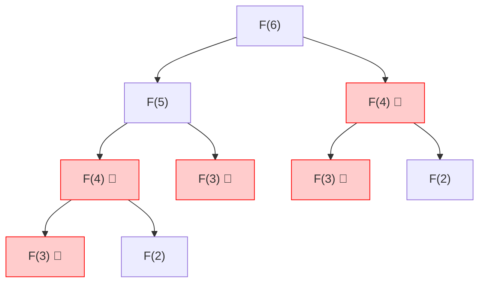
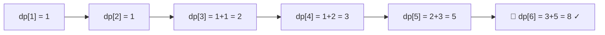
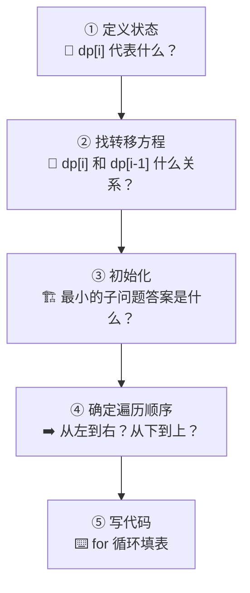

---
tags:
  - algorithm
  - dp
  - fibonacci
  - template
aliases:
  - 斐波那契 DP
  - 斐波那契 动态规划
  - fib dp
  - fibonacci dp
  - DP 斐波那契
  - 暴力递归 斐波那契
  - dp[i] = dp[i-1] + dp[i-2]
  - F(n) = F(n-1) + F(n-2)
  - 状态转移方程 斐波那契
  - 斐波那契 状态转移
  - 斐波那契数列 DP
  - 记忆化搜索 斐波那契
  - memo fib
  - DP 入门 斐波那契
  - DP 核心三要素
created: 2026-06-08
lark_doc_url: https://my.feishu.cn/docx/PziAdUExuoafbQxqVpXcSRJnnCc
---

# 斐波那契 DP 解法

> 这是 DP 最经典的入门例子，也是展开 DP 思路时最先想到的模板。
>
> 来源：[[算法核心概念：DP、DFS、BFS]]

---

## 问题

斐波那契数列：

$$
F(1)=1,\quad F(2)=1,\quad F(n)=F(n-1)+F(n-2)
$$

求 $F(6)$。

---

## 暴力递归 ❌



> 红色节点全是重复计算！$F(4)$ 算了 2 次，$F(3)$ 算了 3 次。n 越大越灾难。

```python
# ❌ 暴力递归：O(2^n)，指数爆炸
def fib_brute(n):
    if n <= 2:
        return 1
    return fib_brute(n - 1) + fib_brute(n - 2)
```

---

## DP 解法 ✅

### 核心思路

每个子问题只算一次，从小到大填表：



### 代码

```python
# ✅ DP：O(n)，每个子问题只算一次
def fib_dp(n):
    if n <= 2:
        return 1  # n=1/2 直接返回，避免 dp[2] 越界
    dp = [0] * (n + 1)
    dp[1] = dp[2] = 1
    for i in range(3, n + 1):
        dp[i] = dp[i - 1] + dp[i - 2]
    return dp[n]
```

### 空间优化版

```python
# ✅ DP 空间优化：O(1)
def fib_dp_opt(n):
    if n <= 2:
        return 1
    prev2, prev1 = 1, 1  # dp[1], dp[2]
    for i in range(3, n + 1):
        curr = prev2 + prev1
        prev2, prev1 = prev1, curr
    return prev1
```

### 生成器版：`yield` 按需求值

> 省的不是空间（O(1) 已到底），省的是**不必要的时间**——消费 k 个值就不用算剩下 n-k 个。

```python
# ✅ 生成器：空间仍是 O(1)，但支持按需消费 + 无限序列
def fib_gen(n):
    prev2, prev1 = 1, 1
    yield prev2          # F(1)
    if n >= 2:
        yield prev1      # F(2)
    for i in range(3, n + 1):
        curr = prev2 + prev1
        yield curr
        prev2, prev1 = prev1, curr

# 无限版本：永不停止的斐波那契流
def fib_infinite():
    prev2, prev1 = 1, 1
    yield prev2
    yield prev1
    while True:
        curr = prev2 + prev1
        yield curr
        prev2, prev1 = prev1, curr
```

**什么时候用哪个？**

| 场景 | `fib_dp_opt(n)` | `fib_gen(n)` |
|:--|:--|:--|
| 空间复杂度 | O(1) ✅ | O(1) ✅ |
| 只需要第 n 项 | ✅ 简洁直接 | ❌ 杀鸡用牛刀 |
| 需要前 k 项（k < n） | ❌ 必须算完 O(n) | ✅ 算到第 k 项就停 |
| 无限序列 | ❌ 必须预先知道 n | ✅ 唯一方案 |
| 消费模式 | **一次拿到结果** | **按需拉取（Pull）** |

> **核心直觉**：`return` 是「一次性把整盘菜端上来」，`yield` 是「厨房做好一个就递一个」。菜本身没变，但你可以随时叫停。

---

## DP 核心三要素（以斐波那契为例）

| 要素 | 含义 | 斐波那契例子 |
|:--|:--|:--|
| **状态定义** | `dp[i]` 代表什么？ | `dp[i]` = 第 i 个斐波那契数 |
| **状态转移方程** | 如何从小问题推大问题？ | `dp[i] = dp[i-1] + dp[i-2]` |
| **初始条件** | 最小的问题的答案是什么？ | `dp[1] = 1, dp[2] = 1` |

---

## 泛化：DP 通用步骤



---

## 为什么斐波那契是 DP 的「母题」

- 完美展示 **重叠子问题** → 为什么要用 DP
- 状态转移方程最简单直观：`dp[i] = dp[i-1] + dp[i-2]`
- 可以自然引出 **空间优化**（滚动变量）
- 可以自然引出 **记忆化搜索**（递归 + memo）
- 遇到新 DP 题时，第一反应就是：状态怎么定义？转移方程怎么写？——这两个问题就是从斐波那契练出来的

---

## 记忆化搜索（递归 + memo）

```python
# DP 的另一种实现：自顶向下 + 缓存
def fib_memo(n, memo=None):
    if memo is None:
        memo = {}  # 不能用可变默认参数 memo={}，否则缓存跨调用共享
    if n in memo:
        return memo[n]
    if n <= 2:
        return 1
    memo[n] = fib_memo(n - 1, memo) + fib_memo(n - 2, memo)
    return memo[n]
```

> 记忆化搜索 = DFS 的递归结构 + DP 的缓存思想。是二者之间的桥梁。

---

## 相关链接

- [[算法核心概念：DP、DFS、BFS]] — 算法三件套总览
- DP 场景速查：**计数**（有多少种）、**最值**（最大/最小）、**可行性**（能不能）
