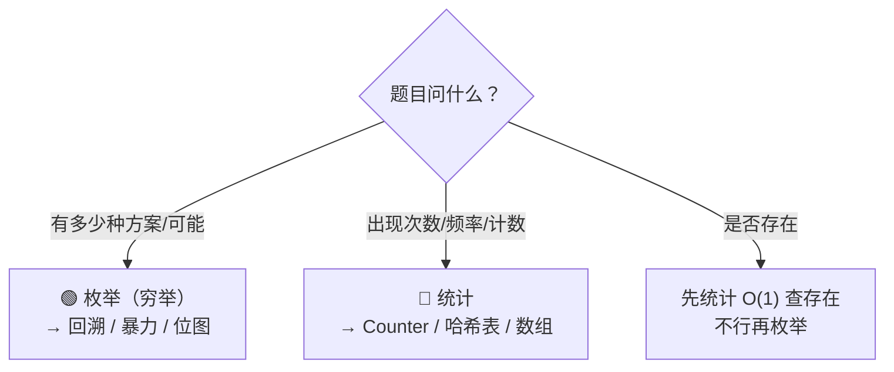

## 枚举（Enumeration）

### 前置知识

**枚举** = 把所有可能的情况列出来，逐一检查。是最暴力的方法，但很多题目的最优解就是从枚举优化而来。

> [!important]
> 枚举不是"笨办法"——当数据范围小（n ≤ 20），枚举往往是最简单、最不容易出错的解法。
> 优化的思路永远是：**先写出枚举，再找优化点**。

### 三大枚举模式

#### 模式 A：线性枚举（O(n) 或 O(n²)）

```python
# 暴力枚举所有子数组 — O(n²)
for i in range(n):
    for j in range(i, n):
        sub = nums[i:j+1]

# 暴力枚举所有数对 — O(n²)
for i in range(n):
    for j in range(i+1, n):
        pair = (nums[i], nums[j])
```

#### 模式 B：组合枚举（子集/排列）

用回溯生成，详见 [[回溯基础与通用解题框架]] 和 [[排列组合基础与通用解题框架]]。

```python
# 枚举所有子集（二进制位图法）— O(2^n)
n = len(nums)
for mask in range(1 << n):
    subset = [nums[i] for i in range(n) if mask & (1 << i)]
```

#### 模式 C：日期/坐标枚举

```python
# 枚举两个日期之间的所有日期
from datetime import datetime, timedelta
d = datetime(2024, 1, 1)
end = datetime(2024, 12, 31)
while d <= end:
    ...  # 处理日期 d
    d += timedelta(days=1)
```

### 枚举的优化手段

| 原始 | 优化后 | 优化方法 |
|------|--------|---------|
| 枚举所有子数组求和 | O(1) 区间和 | 前缀和 |
| O(n²) 两数之和 | O(n) | 哈希表 |
| O(n²) 回文子串 | O(n²) 中心扩展 or O(n) Manacher | 观察回文性质 |
| O(2^n) 子集 | O(n*W) 背包 | DP 剪掉不优的分支 |

---

## 统计（Counting）

### 前置知识

**统计** = 按某个维度对数据进行计数，通常用**哈希表**或**数组**做计数器。

### 核心模板

#### 模板 A：哈希表计数

```python
# ====== 统计元素频率 ======
from collections import Counter

counter = Counter(nums)
# counter.most_common(2)  → 频率最高的 2 个

# 手动版
freq = {}
for x in nums:
    freq[x] = freq.get(x, 0) + 1
```

#### 模板 B：数组计数（有限范围）

```python
# 当值域较小时（如 0-1000 或 'a'-'z'），用数组比哈希表更快
count = [0] * 26
for ch in s:
    count[ord(ch) - ord('a')] += 1
```

#### 模板 C：前缀计数

```python
# ====== 统计子数组和为 K 的个数 ======
# 边遍历边统计前缀和出现的次数
pre_sum = 0
count = {0: 1}      # 前缀和为 0 出现了 1 次
ans = 0
for num in nums:
    pre_sum += num
    if pre_sum - k in count:
        ans += count[pre_sum - k]
    count[pre_sum] = count.get(pre_sum, 0) + 1
```

#### 模板 D：按位统计

```python
# ====== 统计所有数字在某一位上有多少个 1 ======
# 用于位运算题目中的"按位贡献"统计
def countBits(nums):
    ans = 0
    for bit in range(32):
        ones = sum((n >> bit) & 1 for n in nums)
        # ones 个 1 和 (n-ones) 个 0 可以组成 ones*(n-ones) 个数对
        ans += ones * (len(nums) - ones)
    return ans
```

---

## 经典真题

| 题号 | 题目 | 枚举/统计 | 关键技巧 |
|------|------|-----------|---------|
| 1 | 两数之和 | 线性枚举 → 哈希表优化 | 统计"见过"的值 |
| 560 | 和为K的子数组 | 前缀和 + 哈希表统计 | 边遍历边统计 |
| 347 | 前K个高频元素 | 统计计数 + 排序/堆 | Counter + heapq |
| 169 | 多数元素 | 统计计数 / 摩尔投票 | 两种解法 |
| 78 | 子集 | 枚举所有子集 | 回溯 or 位图 |
| 46 | 全排列 | 枚举所有排列 | 回溯 |
| 136 | 只出现一次的数字 | 统计 → 异或优化 | 位运算 |

---

## 枚举 vs 统计：什么时候用哪个？



---

## 常见易错点

> [!warning] **坑 1：枚举忘了剪枝，复杂度爆炸**
> 暴力枚举 O(2^n) 在 n>20 就基本跑不动了。先估算数据范围再动手。

> [!warning] **坑 2：`Counter.most_common` 的性能陷阱在无参调用**
> 真正要避免的是**无参** `most_common()`——它对全部 u 个不同元素做完整排序，O(u log u)；同理避免"先 `sorted(counter.items())` 再切片"的写法。而带参数的 `most_common(k)` 内部实现就是 `heapq.nlargest`（O(u log k) 的堆选 TopK），已经是优化的了，无需再手动换成 `heapq.nlargest(k, counter.keys(), key=counter.get)`——那是无收益的重复劳动。

> [!warning] **坑 3：统计时忘记初始化边界**
> 前缀和哈希表初始化 `{0: 1}` 是最容易被忘的细节。

> [!warning] **坑 4：枚举时重复计算**
> ```python
> # ❌ 每次都重新算区间和 → O(n³)
> for i in range(n):
>     for j in range(i, n):
>         s = sum(nums[i:j+1])
>
> # ✅ 边枚举边累加 → O(n²)
> for i in range(n):
>     s = 0
>     for j in range(i, n):
>         s += nums[j]     # 累加，不用重新算
> ```

---

## 相关笔记

- [[哈希表基础与通用解题框架]] — 统计的核心工具
- [[回溯基础与通用解题框架]] — 枚举的核心框架
- [[排列组合基础与通用解题框架]] — 组合枚举
- [[前缀和基础与通用解题框架]] — 前缀计数优化
- [[位运算基础与通用解题框架]] — 位图枚举
