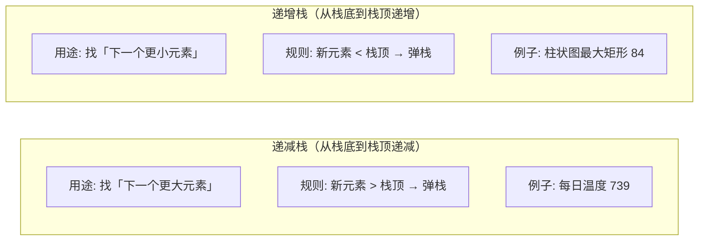
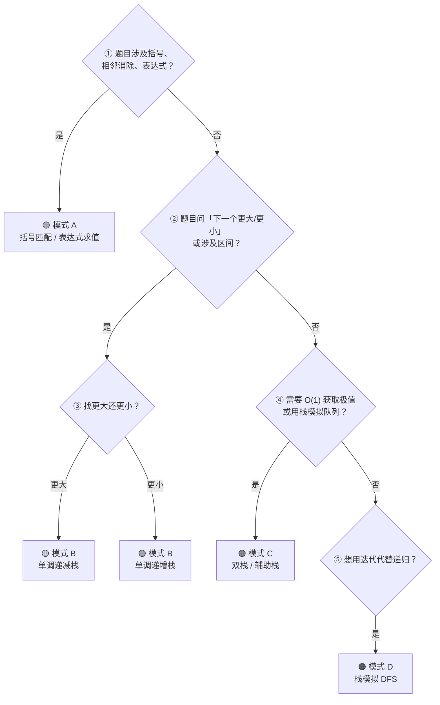

## 前置知识：栈到底是什么

### LIFO —— 后进先出

栈（Stack）是一种**只能在一端操作**的线性数据结构。最后一个放进去的，第一个拿出来——像一叠盘子：

```
push(3)    push(7)    push(9)    pop()
  │          │          │         │
  ▼          ▼          ▼         ▼
┌───┐      ┌───┐      ┌───┐     ┌───┐
│   │      │   │      │ 9 │     │   │
│   │      │ 7 │      │ 7 │     │ 7 │
│ 3 │      │ 3 │      │ 3 │     │ 3 │
└───┘      └───┘      └───┘     └───┘
                       栈顶 ↑     返回 9
```

栈只有三个核心操作：

| 操作 | 含义 | 复杂度 |
|------|------|--------|
| `push(x)` | 把 x 压入栈顶 | O(1) |
| `pop()` | 弹出栈顶元素 | O(1) |
| `peek()` / `top()` | 查看栈顶元素（不弹出） | O(1) |

### Python 中：list 就是栈

```python
stack = []

# push → list.append（加到末尾 = 栈顶）
stack.append(1)
stack.append(2)
stack.append(3)

# peek → stack[-1]
top = stack[-1]        # 3

# pop → list.pop（从末尾弹出 = 栈顶弹出）
val = stack.pop()      # 返回 3，stack 变为 [1, 2]

# 判空
if not stack:
    print("栈空了")
```

> [!tip] 为什么 list 天然是栈？
> `list.append()` 和 `list.pop()` 操作的都是**列表末尾**（即栈顶），都是 O(1)。
> 如果用 `list.pop(0)` 才是队列操作——那是 O(n)，不要这样做。

---

## 栈在业务场景中的体现

| 领域 | 栈的用途 | 说明 |
|------|---------|------|
| 🔙 浏览器 | 前进/后退 | 两个栈记录访问历史 |
| ↩️ 文本编辑器 | 撤销/重做 | 操作记录压栈 |
| 🧮 计算器 | 表达式求值 | 操作数和运算符各一个栈 |
| 🔧 编译器 | 括号匹配 / 语法分析 | 括号压栈匹配 |
| 📞 程序执行 | 函数调用栈 | 递归本质就是栈 |
| 🎨 图像处理 | 洪水填充 | DFS 用栈模拟 |
| 🔀 路由 | 最短路径 | DFS 走迷宫 |

---

## 四大核心解题模式

### 模式 A：括号匹配 / 表达式求值

**一眼认出**：题目涉及"括号对""最近匹配""相邻抵消"——`()[]{}`、`ab#c`。

**核心思想**：遍历时，遇到左括号压栈，遇到右括号去栈顶找对应的左括号。

```python
# ====== 模式 A 骨架：括号匹配 ======
def bracket_match(s):
    stack = []
    pairs = {')': '(', ']': '[', '}': '{'}

    for ch in s:
        if ch in pairs.values():        # 左括号 → 压栈
            stack.append(ch)
        elif ch in pairs:               # 右括号 → 匹配
            if not stack or stack.pop() != pairs[ch]:
                return False
        # 其他字符忽略
    return not stack                    # 栈空 = 全部匹配
```

> [!example] 示例：20. 有效的括号
> ```python
> def isValid(s: str) -> bool:
>     stack = []
>     pairs = {')': '(', ']': '[', '}': '{'}
>
>     for ch in s:
>         if ch in pairs:               # 右括号
>             if not stack or stack.pop() != pairs[ch]:
>                 return False
>         else:                          # 左括号
>             stack.append(ch)
>
>     return not stack
> ```

> [!example] 示例：150. 逆波兰表达式求值
> ```python
> def evalRPN(tokens):
>     stack = []
>     for t in tokens:
>         if t == '+':
>             b, a = stack.pop(), stack.pop()
>             stack.append(a + b)
>         elif t == '-':
>             b, a = stack.pop(), stack.pop()
>             stack.append(a - b)
>         elif t == '*':
>             b, a = stack.pop(), stack.pop()
>             stack.append(a * b)
>         elif t == '/':
>             b, a = stack.pop(), stack.pop()
>             stack.append(int(a / b))  # 向零截断
>         else:
>             stack.append(int(t))
>     return stack[0]
> ```

> [!example] 示例：1047. 删除字符串中的所有相邻重复项
> ```python
> def removeDuplicates(s: str) -> str:
>     stack = []
>     for ch in s:
>         if stack and stack[-1] == ch:
>             stack.pop()               # 相邻相同 → 一起消除
>         else:
>             stack.append(ch)
>     return ''.join(stack)
> ```

**对应题目**：

| 题号 | 题目 | 栈的用途 |
|------|------|---------|
| 20 | 有效的括号 | 左括号压栈，右括号匹配 |
| 22 | 括号生成 | 回溯 + 栈维护当前括号串 |
| 150 | 逆波兰表达式求值 | 操作数压栈 |
| 1047 | 删除相邻重复项 | 栈顶检查相邻 |
| 71 | 简化路径 | 目录压栈 |
| 394 | 字符串解码 | 数字 + 字符分别压栈 |

---

### 模式 B：单调栈 —— 找下一个更大 / 更小元素

**一眼认出**：题目问"下一个更大的元素""每日温度""柱状图中最大矩形"。

**单调栈是栈里最值钱的技巧。** 它比普通栈多了一层约束：栈内元素始终保持**单调递增或单调递减**。

```python
# ====== 模式 B 骨架：单调栈 ======
def monotonic_stack(nums):
    stack = []  # 存索引（推荐）或存值
    result = [-1] * len(nums)  # 默认值

    for i, num in enumerate(nums):
        # 关键：当前元素破环单调性 → 弹栈
        while stack and nums[stack[-1]] < num:  # 递减栈（找下一个更大）
            prev_idx = stack.pop()
            result[prev_idx] = i  # 或 num
        stack.append(i)

    return result
```

> [!example] 示例：739. 每日温度
> ```python
> def dailyTemperatures(temperatures):
>     n = len(temperatures)
>     ans = [0] * n
>     stack = []  # 单调递减栈，存索引
>
>     for i, t in enumerate(temperatures):
>         while stack and temperatures[stack[-1]] < t:
>             prev = stack.pop()
>             ans[prev] = i - prev     # 等了几天
>         stack.append(i)
>
>     return ans
> ```

> [!note]+ 每日温度 — 测试用例与逐步演示
> **测试用例**：
> 
> | # | 输入 | 输出 | 说明 |
> |---|------|------|------|
> | 1 | `[73,74,75,71,69,72,76,73]` | `[1,1,4,2,1,1,0,0]` | 经典用例（LeetCode 官方） |
> | 2 | `[30,40,50,60]` | `[1,1,1,0]` | 严格递增 — 每天都能等到更暖 |
> | 3 | `[90,60,30]` | `[0,0,0]` | 严格递减 — 永远等不到更暖 |
> | 4 | `[30,30,30]` | `[0,0,0]` | 全部相等 — 没有"更高" |
> | 5 | `[30]` | `[0]` | 单元素边界 |
> | 6 | `[50,40,30,20,10,60]` | `[5,4,3,2,1,0]` | 长时间等待后集中爆发 |
> | 7 | `[70,60,50,65,55,45,75]` | `[6,2,1,3,2,1,0]` | 综合测试，有升有降 |
> 
> ---
> 
> **逐步演示**（用例 7：`[70, 60, 50, 65, 55, 45, 75]`）：
> 
> ```
> i=0, t=70  栈空 → 压入
>   stack: [0(70)]
>   ans:   [0, 0, 0, 0, 0, 0, 0]
> 
> i=1, t=60  60 ≤ 70 → 递减成立，压入
>   stack: [0(70), 1(60)]
>   ans:   [0, 0, 0, 0, 0, 0, 0]
> 
> i=2, t=50  50 ≤ 60 → 递减成立，压入
>   stack: [0(70), 1(60), 2(50)]
>   ans:   [0, 0, 0, 0, 0, 0, 0]
> 
> i=3, t=65  65 > 50 → 弹栈！ans[2]=3-2=1
>            65 > 60 → 弹栈！ans[1]=3-1=2
>            65 ≤ 70 → 停止，压入
>   stack: [0(70), 3(65)]
>   ans:   [0, 2, 1, 0, 0, 0, 0]
> 
> i=4, t=55  55 ≤ 65 → 递减成立，压入
>   stack: [0(70), 3(65), 4(55)]
>   ans:   [0, 2, 1, 0, 0, 0, 0]
> 
> i=5, t=45  45 ≤ 55 → 递减成立，压入
>   stack: [0(70), 3(65), 4(55), 5(45)]
>   ans:   [0, 2, 1, 0, 0, 0, 0]
> 
> i=6, t=75  75 > 45 → 弹栈！ans[5]=6-5=1
>            75 > 55 → 弹栈！ans[4]=6-4=2
>            75 > 65 → 弹栈！ans[3]=6-3=3
>            75 > 70 → 弹栈！ans[0]=6-0=6
>            栈空 → 压入
>   stack: [6(75)]
>   ans:   [6, 2, 1, 3, 2, 1, 0]
> ```
> 
> **验证**：
> 
> | Day | 温度 | 等几天 | 目标天 | 验证 |
> |:---:|:----:|:-----:|:-----:|------|
> | 0 | 70° | 6 | Day6=75° | 75 > 70 ✓ |
> | 1 | 60° | 2 | Day3=65° | 65 > 60 ✓ |
> | 2 | 50° | 1 | Day3=65° | 65 > 50 ✓ |
> | 3 | 65° | 3 | Day6=75° | 75 > 65 ✓ |
> | 4 | 55° | 2 | Day6=75° | 75 > 55 ✓ |
> | 5 | 45° | 1 | Day6=75° | 75 > 45 ✓ |
> | 6 | 75° | 0 | — | 后面没有更高的 |
> 
> **栈的演变全景**（每一轮弹栈写入答案）：
> 
> ```
>   栈（栈底→栈顶）              答案
> ───────────────────────────────────────
> i=0  [70]                    [0,0,0,0,0,0,0]
> i=1  [70,60]                 [0,0,0,0,0,0,0]
> i=2  [70,60,50]              [0,0,0,0,0,0,0]
> i=3  [70,60,50] ←65！        [0,0,0,0,0,0,0]
>        pop 50 → ans[2]=1
>        pop 60 → ans[1]=2
>      [70,65]                 [0,2,1,0,0,0,0]
> i=4  [70,65,55]              [0,2,1,0,0,0,0]
> i=5  [70,65,55,45]           [0,2,1,0,0,0,0]
> i=6  [70,65,55,45] ←75！     [0,2,1,0,0,0,0]
>        pop 45 → ans[5]=1
>        pop 55 → ans[4]=2
>        pop 65 → ans[3]=3
>        pop 70 → ans[0]=6
>      [75]                    [6,2,1,3,2,1,0]
> 终结  剩余75无人能弹            [6,2,1,3,2,1,0]
> ```

> [!example] 示例：496. 下一个更大元素 I
> ```python
> def nextGreaterElement(nums1, nums2):
>     greater = {}  # {元素: 下一个更大元素}
>     stack = []    # 单调递减栈
>
>     for num in nums2:
>         while stack and stack[-1] < num:
>             greater[stack.pop()] = num
>         stack.append(num)
>
>     return [greater.get(x, -1) for x in nums1]
> ```

> [!example] 示例：84. 柱状图中最大的矩形（单调递增栈）
> ```python
> def largestRectangleArea(heights):
>     heights = [0] + heights + [0]   # 哨兵：简化边界处理
>     stack = []  # 单调递增栈，存索引
>     max_area = 0
>
>     for i, h in enumerate(heights):
>         while stack and heights[stack[-1]] > h:
>             cur_h = heights[stack.pop()]
>             cur_w = i - stack[-1] - 1
>             max_area = max(max_area, cur_h * cur_w)
>         stack.append(i)
>
>     return max_area
> ```

**对应题目**：

| 题号 | 题目 | 栈单调方向 | 找什么 |
|------|------|-----------|--------|
| 739 | 每日温度 | 递减 | 下一个更大元素的索引 |
| 496 | 下一个更大元素 I | 递减 | 下一个更大的值 |
| 503 | 下一个更大元素 II | 递减 | 循环数组，多遍历一遍 |
| 84 | 柱状图最大矩形 | 递增 | 左右第一个更小的边界 |
| 42 | 接雨水 | 递减 | 左右更高的墙 |
| 901 | 股票价格跨度 | 递减 | 连续 ≤ 当前价格的天数 |

---

### 模式 C：辅助栈 / 双栈

**一眼认出**：主功能之外需要 O(1) 获取某种"极值"或"历史状态"。

```python
# ====== 模式 C 骨架：双栈 ======
class TwoStackSolution:
    def __init__(self):
        self.main_stack = []   # 主栈：存所有数据
        self.aux_stack = []    # 辅助栈：存额外信息

    def push(self, x):
        self.main_stack.append(x)
        # 在辅助栈中维护对应信息
        new_aux = min(x, self.aux_stack[-1]) if self.aux_stack else x
        self.aux_stack.append(new_aux)

    def pop(self):
        self.aux_stack.pop()
        return self.main_stack.pop()

    def get_aux(self):
        return self.aux_stack[-1] if self.aux_stack else None
```

> [!example] 示例：155. 最小栈
> ```python
> class MinStack:
>     def __init__(self):
>         self.stack = []
>         self.min_stack = []  # 辅助栈：同步记录每个时刻的最小值
>
>     def push(self, val):
>         self.stack.append(val)
>         cur_min = min(val, self.min_stack[-1]) if self.min_stack else val
>         self.min_stack.append(cur_min)
>
>     def pop(self):
>         self.min_stack.pop()
>         return self.stack.pop()
>
>     def top(self):
>         return self.stack[-1]
>
>     def getMin(self):
>         return self.min_stack[-1]
> ```

> [!example] 示例：232. 用栈实现队列
> ```python
> class MyQueue:
>     def __init__(self):
>         self.in_stack = []   # 输入栈：接收 push
>         self.out_stack = []  # 输出栈：提供 pop/peek
>
>     def push(self, x):
>         self.in_stack.append(x)
>
>     def pop(self):
>         self._transfer()
>         return self.out_stack.pop()
>
>     def peek(self):
>         self._transfer()
>         return self.out_stack[-1]
>
>     def empty(self):
>         return not self.in_stack and not self.out_stack
>
>     def _transfer(self):
>         """当 out_stack 为空时，把 in_stack 的元素倒过来"""
>         if not self.out_stack:
>             while self.in_stack:
>                 self.out_stack.append(self.in_stack.pop())
> ```

> [!tip] 双栈模拟队列的均摊 O(1)
> 每个元素最多被 push 两次、pop 两次（in_stack 和 out_stack 各一次）。
> 单次 `pop()` 可能 O(n)，但均摊下来是 O(1)。

**对应题目**：

| 题号 | 题目 | 栈的协作方式 |
|------|------|-------------|
| 155 | 最小栈 | 主栈 + 最小值栈同步 |
| 232 | 用栈实现队列 | in_stack + out_stack |
| 225 | 用队列实现栈 | 主队列 + 辅助队列 |
| 716 | 最大栈 | 主栈 + 最大值栈 |

---

### 模式 D：用栈模拟 DFS / 消除递归

**一眼认出**：题目需要 DFS（深度优先），但想避免递归（怕爆栈、或需要迭代方式）。

**核心思想**：手动维护一个栈（list），模拟函数调用栈的行为。

```python
# ====== 模式 D 骨架：用栈模拟 DFS ======
def iterative_dfs(root):
    if not root:
        return
    stack = [root]

    while stack:
        node = stack.pop()      # 弹出栈顶 = 处理当前节点

        # 处理当前节点（前序位置）
        process(node)

        # 先右后左压栈 → 弹栈时先左后右（前序）
        if node.right:
            stack.append(node.right)
        if node.left:
            stack.append(node.left)
```

> [!example] 示例：144. 二叉树的前序遍历（迭代版）
> ```python
> def preorderTraversal(root):
>     if not root:
>         return []
>     result = []
>     stack = [root]
>
>     while stack:
>         node = stack.pop()
>         result.append(node.val)        # 前序：进入节点就处理
>         if node.right:
>             stack.append(node.right)
>         if node.left:
>             stack.append(node.left)
>
>     return result
> ```

> [!example] 示例：94. 二叉树的中序遍历（迭代版）
> ```python
> def inorderTraversal(root):
>     result = []
>     stack = []
>     cur = root
>
>     while cur or stack:
>         while cur:                    # 一路向左到底
>             stack.append(cur)
>             cur = cur.left
>         cur = stack.pop()             # 弹栈 = 中序处理
>         result.append(cur.val)
>         cur = cur.right               # 转向右子树
>
>     return result
> ```

> [!tip] 递归 vs 迭代栈
>
> | | 递归 | 迭代栈 |
> |---|---|---|
> | 代码长度 | 短（3-5 行） | 长（10+ 行） |
> | 易读性 | 高 | 中 |
> | 栈溢出风险 | 有（深度过大） | 低 |
> | 适用场景 | 大多数题 | 深度可能很大的题 |

**对应题目**：

| 题号 | 题目 | 用途 |
|------|------|------|
| 144 | 二叉树前序遍历 | 栈模拟递归 |
| 94 | 二叉树中序遍历 | 手动指针 + 栈 |
| 145 | 二叉树后序遍历 | 前序取反 |
| 733 | 图像渲染（洪水填充） | 迭代 DFS |

---

## 单调栈详解

### 递增栈 vs 递减栈



### 递减栈图解（以每日温度为例）

```
temperatures = [73, 74, 75, 71, 69, 72, 76, 73]

i=0, t=73  栈空 → 压入
  stack: [0(73)]

i=1, t=74  74 > 73 → 弹栈：ans[0]=1-0=1，压入
  stack: [1(74)]

i=2, t=75  75 > 74 → 弹栈：ans[1]=2-1=1，压入
  stack: [2(75)]

i=3, t=71  71 ≤ 75 → 直接压入（递减栈：75 > 71 ✓）
  stack: [2(75), 3(71)]

i=4, t=69  69 ≤ 71 → 直接压入（递减栈：75 > 71 > 69 ✓）
  stack: [2(75), 3(71), 4(69)]

i=5, t=72  72 > 69 → 弹栈：ans[4]=5-4=1
            72 > 71 → 弹栈：ans[3]=5-3=2
            72 ≤ 75 → 停止，压入
  stack: [2(75), 5(72)]

i=6, t=76  76 > 72 → 弹栈：ans[5]=6-5=1
            76 > 75 → 弹栈：ans[2]=6-2=4，压入
  stack: [6(76)]

i=7, t=73  73 ≤ 76 → 压入
  stack: [6(76), 7(73)]

结果: ans = [1, 1, 4, 2, 1, 1, 0, 0]
```

### 关键：while 条件怎么写？

```python
# 找「下一个更大元素」→ 递减栈
while stack and nums[stack[-1]] < nums[i]:
    prev = stack.pop()
    result[prev] = nums[i]  # 当前数是 prev 的下一个更大

# 找「下一个更小元素」→ 递增栈
while stack and nums[stack[-1]] > nums[i]:
    prev = stack.pop()
    result[prev] = nums[i]  # 当前数是 prev 的下一个更小

# 找「上一个更大元素」（从右往左扫，或改为存储"上一个"）
# 找最大值对应的区间 → 递增栈（找到左右第一个更小的边界）
```

> [!important] 单调栈口诀
> **递减栈找更大，递增栈找更小。**
> 存索引不存值，while 里比条件，弹栈时就处理。

---

## 拿到题，先问自己



---

## 新手练习路线图

```
阶段 1️⃣  栈的基本操作（模式 A）
  ├── 20. 有效的括号                  ← 栈入门第一题，理解 LIFO
  ├── 1047. 删除相邻重复项             ← 理解"栈顶匹配"
  └── 71. 简化路径                    ← 理解"目录压栈"

阶段 2️⃣  表达式求值（模式 A 进阶）
  ├── 150. 逆波兰表达式求值            ← 栈 + 运算
  ├── 227. 基本计算器 II              ← 运算符优先级
  └── 394. 字符串解码                 ← 数字 + 字符双栈

阶段 3️⃣  单调栈入门（模式 B）
  ├── 496. 下一个更大元素 I            ← 理解单调栈思想
  ├── 739. 每日温度                   ← 经典中的经典
  └── 503. 下一个更大元素 II           ← 循环数组处理

阶段 4️⃣  单调栈进阶
  ├── 84. 柱状图中最大的矩形           ← 单调栈最难之一
  ├── 42. 接雨水                      ← 单调栈 or 双指针
  └── 901. 股票价格跨度               ← 实际场景

阶段 5️⃣  双栈 / 设计题
  ├── 155. 最小栈                     ← 辅助栈经典
  ├── 232. 用栈实现队列                ← 理解均摊
  └── 225. 用队列实现栈                ← 反方向思考
```

---

## 常见易错点

> [!warning] **坑 1：pop/peek 前不判空**
> ```python
> # ❌ IndexError: pop from empty list
> def pop():
>     return stack.pop()
>
> # ✅ 先判空
> def pop():
>     if not stack:
>         return None  # 或 raise
>     return stack.pop()
> ```

> [!warning] **坑 2：单调栈存值还是存索引？**
> ```python
> # 需要计算距离/宽度 → 存索引
> # 每日温度：ans[prev] = i - prev      ← 需要索引
>
> # 只需值本身 → 可以只存值
> # 下一个更大元素 I：greater[num] = next_num  ← 只需要值
>
> # 存索引更通用，推荐优先存索引
> ```

> [!warning] **坑 3：单调栈 while 条件写反**
> ```python
> # 想找下一个更大 → 应该是递减栈
> # 递减栈：栈底 > 栈顶，当新元素 > 栈顶时弹栈
> while stack and nums[stack[-1]] < nums[i]:  # ✅ 递减栈
>     pop()
>
> # ❌ 写成大于号就成了递增栈（找下一个更小）
> while stack and nums[stack[-1]] > nums[i]:
>     pop()
> ```

> [!warning] **坑 4：list 做栈时，用错端**
> ```python
> # ✅ 正确：末尾是栈顶
> stack.append(x)   # push → O(1)
> stack.pop()       # pop → O(1)
>
> # ❌ 错误：前面是栈顶
> stack.insert(0, x)  # O(n)
> stack.pop(0)        # O(n)
> ```

---

## 相关题目索引

| 题号 | 题目 | 模式 | 难度 |
|------|------|------|------|
| 20 | 有效的括号 | A | 简单 |
| 22 | 括号生成 | A + 回溯 | 中等 |
| 42 | 接雨水 | B / 双指针 | 困难 |
| 71 | 简化路径 | A | 中等 |
| 84 | 柱状图中最大的矩形 | B | 困难 |
| 94 | 二叉树的中序遍历 | D | 简单 |
| 144 | 二叉树的前序遍历 | D | 简单 |
| 145 | 二叉树的后序遍历 | D | 简单 |
| 150 | 逆波兰表达式求值 | A | 中等 |
| 155 | 最小栈 | C | 中等 |
| 225 | 用队列实现栈 | C | 简单 |
| 227 | 基本计算器 II | A | 中等 |
| 232 | 用栈实现队列 | C | 简单 |
| 394 | 字符串解码 | A | 中等 |
| 496 | 下一个更大元素 I | B | 简单 |
| 503 | 下一个更大元素 II | B | 中等 |
| 739 | 每日温度 | B | 中等 |
| 901 | 股票价格跨度 | B | 中等 |
| 1047 | 删除相邻重复项 | A | 简单 |

---

## 相关笔记

- [[二叉树基础与通用解题框架]] — 二叉树遍历的迭代版用栈模拟递归
- [[队列基础与通用解题框架]] — 栈的"对偶"结构，用两个栈实现队列
- [[哈希表基础与通用解题框架]] — 单调栈常配合哈希表存储映射关系
- [[双指针基础与通用解题框架]] 与 [[滑动窗口基础与通用解题框架]] — 接雨水等问题可用双指针替代单调栈
- [[动态规划基础与通用解题框架]] — 单调栈可优化部分 DP 问题
