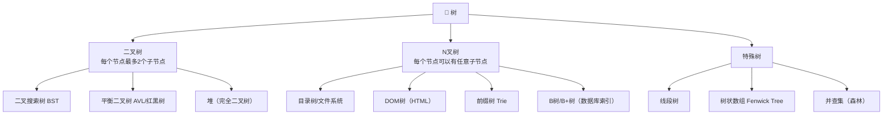
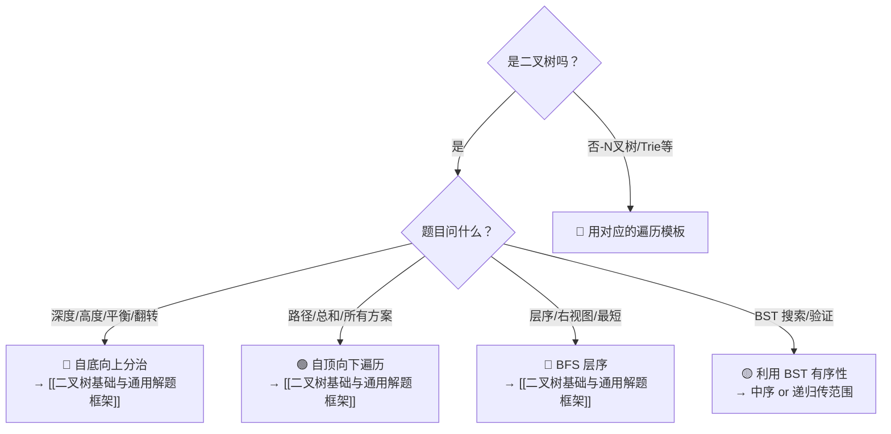

## 前置知识：树到底是什么

**树** = 由节点组成的**分层数据结构**，有一个根节点，每个节点可以有若干子节点，但**没有环**。

```
         [根 root]
        /    |    \
     [子]  [子]  [子]       ← 每个节点可以有多个孩子
     /  \         |
   [孙][孙]     [孙]        ← 没有环，不会走回祖先
```

> [!important] 树 vs 图
> **树是图的特例**：无环连通图。任何两个节点之间有且仅有一条路径。

### 核心术语

| 术语 | 含义 |
|------|------|
| 根 (root) | 最顶层的节点，没有父节点 |
| 父/子 (parent/child) | 直接上下级关系 |
| 叶子 (leaf) | 没有子节点的节点 |
| 深度 (depth) | 从根到该节点的边数（根深度=0） |
| 高度 (height) | 从该节点到最深叶子的边数（叶子高度=0） |
| 子树 (subtree) | 以某个节点为根的树 |
| 度 (degree) | 一个节点的子节点数 |

---

## 树的分类



### 二叉树 — 最重要的树

> [!info] 二叉树是 LeetCode 中考得最多的树
> 详细内容见 [[二叉树基础与通用解题框架]]，涵盖了：
> • TreeNode 定义、数组到二叉树的构建原理
> • 两大思维模式（自顶向下遍历 + 自底向上分治）
> • 三大万能模板（DFS遍历、DFS分治、BFS层序）
> • 完整的练习路线图

这里只补充二叉树笔记中未覆盖的内容。

---

## N 叉树的遍历

N 叉树每个节点有 `children` 列表（而不是 `left` / `right`）。

```python
class Node:
    def __init__(self, val=None, children=None):
        self.val = val
        self.children = children if children else []
```

### 前序遍历（根 → 所有子）

```python
# ====== 589. N叉树的前序遍历 ======
# 递归版
def preorder(root):
    if not root:
        return []
    res = [root.val]
    for child in root.children:
        res.extend(preorder(child))
    return res

# 迭代版（栈）
def preorder_iter(root):
    if not root:
        return []
    res, stack = [], [root]
    while stack:
        node = stack.pop()
        res.append(node.val)
        stack.extend(reversed(node.children))  # 倒序入栈保证正序出栈
    return res
```

### 后序遍历（所有子 → 根）

```python
# ====== 590. N叉树的后序遍历 ======
def postorder(root):
    if not root:
        return []
    res = []
    for child in root.children:
        res.extend(postorder(child))
    res.append(root.val)
    return res
```

### 层序遍历（BFS）

```python
# ====== 429. N叉树的层序遍历 ======
from collections import deque

def levelOrder(root):
    if not root:
        return []
    res, q = [], deque([root])
    while q:
        level = []
        for _ in range(len(q)):
            node = q.popleft()
            level.append(node.val)
            q.extend(node.children)        # 全部孩子入队
        res.append(level)
    return res
```

---

## 二叉搜索树（BST）

**左子树所有节点 < 根 < 右子树所有节点**（中序遍历得到有序序列）。

```python
# ====== 98. 验证二叉搜索树 ======
def isValidBST(root, lo=float('-inf'), hi=float('inf')):
    if not root:
        return True
    if root.val <= lo or root.val >= hi:
        return False
    return (isValidBST(root.left, lo, root.val) and
            isValidBST(root.right, root.val, hi))
```

**BST 常见题型**：

| 题号 | 题目 | 关键 |
|------|------|------|
| 98 | 验证 BST | 递归传范围 |
| 700 | BST 搜索 | 二分思想 |
| 701 | BST 插入 | 找空位插入 |
| 450 | BST 删除 | 三种情况讨论 |
| 230 | BST 第K小 | 中序遍历 |
| 108 | 有序数组转 BST | 二分建树 |
| 235 | BST 最近公共祖先 | 利用 BST 有序性 |

---

## 其他特殊树速览

| 树的类型 | 一句话 | 关键操作 | 详细笔记 |
|----------|--------|---------|---------|
| **堆 (Heap)** | 完全二叉树，父节点 ≤ 子节点（小顶堆） | push O(log n), pop O(log n), peek O(1) | [[分治与堆：从原理到实战]] |
| **Trie（前缀树）** | 每个节点存一个字符，路径形成单词 | 插入/搜索/前缀搜索 O(len) | — |
| **线段树** | 区间查询+更新，每个节点代表一个区间 | 区间求和/最值 O(log n) | — |
| **树状数组** | 比线段树更轻量的区间查询 | `lowbit` 操作，代码极短 | [[位运算基础与通用解题框架]] |
| **并查集** | 森林结构，管理集合合并与查询 | find O(α(n)), union O(α(n)) | [[并查集基础与通用解题框架]] |

### Trie 模板

```python
# ====== 208. 实现 Trie ======
class TrieNode:
    def __init__(self):
        self.children = {}
        self.is_end = False

class Trie:
    def __init__(self):
        self.root = TrieNode()

    def insert(self, word):
        node = self.root
        for ch in word:
            if ch not in node.children:
                node.children[ch] = TrieNode()
            node = node.children[ch]
        node.is_end = True

    def search(self, word):
        node = self.root
        for ch in word:
            if ch not in node.children:
                return False
            node = node.children[ch]
        return node.is_end

    def startsWith(self, prefix):
        node = self.root
        for ch in prefix:
            if ch not in node.children:
                return False
            node = node.children[ch]
        return True
```

---

## 拿到树的题，先问自己



---

## 新手练习路线图

```
阶段 1️⃣  二叉树基础 → [[二叉树基础与通用解题框架]] 全路线

阶段 2️⃣  N叉树
  ├── 589. N叉树的前序遍历
  ├── 590. N叉树的后序遍历
  └── 429. N叉树的层序遍历

阶段 3️⃣  二叉搜索树
  ├── 700. 二叉搜索树中的搜索
  ├── 98. 验证二叉搜索树
  ├── 230. BST第K小
  └── 235. BST最近公共祖先

阶段 4️⃣  前缀树 Trie
  ├── 208. 实现 Trie
  └── 211. 添加与搜索单词

阶段 5️⃣  线段树/树状数组（进阶）
  ├── 307. 区域和检索-可修改
  └── 315. 计算右侧小于当前元素的个数
```

---

## 常见易错点

> [!warning] **坑 1：搞混深度和高度的定义**
> 深度=从根往下数，高度=从叶子往上数。⚠️ 注意两种计数口径：按**边数**计，根深度=0，单节点树的深度/高度为 0；按**节点数**计，根深度=1，单节点树为 1。LeetCode 104「二叉树的最大深度」按**节点数**计（单节点树答案为 1），若按边数口径去解释会差 1。做题前先确认题目用哪种口径。

> [!warning] **坑 2：N叉树遍历时忘记倒序入栈**
> 迭代前序遍历时，孩子要 `reversed` 后入栈，否则访问顺序会反。

> [!warning] **坑 3：BST 验证要传范围，不能只比较父子**
> ```python
> # ❌ 只比较父子节点
> if root.left and root.left.val >= root.val: return False
> # ✅ 递归传范围
> ```

> [!warning] **坑 4：Trie 的 `is_end` 标记容易被遗忘**
> 没有 `is_end`，搜索 "app" 时 "apple" 也会被误判为存在。

---

## 相关笔记

- [[二叉树基础与通用解题框架]] — 二叉树的详细笔记（核心）
- [[牛客网 ACM 模式二叉树解题模板]] — ACM 输入模式下的建树和调试
- [[DFS深度优先搜索基础与通用解题框架]]
- [[BFS广度优先搜索基础与通用解题框架]]
- [[图论基础与通用解题框架]] — 树是图的特例
- [[并查集基础与通用解题框架]] — 森林的集合管理
- [[分治与堆：从原理到实战]] — 堆/优先队列
- [[位运算基础与通用解题框架]] — 树状数组的 lowbit
