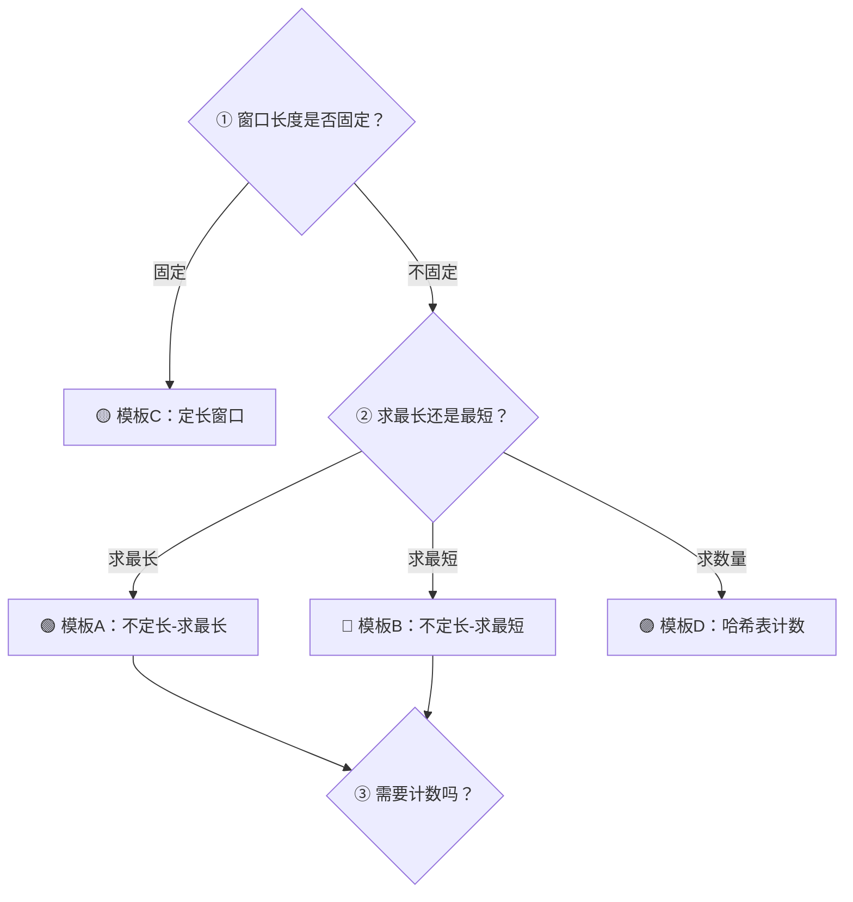

## 前置知识：滑动窗口是什么

### 暴力解法的痛点

很多子串/子数组问题，暴力做法是枚举所有起点和终点：

```python
# 暴力：无重复字符的最长子串，O(n²)
ans = 0
for i in range(len(s)):
    seen = set()
    for j in range(i, len(s)):
        if s[j] in seen:
            break
        seen.add(s[j])
        ans = max(ans, j - i + 1)
```

每次 i 右移一个位置，j 又得从 i 开始重新扫——大量重复工作。

### 滑动窗口的直觉

**关键观察**：如果 `s[i:j]` 已经是一个合法的无重复子串，那么把 i 右移一位后，`s[i+1:j]` 必然也是合法的——没必要让 j 退回来重新扫。

```
暴力:   i=0  j扫:  a→b→c→a(冲突,break)
        i=1  j扫:  b→c→a→...   ← j 退回来了！
滑动:   i=0  j扫:  a→b→c→a(冲突)
        i=1  j继续:       a    ← j 不停，继续走！
```

> [!important] 一句话定义
> **滑动窗口 = 两个指针 `l` 和 `r` 界定一个连续区间，`r` 主动扩张，`l` 被动收缩，二者都只增不减，在 O(n) 时间内遍历所有"有可能"的区间。**

### 为什么是 O(n)

```python
l = 0
for r in range(len(s)):
    # 处理 s[r] 加入窗口
    while 窗口不合法:
        # 移除 s[l]
        l += 1
    # 此时窗口合法，更新答案
```

- `r` 从 0 走到 n-1：O(n)
- `l` 从 0 最多走到 n-1：O(n)
- 每个元素被加入一次、移除一次，总共 O(n)

> [!warning] 滑动窗口的前提
> 滑动窗口只适用于 **"右指针右移，窗口单调变化"** 的场景。如果收缩左指针后窗口条件变得更苛刻，滑动窗口就不适用。绝大多数子串/子数组问题满足这个性质。

---

## 四大核心模板（重中之重！）

### 模板选择决策树



---

## 🟢 模板A：不定长窗口--求最长

**适用场景**：求满足条件的**最长**子串/子数组。

**核心结构**：窗口不满足条件时才收缩，满足条件时持续扩张并更新答案。

```python
# ====== 模板 A：不定长窗口——求最长 ======
def longest_window(s):
    l = 0
    ans = 0
    # window 数据结构（set / dict / Counter / 变量），按需初始化

    for r in range(len(s)):
        # ① 先收缩：移除会让窗口不合法的旧元素（set 去重场景）
        while s[r] in window:
            window.remove(s[l])
            l += 1

        # ② 再将 s[r] 加入窗口
        window.add(s[r])

        # ③ 此时窗口合法，更新答案（在 while 外面！）
        ans = max(ans, r - l + 1)

    return ans
```

> [!warning] "先加后缩"还是"先缩后加"？
> 在 set 去重场景，**必须先缩后加**：新字符 `s[r]` 自己就会触发"不合法"（`s[r] in window`），若先 `add` 再判重，`s = "aa"` 会返回 0（r=0 时刚加入的 'a' 立刻被 while 收缩掉）。"先加后缩"只适用于窗口条件与"s[r] 是否已在窗口"**无关**的场景——sum 类（如 209/1004）和种类数类（如 904 的 `len(window) > 2`），此时先加后缩、先缩后加都对。

> [!tip] 为什么更新答案在 while 外面？
> 因为 while 收缩后窗口才变得合法，此时才是有效窗口。如果在 while 里面更新，可能更新到非法窗口的长度。

### 真题示例

**3. 无重复字符的最长子串**

```python
def lengthOfLongestSubstring(s):
    l = 0
    ans = 0
    window = set()

    for r in range(len(s)):
        # ① 窗口不合法：s[r] 重复了 → 一直移除直到没有重复
        while s[r] in window:
            window.remove(s[l])
            l += 1

        # ② s[r] 不再重复，加入窗口
        window.add(s[r])

        # ③ 窗口合法，更新答案
        ans = max(ans, r - l + 1)

    return ans
```

**详解执行过程**（以 `s = "abcabcbb"` 为例）：

```
r=0, s[r]='a': window={}, while不进入 → add 'a' → window={'a'}, ans=1
r=1, s[r]='b': window={'a'}, 'b'不在 → add 'b' → window={'a','b'}, ans=2
r=2, s[r]='c': window={'a','b'}, 'c'不在 → add 'c' → window={'a','b','c'}, ans=3
r=3, s[r]='a': window={'a','b','c'}, 'a'在! → remove s[0]='a', l=1
               window={'b','c'}, 'a'不在 → add 'a', ans=max(3, 3-1+1)=3
r=4, s[r]='b': window={'b','c','a'}, 'b'在! → remove s[1]='b', l=2
               window={'c','a'}, 'b'不在 → add 'b', ans=max(3, 4-2+1)=3
...
```

**1004. 最大连续1的个数 III**

```python
def longestOnes(nums, k):
    l = 0
    zeros = 0                               # 窗口内 0 的个数
    ans = 0

    for r in range(len(nums)):
        if nums[r] == 0:
            zeros += 1                      # ① 0 进入窗口

        while zeros > k:                    # ② 0 太多了，收缩
            if nums[l] == 0:
                zeros -= 1
            l += 1

        ans = max(ans, r - l + 1)           # ③ 更新答案

    return ans
```

---

## 🔵 模板B：不定长窗口--求最短

**适用场景**：求满足条件的**最短**子串/子数组。

**核心结构**：窗口满足条件时才更新答案并收缩，不满足条件时持续扩张。

```python
# ====== 模板 B：不定长窗口——求最短 ======
def shortest_window(nums, target):
    l = 0
    ans = float('inf')                       # ① 初始化答案为正无穷
    window_sum = 0                           # ② 数值口径（窗口和）；Counter 口径见 76 题

    for r in range(len(nums)):
        # ③ 将 nums[r] 加入窗口（Counter 场景是 window[c] += 1，不存在 window.add）
        window_sum += nums[r]

        # ④ while 窗口满足条件 → 更新答案 + 收缩
        while window_sum >= target:
            ans = min(ans, r - l + 1)        # ⚠️ 在 while 里面更新！
            window_sum -= nums[l]
            l += 1                           # 尝试更短的窗口

    return ans if ans != float('inf') else 0
```

> [!tip] 与模板A的关键区别
> | | 模板A（求最长） | 模板B（求最短） |
> |---|---|---|
> | **while 条件** | 窗口**不**合法 | 窗口合法 |
> | **更新位置** | while **之后** | while **之内** |
> | **收缩目的** | 排非法的元素 | 尝试更短的合法窗口 |
> | **ans 初始化** | 0 | `float('inf')` |
> | **循环逻辑** | "不合法的都赶出去，再量" | "合法的都试一遍，再缩" |

### 真题示例

**209. 长度最小的子数组**

```python
def minSubArrayLen(target, nums):
    l = 0
    window_sum = 0
    ans = float('inf')

    for r in range(len(nums)):
        window_sum += nums[r]               # ① 加入窗口

        while window_sum >= target:         # ② 窗口满足条件
            ans = min(ans, r - l + 1)       # ③ 更新答案（在 while 内！）
            window_sum -= nums[l]           # ④ 收缩，尝试更短
            l += 1

    return ans if ans != float('inf') else 0
```

**76. 最小覆盖子串（经典难题）**

```python
from collections import Counter

def minWindow(s, t):
    need = Counter(t)                       # 需要的字符及其个数
    window = Counter()                      # 窗口内的字符计数
    l = 0
    valid = 0                               # 已满足的字符种类数
    start = 0                               # 最短子串起始位置
    ans = float('inf')

    for r in range(len(s)):
        c = s[r]
        # ① 加入窗口
        window[c] += 1
        if window[c] == need[c]:            # 恰好满足该字符的需求
            valid += 1

        # ② while 窗口满足条件 → 尝试收缩
        while valid == len(need):
            # ③ 更新答案
            if r - l + 1 < ans:
                ans = r - l + 1
                start = l

            # ④ 收缩左边界
            d = s[l]
            if window[d] == need[d]:        # 移除后不再满足
                valid -= 1
            window[d] -= 1
            l += 1

    return s[start:start + ans] if ans != float('inf') else ''
```

> [!important] 76 题中的 `valid` 计数器设计
> `valid` 记录的是"**种类数**满足条件"的字符数量，不是总次数。比如 t 需要 2 个 'a'，只有当窗口内至少有 2 个 'a' 时，'a' 才算 valid。当 `valid == len(need)` 时，所有字符种类都满足了。

---

## 🟡 模板C：定长窗口

**适用场景**：窗口长度固定为 `k`，滑动时只移出一个、移入一个。

```python
# ====== 模板 C：定长窗口 ======
def fixed_window(arr, k):
    l = 0
    # 初始化窗口状态（和 / 计数 / 集合）

    for r in range(len(arr)):
        # ① 加入 arr[r]
        更新窗口状态(r, +1)

        # ② 窗口达到长度 k 时，开始同步移动
        if r - l + 1 == k:
            # ③ 处理当前窗口（更新答案）
            更新答案()

            # ④ 窗口整体右移：移出 arr[l]，l 右移
            更新窗口状态(l, -1)
            l += 1
```

> [!tip] 定长窗口的关键
> 定长窗口不需要 `while` 循环——因为长度固定，每步一定只移出一个、移入一个，用 `if` 判断长度即可。

### 真题示例

**643. 子数组最大平均数 I**

```python
def findMaxAverage(nums, k):
    window_sum = sum(nums[:k])              # 初始窗口
    ans = window_sum

    for r in range(k, len(nums)):
        window_sum += nums[r]               # 加入右边界
        window_sum -= nums[r - k]           # 移出左边界（r-k 就是 l 的位置）
        ans = max(ans, window_sum)

    return ans / k
```

**438. 找到字符串中所有字母异位词**

```python
from collections import Counter

def findAnagrams(s, p):
    need = Counter(p)
    window = Counter()
    l = 0
    valid = 0
    ans = []

    for r in range(len(s)):
        # ① 加入 s[r]
        c = s[r]
        window[c] += 1
        if window[c] == need[c]:
            valid += 1

        # ② 窗口达到长度 len(p) 时，开始同步移动
        if r - l + 1 == len(p):
            # ③ 判断是否为异位词
            if valid == len(need):
                ans.append(l)

            # ④ 收缩左边界
            d = s[l]
            if window[d] == need[d]:
                valid -= 1
            window[d] -= 1
            l += 1

    return ans
```

**567. 字符串的排列**

```python
def checkInclusion(s1, s2):
    # 完全等同于 438，只是返回 bool
    need = Counter(s1)
    window = Counter()
    l = 0
    valid = 0

    for r in range(len(s2)):
        c = s2[r]
        window[c] += 1
        if window[c] == need[c]:
            valid += 1

        if r - l + 1 == len(s1):
            if valid == len(need):
                return True
            d = s2[l]
            if window[d] == need[d]:
                valid -= 1
            window[d] -= 1
            l += 1

    return False
```

---

## 🟣 模板D：哈希表辅助计数窗口

这是对模板 A/B/C 的**增强**——当窗口条件涉及到字符/元素出现的**精确次数**时，用 `valid` 计数器优化判断。

```python
# ====== 模板 D：哈希表 + valid 计数器 ======
from collections import Counter

def window_with_valid(s, target):
    need = Counter(target)       # ① 需要满足的字符及其频次
    window = Counter()            # ② 窗口内的字符频次
    l = 0
    valid = 0                     # ③ 已满足"频次要求"的字符种类数
    ans = 初始值

    for r in range(len(s)):
        c = s[r]
        # ④ 加入窗口，更新 valid
        window[c] += 1
        if window[c] == need[c]:  # 恰好达到需求频次
            valid += 1

        # ⑤ 根据题目类型选择收缩逻辑
        while 收缩条件:
            d = s[l]
            # ⑥ 移出窗口前，更新 valid
            if window[d] == need[d]:
                valid -= 1
            window[d] -= 1
            l += 1

        # ⑦ 更新答案（注意位置：最长在 while 后，最短在 while 内）

    return ans
```

> [!tip] `valid` 计数器为何高效
> 不用每次检查所有 26 个字母或所有 target 字符——只需 O(1) 维护一个整数。`valid == len(need)` 等价于 "窗口涵盖了 target 的所有字符"。

### 真题示例

**904. 水果成篮（至多包含两种不同字符的最长子串）**

```python
def totalFruit(fruits):
    l = 0
    window = Counter()
    ans = 0

    for r in range(len(fruits)):
        window[fruits[r]] += 1              # ① 加入

        while len(window) > 2:              # ② 篮子只能装两种
            window[fruits[l]] -= 1
            if window[fruits[l]] == 0:
                del window[fruits[l]]       # 清掉计数为 0 的 key
            l += 1

        ans = max(ans, r - l + 1)           # ③ 更新答案

    return ans
```

---

## 关键技巧：while 还是 if？

这是滑动窗口中最容易搞混的问题。

| 使用场景 | 用 `while` | 用 `if` |
|----------|-----------|---------|
| **窗口长度** | 不定长 | 定长 |
| **收缩次数** | 可能连续收缩多次 | 每步最多收缩一次 |
| **为什么要 while** | 加入一个元素后，可能需要移除多个旧元素才能恢复合法 | 定长窗口每次只移出一个 |
| **示例** | `while s[r] in window:`（可能连着移好几个重复字符） | `if r - l + 1 == k:`（每次只移出最左那个） |

```python
# 不定长窗口：用 while——多个旧元素可能都要移除
# 例如 s[r]='a' 加入后，window 可能 s[l]..s[l+3] 都是重复的，
# 需要连续收缩直到把之前的 'a' 移除
while s[r] in window:
    window.remove(s[l])
    l += 1

# 定长窗口：用 if——长度刚好触发，每次只移一个
if r - l + 1 == k:
    window.remove(s[l])
    l += 1
```

> [!warning] 常见错误
> ```python
> # ❌ 不定长窗口用 if——只收缩一次就不管了
> #   l 只移动了一位，窗口可能仍然不合法！
> if s[r] in window:
>     window.remove(s[l])
>     l += 1
> 
> # ✅ 不定长窗口必须用 while——一直收缩到合法为止
> while s[r] in window:
>     window.remove(s[l])
>     l += 1
> ```

---

## `valid` 计数器的设计精髓

`valid` 是滑动窗口中最巧妙的变量——用一个整数代替遍历检查。

### 设计原则

```
valid = "窗口中有多少种字符已经满足了 need 的频次要求"
```

注意：**是种类数，不是总字符数。**

### valid 的操作时机

```python
# 加入字符 c
window[c] += 1
if window[c] == need[c]:   # ⚠️ 是 ==，不是 >=
    valid += 1              # 恰好达到需求，valid 才 +1

# 移除字符 d
if window[d] == need[d]:   # ⚠️ 移除前判断！移除后就不满足了
    valid -= 1
window[d] -= 1
```

> [!warning] valid 更新的易错点
> ```python
> # ❌ 错误：用 >= 判断
> if window[c] >= need[c]:
>     valid += 1              # 每多加入一个就 +1，valid 会重复计数
> 
> # ❌ 错误：移除后再判断
> window[d] -= 1
> if window[d] < need[d]:
>     valid -= 1
> 
> # ✅ 正确：用 == 判断"恰好满足"
> if window[c] == need[c]:
>     valid += 1
> # 移除时：先判断再操作
> if window[d] == need[d]:
>     valid -= 1
> window[d] -= 1
> ```

---

## 四大模板速查表

| | 🟢 模板A 求最长 | 🔵 模板B 求最短 | 🟡 模板C 定长 | 🟣 模板D 哈希计数 |
|---|---|---|---|---|
| **while 条件** | 窗口不合法 | 窗口合法 | 不需要 while | 按需（合法/不合法） |
| **更新答案位置** | while 之后 | while 之内 | 窗口满长度时 | 依题意 |
| **ans 初始值** | 0 | `float('inf')` | 依题意 | 依题意 |
| **辅助结构** | set / 变量 | Counter / 变量 | 变量 | Counter + valid |
| **典型题** | 3, 1004, 904 | 209, 76 | 643, 438, 567 | 76, 438 |
| **收缩逻辑** | 排非法的 | 试更短的 | 保持定长 | 依题意 |
| **一句话** | "一直扩，不合法才缩" | "一直扩，合法就缩" | "扩一个，丢一个" | "精确计数，valid 判定" |

---

## 新手练习路线图

> [!important] 练习策略
> 模板B（求最短）比模板A（求最长）更容易出错，建议按以下顺序渐进练习。

```
阶段 1️⃣  不定长窗口-求最长（模板A，最直观）
  ├── 3. 无重复字符的最长子串        ← 理解"窗口 + set"和 while 收缩
  ├── 1004. 最大连续1的个数 III      ← 理解"翻转 k 个 0"→ 窗口内最多 k 个 0
  └── 904. 水果成篮                  ← 理解 Counter + len(window) 作为条件

阶段 2️⃣  不定长窗口-求最短（模板B，容易搞混更新位置）
  ├── 209. 长度最小的子数组          ← 理解"while 内更新答案"
  ├── 713. 乘积小于 K 的子数组       ← 统计数量（变体）
  └── 76. 最小覆盖子串              ← 理解 valid 计数器（必做！）

阶段 3️⃣  定长窗口（模板C，最简单）
  ├── 643. 子数组最大平均数 I       ← 理解固定长度窗口
  ├── 438. 找到字符串中所有字母异位词 ← 定长 + valid 计数器
  ├── 567. 字符串的排列             ← 和 438 几乎一样
  └── 187. 重复的DNA序列            ← 定长窗口 + 哈希去重

阶段 4️⃣  哈希表计数窗口（模板D，valid 计数器专项）
  ├── 76. 最小覆盖子串              ← 再次练习（本题集大成）
  ├── 395. 至少有K个重复字符的最长子串 ← 逆向思维（难度较高）
  └── 1208. 尽可能使字符串相等      ← 窗口内 cost <= maxCost

阶段 5️⃣  综合练习（混合运用）
  ├── 219. 存在重复元素 II          ← 窗口 + set
  ├── 220. 存在重复元素 III         ← 窗口 + 桶排序
  ├── 340. 至多包含K个不同字符的最长子串 ← 模板A变体
  ├── 159. 至多包含两个不同字符的最长子串 ← 904 的字符版本
  └── 424. 替换后的最长重复字符     ← 巧妙窗口
```

---

## 常见易错点

> [!warning] **坑 1：模板A和模板B的更新位置搞反**
> ```python
> # 模板A（求最长）：更新在 while 后面
> while 不合法:
>     l += 1
> ans = max(ans, r - l + 1)    # ✅ 合法后再量
> 
> # 模板B（求最短）：更新在 while 里面
> while 合法:
>     ans = min(ans, r - l + 1) # ✅ 每次合法都量，尝试更短
>     l += 1
> ```
> **记忆法**：求最长 = "window 都合法了再量"；求最短 = "window 合法了就量，然后缩了继续量"。

> [!warning] **坑 2：不定长窗口用 if 而不是 while 收缩**
> ```python
> # ❌ if 只收缩一次
> if s[r] in window:
>     window.remove(s[l])
>     l += 1
> # 窗口可能仍然不合法！
> 
> # ✅ while 一直收缩到合法
> while s[r] in window:
>     window.remove(s[l])
>     l += 1
> ```

> [!warning] **坑 3：valid 计数器更新时机错误**
> ```python
> # ❌ 移除后再判断——此时 window[d] 已经变了
> window[d] -= 1
> if window[d] < need[d]:
>     valid -= 1
> 
> # ✅ 先判断、再修改
> if window[d] == need[d]:
>     valid -= 1
> window[d] -= 1
> ```

> [!warning] **坑 4：Counter 中值为 0 的 key 没有删除**
> ```python
> # ❌ window 中可能残留值为 0 的 key
> window[s[l]] -= 1
> l += 1
> # 此时 len(window) 还是原来的值！
> 
> # ✅ 如果值为 0，删除该 key
> window[s[l]] -= 1
> if window[s[l]] == 0:
>     del window[s[l]]
> l += 1
> ```
> 这在使用 `len(window)` 作为窗口内元素种类数判断时（如 904 水果成篮）尤其重要。

> [!warning] **坑 5：`ans` 初始值设置错误**
> ```python
> # 求最长 → ans = 0（最小值）
> ans = 0
> 
> # 求最短 → ans = float('inf')（最大值）
> ans = float('inf')
> # 最后别忘了处理无解的情况：
> return ans if ans != float('inf') else 0
> ```

> [!warning] **坑 6：`l <= r` 没有保证**
> 理论上 `l` 永远不会超过 `r`，因为在 `for r in range(len(s))` 循环中，每次 `r` 先前进，然后 `while` 最多把 `l` 收缩到 `r + 1`（此时窗口为空，也合法）。但如果 while 条件写得不对，可能 `l > r` 导致索引越界。最安全的写法是 `while l <= r and 条件`。

---

## 滑动窗口 vs 双指针（彻底区分）

| 维度 | 滑动窗口 | 双指针（左右/快慢） |
|------|----------|---------------------|
| **维护什么** | 一个连续区间 `[l, r]` | 两个独立位置的元素 |
| **指针关系** | `l` 是左边界，`r` 是右边界 | 两个指针各有独立语义 |
| **关心连续性** | 必须连续 | 通常不关心 |
| **典型问法** | "子串""子数组""连续" | "两数之和""交点""中点" |
| **O(n) 原因** | 左右指针都只增不减 | 每个指针最多走 n 步 |
| **代表题** | 3, 76, 209, 438 | 167, 26, 141, 88 |

> [!tip] 一句话区分
> **如果你在找"连续的一段"，就是滑动窗口；如果你在找"两个位置"，就是双指针。**

---

## 量化场景应用：滚动指标就是定长窗口

> 2026-09 增补。量化研究里的"滚动统计"（rolling statistics）就是模板 C 的直接业务化——见 [[01-学习/时间序列/00-时间序列学习路径总索引|时间序列]] 与 [[01-学习/量化研究/00-量化研究与回测学习路径总索引|量化研究与回测]] 专题。

### 应用 1：定长窗口 = rolling 均值/波动率

Pandas 的 `rolling(20).mean()` 本质就是模板 C：维护窗口和，"加一个、丢一个"，O(n) 而非 O(n×W)：

```python
def rolling_mean(xs, w):
    """w 日均线的手工实现——模板 C 的增量维护"""
    out = []
    window_sum = sum(xs[:w - 1])          # 预放前 w-1 个
    for r in range(w - 1, len(xs)):
        window_sum += xs[r]               # 加入右边界
        out.append(window_sum / w)        # 窗口满长，记录均值
        window_sum -= xs[r - w + 1]       # 移出左边界
    return out
```

滚动波动率同理：同时维护 `sum` 与 `sum_sq`，`var = sum_sq/w − mean²`（注意大数相减的数值精度问题，工程上 Welford 在线算法更稳）。

### 应用 2：窗口最值（20 日最高/最低）→ 单调队列

支撑/阻力位要算"最近 20 日的最高价"——定长窗口求**最值**是模板 C 的进阶变体，朴素做法 O(n×W)，用**单调队列**（[[239. 滑动窗口最大值]]）可做到 O(n)。

### 应用 3：窗口纪律 = 反 look-ahead 纪律

滑动窗口"右端点只前进、左端点不越过右端点"的纪律，正是时序建模的反泄漏纪律：

- 第 `t` 天的滚动指标，窗口右端点必须是 `t` 本身（只能用 ≤ t 的数据）
- ❌ `xs[t-w : t+w]` 这类"中心窗口"在实盘里等于偷看未来
- 对应 [[01-学习/量化研究/00-量化研究与回测学习路径总索引|量化研究与回测]] 的 look-ahead bias 检查清单

---

## 相关题目索引

| 题号 | 题目 | 模板 | 难度 |
|------|------|------|------|
| 3 | 无重复字符的最长子串 | 🟢 A | 中等 |
| 1004 | 最大连续1的个数 III | 🟢 A | 中等 |
| 904 | 水果成篮 | 🟢 A | 中等 |
| 340 | 至多包含K个不同字符的最长子串 | 🟢 A | 中等 |
| 209 | 长度最小的子数组 | 🔵 B | 中等 |
| 76 | 最小覆盖子串 | 🔵 B + D | 困难 |
| 713 | 乘积小于 K 的子数组 | 🔵 B 变体 | 中等 |
| 643 | 子数组最大平均数 I | 🟡 C | 简单 |
| 438 | 找到字符串中所有字母异位词 | 🟡 C + D | 中等 |
| 567 | 字符串的排列 | 🟡 C + D | 中等 |
| 187 | 重复的DNA序列 | 🟡 C | 中等 |
| 395 | 至少有K个重复字符的最长子串 | 🟣 D | 中等 |
| 424 | 替换后的最长重复字符 | 🟢 A | 中等 |
| 1208 | 尽可能使字符串相等 | 🟢 A | 中等 |
| 219 | 存在重复元素 II | 🟡 C | 简单 |
| 220 | 存在重复元素 III | 🟡 C | 困难 |

---

## 相关笔记

- [[双指针基础与通用解题框架]] — 左右指针、快慢指针、分离指针三大分类
- [[字符串基础与通用解题框架]] — 字符串的遍历、子串判断、回文
- [[哈希表基础与通用解题框架]] — Counter / dict 在窗口计数中的核心作用
- [[数组基础与通用解题框架]] — 数组的遍历、前缀和、原地修改
- [[前缀和基础与通用解题框架]] — 前缀和 + 窗口的配合（如 209 可用前缀和 + 二分做）
- [[二分查找基础与通用解题框架]] — 有些滑动窗口题也可用二分答案做
- [[01-学习/时间序列/00-时间序列学习路径总索引|时间序列专题]] — 滚动均线/波动率/窗口最值的业务背景（2026-09 量化主线增补）
