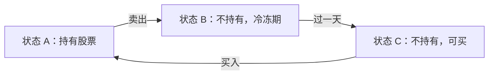
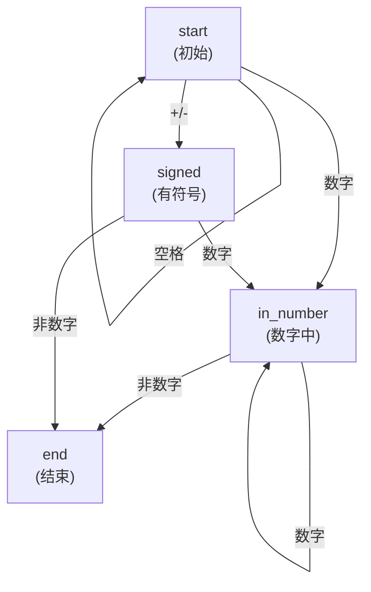
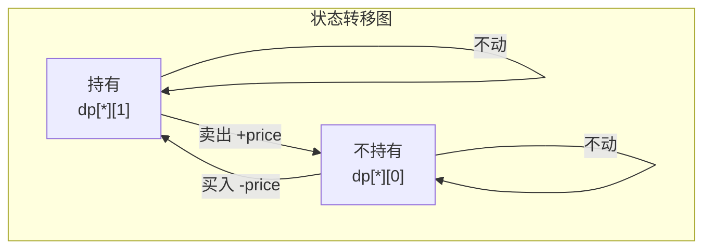

## 前置知识：状态机是什么

### 一句话定义

**状态机（Finite State Machine）**：系统有**有限个状态**，根据**输入**在状态间**转移**。每次转移，你执行对应的行为。



> [!info] 现实中的状态机无处不在
> • **红绿灯**：绿 → 黄 → 红 → 绿
> • **订单状态**：待支付 → 已支付 → 配送中 → 已签收
> • **TCP 连接**：CLOSED → LISTEN → SYN-SENT → ESTABLISHED → ...
> • **正则表达式引擎**：底层就是一个状态机

### 两类状态机

| 类型 | 怎么表示 | 典型场景 |
|------|---------|---------|
| **显式状态机** | 用 `enum`/`dict` 表示状态，`switch`/`if` 处理转移 | 字符串转整数（atoi）、有效数字判断 |
| **隐式状态机** / **状态 DP** | 用 `dp[i][j]` 表示"第 i 天处于状态 j"，状态转移即 DP 方程 | 买卖股票系列 |

> [!important] 本质统一
> 显式和隐式状态机的**本质是一样的**——有限状态 + 明确转移规则。区别只在于：
> • 显式：状态你自己命名，手动写 if-else 转移
> • 隐式：状态藏在 `dp` 的第二维度里，转移规则就是 DP 方程

---

## 类型一：显式状态机

### 适用场景特征

- 输入是一个**字符序列**（字符串）
- 需要根据**上下文不同**做出不同判断
- 写 if-else 越写越乱时，就该画状态图了

### 经典例题：字符串转换整数（LeetCode 8 — atoi）



```python
# LeetCode 8. 字符串转换整数 (atoi)
INT_MAX = 2**31 - 1
INT_MIN = -2**31

class Automaton:
    def __init__(self):
        self.state = 'start'
        self.sign = 1
        self.ans = 0
        # 状态转移表
        self.table = {
            'start':     ['start', 'signed', 'in_number', 'end'],
            'signed':    ['end',   'end',    'in_number', 'end'],
            'in_number': ['end',   'end',    'in_number', 'end'],
            'end':       ['end',   'end',    'end',       'end'],
        }

    def input_char(self, c):
        col = self._get_col(c)
        self.state = self.table[self.state][col]
        if self.state == 'in_number':
            self.ans = self.ans * 10 + int(c)
            # 溢出截断
            self.ans = min(self.ans, INT_MAX) if self.sign == 1 else min(self.ans, -INT_MIN)
        elif self.state == 'signed':
            self.sign = 1 if c == '+' else -1

    def _get_col(self, c):
        if c == ' ':
            return 0
        if c in '+-':
            return 1
        if c.isdigit():
            return 2
        return 3

def myAtoi(s: str) -> int:
    automaton = Automaton()
    for c in s:
        automaton.input_char(c)
    return automaton.sign * automaton.ans
```

> [!tip] 状态机解法为什么好
> atoi 是经典的"if-else 地狱"题。状态机用一张表把**所有转移规则放在一起**，一眼就能看出每个状态下遇到每种输入会去哪里。可维护性远超散落的 if-else。

### 另一经典：有效数字（LeetCode 65）

```python
# LeetCode 65. 有效数字 — 状态机精简版思路
# 状态转移图（略去完整代码，核心是定义状态转移表）

# 状态：
# 0: 初始空白
# 1: 符号位
# 2: 整数部分
# 3: 小数点（前面有整数）
# 4: 小数点（前面无整数）
# 5: 小数部分
# 6: 指数 e/E
# 7: 指数符号位
# 8: 指数数字部分
# 9: 末尾空白

# 类似 atoi，定义转移表，按字符类型跳转
# 最终判断是否停在合法状态（2,3,5,8,9）
```

---

## 类型二：隐式状态机 / 状态 DP（买卖股票通解）

### 核心思想

买卖股票问题的每一天，你只可能有几种**有限的状态**（比如"持有股票"、"不持有股票"）。在状态之间转移时，有收益变化。于是：

```python
dp[i][state] = 第 i 天结束处于状态 state 时的最大收益
```

转移方程就是"从昨天哪个状态能到达今天这个状态，选收益最大的"。

### 买卖股票六题的通用 DP 框架

#### 问题梳理

| 题号 | 交易次数 | 冷冻期 | 手续费 | 难度 |
|------|---------|--------|--------|------|
| 121 | 仅 1 次 | 无 | 无 | Easy |
| 122 | 无数次 | 无 | 无 | Medium |
| 123 | 最多 2 次 | 无 | 无 | Hard |
| 188 | 最多 k 次 | 无 | 无 | Hard |
| 309 | 无数次 | 有（1天） | 无 | Medium |
| 714 | 无数次 | 无 | 有 | Medium |

六道题可以用**一套框架**全部解决。

#### 通用三维 DP

```python
# dp[i][k][0] = 第 i 天，最多完成 k 次交易，不持有股票的最大收益
# dp[i][k][1] = 第 i 天，最多完成 k 次交易，持有股票的最大收益

# 转移方程（核心！）：
# dp[i][k][0] = max(dp[i-1][k][0],          # 昨天就不持有，今天不动
#                    dp[i-1][k][1] + prices[i])  # 昨天持有，今天卖出
# dp[i][k][1] = max(dp[i-1][k][1],          # 昨天就持有，今天不动
#                    dp[i-1][k-1][0] - prices[i]) # 昨天不持有，今天买入（k-1→k）

# Base cases:
# dp[-1][k][0] = 0      (没开始时，不持有，收益为0)
# dp[-1][k][1] = -inf   (没开始时，不可能持有)
# dp[i][0][0] = 0        (不允许交易，不持有)
# dp[i][0][1] = -inf     (不允许交易，不可能持有)
```

> [!important] 关键理解
> **买入操作触发交易次数 +1**（因为一次完整的交易 = 买入 + 卖出）。框架统一约定"买入时计数"。
> 也可以约定"卖出时计数"，只要保持一致性，结果相同。

### 各题适配

#### 121. 买卖股票的最佳时机（k=1）

```python
def maxProfit_121(prices):
    # k = 1 固定，可以去掉 k 维度
    dp_i_0 = 0          # 不持有
    dp_i_1 = float('-inf')  # 持有（初始不可能持有）
    for price in prices:
        dp_i_0 = max(dp_i_0, dp_i_1 + price)
        dp_i_1 = max(dp_i_1, -price)  # k=1 时，买入前的 dp 值是 0
    return dp_i_0
```

#### 122. 买卖股票的最佳时机 II（k=inf）

```python
def maxProfit_122(prices):
    # k = +inf，k 和 k-1 没区别，去掉 k 维度
    dp_i_0 = 0
    dp_i_1 = float('-inf')
    for price in prices:
        temp = dp_i_0
        dp_i_0 = max(dp_i_0, dp_i_1 + price)
        dp_i_1 = max(dp_i_1, temp - price)  # ⚠️ 用 temp，不是 dp_i_0
    return dp_i_0
```

> [!warning] 122 的 temp 陷阱
> `dp_i_1 = max(dp_i_1, dp_i_0 - price)` 是**错误的**！因为 `dp_i_0` 在这一行之前已经被更新了，代表的是"今天的卖出后状态"，不是"昨天的未持有状态"。必须用 `temp` 存住旧值。

#### 123. 买卖股票的最佳时机 III（k=2）

```python
def maxProfit_123(prices):
    # k = 2，固定但需要记录每天每个 k 下的状态
    n = len(prices)
    max_k = 2
    # dp[i][k][0/1]
    dp = [[[0, 0] for _ in range(max_k + 1)] for _ in range(n)]

    for i in range(n):
        for k in range(max_k, 0, -1):  # 从大到小（也可从小到大，k 固定时无所谓）
            if i == 0:
                dp[i][k][0] = 0
                dp[i][k][1] = -prices[0]
            else:
                dp[i][k][0] = max(dp[i-1][k][0], dp[i-1][k][1] + prices[i])
                dp[i][k][1] = max(dp[i-1][k][1], dp[i-1][k-1][0] - prices[i])

    return dp[-1][max_k][0]

# 空间优化版（更实用）
def maxProfit_123_opt(prices):
    # 只保留昨天的 dp，因为 i 只依赖 i-1
    dp_i10 = dp_i20 = 0
    dp_i11 = dp_i21 = float('-inf')
    for price in prices:
        dp_i20 = max(dp_i20, dp_i21 + price)
        dp_i21 = max(dp_i21, dp_i10 - price)
        dp_i10 = max(dp_i10, dp_i11 + price)
        dp_i11 = max(dp_i11, -price)
    return dp_i20
```

#### 188. 买卖股票的最佳时机 IV（k 任意）

```python
def maxProfit_188(k, prices):
    n = len(prices)
    if n == 0:
        return 0

    # 优化：k 超过 n/2 等效于 k=inf（一天一次买卖起码要两天）
    if k > n // 2:
        return maxProfit_122(prices)

    # dp[i][k][0/1]，但用空间优化：只保留两天的数据
    dp_ik0 = [0] * (k + 1)
    dp_ik1 = [float('-inf')] * (k + 1)

    for price in prices:
        for j in range(k, 0, -1):
            dp_ik0[j] = max(dp_ik0[j], dp_ik1[j] + price)
            dp_ik1[j] = max(dp_ik1[j], dp_ik0[j-1] - price)
    return dp_ik0[k]
```

#### 309. 最佳买卖股票时机含冷冻期

```python
def maxProfit_309(prices):
    # 新增一个状态：冷冻期
    # dp[i][0] = 不持有，且不处于冷冻期（可自由买入）
    # dp[i][1] = 持有
    # dp[i][2] = 不持有，且处于冷冻期（今天刚卖出，明天不能买）

    n = len(prices)
    if n <= 1:
        return 0

    dp0, dp1, dp2 = 0, -prices[0], 0

    for price in prices[1:]:
        new_dp0 = max(dp0, dp2)  # 今天可买入状态：昨天就可买，或昨天冷冻结束
        new_dp1 = max(dp1, dp0 - price)  # 持有：昨天持有，或今天买入
        new_dp2 = dp1 + price  # 冷冻期：今天卖出

        dp0, dp1, dp2 = new_dp0, new_dp1, new_dp2

    return max(dp0, dp2)
```

#### 714. 买卖股票的最佳时机含手续费

```python
def maxProfit_714(prices, fee):
    # 在 122 的基础上，卖出时扣手续费
    dp_i_0 = 0
    dp_i_1 = float('-inf')
    for price in prices:
        temp = dp_i_0
        dp_i_0 = max(dp_i_0, dp_i_1 + price)  # 卖出
        dp_i_1 = max(dp_i_1, temp - price - fee)  # 买入时扣手续费也一样
    return dp_i_0

# 也可以在卖出时扣手续费：
# dp_i_0 = max(dp_i_0, dp_i_1 + price - fee)
# dp_i_1 = max(dp_i_1, dp_i_0 - price)  ← 注意这里的 dp_i_0 要用旧值（temp）
```

### 状态机视角下的买卖股票



六道题的区别只在**转移的约束条件**上：
- k=1：买入门槛（只能从 k=0 转移过来）
- k=inf：没有门槛
- 冷冻期：多了一个"冷冻"状态
- 手续费：转移时多扣一个 cost

> [!tip] 面试核心思路
> • 先默写**三维通用框架**：`dp[i][k][0/1]` 的状态含义和转移方程
> • 根据题目约束，决定 k 维度怎么处理（去掉 / 保留 / 简化）
> • 如果有特殊约束（冷冻期、手续费），调整转移方程
> • 最后做空间优化（从 `dp[n][k][2]` 压缩到 O(k) 或 O(1)）

---

## 新手练习路线图

> [!important] 练习策略
> 先掌握"显式状态机"（字符串类题），再攻克"状态 DP"（股票系列）。股票系列务必按照题号顺序做。

```
阶段 1️⃣  显式状态机入门
  ├── 8.   字符串转换整数 (atoi)         ← 典型状态机，理解"状态转移表"
  └── 65.  有效数字                        ← 状态更多，但思路一样

阶段 2️⃣  股票基础
  ├── 121. 买卖股票的最佳时机              ← 理解 dp[i][k][0/1] 框架
  └── 122. 买卖股票的最佳时机 II           ← 理解 k=inf 的化简

阶段 3️⃣  股票进阶
  ├── 309. 买卖股票含冷冻期               ← 多一个状态
  ├── 714. 买卖股票含手续费                ← 转移加 cost
  └── 123. 买卖股票 III                   ← k=2 固定

阶段 4️⃣  股票通用解
  └── 188. 买卖股票 IV                    ← k 任意，用三维 DP 通解

阶段 5️⃣  其他状态 DP（拓展）
  ├── 376. 摆动序列                        ← 两个状态（上升/下降）
  ├── 552. 学生出勤记录 II                ← 多状态 DP
  └── 91.  解码方法                        ← 状态机与字符串 DP 的结合
```

---

## 常见易错点

> [!warning] **坑 1：股票 DP 中的 temp 陷阱**
> ```python
> # ❌ 当天的 dp_0 已经被修改了，dp_1 用的是被污染的当天值
> for price in prices:
>     dp_0 = max(dp_0, dp_1 + price)
>     dp_1 = max(dp_1, dp_0 - price)  # ← dp_0 是今天的新值！
>
> # ✅ 用 temp 保存昨天的 dp_0
> for price in prices:
>     temp = dp_0
>     dp_0 = max(dp_0, dp_1 + price)
>     dp_1 = max(dp_1, temp - price)
> ```

> [!warning] **坑 2：状态初始化搞错**
> ```python
> # 持有状态的初始值为 -inf（或 -price[0]），不是 0
> dp_1 = float('-inf')   # 第一天之前不可能持有股票
>
> # 或者第一天特殊处理：
> dp_0 = 0               # 第一天不持有：没买，收益 0
> dp_1 = -prices[0]      # 第一天持有：买了，收益 -prices[0]
> ```

> [!warning] **坑 3：冷冻期忘记有"三个状态"**
> ```python
> # 冷冻期题不是两个状态，是三个：
> # 可买 / 持有 / 刚卖出（冷冻）
> # 如果只用两个状态，会搞混"可以买"和"刚卖出不许买"！
> ```

> [!warning] **坑 4：显式状态机的转移表索引搞混**
> ```python
> # 转移表：table[当前状态][输入类型] = 下一状态
> # 注意 table 的行是状态名，列是输入类型，值是目标状态名
> # 写大状态机时，建议用 dict 而不是 list：
> table = {
>     'start':     {'digit': 'in_number', 'sign': 'signed', 'space': 'start'},
>     'signed':    {'digit': 'in_number', 'other': 'end'},
>     'in_number': {'digit': 'in_number', 'other': 'end'},
> }
> # 这样绝不会搞错列的对应关系
> ```

---

## 相关笔记

- [[动态规划基础与通用解题框架]] — 状态 DP 是 DP 的高级应用，基础 DP 必须先过关
- [[字符串基础与通用解题框架]] — 显式状态机大量用于字符串解析
- [[图论基础与通用解题框架]] — 状态转移图本质是 DAG，可用拓扑/DFS 分析
