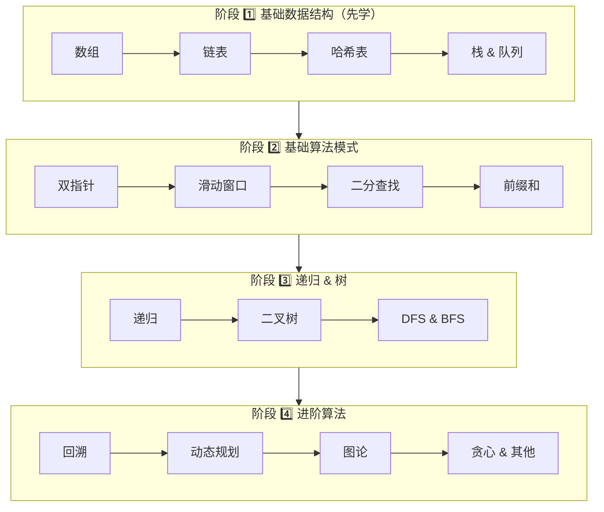

> [!info] 版本基线
> 代码示例基于 Python 3.x（刷题以 LeetCode/牛客网 Python3 为准）。[[二叉树基础与通用解题框架]] 中的数组-树转换规则以 LeetCode 层序格式（队列逐个消费，null 不占子节点槽位）为准。

## 📋 笔记清单

### 🟢 必会基础（18 篇）

| # | 笔记 | 核心内容 |
|---|------|---------|
| 1 | [[数组基础与通用解题框架]] | 连续内存、双指针、前缀和 |
| 2 | [[字符串基础与通用解题框架]] | 不可变性、回文、滑动窗口、KMP思想 |
| 3 | [[排序基础与通用解题框架]] | 快排、归并、堆排、计数排、Timsort |
| 4 | [[前缀和基础与通用解题框架]] | 区间和O(1)、哈希表+前缀和、差分数组 |
| 5 | [[递归基础与通用解题框架]] | 递归三要素、自顶向下vs自底向上、记忆化 |
| 6 | [[循环基础与通用解题框架]] | for/while选型、循环不变量、嵌套循环 |
| 7 | [[滑动窗口基础与通用解题框架]] | 不定长/定长窗口、valid计数器、收缩策略 |
| 8 | [[双指针基础与通用解题框架]] | 左右夹逼、快慢指针、分离指针 |
| 9 | [[栈基础与通用解题框架]] | LIFO、括号匹配、单调栈 |
| 10 | [[进制转换基础与通用解题框架]] | 短除法、按权展开、大数进位模拟 |
| 11 | [[位运算基础与通用解题框架]] | 异或、n&(n-1)、状态压缩 |
| 12 | [[队列基础与通用解题框架]] | FIFO、BFS、单调队列、优先队列 |
| 13 | [[哈希表基础与通用解题框架]] | 计数、快速查找、记忆化、去重、映射 |
| 14 | [[链表基础与通用解题框架]] | 哑节点、快慢指针、穿针引线、递归法 |
| 15 | [[线性表基础与通用解题框架]] | 数组 vs 链表对比、选型决策 |
| 16 | [[二分查找基础与通用解题框架]] | 闭区间/开区间、左边界/右边界、泛化二分 |
| 17 | [[矩阵基础与通用解题框架]] | 边界收缩、原地标记、DP on grid |
| 18 | [[正则表达式基础与通用解题框架]] | re模块、分组捕获、正则DP |

### 🔵 进阶（13 篇）

| # | 笔记 | 核心内容 |
|---|------|---------|
| 19 | [[二叉树基础与通用解题框架]] | 数组↔树转换、两大思维、三大模板（550+ 行完整笔记） |
| 20 | [[树基础与通用解题框架]] | N叉树/BST/Trie，树的分类全景（与二叉树篇互补） |
| 21 | [[DFS深度优先搜索基础与通用解题框架]] | 递归+迭代实现、回溯、记忆化搜索 |
| 22 | [[BFS广度优先搜索基础与通用解题框架]] | 层序、最短路径、多源BFS、扩散问题 |
| 23 | [[图论基础与通用解题框架]] | 邻接表/矩阵、拓扑排序、Dijkstra、MST |
| 24 | [[贪心基础与通用解题框架]] | 区间调度、分配问题、跳跃游戏 |
| 25 | [[排列组合基础与通用解题框架]] | 排列vs组合去重、used vs start |
| 26 | [[动态规划基础与通用解题框架]] | 五步法、线性/背包/区间/网格DP |
| 27 | [[回溯基础与通用解题框架]] | 做选择→递归→撤销选择、排列/组合/子集/棋盘 |
| 28 | [[状态机基础与通用解题框架]] | 显式状态机、状态DP（股票系列通解） |
| 29 | [[并查集基础与通用解题框架]] | 路径压缩、按秩合并、判环/连通分量 |
| 30 | [[分治与堆：从原理到实战]] | 分-治-合三步骤、堆/优先队列 |
| 31 | [[枚举与统计基础与通用解题框架]] | 暴力枚举优化路径、Counter/前缀计数 |

### 📝 补充笔记（3 篇）

| 笔记 | 说明 |
|------|------|
| [[算法核心概念：DP、DFS、BFS]] | 三个核心概念的快速对比（入门导读，先读） |
| [[斐波那契DP解法]] | DP 入门经典例题 |
| [[牛客网 ACM 模式二叉树解题模板]] | ACM 输入模式下的建树和调试 |

---

## 🧩 刷题笔记（9 篇）

### LeetCode

| 题目 | 难度 | 专题 |
|------|------|------|
| [[112. 路径总和]] | 🟢 | 二叉树/DFS/回溯 |
| [[23. 合并 K 个升序链表]] | 🔴 | 链表/堆/分治 |
| [[42. 接雨水]] | 🔴 | 双指针/单调栈 |
| [[70. 爬楼梯]] | 🟢 | DP 入门 |
| [[96. 不同的二叉搜索树]] | 🟡 | DP/卡特兰数 |

### 牛客网

| 题目 | 专题 |
|------|------|
| [[24点游戏算法]] | 递归/全排列/表达式求值 |
| [[字符串加解密]] | 字符串/映射 |
| [[放苹果]] | 递归/DP（整数划分） |
| [[进制转换]] | 进制模拟 |

> [!tip] 题解格式
> 新增题解建议套用 [[题解复盘模板]]：题目 → 思路还原 → 代码 → 复杂度 → 易错点 → 同类题 → 面试记录，并附最小 assert 自测块。

---

## 🧭 题型速查表：看到什么关键词 → 用什么解法

| 题目关键词 | 首选方法 | 详细笔记 |
|------------|---------|---------|
| "两数之和""查找目标" | 哈希表 / 双指针 | [[哈希表基础与通用解题框架]] |
| "子数组和""区间和" | 前缀和 + 哈希表 | [[前缀和基础与通用解题框架]] |
| "最长子串""最短覆盖" | 滑动窗口 | [[滑动窗口基础与通用解题框架]] |
| "回文""反转""两端收缩" | 双指针 | [[双指针基础与通用解题框架]] |
| "有序数组搜索""第K小" | 二分查找 | [[二分查找基础与通用解题框架]] |
| "括号""表达式""下一个更大" | 栈 / 单调栈 | [[栈基础与通用解题框架]] |
| "层序""最短路径""扩散" | BFS | [[BFS广度优先搜索基础与通用解题框架]] |
| "所有路径""所有方案""排列组合" | DFS / 回溯 | [[回溯基础与通用解题框架]] |
| "最大深度""直径""平衡判断" | 后序分治（自底向上） | [[二叉树基础与通用解题框架]] |
| "路径总和""收集路径" | 前序遍历（自顶向下） | [[二叉树基础与通用解题框架]] |
| "链表反转""找中点""判环" | 双指针 / 递归 | [[链表基础与通用解题框架]] |
| "只出现一次""位运算" | 异或 / n&(n-1) | [[位运算基础与通用解题框架]] |
| "最大/最小/方案数" | 动态规划 | [[动态规划基础与通用解题框架]] |
| "课程表""依赖关系" | 拓扑排序 | [[图论基础与通用解题框架]] |
| "合并集合""判环""连通分量" | 并查集 | [[并查集基础与通用解题框架]] |
| "不重叠区间""最少箭" | 贪心（按结束时间排序） | [[贪心基础与通用解题框架]] |
| "螺旋矩阵""旋转图像" | 边界收缩 | [[矩阵基础与通用解题框架]] |
| "买卖股票" | 状态机 DP | [[状态机基础与通用解题框架]] |
| "大数运算""进制" | 进位模拟 / 短除法 | [[进制转换基础与通用解题框架]] |
| "字符串匹配""通配符" | 正则 / DP | [[正则表达式基础与通用解题框架]] |

---

## 🗺️ 推荐学习路线

### 每个阶段的重点

**阶段 1️⃣** — 会写、会遍历、会增删改查。数组和链表是所有数据结构的基础。

**阶段 2️⃣** — 把 O(n²) 优化到 O(n) 的核心技巧。双指针和滑动窗口一通百通。

**阶段 3️⃣** — 递归是理解树/回溯/DP 的前提。二叉树是面试最高频的树结构。

**阶段 4️⃣** — 回溯和 DP 是大题常客，图论补全知识体系。贪心/并查集/状态机按需深入。

---

## ⚡ 面试急救：5 分钟复习流程

1. **数组 & 链表** → 扫一眼双指针模板（左右夹逼 + 快慢指针）
2. **哈希表** → 两数之和模式（`target - num in seen`）
3. **二叉树** → 三大模板心中默背（遍历 / 分治 / BFS）
4. **滑动窗口** → `for r: 加入; while 不满足: 收缩` 
5. **回溯** → "做选择→递归→撤销选择" + 排列用used/组合用start
6. **DP** → 五步法：定义状态→转移方程→初始化→遍历顺序→举例

---

*最后更新：2026-08-23（依据总审阅报告：二叉树篇升入主表、删除占位行、补录 LeetCode/牛客网刷题笔记 9 篇）*
