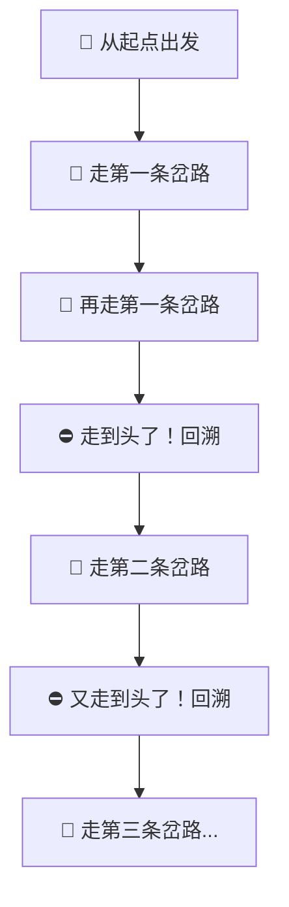
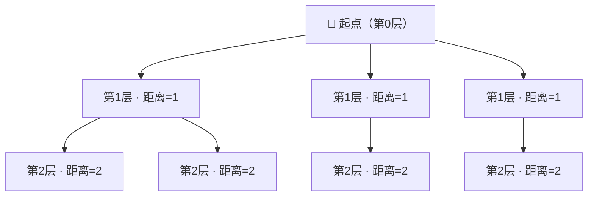
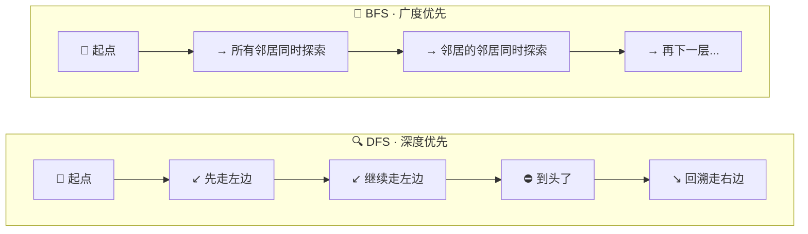
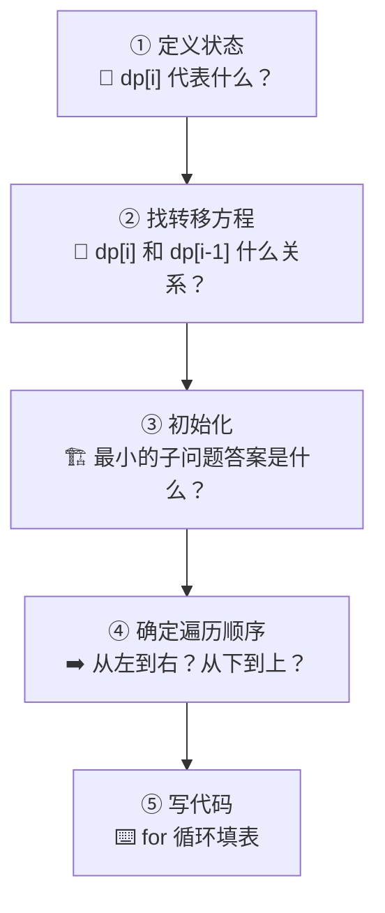
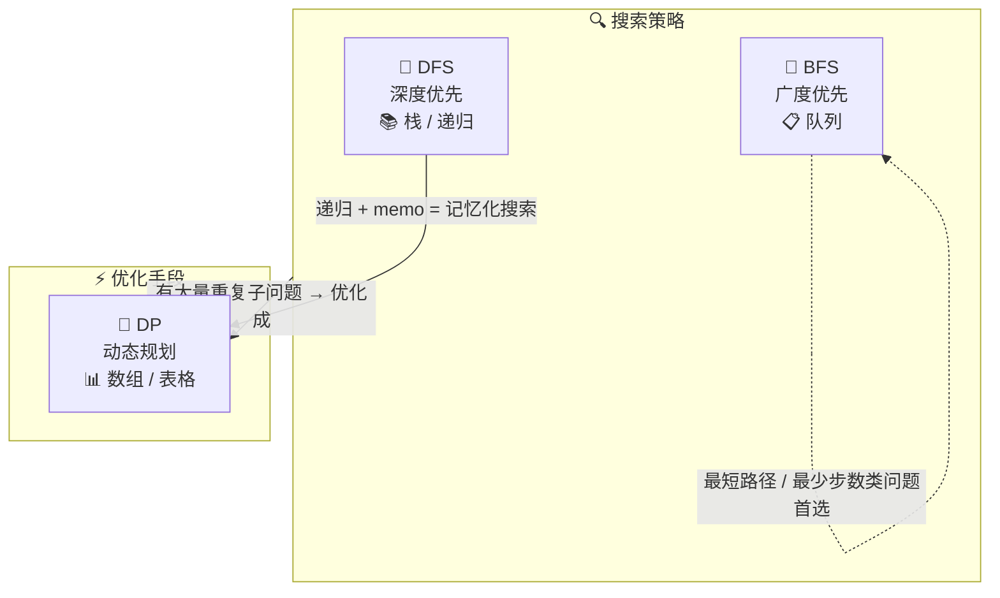

---
tags:
  - algorithm
  - fundamentals
  - dp
  - dfs
  - bfs
lark_doc_url: https://my.feishu.cn/docx/LBezdQXl4orvDsxELcpc3xPfnef
---

# 算法核心概念：DP、DFS、BFS

> 这三个是算法题里出现频率最高的术语。每个都用一句话 + 一个生活类比 + 一个代码例子来讲清楚。

---

## 速览表

| 缩写 | 全称 | 一句话 | 类比 |
|:--|:--|:--|:--|
| **DFS** | Depth-First Search 深度优先搜索 | 一条路走到黑，走不通再回头 | 走迷宫时沿一条岔路探到底 |
| **BFS** | Breadth-First Search 广度优先搜索 | 一层一层往外扩散 | 水波纹从中心向外扩散 |
| **DP** | Dynamic Programming 动态规划 | 把大问题拆成小问题，用小问题的答案拼出大问题的答案 | 背单词：先背字母，再组单词，再造句子 |

---

## 一、DFS（深度优先搜索）

### 核心思想

> 沿着一条路径一直往下走，走到头了再回溯，换另一条路。

### 生活类比

你进了一个迷宫，每到岔路口就选一条路走到底。走到死胡同就原路退回上一个岔路口，换一条没走过的路继续走到底。重复直到找到出口。

### 递归树



### 典型代码（二叉树遍历）

```python
def dfs(node):
    if node is None:
        return
    print(node.val)         # 先处理当前节点
    dfs(node.left)          # 一条路走到黑：左子树
    dfs(node.right)         # 换另一条路：右子树
```

### 什么时候用 DFS？

| 场景 | 例题 |
|:--|:--|
| 遍历树 / 图 | 二叉树的前中后序遍历 |
| 找所有路径 / 所有方案 | 全排列、组合、子集 |
| 回溯（试错） | N皇后、数独 |
| 连通性问题 | 岛屿数量 |

### 🎨 Excalidraw 手绘图

DFS深度优先搜索示意图.excalidraw

### 口诀

```
一条路走到黑，撞墙再回头
```

---

## 二、BFS（广度优先搜索）

### 核心思想

> 从起点开始，先走完所有「一步能到」的位置，再走「两步能到」的位置，层层推进。

### 生活类比

你往平静的水面扔一颗石子，波纹从中心一层一层往外扩散。先覆盖最近的区域，再覆盖稍远的区域。

### 层级扩散图



### 典型代码（二叉树层序遍历）

```python
from collections import deque

def bfs(root):
    if root is None:
        return
    queue = deque([root])      # 队列：存储待访问的节点
    while queue:
        node = queue.popleft()  # 取出队首
        print(node.val)
        if node.left:
            queue.append(node.left)   # 左孩子进队
        if node.right:
            queue.append(node.right)  # 右孩子进队
```

### 什么时候用 BFS？

| 场景 | 例题 |
|:--|:--|
| 最短路径（无权图） | 迷宫最短路径 |
| 层序遍历 | 二叉树的层序遍历 |
| 最少步数问题 | 单词接龙、打开转盘锁 |
| 扩散问题 | 腐烂的橘子、01矩阵 |

### DFS vs BFS 对比



| | DFS | BFS |
|:--|:--|:--|
| 探索方式 | 深度优先，一条路到底 | 广度优先，一层层来 |
| 数据结构 | **栈**（递归隐式使用调用栈） | **队列**（`deque`） |
| 空间消耗 | 深度深时栈可能很大 | 宽度大时队列可能很大 |
| 能否找最短路径 | ❌ 不能保证 | ✅ 天然适合（无权图） |
| 实现难度 | 简单（递归几行代码） | 稍复杂（需要显式维护队列） |

### 🎨 Excalidraw 手绘图

BFS广度优先搜索示意图.excalidraw

### 口诀

```
波纹扩散层层推，队列里面排好队
```

---

## 三、DP（动态规划）

### 核心思想

> 把大问题拆成重叠的小问题，每个小问题只算一次，存起来复用。

### 生活类比

你在背一篇英文文章：
- ❌ **暴力**：每次从头背到尾 → 累死
- ✅ **DP**：先背会 26 个字母 → 再背常用单词 → 再背短语 → 最后串成句子背诵全文
- 每一层的成果都存下来，供下一层直接使用

### 以斐波那契为例理解 DP

> 斐波那契数列：$F(1)=1, F(2)=1, F(n)=F(n-1)+F(n-2)$
>
> 📌 **详细展开 → [[斐波那契DP解法]]** （含暴力递归树、DP 填表演示、代码对比、空间优化、记忆化搜索）

```python
# ❌ 暴力递归：O(2^n)，指数爆炸
def fib_brute(n):
    if n <= 2: return 1
    return fib_brute(n-1) + fib_brute(n-2)

# ✅ DP：O(n)，每个子问题只算一次
def fib_dp(n):
    dp = [0] * (n + 1)
    dp[1] = dp[2] = 1
    for i in range(3, n + 1):
        dp[i] = dp[i-1] + dp[i-2]
    return dp[n]
```

### DP 的核心三要素

| 要素 | 含义 | 斐波那契例子 |
|:--|:--|:--|
| **状态定义** | `dp[i]` 代表什么？ | `dp[i]` = 第 i 个斐波那契数 |
| **状态转移方程** | 如何从小问题推大问题？ | `dp[i] = dp[i-1] + dp[i-2]` |
| **初始条件** | 最小的问题的答案是什么？ | `dp[1] = 1, dp[2] = 1` |

### 什么时候用 DP？

| 场景 | 特征 | 例题 |
|:--|:--|:--|
| 计数问题 | 问「有多少种」 | 放苹果、不同路径 |
| 最值问题 | 问「最大/最小」 | 背包、最长递增子序列 |
| 可行性问题 | 问「能不能」 | 跳跃游戏、单词拆分 |

### 解决 DP 题的通用步骤



### 🎨 Excalidraw 手绘图

DP动态规划核心思想.excalidraw

### 口诀

```
大问题拆小问题，小问题算完存起来，大问题直接拼答案
```

---

## 四、三者关系总览



> **一句话总结三者的关系：**
>
> DFS 和 BFS 是「搜索」的两种策略，DP 是把「搜索中重复的子问题缓存起来」的优化手段。
>
> 很多 DP 题都可以先用 DFS 写出来，然后加个 `memo` 字典就变成了记忆化搜索（DP 的一种实现方式）。

---

## 五、一眼判断该用哪个

| 题目问法 | 首选 |
|:--|:--|
| 「有多少种方案 / 方法 / 路径」 | **DP** |
| 「最大 / 最小 / 最长 / 最短」 | **DP** 或 **BFS** |
| 「能不能 / 是否可以」 | **DP** 或 **DFS** |
| 「所有方案 / 所有路径」 | **DFS（回溯）** |
| 「最短路径 / 最少步数」 | **BFS** |
| 图 / 树的遍历 | **DFS** 或 **BFS** |
| 连通分量 / 岛屿 | **DFS** 或 **BFS**（都可以） |
