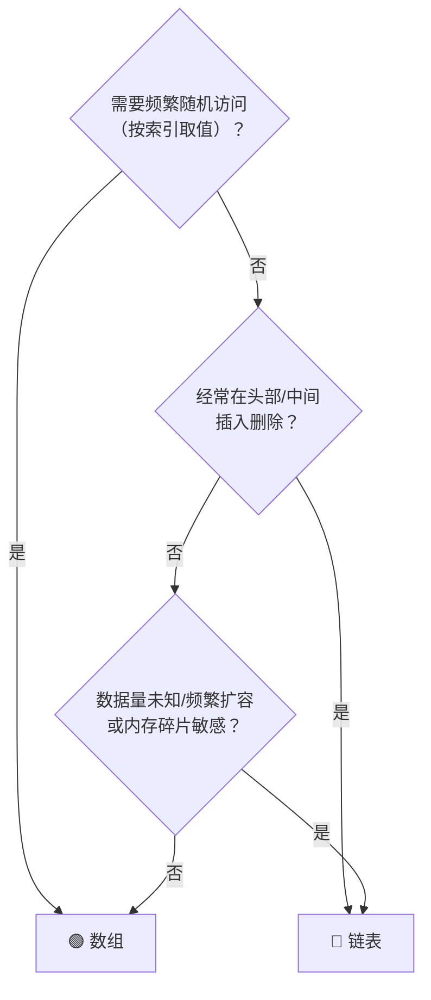

## 前置知识：线性表是什么

**线性表** = 元素按线性顺序排列的数据结构。这是一个**逻辑概念**，有两种物理实现：

```
线性表（逻辑概念）
    ├── 顺序表（数组）— 内存连续，索引 O(1)
    └── 链表         — 内存分散，指针串联
```

> [!important] 关键认知
> 很多题目你已经在用「线性表」的思维解题了——遍历、插入、删除、反转——
> 无非是在数组上做还是在链表上做，核心逻辑相通。

---

## 数组 vs 链表：一张表讲清楚

| 维度 | 数组 (Array/List) | 链表 (Linked List) |
|------|-------------------|-------------------|
| **内存** | 连续分配 | 分散分配 |
| **随机访问** | O(1) — `arr[i]` | O(n) — 从头遍历 |
| **头部插入/删除** | O(n) — 所有元素后移 | O(1) — 改指针 |
| **尾部插入/删除** | O(1) 均摊 | O(1) 有尾指针 / O(n) 无 |
| **中间插入/删除** | O(n) | O(1) 找到位置后 |
| **查找** | O(1) 已知索引 / O(n) 遍历 | O(n) |
| **空间开销** | 无额外开销（存数据本身） | 每个节点额外存一个/两个指针 |
| **缓存友好** | ✅ 连续内存，CPU 缓存命中率高 | ❌ 内存跳跃，缓存命中率低 |
| **动态扩容** | 需要拷贝（Python list 自动处理） | 天然动态，随时新增节点 |

---

## 选型决策



> [!tip] 口诀
> **"查多用数组，改多用链表"**

---

## Python 中的实现

### 数组 — `list`

```python
# Python 的 list 是动态数组（自动扩容）
arr = [1, 2, 3]
arr.append(4)     # 尾部添加 O(1)
arr.pop()         # 尾部删除 O(1)
arr.insert(0, 0)  # 头部插入 O(n) — 所有元素后移
arr[2]            # 随机访问 O(1)
```

### 链表 — 自定义 `ListNode`

```python
class ListNode:
    def __init__(self, val=0, next=None):
        self.val = val
        self.next = next

# 或者用 Python 的 collections.deque（双端队列，底层是双向链表）
from collections import deque
dq = deque([1, 2, 3])
dq.appendleft(0)  # 头部添加 O(1)
dq.popleft()      # 头部删除 O(1)
```

---

## 常见题型分类

| 题型 | 用数组做 | 用链表做 |
|------|---------|---------|
| 反转 | 双指针交换，O(1) 额外空间 | 迭代/递归改指针 |
| 合并 | 双指针归并 | 穿针引线法 |
| 去重 | 双指针（快慢指针） | 双指针 |
| 找中点 | `len(arr)//2` O(1) | 快慢指针 O(n) |
| 判环 | N/A（数组不形成环） | 快慢指针/哈希表 |
| 倒数第K个 | `arr[-k]` O(1) | 双指针间隔K |
| 子数组/子串 | 滑动窗口、前缀和 | 一般不考 |

---

## 常见易错点

> [!warning] **坑 1：数组插入/删除时忘记更新索引**
> ```python
> # ❌ 遍历时删除元素，索引会乱
> for i in range(len(arr)):
>     if arr[i] == target:
>         arr.pop(i)          # 后面的元素向前移，i 其实跳过一个
>
> # ✅ 倒序遍历删除
> for i in range(len(arr)-1, -1, -1):
>     if arr[i] == target:
>         arr.pop(i)
> ```

> [!warning] **坑 2：链表操作忘记处理头节点**
> 删除/插入可能改变头节点时，用**哑节点（dummy node）**统一处理。

> [!warning] **坑 3：链表断链**
> 修改 `node.next` 之前，先保存原来的 `next` 引用！

> [!warning] **坑 4：Python list 的 `insert(0, x)` 和 `pop(0)` 是 O(n)**
> 需要 O(1) 头部操作时，换用 `collections.deque`。

---

## 新手练习路线图

```
阶段 1️⃣  数组基础 → [[数组基础与通用解题框架]]
阶段 2️⃣  链表基础 → [[链表基础与通用解题框架]]
阶段 3️⃣  数组 + 链表混合：
  ├── 合并两个有序数组/链表
  └── 回文链表（数组法 vs 链表法）
```

---

## 相关笔记

- [[数组基础与通用解题框架]]
- [[链表基础与通用解题框架]]
- [[双指针基础与通用解题框架]] — 数组和链表的通用技巧
- [[哈希表基础与通用解题框架]]
