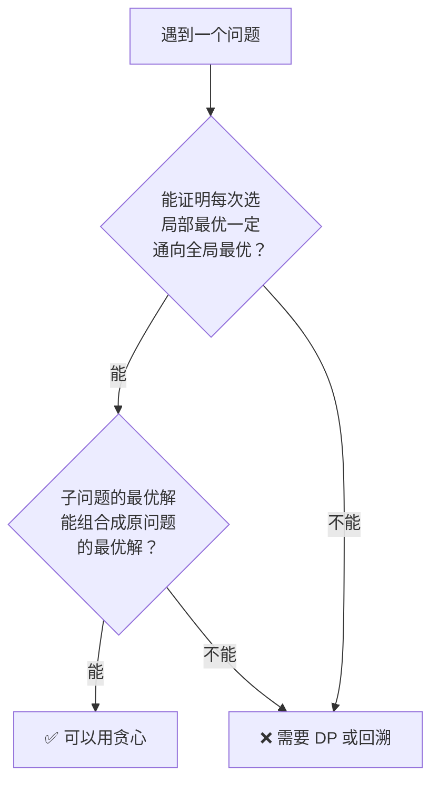
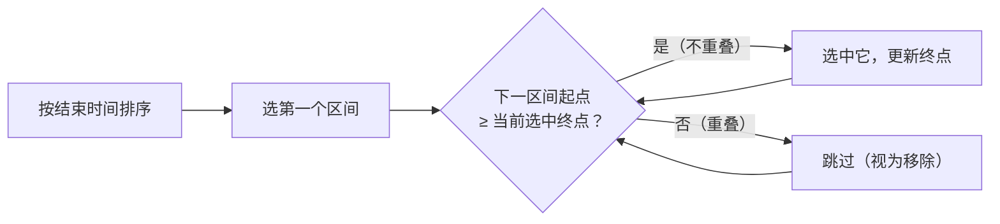
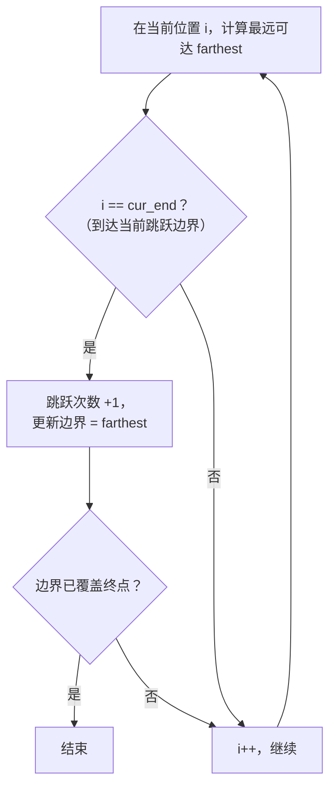
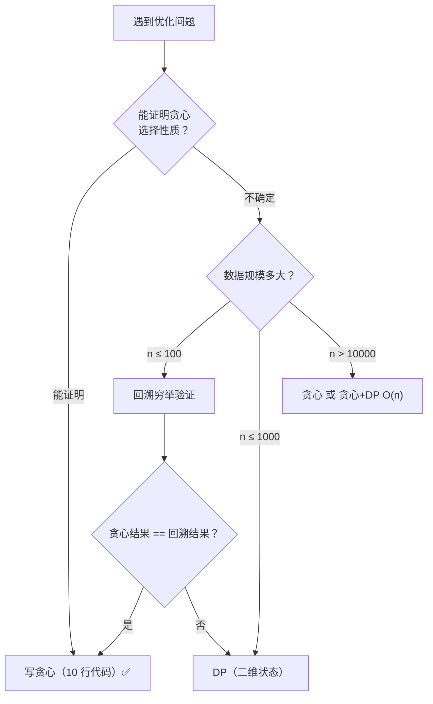

## 前置知识：贪心到底是什么

### 每一步选局部最优，期望全局最优

贪心算法（Greedy）在每一步都做出**当前看起来最好**的选择，通过局部最优解的累积，期望最终得到全局最优解。

> [!info] 现实类比
> • **找零钱**：你要凑 36 元，手上有 20、10、5、1 元纸币。贪心策略是"每次拿面额最大且不超过余额的纸币"。20+10+5+1=36，恰好最优。
> • **赶 deadline**：手头有 5 个任务，每个有截止时间和收益。贪心策略是"先做最早截止的"或"先做收益最高的"。
> • **加油站问题**：开车走一圈，贪心策略是"油箱见底就换个起点"。

### 贪心不是万能药

```python
# 硬币面额: [1, 3, 4]，目标: 6
# 贪心: 每步先拿最大面额 → 4 + 1 + 1 = 6（3 枚）
# 最优: 3 + 3 = 6（2 枚）              ← 贪心翻车！

# 再看 [1, 5, 6]，目标: 10
# 贪心: 6 + 1 + 1 + 1 + 1 = 10（5 枚）
# 最优: 5 + 5 = 10（2 枚）              ← 贪心又翻车！

# 而面额 [1, 5, 10]，目标: 15
# 贪心: 10 + 5 = 15（2 枚） = 最优      ✅ 贪心有效
```

> [!warning] 贪心为什么会在找零上翻车
> 凑 6 时，贪心先抓走最大的 4，剩 2 只能用两个 1 硬凑；而最优解一开始就用两个 3。贪心只看"当前哪枚硬币最大"，不看"拿完之后剩下的余额好不好凑"，而且**拿了不回头**——局部选择一旦做出就无法撤销，后面的劣势只能硬扛。
> 像 [1, 5, 10] 这类面额（以及人民币面额体系），贪心恰好总是最优，那是因为面额结构特殊（可以被证明），而不是贪心本身可靠。换个面额组合（如 [1, 3, 4]）立刻失效。

**贪心能不能用，关键在于能否证明贪心选择性质。**

---

## 贪心的两个前提



### 前提 1：贪心选择性质

**定义**：全局最优解可以通过一系列**局部最优选择**来达到。

- 你不需要"后悔"或"回溯"——一旦做出选择，这个选择在最终最优解中一定保留。
- 这是贪心与回溯/DP 的本质区别：贪心不回头。

> [!example] 区间调度中的贪心选择性质
> 选择**结束时间最早**的区间，留给后面的空间最大，这是局部最优选择。可以证明：一定存在一个最优解包含结束时间最早的区间。

### 前提 2：最优子结构

**定义**：一个问题的最优解包含其子问题的最优解。

- 做出一个贪心选择后，剩下的子问题与原问题结构相同，且子问题的最优解 + 贪心选择 = 原问题的最优解。
- 这一点与动态规划的最优子结构相同，但 DP 需要考虑多种选择，而贪心只考虑一种。

> [!tip] 一句话区分贪心和 DP
> **贪心**：只做一种选择（选局部最优），不回头。
> **DP**：尝试所有可能的选择，用状态转移找全局最优。

---

## 四大经典贪心题型

### 一、区间调度 — 按结束时间排序

**核心策略**：每次选**结束时间最早**的区间，然后跳过所有与之重叠的区间。

#### 题型 A：无重叠区间（435）

```python
def eraseOverlapIntervals(intervals):
    """求最少移除多少个区间使剩余区间不重叠"""
    if not intervals:
        return 0

    # ① 按结束时间升序排序
    intervals.sort(key=lambda x: x[1])

    count = 1                    # 至少保留第一个区间
    end = intervals[0][1]        # 当前选中的结束时间

    for i in range(1, len(intervals)):
        # ② 如果当前区间开始时间 >= 上次选中结束时间 → 不重叠，保留
        if intervals[i][0] >= end:
            count += 1
            end = intervals[i][1]

    return len(intervals) - count   # 移除数 = 总数 - 保留数
```



#### 题型 B：用最少数量的箭引爆气球（452）

```python
def findMinArrowShots(points):
    """求最少多少支箭可以射爆所有气球"""
    if not points:
        return 0

    # ① 按结束坐标排序
    points.sort(key=lambda x: x[1])

    arrows = 1
    arrow_pos = points[0][1]     # 第一支箭射在第一个气球的右边界

    for start, end in points[1:]:
        # ② 如果当前气球的左边界 > 箭的位置 → 需要一支新箭
        if start > arrow_pos:
            arrows += 1
            arrow_pos = end

    return arrows
```

> [!tip] 435 和 452 是镜像题
> • 435：保留最多的不重叠区间 → 相当于 452 反过来想
> • 核心套路完全一样：**按结束坐标排序，贪心地选**

---

### 二、分配问题 — 排序 + 双指针

**核心策略**：将需求和供给分别排序，用尽量小的资源满足尽量多的需求。

#### 题型 A：分发饼干（455）

```python
def findContentChildren(g, s):
    """
    g[i] = 孩子 i 的胃口
    s[j] = 饼干 j 的尺寸
    求最多能满足多少个孩子
    """
    g.sort()    # 胃口升序
    s.sort()    # 饼干升序

    child = 0
    cookie = 0

    while child < len(g) and cookie < len(s):
        if s[cookie] >= g[child]:   # 饼干够大
            child += 1              # 满足一个孩子
        cookie += 1                 # ⚠️ 不管能不能满足，饼干都消耗掉

    return child
```

> [!tip] 贪心策略的直觉
> 用最小的饼干满足胃口最小的孩子。如果最小的饼干都满足不了他，那这块饼干谁也满足不了，直接扔掉（cookie 指针右移）。

#### 题型 B：柠檬水找零（860）

```python
def lemonadeChange(bills):
    """每位顾客给 5/10/20 美元，一杯柠檬水 5 美元，判断能否全部找零"""
    five = ten = 0

    for bill in bills:
        if bill == 5:
            five += 1
        elif bill == 10:
            if five == 0:
                return False
            five -= 1
            ten += 1
        else:  # bill == 20
            # 贪心：优先用 10+5 找零（把 5 元留给更需要的人）
            if ten > 0 and five > 0:
                ten -= 1
                five -= 1
            elif five >= 3:
                five -= 3
            else:
                return False
    return True
```

> [!important] 关键的贪心选择
> 收到 20 元时，优先用 10+5 找零而非 5+5+5。因为 5 元更"万能"（既能给 10 找零也能给 20 找零），应该省着用。

---

### 三、跳跃游戏系列

#### 跳跃游戏 I（55）— 判断能否到达终点

```python
def canJump(nums):
    """判断是否能跳到最后一个位置"""
    farthest = 0    # 当前能达到的最远位置

    for i in range(len(nums)):
        if i > farthest:           # 当前位置已经无法到达
            return False
        farthest = max(farthest, i + nums[i])
        if farthest >= len(nums) - 1:
            return True

    return False
```

#### 跳跃游戏 II（45）— 求最小跳跃次数

```python
def jump(nums):
    """求到达最后一个位置的最少跳跃次数"""
    if len(nums) <= 1:
        return 0

    jumps = 0
    cur_end = 0          # 当前跳跃能到达的边界
    farthest = 0         # 下一步能到达的最远位置

    for i in range(len(nums) - 1):   # ⚠️ 不需要访问最后一个元素
        farthest = max(farthest, i + nums[i])

        # 到达当前跳跃的边界，必须再跳一次
        if i == cur_end:
            jumps += 1
            cur_end = farthest
            if cur_end >= len(nums) - 1:
                break

    return jumps
```



> [!tip] 跳跃游戏 II 的贪心直觉
> 不必想"这一步具体跳到哪里"，而是知道"这一步覆盖范围内的某个位置，能让我下一步跳得更远"就行。走到当前步的边界时，选那个能跳最远的作为下一跳。

---

### 四、哈夫曼编码思想 — 最少合并代价

**问题**：有 n 堆果子，每次合并两堆，代价为两堆之和。求全部合并成一堆的最小总代价。

```python
import heapq

def minMergeCost(piles):
    """哈夫曼编码 / 合并石子的贪心版本"""
    heapq.heapify(piles)    # 最小堆
    total_cost = 0

    while len(piles) > 1:
        a = heapq.heappop(piles)
        b = heapq.heappop(piles)
        cost = a + b
        total_cost += cost
        heapq.heappush(piles, cost)

    return total_cost
```

> [!info] 贪心策略
> 每次都选**最小的两堆**合并。可以证明这样总代价最小。
> 这与哈夫曼树的构建思路完全一致。

---

## 贪心 vs DP 对比

| 维度 | 贪心 | 动态规划 |
|------|------|---------|
| **决策方式** | 每一步只做一种选择（局部最优） | 每一步尝试所有可能的选择 |
| **是否回溯** | ❌ 选了就不改 | ✅ 本质上穷举所有状态 |
| **时间复杂度** | 通常 O(n log n) | 通常 O(n²) 或更高 |
| **能否保证最优** | 需要数学证明 | ✅ 穷举保证最优 |
| **代码量** | 少，通常 20 行以内 | 多，需要定义状态和转移 |
| **典型特征** | "选最X的""按最X排序" | "有多少种方法""最大/最小代价" |

> [!important] 什么时候贪心就够了？
>  ① 
>  ② 
>  ③ 
>  ④ 



---

## 新手练习路线图

> [!important] 练习策略
> 每道题先问自己：排序后这个问题是否变简单了？贪心的"局部最优"到底是什么？

```
阶段 1️⃣  入门（建立贪心直觉）
  ├── 455. 分发饼干                    ← 最经典的双指针贪心
  └── 860. 柠檬水找零                  ← 模拟 + 贪心选择

阶段 2️⃣  区间调度
  ├── 435. 无重叠区间                  ← 按结束时间排序的模板
  └── 452. 用最少数量的箭引爆气球        ← 435 的镜像题

阶段 3️⃣  跳跃游戏
  ├── 55. 跳跃游戏                     ← 最远可达
  └── 45. 跳跃游戏 II                  ← 最小步数（边界思路）

阶段 4️⃣  进阶 + 综合
  ├── 406. 根据身高重建队列             ← 二维排序贪心
  ├── 621. 任务调度器                   ← 桶思想 / 贪心
  ├── 135. 分发糖果                    ← 两次遍历贪心
  └── 763. 划分字母区间                ← 区间合并贪心

阶段 5️⃣  需要证明的贪心
  ├── 134. 加油站                      ← 贪心 + 数学证明
  └── 1046. 最后一块石头的重量           ← 堆 + 贪心（类似哈夫曼）
```

---

## 常见易错点

> [!warning] **坑 1：排序的 key 搞反**
> ```python
> # 区间调度按什么排序？
> # ❌ 按开始时间排序 — 可能选了很长的区间，浪费空间
> intervals.sort(key=lambda x: x[0])
>
> # ✅ 按结束时间排序 — 结束早的区间留给后面更多空间
> intervals.sort(key=lambda x: x[1])
> ```

> [!warning] **坑 2：跳跃游戏把循环范围搞错**
> ```python
> # 跳跃游戏 II 中
> # ❌ 遍历整个数组包括最后一个元素
> for i in range(len(nums)):
>     ...
>     if i == cur_end:
>         jumps += 1       # 在最后一个元素处可能多跳一次
>
> # ✅ 不需要访问最后一个元素
> for i in range(len(nums) - 1):
>     ...
> ```

> [!warning] **坑 3：分发饼干中 cookie 指针不管是否满足都要前进**
> ```python
> # ❌ 只在满足时前进 cookie
> if s[cookie] >= g[child]:
>     child += 1
>     cookie += 1    # 只有这里才前进
>
> # ✅ cookie 每次都前进（不满足就丢弃这块饼干）
> if s[cookie] >= g[child]:
>     child += 1
> cookie += 1        # 不管满不满足，这块饼干都用过了
> ```

> [!warning] **坑 4：先入为主，看到"最值"就用贪心**
> 不是所有"求最少次数"都是贪心！典型反例：
> • 322. 零钱兑换 → 贪心会错，必须用 DP
> • 279. 完全平方数 → 贪心会错，必须用 DP（或数学定理）
>
> **验证方法**：想一个反例，让贪心的选择不是最优的。如果找不到反例，再尝试验证贪心选择性质。

> [!warning] **坑 5：多维排序时第二关键字遗漏**
> ```python
> # 406. 根据身高重建队列：先按身高降序，再按 k 值升序
> # ✅ 正确写法
> people.sort(key=lambda x: (-x[0], x[1]))
>
> # ❌ 忘了第二关键字
> people.sort(key=lambda x: -x[0])   # k 值顺序可能是乱的
> ```

---

## 相关笔记

- [[排序基础与通用解题框架]] — 大多数贪心题的第一步是排序
- [[动态规划基础与通用解题框架]] — 贪心 vs DP 的边界
- [[分治与堆：从原理到实战]] — 哈夫曼编码类贪心依赖堆
- 区间问题合集 — 区间调度是贪心的核心应用场景
