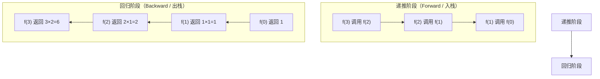
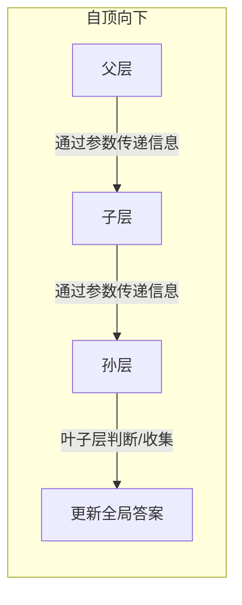
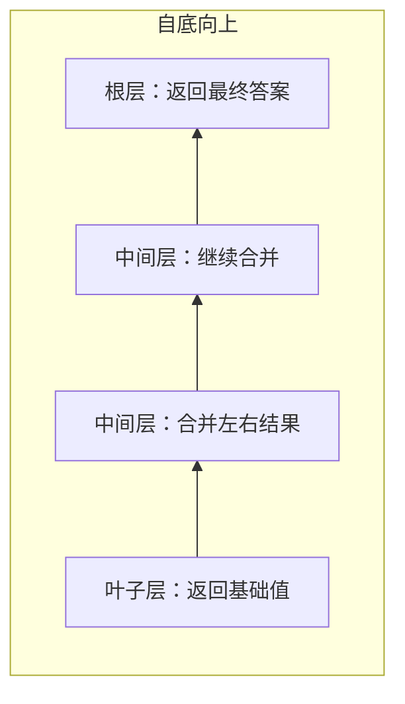
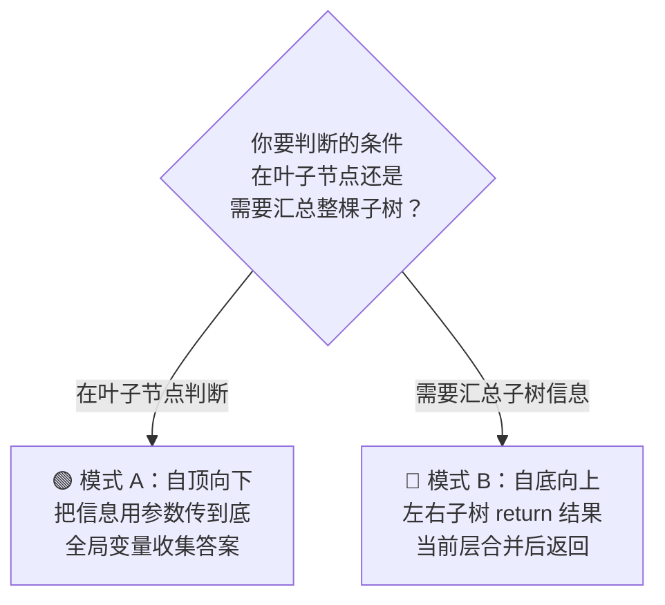
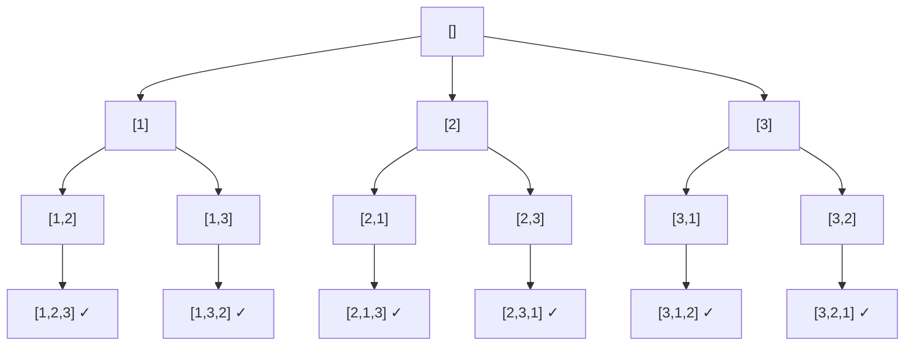

## 前置知识：递归到底是什么

### 递归 = 函数调用自己

```python
def recursion():
    recursion()   # 自己调用自己
```

但这只是表象。递归真正的威力在于**把一个复杂问题拆解成与原问题结构相同、但规模更小的子问题**。

### 两个阶段：递推 + 回归



以阶乘 `factorial(3)` 为例：

```
调用链（递推，逐层深入）：
  factorial(3) → 3 * factorial(2)
                    → 2 * factorial(1)
                          → 1 * factorial(0)
                                → 1     ← 触底！base case

返回链（回归，逐层返回）：
  factorial(0) = 1
  factorial(1) = 1 × 1 = 1
  factorial(2) = 2 × 1 = 2
  factorial(3) = 3 × 2 = 6  ← 最终答案
```

### 调用栈：计算机如何"记住"每一层

每次函数调用，计算机会在**调用栈（Call Stack）**上压入一个栈帧（Stack Frame），记录当前函数的参数、局部变量、以及**返回后该继续执行的位置**。

```
栈顶 →
┌──────────────────┐
│ factorial(0)     │  ← 当前执行
│   n = 0          │
│   返回地址: L12  │
├──────────────────┤
│ factorial(1)     │
│   n = 1          │
│   返回地址: L12  │
├──────────────────┤
│ factorial(2)     │
│   n = 2          │
│   返回地址: L12  │
├──────────────────┤
│ factorial(3)     │
│   n = 3          │
│   返回地址: main │
└──────────────────┘
栈底

factorial(0) 返回后，弹出栈顶 → 回到 factorial(1) 继续执行
factorial(1) 返回后，弹出 → 回到 factorial(2) ...
...
最后回到 main，栈清空
```

> [!warning] 调用栈不是无限大的
> Python 默认递归深度约 1000 层。如果你写到 2000 层，会遇到 `RecursionError: maximum recursion depth exceeded`。
> 这就是为什么尾递归优化和迭代改写有时是必要的。

---

## 递归三要素

> [!important] 任何递归函数写完，逐条对这三要素，缺一必 bug。

### 要素 ① 终止条件（Base Case）

递归不能永远下去，必须有一个**不需要继续递归就能直接返回**的出口。

```python
def factorial(n):
    if n == 0:             # ← 这就是 base case
        return 1           #    不需要再递归，直接返回
    return n * factorial(n - 1)
```

> [!tip] Base Case 的判断技巧
> 问自己：**"问题规模最小的时候，答案是什么？"**
> • 阶乘：0 的阶乘 = 1
> • 斐波那契：第 0 项 = 0，第 1 项 = 1
> • 二叉树：空节点 → 返回 0 / None / True
> • 数组递归：索引越界 → 返回

### 要素 ② 递归调用（向 Base Case 靠近）

每次递归调用，**问题规模必须缩小**，确保最终能触达 base case。否则就是死循环（无限递归 → 栈溢出）。

```python
# ✅ 每次 n 减 1，最终 n=0 触底
return n * factorial(n - 1)

# ❌ 如果写成这样——永远到不了 base case，栈溢出
return n * factorial(n)       # 每次调用的 n 一样大！
```

### 要素 ③ 合并结果（Combine）

递归调用返回后，**当前层如何利用子问题的结果，构造当前层的答案**。

```python
def factorial(n):
    if n == 0:                    # ① base case
        return 1
    sub_result = factorial(n - 1) # ② 递归调用（缩小规模）
    return n * sub_result         # ③ 合并：用子结果 × n
```

> [!important] 三要素检查清单
> 写完一个递归函数，先别跑，逐条检查：
>  ① 
>  ② 
>  ③ 

---

## 两大递归思维模式

这两大模式直接对应[[二叉树基础与通用解题框架]]中的模板 A 和模板 B。看懂这里，二叉树就通了。

### 模式 A：自顶向下（遍历思维）

**"我带着信息走下去"**



**核心特征**：
- 信息通过**函数参数**从上层传给下层
- 答案通过**全局变量**（或返回值短路）来收集
- 思路：沿着一条路径走到底，边走边更新状态

**代码骨架**：

```python
class Solution:
    def solve(self, root):
        self.ans = 0              # ① 全局变量收集答案
        self.dfs(root, 初始参数)
        return self.ans

    def dfs(self, node, 携带的参数):
        if not node:              # ② base case
            return

        # ③ 在「前序位置」：处理当前节点，更新参数
        新参数 = 携带的参数 的某种运算

        if 满足某种条件:            # ④ 判断/收集
            self.ans = 更新

        # ⑤ 递归子节点，把新参数传下去
        self.dfs(node.left,  新参数)
        self.dfs(node.right, 新参数)
```

**生活类比**：老板分预算
- CEO 说"预算 100 万"→ VP 拿 30 万，剩 70 万传给总监 → 总监拿 20 万，剩 50 万传给经理 → ...
- 到最后看"钱花完了没有"——这就是**自顶向下**，信息从上往下流动。

**代表题目**：路径总和（[[112. 路径总和]]）、求根到叶子数字之和、二叉树的所有路径

---

### 模式 B：自底向上（分治思维）

**"子树告诉我答案，我来合并"**



**核心特征**：
- 信息通过**函数返回值**从下层传回上层
- 当前节点用**左右子树的结果**来计算自己的结果
- 思路：把问题分解成左右两个子问题，分别解决后再合并

**代码骨架**：

```python
def dfs(node):
    if not node:                  # ① base case：空节点返回基准值
        return 基准值

    # ② 分：递归求解左右子树
    left_result  = dfs(node.left)
    right_result = dfs(node.right)

    # ③ 治：在「后序位置」合并左右结果
    当前结果 = 合并(left_result, right_result, node.val)

    # ④ 返回给上层
    return 当前结果
```

**生活类比**：领导统计人数
- CEO 问"你这条线多少人？"→ VP 问总监"你下面多少人？"→ 总监问经理 → ...
- 经理报 5 人 → 总监汇总 3 个经理共 15 人 → VP 汇总 4 个总监共 60 人 → CEO 得到总人数
- 信息从底层往上流——这就是**自底向上**。

**代表题目**：二叉树最大深度、翻转二叉树、平衡二叉树、二叉树直径

---

### 两种模式的对比与选择



| | 🟢 模式 A（自顶向下） | 🔵 模式 B（自底向上） |
|---|---|---|
| **信息流向** | 参数向下传 ↓ | return 向上返 ↑ |
| **处理时机** | 前序位置 | 后序位置 |
| **返回值** | 通常 void / bool | 必须有返回值 |
| **收集答案** | 全局变量 / 短路返回 | return 直接返回 |
| **典型问题** | 存在性判断、收集路径 | 深度、高度、是否平衡 |
| **对应模板** | 二叉树模板 A | 二叉树模板 B |

> [!tip] 口诀
> **"判断在叶子"→ 自顶向下传参数；"汇总子树"→ 自底向上靠返回。**

---

## 递归 vs 迭代

### 什么时候该用递归？

| 场景 | 为什么适合递归 |
|------|---------------|
| **树/图遍历** | 天然的分支结构，递归比手动栈简洁 10 倍 |
| **分治问题** | 子问题与原问题结构相同，只是规模更小 |
| **回溯（排列组合）** | 递归 + 回溯 = 最自然的"尝试-撤销"模型 |
| **嵌套结构** | 括号匹配、XML 解析、表达式求值 |
| **数学归纳式问题** | 如果 f(n) 能由 f(n-1) 推出来，就适合递归 |

### 什么时候该用栈模拟（迭代改写）？

| 场景 | 为什么要迭代 |
|------|-------------|
| **递归深度可能很大** | 如链表反转（可能 10^5 个节点），递归会栈溢出 |
| **严格 O(1) 额外空间** | 迭代可以不用调用栈 |
| **性能敏感的底层代码** | 递归有函数调用开销 |
| **语言不支持尾递归优化** | Python 不优化，深度递归必爆栈 |

### 递归转迭代的通用方法

```python
# 递归版（二叉树前序遍历）
def preorder_recursive(root):
    if not root:
        return []
    return [root.val] + preorder_recursive(root.left) + preorder_recursive(root.right)

# 迭代版（用栈模拟）
def preorder_iterative(root):
    if not root:
        return []
    result = []
    stack = [root]
    while stack:
        node = stack.pop()           # 弹出栈顶
        result.append(node.val)      # 处理当前
        if node.right:               # 先压右（后出）
            stack.append(node.right)
        if node.left:                # 后压左（先出）
            stack.append(node.left)
    return result
```

> [!tip] 递归转迭代的核心思路
> **手动维护一个栈，自己管理"当前执行到哪里了"**。递归是编译器帮你管调用栈，迭代是你自己显式管。

---

## 递归的常见形态

### 形态 1：单分支递归

每一层只调用自己一次，沿着一条线走下去。

```python
# 阶乘：每层只做一个递归调用
def factorial(n):
    if n == 0:
        return 1
    return n * factorial(n - 1)


# 链表反转（递归版）
def reverseList(head):
    if not head or not head.next:    # base case：空或单个节点
        return head
    new_head = reverseList(head.next) # ① 递归，信任子问题已反转
    head.next.next = head             # ② 后序位置：把当前节点接上
    head.next = None                  # ③ 断开旧的 next
    return new_head
```

**调用栈示意图**（链表 1→2→3→None）：

```
reverseList(1)
  └─ reverseList(2)
       └─ reverseList(3)
            └─ 触底！head=3, head.next=None → 返回 3
       ← 返回 3，head=2：2.next.next=2（即 3→2），2.next=None
  ← 返回 3，head=1：1.next.next=1（即 2→1），1.next=None
最终：3→2→1→None ✅
```

**特征**：
- 通常可以在后序位置"做最后一步处理"
- 链表的递归解法几乎都是单分支

---

### 形态 2：双分支递归

每一层调用自己两次，产生二叉树状的调用结构。这是最常见也最核心的递归形态。

```python
# 斐波那契
def fib(n):
    if n <= 1:
        return n
    return fib(n - 1) + fib(n - 2)
    #      ─────────    ─────────
    #      分支 1        分支 2


# 二叉树遍历（后序）
def postorder(node):
    if not node:
        return
    postorder(node.left)       # 分支 1
    postorder(node.right)      # 分支 2
    print(node.val)            # 后序：左右都处理完才处理自己
```

**斐波那契的调用树**（fib(4)）：

```
                    fib(4)
                 /          \
            fib(3)           fib(2)
           /      \         /      \
      fib(2)     fib(1)  fib(1)   fib(0)
     /      \
 fib(1)   fib(0)
```

> [!warning] 双分支递归的陷阱：重复计算
> fib(2) 被计算了 2 次，fib(1) 被计算了 3 次。随着 n 增大，重复计算呈**指数级增长**。
> 这就是为什么需要**记忆化递归**（见后文）。

---

### 形态 3：多分支递归（回溯）

每一层调用自己多次（循环中递归），用于**枚举所有可能性**。

```python
# 全排列（排列组合的经典递归模板）
def permute(nums):
    ans = []
    path = []
    used = [False] * len(nums)

    def dfs():
        # ① base case：路径长度够了
        if len(path) == len(nums):
            ans.append(list(path))
            return

        # ② 尝试所有可能的"下一步"
        for i in range(len(nums)):
            if used[i]:
                continue
            # ③ 做选择
            path.append(nums[i])
            used[i] = True
            # ④ 递归
            dfs()
            # ⑤ 撤销选择（回溯！）
            path.pop()
            used[i] = False

    dfs()
    return ans


print(permute([1, 2, 3]))
# [[1,2,3], [1,3,2], [2,1,3], [2,3,1], [3,1,2], [3,2,1]]
```

**回溯的决策树**（nums=[1,2,3]，画成树）：



**特征**：
- 循环内递归：`for ... dfs() ...` 是标志性写法
- 必须有回溯（`pop()` 恢复现场）
- 收集"所有方案"时，记得 `list(path)` 拷贝

---

### 形态 4：尾递归优化（概念介绍）

尾递归是指**递归调用是整个函数体最后一步**的写法。

```python
# ❌ 普通递归：n * factorial(n - 1) → 乘法不是最后一步，还有乘法
def factorial(n):
    if n == 0:
        return 1
    return n * factorial(n - 1)

# ✅ 尾递归：factorial_tail(n-1, acc*n) → 递归调用是最后一步，没有额外计算
def factorial_tail(n, acc=1):
    if n == 0:
        return acc
    return factorial_tail(n - 1, acc * n)
```

尾递归的好处：编译器/解释器可以**复用当前栈帧**而不是新建，从而将空间复杂度从 O(n) 降到 O(1)。

> [!warning] Python 不支持尾递归优化
> Guido van Rossum（Python 之父）明确拒绝了这个特性。所以 Python 的尾递归跟普通递归一样会爆栈。
> 在实际 Python 开发中，深度递归 **必须改写为迭代** 或用 `sys.setrecursionlimit()` 临时放宽（不推荐作为常规方案）。

**尾递归优化支持情况**：

| 语言 | 是否支持 |
|------|---------|
| Scheme / Racket | ✅ 原生支持 |
| Haskell | ✅ 惰性求值天然支持 |
| Scala | ✅ 编译器优化 |
| Kotlin | ✅ `tailrec` 关键字 |
| C / C++ | ✅ 编译器优化（-O2） |
| JavaScript (ES6+) | ✅ 严格模式支持 |
| Java | ❌ 不支持 |
| Python | ❌ 不支持 |

---

## 记忆化递归

### 问题：重复计算

斐波那契 `fib(5)` 的调用树中，`fib(2)` 被计算了 3 次，`fib(3)` 被计算了 2 次。n=50 时，重复计算将达到天文数字。

### 解决方案：用哈希表/memo 数组缓存中间结果

```python
# 普通递归：O(2^n)，n=50 能算到你怀疑人生
def fib(n):
    if n <= 1:
        return n
    return fib(n - 1) + fib(n - 2)


# 记忆化递归：O(n)，n=10000 秒出结果
def fib_memo(n):
    memo = {}                         # ① 缓存字典

    def dfs(k):
        if k <= 1:
            return k
        if k in memo:                 # ② 先查缓存
            return memo[k]
        result = dfs(k - 1) + dfs(k - 2)  # ③ 计算
        memo[k] = result                  # ④ 存入缓存
        return result

    return dfs(n)


print(fib_memo(100))   # 354224848179261915075（秒出）
```

### 记忆化的通用模板

```python
def solve(问题规模参数):
    memo = {}                         # 或用数组 memo = [-1] * (n + 1)

    def dfs(状态1, 状态2, ...):
        # ① base case
        if 最小规模:
            return 基准值

        # ② 查缓存
        状态键 = (状态1, 状态2, ...)    # 元组可作为 dict 的 key
        if 状态键 in memo:
            return memo[状态键]

        # ③ 递归求解
        result = 合并( dfs(子状态1), dfs(子状态2), ... )

        # ④ 存缓存
        memo[状态键] = result
        return result

    return dfs(初始状态)
```

> [!tip] 记忆化 vs 动态规划（DP）
> 记忆化递归 = **自顶向下**的 DP（Top-Down DP）。它保留了递归的直观思路，用缓存避免重复计算。
> 而通常说的 DP（递推） = **自底向上**的 DP（Bottom-Up DP），用迭代填表。
> 两者时间复杂度相同（都是 O(n)），记忆化更直观但可能递归过深；迭代更高效但没有递归那么直观。

### 经典记忆化题目

| 题目 | 状态定义 | 记忆化 key |
|------|---------|-----------|
| 斐波那契 | f(k) | k |
| 70. 爬楼梯 | f(k) = 爬到第 k 阶的方法数 | k |
| 62. 不同路径 | f(i,j) = 到 (i,j) 的路径数 | (i, j) |
| 322. 零钱兑换 | f(amount) = 最少硬币数 | amount |
| 139. 单词拆分 | f(i) = s[i:] 能否拆分 | i |

---

## 新手练习路线图

> [!important] 练习策略
> 递归不是"看懂就够"的能力，必须亲手写。每一道题做到：写前画出递归树 → 写出三要素 → 验证。按这个顺序来，不要跳。

```
阶段 1️⃣  建立递归直觉（单分支，体感调用栈）
  ├── 509. 斐波那契数              ← 最简单双分支，理解"递推+回归"
  ├── 206. 反转链表（递归版）       ← 单分支递归，理解后序位置
  └── 70. 爬楼梯                   ← 和斐波那契一样，换个马甲

阶段 2️⃣  双分支递归 + 自底向上（树问题入门）
  ├── 104. 二叉树的最大深度         ← 理解模式 B（自底向上分治）
  ├── 226. 翻转二叉树               ← 后序位置做交换
  └── 100. 相同的树                 ← 两棵树同时递归

阶段 3️⃣  双分支递归 + 自顶向下（树的遍历）
  ├── 112. 路径总和                 ← 理解模式 A（自顶向下传参数）
  ├── 129. 求根到叶子数字之和       ← 参数累积
  └── 257. 二叉树的所有路径         ← 收集路径（字符串版，天然不可变）

阶段 4️⃣  多分支递归 + 回溯（排列组合）
  ├── 46. 全排列                    ← 回溯经典入门，for 里递归
  ├── 78. 子集                      ← 每个元素选/不选
  ├── 77. 组合                      ← 加 start 参数去重
  └── 22. 括号生成                  ← 两个分支（加左括号 / 加右括号）

阶段 5️⃣  记忆化递归（第一次接触 DP）
  ├── 62. 不同路径                  ← 二维记忆化
  ├── 322. 零钱兑换                 ← 最优子结构 + 记忆化
  └── 139. 单词拆分                 ← 字符串 + 记忆化

阶段 6️⃣  综合挑战
  ├── 236. 二叉树的最近公共祖先     ← 后序遍历 + 自底向上
  ├── 124. 二叉树最大路径和         ← 自底向上 + 全局变量
  └── 437. 路径总和 III             ← 双重递归 / 前缀和 + 递归
```

---

## 常见易错点

> [!warning] **坑 1：忘记 Base Case 或条件写错了**
> ```python
> # ❌ 没有 base case，无限递归
> def factorial(n):
>     return n * factorial(n - 1)
>
> # ❌ base case 条件错了——永远触达不到
> def factorial(n):
>     if n == -1:          # n 从正数递减，永远不会等于 -1
>         return 1
>     return n * factorial(n - 1)
>
> # ✅ 正确
> def factorial(n):
>     if n == 0:
>         return 1
>     return n * factorial(n - 1)
> ```
> **写完递归函数第一件事：带入最小规模输入（如 n=0, root=None），手算验证 base case。**

> [!warning] **坑 2：修改全局状态不恢复（回溯缺失）**
> ```python
> # ❌ path 是可变对象，所有分支共享同一个 list
> def dfs(path):
>     if 满足条件:
>         ans.append(list(path))   # 虽然拷贝了，但...
>     for 选项 in 选项列表:
>         path.append(选项)
>         dfs(path)
>         # ❌ 少了 path.pop()！下一轮循环 path 里有脏数据
>
> # ✅ 正确
> def dfs(path):
>     if 满足条件:
>         ans.append(list(path))
>     for 选项 in 选项列表:
>         path.append(选项)
>         dfs(path)
>         path.pop()               # ← 必须撤销！
> ```
> **规则：`append` 了多少次，就要 `pop` 多少次，一一对应。**

> [!warning] **坑 3：递归深度超限（栈溢出）**
> ```python
> # ❌ 链表达式 10^5 个节点，递归反转会 RecursionError
> def reverseList(head):
>     if not head or not head.next:
>         return head
>     new_head = reverseList(head.next)
>     ...
>
> # ✅ 这种场景改用迭代
> def reverseList_iterative(head):
>     prev, curr = None, head
>     while curr:
>         nxt = curr.next
>         curr.next = prev
>         prev, curr = curr, nxt
>     return prev
> ```
> Python 默认递归深度约 1000。如果问题规模超过几百层，优先考虑迭代，或用 `sys.setrecursionlimit(100000)`（仅作临时方案，不推荐）。

> [!warning] **坑 4：重复计算导致指数级复杂度**
> ```python
> # ❌ fib(50) 需要计算 2^50 次，宇宙毁灭都算不完
> def fib(n):
>     if n <= 1:
>         return n
>     return fib(n - 1) + fib(n - 2)
>
> # ✅ 加记忆化 → O(n)
> def fib(n):
>     memo = {0: 0, 1: 1}
>     def dfs(k):
>         if k not in memo:
>             memo[k] = dfs(k - 1) + dfs(k - 2)
>         return memo[k]
>     return dfs(n)
> ```
> 如果你发现递归树中有相同的子树被反复计算，立刻加缓存。

> [!warning] **坑 5：误以为"return 就是结束"**
> ```python
> # ❌ 在"收集所有方案"的回溯中，叶子节点只 return 不 pop
> def dfs(path):
>     if len(path) == n:
>         ans.append(list(path))
>         return       # ← 直接 return，没有 path.pop()！
>     for 选项 in 选项列表:
>         path.append(选项)
>         dfs(path)
>         path.pop()
> ```
> **叶子节点也必须回溯！**如果 `path` 是在叶子处 `append` 之后才满的，那你 `return` 前需要先 `pop`。否则回到上一层时 path 还带着叶子节点的元素。

---

## 相关笔记

- [[二叉树基础与通用解题框架]] — 递归在树结构上的直接应用，模板 A/B 和本文的模式 A/B 一一对应
- [[DFS深度优先搜索基础与通用解题框架]] — 递归就是 DFS 的实现方式
- [[BFS广度优先搜索基础与通用解题框架]] — 另一种遍历策略，有时可以替代递归
- [[回溯基础与通用解题框架]] — 多分支递归 + 做选择/撤销选择的完整体系
- [[动态规划基础与通用解题框架]] — 记忆化递归的"迭代版"，从递推到 DP 表
- [[分治与堆：从原理到实战]] — 自底向上递归的理论基础
- [[链表基础与通用解题框架]] — 单分支递归的练习场
- [[哈希表基础与通用解题框架]] — 记忆化递归的核心数据结构
