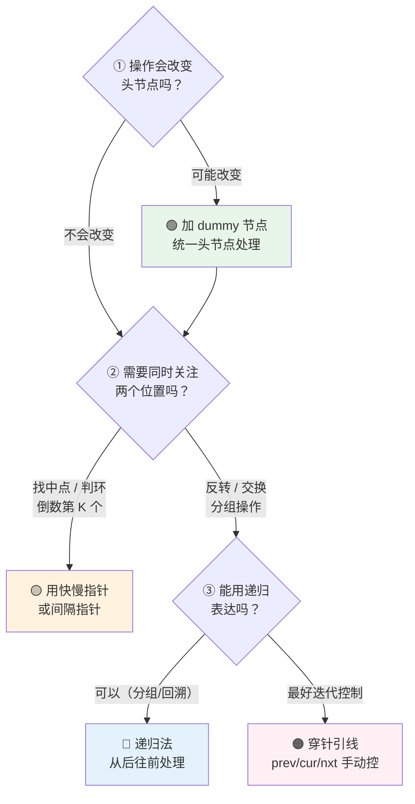

## 前置知识：链表到底是什么

### 一个节点 = 一个值 + 一个指向下一个的箭头

```python
class ListNode:
    def __init__(self, val=0, next=None):
        self.val  = val    # 节点的值
        self.next = next   # 指向下一个节点的引用（或 None）
```

每个 `ListNode` 是一个**有两个槽位的盒子**：

```
┌─────────────────────┐
│  val: 3             │
│  next: ──────→ (指向下一个节点，或 None)
└─────────────────────┘
```

把多个节点串起来就形成了链表：

```
head → [3|●] → [7|●] → [1|●] → [9|●] → None
        节点①     节点②    节点③    节点④    （链表结束标记）
```

> [!warning] `ListNode` 只是"模具"，连接需要你手动完成
> 创建 `a = ListNode(3)` 后，`a.next` 是 `None`。你必须手动写 `a.next = b` 才能把 `b` 接到 `a` 后面。**链表不会自动连接。**

```python
# 手动搭建链表 3 → 7 → 1
a = ListNode(3)
b = ListNode(7)
c = ListNode(1)

a.next = b    # 3 指向 7
b.next = c    # 7 指向 1

# 现在：a(3) → b(7) → c(1) → None
```

### 链表 vs 数组：内存模型决定了一切

| | 链表（Linked List） | 数组（Array / List） |
|---|---|---|
| **内存布局** | 分散——节点散落在内存各处 | 连续——一块完整的内存区域 |
| **索引访问** | O(n)——必须从头一个一个找 | O(1)——`arr[i]` 直接算地址 |
| **插入 / 删除** | O(1)——只需改指针（前提：已定位） | O(n)——后面所有元素都要搬 |
| **空间开销** | 每个节点多存一个指针（8 字节） | 无额外开销 |
| **缓存友好** | 差——跳跃访问，cache miss 多 | 好——连续访问，cache line 命中 |

> [!important] 一句话总结
> **数组擅长"查"（知道位置直接拿），链表擅长"改"（知道位置直接连）。** 链表题的本质就是**玩指针**——改 `next` 指向、保护断链、注意边界。

### 链表的基本遍历模式

```python
# ====== 遍历链表的标准写法 ======
def traverse(head):
    cur = head            # ① 用 cur 指针，别直接用 head（会丢头）
    while cur:            # ② cur is not None 就继续
        # 处理 cur.val
        print(cur.val)
        cur = cur.next    # ③ 移动到下一个节点

# ====== cur 和 cur.next 的区别 ======
# cur       → 当前节点（可以获取 cur.val, cur.next）
# cur.next  → 当前节点的下一个节点（用于"往前看"）

# 常见用法：在 cur 后面插入 / 删除
# 如果要在 cur 后面插入 node，需要同时知道 cur 和 cur.next
```

---

## 核心操作原理

### 操作 1：遍历与查找

```python
# 查找索引为 k 的节点（0-indexed）
def get_node(head, k):
    cur = head
    for _ in range(k):
        if not cur:
            return None      # 链表长度不够
        cur = cur.next
    return cur

# 查找值为 target 的节点
def find_node(head, target):
    cur = head
    while cur:
        if cur.val == target:
            return cur
        cur = cur.next
    return None
```

### 操作 2：插入节点

在节点 `prev` 后面插入值为 `val` 的新节点：

```
插入前: prev → [A] → ...
插入后: prev → [new] → [A] → ...

步骤：
① new_node = ListNode(val)        # 创建新节点
② new_node.next = prev.next       # 新节点先接上后面的链表
③ prev.next = new_node            # prev 再指向新节点
```

```python
def insert_after(prev, val):
    """在 prev 节点之后插入值为 val 的新节点"""
    if not prev:
        return
    new_node = ListNode(val)
    new_node.next = prev.next       # ⚠️ 顺序不能反！
    prev.next = new_node
```

> [!warning] 插入顺序绝对不能反！
> ```python
> # ❌ 错误顺序——后面的链表丢了！
> prev.next = new_node              # 先断链，prev.next 原值丢失
> new_node.next = ???               # 不知道后面是谁了
>
> # ✅ 正确顺序——新节点先接上尾巴，再改 prev
> new_node.next = prev.next         # ① 新节点抓住后面的链表
> prev.next = new_node              # ② prev 再指向新节点
> ```

### 操作 3：删除节点

删除 `prev` 后面的节点：

```
删除前: prev → [target] → [B] → ...
删除后: prev → [B] → ...

步骤：
① prev.next = prev.next.next      # 跳过 target，直接指向 B
```

```python
def delete_after(prev):
    """删除 prev 后面的节点"""
    if not prev or not prev.next:
        return
    prev.next = prev.next.next      # 跳过被删节点
```

> [!warning] 删除前注意判空
> `prev.next.next` 需要 `prev.next` 存在（即被删节点存在），否则 `None.next` 会报 `AttributeError`。

### 操作 4：反转链表

这是链表最重要的基本功，必须能手写。

```
反转前: 1 → 2 → 3 → None
反转后: 3 → 2 → 1 → None

核心思想：逐个翻转箭头方向。
指针三兄弟：prev（前一个）、cur（当前）、nxt（下一个，防断链）
```

**图解步骤（文字版）**：

```
初始:  prev=None   cur=1→2→3→None

第 1 轮:
  nxt = cur.next        → nxt = 2
  cur.next = prev       → 1→None
  prev = cur            → prev = 1
  cur = nxt             → cur = 2

      链表状态: None←1   2→3→None
                    prev  cur

第 2 轮:
  nxt = cur.next        → nxt = 3
  cur.next = prev       → 2→1
  prev = cur            → prev = 2
  cur = nxt             → cur = 3

      链表状态: None←1←2   3→None
                       prev  cur

第 3 轮:
  同理处理节点 3

最终:  None←1←2←3
                 prev (新头), cur=None (结束)
```

```python
# ====== 反转链表的迭代写法（必须会） ======
def reverseList(head):
    prev = None
    cur = head
    while cur:
        nxt = cur.next      # ① 先存下一个，防止断链
        cur.next = prev     # ② 翻转：当前指向前一个
        prev = cur          # ③ prev 前进
        cur = nxt           # ④ cur 前进
    return prev             # prev 就是新头
```

---

## 四大核心技巧

### 技巧 A：哑节点（Dummy Node）—— 统一头节点处理

**核心思想**：在链表头部前面加一个虚拟节点 `dummy`，让 `dummy.next = head`。这样对原链表头节点的操作（插入、删除）就和普通节点一样了。

```python
# ====== 技巧 A：哑节点（通用骨架） ======
def with_dummy(head):
    dummy = ListNode(0)      # ① 创建虚拟头，值无所谓
    dummy.next = head        # ② 连接到原链表

    cur = dummy              # ③ 从 dummy 开始遍历（不是 head！）

    while cur.next:          # ④ 用 cur.next 判断，因为要对 cur.next 做操作
        if 条件成立:
            # 删除 cur.next
            cur.next = cur.next.next
        else:
            cur = cur.next   # ⑤ 正常前进

    return dummy.next        # ⑥ 返回 dummy.next（可能是新头）
```

> [!tip] 什么时候必须用 dummy？
> | 场景 | 需要 dummy？ | 原因 |
> |------|------------|------|
> | 删除链表中的某个节点 | ✅ 需要 | 要删除的可能是原头节点 |
> | 合并两个有序链表 | ✅ 需要 | 不确定新链表的头是谁 |
> | 两两交换节点 | ✅ 需要 | 原头节点可能被交换走 |
> | 分隔链表 | ✅ 需要 | 新链表的头可能变化 |
> | 纯遍历，不修改 | ❌ 不需要 | 直接用 `cur = head` |
> | 反转链表 | ❌ 不需要 | 有单独的 prev/cur/nxt |

> [!example] 示例：203. 移除链表元素
> ```python
> def removeElements(head, val):
>     dummy = ListNode(0)
>     dummy.next = head
>     cur = dummy
>     while cur.next:
>         if cur.next.val == val:
>             cur.next = cur.next.next    # 删除
>         else:
>             cur = cur.next              # 检查下一个
>     return dummy.next
> ```

> [!example] 示例：21. 合并两个有序链表
> ```python
> def mergeTwoLists(list1, list2):
>     dummy = ListNode(0)
>     cur = dummy
>     while list1 and list2:
>         if list1.val <= list2.val:
>             cur.next = list1
>             list1 = list1.next
>         else:
>             cur.next = list2
>             list2 = list2.next
>         cur = cur.next
>     cur.next = list1 if list1 else list2   # 接上剩余部分
>     return dummy.next
> ```

**哑节点模式对应题目**：

| 题号 | 题目 | dummy 的作用 |
|------|------|-------------|
| 203 | 移除链表元素 | 统一删除原头节点的逻辑 |
| 21 | 合并两个有序链表 | 简化新链表头的确定 |
| 24 | 两两交换链表中的节点 | 头节点可能被换走 |
| 82 | 删除排序链表中的重复元素 II | 可能删除头节点 |
| 86 | 分隔链表 | 双 dummy 分别收集 |
| 19 | 删除链表的倒数第 N 个节点 | 配合快慢指针 |

---

### 技巧 B：快慢指针

**核心思想**：`fast` 每次走两步，`slow` 每次走一步。利用速度差解决问题。

```python
# ====== 技巧 B：快慢指针（通用骨架） ======
def fast_slow_pointers(head):
    slow = fast = head

    while fast and fast.next:     # ① 条件：fast 和 fast.next 都不为 None
        slow = slow.next          # ② 慢指针走一步
        fast = fast.next.next     # ③ 快指针走两步

        # 可选：在循环中做判断
        if slow == fast:          # 相遇 → 有环
            return True

    return slow                   # 退出时 slow 在中间位置（无环情况）
```

**三大经典场景：**

#### 场景 1：找链表中点（876. 链表的中间节点）

```python
def middleNode(head):
    slow = fast = head
    while fast and fast.next:
        slow = slow.next
        fast = fast.next.next
    return slow  # 偶数长度时返回第二个中间节点
```

```
演示: 1 → 2 → 3 → 4 → 5 → None
初始: s,f = 1
第1轮: s=2, f=3
第2轮: s=3, f=5
f.next 是 None，退出 → slow 在 3（中点）✅

演示: 1 → 2 → 3 → 4 → None
初始: s,f = 1
第1轮: s=2, f=3
第2轮: s=3, f=None
f 是 None，退出 → slow 在 3（第二个中间节点）✅
```

#### 场景 2：判断环 + 找环入口（141 / 142）

```python
# 141. 判断是否有环
def hasCycle(head):
    slow = fast = head
    while fast and fast.next:
        slow = slow.next
        fast = fast.next.next
        if slow == fast:
            return True
    return False

# 142. 找环的入口节点
def detectCycle(head):
    slow = fast = head
    while fast and fast.next:
        slow = slow.next
        fast = fast.next.next
        if slow == fast:           # ① 相遇，确认有环
            # ② head 和 slow 同时走，相遇点就是入口
            while head != slow:
                head = head.next
                slow = slow.next
            return head
    return None
```

> [!tip] 环形入口的数学直觉
> 设头到环入口距离为 `a`，环长为 `b`。fast 速度是 slow 的 2 倍，相遇后 `head` 和 `slow` 各自走 `a` 步，必然在入口相遇。记住结论即可，推导过程面试时口述。

#### 场景 3：倒数第 K 个节点（19. 删除链表的倒数第 N 个节点）

```python
def removeNthFromEnd(head, n):
    dummy = ListNode(0, head)
    fast = slow = dummy
    # ① fast 先走 n+1 步（多走一步，方便删 slow.next）
    for _ in range(n + 1):
        fast = fast.next
    # ② fast 和 slow 一起走，fast 到 None 时，slow 在倒数第 n+1 个
    while fast:
        fast = fast.next
        slow = slow.next
    # ③ 删除 slow.next
    slow.next = slow.next.next
    return dummy.next
```

**快慢指针对应题目**：

| 题号 | 题目 | 快慢指针作用 |
|------|------|-------------|
| 876 | 链表的中间节点 | 找中点 |
| 141 | 环形链表 | 判环 |
| 142 | 环形链表 II | 判环 + 找入口 |
| 19 | 删除链表的倒数第 N 个节点 | 倒数第 K 个 |
| 234 | 回文链表 | 找中点 + 反转后半段 |
| 143 | 重排链表 | 找中点 + 反转 + 合并 |

---

### 技巧 C：双指针穿针引线 —— 反转链表系列

**核心思想**：用两个或三个指针配合，在原地修改 `next` 指向，不申请额外空间。

这个技巧的本质已在「核心操作 - 反转链表」中讲透，这里只展开变体。

**变体 1：反转前 N 个节点（92 的基础子问题）**

```python
# 反转链表的前 n 个节点（n >= 1）
successor = None  # 记录第 n+1 个节点（后续要接上）

def reverseN(head, n):
    global successor
    if n == 1:
        successor = head.next    # 记录第 n+1 个
        return head
    last = reverseN(head.next, n - 1)
    head.next.next = head        # 翻转箭头
    head.next = successor        # 接上尾巴
    return last
```

**变体 2：反转指定区间 [left, right]（92. 反转链表 II）**

```python
def reverseBetween(head, left, right):
    dummy = ListNode(0, head)
    pre = dummy
    # ① pre 走到 left 的前一个节点
    for _ in range(left - 1):
        pre = pre.next
    # ② 头插法反转 left 到 right 区间
    cur = pre.next
    for _ in range(right - left):
        nxt = cur.next
        cur.next = nxt.next        # cur 始终指向 left 位置的原节点
        nxt.next = pre.next        # nxt 插入到 pre 后面
        pre.next = nxt
    return dummy.next
```

**变体 3：K 个一组翻转（25. K 个一组翻转链表）**

```python
def reverseKGroup(head, k):
    # ① 数够 k 个
    cur = head
    for _ in range(k):
        if not cur:
            return head    # 不足 k 个，不反转
        cur = cur.next

    # ② 反转前 k 个（等价于 reverseN(head, k)）
    prev, cur = None, head
    for _ in range(k):
        nxt = cur.next
        cur.next = prev
        prev = cur
        cur = nxt
    # 此时：prev 是反转后的新头，cur 是第 k+1 个

    # ③ 递归处理剩余部分
    head.next = reverseKGroup(cur, k)
    return prev
```

**穿针引线对应题目**：

| 题号 | 题目 | 核心技术 |
|------|------|---------|
| 206 | 反转链表 | 基本反转（迭代/递归） |
| 92 | 反转链表 II | 反转区间 + dummy |
| 25 | K 个一组翻转链表 | 反转 + 递归 |
| 24 | 两两交换链表中的节点 | K=2 特例 |
| 61 | 旋转链表 | 连成环 + 断链 |
| 234 | 回文链表 | 找中点 + 反转后半段 |

---

### 技巧 D：递归法 —— 从尾部开始处理

**核心思想**：利用递归的"归"阶段，天然地从链表尾部向上回溯。适合"从后往前"的题目。

```python
# ====== 技巧 D：递归法（通用骨架） ======
def recurse(head):
    # ① 终止条件：空节点或最后一个节点
    if not head or not head.next:
        return head  # 或 return 其他结果

    # ② 递归：先处理后面的链表
    result = recurse(head.next)

    # ③ 归：在回溯阶段处理当前节点
    #    此时 head.next 已经处理完毕
    #    可以安全地修改 head.next.next 等

    return result
```

> [!tip] 递归反转链表的理解
> ```python
> def reverseList(head):
>     if not head or not head.next:
>         return head            # 最后一个节点就是新头
>
>     new_head = reverseList(head.next)  # 递归到底，拿到新头
>
>     # 回溯阶段：head 在倒数第二个，head.next 在最后一个
>     head.next.next = head     # 让后面节点指回来
>     head.next = None          # 切断原链
>
>     return new_head           # 新头一路传回去
> ```
>
> ```
> 递归栈展开示意:
>
> reverseList(1)
>   → reverseList(2)
>     → reverseList(3)
>       → 3（head.next 是 None，返回 3）
>     ← head=2, head.next=3
>       2.next.next = 2  (3 → 2)
>       2.next = None
>       返回 3
>   ← head=1, head.next=2
>     1.next.next = 1  (2 → 1)
>     1.next = None
>     返回 3
>
> 最终: 3 → 2 → 1 → None
> ```

**递归法适用题目**：

| 题号 | 题目 | 为什么用递归 |
|------|------|-------------|
| 206 | 反转链表 | 递归写法最简洁优雅 |
| 25 | K 个一组翻转 | 递归表达"分组反转，每组完成后接上" |
| 2 | 两数相加 | 从低位到高位天然递归 |
| 445 | 两数相加 II | 需要先走到尾部（或反转链表） |
| 430 | 扁平化多级双向链表 | 递归处理子链表 |
| 2487 | 从链表中移除节点 | 从右往左看（递归天然从后往前） |

---

## 拿到题，先问自己三个问题



> [!tip] 快速判断口诀
> • 看到"删除头节点可能 → 上 dummy"
> • 看到"中点 / 倒数 / 环 → 上快慢指针"
> • 看到"反转 / K 个一组 → 上穿针引线 (prev/cur/nxt)"
> • 看到"从后往前 / 分组递归 → 上递归法"

---

## 新手练习路线图

> [!important] 练习策略
> 链表的难点不在思路，而在**边界处理**和**防止断链**。每道题先画图，理清指针怎么动，再写代码。

```
阶段 1️⃣  链表基本功（必须手写 10 遍，形成肌肉记忆）
  ├── 206. 反转链表                 ← 迭代法 + 递归法，两种都要会
  ├── 21. 合并两个有序链表            ← 理解 dummy 的便利
  └── 203. 移除链表元素              ← 理解 dummy 统一处理

阶段 2️⃣  快慢指针入门
  ├── 876. 链表的中间节点            ← 最简单的快慢指针
  ├── 141. 环形链表                 ← 快慢指针判环
  ├── 142. 环形链表 II              ← 找环入口
  └── 234. 回文链表                 ← 中点 + 反转后半段（综合题）

阶段 3️⃣  倒数与间隔
  ├── 19. 删除链表的倒数第 N 个节点   ← 快慢指针间隔
  ├── 160. 相交链表                 ← 双指针走全程
  └── 剑指 22. 链表中倒数第 k 个节点  ← 基础间隔指针

阶段 4️⃣  反转进阶（链表最难的部分）
  ├── 92. 反转链表 II               ← 反转区间
  ├── 24. 两两交换链表中的节点        ← K=2 特例
  ├── 25. K 个一组翻转链表            ← 链表最难面试题，必须吃透
  └── 61. 旋转链表                  ← 连成环 + 断链

阶段 5️⃣  综合应用
  ├── 143. 重排链表                 ← 中点 + 反转 + 合并（三合一）
  ├── 82. 删除排序链表重复元素 II     ← dummy + 条件判断
  ├── 86. 分隔链表                  ← 双 dummy 技巧
  └── 2. 两数相加                   ← 哑节点 + 进位
```

---

## 常见易错点

> [!warning] **坑 1：访问 `cur.next.val` 或 `cur.next.next` 前不判空**
> ```python
> # ❌ cur 可能是 None，或者 cur.next 是 None
> while cur:
>     if cur.next.val == target:     # cur.next 可能是 None → AttributeError
>         cur.next = cur.next.next   # cur.next.next 也可能崩
>     cur = cur.next
>
> # ✅ 用 cur.next 做循环条件，确保 cur.next 一定存在
> while cur.next:
>     if cur.next.val == target:
>         cur.next = cur.next.next    # cur.next 存在，cur.next.next 可以为 None
>     else:
>         cur = cur.next
> ```

> [!warning] **坑 2：断链问题 —— 改了 next 就丢了后面的链表**
> ```python
> # ❌ 插入节点的错误顺序
> cur.next = new_node          # 先断了！cur 后面原来的链表丢了
> new_node.next = ???          # 找不回来了
>
> # ✅ 正确顺序：新节点先接上尾巴
> new_node.next = cur.next     # ① 先抓住后面的链表
> cur.next = new_node          # ② 再改 cur 的指向
> ```
> 口诀：**"先接尾巴，再改前头"。** 任何时候修改 `cur.next` 之前，想想原来的 `cur.next` 还需要吗？需要就先存起来。

> [!warning] **坑 3：忘记更新头节点 / 忘记返回 dummy.next**
> ```python
> # ❌ 删除完节点后直接 return head
> dummy = ListNode(0, head)
> cur = dummy
> while cur.next:
>     if cur.next.val == target:
>         cur.next = cur.next.next
>     else:
>         cur = cur.next
> return head               # ← 如果原 head 被删了，返回的是野指针！
>
> # ✅ 统一返回 dummy.next
> return dummy.next          # ← 这才是当前链表的真正头节点
> ```

> [!warning] **坑 4：快慢指针循环条件写错**
> ```python
> # ❌ 条件不完整
> while fast.next:                 # fast 本身可能是 None → AttributeError
>     slow = slow.next
>     fast = fast.next.next
>
> # ✅ 两个条件缺一不可
> while fast and fast.next:
>     slow = slow.next
>     fast = fast.next.next
> ```
> 为什么需要两个条件？
> • `fast` 检查：当前 fast 是不是已经走到了 None（偶数长度情况）
> • `fast.next` 检查：fast 能否安全地再走两步（奇数 / 偶数长度情况）

> [!warning] **坑 5：反转链表后，原来保存的引用失效了**
> ```python
> # 示例：回文链表（234）
> middle = find_middle(head)
> second_half = reverseList(middle)  # 后半段反转
>
> # ⚠️ 此时 middle 还在原来的位置，但 middle.next 已经是 None 了
> # 不能假设 middle 和反转前一样的连接关系
>
> # ✅ 反转后想恢复链表，需要再次 reverseList(second_half)
> ```

> [!warning] **坑 6：空链表和单节点链表的边界**
> ```python
> # ⚠️ 空链表
> if not head:
>     return None  # 或 return head
>
> # ⚠️ 单节点链表——很多操作会退化
> # 反转：不变
> # 删除：可能删成空链表
> # 快慢指针：fast.next 立刻是 None，循环不执行
>
> # ✅ 开头统一判断
> if not head or not head.next:
>     return head  # 空链表或单节点，很多操作是 no-op
> ```

---

## 四大技巧速查表

| | 🟢 哑节点 | 🟡 快慢指针 | 🟠 穿针引线 | 🔵 递归法 |
|---|---|---|---|---|
| **解决什么问题** | 头节点操作的不一致性 | 相对位置（中点/倒数/环） | 原地反转、交换链表结构 | 从后往前、分组递归 |
| **核心数据结构** | `dummy = ListNode(0, head)` | `slow`, `fast` 两个指针 | `prev`, `cur`, `nxt` 三个指针 | 递归调用栈 |
| **空间复杂度** | O(1) | O(1) | O(1) | O(n)（递归栈深度） |
| **一眼认出** | 删除 / 合并 / 分区 | 中点 / 判环 / 倒数第 K | 反转 / 交换 / K 个一组 | 从后往前 / 分组 |
| **必背代码** | `dummy.next = head` | `while fast and fast.next` | `nxt = cur.next; cur.next = prev` | `head.next.next = head` |

---

## 相关题目索引

| 题号 | 题目 | 核心技巧 | 难度 | 笔记 |
|------|------|---------|------|------|
| 206 | 反转链表 | 🟠 C | 简单 | |
| 21 | 合并两个有序链表 | 🟢 A | 简单 | |
| 203 | 移除链表元素 | 🟢 A | 简单 | |
| 876 | 链表的中间节点 | 🟡 B | 简单 | |
| 141 | 环形链表 | 🟡 B | 简单 | |
| 142 | 环形链表 II | 🟡 B | 中等 | |
| 19 | 删除链表的倒数第 N 个节点 | 🟢 A + 🟡 B | 中等 | |
| 160 | 相交链表 | 🟡 B（等长思想） | 简单 | |
| 234 | 回文链表 | 🟡 B + 🟠 C | 简单 | |
| 92 | 反转链表 II | 🟢 A + 🟠 C | 中等 | |
| 24 | 两两交换链表中的节点 | 🟢 A + 🟠 C | 中等 | |
| 25 | K 个一组翻转链表 | 🟠 C + 🔵 D | 困难 | |
| 143 | 重排链表 | 🟡 B + 🟠 C | 中等 | |
| 61 | 旋转链表 | 🟠 C（连环） | 中等 | |
| 82 | 删除排序链表重复元素 II | 🟢 A | 中等 | |
| 86 | 分隔链表 | 🟢 A（双 dummy） | 中等 | |
| 2 | 两数相加 | 🟢 A | 中等 | |
| 445 | 两数相加 II | 🔵 D（或反转） | 中等 | |
| 430 | 扁平化多级双向链表 | 🔵 D | 中等 | |

---

## 相关笔记

- [[二叉树基础与通用解题框架]] — 同为「基础概念」系列，结构与本文一致
- [[字符串基础与通用解题框架]] — 同为「基础概念」系列
- [[双指针基础与通用解题框架]] — 快慢指针与对撞指针的深入展开
- [[递归基础与通用解题框架]] — 技巧 D 的递归基础
- 数据结构复杂度速查表 — 数组 vs 链表性能对比
