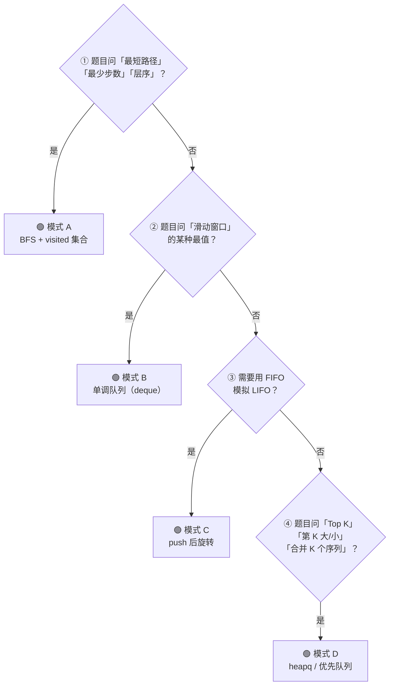

## 前置知识：队列到底是什么

### FIFO —— 先进先出

队列（Queue）是一种**两端开口**的线性数据结构。先进来的先出去——像排队买东西：

```
enqueue(3)    enqueue(7)    enqueue(9)    dequeue()
  │              │              │            │
  ▼              ▼              ▼            ▼
┌───┬───┬───┐ ┌───┬───┬───┐ ┌───┬───┬───┐ ┌───┬───┬───┐
│ 3 │   │   │ │ 3 │ 7 │   │ │ 3 │ 7 │ 9 │ │ 7 │ 9 │   │
└───┴───┴───┘ └───┴───┴───┘ └───┴───┴───┘ └───┴───┴───┘
队尾 ↑          队尾 ↑          队尾 ↑          队尾 ↑
队首 ↑          队首 ↑          队首 ↑          队首 ↑
                                                 返回 3
```

队列只有四个核心操作：

| 操作 | 含义 | 复杂度 |
|------|------|--------|
| `enqueue(x)` / `push(x)` | 把 x 加入队尾 | O(1) |
| `dequeue()` / `pop()` | 弹出队首元素 | O(1) |
| `peek()` / `front()` | 查看队首元素（不弹出） | O(1) |
| `is_empty()` | 判断队列是否为空 | O(1) |

### Python 中：deque 是标准答案

`collections.deque`（双端队列，读作 "deck"）是 Python 中最常用的队列实现：

```python
from collections import deque

q = deque()

# enqueue → append（加到右端，即队尾）
q.append(1)
q.append(2)
q.append(3)

# dequeue → popleft（从左端弹出，即队首）
val = q.popleft()      # 返回 1，q 变为 [2, 3]

# peek → q[0]
front = q[0]           # 2

# 判空
if not q:
    print("队列空了")

# 长度
len(q)                 # 2
```

> [!warning] `list.pop(0)` 是 O(n)，绝对不要用
> ```python
> # ❌ 用 list 模拟队列——每次 pop(0) 要移动所有元素
> q = [1, 2, 3]
> q.pop(0)   # O(n) —— 后面的元素全部向前移一位
>
> # ✅ 用 deque —— 底层双向链表，两端操作都是 O(1)
> from collections import deque
> q = deque([1, 2, 3])
> q.popleft()  # O(1)
> ```

### deque 的完整操作速查

```python
from collections import deque

q = deque()

# 右端操作（常规队列用法）
q.append(x)          # 队尾入队
q.pop()              # 队尾出队（栈用法）

# 左端操作
q.appendleft(x)      # 队首入队
q.popleft()          # 队首出队（常规队列用法）

# 查看两端
q[0]                 # 队首
q[-1]                # 队尾

# 注：q[i] 随机访问是 O(n)，不是 O(1)
```

---

## 队列在业务场景中的体现

| 领域 | 队列的用途 | 说明 |
|------|-----------|------|
| 🖨️ 操作系统 | 打印队列 | 先提交的文档先打印 |
| 🔔 消息队列 | RabbitMQ / Kafka | 生产者→队列→消费者 |
| 🌐 服务器 | 请求队列 | 请求排队处理 |
| 🎮 游戏 | 帧队列 | 渲染帧排队处理 |
| 🧵 多线程 | 线程池任务队列 | 任务排队执行 |
| 📊 数据流 | 滑动窗口 | 维护最近 N 个元素 |
| 🗺️ 寻路 | BFS 最短路径 | 地图最短路径 |
| 🤖 爬虫 | URL 待爬队列 | BFS/DFS 爬取策略 |

---

## 四大核心解题模式

### 模式 A：BFS 层序遍历

**一眼认出**：题目问"最短路径""最少步数""层序遍历"——BFS 是求无权图最短路径的标配。

**核心思想**：逐层扩散，当前层处理完才进入下一层。用队列维护"待处理节点"。

```python
# ====== 模式 A 骨架：BFS ======
from collections import deque

def bfs(start):
    q = deque([start])
    visited = {start}         # 记录访问过的节点（避免死循环）
    step = 0                  # 记录层数 / 步数

    while q:
        for _ in range(len(q)):   # ① 按层处理——关键！
            node = q.popleft()

            # ② 检查是否到达目标
            if is_target(node):
                return step  # 或 return True

            # ③ 扩展下一层
            for neighbor in get_neighbors(node):
                if neighbor not in visited:
                    visited.add(neighbor)
                    q.append(neighbor)

        step += 1              # ④ 一层结束

    return -1  # 未找到
```

> [!important] `for _ in range(len(q))` 的作用
> 这行代码把当前层和下一层隔离开来。不写这行 → 不知道当前在第几层 → 无法计算最短步数。
> 如果不需要计算层数（如层序遍历），可以省去 `step`。

> [!example] 示例：102. 二叉树的层序遍历
> ```python
> from collections import deque
>
> def levelOrder(root):
>     if not root:
>         return []
>     result = []
>     q = deque([root])
>
>     while q:
>         level = []
>         for _ in range(len(q)):   # 按层
>             node = q.popleft()
>             level.append(node.val)
>             if node.left:
>                 q.append(node.left)
>             if node.right:
>                 q.append(node.right)
>         result.append(level)
>
>     return result
> ```

> [!example] 示例：752. 打开转盘锁
> ```python
> from collections import deque
>
> def openLock(deadends, target):
>     dead = set(deadends)
>     if "0000" in dead:
>         return -1
>
>     q = deque(["0000"])
>     visited = {"0000"}
>     step = 0
>
>     while q:
>         for _ in range(len(q)):
>             cur = q.popleft()
>             if cur == target:
>                 return step
>             if cur in dead:
>                 continue
>
>             # 每个位置可以 +1 或 -1
>             for i in range(4):
>                 for d in (1, -1):
>                     nxt = cur[:i] + str((int(cur[i]) + d) % 10) + cur[i+1:]
>                     if nxt not in visited:
>                         visited.add(nxt)
>                         q.append(nxt)
>         step += 1
>
>     return -1
> ```

**对应题目**：

| 题号 | 题目 | BFS 的用途 |
|------|------|-----------|
| 102 | 二叉树的层序遍历 | 按层输出 |
| 111 | 二叉树的最小深度 | 找第一个叶子（最短路径） |
| 127 | 单词接龙 | 最短转换序列 |
| 752 | 打开转盘锁 | 最少转动次数 |
| 994 | 腐烂的橘子 | 多源 BFS |
| 200 | 岛屿数量 | BFS 遍历二维网格 |

---

### 模式 B：滑动窗口最大值（单调队列）

**一眼认出**：题目问"滑动窗口的最大值/最小值""连续子数组的某种最值"。

**核心思想**：维护一个**单调递减的双端队列**，队首永远是当前窗口的最大值。

```python
# ====== 模式 B 骨架：单调队列（滑动窗口最大值） ======
from collections import deque

def maxSlidingWindow(nums, k):
    q = deque()   # 存索引，队列单调递减（队首最大）
    result = []

    for i, num in enumerate(nums):
        # ① 维护窗口大小：如果队首元素跑出窗口 → 弹出
        if q and q[0] < i - k + 1:
            q.popleft()

        # ② 维护单调递减：队尾所有 ≤ 当前值的都弹出
        while q and nums[q[-1]] <= num:
            q.pop()

        q.append(i)

        # ③ 窗口成型后记录结果
        if i >= k - 1:
            result.append(nums[q[0]])

    return result
```

> [!example] 示例：239. 滑动窗口最大值
> ```python
> from collections import deque
>
> def maxSlidingWindow(nums, k):
>     q = deque()
>     res = []
>
>     for i, num in enumerate(nums):
>         # 移除跑出窗口的元素
>         if q and q[0] < i - k + 1:
>             q.popleft()
>
>         # 保持递减：从队尾移除所有 ≤ 当前值的元素
>         while q and nums[q[-1]] <= num:
>             q.pop()
>
>         q.append(i)
>
>         if i >= k - 1:
>             res.append(nums[q[0]])
>
>     return res
> ```

**单调队列图解（nums=[1,3,-1,-3,5,3,6,7], k=3）**：

```
窗口                    队列(索引)             队首(最大值)
[1,3,-1], ...          [0→1,2]         → 扔掉0   nums[1]=3
[1,3,-1], ...          [1,2]                     nums[1]=3
[3,-1,-3], ...         [1,2,3]                   nums[1]=3
[-1,-3,5], ...         [4]          → 扔掉1,2,3  nums[4]=5
[-3,5,3], ...          [4,5]                     nums[4]=5
[5,3,6], ...           [6]          → 扔掉4,5    nums[6]=6
[3,6,7], ...           [7]          → 扔掉6      nums[7]=7
[...]  → 结果: [3,3,5,5,6,7]
```

> [!tip] 单调栈 vs 单调队列
>
> | | 单调栈 | 单调队列 |
> |---|---|---|
> | 操作端 | 只有一端（pop + push 都在栈顶） | 两端（队首出、队尾入） |
> | 用途 | 找下一个更大/更小 | 滑动窗口最值 |
> | 数据结构 | `list` | `deque` |
> | 典型题 | 739. 每日温度 | 239. 滑动窗口最大值 |

**对应题目**：

| 题号 | 题目 | 队列维护什么 |
|------|------|-------------|
| 239 | 滑动窗口最大值 | 递减队列 → 队首最大 |
| 1438 | 绝对差不超过限制的最长子数组 | 两个队列（最大+最小） |

---

### 模式 C：用队列实现栈

**一眼认出**：面试常考的设计题——用 FIFO 模拟 LIFO。

**核心思路**：每次 push 后，把新元素"旋"到队首。

```python
# ====== 模式 C 骨架：用队列实现栈 ======
from collections import deque

class MyStack:
    def __init__(self):
        self.q = deque()

    def push(self, x):
        self.q.append(x)
        # 把新元素旋转到队首
        for _ in range(len(self.q) - 1):
            self.q.append(self.q.popleft())

    def pop(self):
        return self.q.popleft()

    def top(self):
        return self.q[0]

    def empty(self):
        return not self.q
```

> [!example] 示例：225. 用队列实现栈
> ```python
> from collections import deque
>
> class MyStack:
>     def __init__(self):
>         self.q = deque()
>
>     def push(self, x):
>         n = len(self.q)
>         self.q.append(x)
>         for _ in range(n):
>             self.q.append(self.q.popleft())
>
>     def pop(self):
>         return self.q.popleft()
>
>     def top(self):
>         return self.q[0]
>
>     def empty(self):
>         return not self.q
> ```

> [!tip] 为什么旋转 n 次？
> push(1) → q=[1]，旋转 0 次
> push(2) → q=[1,2]，旋转 1 次 → q=[2,1]
> push(3) → q=[2,1,3]，旋转 2 次 → q=[3,2,1]
> 栈顶始终在队首！

**对应题目**：

| 题号 | 题目 | 技巧 |
|------|------|------|
| 225 | 用队列实现栈 | pusH 后旋转 |
| 232 | 用栈实现队列 | 双栈互倒 |

---

### 模式 D：优先队列 / 堆的队列视角

**一眼认出**：题目问"Top K""第 K 大/小""合并 K 个有序序列""任务调度"。

优先队列不是严格 FIFO，而是**按优先级出队**（每次取出最值）。

```python
import heapq

# Python 的 heapq 是最小堆（堆顶最小）
# 用 heapq 模拟优先队列

# ====== 模式 D 骨架：优先队列 ======
import heapq

# Top K 大 → 最小堆（保持堆大小为 K，堆顶是第 K 大）
def top_k_largest(nums, k):
    heap = []
    for num in nums:
        heapq.heappush(heap, num)
        if len(heap) > k:
            heapq.heappop(heap)     # 弹出最小
    return heap[0]                   # 堆顶 = 第 K 大

# Top K 小 → 最大堆（取负值用最小堆模拟）
def top_k_smallest(nums, k):
    heap = []
    for num in nums:
        heapq.heappush(heap, -num)   # 取反 = 大 → 小
        if len(heap) > k:
            heapq.heappop(heap)
    return [-x for x in heap]        # 还原
```

> [!example] 示例：215. 数组中的第 K 个最大元素
> ```python
> import heapq
>
> def findKthLargest(nums, k):
>     heap = []
>     for num in nums:
>         heapq.heappush(heap, num)
>         if len(heap) > k:
>             heapq.heappop(heap)
>     return heap[0]       # 堆顶是第 K 大
> ```

> [!example] 示例：23. 合并 K 个升序链表
> ```python
> import heapq
>
> def mergeKLists(lists):
>     heap = []
>     for i, node in enumerate(lists):
>         if node:
>             heapq.heappush(heap, (node.val, i, node))
>     # i 是 tie-breaker：当值相同时，避免比较 ListNode（不可比较）
>
>     dummy = cur = ListNode(0)
>     while heap:
>         val, i, node = heapq.heappop(heap)
>         cur.next = node
>         cur = cur.next
>         if node.next:
>             heapq.heappush(heap, (node.next.val, i, node.next))
>
>     return dummy.next
> ```

> [!example] 示例：621. 任务调度器（优先队列模拟）
> ```python
> import heapq
> from collections import Counter, deque
>
> def leastInterval(tasks, n):
>     # ① 统计频率
>     cnt = Counter(tasks)
>     # ② 最大堆：按频率排序
>     heap = [-freq for freq in cnt.values()]
>     heapq.heapify(heap)
>
>     q = deque()  # 冷却队列：(下次可执行时间, 剩余次数)
>     time = 0
>
>     while heap or q:
>         time += 1
>
>         if heap:
>             freq = -heapq.heappop(heap)
>             if freq > 1:  # 还有剩余 → 进入冷却
>                 q.append((time + n, freq - 1))
>
>         if q and q[0][0] == time:  # 冷却结束
>             _, remaining = q.popleft()
>             heapq.heappush(heap, -remaining)
>
>     return time
> ```

**对应题目**：

| 题号 | 题目 | 堆的用途 |
|------|------|---------|
| 215 | 数组中的第 K 个最大元素 | 最小堆维护 Top K |
| 347 | 前 K 个高频元素 | `(-频率, 元素)` 入堆 |
| 23 | 合并 K 个升序链表 | 最小堆维护 K 个链表的头 |
| 295 | 数据流的中位数 | 双堆（最大堆+最小堆） |
| 621 | 任务调度器 | 最大堆 + 冷却队列 |

---

## 拿到题，先问自己



---

## 新手练习路线图

```
阶段 1️⃣  BFS 入门（模式 A）
  ├── 102. 二叉树的层序遍历          ← BFS 模板，理解按层处理
  ├── 111. 二叉树的最小深度          ← 体会 BFS 比 DFS 好在哪
  └── 104. 二叉树的最大深度          ← BFS 也能做（非最优但练手）

阶段 2️⃣  BFS 图应用（模式 A 进阶）
  ├── 200. 岛屿数量                  ← BFS 遍历二维网格
  ├── 994. 腐烂的橘子                ← 多源 BFS
  ├── 127. 单词接龙                  ← 图 BFS + 最短路径
  └── 752. 打开转盘锁                ← BFS + visited 去重

阶段 3️⃣  滑动窗口 + 单调队列（模式 B）
  ├── 239. 滑动窗口最大值             ← 单调队列经典题
  └── 1438. 绝对差不超过限制的最长子数组 ← 双单调队列

阶段 4️⃣  优先队列 / 堆（模式 D）
  ├── 215. 数组中的第 K 个最大元素    ← 堆入门
  ├── 347. 前 K 个高频元素           ← 堆 + 哈希表
  ├── 23. 合并 K 个升序链表          ← 堆合并
  └── 295. 数据流的中位数            ← 双堆思维

阶段 5️⃣  设计题（模式 C）
  ├── 225. 用队列实现栈              ← push 旋转法
  └── 232. 用栈实现队列              ← 双栈法（见栈笔记）
```

---

## 常见易错点

> [!warning] **坑 1：用 list 当队列（O(n) 噩梦）**
> ```python
> # ❌ list.pop(0) 是 O(n)——大量数据会超时
> q = [1, 2, 3]
> x = q.pop(0)   # 后面所有元素前移一位
>
> # ✅ 用 deque
> from collections import deque
> q = deque([1, 2, 3])
> x = q.popleft()  # O(1)
> ```

> [!warning] **坑 2：BFS 忘记 visited 导致死循环**
> ```python
> # ❌ 有环的图会无限循环
> q = deque([start])
> while q:
>     node = q.popleft()
>     for neighbor in graph[node]:
>         q.append(neighbor)        # 没有 visited！
>
> # ✅ 加 visited
> visited = {start}
> while q:
>     node = q.popleft()
>     for neighbor in graph[node]:
>         if neighbor not in visited:
>             visited.add(neighbor)
>             q.append(neighbor)
> ```

> [!warning] **坑 3：BFS 漏了 `for _ in range(len(q))`**
> ```python
> # ❌ 不按层 → step 计数错误
> step = 0
> while q:
>     node = q.popleft()
>     # ...扩展...
>     step += 1   # 错：不是一层增加一次
>
> # ✅ 按层遍历
> step = 0
> while q:
>     for _ in range(len(q)):
>         node = q.popleft()
>         # ...扩展...
>     step += 1   # 正确：每层 +1
> ```

> [!warning] **坑 4：单调队列中判断过期写错条件**
> ```python
> # ❌ 条件错误：应该是 < 而不是 <=
> if q and q[0] <= i - k:
>     q.popleft()
>
> # ✅ 正确：队首索引 < 窗口左边界 → 过期
> if q and q[0] < i - k + 1:   # i-k+1 是窗口左边界
>     q.popleft()
> ```

---

## 相关题目索引

| 题号 | 题目 | 模式 | 难度 |
|------|------|------|------|
| 23 | 合并 K 个升序链表 | D | 困难 |
| 102 | 二叉树的层序遍历 | A | 中等 |
| 104 | 二叉树的最大深度 | A | 简单 |
| 111 | 二叉树的最小深度 | A | 简单 |
| 127 | 单词接龙 | A | 困难 |
| 200 | 岛屿数量 | A | 中等 |
| 215 | 数组中的第 K 个最大元素 | D | 中等 |
| 225 | 用队列实现栈 | C | 简单 |
| 232 | 用栈实现队列 | 双栈 | 简单 |
| 239 | 滑动窗口最大值 | B | 困难 |
| 295 | 数据流的中位数 | D | 困难 |
| 347 | 前 K 个高频元素 | D | 中等 |
| 621 | 任务调度器 | D | 中等 |
| 752 | 打开转盘锁 | A | 中等 |
| 994 | 腐烂的橘子 | A | 中等 |
| 1438 | 绝对差不超过限制的最长子数组 | B | 中等 |

---

## 队列家族时间复杂度速查

| 操作 | deque | heapq (优先队列) | list |
|------|-------|-----------------|------|
| 队尾插入 | O(1) | O(log n) | O(1) |
| 队首弹出 | O(1) | O(log n) | O(n) |
| 查看两端 | O(1) | O(1) 堆顶 | O(1) |
| 随机访问 | O(n) | — | O(1) |
| 构建 | O(n) | O(n) heapify | O(n) |

---

## 相关笔记

- [[二叉树基础与通用解题框架]] — 二叉树的层序遍历（BFS）和递归 DFS 的对比
- [[栈基础与通用解题框架]] — 栈的"对偶"结构，BFS 用队列、DFS 用栈
- [[哈希表基础与通用解题框架]] — BFS 中 visited 集合的本质是哈希表判重，TopK 需要哈希表统计频率
- [[图论基础与通用解题框架]] — 图的 BFS 最短路径
- [[双指针基础与通用解题框架]] 与 [[滑动窗口基础与通用解题框架]] — 滑动窗口中单调队列与双指针的对比
