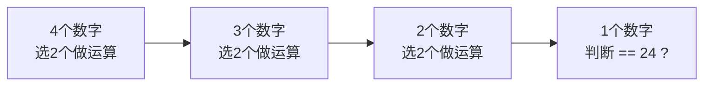
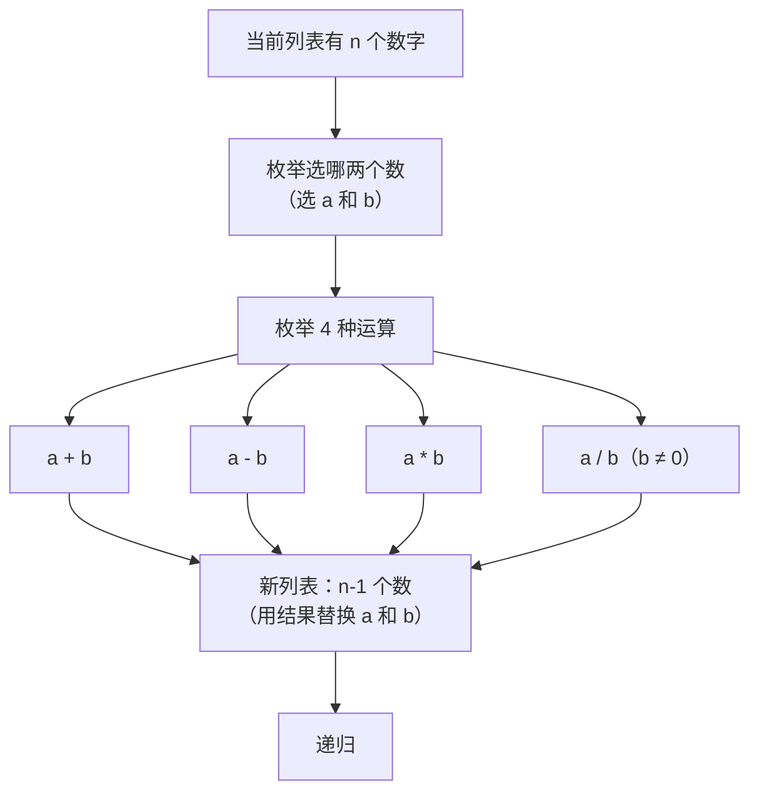
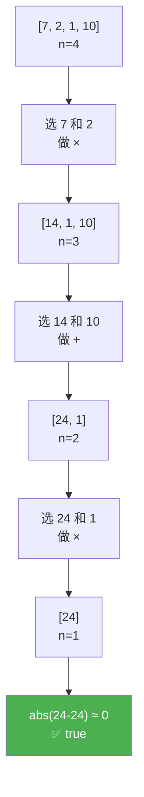
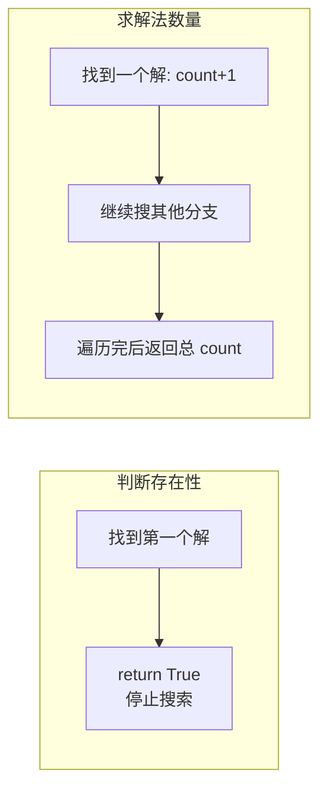

---
tags:
  - algorithm
  - dfs
  - backtracking
  - nowcoder
difficulty: 中等
source: https://www.nowcoder.com/practice/fbc417f314f745b1978fc751a54ac8cb
lark_doc_url: https://my.feishu.cn/docx/U96BdP4qZoyODEx5BZkcCEv5nbb
---

# 24点游戏算法

> 给出 4 个 [1,10] 的数字，通过**加减乘除**运算，得到 **24** 就算胜利。
>
> 数字顺序任意，每个数字只用一次，可加括号，除法是实数除法。
>
> 输入：`7 2 1 10` → 输出：`true`（因为 $7 \times 2 + 10 \times 1 = 24$）

---

## 一、核心洞察 —— 翻译题目

> 给 4 个数字，每次选 2 个做一种运算，用结果替换这 2 个数。重复直到只剩 1 个数。判断它是否等于 24。

这就是一个 **搜索 / 回溯（DFS）** 问题——在所有可能的运算组合中，找出一条能得到 24 的路径。



---

## 二、解题思维还原

### 第一步：怎么把问题变小？

> 4 个数 → 选 2 个做运算得 1 个结果 → 还剩 3 个数 → 问题规模从 4 缩小到 3

每一步规模都严格变小：

```
n=4: [7, 2, 1, 10]
       ↓ 选 7 和 2，做乘法
n=3: [14, 1, 10]
       ↓ 选 14 和 10，做加法
n=2: [24, 1]
       ↓ 选 24 和 1，做乘法
n=1: [24]  →  abs(24-24) < 1e-6 → true ✓
```

### 第二步：找分类维度

面对「从列表中选两个数做运算」，分类维度有两个：

| 维度 | 选项 | 
|:--|:--|
| ① 选哪两个数？ | 从 n 个数中选 2 个的所有组合 |
| ② 做什么运算？ | `+` `-` `*` `/`（共 4 种） |



### 第三步：验证边界

| 边界 | 处理 |
|:--|:--|
| 列表只剩 1 个数 | 判断 `abs(该数 - 24) < 1e-6`（浮点精度） |
| 除数为 0 | 跳过这种组合 |
| 所有组合都试完了 | 返回 `false` |

---

## 三、决策树示例

以输入 `7 2 1 10` 为例，画出一棵能找到答案的路径：



当然也有大量走不通的路径。完整的搜索空间是一棵 **多叉树**，每一个分支代表「选哪两个数 + 做什么运算」。DFS 的本质就是遍历这棵树，找到一条通往 `24` 的路径。

---

## 四、DFS 递归树（完整搜索空间示例）

以更小的例子 `[1, 2, 3]` 搜索目标 `6`（简化理解）为例：

```
                         [1, 2, 3]
                    /       |        \
              选(1,2)     选(1,3)     选(2,3)
           /  |  \  \      ...          ...
          +   -   *   /
        [3,3] [1,3] [2,3] [0.5,3]
          |      |      |       |
        ...    ...    选(2,3)+ 选(0.5,3)×
                       [5]      [1.5]
                       ≠6 ✗     ≠6 ✗

其中有路径：
[1,2,3] → 选(1,2)做+ → [3,3] → 选(3,3)做+ → [6] → abs(6-6)=0 ✓
```

> 4 个数字的完整搜索树非常庞大（数百个节点），但 DFS 一旦找到答案就会立即返回，不需要遍历整棵树。

---

## 五、Python 代码

### 方法一：DFS 回溯（最清晰）

```python
def judge_24(nums):
    """
    DFS 回溯：每次从列表中选两个数，做运算，递归处理剩余数字。
    """
    n = len(nums)
    if n == 1:
        # 边界：只剩一个数，判断是否等于 24
        return abs(nums[0] - 24) < 1e-6

    # 枚举选哪两个数
    for i in range(n):
        for j in range(n):
            if i == j:
                continue

            # 剩下的数字（去掉选中的 i 和 j）
            remaining = []
            for k in range(n):
                if k != i and k != j:
                    remaining.append(nums[k])

            # 4 种运算
            a, b = nums[i], nums[j]

            # ① 加法
            if judge_24(remaining + [a + b]):
                return True

            # ② 减法
            if judge_24(remaining + [a - b]):
                return True

            # ③ 乘法
            if judge_24(remaining + [a * b]):
                return True

            # ④ 除法（除数不能为 0）
            if b != 0:
                if judge_24(remaining + [a / b]):
                    return True

    return False
```

### 方法二：优化版 —— 减少重复计算

```python
def judge_24_v2(nums):
    """
    优化：加法乘法交换律剪枝，减法和除法只算一种顺序。
    但本题 n=4 数据量极小，不优化也能过。
    """
    n = len(nums)
    if n == 1:
        return abs(nums[0] - 24) < 1e-6

    for i in range(n):
        for j in range(i + 1, n):  # 只枚举 i < j，去重
            a, b = nums[i], nums[j]

            # 构建剩余列表（去掉 i 和 j）
            remaining = [nums[k] for k in range(n) if k != i and k != j]

            # 6 种运算结果（加法乘法各1种，减法除法各2种顺序）
            candidates = []

            # 加法（交换律：a+b = b+a，只需要一种）
            candidates.append(a + b)

            # 减法（两种顺序结果不同）
            candidates.append(a - b)
            candidates.append(b - a)

            # 乘法（交换律：a*b = b*a，只需要一种）
            candidates.append(a * b)

            # 除法（两种顺序结果不同，注意除数为0）
            if b != 0:
                candidates.append(a / b)
            if a != 0:
                candidates.append(b / a)

            for val in candidates:
                if judge_24_v2(remaining + [val]):
                    return True

    return False
```

### 方法三：牛客网输入输出格式

```python
import sys

def judge_24(nums):
    if len(nums) == 1:
        return abs(nums[0] - 24) < 1e-6

    n = len(nums)
    for i in range(n):
        for j in range(n):
            if i == j:
                continue
            a, b = nums[i], nums[j]
            remaining = [nums[k] for k in range(n) if k != i and k != j]

            candidates = [a + b, a - b, a * b]
            if b != 0:
                candidates.append(a / b)

            for val in candidates:
                if judge_24(remaining + [val]):
                    return True
    return False


if __name__ == "__main__":
    for line in sys.stdin:
        line = line.strip()
        if not line:
            continue
        nums = list(map(float, line.split()))
        print(str(judge_24(nums)).lower())
```

---

## 六、⚠️ 踩坑提醒

| 坑 | 说明 |
|:--|:--|
| **浮点精度** | 用 `abs(x - 24) < 1e-6`，不要用 `x == 24`（除法会产生小数） |
| **除数为 0** | 每次除法前必须判断 `b != 0` |
| **减法顺序** | `a-b` 和 `b-a` 结果不同，两种都要试 |
| **除法顺序** | 同理 `a/b` 和 `b/a` 不同 |

---

## 七、与解题框架的对应

| 框架步骤 | 本题体现 |
|:--|:--|
| ① **翻译题目** | 4个数选2个运算→缩小到3个数→…→1个数 |
| ② **问「怎么变小」** | 每次运算让列表长度减 1 |
| ③ **找分类维度** | 维度1：选哪两个数；维度2：做什么运算 |
| ④ **验证边界** | n=1 时判断是否=24；除数为0跳过 |
| **选算法** | 搜索可行性 → **DFS/回溯** |

### 为什么这题用 DFS 而不是 DP？

| | DP | DFS（本题） |
|:--|:--|:--|
| 问题类型 | 计数 / 最值 | 可行性（是否存在） |
| 子问题是否重叠 | 大量重叠 | 这里组合太多，缓存收益低 |
| 最自然的方式 | 递推填表 | 回溯试错，找到就停 |

> 24 点游戏是经典的 DFS 回溯题。4 个数字的规模极小，搜索空间完全可控，不需要 DP。找到一条合法路径就立即返回。

---

## 八、延伸：求一共有多少种解法

### 核心变化：从"找到即停"到"全部遍历"

| | 判断是否存在解 | 求解法数量 |
|:--|:--|:--|
| **返回值类型** | `bool` | `int` |
| **找到解后** | 立即 `return True` | 继续搜索，累加计数 |
| **递归终止** | 只要有一个分支成功 | 必须遍历所有分支 |
| **结果汇总** | 任一分支的 `True` | 所有分支的结果之和 |

本质上是把 DFS 的 **短路返回** 改成 **全量求和**。



### 方法一：计算所有运算路径（基础版）

```python
def count_24(nums):
    """
    计算所有能得到 24 的运算路径数量。
    注意：不同运算顺序但等价的结果都会分别计数。
    """
    n = len(nums)
    if n == 1:
        # 边界：等于 24 得 1 分，否则 0 分
        return 1 if abs(nums[0] - 24) < 1e-6 else 0

    total = 0
    for i in range(n):
        for j in range(n):
            if i == j:
                continue

            a, b = nums[i], nums[j]
            remaining = [nums[k] for k in range(n) if k != i and k != j]

            # 加法
            total += count_24(remaining + [a + b])

            # 减法
            total += count_24(remaining + [a - b])

            # 乘法
            total += count_24(remaining + [a * b])

            # 除法
            if b != 0:
                total += count_24(remaining + [a / b])

    return total
```

**关键变化**（对比 `judge_24`）：

| 行 | 存在性版本 | 计数版本 |
|:--|:--|:--|
| 边界 | `return abs(nums[0]-24) < 1e-6` | `return 1 if ... else 0` |
| 递归 | `if judge_24(...): return True` | `total += count_24(...)` |
| 最终返回 | `return False` | `return total` |

### 方法二：去重优化版

```python
def count_24_v2(nums):
    """
    优化版：只枚举 i < j，避免重复组合。
    减法除法的两种顺序各自计数。
    """
    n = len(nums)
    if n == 1:
        return 1 if abs(nums[0] - 24) < 1e-6 else 0

    total = 0
    for i in range(n):
        for j in range(i + 1, n):  # 只枚举 i < j
            a, b = nums[i], nums[j]
            remaining = [nums[k] for k in range(n) if k != i and k != j]

            # 加法（a+b = b+a，一种）
            total += count_24_v2(remaining + [a + b])

            # 减法（两种顺序）
            total += count_24_v2(remaining + [a - b])
            total += count_24_v2(remaining + [b - a])

            # 乘法（a*b = b*a，一种）
            total += count_24_v2(remaining + [a * b])

            # 除法（两种顺序）
            if b != 0:
                total += count_24_v2(remaining + [a / b])
            if a != 0:
                total += count_24_v2(remaining + [b / a])

    return total
```

### 方法三：输出具体表达式

只输出数量有时不够直观，我们可以让函数**同时输出具体的运算表达式**：

```python
def count_24_with_expr(nums):
    """
    返回 (解法数量, 具体表达式列表)。
    表达式用 (a op b) 的格式拼接。
    """
    def dfs(nums, exprs):
        """exprs 是与 nums 一一对应的表达式字符串"""
        n = len(nums)
        if n == 1:
            if abs(nums[0] - 24) < 1e-6:
                return [(1, [exprs[0]])]  # 找到一种解法
            return [(0, [])]

        results = []
        for i in range(n):
            for j in range(i + 1, n):
                a, b = nums[i], nums[j]
                ea, eb = exprs[i], exprs[j]

                remaining = [nums[k] for k in range(n) if k != i and k != j]
                remaining_e = [exprs[k] for k in range(n) if k != i and k != j]

                # 6 种运算
                ops = [
                    (a + b, f"({ea}+{eb})"),
                    (a - b, f"({ea}-{eb})"),
                    (b - a, f"({eb}-{ea})"),
                    (a * b, f"({ea}×{eb})"),
                ]
                if b != 0:
                    ops.append((a / b, f"({ea}÷{eb})"))
                if a != 0:
                    ops.append((b / a, f"({eb}÷{ea})"))

                for val, expr in ops:
                    sub_results = dfs(remaining + [val], remaining_e + [expr])
                    for cnt, exprs_list in sub_results:
                        if cnt > 0:
                            results.append((cnt, exprs_list))

        return results

    # 初始表达式就是数字本身
    initial_exprs = [str(int(x)) if x == int(x) else str(x) for x in nums]
    all_results = dfs(nums, initial_exprs)
    total = sum(cnt for cnt, _ in all_results)
    expressions = [e for _, expr_list in all_results for e in expr_list]
    return total, expressions


# 示例
total, exprs = count_24_with_expr([7, 2, 1, 10])
print(f"共 {total} 种解法")
for e in exprs:
    print(f"  {e} = 24")
```

实际运行输出（表达式为全括号格式，顺序按递归枚举顺序）：
```
共 14 种解法
  ((7×2)+(1×10)) = 24
  ((7×2)+(10÷1)) = 24
  (10+(1×(7×2))) = 24
  (10+((7×2)÷1)) = 24
  ...
```

### ⚠️ 关于"去重"

上面统计的是**运算路径**的数量。但从数学角度看，很多路径表达的是同一个计算过程，例如：
- `(a+b)+c` 和 `a+(b+c)` 本质相同（加法结合律）
- `(a+b)+c` 和 `(b+a)+c` 本质相同（加法交换律）
- `a*b+c` 和 `c+a*b` 本质相同（加法交换律）

如何计数取决于"解法"的定义。常见处理方式：

| 方案 | 做法 | 适用场景 |
|:--|:--|:--|
| **宽松计数** | 所有运算路径都算 | 初版实现，简单直接 |
| **交换律去重** | 用 `i < j` 去重加法/乘法顺序 | 方法二 |
| **表达式归一化** | 用集合去重最终表达式 | 方法三的 `set(expressions)` |
| **后缀表达式去重** | 转为逆波兰式后比较 | 严格的数学等价判断 |

### 一句话总结

> 求解法数量就是把 DFS 中每个 `if judge(...): return True` 改成 `total += count(...)`，让搜索跑完全程而不是中途停下。核心结构完全不变，只改了**返回值类型**和**汇总方式**。
