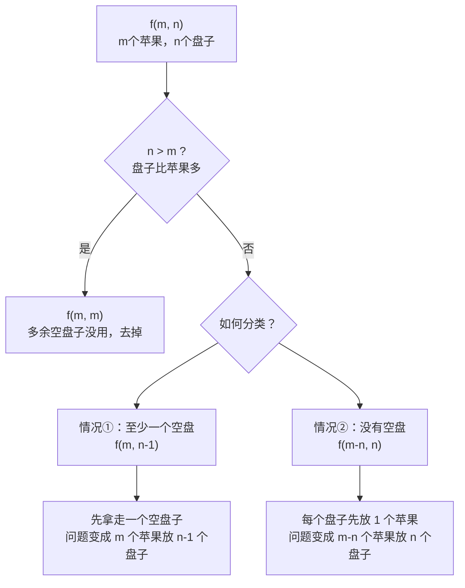
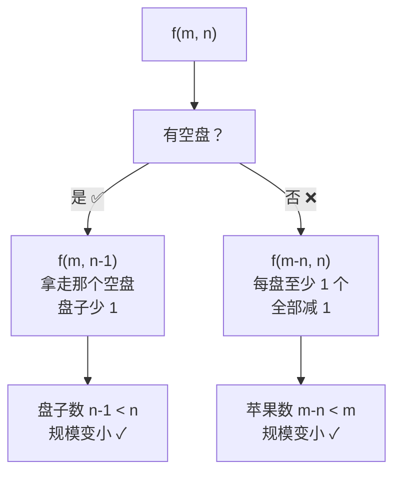
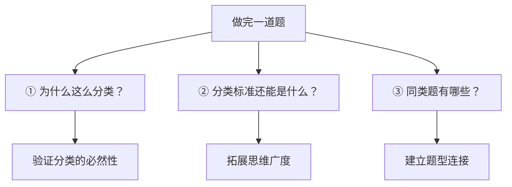
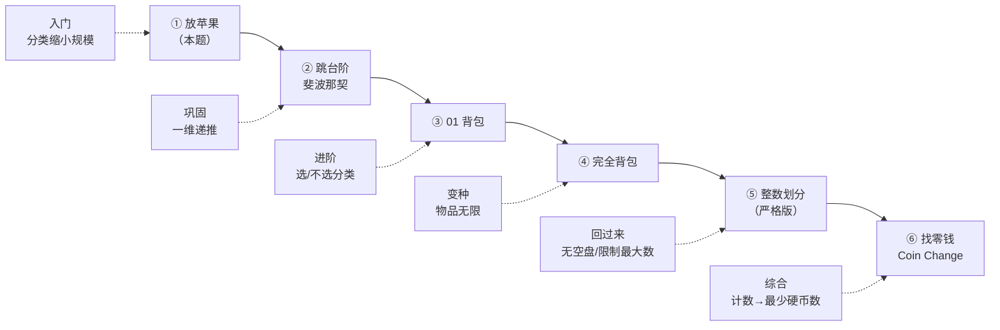

---
tags:
  - algorithm
  - recursion
  - dp
  - nowcoder
difficulty: 中等
source: https://www.nowcoder.com/practice/bfd8234bb5e84be0b493656e390bdebf
lark_doc_url: https://my.feishu.cn/docx/P4zVd68JbownA8xKnXSc6JQvnEg
---

# 放苹果

> 把 m 个**同样的苹果**放在 n 个**同样的盘子**里，允许有的盘子空着不放，问共有多少种不同的分法？
>
> 注意：`5,1,1` 和 `1,5,1` 是同一种分法（盘子相同，顺序无关）。
>
> 数据范围：$0 \le m \le 10$，$1 \le n \le 10$

---

## 一、核心洞察

这道题本质上是求 **将整数 m 划分成最多 n 个正整数之和的方案数**（整数划分问题）。

因为盘子是相同的，我们只关心 **每个盘子有几个苹果**，不关心哪个盘子是哪个。排序后去重即可。

---

## 二、递归推导（决策树）

> 用 $f(m, n)$ 表示：**m 个苹果放入 n 个盘子的方案数**。

### 分类讨论 —— 关键一步！

面对 $f(m, n)$，我们按 **"是否有空盘子"** 来拆分：



### 递归公式

$$
f(m, n) = \begin{cases}
1 & \text{if } m = 0 \text{ （0个苹果，只有全空一种方案）} \\[4pt]
1 & \text{if } n = 1 \text{ （只有1个盘子，全放进去一种方案）} \\[4pt]
f(m, m) & \text{if } n > m \text{ （盘子比苹果多）} \\[4pt]
f(m, n-1) + f(m-n, n) & \text{otherwise （有空盘 + 无空盘）}
\end{cases}
$$

---

## 三、递归树示例：f(7, 3)

以 **m=7, n=3** 为例，画出完整的递归调用树：

```
                        f(7,3)
                       /      \
                      /        \
              f(7,2)            f(4,3)
             /     \            /     \
        f(7,1)   f(5,2)    f(4,2)   f(1,3)
          │       /    \     /    \      │
          1   f(5,1) f(3,2) f(4,1) f(2,2) → f(1,1) = 1
                │     /   \    │     /   \
                1  f(3,1) f(1,2) 1  f(2,1) f(0,2)
                     │      │         │      │
                     1   → f(1,1)=1   1      1

每个叶子节点的值都是 1，自底向上求和：

f(3,2) = 1+1 = 2
f(5,2) = 1+2 = 3
f(7,2) = 1+3 = 4

f(2,2) = 1+1 = 2
f(4,2) = 1+2 = 3
f(4,3) = 3+1 = 4

f(7,3) = 4+4 = 8  ← 答案
```

### 验证：7 的至多 3 部分划分

```
7           → [7]
6+1         → [6, 1]
5+2         → [5, 2]
5+1+1       → [5, 1, 1]
4+3         → [4, 3]
4+2+1       → [4, 2, 1]
3+3+1       → [3, 3, 1]
3+2+2       → [3, 2, 2]
────────────────────
共 8 种 ✓
```

---

## 四、DP 表格可视化

用动态规划表格也能直观理解。以 m=7, n=3 为例：

| dp\[i]\[j] | j=0 | j=1 | j=2 | j=3 |
|:---:|:---:|:---:|:---:|:---:|
| **i=0** | 1 | 1 | 1 | 1 |
| **i=1** | 0 | 1 | 1 | 1 |
| **i=2** | 0 | 1 | 2 | 2 |
| **i=3** | 0 | 1 | 2 | 3 |
| **i=4** | 0 | 1 | 3 | 4 |
| **i=5** | 0 | 1 | 3 | 5 |
| **i=6** | 0 | 1 | 4 | 7 |
| **i=7** | 0 | 1 | 4 | **8** |

> 递推：`dp[i][j] = dp[i][j-1] + dp[i-j][j]`（当 i ≥ j）
>
> `dp[i][j-1]` 来自左边：至少一个空盘子
>
> `dp[i-j][j]` 来自上边：每个盘子至少一个苹果

---

## 五、Python 代码

### 方法一：记忆化递归（最直观）

```python
def put_apples(m: int, n: int) -> int:
    """记忆化递归解法"""
    memo = {}

    def dfs(apples: int, plates: int) -> int:
        # base cases
        if apples == 0:
            return 1
        if plates == 1:
            return 1

        key = (apples, plates)
        if key in memo:
            return memo[key]

        if plates > apples:
            # 盘子多于苹果，多余的盘子没用
            result = dfs(apples, apples)
        else:
            # 有空盘 + 无空盘
            result = dfs(apples, plates - 1) + dfs(apples - plates, plates)

        memo[key] = result
        return result

    return dfs(m, n)


# 测试
if __name__ == "__main__":
    print(put_apples(7, 3))  # 输出: 8
    print(put_apples(3, 2))  # 输出: 2   (3+0, 2+1)
    print(put_apples(5, 5))  # 输出: 7
```

### 方法二：动态规划（适合较大数据）

```python
def put_apples_dp(m: int, n: int) -> int:
    """动态规划解法"""
    # dp[i][j] = i个苹果放入j个盘子的方案数
    dp = [[0] * (n + 1) for _ in range(m + 1)]

    # 初始化：0个苹果只有1种方案（全空）
    for j in range(n + 1):
        dp[0][j] = 1

    # 初始化：1个盘子只有1种方案（全放进去）
    for i in range(1, m + 1):
        dp[i][1] = 1

    for i in range(1, m + 1):
        for j in range(2, n + 1):
            if i < j:
                dp[i][j] = dp[i][i]      # 盘子比苹果多
            else:
                dp[i][j] = dp[i][j - 1] + dp[i - j][j]

    return dp[m][n]


# 测试
if __name__ == "__main__":
    print(put_apples_dp(7, 3))   # 8
    print(put_apples_dp(10, 10)) # 42
```

### 方法三：牛客网输入输出格式

```python
import sys

def solve(m: int, n: int) -> int:
    memo = {}

    def dfs(apples: int, plates: int) -> int:
        if apples == 0:
            return 1
        if plates == 1:
            return 1
        key = (apples, plates)
        if key in memo:
            return memo[key]
        if plates > apples:
            result = dfs(apples, apples)
        else:
            result = dfs(apples, plates - 1) + dfs(apples - plates, plates)
        memo[key] = result
        return result

    return dfs(m, n)


if __name__ == "__main__":
    for line in sys.stdin:
        line = line.strip()
        if not line:
            continue
        m, n = map(int, line.split())
        print(solve(m, n))
```

---

## 六、记忆要点

| 关键点 | 说明 |
|:---|:---|
| 分类标准 | **是否有空盘子** —— 这是拆分问题的核心 |
| `f(m, n-1)` | 至少一个空盘 → 拿走那个空盘 |
| `f(m-n, n)` | 每个盘至少一个 → 先各放 1 个 |
| 盘子相同 | 所以 5,1,1 和 1,5,1 是一种——我们天然地**不关心顺序** |
| 边界 | m=0 也是一种方案（全空）；n=1 只有一种方案 |

---

## 七、解题思维还原 —— 我是怎么想出这个思路的？

> 这个部分是 **元认知** 内容：不讨论题目本身，而是还原面对这道题时的完整思考过程，帮助你培养同样的解题直觉。

### 第一步：翻译题目，去掉包装

读到「m 个同样的苹果，n 个同样的盘子」时，第一反应是：

> **把「苹果」替换成「数字 1」，把「盘子」替换成「分组」。**

题目就变成了：

> 把 m 个 1 分成最多 n 组，每组个数不限，顺序无关。有多少种分法？

这就是 **整数划分（Integer Partition）** 问题——组合数学里的经典问题。如果你脑子里有这个概念，思路框架就已经有了。


### 第二步：问自己——「怎么把问题变小？」

这是递归/DP 类问题最核心的思维习惯。面对 $f(m,n)$，反复问自己：

> **能不能把这个问题，变成规模更小的同类型问题？**

为了做到这一点，需要找到一个 **分类维度**，使得：
- 每一类都是规模更小的 $f$ 问题（保证递归能终止）
- 各类之间互不重叠（**不重**）
- 各类合起来覆盖所有情况（**不漏**）

### 关键洞察：$n > m$ 是怎么一步推导出来的？

> 这一步不是从公式出发的，而是从一个具体例子「逼」出来的。

先别想抽象的 $f(m,n)$。代入一个极端小例子：

> **3 个苹果，5 个盘子。有哪些放法？**

手动枚举：

```
[3, 0, 0, 0, 0]
[2, 1, 0, 0, 0]
[1, 1, 1, 0, 0]
```

就 3 种。然后问自己：**如果只有 3 个盘子呢？**

```
[3, 0, 0]
[2, 1, 0]
[1, 1, 1]
```

**一模一样。** 多出来的 2 个盘子永远是空的——因为一共就 3 个苹果，最多只能填满 3 个盘子。

#### 为什么多出来的盘子"必然"是空的？—— 下界推理

```
每个非空盘子 ≥ 1 个苹果          （下界约束）
m 个苹果 → 最多填满 m 个非空盘子
如果 n > m，那至少有 n−m 个盘子必然为空
```

而盘子之间没有编号、没有区别，所以**空盘子不产生新方案**——不管你有 3 个盘子还是 100 个盘子，只要苹果只有 3 个，放法就一样。

这就推导出：

> **$n > m \implies f(m,n) = f(m,m)$**

#### 这一步之后，问题简化了

一旦确认 $n > m$ 时可以缩减，问题就从「任意 m 和 n」简化到了「$n \le m$」的情况。现在只需要考虑**盘子不超过苹果数**：

```
f(7, 3)  ← 苹果比盘子多，不能靠"多余空盘"简化了
```

这时需要换一个分类维度。「有空盘 / 无空盘」就是针对 $n \le m$ 场景设计的。

> **总结这条思维链**：
>
> ```
> 先用极端例子（3苹果5盘子）手动枚举
>   → 观察：多出的盘子永远空
>   → 用下界推理验证：每个非空盘 ≥ 1，m 个苹果最多填 m 个盘
>   → 得出结论：n > m 时直接缩减为 f(m, m)
>   → 剩下的 n ≤ m 情况，再用「有空/无空」分类
> ```
>
> 核心习惯：**不直接从公式出发。先用小例子枚举，观察规律，然后用数学语言（下界/上界/鸽巢）把规律说清楚，最后才抽象成公式。**

### 第三步：找分类维度 —— 最关键的一步

脑子里快速扫描了几个可能的分类角度：

| 分类角度 | 是否可行 | 原因 |
|:--|:--|:--|
| 第一个盘子放几个？ | ❌ | 盘子没编号，「第一个」没有意义 |
| 最多的盘子放几个？ | ✅ 可行 | 但递推公式复杂 |
| **有没有空盘子？** | ✅✅ **最佳** | 简洁、互斥、完备 |

**「有没有空盘子」这个分类之所以漂亮：**



两个子问题都比原问题 **严格更小**（要么盘子少了，要么苹果少了），所以递归一定能终止。

### 第四步：验证边界

最后确认什么时候递归到头：

| 边界 | 方案数 | 原因 |
|:--|:--|:--|
| $m=0$ | 1 | 没苹果了，只有「全空」一种方案 |
| $n=1$ | 1 | 只有一个盘子，所有苹果都放进去 |

边界清晰了，公式就出来了。

---

## 八、怎么养成这种思维方式？

### 1️⃣ 先建立「问题类型库」

大多数算法题都能归到某个经典类型。看到题先问自己：**这像哪个经典问题？**

| 题目特征 | 可能是 |
|:--|:--|
| 相同物品 + 相同容器 + 计数 | **整数划分**（本题） |
| 不同物品 + 有限容量 + 最大价值 | **背包问题** |
| 物品有顺序 + 计数 | **排列组合 / DP** |
| 求所有方案（不是计数） | **回溯 / DFS** |
| 最短路径 / 最少步数 | **BFS / 最短路径** |

不需要背所有类型，但常见的十几种（划分、背包、区间DP、LCS、LIS、最短路径……）最好都见一遍。

### 2️⃣ 刻意练习「分类讨论」

这是组合数学 / 计数 DP 的 **通用技巧**。每次遇到计数题，强制自己回答三个问题：

```
① 我按什么标准分类？
② 分类后，子问题规模变小了吗？（不变小就没法递归）
③ 各类之间有重叠吗？合起来漏了情况吗？
```

#### 常见的好分类维度

| 分类维度 | 适用场景 | 例题 |
|:--|:--|:--|
| **有 / 没有** 某个特征 | 计数、划分 | 本题「有空盘 / 无空盘」 |
| **选 / 不选** 某个物品 | 背包、子集 | 01背包 |
| **最后一个元素** 是什么 | 序列 DP | 最长递增子序列 LIS |
| **第一个元素** 是什么 | 排列 DP | 不同二叉搜索树 |
| **某个值取多少** | 枚举型 DP | 分割等和子集 |

### 3️⃣ 画小例子，找规律

面对没思路的题，**不要一上来就想通解**。先手动算：

```
m=1, n=1 → ?
m=2, n=1 → ?
m=2, n=2 → ?
m=3, n=2 → ?
m=4, n=2 → ?
```

算 5~6 个之后，递推关系往往会自己浮现出来。

> 以本题为例：我在推导 $f(m,n) = f(m,n-1) + f(m-n, n)$ 之前，先在心里枚举了 m=4, n=2 的 3 种方案 `[4], [3,1], [2,2]`，然后观察这 3 种方案和 $f(4,1)$ 以及 $f(2,2)$ 的关系：
>
> • $f(4,1) = 1$（就是 `[4]`）→ 至少一个空盘的情况
> • $f(2,2) = 2$（`[2], [1,1]`，每个加 1 变成 `[3,1], [2,2]`）→ 无空盘的情况
> • $1 + 2 = 3$ → 递推关系成立！

### 4️⃣ 把「自顶向下」当第一反应

看到计数问题，**先想递归/DFS，再想 DP**。递归的思维链条更短：

```
当前状态 → 下一步有哪些选择？→ 子问题的解怎么合并？
```


DP 的递推式本质上是递归的「自底向上」版本。先把递归写出来，DP 就是加个 memo 或者改循环方向。

### 5️⃣ 一道题榨干它的价值（三步复盘法）

做完一道题后，至少问自己这三个问题：



| 复盘问题 | 本题答案 |
|:--|:--|
| **为什么这么分类？** | 「有空/无空」互斥完备，且都能缩小规模 |
| **分类标准还能是什么？** | 「最大盘有几个苹果」也行，但递推更复杂 |
| **同类题有哪些？** | 整数划分的所有变种、球放盒子问题 |

---

## 九、推荐练习路线

如果你想系统提升这种思维能力，建议按这个顺序刷同类型题：



每道题都按上面的「三步复盘法」过一遍，一个月后你面对新题时，脑子里会自动开始 **翻译 → 分类 → 缩小 → 递推** 这条思维链。
