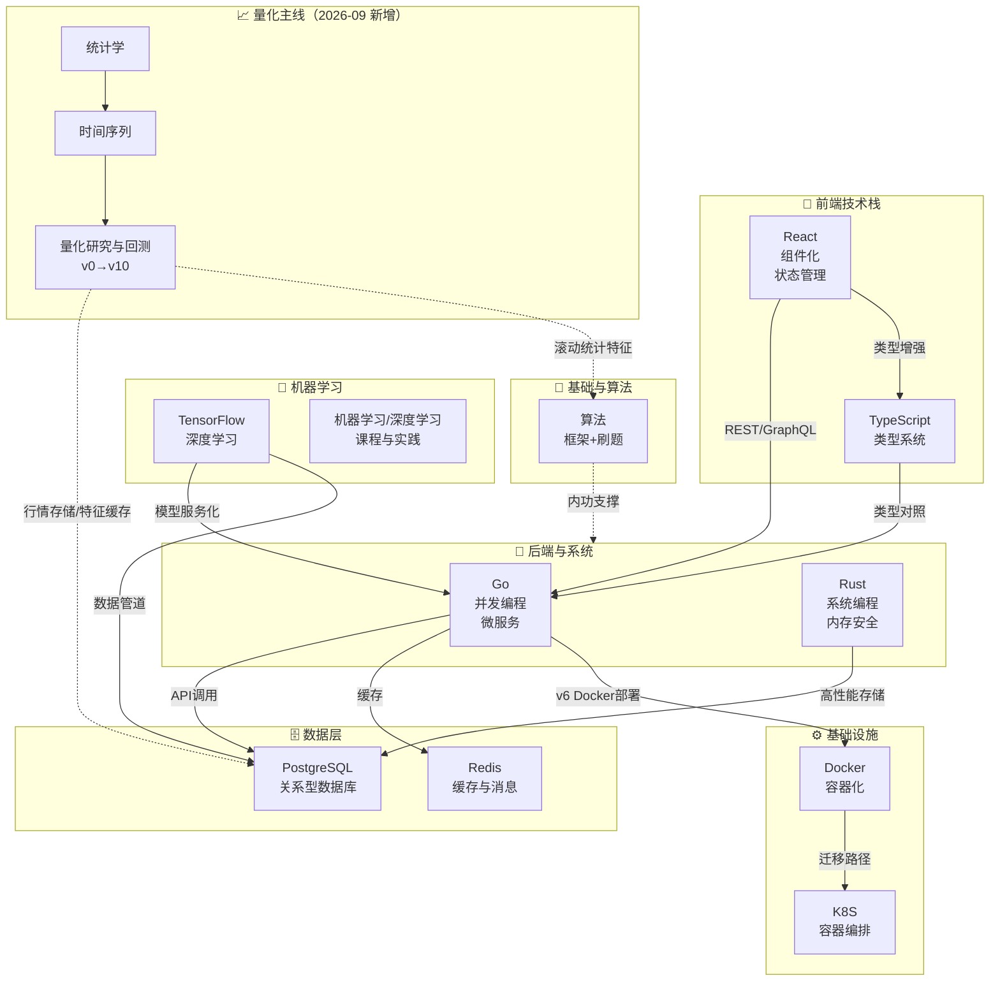
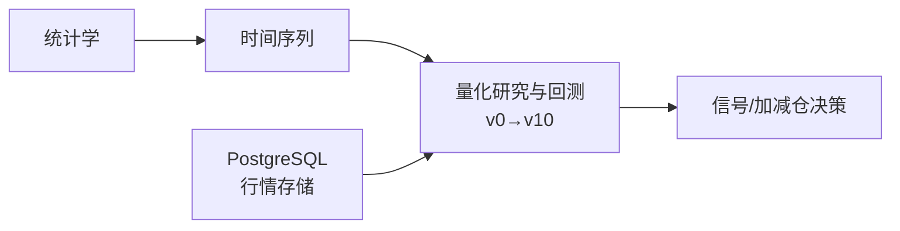
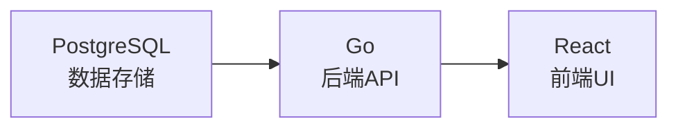

> 📌 **本总览基于 [[03-AI工具/AI协作方法论/技术学习路径审查与优化方法论]] 的方法论构建**，整合全部学习路径，提供跨技术栈的学习规划视角。
> 🔍 各路径的质量状况与已知问题见 [[01-学习/学习笔记总审阅报告|学习笔记总审阅报告]]。

---

## 🗺️ 技术栈全景图

---

## 📊 学习路径对比矩阵（全部 20 个专题）

| 路径 | 类型 | 难度 | 预计学时 | 前置知识 | 状态 |
|------|------|------|---------|---------|------|
| [[01-学习/DockerNew/00-Docker 总览索引\|Docker]] | 从零入门 | ⭐→⭐⭐⭐ | 20-30h | 命令行基础 | ✅ 完整（含 labs/测验） |
| [[01-学习/K8SLearningByDocker/00-K8S 总览索引（Docker 迁移版）\|K8S（Docker迁移）]] | 迁移式 | ⭐⭐→⭐⭐⭐⭐ | 24-39h | Docker 基础 | ✅ 完整（9 篇+6 版毕业项目） |
| [[01-学习/GoLearningByPython/00-Go 总览索引（Python 迁移版）\|Go（Python迁移）]] | 迁移式 | ⭐→⭐⭐⭐⭐ | 29-61h | Python 基础 | ✅ 完整（13 篇+v1-v6） |
| [[01-学习/Rust学习路径/00-Rust学习路径总索引\|Rust]] | 从零入门 | ⭐⭐→⭐⭐⭐⭐⭐ | 70-100h | 任意语言 | ✅ 完整（含 code/v1-v7） |
| [[01-学习/React学习路径/00-React学习路径总索引\|React]] | 从零入门 | ⭐→⭐⭐⭐ | 45-60h | HTML/CSS/JS | ⚠️ 框架完整、正文待充实 |
| [[01-学习/TypeScript学习路径/00-TypeScript学习路径总索引\|TypeScript]] | 从零入门 | ⭐⭐→⭐⭐⭐⭐ | 45-55h | JS 基础 | ✅ 正文扎实（v2-v7 参考实现待补） |
| [[01-学习/TypeScriptLearningByPython/00-TypeScript 总览索引（Python 迁移版）\|TypeScript（Python迁移）]] | 迁移式 | ⭐→⭐⭐⭐⭐ | 25-30h | Python 基础 | ✅ 完整 |
| [[01-学习/PostgresqlLearningByMySql/00-PostgreSQL 总览索引（MySQL 迁移版）\|PostgreSQL（MySQL迁移）]] | 迁移式 | ⭐⭐→⭐⭐⭐⭐ | ~40h | MySQL 基础 | ✅ 完整（10 篇+v0-v7） |
| [[01-学习/Redis学习路径/00-Redis学习路径总索引\|Redis]] | 从零入门 | ⭐⭐→⭐⭐⭐ | 30-40h | 任意语言 | ✅ 完整（含 code 实操） |
| [[01-学习/TensorflowLearningBySklearn/00-TensorFlow 总览索引（Sklearn 迁移版）\|TensorFlow（Sklearn迁移）]] | 迁移式 | ⭐⭐→⭐⭐⭐⭐ | 42-48h | Sklearn/Python | ✅ 完整（11 篇+v1-v5） |
| [[01-学习/TensorflowLearningBySklearn/Transformer/T0-Transformer 路径总览\|Transformer 专题]] | 进阶 | ⭐⭐⭐→⭐⭐⭐⭐⭐ | ~30h | TF/Keras 基础 | ✅ 完整（T0-T9） |
| [[01-学习/TensorflowLearningBySklearn/TFX/X0-TFX 路径总览\|TFX 专题]] | 进阶 | ⭐⭐⭐⭐ | ~20h | TF 基础 | ✅ 完整（X0-X7） |
| [[01-学习/TensorflowLearningBySklearn/分布式训练/D0-分布式训练 路径总览\|分布式训练专题]] | 进阶 | ⭐⭐⭐⭐ | ~15h | TF 基础 | ✅ 完整（D0-D7） |
| [[01-学习/机器学习/总览索引\|机器学习]] | 课程笔记 | ⭐⭐→⭐⭐⭐ | 按课程 | Python 基础 | 🔄 持续积累（极客时间课程） |
| [[01-学习/程序员的AI开发第一课/总览索引\|程序员的AI开发第一课 🆕]] | 课程剪藏 | ⭐⭐→⭐⭐⭐ | 按课程 | Python/编程基础 | ✅ 剪藏齐全（25 篇，2026-09-23） |
| [[01-学习/深度学习/总览索引\|深度学习]] | 加工笔记 | ⭐⭐⭐ | 按需 | 机器学习基础 | 🔄 持续积累 |
| [[01-学习/模型评估/总览索引\|模型评估]] | 加工笔记 | ⭐⭐⭐ | 按需 | 机器学习基础 | 🔄 持续积累 |
| [[01-学习/算法/基础概念/算法总览索引\|算法]] | 框架+刷题 | ⭐→⭐⭐⭐⭐⭐ | 长期 | 任意语言 | 🔄 持续刷题 |
| [[01-学习/统计学/00-统计学学习路径总索引\|统计学 🆕]] | 从零入门 | ⭐⭐→⭐⭐⭐⭐ | 30-40h | Python 基础 | 🚧 骨架已立项（2026-09） |
| [[01-学习/时间序列/00-时间序列学习路径总索引\|时间序列 🆕]] | 从零入门 | ⭐⭐⭐→⭐⭐⭐⭐ | 35-50h | 统计学基础 | 🚧 骨架已立项（2026-09） |
| [[01-学习/量化研究/00-量化研究与回测学习路径总索引\|量化研究与回测 🆕]] | 主线中枢 | ⭐⭐⭐⭐ | 50-70h | 统计学+时间序列 | 🚧 骨架已立项（2026-09） |

---

## 🚦 学习优先级分层（2026-09）

> 背景：全库已完成第一轮纠错（见 [[01-学习/学习笔记总审阅报告|总审阅报告]]），当前主要矛盾已从"内容错误"转为"学习重心与目标项目（涨跌预测 + 加减仓决策）不匹配"。以下分层决定时间投入顺序，**分层是软约束，不移动任何文件**。

| 层级 | 定位 | 专题 |
|------|------|------|
| **A 核心** | 现在必须学，直接服务量化主线 | 机器学习、模型评估、**统计学🆕**、**时间序列🆕**、**量化研究与回测🆕**、PostgreSQL、Docker |
| **B 支撑** | 项目会用到，按需深入 | Redis、Go、TensorFlow、Transformer、深度学习 |
| **C 暂缓** | 项目打通后再投入 | K8S、TFX、分布式训练、Rust、React、TypeScript（两条路径） |
| **D 长期** | 并行维护、不设毕业期限 | 算法 |

补充约定：

- **React / TypeScript 冻结新增投入**（React 本就"正文待充实"，维持现状即可）。
- C 层各路径**只做维护性修订**（版本差异注记、错误修复），不新增课程内容。
- 算法路径已挂接量化场景：见前缀和 / 滑动窗口 / 堆三篇的"量化场景应用"一节。

---

## 🆕 量化主线立项（2026-09）

三个新专题承接"学习内容 → 特征工程 → 模型 → 时序验证 → 回测 → 信号 → 加减仓决策"的闭环：

1. **[[01-学习/统计学/00-统计学学习路径总索引|统计学]]** — 概率基础 → 假设检验/置信区间 → 相关与回归 → 最大似然/偏差-方差 → Bootstrap/Monte Carlo。解决"怎么判断结果是不是巧合"。
2. **[[01-学习/时间序列/00-时间序列学习路径总索引|时间序列]]** — 平稳性/ADF/ACF-PACF → AR/MA/ARIMA → 金融时间序列特化（log return、波动率、回撤、滚动统计）→ 状态空间/Kalman。涨跌预测的本体。
3. **[[01-学习/量化研究/00-量化研究与回测学习路径总索引|量化研究与回测]]** — 数据泄漏（look-ahead/survivorship/snooping）→ 特征工程 → 时序交叉验证（Walk-Forward/Purged CV/Embargo）→ 回测与交易成本 → 策略评价指标 → 实验记录规范。主线的中枢，向上连接工程层（PostgreSQL/Redis/Go/Docker）。

---

## 🧪 量化毕业项目实验版本线（v0→v10）

> 与工程路径的 v1→v7（软件工程视角）不同，量化项目的版本递进是**实验视角**：每个版本 = 一次可复现的实验，产出记录而非文章。

| 版本 | 目标 | 关键内容 |
|------|------|---------|
| v0 | 数据基线 | 行情获取/复权/落库（PostgreSQL）、数据质量检查 |
| v1 | Naive baseline | 昨日收益外推 / 均值策略，建立评估底座 |
| v2 | 线性基线 | Logistic/线性回归 + 严格时序切分 |
| v3 | 树模型 | LightGBM/XGBoost + 特征重要性 |
| v4 | 特征工程 | 滚动统计/截面因子（衔接算法篇量化应用） |
| v5 | 时序验证 | Walk-Forward / Purged CV + Embargo |
| v6 | 集成 | 模型融合，控制调参预算防 data snooping |
| v7 | 信号与仓位 | 预测 → 信号 → 加减仓映射 |
| v8 | 交易成本 | 手续费/滑点/换手率约束下重测 |
| v9 | 风控 | 最大回撤/敞口限制/止损规则 |
| v10 | 生产推理 | Model Registry + 定时推理（衔接 Go/Redis/Docker） |

**每次实验必记录的字段**：Experiment ID、数据集版本、特征版本、模型版本、超参数、训练/验证/测试窗口、模型指标、回测指标、Git commit、随机种子、运行环境。

---

## 🎯 角色化学习路线

### 📈 量化研究路线（当前最高优先级）

**推荐顺序**：统计学 → 时间序列 → 量化研究与回测（沿 v0→v10 实验线推进）
**工程支撑**：PostgreSQL（行情库）→ Docker（环境隔离）→ Redis（特征/状态缓存）→ Go（推理服务）
**定位**：服务"预测未来几日涨跌 + 辅助加减仓/持仓决策"项目。

### 🛠️ 全栈工程师路线

**推荐顺序**：
1. **PostgreSQL**（MySQL 基础→迁移版，~27h）
2. **Go**（Python 基础→迁移版，29h 核心）→ 后端 API 与微服务
3. **React + TypeScript**（~60h）→ 前端组件与状态管理

**技术交叉点**：Go + PostgreSQL（pgx 驱动、连接池、事务）；React + Go（RESTful API、WebSocket）；TS 类型贯穿前后端。

### ⚡ 高性能系统工程师路线

**推荐顺序**：Go（并发）→ Rust（所有权与零成本抽象）→ PostgreSQL（查询优化）
**技术交叉点**：Rust + Go（FFI/cgo）；Rust + PG（高性能计算下推）；算法篇的内功支撑。

### 🤖 AI/ML 工程师路线

**推荐顺序**：
1. **机器学习/深度学习**（课程+实践笔记）打基础
2. **TensorFlow 迁移版**（Sklearn→TF，01-11 + v1-v5）
3. **Transformer / TFX / 分布式训练** 三个进阶专题
4. **Go**（模型服务化）/ **Redis**（特征缓存）

**技术交叉点**：TF + PG（特征存储）；TF + Go（tfserving、gRPC）；TF + Docker/K8S（训练与部署容器化）。

### 🧮 算法面试路线

**[[01-学习/算法/基础概念/算法总览索引|算法路径]]**：基础概念框架篇（35 篇）→ LeetCode/牛客网题解，配合各路径的"面试高频 20 问"（Go/PG/TF/K8S/Docker 各有）。

---

## 🚀 快速启动指南

### 如果你只有 50h
- 后端 → [[01-学习/GoLearningByPython/00-Go 总览索引（Python 迁移版）|Go（Python 迁移版）]]
- 前端 → [[01-学习/React学习路径/00-React学习路径总索引|React]]（先补 [[01-学习/TypeScript学习路径/00-TypeScript学习路径总索引|TypeScript]]）
- 数据 → [[01-学习/PostgresqlLearningByMySql/00-PostgreSQL 总览索引（MySQL 迁移版）|PostgreSQL（MySQL 迁移版）]]
- 运维 → [[01-学习/DockerNew/00-Docker 总览索引|Docker]]

### 如果你有 100h
- 全栈 → Go + React + PostgreSQL（精简版）
- AI 方向 → 机器学习笔记 + TensorFlow 迁移版 + Transformer 专题

### 如果你有 200h+
按上述角色路线选 3-4 条路径，并完成毕业项目 v1→v7。

---

## 📈 学习方法论

所有路径均遵循 [[03-AI工具/AI协作方法论/技术学习路径审查与优化方法论]]，迁移式路径额外遵循 [[03-AI工具/AI协作方法论/迁移式学习路径创建方法论]]：

| 方法论要素 | 实现方式 |
|-----------|---------|
| 版本基线 | 每条路径 00 索引声明所依赖的版本（2026-08 审阅后补齐） |
| 三维审查 | 每条路径均有 `reviews/` 目录（结构/技术/体验）+ 总审阅报告 |
| 难度递进 | ⭐→⭐⭐⭐⭐⭐ 五级标注 |
| 学完自检 | 每篇笔记的 🟢/🟡/🔴 三级清单 |
| 交叉引用 | 每篇笔记的 ⬅️前置 / ➡️后续 / 🔗关联 |
| 版本递进 | 毕业项目 v1→v7 渐进式改造 |
| 迁移式路径 | 以已知技术为锚点 + 双向对比 + 复习检查点 + v1→vN 毕业项目 |

---

## 🎓 下一步行动

1. **选择你的角色路线**（**当前优先：量化研究**；其余：全栈/高性能/AI/算法面试）
2. **按推荐顺序学习**，每条路径从 00 总索引开始
3. **完成每篇的自检清单**，确保 🟢 全部通过再进入下篇
4. **完成毕业项目 v1→v7**，体会版本递进的设计哲学
5. **跨路径实践**：尝试组合 2 条路径的技术栈做一个综合项目

---

*最后更新：2026-09-23（新增《程序员的AI开发第一课》课程剪藏专题入口）。上一轮 2026-09-06：量化主线立项，统计学/时间序列/量化研究三专题与 A-D 优先级分层。2026-08-23：依据总审阅报告重写，修复旧目录名断链、补齐 Redis/Docker/算法/机器学习等专题）*
