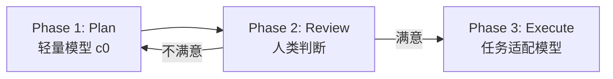

## 前置知识：这套方法论从哪来

2026-07-31 听同事分享了一个工作模式：

> "启用 Plan 模式，先做计划，不改内容。根据 Plan 满意再执行、不满意再改 Plan。执行时会自动重新选模型。这样 Plan 和执行会独立判断使用合适的模型。用了几轮感觉还不错。"

这段话的精妙之处在于——它不是让一个强模型又要想又要做（贵），也不是让一个弱模型从头干到尾（质量差），而是**让便宜的模型想清楚，让强的模型精准执行**。

> [!important] 与其他方法论的关系
> - **[[03-AI工具/AI协作方法论/双Agent对抗博弈方法论|对抗博弈方法论]]** 解决的是"两个 Agent 怎么博弈出更好内容"——双视角交叉碰撞
> - **[[03-AI工具/AI协作方法论/技术学习路径审查与优化方法论|审查方法论]]** 解决的是"一个 Agent 怎么审好已有内容"——单视角深度审查
> - **本文（Plan-Execute）** 解决的是"同一个 Agent 怎么用最少的钱把事办好"——计算资源分层
> - 三者可组合使用：Plan-Execute 出方案 → 对抗博弈优化方案 → 审查方法论收尾

---

## 一、为什么这个模式有效

### 1.1 规划与执行是两种不同的认知任务

| 阶段 | 认知特征 | 适合的模型特质 |
|------|---------|--------------|
| **规划** | 结构化思维、分解任务、评估路径 | 推理能力强、成本低、速度快 |
| **执行** | 代码生成、文件操作、细节实现 | 代码能力强、精准度高 |

让一个模型同时做两件事，要么规划粗糙（便宜模型的短板），要么执行浪费（强模型的 token 贵）。分层后各取所长。

### 1.2 人在中间做 Review Gate

传统模式是"描述需求 → AI 一口气输出"，一旦方向跑偏，修正成本极高（可能已经改了一堆文件）。

Plan-Execute 模式在中间加了一道**人类审查关卡**：

```
需求 → [便宜模型] → 计划 → [人类审查] → [强模型] → 执行结果
                              ↑
                         不满意就改计划
                         成本极低
```

改计划的成本几乎为零（便宜模型 + 纯文本），改代码的成本可能很高（强模型 + 文件操作 + 可能需要回滚）。

### 1.3 Token 经济学

| 场景 | 单模型模式 | Plan-Execute 模式 |
|------|-----------|------------------|
| 规划阶段 | 强模型，贵 | 弱模型，便宜 |
| 迭代计划 | 强模型，更贵 | 弱模型，依然便宜 |
| 执行阶段 | 强模型，正常 | 强模型，正常 |
| 方向跑偏修正 | 强模型回滚 + 重新执行，很贵 | 弱模型改计划 + 重新执行，省很多 |

> [!tip] 核心洞察
> 大多数任务的 token 消耗集中在**规划迭代**上（想清楚要做什么），而不是执行本身。把迭代成本降下来，整体就省了。
> 以 OpenSquilla 为例，Plan 阶段用 c0（最便宜），即使迭代 3 轮，成本也远低于 1 轮 c3。总体可省 60-70% token 开销。

> [!tip] 更深层的收益：你敢迭代了
> Plan 阶段用强模型时，每次改一轮都心疼，倾向于"差不多就执行了"；用便宜模型时可以反复调到满意，Plan 质量更高，执行反而更顺利。

---

## 二、三阶段流程



### 2.1 Phase 1: Plan（轻量模型）

**目标**：输出结构化计划，不碰代码不改文件。

1. 切换到轻量模型（如 `tier:c0` deepseek-v4-flash）
2. 分析需求，可以读文件、搜代码、看目录来理解上下文
3. 输出结构化计划：
   - 编号步骤 + 清晰描述
   - 涉及文件（创建 / 修改 / 删除）
   - 关键决策和权衡
   - 每步复杂度预估
4. 结尾提示：**"确认这个计划后我会执行。需要调整吗？"**

**规则**：
- ❌ 不写代码、不改文件、不产生副作用
- ✅ 可以读文件、搜索代码、查看目录（为了写出靠谱的计划）

### 2.2 Phase 2: Review & Iterate（人类把关）

| 用户反馈 | 下一步动作 | 模型 |
|---------|-----------|------|
| ✅ 满意（"执行"、"OK"、"没问题"、"确认"） | → 进入 Phase 3 | 切换到执行模型 |
| ✗ 需要调整（具体反馈） | → 回 Phase 1 修订计划 | 仍用轻量模型 c0 |
| ✗ 放弃（"算了"、"不要了"） | → 恢复自动路由，结束 | clear_hold |

> 迭代优化：改计划时只展示变动的步骤，不全量重刷，进一步省 token。

### 2.3 Phase 3: Execute（强模型）

**目标**：按计划精准执行。

1. 根据任务类型选择模型：

   | 任务类型 | 推荐模型 | target_id |
   |-----------|---------|-----------|
   | 代码密集（编写、重构、调试） | kimi-k2.7-code | `tier:c2` |
   | 通用开发 / 混合任务 | deepseek-v4-pro | `tier:c1` |
   | 复杂推理、分析、研究 | glm-5.2 | `tier:c3` |

2. 切换到对应模型
3. 逐步执行计划
4. 完成后恢复自动路由（`clear_hold`）
5. 简要总结执行结果

---

## 三、什么时候用 / 什么时候不用

### ✅ 适合用的场景

- 涉及多文件修改的任务
- 需求不够明确、可能需要反复讨论的任务
- 预算敏感、想省 token 的日常开发
- 复杂功能开发，需要先理清思路再动手
- 需要向团队/同事展示方案再执行的协作场景

### ❌ 不适合用的场景

- 简单单文件修改（< 20 行）——直接做更快
- 已经很明确的小任务——Plan 阶段是多余的开销
- 纯问答、纯对话——不涉及"执行"
- 紧急 hotfix——先修再说

> [!warning] 过度规划的陷阱
> 如果任务本身就很简单，硬走 Plan 流程反而浪费时间。经验法则：**如果一个任务的计划超过 3 步，才值得走 Plan-Execute**。

### 常见陷阱

- **Plan 太粗**：执行阶段模型无法理解意图，导致返工
- **Plan 太细**：Plan 阶段就消耗了大量 token，失去分层的意义
- **跳过 Review**：人类不参与审查，容易在错误方向上执行到底

---

## 四、OpenSquilla 落地实现

已创建 `plan-execute` Skill，自动化了以下行为：

- **触发词**：`Plan 模式` / `Plan mode` / `先做计划` / `先计划再执行` / `plan then execute`
- 自动调用 `router_control` 切换模型档位
- Plan 阶段锁定 `tier:c0`，执行阶段按任务类型自动选择
- 完成后自动 `clear_hold` 恢复路由

### 手动触发示例

```
用户：Plan 模式：帮我给这个项目加个日志中间件

→ 自动切到 c0
→ 输出计划（步骤、文件、决策）
→ 等待确认

用户：第三步改成用 winston 而不是 pino

→ 留在 c0，只更新第三步

用户：执行

→ 切到 c2（代码任务），逐步执行
→ 完成后恢复路由
```

### Skill 文件位置

```
C:\Users\Turn-\.opensquilla\workspace\skills\plan-execute\SKILL.md
```

### 4.1 一个常见困惑：UI 的 Plan 模式 vs plan-execute Skill

> 2026-08-24 更新：界面左下角加号里也出现了一个 **Plan 模式**，容易和 `plan-execute` Skill 混淆。两者**不是同一个东西**，但理念同源，且**能叠加使用**。

| 对比维度 | 界面左下角的 Plan 模式 | `plan-execute` Skill |
|---------|---------------------|----------------------|
| 层级 | 应用/界面功能 | 智能体行为规范（Skill） |
| 触发方式 | 手动点图标 | 发一句「Plan 模式」等触发词 |
| 核心作用 | **行为约束**：强制当前会话只规划、不修改文件 | **模型分层**：规划用轻量模型、执行用强模型 |
| 主要价值 | 安全（可逆转、防乱改代码） | 省钱（便宜想 + 贵做） |
| 管不管模型 | ❌ 不管，同一模型只是被禁掉动手权限 | ✅ 管，自动切换 c0→任务适配模型 |

**一句话区别**：

> 左下角 Plan = **「不许动手」**（安全开关，管权限）
> plan-execute Skill = **「便宜想贵做」**（模型分层，管成本）

> [!warning] 注意：UI Plan 本身并不省 Token
> 左下角 Plan 模式只是**行为约束**（禁止改文件），并不切换模型档位——这时期规划大概率仍跑在强模型上，token 照花。真正的省钱点在于 Skill 的 `router_control` 自动切 c0（最便宜档位）做规划。所以：**想省钱不能只点 UI Plan，必须配合 plan-execute Skill 才拿得到 token 红利。**

**两者能叠加，最优打法两层并用**：

```
① 点左下角加号 → Plan 模式（安全防线：只规划、不碰文件）
    → 满意后退出 Plan 模式
② 发「Plan 模式」触发词 / 或直接说「执行」
    → plan-execute Skill 自动切到强模型跑
```

这样既拿到「不轻易动文件」的安全感，又拿到「便宜规划 + 强执行」的 token 分层，互不冲突、1+1>2。

---

## 五、进阶组合

### 与对抗博弈组合

对于高风险交付件：

```
Plan-Execute 出初版方案
    → 对抗博弈：A 执行 / B 审查，博弈优化
        → 审查方法论：最终质量把关
```

### 与 Cron 定时任务组合

对于定期执行的 Plan 类任务（如每周代码审查、定期报告生成）：

```
Plan 阶段：cron 定期触发，轻量模型生成计划
    → 人类审批
        → Execute 阶段：强模型执行
```

---

## 六、一句话总结

> **让便宜的模型负责"想清楚"，让合适的模型负责"做出来"，让你自己负责"把关"。**

---

## 关联笔记

- [[03-AI工具/AI协作方法论/双Agent对抗博弈方法论]] — 双视角博弈提升质量
- [[03-AI工具/AI协作方法论/技术学习路径审查与优化方法论]] — 单视角深度审查
- [[03-AI工具/AI协作方法论/迁移式学习路径创建方法论]] — 基于已有技术栈迁移学习
- [[03-AI工具/AI协作方法论/总览索引]] — 方法论总入口
